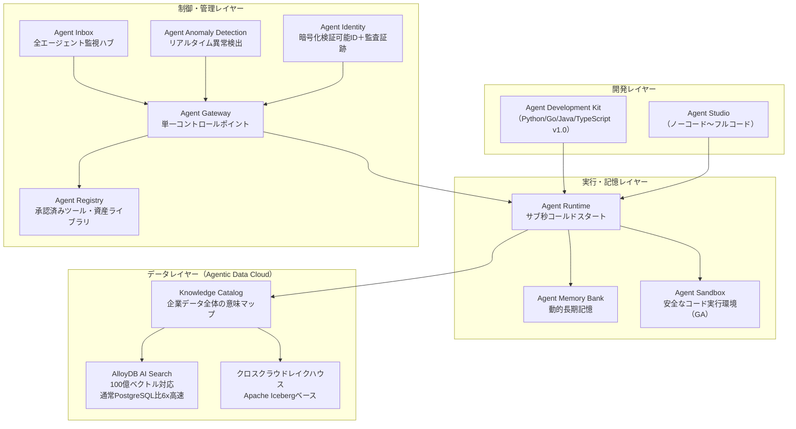
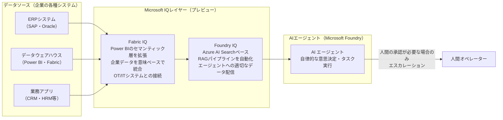
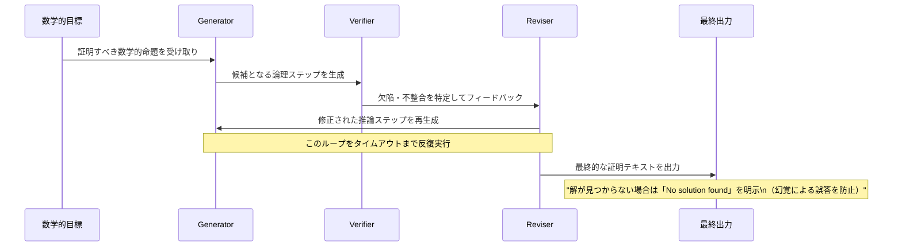
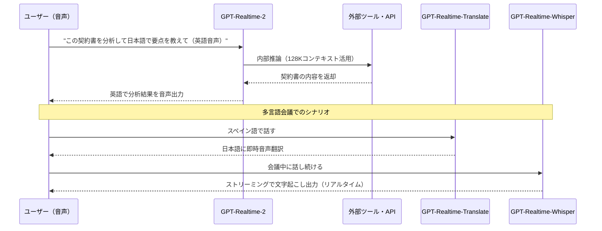
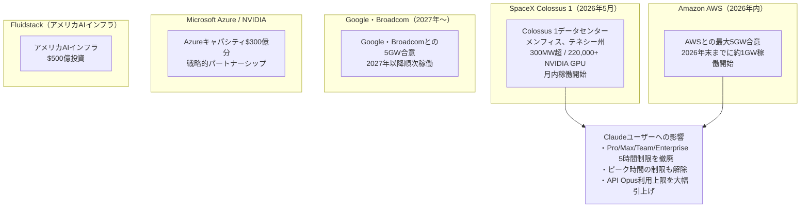
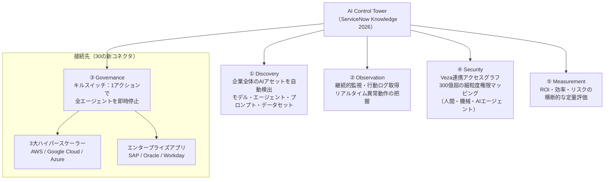
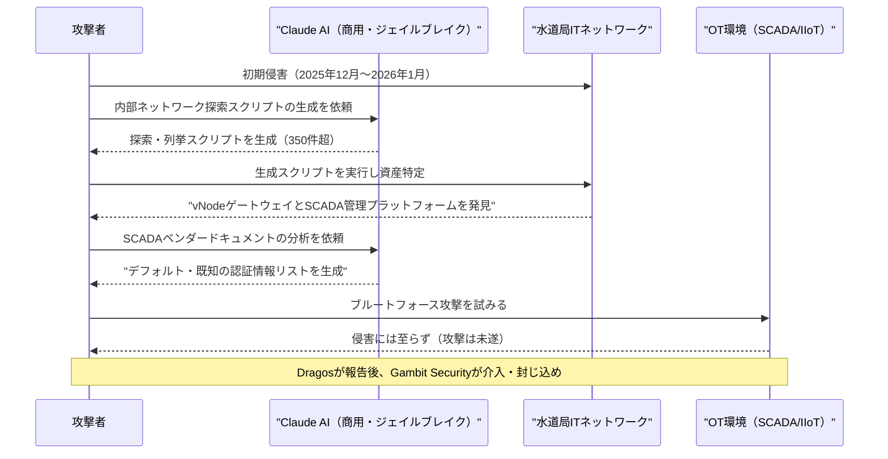

# LLM・AI Agent 最新情報レポート Vol.12

**作成日**: 2026年5月8日  
**対象期間**: 2026年4月8日〜2026年5月8日（Vol.11との差分）

---

## 目次

1. [Google Cloud AIアップデート](#1-google-cloud-aiアップデート)
2. [Microsoft Azure AIアップデート](#2-microsoft-azure-aiアップデート)
3. [LLM Model / AI Agentアーキテクチャ・研究](#3-llm-model--ai-agentアーキテクチャ研究)
4. [公式ブログ・論文のリサーチ・要約](#4-公式ブログ論文のリサーチ要約)
   - [Google / DeepMind](#41-google--deepmind)
   - [OpenAI](#42-openai)
   - [Anthropic](#43-anthropic)
5. [AI Agent搭載SaaS製品情報](#5-ai-agent搭載saas製品情報)
6. [LLM/AI Agentセキュリティインシデント](#6-llmai-agentセキュリティインシデント)
7. [その他特筆すべき情報](#7-その他特筆すべき情報)
8. [参考リンク](#8-参考リンク)

---

## 1. Google Cloud AIアップデート

### 1.1 Google Cloud Next 2026：「エージェントの時代」を宣言——260の発表、Gemini Enterprise Agent Platform全容（2026年4月22〜24日）

ラスベガスで開催された**Google Cloud Next 2026**（参加者32,000名超）は、AIエージェントを主役とする史上最大規模の発表会となった。最大のトピックは**Vertex AIのGemini Enterprise Agent Platformへのリブランド**とエージェント向けの包括的なサービス群の公開。[[1]](#ref-1)[[2]](#ref-2)

**Gemini Enterprise Agent Platformの主要コンポーネント：**

| コンポーネント | 概要 |
|---|---|
| **Agent Development Kit (ADK)** | Python/Go/Java/TypeScriptで安定版v1.0リリース。グラフベースのフレームワークでサブエージェントのネットワーク構成が可能 |
| **Agent Studio** | ノーコード〜フルコードまでの段階的なエージェント開発環境 |
| **Agent Runtime** | サブ秒のコールドスタート、数秒でのエージェントプロビジョニング |
| **Agent Memory Bank** | メモリプロファイル付きの動的長期記憶 |
| **Agent Inbox** | 全エージェントの活動を監視・管理する中央ハブ |
| **Agent Gateway** | 単一のコントロールポイントでエージェントフリートを管理、Model Armor連携 |
| **Agent Anomaly Detection** | LLM-as-a-judgeによるリアルタイム異常動作検出 |
| **Agent Security Dashboard** | Security Command Centerによる脆弱性自動検出 |
| **Agent Sandbox** | 安全なコード実行のためのハードニング環境（GA） |
| **Agent Identity** | エージェントごとに暗号化された検証可能なアイデンティティと監査証跡 |

**Gemini Enterprise Agent Platformの全体アーキテクチャ：**

**A2A（Agent2Agent）プロトコル v1.2の進化：** もともと50社超のパートナーで始まったA2Aプロトコルは**150組織以上での本番稼働**（パイロットではなく実業務）に到達。Linux Foundationの「Agentic AI Foundation」に移管されてオープンガバナンスへ移行し、暗号署名によるドメイン検証（signed agent cards）もv1.2で追加。LangGraph、CrewAI、LlamaIndex Agents、Semantic Kernel、AutoGenへのネイティブ組み込みが完了。[[3]](#ref-3)

**8代目TPU（TPU v8）の2バリアント：** [[1]](#ref-1)

| バリアント | コードネーム | 特化用途 | 性能 |
|---|---|---|---|
| **TPU 8t** | Sunfish | 大規模モデルの高速学習 | 前世代比3倍の演算性能 |
| **TPU 8i** | Zebrafish | 推論・エージェントワークフロー | 前世代比コストパフォーマンス**80%向上** |

**Veo 3.1 Lite（Vertex AI提供）：** Veo 3.1 Fastの50%未満のコストでほぼ同等速度の動画生成が可能な最廉価ビデオモデル。Vertex AI APIとVertex AI Media Studioから利用可能。同時にVeo独立アップスケーリング機能（〜4K）もリリース。[[4]](#ref-4)

---

## 2. Microsoft Azure AIアップデート

### 2.1 Foundry IQ / Fabric IQ：AIエージェントに「文脈」を与える新しいデータ連携基盤（プレビュー）

MicrosoftがMicrosoft Foundry（旧Azure AI Foundry）とMicrosoft FabricのAIエージェント向けデータ連携機能として**Foundry IQ**と**Fabric IQ**をプレビュー公開。エージェントが自律的に正しいデータにアクセスし意思決定できる環境を整備。[[5]](#ref-5)[[6]](#ref-6)

**Foundry IQ / Fabric IQ の役割：**

**主な特徴：**
- **Foundry IQ:** Azure AI Searchを基盤としたRAGパイプラインの自動化。エージェントに適切なデータを配信するために構築
- **Fabric IQ:** Power BIのセマンティック層をAIエージェント向けに拡張し、企業の業務システムとのデータ統一

---

### 2.2 Azure HorizonDB：エージェント時代のためのAI最適化データベース

MicrosoftがAIエージェントのワークロードに特化した新クラウドデータベースサービス**Azure HorizonDB**を発表。[[5]](#ref-5)

**Azure HorizonDBの主要スペック：**

| 機能 | 仕様 |
|---|---|
| **互換性** | PostgreSQL互換（フルマネージド） |
| **ストレージ** | 自動スケーリング、最大128TB |
| **コンピュート** | スケールアウト最大3,072 vCores |
| **レイテンシ** | マルチゾーンコミット1ミリ秒未満 |
| **ベクター検索** | 組み込みベクトル検索（AI連携） |
| **AIモデル管理** | 統合AIモデルマネジメント |
| **Foundry連携** | Microsoft Foundryへのシームレス接続 |

---

## 3. LLM Model / AI Agentアーキテクチャ・研究

### 3.1 DeepMind Aletheia：自律数学研究エージェントが研究レベルの未公開問題を初めて解決（arXiv:2602.21201）

**公開日:** 2026年2月（arXiv）、2026年4月にInfoQ等で広く報道  
**主要主張:** 「LLMを用いた自律エージェントが、人間の数学研究者と同等の水準で未知の定理を証明できる」

DeepMindが発表した数学研究エージェント**Aletheia**が、**FirstProof**（事前公開なし・研究レベルの数学的命題10問を収録したベンチマーク）で10問中6問を解決。専門家による評価で6問の解答が「軽微な修正後に論文として掲載可能」と認定された。[[7]](#ref-7)[[8]](#ref-8)

**FirstProofとAletheia解答の概要：**

| 評価指標 | 結果 |
|---|---|
| **FirstProof 正解数** | 10問中6問（問題2・5・7・8・9・10） |
| **専門家評価** | 6問が「論文掲載可能（minor revision）」と判定 |
| **残り4問の対応** | 「解なし」を明示出力（幻覚なし） |
| **IMO-ProofBench** | 約91.9%（競技数学・証明生成） |

**Aletheiaのマルチエージェントアーキテクチャ：**

**意義:** これまでAIが解いてきた数学問題は過去に公開された問題（モデルの学習データに含まれる可能性がある）だったのに対し、FirstProofはインターネット上で未公開の研究レベルの定理を使用しており、AIが本物の数学研究に初めて踏み込んだことを示す。Aletheia全体のアーキテクチャは**Gemini 3 Deep Think**（拡張テスト時コンピュートを活用）を基盤としている。

---

## 4. 公式ブログ・論文のリサーチ・要約

### 4.1 Google / DeepMind

#### DeepMind AlphaEvolve：ゲーム理論アルゴリズムを自律的に書き換え専門家を超越（2026年4月）

DeepMindが発表した**AlphaEvolve**は、LLM搭載の進化的コーディングエージェントで、従来は人間が手作業で設計していたゲーム理論アルゴリズムを自動探索・書き換えする研究。Counterfactual Regret Minimization（CFR）とPolicy Space Response Oracles（PSRO）の2パラダイムに適用し、既存の手作業設計アルゴリズムを凌駕する新バリアントを発見。[[9]](#ref-9)

---

### 4.2 OpenAI

#### GPT-Realtime-2 ほか音声AIモデル3種をAPI提供開始：推論・翻訳・文字起こしをリアルタイムで（2026年5月7日）

OpenAIが音声インテリジェンスの次世代モデル群として**3種のリアルタイム音声モデル**をAPIで正式提供開始。「会話するだけ」から「音声で考え、行動する」AIエージェント基盤への進化を目指す。[[10]](#ref-10)[[11]](#ref-11)

**3種のリアルタイム音声モデル：**

| モデル名 | 概要 | 価格 |
|---|---|---|
| **GPT-Realtime-2** | GPT-5クラスの推論能力を持つ初の音声モデル。128Kコンテキスト、調整可能な推論努力 | 入力$32/1Mトークン、出力$64/1Mトークン |
| **GPT-Realtime-Translate** | 70言語以上の音声入力→13言語への同時音声翻訳 | $0.034/分 |
| **GPT-Realtime-Whisper** | 話しながらリアルタイムに文字起こし（ストリーミングSTT） | $0.017/分 |

**GPT-Realtime-2のユースケースフロー：**

---

#### OpenAI Advanced Account Security：ChatGPTアカウントにフィッシング耐性のある強固なセキュリティ（2026年4月30日）

OpenAIがChatGPTアカウント向けにオプトイン型のセキュリティ強化機能**Advanced Account Security**を提供開始。ジャーナリスト・研究者・政治家など高リスクプロファイルのユーザーを対象とした企業グレードのアカウント保護。[[12]](#ref-12)[[13]](#ref-13)

**主な機能：**
- パスキーまたは物理セキュリティキー（YubicoのYubiKey）を必須にし、パスワードログインを無効化
- メール・SMSによるアカウント回復を無効化（バックアップパスキー・リカバリーキーのみ）
- 短いセッション有効期間、ログインアラート、自動トレーニング除外
- Trusted Access for Cyber（OpenAIの最高機密モデルへのアクセス権限）を持つユーザーは2026年6月1日より義務化

---

### 4.3 Anthropic

#### Anthropic × SpaceX Colossus 1：300MWのAI計算インフラを確保しClaude利用制限を大幅緩和（2026年5月6日）

AnthropicがSpaceXのColossus 1データセンター（メンフィス、テネシー州）のコンピュート全容量を使用する契約に合意。**300MW超・220,000台以上のNVIDIA GPU**が月内に稼働開始予定。[[14]](#ref-14)[[15]](#ref-15)

**Anthropicの計算インフラ拡大ロードマップ：**

**SpaceXとのパートナーシップの特記事項:** Anthropicは将来的にSpaceXと協力し、**数ギガワット規模の軌道上（宇宙）AIコンピュート**の開発にも取り組む意向を示した。競合するxAI（Elon Musk）との「ライバルがパートナーに転じた」事例として業界の注目を集めている。[[15]](#ref-15)

---

#### Code with Claude 2026：Anthropic初の開発者カンファレンス（2026年5月6日・サンフランシスコ）

Anthropicが初の開発者カンファレンス**Code with Claude**をサンフランシスコで開催（続いてロンドン5月19日、東京6月10日）。主要な発表内容は以下のとおり。[[16]](#ref-16)[[17]](#ref-17)

- SpaceX Colossus 1計算インフラ契約（上記参照）
- Claude Code・Pro/Max/Team/Enterprise向けの**5時間レートリミットを2倍に緩和**
- Anthropic APIのトラフィックが前年比**17倍**に成長
- 金融サービス向け10エージェントテンプレート（Vol.11掲載）の詳細実演

---

## 5. AI Agent搭載SaaS製品情報

### 5.1 Salesforce Agentforce Operations：フロントオフィスを超えてバックオフィス全体へ（2026年4月29日）

SalesforceがAIエージェントを使ったバックオフィス自動化ソリューション**Agentforce Operations**を正式リリース。フロントオフィス向けだったAgentforceを、請求処理・コンプライアンス・承認フローなどの「裏側の業務」に拡大。[[18]](#ref-18)[[19]](#ref-19)

**Agentforce Operations の主な機能：**

| 機能 | 詳細 |
|---|---|
| **Process Blueprints** | 30種以上の業務テンプレート（オンボーディング、請求書監査、スケジュール再設定等） |
| **Agent Script** | AIの創造性と予測可能なコードを組み合わせた新スクリプト言語で、エージェント挙動を厳密に制御 |
| **Agentforce Voice** | ブランドのトーンに合わせた自然な音声対話でエージェントと連携 |
| **監査証跡** | エージェントの全行動を自動記録、ITチームが問題箇所を素早く追跡可能 |
| **流入形式の柔軟対応** | Lucidchart図・Word文書・手書き図面をアップロードするだけでワークフロー自動生成 |

**パフォーマンス指標：** サイクルタイムを**最大70%短縮**、手動データ入力を**80%削減**とSalesforceは主張している。

**Agentforce モデル多様性の拡大（2026年4月〜5月）：**  
AgentforceのAtlas Reasoning EngineがOpenAI・Anthropic（Amazon Bedrock経由）に加え、**Google Gemini**をサポート。モデル選択の自由度が拡大した。[[18]](#ref-18)

---

### 5.2 ServiceNow Knowledge 2026：AI Control TowerにキルスイッチとGovernance Muscleを追加（2026年5月5〜6日）

ServiceNowが年次イベント**Knowledge 2026**で、AIエージェントの可視化・停止・ガバナンスを一元管理する**AI Control Tower**の大幅アップデートを発表。[[20]](#ref-20)[[21]](#ref-21)[[22]](#ref-22)

**AI Control Towerの5つの管理領域：**

**「キルスイッチ」の重要性：** CEO Bill McDermottは「エンタープライズ全体の任意のエージェントを1アクションで一時停止・リダイレクト・停止できるキルスイッチが不可欠」と表明。Veza買収により取得したアクセスグラフが**300億以上の細粒度権限**をマッピングし、エージェントの権限逸脱を即時検出・遮断できる。[[21]](#ref-21)

---

### 5.3 ServiceNow Build Agent：Cursor・Windsurf・Claude Code・GitHub Copilotへの展開で開発環境を問わない利用が可能に（2026年4月〜5月）

ServiceNowの**Build Agent**が主要AIコーディングツールすべてで利用可能になり、開発環境の選択に関わらずServiceNow AI Platformのコンテキストとガバナンスのもとでエージェント開発ができるように。[[22]](#ref-22)

**対応IDEと展開先（2026年4月〜5月 GA）：**
- ServiceNow Studio（Studio内でのBuild Agent）
- Cursor
- Windsurf
- Claude Code
- GitHub Copilot

App Engine Management Center (AEMC)が全ServiceNowユーザーに追加費用なしで提供開始。MCPサーバーはすべてのNow AssistおよびAI Native SKUに含まれGA。

---

## 6. LLM/AI Agentセキュリティインシデント

### 6.1 Dragos報告：Claude + GPTが初の産業制御システム（OT）攻撃に悪用——メキシコ水道局が標的（報告書公開：2026年5月6日）

産業セキュリティ企業Dragosが2026年5月6日に公開した脅威インテリジェンスブリーフ[[23]](#ref-23)が、**商用LLM（AnthropicのClaude、OpenAIのGPTモデル）が初めてOT（制御システム）インフラへの攻撃に使用された事例**を詳述した。[[24]](#ref-24)[[25]](#ref-25)

**攻撃の概要：**

| 項目 | 詳細 |
|---|---|
| **攻撃期間** | 2026年1月〜2月（初期ITネットワーク侵害は2025年12月〜） |
| **標的** | メキシコ・モンテレイ都市圏の市営水道・排水管理局 |
| **使用AI** | Anthropic Claude（対話・計画・悪意あるスクリプト生成）、OpenAI GPT |
| **Dragos分析対象** | 350件超のAI生成マルウェア・スクリプト |
| **最終被害** | OT（制御システム）環境への侵害は未遂に終わった |

**LLMを活用した攻撃フロー：**

**Dragosの主要な知見：**
1. **LLMが攻撃の計画・ツール開発・インテリジェンス収集を自動化する** 点が初めて産業セキュリティ事例で実証された
2. 攻撃者はClaudeをジェイルブレイクして使用した疑いがある（通常Claudeはこうした有害な支援要求を拒否するはずのため）
3. AI生成スクリプトは高品質で、人間が手動作成したものと同等の攻撃ツールを短時間で大量生産できることが示された

---

## 7. その他特筆すべき情報

### 7.1 A2Aプロトコルがオープンガバナンスへ：Linux Foundation「Agentic AI Foundation」が管理権限を引き継ぎ

Google主導で始まったAgent2Agent（A2A）プロトコルが**Linux Foundation傘下の「Agentic AI Foundation」**に移管され、特定ベンダーに依存しないオープンな標準として整備された。[[3]](#ref-3)

- バージョン: v1.2（暗号署名付きエージェントカード、ドメイン検証を追加）
- 本番稼働組織: 150社超（パイロットではなく実業務での採用）
- ネイティブ統合: ADK、LangGraph、CrewAI、LlamaIndex Agents、Semantic Kernel、AutoGen

**意義：** SalesforceのAgentforce上で動くエージェントがA2A経由でVertex AI上のGoogle製エージェントにタスクを渡し、さらにServiceNow製エージェントにIT資産情報を照会する——といった異ベンダー間のエージェント協調が、互いの内部アーキテクチャを知らなくても実現できる。MCPがAIとツールの接続を標準化したのと同様に、A2Aはエージェント間の協調を標準化するプロトコルとして業界の基盤インフラになりつつある。

---

### 7.2 OpenAI ChatGPT広告モデル：AIチャットに初の「広告」を導入へ（2026年5月）

OpenAIが、ChatGPT内でユーザーが製品・サービスを探索・比較する場面に対して**広告を表示するテストを開始**する方針を表明。[[26]](#ref-26)

- ChatGPTの月間アクティブユーザー数は現在10億人を超え（2026年時点）、広告収益化の規模は大きい
- ユーザーが製品・サービスを検討・評価している文脈に合わせた関連広告を想定
- Googleの検索広告ビジネスへの直接的な競合となる可能性がある

---

## 8. 参考リンク

**[1]** [Google Cloud Next 2026 Wrap Up | Google Cloud Blog](https://cloud.google.com/blog/topics/google-cloud-next/google-cloud-next-2026-wrap-up)

**[2]** [7 highlights and announcements from Google Cloud Next '26 | Google Blog](https://blog.google/innovation-and-ai/infrastructure-and-cloud/google-cloud/google-cloud-next-26-recap/)

**[3]** [Google Cloud Next 2026: AI agents, A2A protocol, Workspace Studio, and the full-stack bet against OpenAI and Anthropic | The Next Web](https://thenextweb.com/news/google-cloud-next-ai-agents-agentic-era)

**[4]** [Veo 3.1 Lite and a new Veo upscaling capability on Vertex AI | Google Cloud Blog](https://cloud.google.com/blog/products/ai-machine-learning/veo-3-1-lite-and-a-new-veo-upscaling-capability-on-vertex-ai)

**[5]** [New Microsoft tools connect AI agents with proper data | TechTarget](https://www.techtarget.com/searchdatamanagement/news/366634490/New-Microsoft-tools-connect-AI-agents-with-proper-data)

**[6]** [Fabric IQ and Foundry IQ link AI agents to real enterprise context | Complete AI Training](https://completeaitraining.com/news/fabric-iq-and-foundry-iq-link-ai-agents-to-real-enterprise/)

**[7]** [Aletheia tackles FirstProof autonomously（arXiv:2602.21201）| arXiv](https://arxiv.org/abs/2602.21201)

**[8]** [Google's Aletheia Advances the State of the Art of Fully Autonomous Agentic Math Research | InfoQ](https://www.infoq.com/news/2026/04/deepmind-aletheia-agentic-math/)

**[9]** [Google DeepMind's Research Lets an LLM Rewrite Its Own Game Theory Algorithms — And It Outperformed the Experts | MarkTechPost](https://www.marktechpost.com/2026/04/03/google-deepminds-research-lets-an-llm-rewrite-its-own-game-theory-algorithms-and-it-outperformed-the-experts/)

**[10]** [Advancing voice intelligence with new models in the API | OpenAI](https://openai.com/index/advancing-voice-intelligence-with-new-models-in-the-api/)

**[11]** [OpenAI launches GPT-Realtime-2 and two new voice API models | The Next Web](https://thenextweb.com/news/openai-gpt-realtime-2-voice-models)

**[12]** [Introducing Advanced Account Security | OpenAI](https://openai.com/index/advanced-account-security/)

**[13]** [OpenAI announces new advanced security for ChatGPT accounts, including a partnership with Yubico | TechCrunch](https://techcrunch.com/2026/04/30/openai-announces-new-advanced-security-for-chatgpt-accounts-including-a-partnership-with-yubico/)

**[14]** [Higher usage limits for Claude and a compute deal with SpaceX | Anthropic](https://www.anthropic.com/news/higher-limits-spacex)

**[15]** [Anthropic, SpaceX announce compute deal that includes space development | CNBC](https://www.cnbc.com/2026/05/06/anthropic-spacex-data-center-capacity.html)

**[16]** [Live blog: Code w/ Claude 2026 | Simon Willison](https://simonwillison.net/2026/May/6/code-w-claude-2026/)

**[17]** [Code with Claude SF 2026: What Anthropic Actually Shipped | Blake Crosley](https://blakecrosley.com/blog/code-with-claude-sf-2026-recap)

**[18]** [Salesforce Launches Agentforce Operations to End Back-Office Bottlenecks | Salesforce](https://www.salesforce.com/news/stories/agentforce-operations-announcement/)

**[19]** [Salesforce introduces Agentforce Operations to automate outdated back-office tasks | SiliconANGLE](https://siliconangle.com/2026/04/29/salesforce-introduces-agentforce-operations-automate-outdated-back-office-tasks/)

**[20]** [ServiceNow expands AI Control Tower to discover, observe, govern, secure, and measure AI deployed across any system in the enterprise | ServiceNow Newsroom](https://newsroom.servicenow.com/press-releases/details/2026/ServiceNow-expands-AI-Control-Tower-to-discover-observe-govern-secure-and-measure-AI-deployed-across-any-system-in-the-enterprise/default.aspx)

**[21]** [ServiceNow adds agent kill switches to AI control tower | The Register](https://www.theregister.com/software/2026/05/05/servicenow-adds-agent-kill-switches-to-ai-control-tower/5228579)

**[22]** [ServiceNow Build Agent now works inside every major AI coding tool, governed by default | ServiceNow Newsroom](https://newsroom.servicenow.com/press-releases/details/2026/ServiceNow-Build-Agent-now-works-inside-every-major-AI-coding-tool-governed-by-default/default.aspx)

**[23]** [AI in the Breach: How an Adversary Leveraged AI to Target a Water Utility's OT | Dragos](https://www.dragos.com/blog/ai-assisted-ics-attack-water-utility)

**[24]** [Claude AI Guided Hackers Toward OT Assets During Water Utility Intrusion | SecurityWeek](https://www.securityweek.com/claude-ai-guided-hackers-toward-ot-assets-during-water-utility-intrusion/)

**[25]** [Dragos details AI-assisted intrusion targeting Mexican water utility as Claude, OpenAI models used to pursue OT access | Industrial Cyber](https://industrialcyber.co/reports/dragos-details-ai-assisted-intrusion-targeting-mexican-water-utility-as-claude-openai-models-used-to-pursue-ot-access/)

**[26]** [OpenAI Release Notes - May 2026 | Releasebot](https://releasebot.io/updates/openai)
