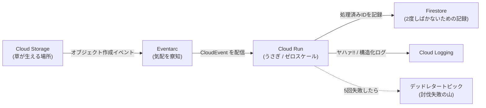

# 【ちいかわ】「ヤハァ!!」と現れて即スケール ― うさぎに学ぶ Google Cloud イベント駆動アーキテクチャ

<!-- x-summary: どこからともなく現れて、草をむしって、フゥンと去っていくうさぎ。あの生態はイベント駆動アーキテクチャそのものだった、という話。Pub/Sub と Eventarc と Cloud Run で「うさぎ」を実際に組み立てる gcloud 手順つきです -->

<!-- og-image: https://raw.githubusercontent.com/NaoyaKinoshita/llm-agent-digest/main/chiikawa/images/2026-08-29_usagi-event-driven/01-usagi-yahaa.jpg -->

こんにちは！

私は普段 Python でアプリケーション（Web の API など）を書いているエンジニアです。この前は島編を借りて Google Cloud の VPC の話を書きましたが、今日はもう少し明るい話をします。**アーキテクチャ設計**の話です。

システムを設計していると、「理想の部品」というものを考えます。障害に強くて、負荷が急に増えても動じなくて、頼まれた仕事を単独で終わらせて、後始末までして去っていく部品。

……そんな都合のいいものが本当にあるのか、と思うじゃないですか。

**あるんですよ。うさぎです。**


> 私の机の上にいるうさぎ（私物）。吹き出しが標準装備なのが、もう完全にログ出力の思想です。

というわけで今日は、うさぎの生態をお借りして、**Google Cloud でイベント駆動アーキテクチャを組む**話をします。後半は実際に手を動かせるように、`gcloud` のコマンドをそのまま並べました。動くところまで持っていきます。

---

## 1. まず、うさぎとは何だったのか

うさぎの行動を、いったん冷静に観察してみます。

- どこから来たのか誰も知らない。**気づくと現れている**
- 「ヤハァ!!」と叫ぶ。とにかく叫ぶ
- 草むしりでも討伐でも、**単独で、圧倒的な速さで片付ける**（草むしり検定2級）
- 終わると「フゥン」と言って**どこかへ消える**
- 前回何があったかを、たぶん**まったく引きずっていない**

これ、クラウドのコンポーネントの理想像を箇条書きにしただけみたいな内容なんですよね。

対比のために、ちいかわ本人にも登場してもらいます。ちいかわはとても良い子ですが、システムの部品としてはかなり手強い性質を持っています。

| | ちいかわ型 | うさぎ型 |
| :--- | :--- | :--- |
| **状態** | 不安・文脈・過去の出来事を内部に抱える（**ステートフル**） | 何も抱えていない（**ステートレス**） |
| **依存** | ハチワレの助けが前提（**密結合**） | 単独で完結（**疎結合**） |
| **異常時** | 固まる・泣く（**ブロッキング**） | 関係なく殴る |
| **待機中** | ずっとそこにいる（**常時起動**） | いない（**ゼロスケール**） |

ここで大事なのは、**ちいかわが悪いわけではない**ということです。状態を持つ部品は必ず必要で、データベースなんてまさにそれです。問題は、**状態を持つ部品と、持たなくていい部品を分けずに全部くっつけてしまうこと**。

くっつけると何が起きるか。**どこか1箇所が泣き崩れると、全体が連鎖して止まります。**

だから設計の目標はこうなります。

> **システムの中に、どれだけ「うさぎ」を置けるか。**

---

## 2. うさぎを Google Cloud に実装する

うさぎの振る舞いを、そのままマネージドサービスに割り当てていきます。

| うさぎの振る舞い | Google Cloud | 何がうれしいか |
| :--- | :--- | :--- |
| 神出鬼没に現れる | **Eventarc / Cloud Pub/Sub** | 呼ぶ側と呼ばれる側が互いを知らなくていい |
| 一瞬で立ち上がる | **Cloud Run** | 暇なときは0インスタンス。来たら一気に並ぶ |
| 単独で片付ける | **ステートレスなコンテナ** | 渡されたペイロードだけで完結する |
| 「ヤハァ」と叫ぶ | **Cloud Logging（構造化ログ）** | 中で何が起きているか外から見える |
| 討伐しそこねた敵 | **デッドレタートピック** | 失敗を握り潰さず、別の場所に積む |

今回作るものの全体像です。**Cloud Storage にファイルが置かれたら、うさぎが現れて処理して、消える**。それだけの構成にします。



点線が大事なところです。**失敗したうさぎの分も、ちゃんと行き先を用意しておきます。**

---

## 3. 3つの設計原則

コマンドに入る前に、この構成が守ろうとしていることを3つだけ。

### ① 呼び出し元をブロックしない

ちいかわが困って固まっていても、うさぎは勝手に動いて敵を倒します。**あの独立性が価値**です。

よくないパターンは、サービス A が サービス B を HTTP で同期呼び出しして、B が C を呼んで……と数珠つなぎにすること。C が遅いと、A の画面まで遅くなります。C が落ちると、A も落ちます。**一番弱いところの弱さが、全員に伝染する**。

間に **Pub/Sub** を挟むと、A は「置いた」で終われます（Fire-and-Forget）。B が今日たまたま調子が悪くても、メッセージはキューに残るだけで、A は何事もなく応答を返します。

### ② ゼロスケールと水平スケール

うさぎは待機していません。**必要な瞬間だけ現れます。**

**Cloud Run** は最小インスタンス数を 0 にできるので、誰も来ない夜間のコストはほぼゼロです。そして、でかつよが10体まとめて出てきたら、コンテナが10個並列で立ち上がります。**縦に強くする（マシンを大きくする）のではなく、横に増やす**のが水平スケールです。

うさぎが強いのは、1体が強いからでもありますが、**何体でも湧けるから**でもあると思うんですよね。

### ③ 冪等性（べきとうせい）

これが今日いちばん覚えて帰ってほしい言葉です。

**冪等性**（Idempotency）とは、**同じ処理を何回やっても結果が変わらない**性質のことです。

Pub/Sub のような分散メッセージングは、**At-least-once delivery（少なくとも1回は届ける）** が基本です。「ちょうど1回」ではありません。ネットワークが不安定だったり、返事が遅れたりすると、**同じメッセージが2回届くことがあります**。

うさぎは勢い余って同じ敵を2回しばいても特に問題ありません。でもシステムだと、「2回目の請求」「2通目のメール」「二重登録」が発生します。これは破綻です。

なので、**2回来ても平気なように作っておく**。具体的には後で書きます。

---

## 4. 作ってみる ― 準備

ここから実際に組みます。プロジェクトと変数を用意しておきます。

```bash
export PROJECT_ID="my-usagi-project"
export REGION="asia-northeast1"
export BUCKET="gs://${PROJECT_ID}-kusa"     # 草の生える場所
export SERVICE="usagi"                       # うさぎ本体

export PROJECT_NUMBER="$(gcloud projects describe ${PROJECT_ID} --format='value(projectNumber)')"

gcloud config set project "${PROJECT_ID}"

# 必要な API をまとめて有効化
gcloud services enable \
  run.googleapis.com \
  eventarc.googleapis.com \
  pubsub.googleapis.com \
  storage.googleapis.com \
  firestore.googleapis.com \
  cloudbuild.googleapis.com \
  artifactregistry.googleapis.com
```

次に**サービスアカウント**（人間ではなく、プログラムが使うアカウント）を2つ作ります。片方はうさぎ自身、もう片方はうさぎを呼び出す側です。

```bash
# うさぎ本体が名乗るアカウント
gcloud iam service-accounts create sa-usagi \
  --display-name="Usagi worker"

# イベントを配達する側のアカウント
gcloud iam service-accounts create sa-eventarc \
  --display-name="Eventarc invoker"

export SA_USAGI="sa-usagi@${PROJECT_ID}.iam.gserviceaccount.com"
export SA_EVENT="sa-eventarc@${PROJECT_ID}.iam.gserviceaccount.com"
```

**なぜ2つに分けるのか。** 「呼ぶ権限」と「処理する権限」は別物だからです。デフォルトのアカウントを使い回すと、うさぎが必要以上に強くなります。強すぎるうさぎは、間違えたときの被害も大きい。

---

## 5. 作ってみる ― うさぎ本体（Cloud Run）

処理の中身です。**FastAPI** で書きます。**CloudEvent** という形式（イベントの共通フォーマット）で HTTP POST が飛んでくるので、それを受けるだけです。

```python
# main.py
import json
import logging
from typing import Annotated

from fastapi import Body, FastAPI, Header, HTTPException, Response
from google.cloud import firestore

app = FastAPI()
db = firestore.Client()


def yahaa(message: str, **fields) -> None:
    """ヤハァ!! と叫ぶ（構造化ログ出力）"""
    # Cloud Logging は1行の JSON をそのままログの構造として拾ってくれる
    print(json.dumps({"severity": "INFO", "message": message, **fields}), flush=True)


@app.post("/", status_code=204)
def handle(
    payload: Annotated[dict, Body(default_factory=dict)],
    ce_id: Annotated[str | None, Header()] = None,      # ヘッダ ce-id が入る
    ce_subject: Annotated[str, Header()] = "",          # ヘッダ ce-subject が入る
) -> Response:
    # 1. イベントの一意な ID を確認する（重複判定のカギ）
    if not ce_id:
        # ID がないものは再送されても判定できないので受け取らない
        raise HTTPException(status_code=400, detail="no ce-id")

    # 2. 冪等性チェック：すでにしばいた敵かどうか
    doc_ref = db.collection("processed_events").document(ce_id)
    try:
        doc_ref.create({"at": firestore.SERVER_TIMESTAMP})
    except Exception:
        # すでに存在する = 2回目の配信。何もせず成功を返す
        yahaa("フゥン（処理済みなので何もしない）", event_id=ce_id)
        return Response(status_code=204)

    # 3. ここからが本来の仕事（草むしり）
    yahaa("ヤハァ!!", event_id=ce_id, subject=ce_subject)
    try:
        do_kusamushiri(payload)
    except Exception as e:
        # 失敗したら記録を消す（次の再配信でやり直せるように）
        doc_ref.delete()
        logging.exception("討伐失敗")
        raise HTTPException(status_code=500, detail=str(e)) from e

    yahaa("ウラ!!（完了）", event_id=ce_id)
    return Response(status_code=204)


def do_kusamushiri(payload: dict) -> None:
    # ここに実処理。今回はログだけ
    yahaa("草をむしっています", size=payload.get("size"))
```

FastAPI ならではのポイントを2つだけ。

**① ヘッダ名は勝手に変換される。** 引数に `ce_id` と書くと、FastAPI が自動でアンダースコアをハイフンに直して `ce-id` ヘッダを探しに行ってくれます。CloudEvent はヘッダに情報を詰めてくる仕様なので、この変換のおかげで**受け取り口がそのまま仕様書**みたいになります。「このエンドポイントは ce-id と ce-subject を見ている」が引数を見るだけでわかる。

**② あえて `async def` にしていません。** ここ、意外と大事です。

FastAPI は `async def` で書くと1つのスレッドで大量のリクエストを捌けます。ただし**その中で「待つ処理」を同期的に書くと、全体が止まります**。今回使っている Firestore のクライアントは同期ライブラリなので、`async def` の中で呼ぶと、待っている間そのインスタンス全体がフリーズします。……ちいかわ状態ですね。

普通の `def` で書くと、FastAPI が**自動でスレッドプールに逃がしてくれます**。同期ライブラリを使うなら `def`、`await` できる非同期ライブラリで揃えられるなら `async def`。**中途半端に混ぜたときだけ事故る**、と覚えておくと安全です。

ライブラリの管理には **uv**（アストラル社製の、爆速な Python パッケージマネージャ）を使います。ここもうさぎ的な話でして、**とにかく速い**。`pip` で数十秒かかっていたインストールが、体感で一瞬になります。

```bash
# プロジェクトを初期化して、必要なものを足していく
uv init --name usagi --python 3.12
uv add fastapi "uvicorn[standard]" google-cloud-firestore
```

これだけで `pyproject.toml`（何が必要かを書いた宣言）と `uv.lock`（実際に入れた版を1つ残らず固定した記録）ができます。

```toml
# pyproject.toml
[project]
name = "usagi"
version = "0.1.0"
requires-python = ">=3.12"
dependencies = [
    "fastapi>=0.141.1",
    "google-cloud-firestore>=2.29.0",
    "uvicorn[standard]>=0.52.4",
]
```

ローカルで動かすときはこうです。仮想環境を自分で作って有効化する儀式が要りません。

```bash
uv run uvicorn main:app --reload --port 8080
```

**`requirements.txt` と何が違うのか。** ここが一番大事なところで、**`uv.lock` があると、どの環境でもまったく同じ版が入ります**。

`requirements.txt` に `fastapi>=0.141.1` とだけ書いてあると、私の手元と Cloud Run の上で違う版が入り得ます。しかもそれは**新しくデプロイした日に突然起きる**。「手元では動くのに本番だけ落ちる」の、けっこうな割合がこれです。

ロックファイルは、**うさぎを毎回まったく同じ個体として召喚するための呪文**だと思ってください。今日のうさぎと来週のうさぎが別人だと、討伐結果の再現性がなくなります。

Dockerfile もこれに合わせます。

```dockerfile
# Dockerfile
FROM python:3.12-slim

# uv 本体を公式イメージから持ってくる（pip install するより速い）
COPY --from=ghcr.io/astral-sh/uv:0.8.17 /uv /uvx /bin/

WORKDIR /app

# 先に依存だけ入れる。コードを変えてもこの層はキャッシュが効く
COPY pyproject.toml uv.lock ./
RUN uv sync --locked --no-dev --no-install-project

COPY main.py .

# uv が作った仮想環境の中の python を使う
ENV PATH="/app/.venv/bin:$PATH"

# Cloud Run は PORT 環境変数で待ち受けポートを指定してくる
CMD exec uvicorn main:app --host 0.0.0.0 --port ${PORT:-8080}
```

ここも2つだけ補足します。

**① `--locked` が今日の主役です。** これは「`uv.lock` が最新であることを確かめてから入れろ」という指定です。`pyproject.toml` に依存を足したのにロックを更新し忘れていると、**黙って辻褄を合わせずにビルドを落としてくれます**。

```
The lockfile at `uv.lock` needs to be updated, but `--locked` was provided.
```

ここ、**似た名前の `--frozen` と間違えやすいので注意してください**（私は書き上げたあとに実際に試して気づきました）。`--frozen` は「ロックファイルを更新せずにそのまま使う」で、**ズレていても何も言わずに通ります**。ロックに載っていない依存は、ただ入らないままビルドが成功してしまう。本番で `ModuleNotFoundError` を見る流れです。

| 指定 | 挙動 |
| :--- | :--- |
| `--locked` | ロックが古ければ**エラーで止まる** |
| `--frozen` | ロックを更新せずそのまま使う（**ズレは黙って無視**） |

止まってくれる方を選ぶ、というのがここの判断です。**気づかないまま別のものが入るより、その場で失敗した方が100倍マシ**。島編の記事で書いた「開け忘れは動かないのですぐ気づく」と同じ発想ですね。

**② 依存とコードを別の層に分けています。** `COPY main.py` を後ろに置いているので、コードだけ直したときは依存のインストールが丸ごとスキップされます。コールドスタートの話をしておいて**ビルドが遅い**のは格好がつかないので、ここは効かせておきたいところです。

### まずイメージの置き場を作る

Cloud Run は「コンテナイメージ」を動かすサービスなので、**先にイメージを焼いて、置いておく場所**が要ります。その置き場が **Artifact Registry**（アーティファクトレジストリ：ビルドしたイメージを保管する Google Cloud の倉庫）です。

```bash
gcloud artifacts repositories create usagi-repo \
  --repository-format=docker \
  --location="${REGION}" \
  --description="うさぎの置き場"

export IMAGE="${REGION}-docker.pkg.dev/${PROJECT_ID}/usagi-repo/${SERVICE}"
```

### ビルドは Cloud Build に投げる

手元で `docker build` してもいいのですが、今回は **Cloud Build**（クラウドビルド：Google Cloud 側でビルドを実行してくれるサービス）に投げます。

`gcloud builds submit` は、**カレントディレクトリを丸ごと圧縮して Google に送りつけます**。なので**投げる前に、送らなくていいものを外しておきます**。これは `.gcloudignore` に書きます。

```
# .gcloudignore
.git/
.venv/
__pycache__/
*.pyc
```

`.venv/` を外すのが特に大事で、これを書かないと**手元の仮想環境（数百MB）をまるごとアップロードします**。中身は Dockerfile 側で `uv sync` して作り直すので、完全に無駄な往復です。私は最初これで「なんでビルドの開始がこんなに遅いんだ」と首をかしげていました。

```bash
# 今のディレクトリを丸ごと送って、Dockerfile でビルドしてもらう
gcloud builds submit --tag "${IMAGE}:$(git rev-parse --short HEAD)" .
```

これで、**送る → 向こう側でビルドする → Artifact Registry に置く**までが一息で終わります。Dockerfile があればそれが使われます。

**そして、ここでたぶん1回転びます。** 私は転びました。

```
ERROR: (gcloud.builds.submit) INVALID_ARGUMENT: could not resolve source:
googleapi: Error 403: ...-compute@developer.gserviceaccount.com does not have
storage.objects.get access to the Google Cloud Storage object.
Permission 'storage.objects.get' denied on resource
'//storage.googleapis.com/projects/_/buckets/<PROJECT>_cloudbuild/objects/source/....tgz'
```

エラーの見た目に反して、**イメージを置く権限の話ではありません**。よく読むと `storage.objects.get` で、しかも対象が `<プロジェクト>_cloudbuild` というバケットです。

さっき「カレントディレクトリを圧縮して Google に送る」と書きましたが、その圧縮ファイルは**いったん Cloud Storage に置かれます**。そしてビルドを実行するサービスアカウントが、**自分宛てに送られたその荷物を開けられていない**、というのがこのエラーの中身です。倉庫の鍵の話ではなく、**荷物の受け取りの話**でした。

原因は、**ビルドを実行するアカウントが Compute Engine の既定サービスアカウント（`＜プロジェクト番号＞-compute@developer.gserviceaccount.com`）になっている**ことです。以前は Cloud Build 専用のアカウントが自動で必要な権限を持っていましたが、今は既定のアカウントが使われ、**権限は自分で渡す必要があります**。

必要な権限をまとめて持っているロールがあるので、それを渡すのが早いです。

```bash
gcloud projects add-iam-policy-binding "${PROJECT_ID}" \
  --member="serviceAccount:${PROJECT_NUMBER}-compute@developer.gserviceaccount.com" \
  --role="roles/cloudbuild.builds.builder"
```

このロールには、**送った荷物を読む権限・ビルドログを書く権限・Artifact Registry にイメージを置く権限**が含まれています。個別に渡すなら次の3つです（最小権限でいきたい場合はこちら）。

| ロール | 何のために要るか |
| :--- | :--- |
| `roles/storage.objectViewer` | 送った圧縮ファイルを読む（**今回落ちたのはここ**） |
| `roles/logging.logWriter` | ビルドログを書く |
| `roles/artifactregistry.writer` | 焼いたイメージを倉庫に置く |

この「エラーメッセージの主語が、自分の思っていた登場人物と違う」パターン、クラウドだと本当によくあります。今回も**倉庫（Artifact Registry）の話だと思って倉庫の権限を眺めていた**のですが、実際に怒っていたのは受付（Cloud Storage）でした。**まずエラーが名指ししているリソース名を読む。** 島編のときの「通信できない原因が電話帳にあった」と同じ構図ですね。

これ、地味にうさぎ的な仕組みです。**自分のマシンで殴らない。** ビルドは向こうで勝手に走って、成果物だけが倉庫に置かれる。ノート PC のファンが唸ることもないし、「私の Mac だと通るのに CI だと落ちる」も起きにくくなります（ビルドする場所が1つになるので）。

### タグに `latest` を使わない

`$(git rev-parse --short HEAD)` を使っているのは意図的です。**イメージのタグをコミットハッシュにしておくと、「今動いているうさぎが、どのソースから焼かれたのか」が一意に決まります**。

`latest` は便利ですが、**同じ名前で中身が入れ替わる**ので、障害が起きたときに「そのとき動いていた `latest`」を後から取り出せません。せっかく `uv.lock` で依存を固定したのに、イメージの側が動く名前だと、再現性がそこで切れます。

### デプロイする

焼き上がったイメージを指定して、Cloud Run に載せます。

```bash
export TAG="$(git rev-parse --short HEAD)"

gcloud run deploy "${SERVICE}" \
  --image="${IMAGE}:${TAG}" \
  --region="${REGION}" \
  --service-account="${SA_USAGI}" \
  --no-allow-unauthenticated \
  --min-instances=0 \
  --max-instances=100 \
  --concurrency=10 \
  --timeout=300
```

オプションが今日の主役なので、1つずつ見ます。

| オプション | 意味 | うさぎで言うと |
| :--- | :--- | :--- |
| `--min-instances=0` | 暇なときは1個も起動しない | 普段どこにいるか不明 |
| `--max-instances=100` | 最大100個まで同時に湧く | でかつよ100体でも並ぶ |
| `--concurrency=10` | 1個が同時に10件まで受け持つ | 1体が10株まとめてむしる |
| `--no-allow-unauthenticated` | 認証なしでは呼べない | 誰でも召喚できるとまずい |
| `--timeout=300` | 5分で打ち切る | 長引く討伐は諦める |

`--min-instances=0` が**ゼロスケール**です。ここを 1 にすると常時起動になり、応答は速くなりますが**待っているだけで課金されます**。「速さを買うか、コストを削るか」の設定がこの1行に入っています。

**`--source=.` を使えば1コマンドで済むのでは？** と思った方、正しいです。`gcloud run deploy --source=.` は、上のビルドとデプロイをまとめてやってくれます。最初の1回はそれで十分です。

ただ、**ビルドとデプロイを分けておくと後で効きます**。同じイメージを検証環境と本番に順番に流したいとき、`--source` 方式だと**環境ごとにビルドし直すことになり、「検証で確認したものと本番のものが同一である」保証がなくなります**。1回焼いたうさぎを、そのまま次の現場に送り込みたい。

うさぎ側にも権限を渡しておきます。

```bash
gcloud projects add-iam-policy-binding "${PROJECT_ID}" \
  --member="serviceAccount:${SA_USAGI}" \
  --role="roles/datastore.user"
```

---

## 6. 作ってみる ― 呼び出し口（Eventarc）

いよいよ「神出鬼没」の部分です。バケット（草の生える場所）を作り、そこにファイルが置かれたらうさぎが湧くようにします。

```bash
gcloud storage buckets create "${BUCKET}" --location="${REGION}"
```

ここで**先に権限を通しておかないと必ず失敗します**。私はここで2回転びました。

```bash
# ① Cloud Storage のサービスエージェントが Pub/Sub に発行できるようにする
export GCS_SA="$(gcloud storage service-agent --project=${PROJECT_ID})"
gcloud projects add-iam-policy-binding "${PROJECT_ID}" \
  --member="serviceAccount:${GCS_SA}" \
  --role="roles/pubsub.publisher"

# ② 配達役が Cloud Run を呼べるようにする
gcloud run services add-iam-policy-binding "${SERVICE}" \
  --region="${REGION}" \
  --member="serviceAccount:${SA_EVENT}" \
  --role="roles/run.invoker"

# ③ 配達役が Eventarc のイベントを受け取れるようにする
gcloud projects add-iam-policy-binding "${PROJECT_ID}" \
  --member="serviceAccount:${SA_EVENT}" \
  --role="roles/eventarc.eventReceiver"
```

そしてトリガーを作ります。

```bash
gcloud eventarc triggers create usagi-trigger \
  --location="${REGION}" \
  --destination-run-service="${SERVICE}" \
  --destination-run-region="${REGION}" \
  --event-filters="type=google.cloud.storage.object.v1.finalized" \
  --event-filters="bucket=${PROJECT_ID}-kusa" \
  --service-account="${SA_EVENT}"
```

これで完成です。**バケットにファイルを置くと、うさぎが湧きます。**

```bash
echo "kusa" > kusa.txt
gcloud storage cp kusa.txt "${BUCKET}/"
```

叫び声を確認します。

```bash
gcloud run services logs read "${SERVICE}" --region="${REGION}" --limit=20
```

`ヤハァ!!` が出ていれば成功です。出ていなければ、だいたい上の①〜③のどれかが抜けています（経験談）。

---

## 7. 討伐に失敗したうさぎをどうするか

ここまでで動くものはできましたが、**設計としてはまだ半分**です。

処理が失敗したらどうなるか。Pub/Sub は再配信します。それはいいのですが、**壊れたメッセージ（そもそも処理不能なデータ）だと、永遠に再配信され続けます**。これを毒メッセージ（poison message）と呼びます。1件のゴミが、うさぎを無限に召喚し続ける状態です。

なので「**何回か試してダメなら、別の場所に置く**」を設定します。それが**デッドレタートピック**（DLQ）です。

```bash
# 討伐失敗の山を作る
gcloud pubsub topics create usagi-dead-letter

# Eventarc が内部で作ったサブスクリプションの名前を調べる
gcloud eventarc triggers describe usagi-trigger \
  --location="${REGION}" --format="value(transport.pubsub.subscription)"
```

出てきたサブスクリプション名を使って、再試行の作法を設定します。

```bash
export SUB="projects/${PROJECT_ID}/subscriptions/xxxxxxxx"  # 上で調べた名前

gcloud pubsub subscriptions update "${SUB}" \
  --dead-letter-topic="usagi-dead-letter" \
  --max-delivery-attempts=5 \
  --min-retry-delay=10s \
  --max-retry-delay=600s
```

| 設定 | 意味 |
| :--- | :--- |
| `--max-delivery-attempts=5` | 5回やってダメなら諦めて DLQ に送る |
| `--min-retry-delay` / `--max-retry-delay` | 再試行の間隔を徐々に広げる（**指数バックオフ**） |

**指数バックオフ**は「失敗したら、少し待ってから、次はもっと待ってから試す」という作法です。相手が倒れているときに全力で連打し続けると、復旧しようとしている相手にトドメを刺すことになります。これは**サンダーリングハード問題**（雷鳴のような群れ）と呼ばれる、実際によく起きる事故です。

そして DLQ を配送する側にも権限が要ります。ここも忘れがちです。

```bash
export PUBSUB_SA="service-${PROJECT_NUMBER}@gcp-sa-pubsub.iam.gserviceaccount.com"

gcloud pubsub topics add-iam-policy-binding usagi-dead-letter \
  --member="serviceAccount:${PUBSUB_SA}" --role="roles/pubsub.publisher"

gcloud pubsub subscriptions add-iam-policy-binding "${SUB}" \
  --member="serviceAccount:${PUBSUB_SA}" --role="roles/pubsub.subscriber"
```

DLQ を作ったら、**必ず中身を見る運用もセットで作ってください**。積むだけ積んで誰も見ない DLQ は、ただのゴミ箱です。私は監視アラートを1本入れて、メッセージ数が0より大きくなったら通知するようにしています。

---

## 8. ハマったところ

実際にやってみて転んだところを、正直に書いておきます。

**① イベントが2回来る**

これは仕様です。バグではありません。At-least-once とはそういう意味です。冪等性を入れていないと、テスト中に「なんか2回処理されてる……」と首をかしげることになります。上のコードで `ce-id` を Firestore に記録しているのはこのためです。

**② 冪等性の記録を、処理の後に書いてしまう**

最初、私は「処理が成功してから記録を書く」順番にしていました。これだと、**処理が終わって記録を書く直前に落ちたとき**に、二重実行されます。なので**先に記録を取って（`create` で予約して）、失敗したら消す**という順番にしています。

`create` を使っているのもポイントで、これは**すでに存在すると失敗する**書き込みです。「先に旗を立てた方が勝ち」という判定を、データベース側の原子性に任せています。自分で「存在チェック → 書き込み」と2手に分けると、その隙間で追い抜かれます。

**③ ゼロスケールの起動が遅い**

0インスタンスから立ち上がるとき、当然ながら待ち時間が発生します（**コールドスタート**）。今回のような非同期処理なら誰も困りませんが、**ユーザーが画面の前で待っている処理には向きません**。

ここは正直に言うと、**「うさぎにしていい処理か」を見極める話**です。裏で片付く仕事はうさぎ向き。目の前で応答を返す仕事は、ちいかわ的に常駐していてもらった方がいい場面もあります。全部うさぎにすればいいわけではありません。

**④ 権限が足りない失敗は、静かに起きる**

トリガーは作れたのにイベントが届かない、というのが一番つらいパターンでした。エラーが自分の画面には出ないんですよね。Eventarc の裏側で配達に失敗しているので、**Cloud Run のログを見ても何も出ません**。

こういうときはトリガー側を見ます。

```bash
gcloud eventarc triggers describe usagi-trigger --location="${REGION}"
```

---

## まとめ ― 今日のことば

| ことば | 意味 | うさぎで言うと |
| :--- | :--- | :--- |
| **イベント駆動** | 何かが起きたことを合図に処理が始まる | 気配がしたら現れる |
| **疎結合** | 呼ぶ側と呼ばれる側が互いを知らない | 誰に呼ばれたか知らない |
| **ステートレス** | 前回の状態を持ち越さない | 何も引きずらない |
| **ゼロスケール** | 暇なときは0インスタンス | 普段いない |
| **冪等性** | 何回やっても結果が同じ | 2回しばいても大丈夫 |
| **デッドレタートピック** | 何度やっても失敗した分の置き場 | 討伐できなかった分の山 |
| **指数バックオフ** | 再試行の間隔を徐々に広げる | 一回離れて様子を見る |

---

## おわりに

密結合なシステムは、どこか1箇所が泣き崩れると全体が連鎖して倒れます。そして残念ながら、システムというのはだいたい、**一番弱いところの強さしか持てません**。

だからこそ、イベントを合図に勝手に立ち上がって、圧倒的な速さで片付けて、リソースを綺麗に片付けて去っていく——そういう部品を1つずつ増やしていくのが、地道ですが確実な道なんだと思います。

……ただ、これを書いていて思ったのですが、**うさぎがすごいのは、たぶん強いからではない**んですよね。

うさぎは、うまくいかなくても引きずりません。失敗しても、次のときにはもう「ヤハァ!!」と言っています。**エラーを内部状態にしない**。これって、システムとして一番真似したい性質で、そして一番難しい性質でもあります。

次にアーキテクチャ図を描くときは、問いかけてみてください。

**「この子は、ちゃんと『ヤハァ!!』と言って自律稼働できているだろうか？」**

……とはいえ、私は今日も自分で書いたリトライ設定に泣かされて、ちいかわ側の顔をしています。机の上のうさぎは、そんな私の横で今日もずっと吹き出しを出しっぱなしにしています。**黙って落ちない**というのは、それだけで立派な仕様なんですよね。

*(※本記事は**非公式のファンコンテンツ**です。『ちいかわ』に関する権利は権利者に帰属し、当サイトは権利者・関係各社とは一切関係ありません。掲載した写真は筆者が私物のグッズを撮影したものです。作品やグッズはぜひ[公式X](https://x.com/ngnchiikawa)や公式ショップでお楽しみください。)*
