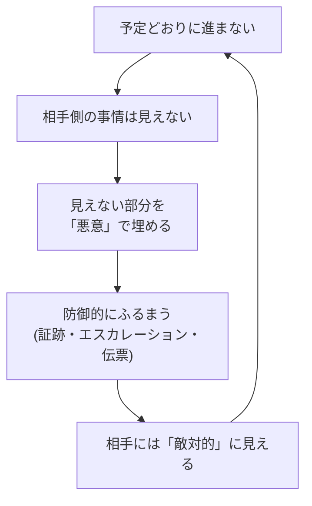

# ベンダーにも発注者にも正義がある ― 映画ちいかわ「人魚の島のひみつ」で考える受発注の関係

<!-- x-summary: 『映画ちいかわ 人魚の島のひみつ』を2回目に観たら、島民側の顔ばかり追っていました。昨年までベンダー側、今年から発注者側にいる私が、あの島を借りて「どちらも悪意はないのに、うまくいかないとどちらかを悪者にしてしまう」受発注の構造を書きます。それぞれが守りたいものと、それでもやってはいけないことまで -->

<!-- og-image: https://raw.githubusercontent.com/NaoyaKinoshita/llm-agent-digest/main/chiikawa/images/2026-09-19_vendor-client-justice/01-himitsubon.jpg -->

こんにちは。ちいかわが好きなエンジニアです。

先日、『**映画ちいかわ 人魚の島のひみつ**』を観てきました。はい、2回目です。

もちろん入場者特典もしっかりいただいてきました。**入場者特典 第5弾「ひみつ本」** です。

*↑ 第5弾「ひみつ本」。3人で行ったので、3冊いただきました。*

そして今回の特典は、**1種類のみの配布**。当然ながら、**3冊とも同じもの**です。

実は以前、[この映画の特典が「被った」話を確率の記事にした](https://blog.kinolab.work/column/2026-07-25_chiikawa-movie-random-bonus/)ことがあります。全8種のチャームを3人ぶん引いて、うさぎが2個。「3個のうちどこかが被る確率は約34%なので、むしろ起きて当然です」と、誕生日のパラドックスまで持ち出して真面目に計算したやつですね。

今回は、計算する余地がありませんでした。**種類が1つなら、被る確率は100%。** 引く前から全員が同じものを持って帰ることが確定しています。前回あれだけ式をこねくり回したのに、今回は誰にとっても結論が同じ。潔い。

で、肝心の2回目の鑑賞です。**1回目とは、明らかに違うところを見ていました。**

1回目は、ちいかわ達の側から観ていたんです。セイレーンが来る、怖い、逃げて、という見方。でも結末を知った状態でもう一度観ると、**島民の側の顔ばかり目で追ってしまう**。あの2人が何を抱えたまま島で暮らしていたのか、どこでなら引き返せたのか。そして、セイレーンの側にも、まったく同じだけの事情があったこと。

観終わって残ったのは、これでした。

**あの島に、単純な悪者は1人もいない。**

そして、その帰り道でずっと考えていたのは、なぜか**仕事のこと**だったんです。

というわけで今日は、技術の話ではなく**仕事の話**をさせてください。

実は私、昨年までは**ベンダー側**（システムを受注して作る側）にいて、今年から**発注者側**（作ってもらう側）にいます。同じ業界で、同じような会議に出て、同じような資料を読んでいるのに、**机の向きが変わっただけでこんなに景色が違うのか**と、正直いまだに毎週びっくりしています。

そして、立場が変わってから一番強く思うようになったことがあります。

**どちらにも、守りたいものがある。**

この感覚を、あの島がきれいに言い当てていました。[以前ネットワークの記事では、同じ島を「持ち出してはいけないものが、内側の住人に持ち出された話」](https://blog.kinolab.work/column/2026-08-16_chiikawa-mermaid-island-vpc/)としてセキュリティの比喩に使ったのですが、今日はまったく別の読み方をします。

> ⚠️ **以下、『映画ちいかわ 人魚の島のひみつ』（原作の島編／セイレーン編）の核心に触れます。** これから観る方・未読の方は、ぜひ劇場や[公式X](https://x.com/ngnchiikawa)、単行本を先にどうぞ。前回の特典の記事はネタバレなしで書いているので、そちらは安心して読めます。
>
> なお本記事は**非公式のファンコンテンツ**で、権利者・関係各社とは一切関係ありません（詳細は末尾に記載しています）。

ざっくりおさらいすると、こういう話でした。

1. 「おいしいものが食べ放題の島での簡単なお仕事」という**チラシ**を見て、ちいかわ達が島へ渡る
2. 島では、歌で島民を眠らせて捕食する怪物**セイレーン**と、手下の**人魚**たちが暴れていた
3. しかし真相は、**島民の側の裏切り**だった。かつて親友の片方が衰弱したとき、もう片方が「ずっと一緒に生きたい」と願い、**人魚を食べると永遠のいのちを手に入れられる**という伝承を実行してしまう
4. 2人は人魚を騙して捕らえ、スープにして食べた。永遠のいのちを手に入れた
5. 仲間を殺されたセイレーンは激怒し、犯人を捜して島を襲い続けていた
6. ちいかわ達がセイレーンを洞窟に封じて危機は去る。**だが犯人の2人は罪を隠し通したまま島に残り**、セイレーンも犯人を捜し続けている

今日はこの島を借りて、**受注者（ベンダー）と発注者の関係**について書いてみます。技術の話は一行も出てきません。

---

## 1. あの島には、悪者がいない

島編がずっと心に残るのは、**どちらの側にも、その側から見た正しさがある**からだと思っています。

**セイレーンの側から見ると**、これは仲間を殺された話です。人魚は騙されて捕らえられ、食べられた。犯人は名乗り出ず、島の中に隠れている。怒りは完全に正当で、捜し続ける動機も当然です。島民から見れば怪物ですが、**怪物にされたのは、怪物にした側の行いが先**でした。

**島民2人の側から見ると**、これは「ずっと一緒に生きたい」という願いの話です。衰弱していく親友を前にして、伝承にすがった。その願いそのものを、私は否定しきれません。たぶん多くの人が否定しきれない。だからあの回は、あんなにしんどいのだと思います。

**それでも、やったことは取り返しがつかない。**

どちらにも言い分があって、どちらも完全には正しくなくて、しかも一度起きたことは元に戻らない。似た構造の物語は他にもあって、たとえば『進撃の巨人』のマーレとエルディアもそうです。外から見れば「どっちもどっち」に見えるけれど、**中にいる人にとっては、どっちも切実**。積み重なった被害の記憶があって、守るべき仲間がいて、その上で相手が敵に見えている。

物語がつらいのは、悪者がいないのに、誰も救われないからです。

そして——**これ、うまくいかなくなったプロジェクトの景色とそっくりなんです。**

炎上した案件の関係者に、後から個別に話を聞いたことがある方はわかると思うのですが、だいたい**どちらの側の話も筋が通っています**。ベンダーの言い分も、発注者の言い分も、その人の座っている椅子からは全部正しい。なのに、同じプロジェクトの話をしているとは思えないくらい、見えている絵が違う。

なので今日は、まず「それぞれが何を守ろうとしているのか」から書きます。

---

## 2. ベンダーが守りたいもの ― 増えるのは作業ではなく原価

ベンダー側にいたときの感覚を、できるだけ正直に書きます。

予定よりスコープ（作る範囲）が広がったとき、ベンダーの中で何が起きるか。**増えるのは「作業」ではなく「原価」です。**

システム開発の契約は、ざっくり言えば**人の時間を売っています**。固定金額の請負であれば、作る範囲が1.2倍になっても売上は1円も増えません。増えるのは人件費だけです。つまり、

> **スコープが広がる = 利益が減る**

という、身も蓋もない等式が成り立ちます。値引きに応じるのと、無償でスコープを広げるのは、会計上まったく同じことです。

そして、**利益の次に溶けるのはメンバー**です。人は急に増やせません（増やせても、キャッチアップに時間がかかるので短期的には遅くなります）。だから足りない分は、**今いる人の時間**で埋めることになります。残業が増え、休日にリリース作業が入り、レビューが雑になり、品質が落ち、手戻りでさらに時間が減る。この悪循環の終点は、たいてい**キーパーソンの離脱**です。

もうひとつ、外からは見えにくい事情があります。**「今回だけ」は、次回の基準になる**ということ。一度「これくらいならサービスで」を受けると、それはプロジェクトの標準的な温度になります。だから現場のリーダーは、1件1件の小さな追加に対して、実際の工数よりずっと重い判断をしています。

**「それは追加のお見積もりになります」は、冷たいのではなく、チームを守るための防衛線**なんですね。当時の私も、あれを言うたびに少し胃が痛くなっていました。ただ、チームメンバーを守るためには必要な交渉なのです。

---

## 3. 発注者が守りたいもの ― 削られるのは機能ではなく約束

では、発注者側に来て何がわかったか。

発注者は、**予算を取ってきた人**です。ここが、ベンダー側にいたときに一番わかっていなかったところでした。

システムを作るお金は、どこかから降ってくるわけではありません。誰かが企画書を書き、効果を試算し、稟議を通し、社内の他の投資案件と椅子取りゲームをして、**「これだけの効果が出ます」と約束して**持ってきています。その約束の中身が、要件定義で決まった機能です。

なので、実現できることが減るというのは、発注者にとって**機能が減る話ではなく、約束が減る話**です。

- **ROI（投資対効果）が出ない。** 「この機能で年間これだけの工数が削減できます」の前提で通した予算なので、その機能が落ちると、投資そのものの説明がつかなくなる
- **次の投資が取れなくなる。** これが一番きついところです。今回の効果が出ないと、「あのシステムは金食い虫だった」という評価が社内に残り、**追加投資や次フェーズの予算が通らなくなる**。継続的に改善していく道が閉じる
- **期日が動かせないことがある。** 制度改正、決算、既存システムの保守切れ、他部署の切り替え。「じゃあ2ヶ月後ろ倒しで」が物理的に選べない事情が、システムの外側にあることが珍しくありません

だから発注者の「なんとかなりませんか」は、わがままというより、**自分がした約束を守ろうとしている顔**なんです。これはベンダー側にいたとき、正直まったく想像できていませんでした。目の前の担当者が、社内でどんな説明責任を負っているかなんて、見えませんから。

---

## 4. 同じ一言が、反対側ではどう聞こえるか

ここまでの2つを並べると、面白いことが起きます。**同じ一言が、言った側と受け取った側で、まったく違う音で鳴る。**

| 言われたこと | 言った側の事情 | 受け取った側に聞こえる音 |
| :--- | :--- | :--- |
| 「ついでに、この画面もこうできませんか」 | 使われる形にしないと効果が出ない | また無償でスコープが増える |
| 「それは今回の範囲外です」 | このまま積み上がるとチームが持たない | 協力する気がない／できない言い訳 |
| 「一旦持ち帰らせてください」 | 社内で決裁者と握らないと決められない | 決められない、とにかく遅い |
| 「早めにご判断いただけますか」 | 待っている間もメンバーは張り付いていて原価は出ている | 急かされている、こちらの都合が無視されている |
| 「前回の見積もりより高いのですが」 | 予算の枠が先に決まっていて、超えると稟議をやり直し | 買い叩かれている、価値を認められていない |

こうして並べると、**どの行も、言った側には理屈があって、受け取った側には別の意味で届いている**ことがわかります。そして重要なのは、**この表のどこにも悪意がない**ということです。

悪意がないのに、すれ違う。これがこの問題の厄介なところです。

---

## 5. なぜ「どちらかを悪者にする」が起きるのか

島編に戻ります。

あの島で問題が終わらなかった理由は、はっきりしています。**島民2人が、真相を隠したから**です。

真相が隠れている限り、島民たちは「理不尽な怪物に襲われている被害者」として振る舞えます。セイレーンの側から見れば、犯人を匿う島全体が敵に見えます。**片方しか知らない事実があるうちは、もう片方の目には、相手がただの理不尽に映る。**

プロジェクトでも、まったく同じことが起きます。**お互いに、相手からは見えない領域を持っている**からです。

- 発注者からは見えない 見積もりの根拠、体制の実態、そのプロジェクトが赤字なのかどうか、誰が何人で何時間張り付いているのか
- ベンダーからは見えない 社内の力関係、決裁のプロセス、なぜその期日なのか、担当者が上司にどう詰められているか

そして人間は、**見えない部分を「自分にとって都合のいい物語」で埋めます**。「どうせ吹っかけているんだろう」「どうせ社内で握りつぶしているんだろう」。この埋め方は、たいてい相手の悪意を仮定する方向に働きます。

この輪が回り始めると、**プロジェクトを進める仕事より、後で責任を問われないための仕事の方が増えます**。議事録の一言一句を詰め、メールの宛先を増やし、会議の前に会議をする。誰も手を抜いていないのに、成果物だけが進まない。

そして一番つらいのは、**この輪の中で実際に戦っているのが、原因を作っていない人たちだ**ということです。

---

## 6. チラシを見て島に渡ったのは、誰だったか

ここで、島編の最初の1コマに戻らせてください。

> 出典: ナガノ『ちいかわ』2023年3月15日 ちいかわ公式X（@ngnchiikawa）投稿
> <https://x.com/ngnchiikawa/status/1635963443823136770> より引用

> 「おいしいものが食べ放題の島での簡単なお仕事」

ちいかわ達は、島の歴史にも、島民の罪にも、**まったく関係がありません**。チラシを見て、船に乗って、渡った先でセイレーンと戦うことになっただけです。

このチラシ、プロジェクトで言えば **提案書とRFP（提案依頼書）** だなと思うんです。

- 「要件はほぼ固まっています」
- 「実績のある構成なので、技術リスクは低いです」
- 「既存システムのドキュメントは整備されています」

どれも、書いた時点では嘘ではないことが多い。悪意もない。でも、**島に渡って初めてわかることがある**。そして渡った先で戦うのは、そのチラシを書いた人ではなく、**アサインされたメンバー**です。

これは発注者側も同じです。現場の担当者は、そのシステムを入れると決めた経営判断の場にいないケースがあります。「なぜこの時期に、この範囲で、このベンダーなのか」を決めた人と、毎日の課題管理表を回している人は、別の人のことも多いのです。

**一線を越える判断をした人と、その代償を払う人は、だいたい別人。** 島編がずっと刺さるのは、たぶんここです。

---

## 7. それでも、やってはいけないことがある

さて、ここまで「どちらにも正義がある」と書いてきましたが、**だから何をしてもいい、という話ではまったくありません**。

島民2人の願いは理解できます。でも、**人魚を騙して食べたことは、やってはいけないこと**でした。事情がわかることと、線を越えていいことは、別の話です。

なので、ここからは線の話をします。私が両側に座ってみて、「これはさすがにやってはいけない」と思ったことです。

### 7-1. ベンダーがやってはいけないこと

**(1) やりたくない、という理由だけでスコープを削る**

これ、外からは非常に見分けがつきにくいのですが、実際にあります。

表向きの理由は、だいたい立派です。「その機能は、おそらく使われません」「一般的にはそこまでやりません」「費用対効果が見合いません」。ところが本当の理由が、**工数が読めない**、**触りたくない古い部分に手が入る**、**得意な人がいない**だったりする。

何が問題かというと、**判断の主語がすり替わっていること**です。その機能を使うかどうか、効果が見合うかどうかを決められるのは、**その業務をやっている利用者**であって、ベンダーではありません。利用者の業務の実態を一番知らない立場の人間が、「これは要らないでしょう」を決めてしまっている。

正しいやり方は、**やらない方がいいと決めることではなく、判断できる材料を出すこと**だと思っています。

> ❌ 「それはやらない方がいいです」 
> ⭕ 「やる場合、これくらいの工数と、こういうリスクがあります。他の機能と比べて優先度はどうしますか？」

**判断材料を出すところまでがベンダーの仕事で、決めるのは発注者の仕事。** ここを混ぜると、あとで必ず揉めます。

もちろん、本当に「やらない方がいい」ときはあります。むしろ、そういうときは遠慮なく止めてほしい。ただしそのときは、**理由を利用者の言葉で**説明してほしいのです。「技術的に筋が悪い」ではなく、「この作り方だと、月末に3分待たされる画面になります」のように。

**(2) スキルの足りない要員が大半のチームを組む**

育成そのものは、まったく否定しません。誰にでも初めての現場があるし、経験を積める場所がないと業界が死にます。**問題は、比率と、単価と、事前の合意です。**

「若手を2名、育成枠として入れさせてください。単価はこうで、レビューはリーダーが持ちます」——これは健全な相談です。発注者側も、ちゃんと説明されれば納得できることが多い。

やってはいけないのは、**スキルが伴っていないのに、単価がそれなりに高い**ケースです。これはもう、正義がどうという話ですらなくて、単純に売っているものと届いているものが違う。体制図の「シニアエンジニア」という肩書きは自己申告なので、**発注者側からは本当に見えません**。気づくのは、たいてい設計レビューか、最初の結合テストのあたりです。そして気づいた時点では、もう日程を組み直す余地が残っていない。

### 7-2. 発注者がやってはいけないこと

**(1) 当て馬としての提案依頼**

相見積もりを取ること自体は、まったく健全です。競争があるから価格も品質も適正になる。そこは全然いい。

問題は、**本命がすでに決まっているのに、社内手続きの頭数を揃えるために声をかける**ケースです。「3社比較が必要な規定なので、とりあえず1社お願いします」というやつですね。

ベンダー側にいた人間として言わせてください。**提案は、片手間ではできません。**

- 現行システムの調査と読み込み
- アーキテクチャの検討と、実現方式の当たりつけ
- 見積もり（これが一番重い。工程を分解して、人を積んで、リスクバッファを置いて、社内の査定を通す）
- 提案書の作成、社内レビュー、プレゼン準備
- **体制の仮押さえ**（受注したときに人がいないと困るので、他案件への投入を止めることがある）

案件の規模によっては、**提案活動だけで数百万円分の原価**が動きます。しかもこれは全額が持ち出しで、負ければ1円も回収できません。当て馬の提案依頼は、**相手の原価を、こちらの社内手続きのために使っている**ということなんです。

避けるのは難しくありません。**情報を先に出せばいい**だけです。現行ベンダーがいるならそう言う。評価軸と重みを公開する。すでに検討が進んでいる部分があるなら共有する。そして、**辞退を歓迎する**こと。「今回は見送ります」と言えるベンダーは、次の案件で本気の提案を持ってきてくれます。

**(2) 要件定義と意思決定という責務を、ベンダーに押し付ける**

これが一番根が深いと思っています。

「プロなんだから、いい感じに提案してください」。相談としては健全です。ベストプラクティスを聞くのは当然いいことです。でも、**決定を丸ごと預けるのは違います**。

なぜなら、**ベンダーは「業務をどう変えるか」を決められない立場**だからです。その業務の結果に責任を負っているのは発注者側で、部署間の調整ができるのも、例外運用を許容するかを決められるのも、発注者側だけです。要件を決めるというのは、技術の選択ではなく、**自分たちの仕事の仕方を決めること**なんですね。[「出し物」と「出汁」の回で書いた要件定義の話](https://blog.kinolab.work/column/2026-08-01_hachiware-dashi-uat/)も、結局はここにつながります。

そして、**最悪なのがこの先**です。

決めきらないまま進んだプロジェクトは、だいたい炎上します。そこまでは、まあ、よくある話です。問題は総括のされ方で、**「あのベンダーは使えなかった」という結論になり、出入り禁止にして終わる**ケースがあります。

これ、島編とまったく同じ構造だと思うんです。

**真相が共有されないまま、犯人だけが処分されている。** 決めなかったこと、決められる体制を作らなかったこと、途中の警告を握りつぶしたこと——そこに触れないまま、相手だけを島から追い出す。だから**次のプロジェクトでも、同じことが起きます**。しかも今度は、前回の経緯を知っているベンダーがもういない。

一度食べてしまった人魚は戻ってきません。**失った信頼と、失った知見も、同じくらい戻ってきません。** 何が起きたのかを、責任追及と切り離して記録に残す——[以前ポストモーテムの話](https://blog.kinolab.work/column/2026-07-26_hachiware-container-escape/)を書きましたが、受発注の関係こそ、あれが一番効く場所かもしれません。

---

## 8. 机の向きが変わって、実際に効いたこと

最後に、ベンダー側から発注者側に移ってみて、「これは効くな」と実感していることを3つだけ書きます。

**1. 「決める」を先送りしない。決められないなら、いつ誰が決めるかだけでも決める。**

ベンダー側にいたとき、一番つらかったのは断られることではありませんでした。**返事が来ないこと**です。待っている間もメンバーは張り付いていて、原価は出ていく。しかも、他の作業に切り替えると、返事が来た瞬間に切り替え直しになるので、実は待つのが一番効率が悪い。

今は「今週は決められません。来週の火曜に部長と握るので、水曜に回答します」とだけ伝えるようにしています。**回答が遅いことより、いつ来るかわからないことの方が、ずっとコストが高い**ので。

**2. スコープを変えたいときは、「何を捨てるか」を自分で持っていく。**

「これを足したい」だけを持っていくと、**交渉**になります。「これを足して、代わりにこれを落とします」を持っていくと、**相談**になります。同じ変更なのに、相談で持っていくと会議の空気が変わると思います。

そして、捨てるものを自分で選ぶのは、本来こちらの仕事です。優先順位を知っているのは発注者側なので。

**3. 相手の利益を、悪いものだと思わない。**

ベンダーが利益を出せないプロジェクトは、**必ず体制が細ります**。良い人から順に、利益の出る案件へ移っていく。これは誰かの意地悪ではなく、会社というものの仕組みです。

発注者にとって一番高くつくのは、値切った結果のリカバリ費用です。**適正な利益は、こちらが買っている品質の一部**だと思うようになりました。
（逆に、ベンダー側の方にお願いがあるとすれば——**発注者が社内でどう説明するかを、一緒に考えてくれる人は本当にありがたいです。** 稟議に貼れる1枚をくれるベンダーは、次も指名されます。売り込みのうまさではなく、これだと思います。）

---

## **まとめ**
- 島編に単純な悪者はいない。**セイレーンにも島民にも、その側から見た正しさがある**。炎上したプロジェクトも、だいたい両方の言い分が筋として通っている
- **ベンダーが守っているのは、利益とメンバー。** スコープが広がると、増えるのは作業ではなく原価で、最後に削られるのは人
- **発注者が守っているのは、約束と次の投資。** 機能が落ちることは、社内で通した効果の話が崩れることを意味する
- すれ違いの原因は悪意ではなく、**お互いに見えない領域があること**。人は見えない部分を、相手の悪意で埋めてしまう
- それでも線はある。ベンダーは**やりたくないだけのスコープ削りと、スキルの伴わない体制**。発注者は**当て馬の提案依頼と、意思決定の放棄**。そして炎上の総括を「ベンダー出禁」で終わらせること
- **真相が隠れたままだと、セイレーンは今日も島を捜し続ける。** 原因を共有しない総括は、次のプロジェクトで同じ形で戻ってくる

両側に座ってみてわかったのは、結局、相手も自分と同じくらい**しんどい事情を抱えて会議に出てきている**ということでした。それを想像できるかどうかだけで、同じ議題でも着地がぜんぜん変わります。

ちなみに冒頭の「ひみつ本」、3人で行って3冊とも同じものでした。前回は「被った」と嘆いたのに、今回は**最初から全員が同じものを持って帰ることが決まっていた**わけです。

プロジェクトも、たぶんこれが理想なんですよね。**始まる前から、全員が同じものを見ている状態。** 確率の話をしなくて済むくらい、きれいに揃っている。

願わくば、次のキックオフが、**チラシの読み合わせ**から始まりますように・・・な！！。

*(※本記事は**非公式のファンコンテンツ**です。『ちいかわ』に関する権利は権利者に帰属し、当サイトは権利者・関係各社とは一切関係ありません。掲載した画像は、論評の対象として著作権法第32条に基づき1コマのみ引用したものであり、セリフの引用も論評に必要な範囲に限っています。作品の全体はぜひ[公式X](https://x.com/ngnchiikawa)や単行本でお楽しみください。また、本記事に登場する事例はいずれも特定の企業・案件を指すものではありません。)*
