# LLM・AI Agent 最新情報レポート Vol.6

**作成日**: 2026年5月5日  
**対象期間**: 2026年3月〜5月初旬（Vol.1〜5との差分）

---

## 目次

1. [Google Cloud AIアップデート](#1-google-cloud-aiアップデート)
2. [Microsoft Azure AIアップデート](#2-microsoft-azure-aiアップデート)
3. [LLM Model / AI Agentアーキテクチャ・研究論文](#3-llm-model--ai-agentアーキテクチャ研究論文)
4. [公式ブログ・論文のリサーチ・要約](#4-公式ブログ論文のリサーチ要約)
   - [Google / DeepMind](#41-google--deepmind)
   - [OpenAI](#42-openai)
   - [Anthropic](#43-anthropic)
5. [AI Agent搭載SaaS・エンタープライズ製品情報](#5-ai-agent搭載saasエンタープライズ製品情報)
6. [その他特筆すべき情報](#6-その他特筆すべき情報)
7. [参考リンク](#7-参考リンク)

---

## 1. Google Cloud AIアップデート

### 1.1 Gemini 3.1 Flash-Lite（2026年3月3日 一般プレビュー提供開始）

GoogleがGemini 3シリーズで最もコスト効率に優れたモデル**Gemini 3.1 Flash-Lite**をリリース。大量トラフィック・コスト重視ユースケース向けに設計された最速・最安の量産向けGeminiモデル。

**主要スペック:**

| 項目 | 内容 |
|---|---|
| **コンテキストウィンドウ** | 1Mトークン |
| **マルチモーダル対応** | テキスト・画像・音声・動画 |
| **応答速度** | Gemini 2.5 Flash比 **2.5倍高速**（TTFT）、出力速度 **45%向上** |
| **入力価格** | $0.25/Mトークン |
| **出力価格** | $1.50/Mトークン |
| **利用環境** | Google AI Studio / Gemini API / Vertex AI |

**主なユースケース:**
- 大量翻訳・コンテンツモデレーション（コスト優先）
- UIダッシュボード生成・シミュレーション（複雑な推論が必要な大量処理）
- チャットボット・FAQ自動応答（高スループット要件）

**Gemini 3.x シリーズ全体の位置づけ:**

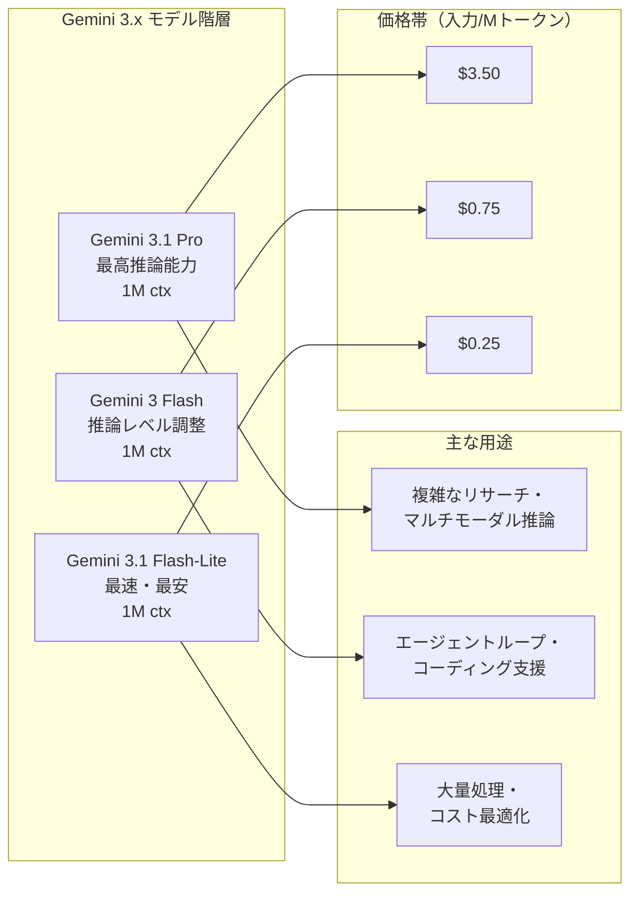

### 1.2 Veo 3.1 Lite（Vertex AI パブリックプレビュー）

GoogleがVertex AI上で**Veo 3.1 Lite**を公開プレビューとして提供開始。Veo 3シリーズで最もコスト効率に優れた動画生成モデル。

**特徴:**
- Veo 3.1と同等のコアコンテンツ品質を大幅に低いコストで実現
- 高速プロトタイピング・SNS向けコンテンツ生成・A/Bテスト用動画制作に最適
- テキスト、画像入力から動画を生成（音声同期は別途Veo 3.1で利用可能）

---

## 2. Microsoft Azure AIアップデート

### 2.1 OpenAI Frontier: エンタープライズエージェント管理プラットフォーム（2026年2月5日 GA）

OpenAIが**OpenAI Frontier**をリリース。エンタープライズがAIエージェントを構築・デプロイ・管理するためのエンドツーエンドプラットフォーム。

**主要コンセプト —「AIコワーカー」:**
- エージェントを「AIコワーカー」として人間の従業員と同様に**オンボーディング・ID付与・権限設定・パフォーマンス評価**
- OpenAIが構築したエージェント、自社構築エージェント、Google・Microsoft・Anthropicなどサードパーティエージェントを統一管理

**コアコンポーネント:**

| 機能 | 内容 |
|---|---|
| **統合コンテキスト基盤** | CRM・チケットツール・内部アプリ・データウェアハウスを接続し、エージェントに共有コンテキストを提供 |
| **マルチエージェント対応** | プラットフォームを横断するエージェントの実行・監視・可視化 |
| **スコープ付き権限** | エージェントごとに細かいアクセス権を設定（最小権限原則） |
| **継続的評価** | エージェントのパフォーマンスを継続測定・最適化 |
| **セキュリティ準拠** | SOC 2 Type II、ISO/IEC 27001、27017、27018、27701、CSA STAR |

**初期採用企業:** Uber、State Farm、Intuit、Thermo Fisher Scientific

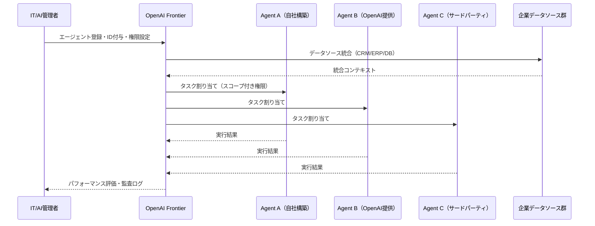

### 2.2 OpenAI Frontier Alliances（2026年2月23日）

Frontierリリースから18日後に、OpenAIがコンサルティング大手との**マルチイヤーパートナーシップ「Frontier Alliances」**を発表。

**目的:** AI パイロット段階から**本番規模のエージェントデプロイ**への移行を支援

**参加コンサルティングファーム（4社）:**
- Accenture
- Deloitte
- PwC
- Ernst & Young（EY）

**スキーム:**
- 各ファームがFrontierの技術スタックで企業のエージェント導入を支援
- コンサルファームがSI（システムインテグレーター）としてFrontierエコシステムを拡大

---

## 3. LLM Model / AI Agentアーキテクチャ・研究論文

### 3.1 MemRouter: 埋め込みルーティングによる長期会話エージェントメモリ（arXiv:2605.00356）

**論文タイトル:** "MemRouter: Memory-as-Embedding Routing for Long-Term Conversational Agents"  
**公開日:** 2026年5月1日

**課題:** 長期会話エージェントでは、どの情報をメモリに保存するかの判断（書き込み側）が重要だが、従来はLLM自身がターンごとに保存判断を行うため遅延・コストが大きかった。

**MemRouterのアプローチ:**
- **埋め込みベースのルーティングポリシー**でメモリ書き込み判断をLLMから分離
- 各ターン+最近のコンテキストをエンコードし、凍結LLMバックボーンで射影
- 軽量な分類ヘッド（**学習パラメータ12M**）で「保存すべきか」を判定

**性能結果（LoCoMoベンチマーク）:**

| 指標 | MemRouter | LLMベースメモリ管理 |
|---|---|---|
| **全体F1スコア** | **52.0** | 45.6 |
| **メモリ管理p50レイテンシ** | **58ms** | 970ms（約17倍高速） |
| **パラメータ数** | 12M | フルLLM |

**性能内訳（F1改善の要因分析）:**
- 学習済みadmissionポリシー: +10.3（vs ランダム保存）
- カテゴリ特化プロンプト: +5.2（vs 汎用プロンプト）
- 検索コンポーネント: +0.7

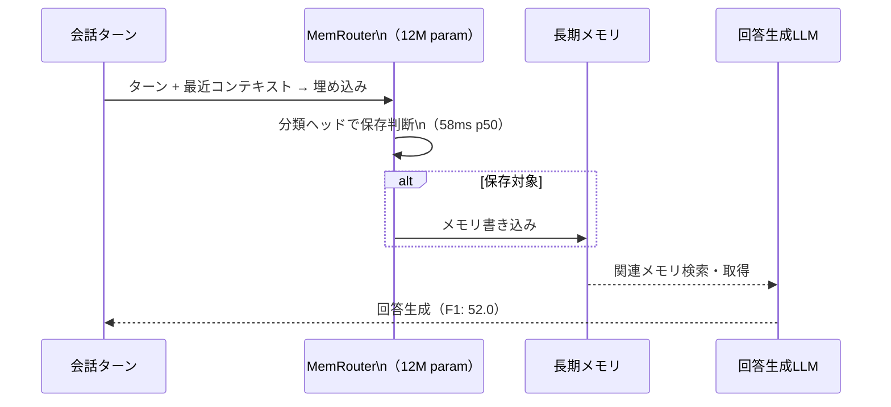

### 3.2 マルチエージェントメモリのコンピュータアーキテクチャ的考察（arXiv:2603.10062）

**論文タイトル:** "Multi-Agent Memory from a Computer Architecture Perspective: Visions and Challenges Ahead"

**概要:** マルチエージェントシステムのメモリ問題を**コンピュータアーキテクチャの枠組み**で整理・提言した論文。

**中核概念：3層メモリ階層の提案:**

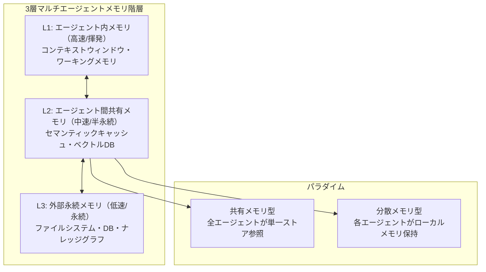

**主要な知見:**
- マルチエージェントシステムのメモリ不整合は、CPUキャッシュコヒーレンス問題と本質的に同構造
- 「invalidation-based」と「update-based」の2種類のコヒーレンスプロトコルがエージェントメモリにも適用可能
- 将来の設計指針として、**メモリ一貫性モデルをエージェントフレームワーク設計に明示的に組み込む**ことを推奨

### 3.3 エンタープライズAIエージェント展開の現実：88%問題

複数の調査・研究（Anaconda/Forrester/a16z/MIT Sloan CIOパネル）が一致して示す深刻な知見：

> **エージェントパイロットの88%は本番稼働に至らない**

**障壁の構造:**

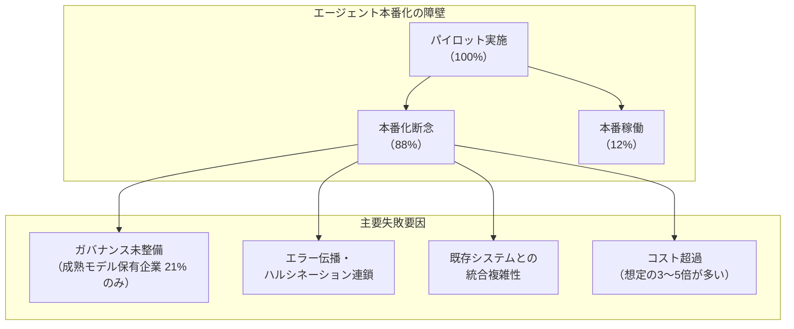

**市場の現状（2026年Q1）:**
- エンタープライズアプリの **80%** がAIエージェントを少なくとも1つ搭載（2024年: 33%）
- 本番稼働中のエージェントを持つ企業: **51%**（別調査では31%と乖離あり）
- エージェントガバナンスの成熟モデルを持つ企業: **わずか21%**

---

## 4. 公式ブログ・論文のリサーチ・要約

### 4.1 Google / DeepMind

#### Google AI月次まとめ: 5月（2026年5月4日）

Googleが「What Google Cloud announced in AI this month」として毎月のAIアップデートをまとめて公開。

**5月のハイライト（前回レポート未掲載分）:**
- Gemini 3.1 Flash-Liteのプレビュー継続展開
- Veo 3.1 LiteのVertex AI提供開始
- Gemini Enterprise Agent Platform: Cloud API Registryの機能拡充
- Workspace Studio Skillsの段階的ロールアウト継続

### 4.2 OpenAI

#### OpenAI ARR $25B到達（2026年5月）

OpenAIが年間収益ラン率（ARR）**$25B**超を達成。ただし、同時期にAnthropicが$30B ARRで逆転（後述）。

**OpenAI収益成長の軌跡:**

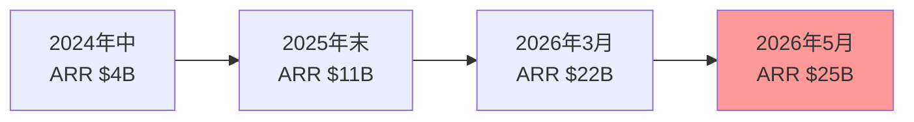

**ビジネスモデルの進化:**
- **消費者向け**: ChatGPT Pro/Plus/Team（月額課金）
- **エンタープライズ向け**: Frontier Platform（シートライセンス + 使用量課金）
- **API/開発者向け**: Pay-per-token
- **パートナー経由**: AWS Bedrock（Limited Preview展開中）

#### OpenAI「The Deployment Company」JV（2026年5月4日）

OpenAIが**プライベートエクイティ大手との合弁会社**を設立・資金調達を完了。

**JVの概要:**

| 項目 | 内容 |
|---|---|
| **名称** | "The Deployment Company"（仮称） |
| **評価額** | **$100億**（$10B） |
| **調達額** | **$40億以上**（$4B+） |
| **投資家数** | **19社** |
| **主要投資家** | TPG、SoftBank、Bain Capital、Brookfield Asset Management、Advent |
| **OpenAI出資額** | 約$1.5B（スーパーバーティング株保有） |
| **リターン保証** | 5年間で**年率17.5%**のリターンを投資家に約束 |

**目的と戦略:**
- PE（プライベートエクイティ）ファームのポートフォリオ企業（数百社規模）へのOpenAI技術展開
- 「実装能力 × 基盤モデルの所有」を組み合わせたPalantir型の前線展開モデル
- Anthropic × Goldman/Blackstone JVとの真っ向勝負

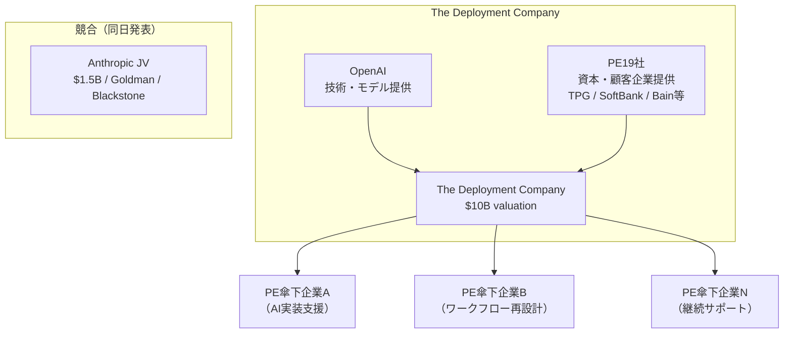

### 4.3 Anthropic

#### Anthropic × Goldman Sachs / Blackstone 合弁会社（2026年5月4日）

Anthropicが**金融・PE大手と共同でエンタープライズAI導入専門の合弁会社**を設立。

**JV概要:**

| 項目 | 内容 |
|---|---|
| **評価額（JV）** | **$15億**（$1.5B） |
| **創設パートナー** | Anthropic、Blackstone、Hellman & Friedman（各$3億拠出） |
| **参加投資家** | Goldman Sachs（$1.5億）、General Atlantic、Leonard Green、Apollo Global Management、GIC（シンガポールSWF）、Sequoia Capital |
| **ビジネスモデル** | エンジニアを企業に「埋め込み」、ワークフロー再設計 + AI実装 |

**戦略的位置づけ:**
- 参加PEファームのポートフォリオ企業が**ビルトインの顧客パイプライン**として機能
- Anthropicのエンジニアが独立エンティティとして直接企業に常駐
- **Palantir型の前線展開（Forward Deployment）モデル**を採用
- 従来のコンサルファームを"実装能力 + モデル所有権"で代替する狙い

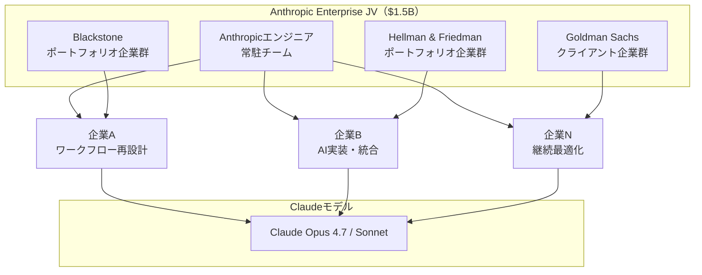

#### Anthropic ARR、OpenAIを逆転（2026年4月〜5月）

**Anthropicの収益急成長:**

| 時期 | ARR |
|---|---|
| 2025年初頭 | $1B |
| 2025年6月 | $4.5B |
| 2025年末 | $9B |
| 2026年2月 | $14B |
| 2026年3月末 | **$30B**（OpenAIの$24Bを逆転） |

**エンタープライズ市場シェアの変遷:**

| 年 | Anthropic | OpenAI | Google |
|---|---|---|---|
| 2023年 | 12% | 50% | 7% |
| 2025年 | 40% | 27% | 21% |
| 2026年（コーディング特化） | **54%** | 21% | — |

**収益構造の優位性:**
- 収益の **80%** がビジネス顧客（高リテンション・低チャーン）
- 月次平均ユーザー課金額: Anthropic **$16.20** vs OpenAI（多くは無料ユーザー）
- 月次アクティブユーザー: Anthropic 1.34億 vs OpenAI 9億（ユーザー数は少ないが高単価）

#### Pentagon AI契約：Anthropic排除と再交渉

**2026年5月1日、米国国防総省（DoD）が重大な発表:**

DoDが**8社のAI企業と機密ネットワーク（IL6/IL7）へのAI展開協定**を締結。

**協定締結8社:**
1. Amazon Web Services（AWS）
2. Google
3. Microsoft
4. NVIDIA
5. OpenAI
6. SpaceX
7. Oracle
8. Reflection

**Anthropicの排除:**
- Trumpホワイトハウスが、Anthropicが「自律兵器・大量監視を含む全ての合法目的」へのClaudeの軍事利用を拒否したため関係遮断
- DoDがAnthropicを「サプライチェーンリスク」と認定（過去には中国企業に対してのみ使用された指定）

**その後の展開:**
- ホワイトハウスとAnthropicは交渉を再開（Anthropicが複数の技術的ブレークスルーを発表後）
- Anthropicは自社の安全ガイドラインを維持した上で、軍事利用の一部に協力する方向で協議中

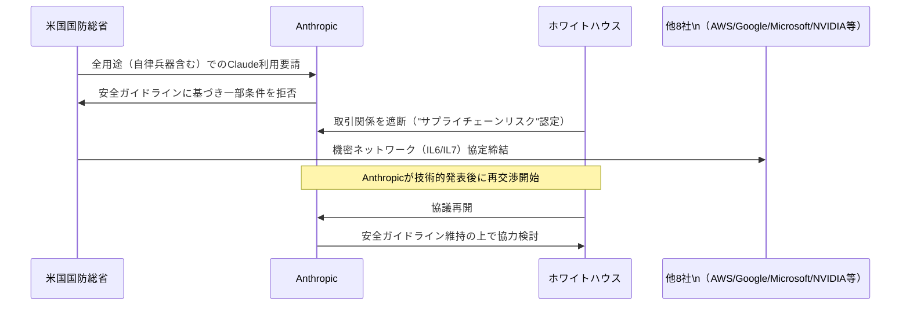

---

## 5. AI Agent搭載SaaS・エンタープライズ製品情報

### 5.1 OpenAI Frontier Alliances: コンサルエコシステムへの展開（2026年2月23日）

**Frontier Alliances**プログラムを通じた大手コンサルファームとのパートナーシップ詳細。

**ビジネスモデルの構造:**

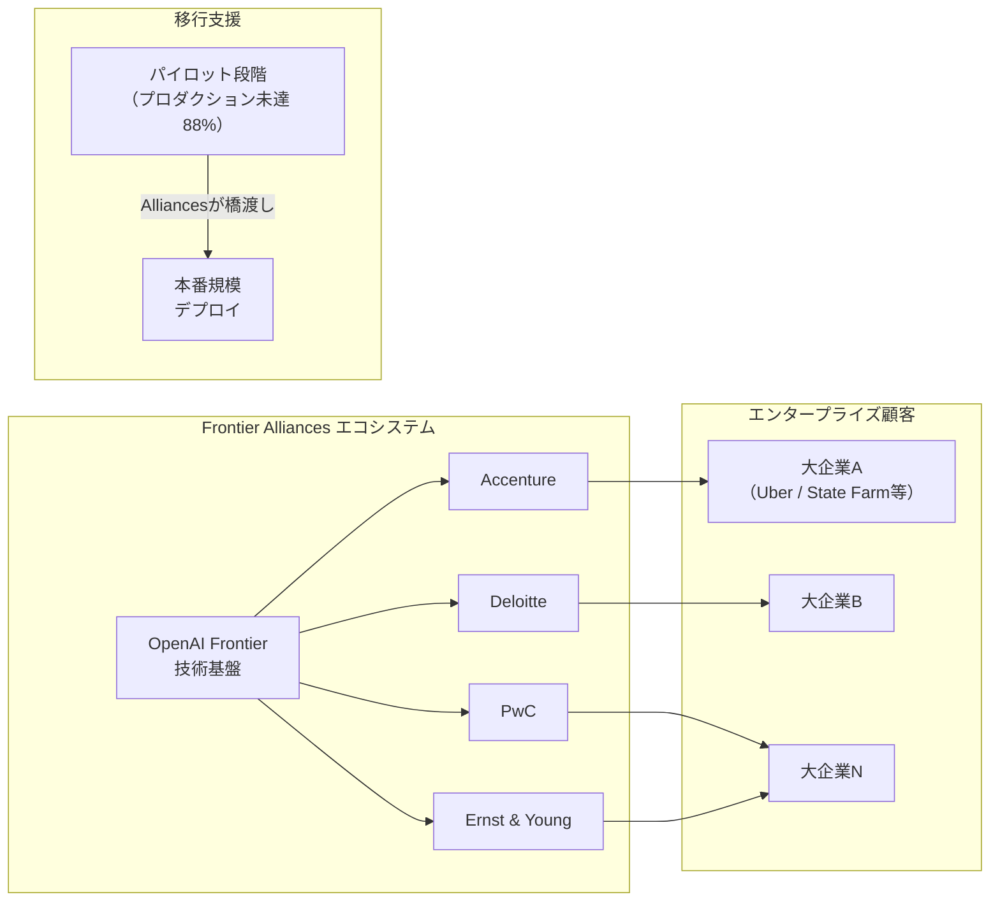

**戦略的意義:** AIエージェントの「88%本番化失敗問題」（前述）を、コンサルファームとの共同実装体制で突破する仕組みとして設計。

### 5.2 AI × ウォール街：金融・PE業界へのAI浸透加速

Anthropic・OpenAIのJV発表が示す新しいエンタープライズAI展開パターン。

**従来モデル vs 2026年型モデルの比較:**

| 観点 | 従来型（2023〜2025年） | 2026年型 |
|---|---|---|
| **販売チャネル** | SaaS直販・API | PE/GS傘下のポートフォリオ企業への一括展開 |
| **実装方式** | セルフサービス / パートナーSI | AIラボのエンジニアが直接常駐 |
| **課金モデル** | API使用量課金 | 成果報酬 + JV株式 |
| **スケール** | 個社契約 | 数百社への一括展開 |
| **競争優位** | モデル性能 | 実装スピード + モデル所有権の組み合わせ |

---

## 6. その他特筆すべき情報

### 6.1 AI企業評価額レース（2026年5月時点）

**主要AI企業の評価額推移:**

| 企業 | 評価額（最新） | 調達額 | 時期 |
|---|---|---|---|
| **Anthropic** | $900B（協議中） | $50B（交渉中） | 2026年4〜5月 |
| **OpenAI** | $852B | $122B | 2026年3月 |
| **xAI（Elon Musk）** | $200B超 | — | 2026年初 |
| **Mistral AI** | $30B | — | 2026年初 |

**Anthropicの$1T評価額：二次市場での先行反映:**
- 二次市場では既に**$1T（1兆ドル）評価**での取引が成立
- 2025年末の$9B ARRから5ヶ月で$30B ARRへ233%増加がレーティング根拠

### 6.2 LLMコモディティ化の加速：消費者市場と企業市場の分岐

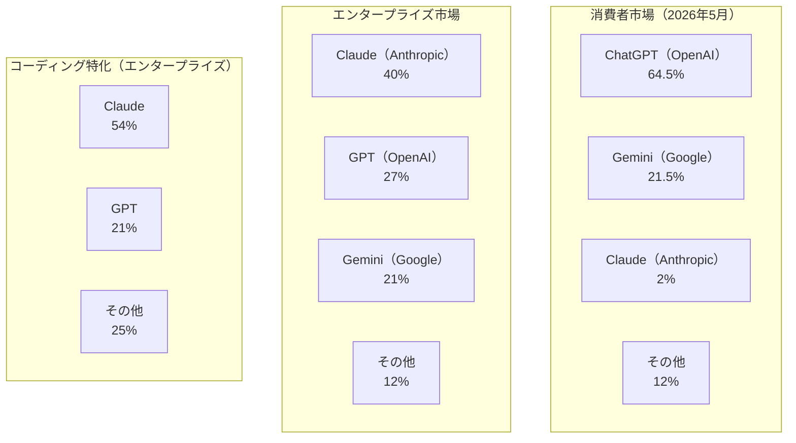

**インサイト:**
- 消費者市場はChatGPT（OpenAI）が圧倒的シェアを維持（ブランド・無料プランが強み）
- エンタープライズ市場はAnthropicがClaudeの安全性・コーディング能力で逆転
- **コーディング特化ではAnthropicが54%と圧倒的多数**
- 「消費者向けAIツール」と「エンタープライズAIプラットフォーム」の市場分断が鮮明化

### 6.3 AI Agentのペイメントインフラ：2026年の標準化状況

Stripe Link（Vol.3掲載）のリリース以降、AIエージェントが自律的に決済を実行するインフラの整備が急速に進行中。

**決済インフラ整備の進捗（2026年5月）:**

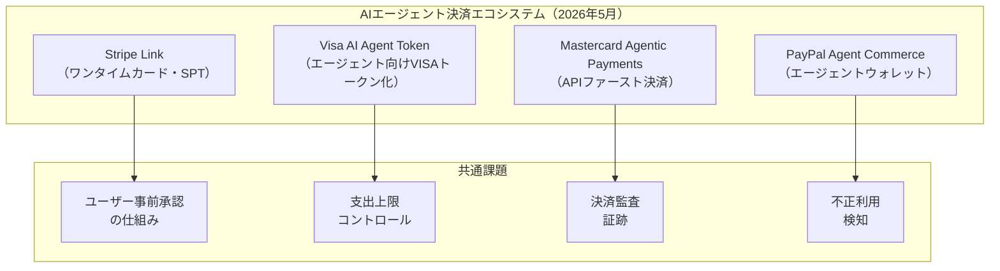

**主要各社の共通アプローチ:**
1. エージェントに生の決済情報を渡さず、**トークン化された一時キー**を発行
2. **支出上限・承認フロー**をユーザーが設定可能
3. すべての決済アクションを**監査可能な証跡**として記録

---

## 7. 参考リンク

### Google Cloud
- [Gemini 3.1 Flash-Lite - Google AI Blog](https://blog.google/innovation-and-ai/models-and-research/gemini-models/gemini-3-1-flash-lite/)
- [Gemini 3.1 Flash-Lite - Vertex AI Documentation](https://docs.cloud.google.com/vertex-ai/generative-ai/docs/models/gemini/3-1-flash-lite)
- [Gemini 3.1 Flash-Lite Model Card - Google DeepMind](https://deepmind.google/models/model-cards/gemini-3-1-flash-lite/)
- [What Google Cloud announced in AI this month](https://cloud.google.com/blog/products/ai-machine-learning/what-google-cloud-announced-in-ai-this-month)

### OpenAI Frontier
- [Introducing OpenAI Frontier](https://openai.com/index/introducing-openai-frontier/)
- [OpenAI Frontier | Enterprise platform for AI agents](https://openai.com/business/frontier/)
- [OpenAI launches a way for enterprises to build and manage AI agents - TechCrunch](https://techcrunch.com/2026/02/05/openai-launches-a-way-for-enterprises-to-build-and-manage-ai-agents/)
- [OpenAI Frontier Platform - InfoQ](https://www.infoq.com/news/2026/02/openai-frontier-agent-platform/)

### OpenAI JV
- [OpenAI raises over $4 billion for new enterprise deployment venture - The Decoder](https://the-decoder.com/openai-raises-over-4-billion-for-new-enterprise-deployment-venture/)
- [OpenAI Finalizes $10 Billion Joint Venture With PE Firms - Bloomberg](https://www.bloomberg.com/news/articles/2026-05-04/openai-finalizes-10-billion-joint-venture-with-pe-firms-to-deploy-ai)
- [Anthropic and OpenAI are both launching joint ventures for enterprise AI services - TechCrunch](https://techcrunch.com/2026/05/04/anthropic-and-openai-are-both-launching-joint-ventures-for-enterprise-ai-services/)

### Anthropic JV・収益・Pentagon
- [Anthropic teams with Goldman, Blackstone and others on $1.5 billion AI venture - CNBC](https://www.cnbc.com/2026/05/04/anthropic-goldman-blackstone-ai-venture.html)
- [Anthropic takes shot at consulting industry in joint venture with Wall Street giants - Fortune](https://fortune.com/2026/05/04/anthropic-claude-consulting-industry-joint-venture-blackstone-goldman-sachs/)
- [Anthropic Passed OpenAI in Revenue: $30B ARR - The AI Corner](https://www.the-ai-corner.com/p/anthropic-30b-arr-passed-openai-revenue-2026)
- [Anthropic tops OpenAI in LLM revenue stakes - The Register](https://www.theregister.com/2026/04/30/openai_anthropic_top_lines_research_counterpoint/)
- [Pentagon strikes deals with 8 Big Tech companies after shunning Anthropic - CNN Business](https://www.cnn.com/2026/05/01/tech/pentagon-ai-anthropic)
- [Pentagon clears 8 tech firms to deploy their AI on its classified networks - Breaking Defense](https://breakingdefense.com/2026/05/pentagon-clears-7-tech-firms-to-deploy-their-ai-on-its-classified-networks/)

### 研究論文
- [MemRouter: Memory-as-Embedding Routing for Long-Term Conversational Agents (arXiv:2605.00356)](https://arxiv.org/abs/2605.00356)
- [Multi-Agent Memory from a Computer Architecture Perspective (arXiv:2603.10062)](https://arxiv.org/html/2603.10062v1)
- [Memory for Autonomous LLM Agents: Mechanisms, Evaluation, and Emerging Frontiers (arXiv:2603.07670)](https://arxiv.org/html/2603.07670v1)

### 市場データ・エンタープライズ採用
- [AI Agent Adoption 2026: 120+ Enterprise Data Points](https://www.digitalapplied.com/blog/ai-agent-adoption-2026-enterprise-data-points)
- [Enterprise AI adoption in 2026: Why 79% face challenges - WRITER](https://writer.com/blog/enterprise-ai-adoption-2026/)
- [Tracking Market Share of Each LLM Q1 2026 - Wallaroo Media](https://wallaroomedia.com/llm-traffic-market-share-q1-2026/)
- [LLM statistics 2026: Adoption, trends, and market insights - Hostinger](https://www.hostinger.com/tutorials/llm-statistics)
