# LLM・AI Agent 最新情報レポート Vol.7

**作成日**: 2026年5月6日  
**対象期間**: 2026年4月〜5月上旬（Vol.1〜6との差分）

---

## 目次

1. [Google Cloud AIアップデート](#1-google-cloud-aiアップデート)
2. [Microsoft Azure AIアップデート](#2-microsoft-azure-aiアップデート)
3. [LLM Model / AI Agentアーキテクチャ・研究論文](#3-llm-model--ai-agentアーキテクチャ研究論文)
4. [公式ブログ・論文のリサーチ・要約](#4-公式ブログ論文のリサーチ要約)
   - [OpenAI](#41-openai)
   - [Anthropic](#42-anthropic)
5. [AI Agent搭載SaaS製品情報](#5-ai-agent搭載saas製品情報)
6. [その他特筆すべき情報](#6-その他特筆すべき情報)
7. [参考リンク](#7-参考リンク)

---

## 1. Google Cloud AIアップデート

### 1.1 Google Cloud Next '26 全体まとめ（2026年4月22日）

Google Cloud Next '26がラスベガスで開催。AIエージェント基盤の全スタック整備を強く打ち出し、OpenAI・Anthropicへの正面からの対抗軸を鮮明にした。主要発表は以下の4本柱。

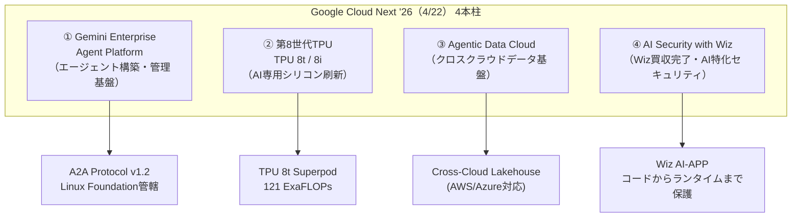

---

### 1.2 Gemini Enterprise Agent Platform

**公開日:** 2026年4月22日（GA）

エージェントの設計・実行・ガバナンスを一元管理するフルスタックプラットフォーム。

**主要コンポーネント:**

| コンポーネント | 内容 |
|---|---|
| **Agent Designer** | スケジュール/トリガーベースのエージェントを GUI で構築。条件分岐・長時間実行・マルチステップ対応 |
| **Agent Inbox** | エージェント全アクティビティの管理ダッシュボード。ヒューマンインループ承認フロー |
| **Agent Identity** | エージェントごとに一意のIDと認証フロー、スコープ付き委任を付与 |
| **Agent Gateway** | MCP・A2A など全エージェント間・エージェント-ツール間の通信を監査・ポリシー強制 |
| **Skills & Projects** | エージェントに再利用可能なスキルをアタッチ。複数エージェントを Projects でまとめ管理 |

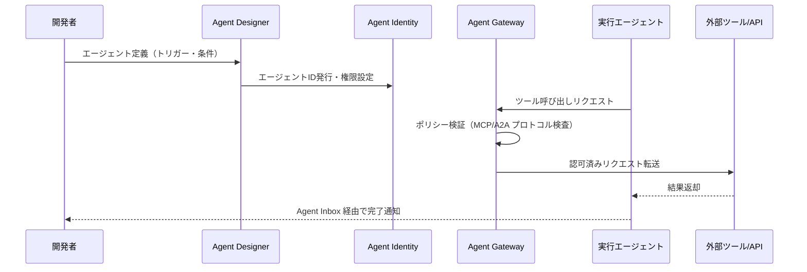

---

### 1.3 第8世代TPU：TPU 8t / TPU 8i

**公開日:** 2026年4月22日（Google Cloud Next '26）

AIの学習と推論を分業する専用設計の2チップ構成。

**TPU 8t（学習特化）:**

| 項目 | 数値 |
|---|---|
| **Superpodスケール** | 9,600チップ |
| **共有HBM** | 2ペタバイト |
| **Superpod性能** | **121 ExaFLOPs** |
| **前世代比** | Superpod単位で約3倍の性能 |

**TPU 8i（推論特化）:**

| 項目 | 数値 |
|---|---|
| **HBM容量** | 288 GB |
| **オンチップSRAM** | 384 MB（前世代比3倍） |
| **Interconnect帯域** | 19.2 Tb/s（MoEモデル向け。前世代比2倍） |
| **コレクティブ加速** | オンチップ Collectives Acceleration Engine（レイテンシ最大5分の1） |
| **コスト効率** | 前世代比 **80%向上（perf/dollar）** |

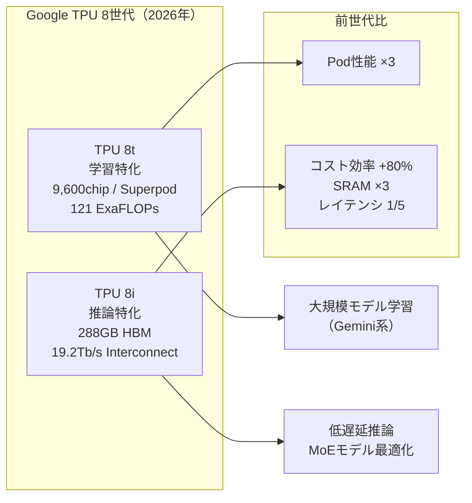

---

### 1.4 Agent2Agent（A2A）プロトコル v1.2 アップデート

**背景:** Googleが2026年3月に発表したオープンプロトコルが急速に普及し、Cloud Next '26時点でバージョン1.2・Linux Foundation管轄に進化。

**現状（2026年4月）:**

| 指標 | 数値・内容 |
|---|---|
| **本番利用組織数** | **150社**（パイロットではなく本番稼働） |
| **ガバナンス移管先** | Linux Foundation の **Agentic AI Foundation** |
| **バージョン** | 1.2 |
| **セキュリティ強化** | Signed Agent Cards（暗号署名によるドメイン検証） |

**本番稼働中の主要パートナー:** Microsoft、AWS、Salesforce、SAP、ServiceNow

**MCP（Model Context Protocol）との役割分担:**

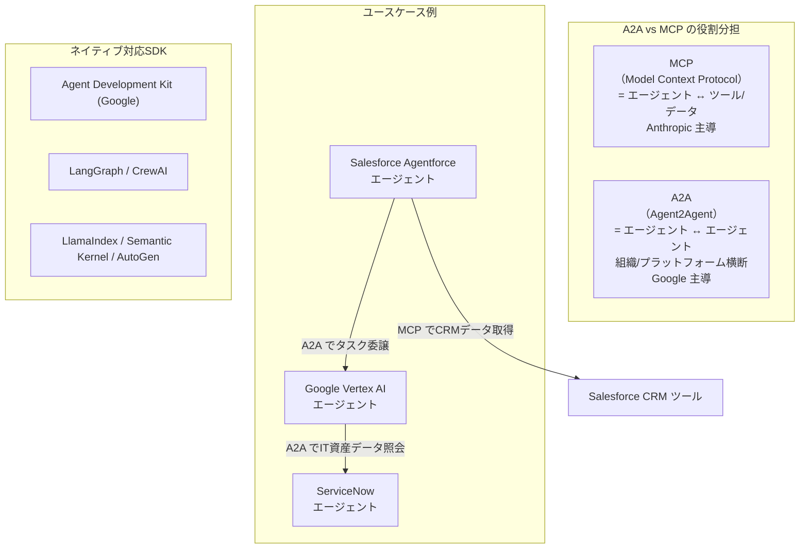

---

### 1.5 Agentic Data Cloud + Google × Wiz AI セキュリティ

#### Agentic Data Cloud（Cloud Next '26）

| 機能 | 内容 |
|---|---|
| **Cross-Cloud Lakehouse** | AWS・Azure へのゼロコピーアクセスを実現するクロスクラウドデータ基盤 |
| **Knowledge Catalog** | エージェントのグラウンディング用ナレッジカタログ。RAGパイプラインに直接統合 |
| **Deep Research Agent** | 複数データソースを自律的に横断し、インテリジェンスレポートを自動生成するエージェント |

#### Google × Wiz AI セキュリティ（Wiz買収完了後初の共同発表）

**新設セキュリティエージェント群:**

| エージェント | 役割 |
|---|---|
| **Threat Hunting Agent** | 従来の検知を回避する新たな攻撃パターンを能動的に探索 |
| **Detection Engineering Agent** | カバレッジギャップを特定し、特定の脅威シナリオ向け新検知ルールを自動生成 |
| **Third-Party Context Agent** | 外部インテリジェンスソースからのコンテキストでアナリストワークフローを強化 |

**Wiz AI-APP（AI Application Protection Platform）:**
- コードレビュー時点でプロンプトインジェクション・安全でないAI生成コードを検出
- IDEおよびエージェントワークフロー（Gemini Enterprise Agent Platform、AWS Agentcore、Salesforce Agentforce等）に直接統合

---

## 2. Microsoft Azure AIアップデート

### 2.1 Azure AI Foundry Model Router（GA）

**概要:** プロンプトの内容を分析し、最適なモデルを自動選択するデプロイ可能なAIチャットモデル。

**主要機能（最新アップデート）:**

| 機能 | 内容 |
|---|---|
| **GPT-5系モデル対応** | gpt-5.2、gpt-5.2-chat に加え Deepseek-v3.2、claude-opus-4-6 もルーティング対象 |
| **自動フェイルオーバー** | モデルエンドポイントの不安定時に次善のモデルへ透過的に切り替え（追加設定不要） |
| **ツール使用サポート** | Foundry Agent Service 内でのモデルルーター対応。ターン単位でのモデル最適選択が可能 |
| **ルーティングプロファイル** | 品質/コストのどちらを優先するかをプロファイルで制御 |

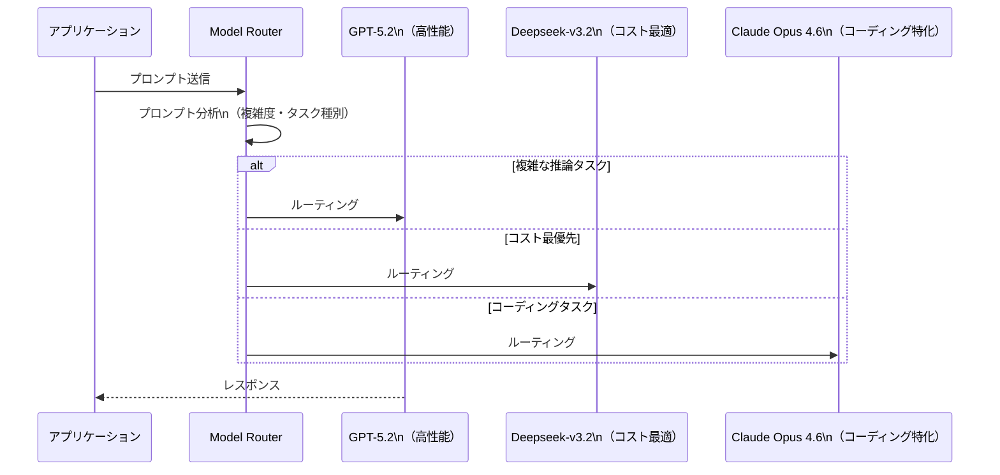

### 2.2 Spillover（GA）

**概要:** プロビジョニング済みデプロイメントのトラフィック急増を自動吸収する機能が一般提供（GA）に。

- プロビジョニングデプロイメントの処理上限超過時、指定したスタンダードデプロイメントへ自動でオーバーフロー
- SLAの維持とコスト最適化を両立
- 追加コードなし・既存デプロイメント設定に1パラメータ追加するだけで有効化

### 2.3 Microsoft-OpenAI パートナーシップ再編（2026年4月27日）

7年間続いたMicrosoft独占提供契約が終了。新体制の概要。

**変更内容:**

| 項目 | 旧体制 | 新体制（2026年4月27日〜） |
|---|---|---|
| **クラウド独占** | Azureが独占的な配信プラットフォーム | **独占解消**。OpenAIはどのクラウドでも提供可能 |
| **Azureの位置づけ** | 唯一のクラウドパートナー | **プライマリクラウドパートナー**（最優先リリース） |
| **IPライセンス** | 独占的 | **非独占的**（2032年まで有効） |
| **レベニューシェア** | MicrosoftがOpenAIへ支払い | **MicrosoftからOpenAIへの支払いは終了**。逆方向（OpenAI→Microsoft）は2030年まで継続（上限キャップ付き） |

**変更のきっかけ:** 2026年2月のOpenAI×AWS戦略的提携（最大$500億規模）が既存の独占条項と構造的に矛盾したため。

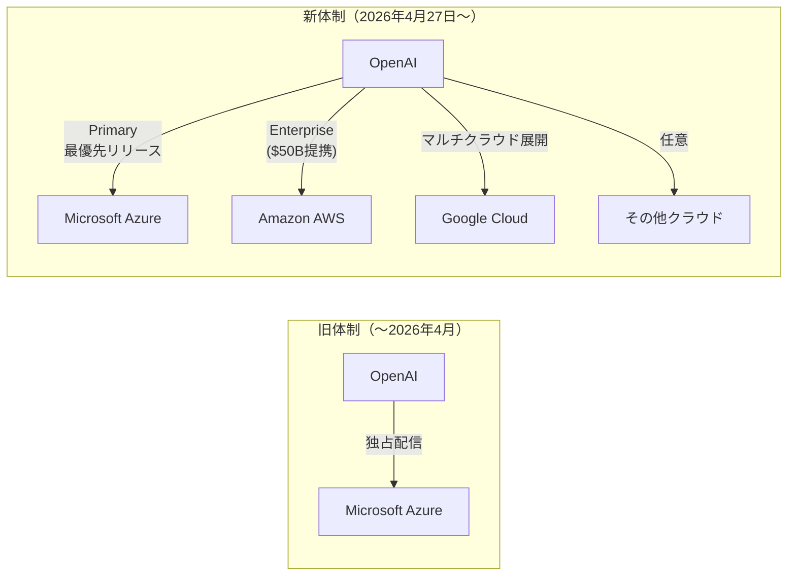

---

## 3. LLM Model / AI Agentアーキテクチャ・研究論文

### 3.1 DeepSeek Engram：条件付きメモリによるスパース性の新軸（arXiv:2601.07372）

**論文タイトル:** "Conditional Memory via Scalable Lookup: A New Axis of Sparsity for Large Language Models"  
**公開日:** 2026年1月12日  
**著者:** DeepSeek AI（梁文鋒ら）+ 北京大学  
**オープンソース:** https://github.com/deepseek-ai/Engram

**問題意識:** Transformerは「静的な知識（エンティティ名・固定フレーズ）」と「動的な推論」を同一Attention計算で処理しており、リソースが非効率に使われている。MoEが「計算量の削減」を解決したのに対し、Engramは「盲目的な計算をなくす」ことを目指す。

**EngramのO(1)メモリ参照:**

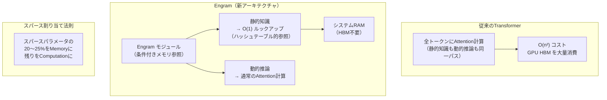

**性能結果（27Bパラメータモデル）:**

| 指標 | ベースライン | Engram適用後 |
|---|---|---|
| 知識・推論・コーディングベンチ | 基準 | **+3〜5ポイント** |
| Needle-in-a-Haystack精度 | 84.2% | **97.0%** |

**意義:** DeepSeek V4への採用が示唆されており、LLMがGPUのHBM制約を回避しながらスケールアップできる新しい設計軸として注目。

---

### 3.2 Claude Codeの解剖：AIエージェントの「1.6%問題」（arXiv:2604.14228）

**論文タイトル:** "Dive into Claude Code: A Systematic Analysis and Discussion of Claude Code for Designing Today's and Future AI Agent Systems"  
**著者:** Jiacheng Liu ほか（VILA-Lab）  
**公開日:** 2026年4月

**主な発見:**

> Claude Codeのコードベース全体のうち、**AIによる意思決定ロジックはわずか1.6%**。残りの98.4%は決定論的なインフラストラクチャ。

**98.4%の内訳:**

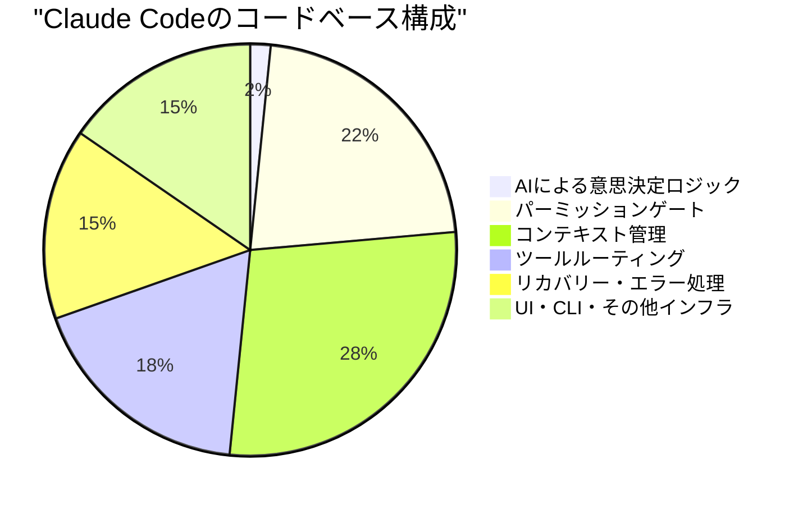

**実践的含意:**
- 高性能なAIエージェントを構築するには、LLMそのものより「インフラ層」の設計が支配的
- パーミッション制御・コンテキスト管理・ツール選択・エラー回復が信頼性を決定する
- AIコーディングエージェントの設計においてはフレームワーク/オーケストレーション層への投資が最重要

---

## 4. 公式ブログ・論文のリサーチ・要約

### 4.1 OpenAI

#### GPT-5.5 Instant：ChatGPTデフォルトモデル更新（2026年5月5日）

OpenAIがChatGPTのデフォルトモデルを **GPT-5.3 Instant → GPT-5.5 Instant** に更新。全ユーザーへ即日ロールアウト。

**主要改善点:**

| 指標 | GPT-5.3 Instant | GPT-5.5 Instant |
|---|---|---|
| **ハルシネーション削減** | 基準 | **52.5%削減**（医療・法律・金融などの高リスク領域） |
| **パーソナライゼーション** | 限定的 | 過去会話・保存ファイル・**Gmailまで参照可能** |
| **絵文字抑制** | 多用傾向 | 不必要な絵文字を大幅削減 |

**新機能「Memory Sources」:**
- ChatGPTが回答のパーソナライズに使用したコンテキスト（保存済みメモリ、過去の会話）をユーザーに表示するコントロールパネル
- Plus/Proユーザー向けにWeb版から先行展開

**API展開:**
- API識別子: `chat-latest` → GPT-5.5 Instantにマッピング
- GPT-5.3 Instantは有料ユーザー向けに3ヶ月間選択可能（その後廃止予定）

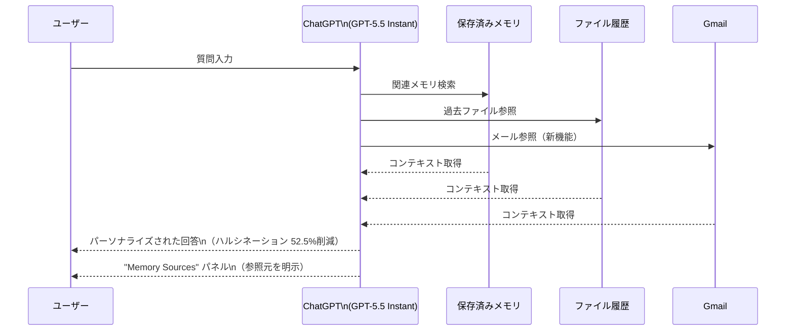

---

### 4.2 Anthropic

#### Claude Mythos Preview + Project Glasswing（2026年4月7日）

Anthropicが次世代フロンティアモデル **Claude Mythos Preview** を限定公開し、同時にセキュリティ業界コンソーシアム **Project Glasswing** を発足。

**Claude Mythos Previewのサイバーセキュリティ能力:**

| 指標 | 数値 |
|---|---|
| **CTF（専門家レベル）タスク成功率** | **73%**（2025年4月以前はどのモデルも0%） |
| **特定された未修正ゼロデイ脆弱性** | 主要OS・主要ブラウザを含む全プラットフォームで**数千件** |
| **自律攻撃実行（制御環境）** | マルチステージ攻撃を実行（人間のセキュリティ専門家が数日かける作業） |

**注目の修正済み発見:**
- OpenBSDの**27年物のバグ**を発見・パッチ適用済み
- FFmpegの**16年物の脆弱性**を発見・パッチ適用済み
- メモリセーフVMモニターにおけるメモリ破壊脆弱性

**Anthropicの対応：一般公開を非公開にし、Project Glasswingを設立**

**Project Glasswing 概要:**

| 項目 | 内容 |
|---|---|
| **目的** | 悪意ある利用者がMyth osの能力を悪用する前に、防御側が先に脆弱性を発見・修正する |
| **参加企業** | AWS、Apple、Microsoft、Google、CrowdStrike、Palo Alto Networks ほか約40組織 |
| **Anthropicのコミットメント** | **モデル利用クレジット $1億（$100M）** を参加企業へ提供 |
| **オープンソースへの寄付** | オープンソースセキュリティ団体へ最大 **$400万（$4M）** の直接寄付 |

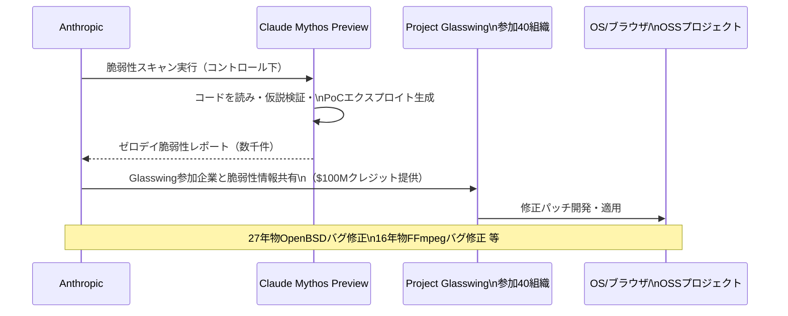

**セキュリティ業界への影響:**
- AI能力の「オフェンシブ/ディフェンシブ」両用性が現実化したことを業界に認識させる事例
- 英国AISI（AI Safety Institute）がMyths Previewの独立評価を実施・公開

---

#### Claude Design：Anthropic Labs ビジュアル制作ツール（2026年4月17日）

**公開:** リサーチプレビュー（Claude Pro/Max/Team/Enterprise向け）  
**開発:** Anthropic Labs × Canva 共同開発

**概要:** Claude Opus 4.7を活用し、デザイン・プロトタイプ・スライドを自然言語で生成・編集するビジュアル制作ツール。

**主要機能:**

| 機能 | 内容 |
|---|---|
| **インタラクティブ出力** | 静止画像ではなく **ライブHTML**。クリック可能・テスト可能なインタラクティブアウトプット |
| **デザインシステム構築** | コードベース・デザインファイルを読み込み、チーム固有のデザインシステムを自動生成 |
| **インライン編集** | 特定要素へのコメント、テキスト直接編集、スペーシング・カラー・レイアウトの調整ノブ |
| **エクスポート形式** | Canva・PDF・PPTX・スタンドアロンHTML |
| **Claude Codeとの連携** | 完成デザインを1コマンドでClaude Codeへ渡してコード化するハンドオフバンドル |

---

#### Claude Managed Agents Memory：クロスセッション学習（2026年4月23日 パブリックベータ）

**概要:** Claude Managed Agentsにファイルシステムベースの永続メモリを追加。エージェントがセッションをまたいで学習・記憶を蓄積できるように。

**アーキテクチャ:**

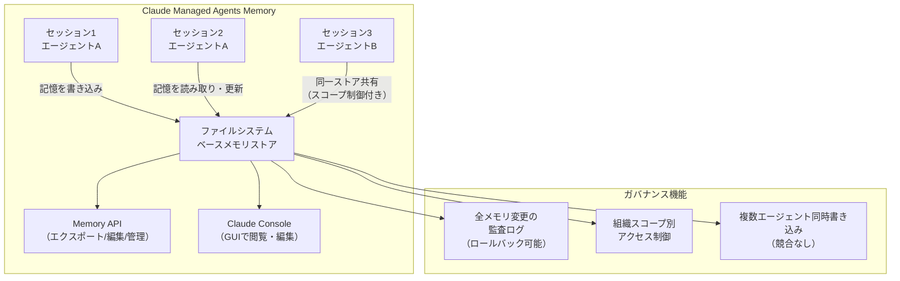

**早期採用企業の実績:**

| 企業 | 成果 |
|---|---|
| Netflix | 文書検証ワークフローの初回エラー **97%削減** |
| Rakuten | 処理速度 **30%向上** |
| Wisedocs | 医療記録処理の精度向上 |
| Ando | — |

---

## 5. AI Agent搭載SaaS製品情報

### 5.1 Salesforce Agentforce Operations（GA：2026年4月29日）

Salesforceが初めてバックオフィス業務を対象としたAgentforceソリューションをGA。従来のフロントオフィス（営業・カスタマーサービス）に続き、業務プロセス自動化の領域へ拡張。

**主要機能:**

| 機能 | 内容 |
|---|---|
| **Intelligent Operations** | 複数エージェントがタスクとタイムラインを調整し、手動作業が必要な箇所を自律完了 |
| **Instant Blueprints** | 非構造化ドキュメントやホワイトボード図をデジタルワークフローに数分で変換 |
| **プレーンテキスト更新** | 開発者不要でビジネスリーダーが自然言語でプロセスを変更 |
| **Salesforce Flows連携** | データ自動同期・アクショントリガー（Betaは2026年5月予定） |

**定量的効果:**
- バックオフィスのサイクルタイム **最大70%削減**
- 手動エラー **80%削減**

**業種別ユースケース:**

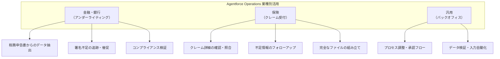

### 5.2 Salesforce Agentforce：Google Geminiのネイティブサポート追加

Agentforceの推論エンジン **Atlas Reasoning Engine** が対応モデルを拡張。

**対応モデル（最新）:**
- OpenAI（既存）
- Anthropic（Amazon Bedrock経由、既存）
- **Google Gemini（新規追加）**

これにより、企業はAgentforceエージェントの推論バックエンドとして3大AIプロバイダーのモデルを選択・切り替え可能に。

---

## 6. その他特筆すべき情報

### 6.1 A2A + MCP：エージェント間通信プロトコルの業界標準化加速

2026年春時点で、エージェント間通信の標準として2つのプロトコルが業界規模で採用が進んでいる。

**標準化の現状（2026年5月）:**

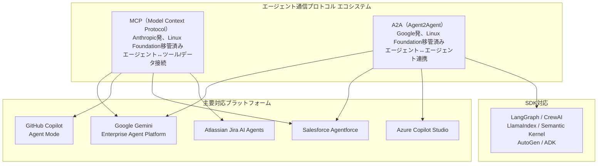

**意義:** 2つの補完的なオープンプロトコルがLinux Foundationの傘下で標準化され、エージェントエコシステムのインターオペラビリティが確立しつつある。MCP（ツール接続）とA2A（エージェント間）で役割分担することで、マルチベンダー・マルチプラットフォームでの複雑なエージェントワークフロー構築が現実的に。

---

### 6.2 AI Foundry の競合構図（2026年5月時点）

Google Cloud Next '26・Azure・Anthropic・OpenAIの各発表を踏まえた、エンタープライズAIエージェント基盤の競合構図。

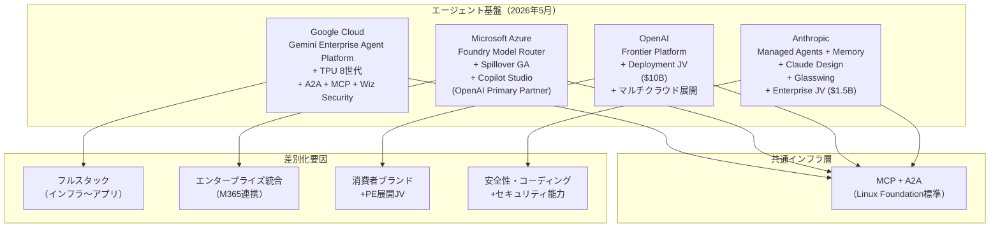

---

## 7. 参考リンク

### Google Cloud Next '26
- [Sundar Pichai shares news from Google Cloud Next 2026](https://blog.google/innovation-and-ai/infrastructure-and-cloud/google-cloud/cloud-next-2026-sundar-pichai/)
- [Google Cloud Next 2026: News and updates](https://blog.google/innovation-and-ai/infrastructure-and-cloud/google-cloud/next-2026/)
- [7 highlights and announcements from Google Cloud Next '26](https://blog.google/innovation-and-ai/infrastructure-and-cloud/google-cloud/google-cloud-next-26-recap/)
- [Our eighth generation TPUs: two chips for the agentic era](https://blog.google/innovation-and-ai/infrastructure-and-cloud/google-cloud/eighth-generation-tpu-agentic-era/)
- [Google Cloud Next '26: Gemini Enterprise Agent Platform Leads AI-Centric News](https://virtualizationreview.com/articles/2026/04/24/google-cloud-next-26-gemini-enterprise-agent-platform-leads-ai-centric-news.aspx)
- [Agent2Agent protocol (A2A) is getting an upgrade](https://cloud.google.com/blog/products/ai-machine-learning/agent2agent-protocol-is-getting-an-upgrade)
- [Next '26: Redefining security for the AI era with Google Cloud and Wiz](https://cloud.google.com/blog/products/identity-security/next26-redefining-security-for-the-ai-era-with-google-cloud-and-wiz)
- [Google Cloud Next 2026: The Agentic Enterprise Control Plane Comes into View (Bain & Co.)](https://www.bain.com/insights/google_cloud_next_2026_the_agentic_enterprise_control_plane_comes_into_view/)

### Microsoft Azure
- [Model router for Microsoft Foundry concepts](https://learn.microsoft.com/en-us/azure/foundry/openai/concepts/model-router)
- [Architecting Cost-Aware LLM Workloads with Model Router in Microsoft Foundry](https://techcommunity.microsoft.com/blog/azure-ai-foundry-blog/architecting-cost-aware-llm-workloads-with-model-router-in-microsoft-foundry/4514440)
- [The next phase of the Microsoft-OpenAI partnership](https://blogs.microsoft.com/blog/2026/04/27/the-next-phase-of-the-microsoft-openai-partnership/)
- [OpenAI ends Microsoft legal peril over its $50B Amazon deal (TechCrunch)](https://techcrunch.com/2026/04/27/openai-ends-microsoft-legal-peril-over-its-50b-amazon-deal/)
- [Microsoft and OpenAI End Azure Exclusivity](https://letsdatascience.com/blog/microsoft-openai-end-exclusivity-april-27-2026)

### OpenAI
- [OpenAI releases GPT-5.5 Instant, a new default model for ChatGPT (TechCrunch)](https://techcrunch.com/2026/05/05/openai-releases-gpt-5-5-instant-a-new-default-model-for-chatgpt/)
- [OpenAI's GPT-5.5 Instant reduces hallucinations by 52.5%](https://rollingout.com/2026/05/05/openais-gpt-5-5-instant-reduces/)
- [OpenAI updates ChatGPT with GPT-5.5 Instant (Axios)](https://www.axios.com/2026/05/05/openai-chatgpt-update-default-model)

### Anthropic
- [Claude Mythos Preview (Anthropic Red Team Blog)](https://red.anthropic.com/2026/mythos-preview/)
- [Project Glasswing: Securing critical software for the AI era](https://www.anthropic.com/glasswing)
- [Anthropic's Claude Mythos Finds Thousands of Zero-Day Flaws (The Hacker News)](https://thehackernews.com/2026/04/anthropics-claude-mythos-finds.html)
- [Claude Mythos Preview and the new rules of cybersecurity (TechTarget)](https://www.techtarget.com/searchenterpriseai/news/366642478/Claude-Mythos-Preview-and-the-new-rules-of-cybersecurity)
- [Introducing Claude Design by Anthropic Labs](https://www.anthropic.com/news/claude-design-anthropic-labs)
- [Anthropic launches Claude Design, a new product for creating quick visuals (TechCrunch)](https://techcrunch.com/2026/04/17/anthropic-launches-claude-design-a-new-product-for-creating-quick-visuals/)
- [Built-in memory for Claude Managed Agents](https://claude.com/blog/claude-managed-agents-memory)
- [Anthropic adds memory to Claude Managed Agents (SD Times)](https://sdtimes.com/anthropic/anthropic-adds-memory-to-claude-managed-agents/)

### 研究論文
- [DeepSeek Engram: Conditional Memory via Scalable Lookup (arXiv:2601.07372)](https://arxiv.org/html/2601.07372v1)
- [DeepSeek Engram GitHub](https://github.com/deepseek-ai/Engram)
- [Dive into Claude Code (arXiv:2604.14228 / GitHub)](https://github.com/VILA-Lab/Dive-into-Claude-Code)

### SaaS製品
- [Salesforce Launches Agentforce Operations](https://www.salesforce.com/news/stories/agentforce-operations-announcement/)
- [Salesforce Agentforce Operations: Back-Office Automation Details (CIO)](https://www.cio.com/article/4164708/salesforce-expands-beyond-the-front-office-with-agentforce-operations.html)
- [Agentforce 360 Announcements](https://www.salesforce.com/agentforce/what-is-new/)
