# LLM・AI Agent 最新情報レポート Vol.8

**作成日**: 2026年5月6日  
**対象期間**: 2026年4月〜5月初旬（Vol.1〜7との差分）

---

## 目次

1. [Google Cloud AIアップデート](#1-google-cloud-aiアップデート)
2. [Microsoft Azure AIアップデート](#2-microsoft-azure-aiアップデート)
3. [LLM Model / AI Agentアーキテクチャ・研究論文](#3-llm-model--ai-agentアーキテクチャ研究論文)
4. [公式ブログ・論文のリサーチ・要約](#4-公式ブログ論文のリサーチ要約)
   - [Google / DeepMind](#41-google--deepmind)
   - [OpenAI](#42-openai)
   - [Anthropic](#43-anthropic)
5. [AI Agent搭載SaaS製品情報](#5-ai-agent搭載saas製品情報)
6. [その他特筆すべき情報](#6-その他特筆すべき情報)
7. [参考リンク](#7-参考リンク)

---

## 1. Google Cloud AIアップデート

### 1.1 Gemini 3.1 Ultra：2Mトークンコンテキスト × ネイティブマルチモーダル（2026年4月 GA）

Googleが**Gemini 3.1 Ultra**を一般公開。コンテキストウィンドウ2Mトークン（業界最大）と、テキスト・画像・音声・動画をトランスクリプションなしに直接推論できるネイティブマルチモーダルアーキテクチャを搭載した旗艦モデル。[1]

**主要スペック:**

| 項目 | 内容 |
|---|---|
| **コンテキストウィンドウ** | **200万トークン**（約3,000ページ相当のテキスト、8.4時間の音声、1時間の動画） |
| **マルチモーダル** | テキスト・画像・音声・動画をネイティブに同時処理（中間転写不要） |
| **コード実行** | サンドボックス型Code Executionツール（会話中にコード生成・実行・テスト可能） |
| **推論精度** | GPQA Diamondベンチマーク **94.3%**（GPT-5内部ビルドを超え業界最高水準） |
| **アーキテクチャ革新** | Self-Correcting Attention (SCA)：初期プロンプトトークンを定期的に再重み付けし、長文脈での目標整合性を維持 |

**Self-Correcting Attention（SCA）の仕組み:**

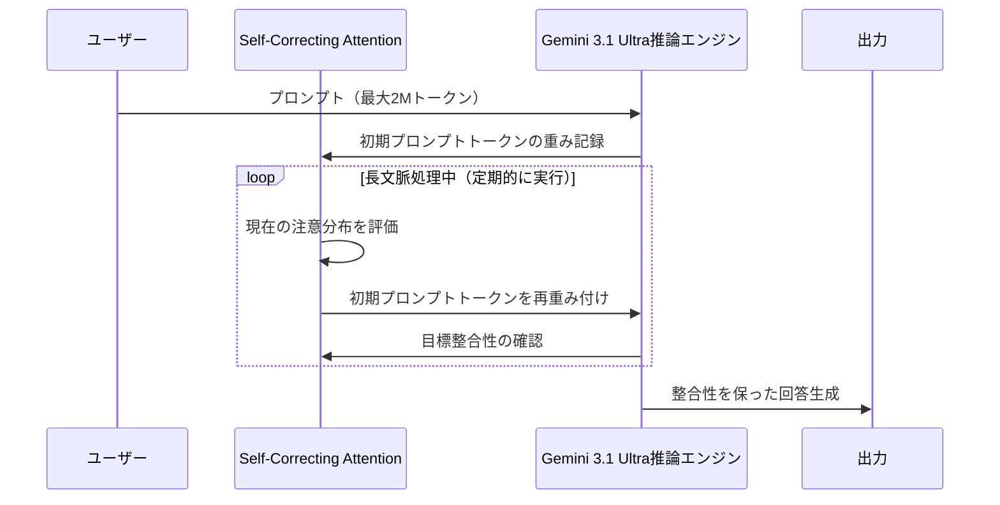

**Gemini 3.xシリーズ最新全体像（Vol.6掲載分との差分を追記）:**

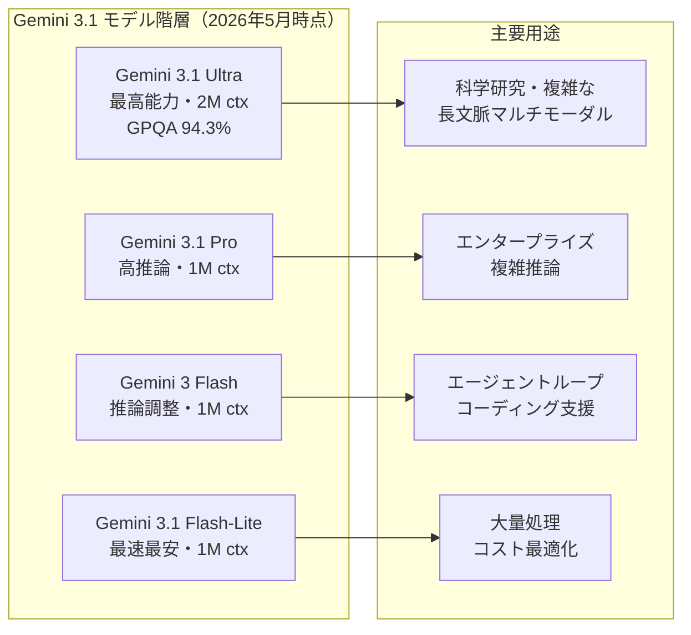

---

## 2. Microsoft Azure AIアップデート

### 2.1 Microsoft独自AIモデル3種：MAIシリーズ（2026年4月2日 Foundry公開プレビュー）

Microsoftが**MAI（Microsoft AI）スーパーインテリジェンスチーム**製の独自基盤モデル3種を発表。Azure Foundryで独占提供を開始し、OpenAIへの技術的依存から脱却する戦略的一手として注目を集めた。[2]

**MAIモデル3種の概要:**

| モデル | 種別 | 主要性能 | 特記事項 |
|---|---|---|---|
| **MAI-Transcribe-1** | 音声認識（STT） | 25言語対応、WER 3.9%（FLEURSベンチマーク）、GPU Cost 50%削減 | Azure Fast比 **2.5倍**の高速バッチ処理 |
| **MAI-Voice-1** | 音声生成（TTS） | シングルGPUで60秒の音声を**1秒未満**で生成 | 10秒の音声サンプルからカスタムボイス生成対応 |
| **MAI-Image-2** | テキスト→画像生成 | Arena.aiリーダーボード**3位**デビュー | 前世代比**2倍以上**の高速化、肌色精度・照明・テキスト描画が改善 |

**MAIモデルのエコシステム位置づけ:**

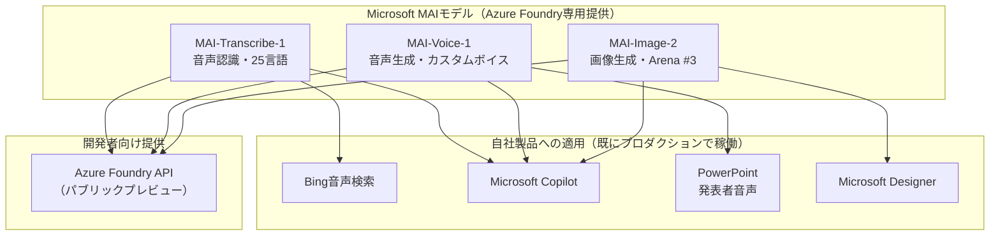

### 2.2 DeepSeek V4 Flash / Pro：Microsoft Foundryへの統合（2026年5月1日）

MicrosoftがAzure Foundryに**DeepSeek V4**シリーズを追加。Open-weightsのMoEモデルを企業向けに管理・提供する形で展開。[3]

**DeepSeek V4シリーズ仕様比較:**

| 項目 | V4 Pro | V4 Flash |
|---|---|---|
| **アーキテクチャ** | Mixture-of-Experts（MoE） | Mixture-of-Experts（MoE） |
| **総パラメータ数** | **1.6T**（活性化: 49B） | **284B**（活性化: 13B） |
| **コンテキスト長** | 1Mトークン | 1Mトークン |
| **主な用途** | 高精度推論・深いコンテキスト理解 | 低レイテンシ・高スループット・コスト重視 |
| **API提供** | 単一エンドポイント（Foundry統合） | 単一エンドポイント（Foundry統合） |
| **安全性注記** | 標準的 | **要注意**（アライメント低め。Azure AI Content Safetyとの併用を推奨） |

### 2.3 Azure AI Foundry 4月アップデート：強化学習ファインチューニングとAgent Framework RC

**強化学習ファインチューニング（RFT）の3大アップデート（2026年4月）:**[4]

1. **Global Training for o4-mini** — 12以上のリージョンで利用可能。トークン単価を引き下げ
2. **GPT-4.1 Model Graders** — より豊かな報酬シグナルを生成できる評価器モデルを追加
3. **RFTベストプラクティスガイド** — 包括的な実装ガイドを公開

**Microsoft Agent Framework（リリース候補版）:**

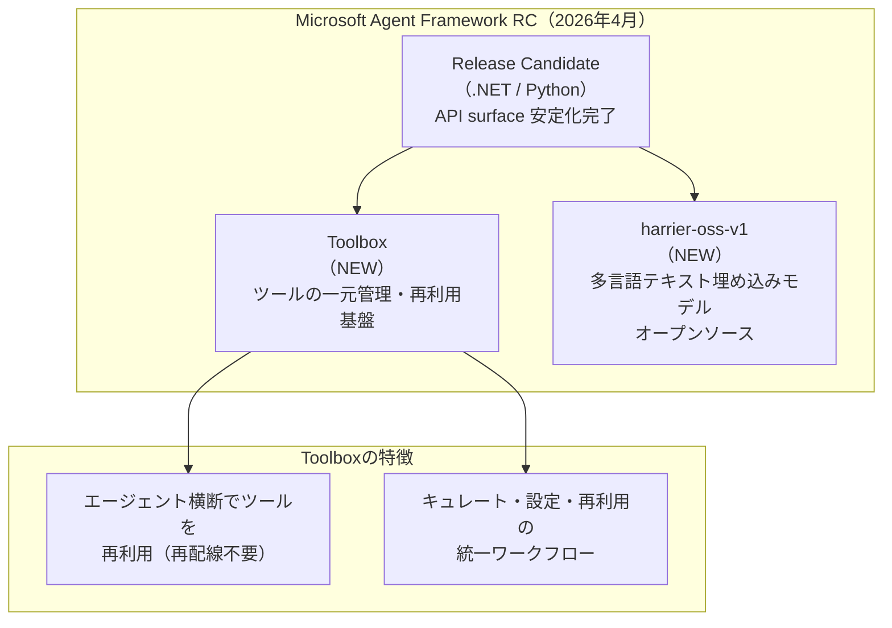

---

## 3. LLM Model / AI Agentアーキテクチャ・研究論文

### 3.1 From LLM Reasoning to Autonomous AI Agents：包括的サーベイ（arXiv:2504.19678）

**公開日:** 2026年4月  
**著者:** Mohamed Amine Ferragら

LLM推論から自律型AIエージェントへの進化を体系的にレビューしたサーベイ論文。2019〜2025年に公開された約60のベンチマークを分類整理。[5]

**アジェンティックリーズニングの3層フレームワーク:**

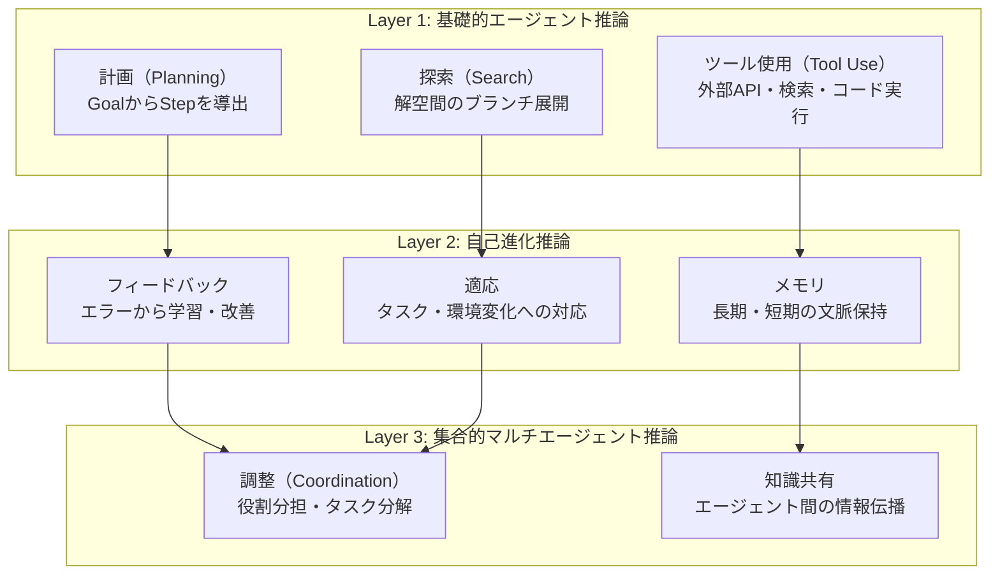

**主要ベンチマーク分類（論文より）:**

| カテゴリ | 代表ベンチマーク | 評価対象 |
|---|---|---|
| 推論・数学 | GPQA Diamond, MATH-500 | 専門家レベルの論理推論 |
| コード生成 | SWE-bench, HumanEval | 実世界のソフトウェアタスク |
| マルチモーダル | MMMU, MMBench | 視覚と言語の統合理解 |
| エージェント | AgentBench, WebArena | 実環境でのタスク達成 |
| 事実根拠 | TruthfulQA, FactScore | ハルシネーション評価 |

### 3.2 LLM-Powered AI Agent Systems and Their Applications in Industry（arXiv:2505.16120）

**公開日:** 2026年5月4日

前LLM時代から現在のLLM駆動アーキテクチャまでの進化を産業応用の観点でまとめた論文。[6]

**エージェントアーキテクチャの進化史:**

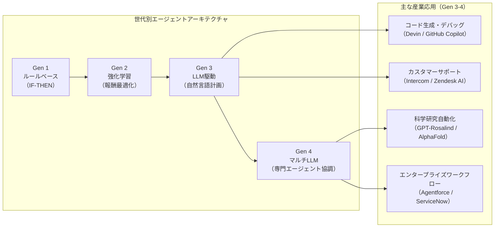

### 3.3 MCP（Model Context Protocol）Linux Foundation移管と97Mインストール達成（2026年3月）

AnthropicのMCPが**9,700万月次SDKダウンロード**を達成（2024年11月のローンチから16ヶ月）。同時にAnthropicはMCPを**Linux Foundation傘下のAgentic AI Foundation**に寄贈することを発表。[7]

**MCP急成長の軌跡:**

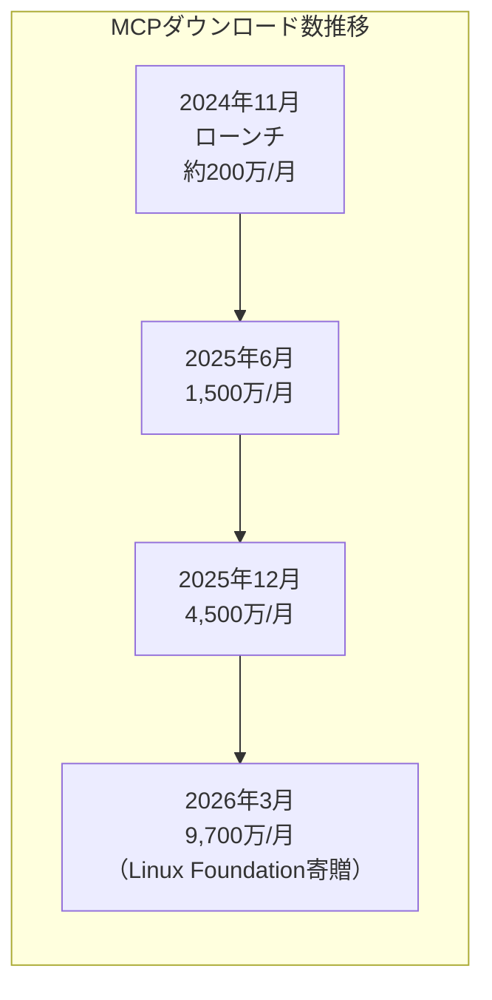

**MCPエコシステムの現状（2026年5月）:**

| 指標 | 数値 |
|---|---|
| **月次SDKダウンロード** | 9,700万 |
| **アクティブMCPサーバー数** | **10,000以上** |
| **対応クライアント（主要）** | ChatGPT、Claude、Cursor、Gemini、Microsoft Copilot、VS Code |
| **ローンチからの成長率** | **4,750%**（16ヶ月） |
| **ガバナンス移管先** | Linux Foundation Agentic AI Foundation |

---

## 4. 公式ブログ・論文のリサーチ・要約

### 4.1 Google / DeepMind

#### Google Cloud Next '26：APIスループット16B tokens/分を突破

Googleによると、ファーストパーティモデルへの直接APIアクセスによるトークン処理量が**16億トークン/分**を突破（前四半期比60%増）。エンタープライズ向けAI需要の急拡大を示す指標として注目。[8]

---

### 4.2 OpenAI

#### GPT-5.5 Instant：ChatGPTの新デフォルトモデル（2026年5月5日）

**GPT-5.5 Instant**が全ChatGPTユーザー向けにロールアウト開始。GPT-5.3 Instantの後継として標準搭載モデルに。[9]

**主要改善点:**

| 改善項目 | 内容 |
|---|---|
| **ハルシネーション削減** | 高リスクトピック（医療・法律・金融）での誤情報生成が**52.5%減** |
| **不正確な回答削減** | ユーザーが問題提起した会話での不正確な主張が**37.3%減** |
| **応答の簡潔化** | 絵文字・過剰フォーマットを排除し情報密度を向上 |
| **パーソナライズ強化** | 過去の会話・ファイル・Gmailを参照した回答が可能（Plus/Proユーザー向け） |
| **マルチモーダル改善** | 写真・画像分析精度の向上、STEM問題の回答品質向上 |

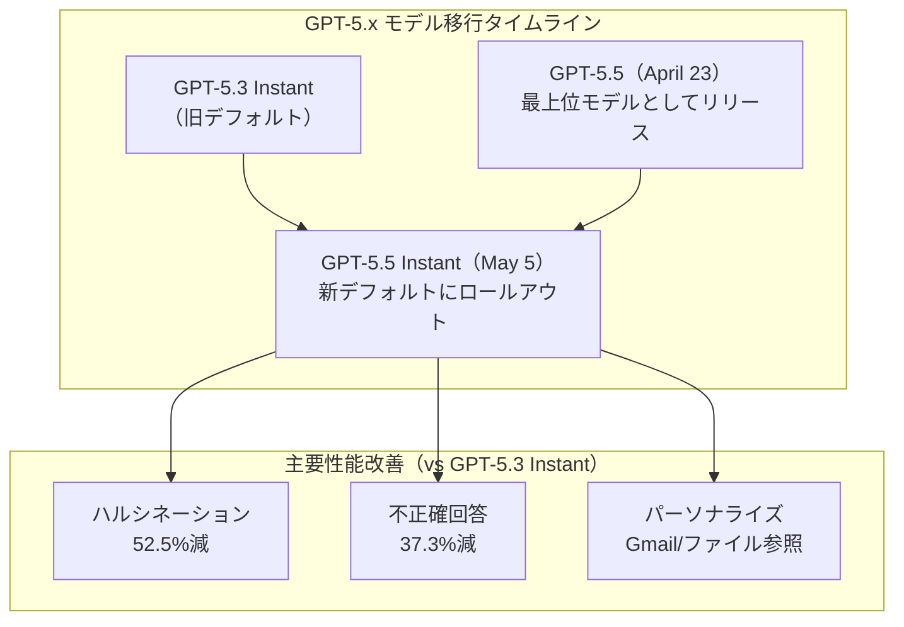

#### GPT-Rosalind：ライフサイエンス特化推論モデル（2026年4月16日）

**GPT-Rosalind**は、創薬・ゲノム解析・タンパク質工学・トランスレーショナル医学を加速するために設計された特化型フロンティア推論モデル。Rosalind Franklin（DNAの二重らせん構造解明に貢献した科学者）にちなんだ命名。[10]

**GPT-Rosalindの設計コンセプト:**

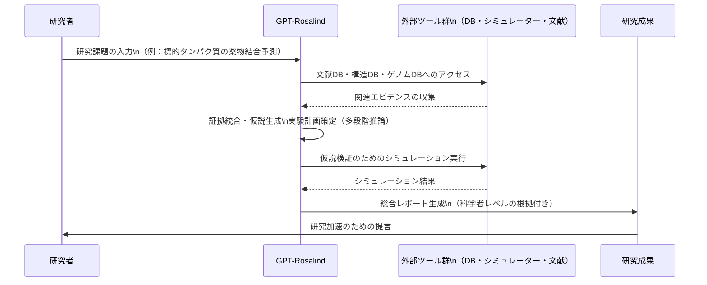

**主な採用パートナー:** Amgen、Moderna、Allen Institute、Thermo Fisher Scientific

**アクセス方法:** 適格顧客向けのトラステッドアクセスプログラム（研究プレビュー）。ChatGPT・Codex・APIで利用可能。

#### OpenAI × 米国エネルギー省：科学研究への協力深化（2026年5月）

OpenAIが**「Year of Science（科学の年）」**を宣言。米国エネルギー省との協力を深化させ、フロンティアモデル・計算資源・実研究環境へのアクセスを科学的発見の加速に活用。[11]

---

### 4.3 Anthropic

#### Claude Opus 4.7 GA：コーディング能力と視覚解析の大幅改善（2026年4月16日）

**Claude Opus 4.7**が一般公開（GA）。コーディング・ビジョン能力を中心に前世代Opus 4.6から大幅に向上。[12]

**主要改善点:**

| カテゴリ | 改善内容 |
|---|---|
| **コーディング** | 93タスクのコーディングベンチマークでOpus 4.6比**13%解決率向上**（Opus 4.6/Sonnet 4.6で解けなかった4タスクを追加解決） |
| **ビジョン** | 最大画像解像度を**2576px/3.75MP**に拡大（前世代1568px/1.15MPから2.4倍） |
| **プロフェッショナルアウトプット** | インターフェース・スライド・ドキュメント生成のクオリティが向上 |
| **価格** | 変更なし（$5/Mトークン input / $25/Mトークン output） |

#### Claude Design：AIネイティブビジュアルデザインツール（2026年4月17日）

**Claude Design**をAnthropicLabsとして発表・リサーチプレビュー公開。Figmaへの挑戦状と評される。[13]

**Claude Designの特徴:**

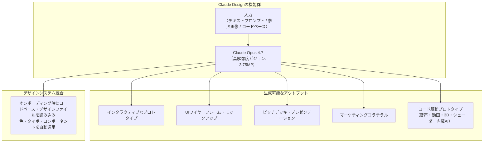

**提供対象:** Claude Pro / Max / Team / Enterprise サブスクライバー（`claude.ai/design`）

#### Claude Security：コード脆弱性スキャン公開ベータ（2026年5月4日）

**Claude Security**がClaude Enterpriseユーザー向けに公開ベータ開始。Opus 4.7が動力源となり、コード脆弱性スキャンと修正提案を自動実行。[14]

---

## 5. AI Agent搭載SaaS製品情報

### 5.1 Salesforce Agentforce 3：A2A・MCP対応でオープンエージェントエコシステムへ

Salesforceが**Agentforce 3**を発表。エージェントの可視性・制御性向上を目玉に、オープンスタンダードであるA2AとMCPの両方をネイティブサポート。[15]

**Agentforce 3の主要機能:**

| 機能 | 内容 |
|---|---|
| **Command Center** | 全AIエージェントのアクティビティを一元監視・制御 |
| **MCP Client（Native）** | MCPサーバーへのコード不要での接続。既存セキュリティポリシーを継承 |
| **A2A Protocol対応** | Agent-to-Agent通信による異種エージェント間の協調実行 |
| **AgentExchange拡大** | AWS、Box、Cisco、Google Cloud、IBM、Notion、PayPal、Stripe等30社以上のパートナー統合 |
| **新モデル・多言語対応** | 最新LLMへの対応と多言語サポートを拡充 |
| **価格改訂** | AIタスク単位の消費課金モデルに移行 |

**Agentforce / MCP / A2Aの役割分担:**

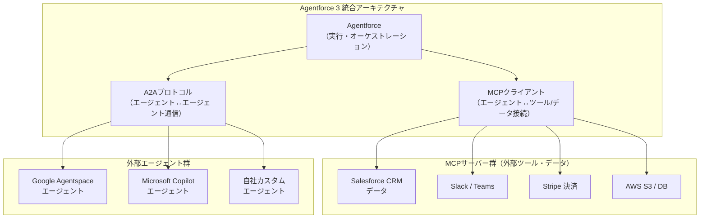

**Agentforce ビジネス指標（Salesforce FY2026年次）:**
- Agentforce ARR: **$8億**
- Agentforce成約件数: **29,000件**（前四半期比+50%）
- Agentforce + Data Cloud ARR合計: **$29億**（前年比+200%以上）

### 5.2 ServiceNow Now Assist：「AIタスク」課金モデルで$10億ACV目標へ

ServiceNowの**Now Assist**フランチャイズが消費ベースの「Assist Packs」モデルを導入。ACVは前年から倍増し$10億目標に向けて加速。[16]

**ServiceNow AIの特記事項:**

| 指標 | 数値 |
|---|---|
| **サブスクリプション収益成長（CY2025）** | 年率+21% |
| **Now Assist ACV** | 前年比**2倍**、$1M超えの大型案件244件 |
| **新課金モデル** | 「AIタスク」単位（Assist Packs）。シートライセンスから脱却 |

---

## 6. その他特筆すべき情報

### 6.1 アジェンティックAI市場規模：$91億（2026年）から$1,390億（2034年）予測

アジェンティックAI市場が**$91億（2026年）**と試算。2034年までに**$1,390億**規模に達する見込み（CAGR: 40.5%）。[17]

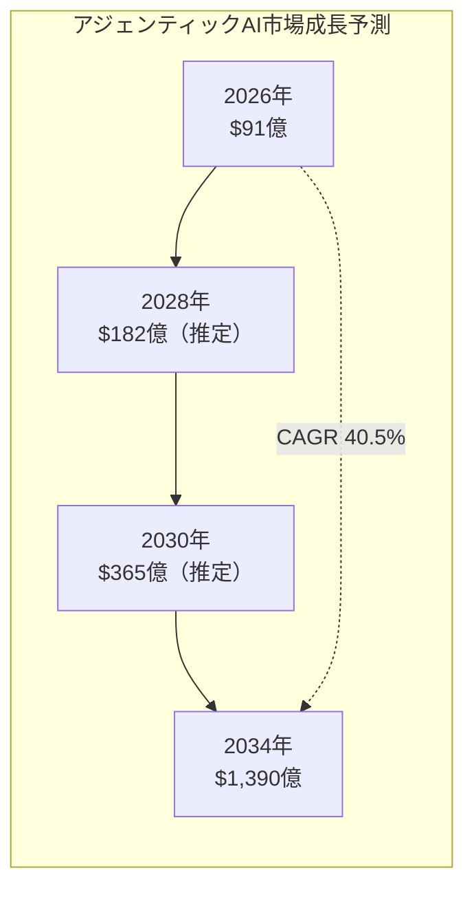

### 6.2 OpenAI × AWSの提携拡大：Bedrockでのモデル展開

OpenAIがMicrosoftとの独占的提携構造を緩和し、**AmazonのBedrockプラットフォームへのモデル展開**を開始（Limited Preview）。GPT-5.5とGPT-5.4が対象。OpenAIの主要クラウドパートナー多様化戦略の一環として注目。[18]

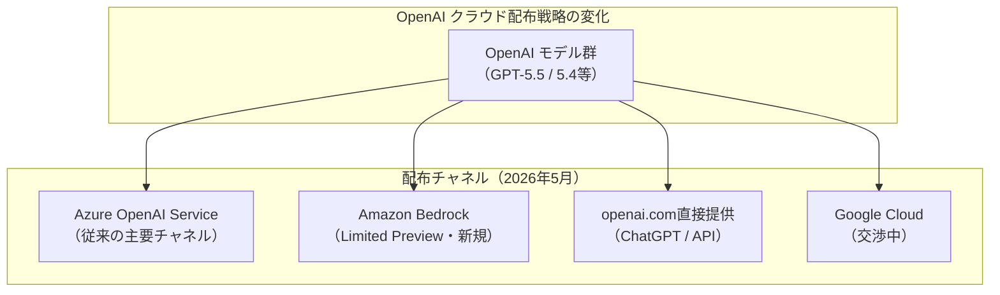

### 6.3 エンタープライズAI市場：SaaS vs AIネイティブの競争構造

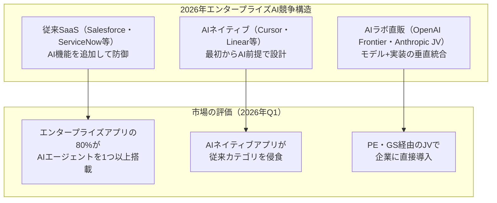

---

## 7. 参考リンク

### Google Cloud [1]
- [Gemini 3.1 Ultra: 2M Context, Multimodal, Beats GPT-5 on Code | Abhishek Gautam](https://www.abhs.in/blog/gemini-3-1-ultra-2m-context-window-multimodal-benchmark-developer-2026)
- [Gemini 3.1 Ultra: Google's Native Multimodal Reasoning Giant | AI2Work](https://ai2.work/blog/gemini-3-1-ultra-google-s-native-multimodal-reasoning-giant)
- [What Google Cloud announced in AI this month | Google Cloud Blog](https://cloud.google.com/blog/products/ai-machine-learning/what-google-cloud-announced-in-ai-this-month)
- [Google Cloud Next 2026: Agents Are the Architecture Now | TechResearchOnline](https://techresearchonline.com/news/google-cloud-next-2026-enterprise-ai-agents/)

### Microsoft Azure [2][3][4]
- [Introducing MAI-Transcribe-1, MAI-Voice-1, and MAI-Image-2 in Microsoft Foundry | Microsoft Community Hub](https://techcommunity.microsoft.com/blog/azure-ai-foundry-blog/introducing-mai-transcribe-1-mai-voice-1-and-mai-image-2-in-microsoft-foundry/4507787)
- [Today we're announcing 3 new world class MAI models | Microsoft AI](https://microsoft.ai/news/today-were-announcing-3-new-world-class-mai-models-available-in-foundry/)
- [Introducing DeepSeek V4 Flash and V4 Pro in Microsoft Foundry | Microsoft Community Hub](https://techcommunity.microsoft.com/blog/azure-ai-foundry-blog/introducing-deepseek-v4-flash-and-v4-pro-in-microsoft-foundry/4515174)
- [What's new in Foundry Labs - April 2026 | Microsoft Community Hub](https://techcommunity.microsoft.com/blog/azure-ai-foundry-blog/whats-new-in-foundry-labs---april-2026/4509714)
- [Azure May 2026: 7 Game-Changing Updates | Hubsite365](https://www.hubsite365.com/en-ww/crm-pages/azure-update-1st-may-2026.htm)

### 研究論文 [5][6][7]
- [From LLM Reasoning to Autonomous AI Agents: A Comprehensive Review (arXiv:2504.19678)](https://arxiv.org/abs/2504.19678)
- [LLM-Powered AI Agent Systems and Their Applications in Industry (arXiv:2505.16120)](https://arxiv.org/html/2505.16120)
- [MCP Hits 97M Downloads: Model Context Protocol Guide | Digital Applied](https://www.digitalapplied.com/blog/mcp-97-million-downloads-model-context-protocol-mainstream)
- [Model Context Protocol Hits 97M Installs as Linux Foundation Takes Over | AI2Work](https://ai2.work/blog/model-context-protocol-hits-97m-installs-as-linux-foundation-takes-over)

### OpenAI [8][9][10][11]
- [What Google Cloud announced in AI this month | Google Cloud Blog](https://cloud.google.com/blog/products/ai-machine-learning/what-google-cloud-announced-in-ai-this-month)
- [GPT-5.5 Instant: smarter, clearer, and more personalized | OpenAI](https://openai.com/index/gpt-5-5-instant/)
- [OpenAI releases GPT-5.5 Instant, a new default model for ChatGPT | TechCrunch](https://techcrunch.com/2026/05/05/openai-releases-gpt-5-5-instant-a-new-default-model-for-chatgpt/)
- [Introducing GPT-Rosalind for life sciences research | OpenAI](https://openai.com/index/introducing-gpt-rosalind/)
- [OpenAI launches new AI model for life sciences research | Axios](https://www.axios.com/2026/04/16/openai-models-life-sciences-drugs)
- [Deepening our collaboration with the U.S. Department of Energy | OpenAI](https://openai.com/index/us-department-of-energy-collaboration/)

### Anthropic [12][13][14]
- [Introducing Claude Opus 4.7 | Anthropic](https://www.anthropic.com/news/claude-opus-4-7)
- [Claude Opus 4.7 is generally available | GitHub Changelog](https://github.blog/changelog/2026-04-16-claude-opus-4-7-is-generally-available/)
- [Introducing Claude Design by Anthropic Labs | Anthropic](https://www.anthropic.com/news/claude-design-anthropic-labs)
- [Anthropic launches Claude Design, a new product for creating quick visuals | TechCrunch](https://techcrunch.com/2026/04/17/anthropic-launches-claude-design-a-new-product-for-creating-quick-visuals/)
- [Claude Security enters public beta with Opus 4.7 | Help Net Security](https://www.helpnetsecurity.com/2026/05/04/anthropic-claude-security-public-beta/)

### AI Agent SaaS [15][16]
- [Salesforce launches Agentforce 3 with AI agent observability and MCP support | VentureBeat](https://venturebeat.com/ai/salesforce-launches-agentforce-3-with-ai-agent-observability-and-mcp-support)
- [Agentforce MCP Support | Salesforce](https://www.salesforce.com/agentforce/mcp-support/)
- [Could Agentforce 3's MCP integration push Salesforce ahead in the CRM AI race? | CIO](https://www.cio.com/article/4012370/could-agentforce-3s-mcp-integration-push-salesforce-ahead-in-the-crm-ai-race.html)
- [The AI Control Tower: A Deep Dive into ServiceNow's GenAI Evolution and 2026 Outlook | FinancialContent](https://markets.financialcontent.com/stocks/article/finterra-2026-3-31-the-ai-control-tower-a-deep-dive-into-servicenows-now-genai-evolution-and-2026-outlook)

### 市場・その他 [17][18]
- [SaaS meets AI agents: Transforming budgets, customer experience, and workforce dynamics | Deloitte](https://www.deloitte.com/us/en/insights/industry/technology/technology-media-and-telecom-predictions/2026/saas-ai-agents.html)
- [AWS Weekly Roundup: OpenAI partnership and more (May 4, 2026) | AWS News Blog](https://aws.amazon.com/blogs/aws/aws-weekly-roundup-whats-next-with-aws-2026-amazon-quick-openai-partnership-and-more-may-4-2026/)
