# LLM・AI Agent 最新情報レポート Vol.10

**作成日**: 2026年5月6日  
**対象期間**: 2026年4月下旬〜5月上旬（Vol.1〜9との差分）

---

## 目次

1. [Google Cloud AIアップデート](#1-google-cloud-aiアップデート)
2. [Microsoft Azure AIアップデート](#2-microsoft-azure-aiアップデート)
3. [LLM Model / AI Agentアーキテクチャ・研究論文](#3-llm-model--ai-agentアーキテクチャ研究論文)
4. [公式ブログ・論文のリサーチ・要約](#4-公式ブログ論文のリサーチ要約)
   - [Google / DeepMind](#41-google--deepmind)
   - [OpenAI](#42-openai)
   - [Anthropic](#43-anthropic)
5. [AI Agent搭載SaaS製品情報](#5-ai-agent搭載saas製品情報)
6. [その他特筆すべき情報](#6-その他特筆すべき情報)
7. [参考リンク](#7-参考リンク)

---

## 1. Google Cloud AIアップデート

### 1.1 Gemini Enterprise Agent Platform：フルスタックのエージェント開発・運用基盤（Google Cloud Next '26）

Google Cloud Next '26（2026年4月22〜24日）の最大発表として、**Gemini Enterprise Agent Platform**が登場。Vertex AIを進化させた形で、エンタープライズがエージェントを「構築・スケール・ガバナンス・最適化」するためのワンストップ基盤を提供する。[[1]](#ref-1)[[2]](#ref-2)

**Gemini Enterprise Agent Platformの主要コンポーネント:**

| コンポーネント | 概要 |
|---|---|
| **Agent Designer V2** | ドラッグ＆ドロップのFlowキャンバス・ステップ制御・本番前テスト統合。コードゼロでエージェントを設計 |
| **Inbox（統合受信トレイ）** | 長時間実行エージェントも含む全エージェントのアクティビティを一元管理。「要入力 / エラー / 完了」の3カテゴリ |
| **Skills** | 反復タスク向けの再利用可能なスキルブロック |
| **Projects** | チーム単位のエージェントプロジェクト管理 |
| **Data Insights Agent** | 自然言語リクエストからSQL・セマンティッククエリ・ビジュアライゼーションを自動生成するネイティブエージェント |

**Gemini Enterprise Agent Platformの全体アーキテクチャ:**

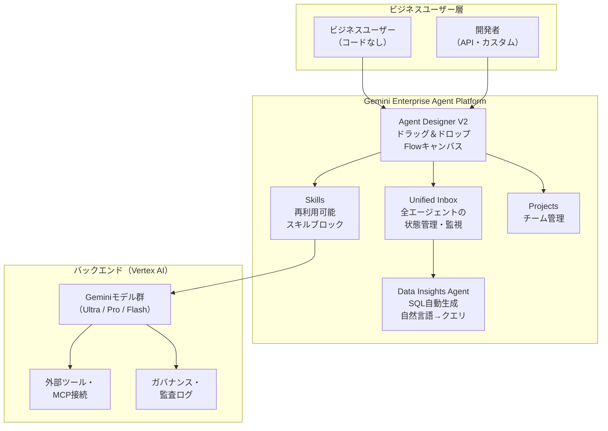

---

### 1.2 Google第8世代TPU（TPU 8t / TPU 8i）：エージェント時代のAIチップ

Google Cloud Next '26で発表した**第8世代Tensor Processing Unit**は、学習用「TPU 8t」と推論用「TPU 8i」の2チップ構成で「エージェント時代」に特化した設計。[[3]](#ref-3)[[4]](#ref-4)

**TPU 8t / 8i スペック比較:**

| 項目 | TPU 8t（学習用） | TPU 8i（推論用） |
|---|---|---|
| **主用途** | 大規模モデル学習 | 高速推論・エージェント実行 |
| **最大スーパーポッド** | 9,600 TPU・共有HBM **2PB** | — |
| **Inter-Chip Interconnect** | 次世代ICI技術 | — |
| **処理能力** | 前世代（Ironwood）比 **3倍** | — |
| **電力効率** | 前世代比 **2倍** 性能/W | — |
| **推論コスト効率** | — | 前世代比 **80%向上**（性能/ドル） |

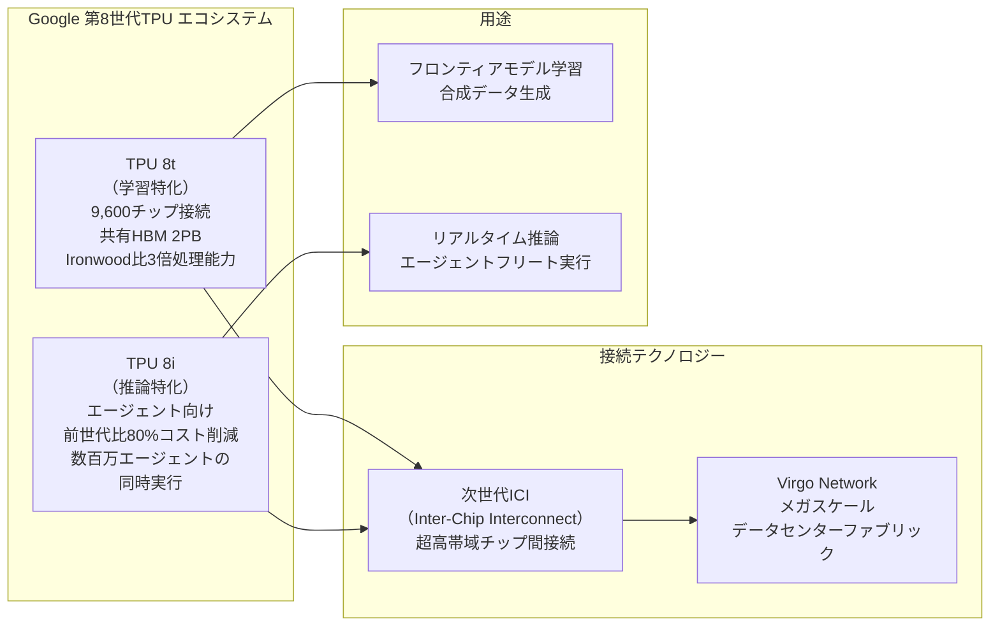

**意義:** TPU 8iは「数百万の同時エージェント実行」を低コストで支える設計となっており、Googleのエージェントファースト戦略の基盤インフラとして位置づけられている。

---

### 1.3 Workspace Intelligence：Geminiが全Workspaceデータを常時グラウンディング（2026年4月22日）

GoogleがCloud Next '26で**Workspace Intelligence**を発表。GmailやDrive・Chat・Calendarの情報をリアルタイムにセマンティック解析し、Geminiの全タスクに自動的にコンテキストを付与する仕組み。[[5]](#ref-5)[[6]](#ref-6)

**Workspace Intelligenceが解決する課題と仕組み:**

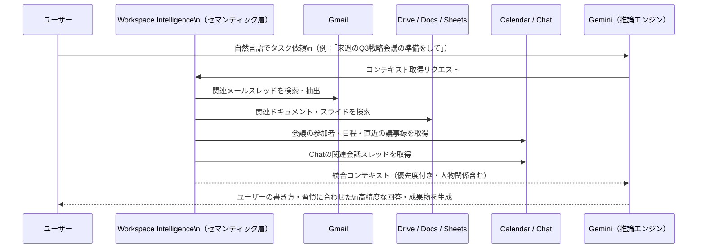

**主要特徴:**

| 機能 | 内容 |
|---|---|
| **リアルタイム意味理解** | メール・チャット・ファイル・同僚・プロジェクトを知識グラフに変換 |
| **パーソナライゼーション** | ユーザーの文体・フォーマット・コミュニケーションパターンを学習し出力に反映 |
| **データソース制御** | 管理者がAdmin consoleから組織単位でデータソースを制限可能 |
| **Docs連携** | ドキュメント内に業務データに基づくインフォグラフィックを自動生成 |

---

### 1.4 Workspace AI Control Center：エンタープライズ向けAIガバナンスの一元管理（2026年5月4日）

GoogleがGoogle Workspace Admin consoleに**AI Control Center**を追加。組織内の生成AI・エージェントのデータアクセスを単一ペインで管理するガバナンスハブ。[[7]](#ref-7)[[8]](#ref-8)

**AI Control Centerの4つのモジュール:**

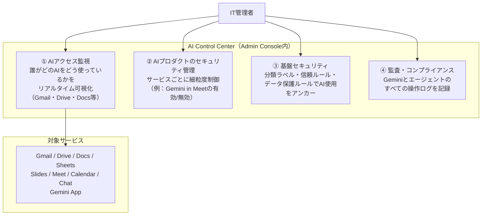

---

## 2. Microsoft Azure AIアップデート

### 2.1 Microsoft Agent 365 GA：エンタープライズAIエージェントの制御プレーンが一般公開（2026年5月1日）

Microsoftが**Microsoft Agent 365**を一般提供（GA）開始。企業内のすべてのAIエージェントを「観察・統治・保護」するコントロールプレーンとして機能する。スタンドアロン価格は**$15/ユーザー/月**。[[9]](#ref-9)[[10]](#ref-10)

**Agent 365の3本柱（Observe / Govern / Secure）:**

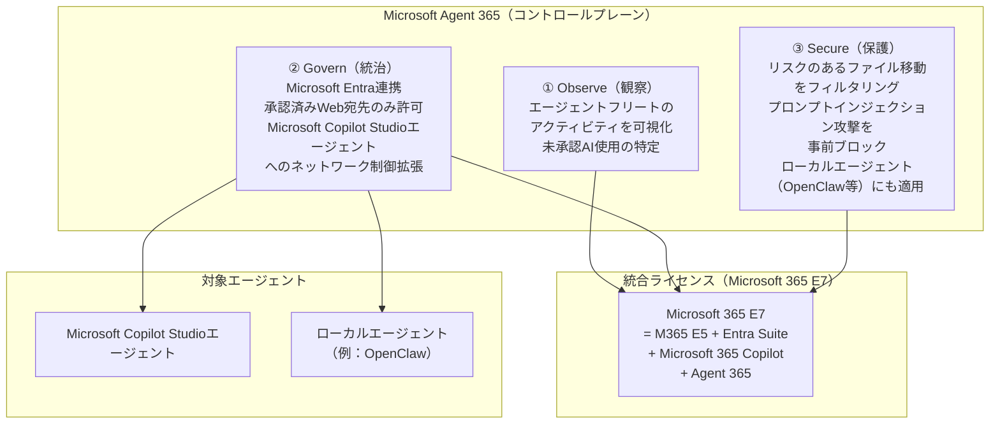

**Agent 365の主要機能詳細:**

| 機能 | 内容 |
|---|---|
| **Entraネットワーク制御拡張** | Copilot StudioエージェントやOSレベルのローカルエージェントにもEntraのネットワーク制御が適用 |
| **未承認AI検出** | 組織内で稼働する未承認のAIエージェントを自動識別 |
| **プロンプト攻撃防御** | 悪意あるプロンプトインジェクション攻撃を有害なアクションが実行される前にブロック |
| **価格** | スタンドアローン：**$15/ユーザー/月**。M365 E7に同梱 |

---

## 3. LLM Model / AI Agentアーキテクチャ・研究論文

### 3.1 Memory for Autonomous LLM Agents：記憶メカニズムの包括的サーベイ（arXiv:2603.07670）

**公開日:** 2026年3月  
**主要知見:** 「記憶があるエージェントとないエージェントの差は、異なるLLMバックボーン間の差より大きい」

LLMエージェントにおける記憶の設計・実装・評価を体系化したサーベイ論文。2022年〜2026年初頭の研究を網羅。[[11]](#ref-11)

**エージェント記憶の3次元タクソノミー:**

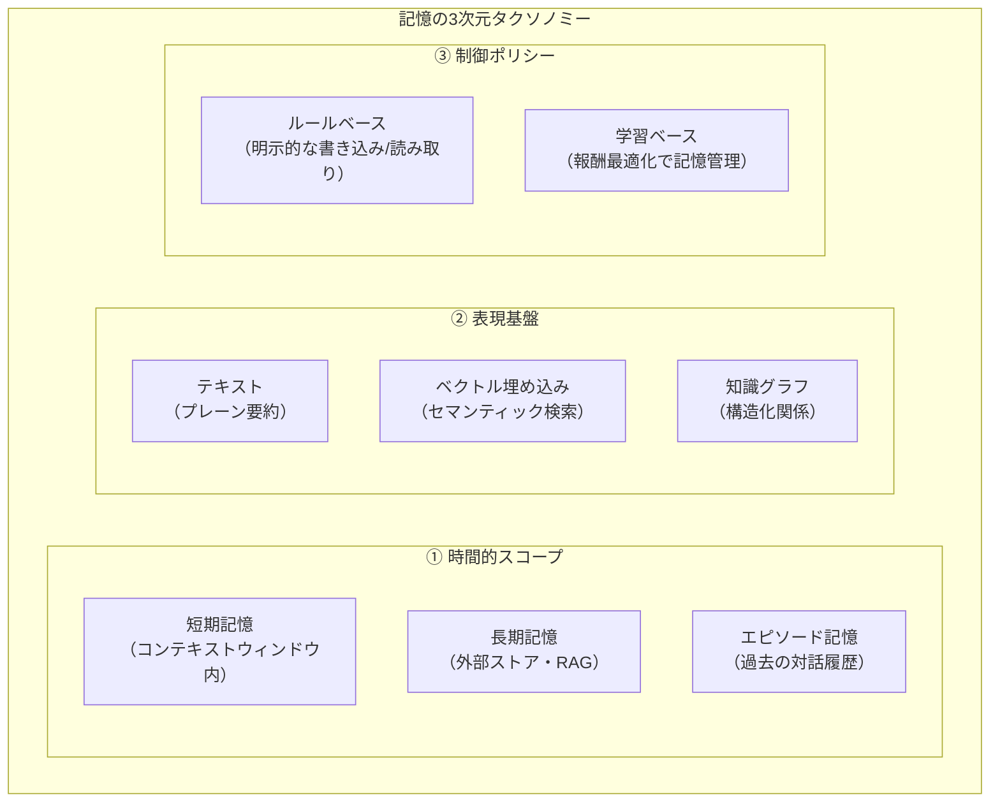

**5つの記憶メカニズムファミリー:**

| # | メカニズム | 概要 |
|---|---|---|
| **1** | コンテキスト圧縮 | 長い会話履歴をコンテキストウィンドウに収まるよう圧縮・要約 |
| **2** | 検索拡張ストア（RAG） | 外部ベクトルDBから関連記憶を動的に検索して付与 |
| **3** | 反省的自己改善 | エラーや失敗から学び、記憶と行動ポリシーを更新するリフレクション |
| **4** | 階層的仮想コンテキスト | 短期・中期・長期の多層記憶を階層的に管理し、重要度でフィルタリング |
| **5** | ポリシー学習型管理 | 強化学習でいつ何を記憶・忘却するかを最適化 |

**Write-Manage-Read ループ（記憶の基本サイクル）:**

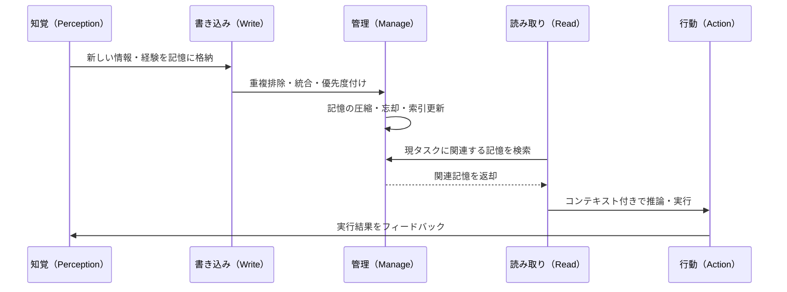

---

### 3.2 Governing Evolving Memory in LLM Agents：SSGMフレームワーク（arXiv:2603.11768）

**公開日:** 2026年3月  
**テーマ:** 動的に進化するエージェント記憶のリスク管理と安全性

エージェントが長期稼働する中で記憶が変質・汚染されるリスクに対処する**Stability and Safety Governed Memory（SSGM）フレームワーク**を提案。[[12]](#ref-12)

**SSGMが対処するリスクと対策:**

| リスク | 説明 | SSGMの対策 |
|---|---|---|
| **記憶汚染** | 悪意ある入力で記憶を上書き・誘導 | 書き込み時の整合性検証 |
| **記憶ドリフト** | 長期稼働で当初の目標から逸脱 | 定期的な目標整合性チェック |
| **記憶プライバシー漏洩** | 他ユーザーの情報が記憶を汚染 | 記憶のユーザー分離・アクセス制御 |
| **過剰な記憶成長** | 無制限な記憶蓄積による非効率化 | 重要度スコアによる自動忘却 |

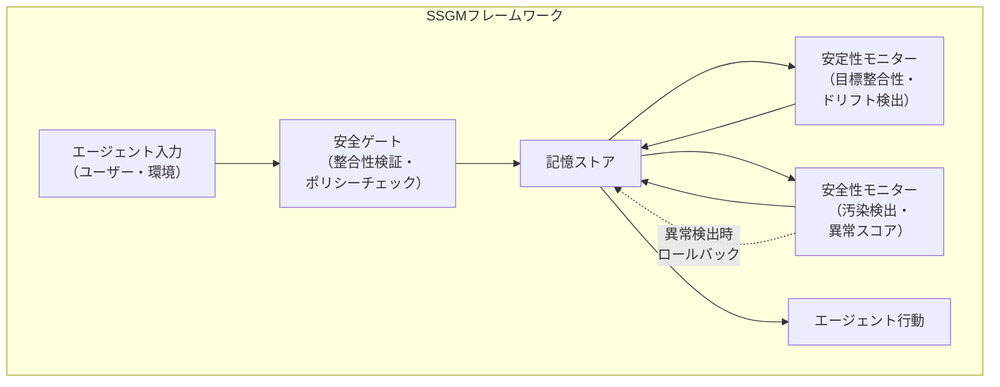

---

## 4. 公式ブログ・論文のリサーチ・要約

### 4.1 Google / DeepMind

#### Gemini Enterprise Agent Platform詳細：エージェントエコノミーへの本格参戦

上記1.1節で概説した**Gemini Enterprise Agent Platform**は、エージェント開発のフルスタックを一プラットフォームに集約する点が最大の特徴。Google CloudはCloud Next '26で「エージェントはアーキテクチャそのものになった」と宣言し、企業がGeminiを用いた自律エージェントをノーコードで構築・展開できる環境を整備した。[[1]](#ref-1)

Google Cloudは同時に**$1,750億〜$1,850億のインフラ投資計画**を発表しており、AIインフラへの資本投下においてAmazon・Microsoftと並ぶ規模に達している。

---

### 4.2 OpenAI

#### OpenAI Advanced Account Security + Yubico：フィッシング耐性パスキーの標準化（2026年4月30日）

OpenAIが**Advanced Account Security**を発表。ジャーナリスト・研究者・政治家など高リスクユーザー向けにフィッシング耐性のあるサインイン手段を標準化する取り組みで、Yubicoとの提携によりハードウェアセキュリティキーを推奨バンドルとして提供。[[13]](#ref-13)[[14]](#ref-14)

**Advanced Account Securityの主要機能:**

| 機能 | 内容 |
|---|---|
| **フィッシング耐性サインイン** | パスキーまたはハードウェアセキュリティキー必須化。パスワードログインを無効化 |
| **強化されたアカウント復旧** | メール・SMS復旧を無効化。バックアップパスキー・セキュリティキー・リカバリーキーのみ許可 |
| **セッション短縮** | デバイス侵害時の被害を最小化するため、ログインセッションを意図的に短縮 |
| **ログインアラート** | 新規ログイン時に通知を送信 |
| **トレーニング除外自動設定** | Advanced Security有効化で学習データへの利用が自動的に除外 |
| **Codexへの拡張** | ChatGPTに加えOpenAIのCodexにも同設定が適用 |
| **Yubico提携** | YubiKey C Nano（常時挿し込み型）+ YubiKey C NFC（バックアップ・クロスデバイス）セットを優待価格で提供 |

**対象ユーザーへの強制適用:**
- 2026年6月1日以降、**Trusted Access for Cyber**の対象ユーザー（最も高度なモデルにアクセスする研究者等）はAdvanced Account Securityの有効化が**必須**となる。

---

### 4.3 Anthropic

#### Anthropic × SpaceX：Colossus 1の全計算資源を確保（2026年5月6日）

AnthropicがSpaceXと大型コンピュート契約を締結。SpaceXがテネシー州メンフィスに保有する**Colossus 1データセンターの計算資源全体**をClaudeの運用に活用することに合意。[[15]](#ref-15)[[16]](#ref-16)

**契約の主な内容:**

| 項目 | 内容 |
|---|---|
| **取得GPU数** | **220,000基以上**のNVIDIA GPU |
| **容量** | **300メガワット超**の新規容量 |
| **配備時期** | 契約締結から**1ヶ月以内**に稼働開始 |
| **将来計画** | 宇宙空間での複数ギガワット規模のコンピュート開発に「関心表明」 |
| **即時効果** | Claude Pro/Max/Team/Enterprise（シート制）のClaude Codeレートリミットを**2倍**に引き上げ |
| **ピーク時制限撤廃** | これまでのピーク時間帯でのレートリミット削減を廃止 |

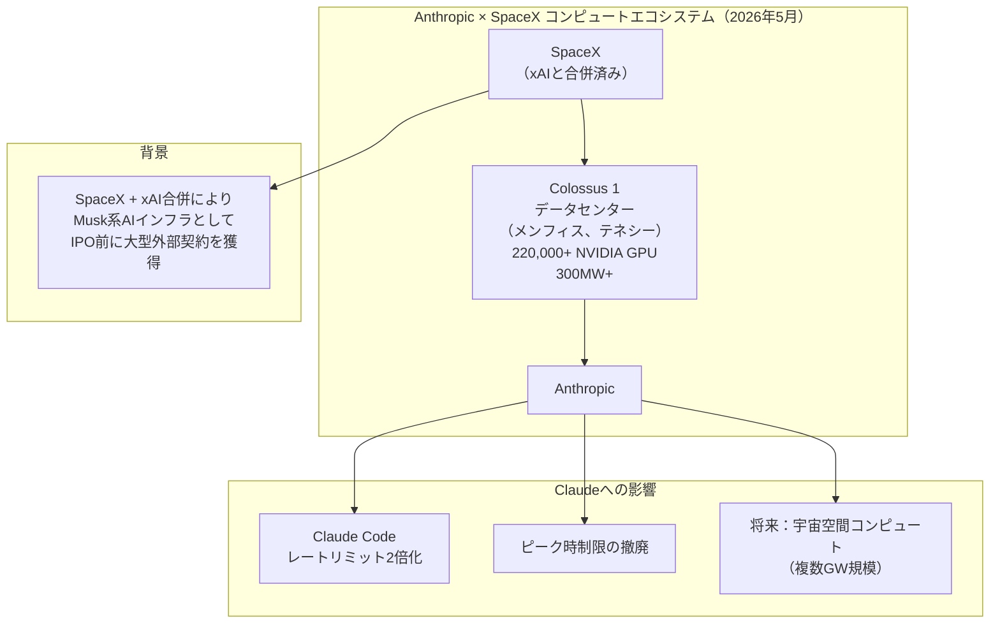

---

#### Code with Claude 2026：Managed Agentsの新機能発表（2026年5月6日）

Anthropicの年次開発者カンファレンス**Code with Claude 2026**（サンフランシスコ）で、**Claude Managed Agents**の3つの新機能と**Claude Code**の大型アップデートが発表された。[[17]](#ref-17)[[18]](#ref-18)

**Claude Managed Agentsの新機能（3本柱）:**

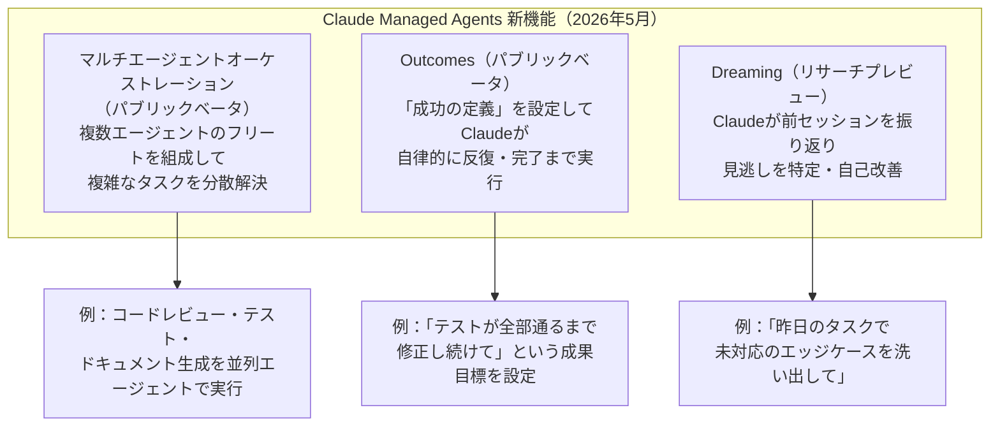

**Claude Codeの新機能:**

| 機能 | 内容 |
|---|---|
| **xhigh effortレベル** | 高品質な成果を求めるコーディングワークに推奨の新effort設定。/effortスライダーでインタラクティブに調整可能 |
| **Routines** | スケジュール・GitHubイベント・APIトリガーでテンプレートエージェントをクラウドから自動起動 |
| **/ultrareview** | クラウドでマルチエージェントが並列実行する高品質コードレビュー |
| **/usage** | 自分のレートリミットを消費している操作を可視化 |
| **CLIネイティブバイナリ化** | Claude Code CLIがネイティブバイナリへ移行（起動速度・依存関係の改善） |

**イベント概要:** Code with Claude 2026はサンフランシスコ（5月6日）、ロンドン（5月19日）、東京（6月10日）の3都市3大陸開催。

---

## 5. AI Agent搭載SaaS製品情報

### 5.1 SAP Joule Studio GA：カスタムERPエージェントを低コードで構築（2026年Q1）

SAPが**Joule Studio**を一般提供開始。2,400以上のスキルと40以上の専門エージェントを備えた**SAP BTP上の低コード/ノーコードエージェントビルダー**として、ERPの自律化を推進。[[19]](#ref-19)[[20]](#ref-20)

**40以上のJoule専門エージェント（GA済み代表例）:**

| エージェント名 | 対象業務 | 効果 |
|---|---|---|
| **Invoice Dispute Resolution Agent** | 請求書紛争の自動分類・ルーティング（SAP S/4HANA Cloud） | 売掛金紛争処理を「日単位」から「分単位」に短縮 |
| **Cash Management Agent** | 銀行明細分析・キャッシュポジショニングの自動化 | 手動作業を**80%削減** |
| **Expense Report Validation Agent** | 経費精算のポリシー違反・重複・添付漏れを事前自動チェック（SAP Concur） | 財務チームへの到着前に違反を排除 |

**SAP AI Agent Hub（エージェント間通信の新基盤）:**

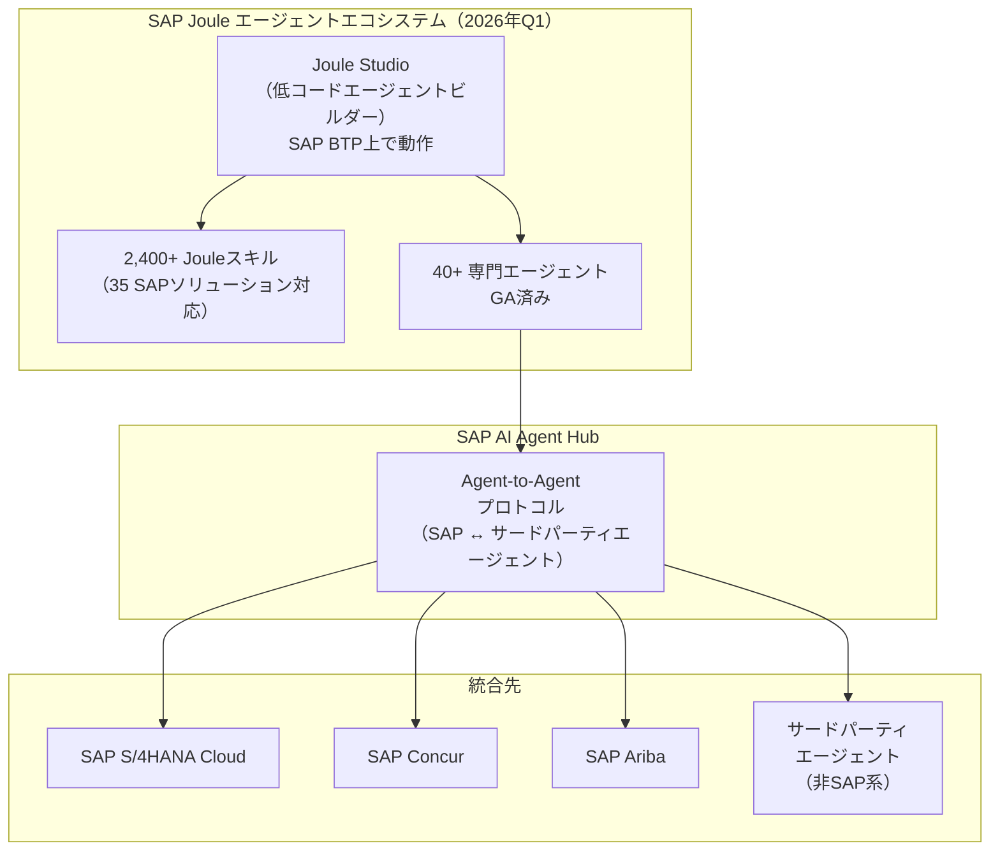

---

### 5.2 Workday Illuminate：フロントライン向けAIエージェントが本番稼働（2026年春）

WorkdayのAIプラットフォーム**Illuminate**のエージェント群が2026年春から順次一般提供。HRと財務に特化した「業務に組み込まれた専用エージェント」として差別化。[[21]](#ref-21)[[22]](#ref-22)

**Workday Illuminateの主要エージェントと実績:**

| エージェント | 対象業務 | 効果（早期導入顧客実績） |
|---|---|---|
| **Frontline Agent** | シフト交替・休暇申請の自動ルーティング・代替要員提案 | 管理者の工数**90%削減** |
| **Contract Intelligence Agent** | 契約書のインテリジェント処理・マイルストーン管理 | 契約実行時間**65%短縮** |
| **Financial Audit Agent** | 監査証拠の収集・報告書生成の自動化 | **年間900時間**の節約（早期顧客） |
| **Document Driven Accounting Agent** | ドキュメントから仕訳を自動生成 | 月次決算プロセスの短縮 |
| **Payroll Agent** | 給与計算タスクの自動化・コンプライアンス管理 | コンプライアンス対応速度**4倍** |

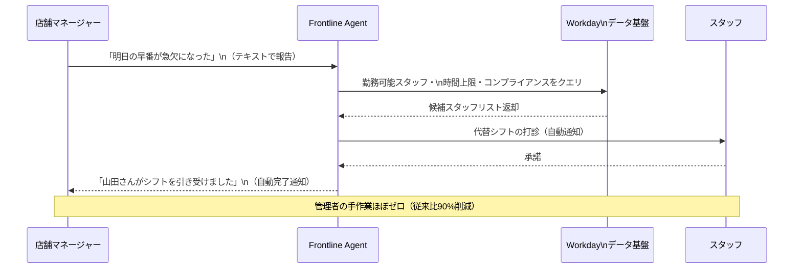

---

## 6. その他特筆すべき情報

### 6.1 GoogleとMicrosoftによるAIガバナンス競争：主権と制御の時代へ

2026年5月時点で、GoogleとMicrosoftが相次いでエンタープライズ向けのAIガバナンス機能を強化した。これはAIエージェントの企業採用が本格化する中で、「AIを使う権利」から「AIを安全に管理する責任」へと企業の関心が移行していることを示している。

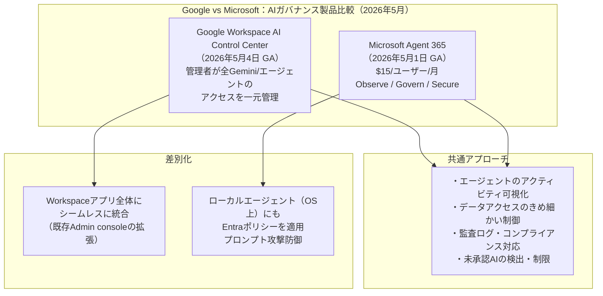

**市場の背景:** Gartnerの調査によると、2026年のエンタープライズAI導入企業の最大の懸念事項は「エージェントの暴走・誤操作リスク」（56%）、「データプライバシー」（48%）であり、AIガバナンス製品の需要が急拡大している。

---

### 6.2 SpaceX×Anthropic：AIインフラの「ネオクラウド」としてのSpaceXの台頭

SpaceXとxAIの合併後、SpaceXは単なるロケット企業を超え「AIインフラ企業」として急成長している。AnthropicへのColossus 1提供はその象徴であり、xAIとAnthropicという2大AIラボが同一の物理インフラを使用する構造が生まれた。[[16]](#ref-16)

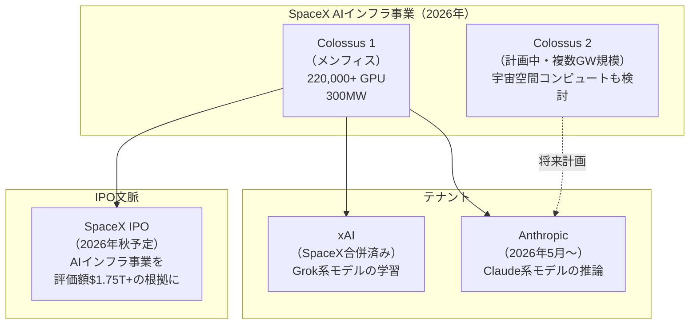

**意義:** これまでAIインフラはAWS・Azure・Google Cloudの3強が独占してきたが、SpaceX（xAI合併後）がネオクラウドとして台頭。AnthropicがMicrosoftのAzure依存を分散化する形で外部提携を広げている構図は、AIインフラの地政学的な再編を示す。

---

## 7. 参考リンク

**[1]** [Introducing Gemini Enterprise Agent Platform | Google Cloud Blog](https://cloud.google.com/blog/products/ai-machine-learning/introducing-gemini-enterprise-agent-platform)

**[2]** [Gemini Enterprise Agent Platform lets you build, govern and optimize your agents | Google Blog](https://blog.google/innovation-and-ai/infrastructure-and-cloud/google-cloud/gemini-enterprise-agent-platform/)

**[3]** [Our eighth generation TPUs: two chips for the agentic era | Google Blog](https://blog.google/innovation-and-ai/infrastructure-and-cloud/google-cloud/eighth-generation-tpu-agentic-era/)

**[4]** [Google Cloud Next '26: Gemini Enterprise Agent Platform Leads AI-Centric News | Virtualization Review](https://virtualizationreview.com/articles/2026/04/24/google-cloud-next-26-gemini-enterprise-agent-platform-leads-ai-centric-news.aspx)

**[5]** [New Workspace Intelligence delivers unified, real-time understanding to power agentic work | Google Workspace Blog](https://workspace.google.com/blog/product-announcements/introducing-workspace-intelligence)

**[6]** [Google Wires Gemini Into Every Workspace App With New "Workspace Intelligence" | Technology.org](https://www.technology.org/2026/04/23/google-gemini-workspace-intelligence/)

**[7]** [Google Workspace Updates: Securely manage AI and agent access to Workspace data with the AI control center](https://workspaceupdates.googleblog.com/2026/05/securely-manage-AI-and-agent-access-to-Workspace-data-with-the-AI-control-center.html)

**[8]** [Google Workspace now has a central hub to control all AI and agent access | GadgetBond](https://gadgetbond.com/google-workspace-ai-control-center/)

**[9]** [Microsoft Agent 365, now generally available, expands capabilities and integrations | Microsoft Security Blog](https://www.microsoft.com/en-us/security/blog/2026/05/01/microsoft-agent-365-now-generally-available-expands-capabilities-and-integrations/)

**[10]** [Microsoft 365 E7 and Agent 365 are now generally available | Microsoft Community Hub](https://techcommunity.microsoft.com/blog/microsoft_365blog/microsoft-365-e7-and-agent-365-are-now-generally-available/4516295)

**[11]** [Memory for Autonomous LLM Agents: Mechanisms, Evaluation, and Emerging Frontiers (arXiv:2603.07670)](https://arxiv.org/abs/2603.07670)

**[12]** [Governing Evolving Memory in LLM Agents: Risks, Mechanisms, and the SSGM Framework (arXiv:2603.11768)](https://arxiv.org/abs/2603.11768v1)

**[13]** [Introducing Advanced Account Security | OpenAI](https://openai.com/index/advanced-account-security/)

**[14]** [OpenAI announces new advanced security for ChatGPT accounts, including a partnership with Yubico | TechCrunch](https://techcrunch.com/2026/04/30/openai-announces-new-advanced-security-for-chatgpt-accounts-including-a-partnership-with-yubico/)

**[15]** [Higher usage limits for Claude and a compute deal with SpaceX | Anthropic](https://www.anthropic.com/news/higher-limits-spacex)

**[16]** [Anthropic, SpaceX Sign Deal to Boost AI Computing Power for Claude Software | Bloomberg](https://www.bloomberg.com/news/articles/2026-05-06/anthropic-inks-computing-deal-with-spacex-to-meet-ai-demand)

**[17]** [Code with Claude San Francisco — May 6, 2026 | Anthropic](https://claude.com/code-with-claude/san-francisco)

**[18]** [Live blog: Code w/ Claude 2026 | Simon Willison's Weblog](https://simonwillison.net/2026/May/6/code-w-claude-2026/)

**[19]** [SAP Joule Agentic AI 2026: Autonomous ERP Agents Explained | Prolifics](https://prolifics.com/usa/resource-center/blog/sap-joule-agentic-ai)

**[20]** [SAP Joule Studio: Build Custom AI Agents for Enterprise ERP | CallSphere Blog](https://callsphere.ai/blog/sap-joule-studio-custom-ai-agents-enterprise-erp-2026)

**[21]** [Workday Delivers Next Wave of Agentic AI to Power the New Work Day | Workday Blog](https://blog.workday.com/en-us/workday-delivers-next-wave-agentic-ai-power-new-work-day.html)

**[22]** [Workday Accelerates Retail and Hospitality Momentum with New Customer Wins and AI Innovations for the Frontline | Workday Investor Relations](https://investor.workday.com/news-and-events/press-releases/news-details/2026/Workday-Accelerates-Retail-and-Hospitality-Momentum-with-New-Customer-Wins-and-AI-Innovations-for-the-Frontline/default.aspx)
