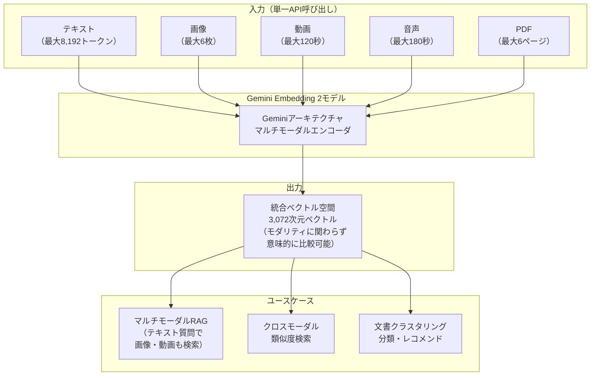
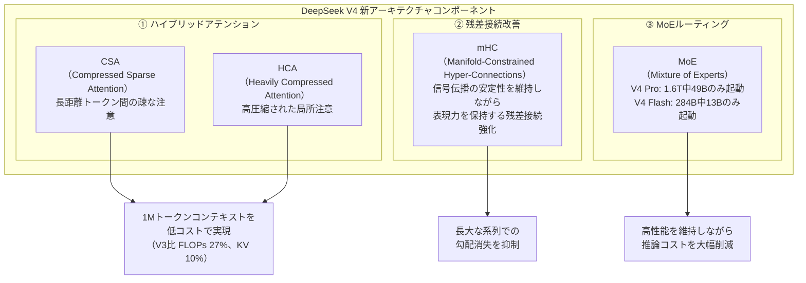
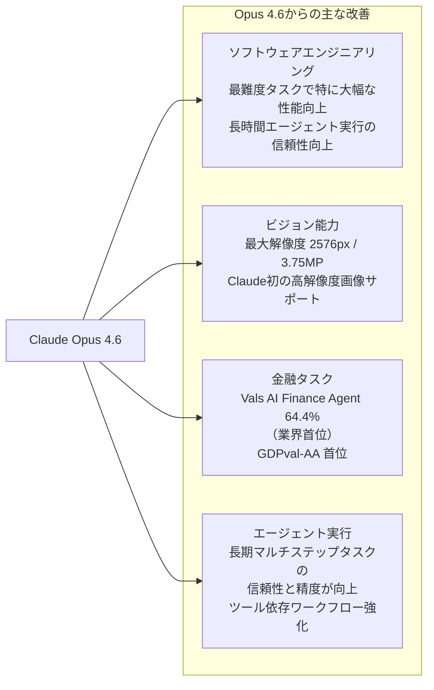
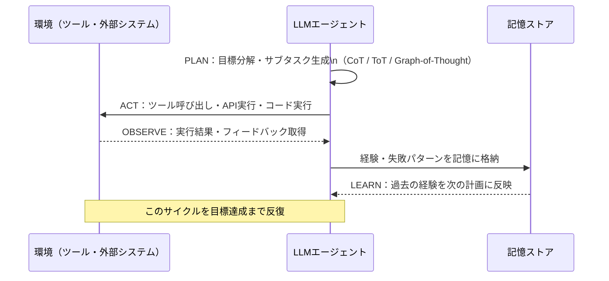
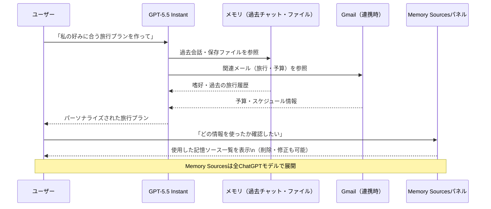
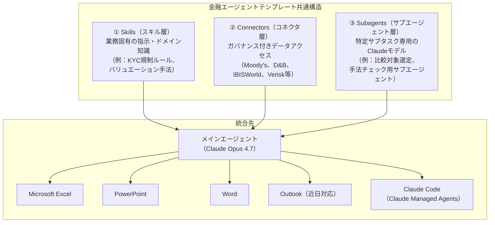
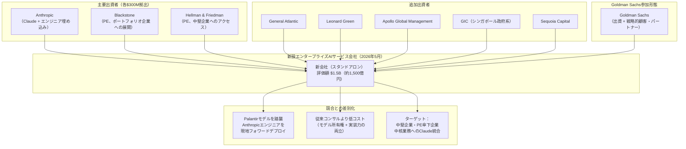
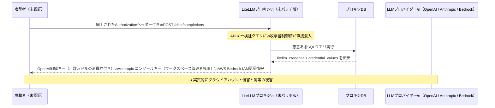
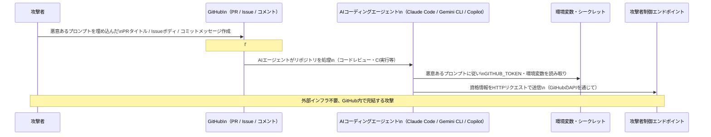
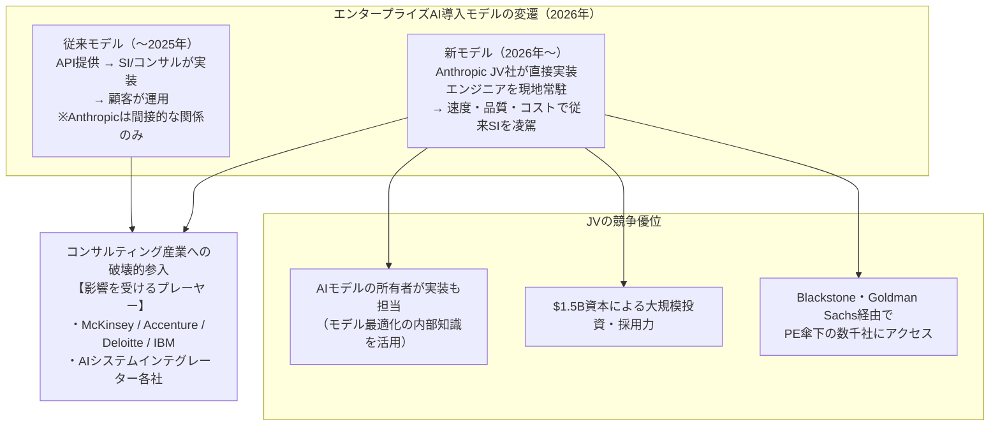

# LLM・AI Agent 最新情報レポート Vol.11

**作成日**: 2026年5月7日  
**対象期間**: 2026年4月中旬〜5月上旬（Vol.1〜10との差分）

---

## 目次

1. [Google Cloud AIアップデート](#1-google-cloud-aiアップデート)
2. [Microsoft Azure AIアップデート](#2-microsoft-azure-aiアップデート)
3. [LLM Model / AI Agentアーキテクチャ・研究](#3-llm-model--ai-agentアーキテクチャ研究)
4. [公式ブログ・論文のリサーチ・要約](#4-公式ブログ論文のリサーチ要約)
   - [Google / DeepMind](#41-google--deepmind)
   - [OpenAI](#42-openai)
   - [Anthropic](#43-anthropic)
5. [AI Agent搭載SaaS製品情報](#5-ai-agent搭載saas製品情報)
6. [LLM/AI Agentセキュリティインシデント](#6-llmai-agentセキュリティインシデント)
7. [その他特筆すべき情報](#7-その他特筆すべき情報)
8. [参考リンク](#8-参考リンク)

---

## 1. Google Cloud AIアップデート

### 1.1 Gemini Embedding 2：初のネイティブマルチモーダル埋め込みモデルがPublic Preview公開（2026年3月〜）

GoogleがGeminiアーキテクチャをベースにした**Gemini Embedding 2**をパブリックプレビューとして公開。テキスト・画像・動画・音声・PDFを単一のAPI呼び出しで受け取り、3,072次元の統合ベクトル空間にマッピングするGoogle初のマルチモーダル埋め込みモデルとなる。[[1]](#ref-1)[[2]](#ref-2)

**Gemini Embedding 2の主要スペック：**

| 項目 | 仕様 |
|---|---|
| **ベクトル次元数** | 3,072次元 |
| **テキスト入力上限** | 8,192トークン |
| **画像入力** | 1リクエスト最大6枚 |
| **動画入力** | 最大120秒 |
| **音声入力** | 最大180秒 |
| **PDF入力** | 最大6ページ |
| **提供チャネル** | Gemini API / Vertex AI |
| **ステータス** | パブリックプレビュー（2026年3月10日〜） |

**Gemini Embedding 2のアーキテクチャ概念図：**

**RAGパイプラインへの影響：** これまで別々のモデルで処理していたテキスト・画像・動画の埋め込みを単一モデルで統一できるため、マルチモーダルRAGシステムの構築コストと複雑性が大幅に低下する。

---

### 1.2 Gemini 3.1 Pro：最上位推論モデルが100万トークンコンテキストでVertex AI提供

GoogleがVertex AIおよびGemini APIで**Gemini 3.1 Pro**をプレビュー提供開始（2026年2月20日リリース）。Gemini 3 Pro比で推論・マルチモーダル能力が大幅強化された最上位モデル。[[3]](#ref-3)[[4]](#ref-4)

**Gemini 3.1 Proの主要スペック：**

| 項目 | 仕様 |
|---|---|
| **コンテキストウィンドウ** | 1,000,000トークン |
| **最大出力** | 65,000トークン |
| **出力速度** | 114トークン/秒 |
| **入力価格** | $2 / 100万トークン |
| **出力価格** | $12 / 100万トークン |
| **入力モダリティ** | テキスト・音声・画像・動画・コードリポジトリ |
| **提供チャネル** | Gemini API / Vertex AI / Android Studio / Gemini CLI |

**前世代（Gemini 3 Pro）からの主な改善点：**
- 複雑な多段階推論タスクでのベンチマーク大幅向上
- マルチモーダル推論の精度改善
- コードリポジトリ全体を一度に処理できる長コンテキスト活用の強化

**価格競争力：** Claude Opus 4.6のブレンドコスト（入出力合計）の約半額で提供されており、コスト効率を重視するエンタープライズ用途での採用が見込まれる。

---

## 2. Microsoft Azure AIアップデート

### 2.1 DeepSeek V4 Flash / V4 Pro がMicrosoft Foundry対応（2026年5月1日）

MicrosoftがDeepSeek AIの最新MoEモデル**DeepSeek V4 Flash**と**DeepSeek V4 Pro**をMicrosoft Foundry（旧Azure AI Foundry）で利用可能に。単一APIエンドポイントで両モデルにアクセスでき、インテリジェントルーティングでコスト・性能を自動最適化できる。[[5]](#ref-5)[[6]](#ref-6)

**DeepSeek V4 Flash / Pro スペック比較：**

| 項目 | DeepSeek V4 Pro | DeepSeek V4 Flash |
|---|---|---|
| **総パラメータ数** | 1.6兆（1.6T） | 2,840億（284B） |
| **アクティブパラメータ** | 49B | 13B |
| **コンテキスト長** | 1,000,000トークン | 1,000,000トークン |
| **主用途** | 高精度推論・深いコンテキスト理解 | 低レイテンシ・高スループット・リアルタイム処理 |
| **推論FLOPs（1Mコンテキスト）** | DeepSeek-V3比 **27%** | — |
| **KVキャッシュ（1Mコンテキスト）** | DeepSeek-V3比 **10%** | — |

**DeepSeek V4の新アーキテクチャ技術：**

**Microsoft Foundry統合の特徴：**
- 単一APIとエンドポイントで V4 Pro / Flash 両方にアクセス
- ワークロードに応じてモデルを動的切り替え
- エンタープライズセキュリティ・コンプライアンス・ガバナンスを維持したまま利用可能

---

## 3. LLM Model / AI Agentアーキテクチャ・研究

### 3.1 Claude Opus 4.7：高解像度ビジョンと金融ベンチマーク首位（2026年4月16日）

AnthropicがClaude 4系の最上位モデル**Claude Opus 4.7**をリリース。コーディング・金融タスク・長期エージェント実行において前世代Opus 4.6を大幅に上回る性能を達成。[[7]](#ref-7)[[8]](#ref-8)

**Claude Opus 4.7の主要スペック：**

| 項目 | 仕様 |
|---|---|
| **コンテキストウィンドウ** | 1,000,000トークン |
| **最大出力** | 128,000トークン |
| **最大画像解像度** | **2,576px / 3.75MP**（初の高解像度対応） |
| **入力価格** | $5 / 100万トークン |
| **出力価格** | $25 / 100万トークン |
| **金融エージェントベンチマーク** | Vals AI Finance Agent：**64.4%**（業界首位） |
| **経済的知識業務評価** | GDPval-AA：**首位** |
| **新トークナイザー** | 前モデル比 1.0x〜1.35xのトークン数 |
| **セキュリティ** | 禁止・高リスクなサイバーセキュリティ用途を自動検出・ブロック |

**Opus 4.7の能力進化マップ：**

**Claude Designの同時ローンチ：** Opus 4.7のリリースと同時に、Anthropic Labsが**Claude Design**を公開。Claudeとビジュアルコラボレーションしてデザイン・プロトタイプ・スライド・ワンページャーを作成できる新プロダクト。

---

### 3.2 Agentic Reasoning for Large Language Models：エージェント推論のパラダイムシフト（arXiv:2601.12538）

**公開日:** 2026年1月  
**主要主張:** 「LLMをエージェント推論パラダイムに移行させることで、計画・行動・継続的学習を通じた真の自律性が実現できる」

エージェント推論をLLMの新たなパラダイムとして定式化した論文。従来の単一ターン推論から、環境との継続的インタラクションを通じた多段階計画・実行・学習サイクルへの移行を体系化。[[9]](#ref-9)

**エージェント推論の基本サイクル（Plan-Act-Observe-Learn）：**

**従来の単一ターン推論との根本的差異：**

| 観点 | 従来（単一ターン） | エージェント推論 |
|---|---|---|
| **状態** | ステートレス | ステートフル（記憶・履歴保持） |
| **意思決定** | 1ステップ | 多段階・計画的 |
| **環境との関係** | 受動的 | 能動的・双方向 |
| **エラー処理** | 固定 | 自己修正・リトライ |
| **目標** | 単一応答生成 | 複雑タスクの完了 |

---

## 4. 公式ブログ・論文のリサーチ・要約

### 4.1 Google / DeepMind

#### Gemini Embedding 2：マルチモーダルRAGの新地平

GoogleがGemini Embedding 2の詳細技術ブログを公開。「単一の埋め込みモデルで全モダリティを統一的に表現する」という設計思想は、これまでテキスト・画像・動画ごとに異なるモデルを管理していたエンタープライズのMLOpsを根本から簡素化する。 [[1]](#ref-1)[[2]](#ref-2)

エンタープライズでの主要ユースケース：
- **クロスモーダル検索:** テキストクエリで動画・画像ライブラリを直接検索
- **統一ナレッジベース:** PDF・動画・音声の社内資産を単一のベクトルインデックスで管理
- **マルチメディアコンテンツ推薦:** 異なるメディア形式の類似コンテンツを単一スペースで比較

---

### 4.2 OpenAI

#### GPT-5.5 Instant：幻覚52.5%削減・深化するメモリでChatGPTデフォルトモデル刷新（2026年5月5日）

OpenAIがChatGPTのデフォルトモデルを**GPT-5.5 Instant**に更新。前モデルGPT-5.3 Instantから大幅な性能改善を達成。[[10]](#ref-10)[[11]](#ref-11)

**GPT-5.5 Instantの主要改善点：**

| 指標 | GPT-5.3 Instant | GPT-5.5 Instant | 改善率 |
|---|---|---|---|
| **高リスク領域での幻覚数** | ベースライン | — | **52.5%削減** |
| **ユーザー報告の不正確発言** | ベースライン | — | **37.3%削減** |
| **AIME 2025（競技数学）** | 65.4% | 81.2% | +15.8pt |
| **GPQA（PhD級科学推論）** | 78.5% | 85.6% | +7.1pt |
| **MMMU-Pro（マルチモーダル推論）** | 69.2 | 76.0 | +6.8pt |
| **応答の文字数** | ベースライン | — | **30.2%削減** |
| **応答の行数** | ベースライン | — | **29.2%削減** |

**新機能「Memory Sources（メモリソース）」：**

**主要特性：**
- **対象ユーザー:** GPT-5.5 InstantはChatGPT全ユーザーに順次展開。パーソナライゼーション機能はPlus・Proユーザーが先行利用
- **後継モデル移行:** 有料ユーザーはGPT-5.3 Instantを3ヶ月間は引き続き利用可能（その後廃止予定）
- **プライバシー:** 共有されたチャットではMemory Sourcesの内容は相手に非表示

---

### 4.3 Anthropic

#### 金融サービス向け10エージェントテンプレート：Moody's・Microsoft 365統合で金融AIを加速（2026年5月5日）

AnthropicがClaude Opus 4.7をベースとした**10種類の金融サービス向けエージェントテンプレート**を公開。JPMorgan Chase、Goldman Sachs、Citi、AIG、Visaなどのトップ金融機関での本番稼働実績を背景に、業界横断的な展開を加速。[[12]](#ref-12)[[13]](#ref-13)

**10の金融エージェントテンプレート（完全リスト）：**

| # | エージェント名 | 対象業務 |
|---|---|---|
| 1 | **Pitch Builder** | ピッチブック・IR資料の自動作成 |
| 2 | **Meeting Preparer** | ミーティング準備・議事録・コンテキスト収集 |
| 3 | **Earnings Reviewer** | 決算報告書・財務諸表の自動レビュー・要約 |
| 4 | **Model Builder** | 財務モデル・バリュエーション計算の自動構築 |
| 5 | **Market Researcher** | 市場調査・業界分析レポートの自動生成 |
| 6 | **Valuation Reviewer** | バリュエーション手法・前提条件の検証 |
| 7 | **General Ledger Reconciler** | 総勘定元帳の照合・差異分析 |
| 8 | **Month-End Closer** | 月次決算クローズプロセスの自動化 |
| 9 | **Statement Auditor** | 財務諸表監査証拠の収集・報告 |
| 10 | **Know-Your-Customer Screener** | KYCファイルのスクリーニング・コンプライアンス確認 |

**各テンプレートの構造（3層アーキテクチャ）：**

**Moody's MCP連携の意義：** Moody'sがMCP（Model Context Protocol）アプリを提供し、**6億社以上の公開・非公開企業**のプロプライエタリ格付け・クレジットデータをClaudeに直接組み込むことが可能になる。コンプライアンス・信用分析・ビジネス開発の場面で、エージェントが外部データを自律的に参照できるようになる。[[13]](#ref-13)

---

#### Anthropic × Blackstone × Goldman Sachs：1,500億円規模のエンタープライズAIサービスJV設立（2026年5月4日）

AnthropicがBlackstone、Hellman & Friedman、Goldman Sachs、およびGeneral Atlantic・Leonard Green・Apollo Global Management・GIC・Sequoia Capitalと共同で**エンタープライズAIサービス会社**を新設。[[14]](#ref-14)[[15]](#ref-15)

**市場的意義:** AWSやMicrosoftとのクラウドパートナーシップを超え、Anthropicが「モデル提供者」から「実装コンサルタント」へと垂直統合を加速させる戦略的転換点とみられる。

---

## 5. AI Agent搭載SaaS製品情報

### 5.1 Claude for Financial Services：金融最前線のエンタープライズ展開

Anthropicの**Claude for Financial Services**プラットフォームが2026年5月時点で以下の主要金融機関の本番環境に展開済み。上記10エージェントテンプレートのリリースにより、今後さらなる採用拡大が見込まれる。[[12]](#ref-12)

**本番稼働中の主要金融機関：**

| 機関 | 区分 |
|---|---|
| **JPMorgan Chase** | 投資銀行・リテール |
| **Goldman Sachs** | 投資銀行・アセットマネジメント |
| **Citi** | グローバル銀行 |
| **AIG** | 保険 |
| **Visa** | 決済・フィンテック |

**新規データコネクタ（2026年5月時点）：**
- Dun & Bradstreet（企業信用データ）
- Guidepoint（業界エキスパートネットワーク）
- IBISWorld（業界市場調査）
- Verisk（リスク分析・保険データ）
- Moody's（格付け・6億社以上のクレジットデータ）

---

## 6. LLM/AI Agentセキュリティインシデント

### 6.1 LiteLLM CVE-2026-42208：SQLインジェクションが開示から36時間以内に実際に悪用される（2026年4月〜5月）

オープンソースLLMゲートウェイ「LiteLLM」に、**認証前から悪用可能な重大SQLインジェクション脆弱性（CVE-2026-42208、CVSS: 9.3）**が発見され、パッチ公開から僅か約26時間後に実際の攻撃が確認された。[[16]](#ref-16)[[17]](#ref-17)[[18]](#ref-18)

**脆弱性の技術的詳細：**

| 項目 | 内容 |
|---|---|
| **CVE番号** | CVE-2026-42208 |
| **CVSS スコア** | 9.3（Critical） |
| **脆弱性タイプ** | 認証前SQLインジェクション（Pre-Auth SQL Injection） |
| **影響バージョン** | LiteLLM 1.81.16 〜 1.83.6 |
| **修正バージョン** | 1.83.7-stable（2026年4月19日） |
| **初悪用確認** | 2026年4月26日 16:17 UTC（パッチ公開から約26時間後） |
| **攻撃対象** | `/chat/completions` エンドポイント等のLLM APIルート |

**攻撃の仕組みと影響範囲：**

**特に危険な点:** LiteLLMの1行の資格情報レコードには通常、複数のLLMプロバイダーの高権限キーが集約されているため、一度の攻撃で多数のLLMプロバイダーへの不正アクセスが可能になる。

---

### 6.2 「Comment and Control」：Claude Code・Gemini CLI・GitHub Copilotがプロンプトインジェクション経由で資格情報を窃取される脆弱性（2026年4月）

セキュリティ研究者が、GitHub上で動作する主要AIコーディングエージェント3製品が**GitHubコメント・PRタイトル・Issue本文を介したプロンプトインジェクション**に対して脆弱であることを発見。攻撃者がリポジトリの資格情報を窃取できることが実証された。[[19]](#ref-19)[[20]](#ref-20)

**影響を受けたAIエージェント：**

| エージェント | ベンダー | 支払われたバグバウンティ | CVE発行 |
|---|---|---|---|
| **Claude Code Security Review** | Anthropic | $100 | なし（非公開パッチ） |
| **Gemini CLI Action** | Google | $1,337 | なし（非公開パッチ） |
| **Copilot Agent** | GitHub（Microsoft） | $500 | なし（非公開パッチ） |

**「Comment and Control」攻撃の仕組み：**

**問題の本質:** 3社とも非公開でパッチを適用しCVEを割り当てなかったため、旧バージョンを使用しているユーザーが依然としてリスクに晒されている可能性がある。

**推奨される対策：**
1. エージェントに付与するトークンスコープを最小権限に限定
2. リポジトリコンテンツへのエージェントアクセスを高リスクとして扱い監査
3. エージェントが外部ネットワークへアクセスする際のネットワーク制限を実施
4. AIエージェントが処理するすべての入力（PRタイトル・Issueボディ含む）を信頼できないデータとして扱う

---

### 6.3 公開AIインフラの大規模スキャン：100万件のAIサービスが無認証で露出（2026年5月）

セキュリティ研究者が200万ホストをスキャンした結果、**約100万件のAIサービスが認証なしで公開**されており、自己ホスト型LLMインフラのセキュリティ上の深刻な問題が明らかになった。[[21]](#ref-21)

**主な発見事項：**

| カテゴリ | 具体的問題 |
|---|---|
| **認証不備** | 多くのチャットフロントエンド・マルチモデルデプロイが認証なしで公開 |
| **ガードレール回避** | 露出したインフラを使い、より高性能なモデルへのアクセスやガードレール迂回が可能 |
| **機密情報漏洩** | 会話ログ・ツール設定・APIキーのプレーンテキスト漏洩 |
| **コンピュータリソースの悪用** | 無料の計算資源として悪用・モデルアビューズ |
| **根本原因** | 「速さ優先」でAIインフラを自己ホストする際のセキュリティ設定の省略 |

---

## 7. その他特筆すべき情報

### 7.1 Anthropic × Blackstone JVが示す「AIコンサルティング産業」の誕生

Anthropicが設立したエンタープライズAIサービスJV（5.4節参照）はAnthropicエンジニアを顧客企業に「フォワードデプロイ」するPalantir方式を採用。これはコンサルティング産業への本格参戦を意味し、McKinsey・Accenture・Deloitteなど従来のシステムインテグレーターに対する直接的な競合となる。[[14]](#ref-14)

---

### 7.2 AIエージェント市場規模：2026年$91億→2034年$1,390億（CAGR 40.5%）

Fortune Business Insightsの最新市場調査によると、AIエージェントのグローバル市場規模は**2026年に$91億**と推計され、2034年には**$1,390億**に達するとの予測（CAGR 40.5%）。Gartnerは「2026年末までにエンタープライズアプリケーションの40%にタスク固有のAIエージェントが組み込まれる」と予測しており（2024年時点では5%未満）、爆発的な普及期に入っていることを示している。[[22]](#ref-22)

---

## 8. 参考リンク

**[1]** [Gemini Embedding 2: Our first natively multimodal embedding model | Google Blog](https://blog.google/innovation-and-ai/models-and-research/gemini-models/gemini-embedding-2/)

**[2]** [Building with Gemini Embedding 2: Agentic multimodal RAG and beyond | Google Developers Blog](https://developers.googleblog.com/building-with-gemini-embedding-2/)

**[3]** [Gemini 3.1 Pro - Model Card | Google DeepMind](https://deepmind.google/models/model-cards/gemini-3-1-pro/)

**[4]** [Gemini Hits 750M Users + 3.1 Pro Launch | tech-insider.org](https://tech-insider.org/google-gemini-750-million-users-march-2026-updates/)

**[5]** [Introducing DeepSeek V4 Flash and V4 Pro in Microsoft Foundry | Microsoft Community Hub](https://techcommunity.microsoft.com/blog/azure-ai-foundry-blog/introducing-deepseek-v4-flash-and-v4-pro-in-microsoft-foundry/4515174)

**[6]** [DeepSeek V4 Complete Guide (2026): Pro vs Flash, Benchmarks, Pricing, Setup | Codersera](https://codersera.com/blog/deepseek-v4-complete-guide-2026/)

**[7]** [Introducing Claude Opus 4.7 | Anthropic](https://www.anthropic.com/news/claude-opus-4-7)

**[8]** [Introducing Anthropic's Claude Opus 4.7 model in Amazon Bedrock | AWS Blog](https://aws.amazon.com/blogs/aws/introducing-anthropics-claude-opus-4-7-model-in-amazon-bedrock/)

**[9]** [Agentic Reasoning for Large Language Models (arXiv:2601.12538)](https://arxiv.org/abs/2601.12538)

**[10]** [GPT-5.5 Instant: smarter, clearer, and more personalized | OpenAI](https://openai.com/index/gpt-5-5-instant/)

**[11]** [OpenAI releases GPT-5.5 Instant, a new default model for ChatGPT | TechCrunch](https://techcrunch.com/2026/05/05/openai-releases-gpt-5-5-instant-a-new-default-model-for-chatgpt/)

**[12]** [Agents for financial services | Anthropic](https://www.anthropic.com/news/finance-agents)

**[13]** [Anthropic deepens push into Wall Street with new AI agents, full Microsoft 365 integration, Moody's data partnership | Fortune](https://fortune.com/2026/05/05/anthropic-wall-street-financial-services-agents-jamie-dimon/)

**[14]** [Building a new enterprise AI services company | Anthropic](https://www.anthropic.com/news/enterprise-ai-services-company)

**[15]** [Anthropic teams with Goldman, Blackstone and others on $1.5 billion AI venture targeting PE-owned firms | CNBC](https://www.cnbc.com/2026/05/04/anthropic-goldman-blackstone-ai-venture.html)

**[16]** [LiteLLM CVE-2026-42208 SQL Injection Exploited within 36 Hours of Disclosure | The Hacker News](https://thehackernews.com/2026/04/litellm-cve-2026-42208-sql-injection.html)

**[17]** [CVE-2026-42208: Targeted SQL injection against LiteLLM's authentication path | Sysdig](https://www.sysdig.com/blog/cve-2026-42208-targeted-sql-injection-against-litellms-authentication-path-discovered-36-hours-following-vulnerability-disclosure)

**[18]** [Fresh LiteLLM Vulnerability Exploited Shortly After Disclosure | SecurityWeek](https://www.securityweek.com/fresh-litellm-vulnerability-exploited-shortly-after-disclosure/)

**[19]** [Comment and Control: Prompt Injection to Credential Theft in Claude Code, Gemini CLI, and GitHub Copilot Agent | Aonan Guan](https://oddguan.com/blog/comment-and-control-prompt-injection-credential-theft-claude-code-gemini-cli-github-copilot/)

**[20]** [Claude Code, Gemini CLI, GitHub Copilot Agents Vulnerable to Prompt Injection via Comments | SecurityWeek](https://www.securityweek.com/claude-code-gemini-cli-github-copilot-agents-vulnerable-to-prompt-injection-via-comments/)

**[21]** [We Scanned 1 Million Exposed AI Services. Here's How Bad the Security Actually Is | The Hacker News](https://thehackernews.com/2026/05/we-scanned-1-million-exposed-ai.html)

**[22]** [The Future of AI Agents: Top Predictions and Trends to Watch in 2026 | Salesforce](https://www.salesforce.com/uk/news/stories/the-future-of-ai-agents-top-predictions-trends-to-watch-in-2026/)
