# LLM・AI Agent 最新情報レポート Vol.9

**作成日**: 2026年5月6日  
**対象期間**: 2026年4月末〜5月上旬（Vol.1〜8との差分）

---

## 目次

1. [Google Cloud AIアップデート](#1-google-cloud-aiアップデート)
2. [Microsoft Azure AIアップデート](#2-microsoft-azure-aiアップデート)
3. [LLM Model / AI Agentアーキテクチャ](#3-llm-model--ai-agentアーキテクチャ)
4. [公式ブログ・論文のリサーチ・要約](#4-公式ブログ論文のリサーチ要約)
   - [Google](#41-google)
   - [OpenAI](#42-openai)
   - [Anthropic](#43-anthropic)
5. [AI Agent搭載SaaS製品情報](#5-ai-agent搭載saas製品情報)
6. [その他特筆すべき情報](#6-その他特筆すべき情報)
7. [参考リンク](#7-参考リンク)

---

## 1. Google Cloud AIアップデート

### 1.1 Google Workspace MCPサーバー：公開開発者プレビュー開始（2026年5月1日）

GoogleがAIエージェントとWorkspaceサービスを接続する**公式MCPサーバー群**を開発者向けに公開プレビュー開始。AIエージェントがGmail・Drive・Calendar・Chat・Contactsを安全に操作できるようになる。[[1]](#ref-1)[[2]](#ref-2)

**対応するMCPサービスと機能:**

| MCPサービス | 主要機能 |
|---|---|
| **Gmail MCP** | プロフィール取得・下書き作成・スレッド検索・読み書き |
| **Drive MCP** | ファイル取得・権限管理・一覧表示・アップロード |
| **Calendar MCP** | 空き時間検索・イベント作成・管理 |
| **Chat MCP** | 会話検索・メッセージ読み取り・返信送信 |
| **People MCP** | 連絡先管理・プロフィール情報アクセス |

**Workspace MCPサーバーの接続アーキテクチャ:**

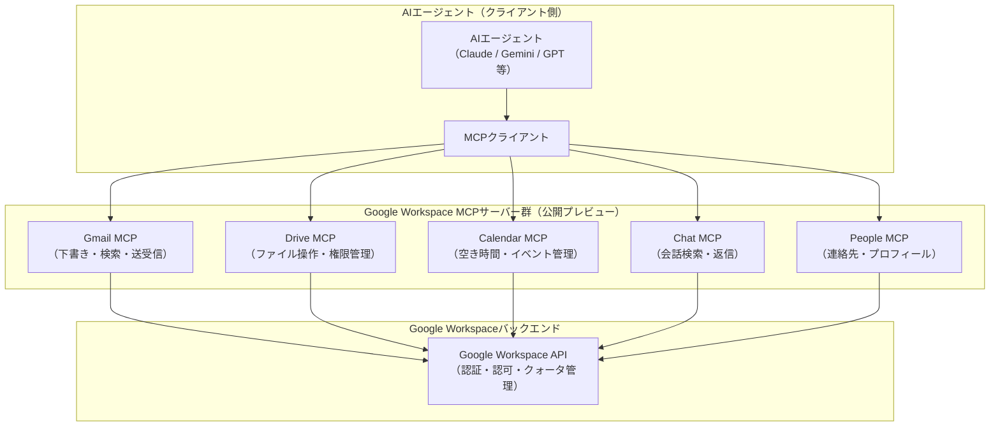

**意義:** AnthropicのMCPがLinux Foundation標準となり、GoogleがWorkspace全体をMCP対応させたことで、AIエージェントが企業の実業務（メール・カレンダー・ドキュメント管理）を直接操作できる基盤が整った。

---

### 1.2 Google Agent Payments Protocol（AP2）v0.2 ：FIDOアライアンスへ寄贈（2026年4月28日）

Googleがエージェント間決済の標準化を目的とした**Agent Payments Protocol（AP2）v0.2**を発表し、オープンガバナンスのため**FIDOアライアンスへ寄贈**。Mastercard・PayPal・Coinbase等60以上の組織が参加。[[3]](#ref-3)[[4]](#ref-4)

**AP2の核心概念：Mandate（委任状）:**

AP2の信頼モデルは「Mandate」と呼ばれる暗号署名付きデジタル契約に基づく。これにより、AIエージェントが本当にユーザーの意図に基づいて決済を実行しているかを検証可能にする。

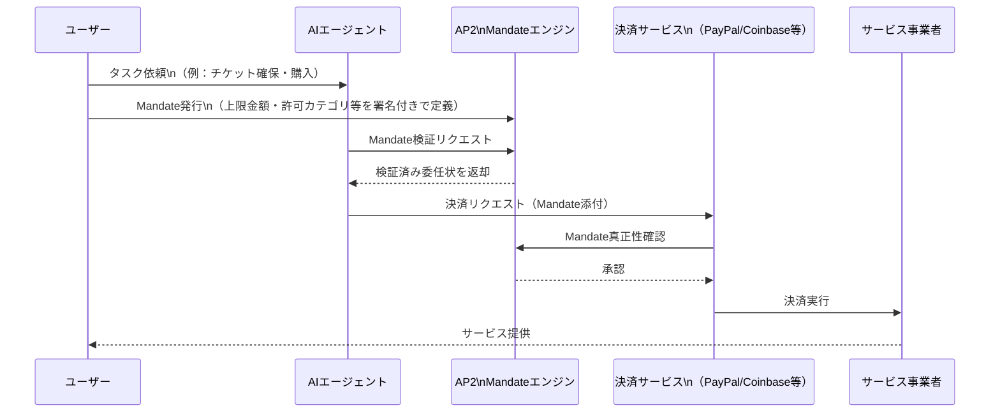

**AP2 v0.2の主要アップデート:**

| 機能 | 内容 |
|---|---|
| **Human Not Present（HNP）決済** | エージェントがユーザー不在時に事前承認に基づき自律決済を実行（例：限定チケットの即時確保） |
| **A2A x402拡張** | Coinbase・Ethereum Foundation・MetaMaskと共同で暗号資産決済を追加 |
| **クロスレール対応** | クレジット/デビットカード・ステーブルコイン・リアルタイム銀行振込を統一プロトコルでサポート |
| **FIDOアライアンスへの寄贈** | オープンコミュニティガバナンスへ移行。60以上の組織が参加 |

**参加主要企業:** Mastercard、American Express、PayPal、Revolut、Coinbase、Adyen、Etsy、Salesforce、ServiceNow、Ant International、Intuit

---

## 2. Microsoft Azure AIアップデート

### 2.1 Azure Foundry IQ：エンタープライズ向けAgentic RAGプラットフォーム（2026年）

MicrosoftがAzure AI SearchをベースにしたRAGの次世代基盤**Foundry IQ**を展開。単一クエリのRAGから「クエリ計画・ソース選択・検索・回答・反復」を自律実行する**Agentic Retrieval**へと進化させる。[[5]](#ref-5)[[6]](#ref-6)

**Foundry IQの主要機能:**

| 機能 | 内容 |
|---|---|
| **Agentic Retrieval** | エージェントが自律的にクエリ計画→複数ソース横断検索→回答生成→自己評価のループを実行 |
| **マルチソース統合** | SharePoint・OneLake・Blob Storage・Webサイト・MCPサーバー等を単一エントリーポイントで接続 |
| **ID基準アクセス制御** | ドキュメントレベルの権限管理。ユーザーが権限を持つデータのみRAGの根拠として使用 |
| **クエリ計画による性能向上** | 標準検索との比較で**平均36%の回答スコア向上**（Microsoft社内評価） |

**Foundry IQの全体アーキテクチャ:**

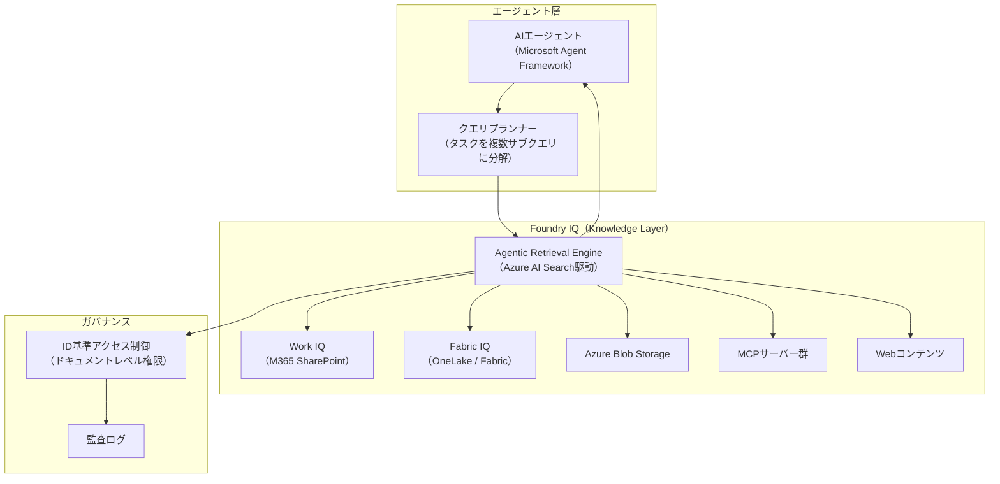

**Foundry IQ ナレッジソース分類:**

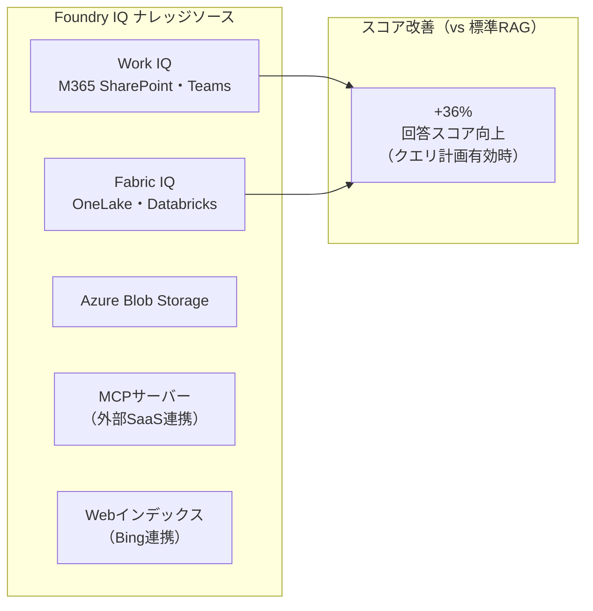

---

## 3. LLM Model / AI Agentアーキテクチャ

### 3.1 Mistral Medium 3.5 + Vibe Remote Agents（2026年4月30日）

Mistral AIが**Mistral Medium 3.5**（128B dense）と**Vibe コーディングエージェントのクラウドリモート実行**を同時リリース。SWE-Bench Verified **77.6%** を記録し、単一スタックでのコーディングエージェント最高性能を達成。[[7]](#ref-7)[[8]](#ref-8)

**Mistral Medium 3.5 スペック:**

| 項目 | 内容 |
|---|---|
| **パラメータ数** | **128B dense**（Devstral 2 + Magistral の統合・後継） |
| **コンテキストウィンドウ** | **256k トークン** |
| **ライセンス** | Modified MIT（商用利用可） |
| **SWE-Bench Verified** | **77.6%**（単一スタックでの業界最高水準） |
| **マルチモーダル** | テキスト＋画像（ビジョンエンコーダーをスクラッチから学習） |
| **実行環境** | 4GPUで動作可能 |
| **API価格** | $2.50/Mトークン (input) / $7.50/Mトークン (output) |

**Vibe Remote Agentsの動作フロー:**

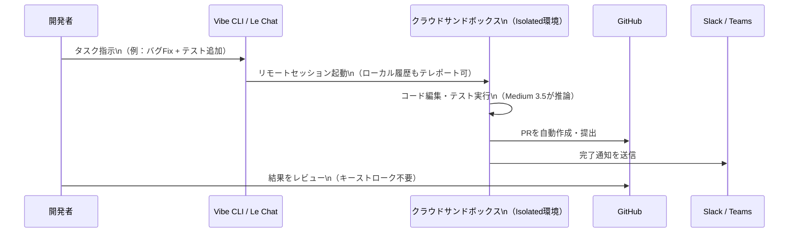

**Vibe Remote Agentsの統合ツール:**

| 統合先 | 用途 |
|---|---|
| **GitHub** | コードクローン・PR自動作成・提出 |
| **Linear / Jira** | チケット・イシュー管理 |
| **Sentry** | インシデント検知・修正 |
| **Slack / Teams** | 完了通知・進捗レポート |

---

### 3.2 Meta Llama 4 Behemoth：~2兆パラメータの「教師モデル」（2026年）

Metaがオープンウェイトモデルシリーズ**Llama 4**の旗艦「Behemoth」の詳細を公開。**総パラメータ約2兆（288B active）** のマルチモーダルMoEモデル。公開重みは未リリースだが、Scout/Maverick両モデルの**知識譎留（コディスティレーション）の教師モデル**として機能。[[9]](#ref-9)

**Llama 4ファミリー全体像:**

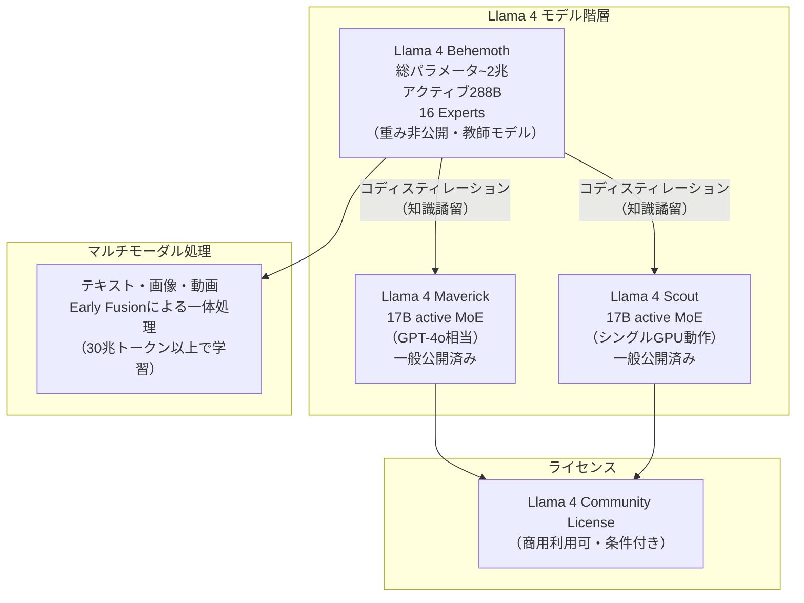

**Behemothの性能ポジション:**

| 比較対象 | STEM系ベンチマーク |
|---|---|
| GPT-4.5 | **Behemothが上回る** |
| Claude Sonnet 3.7 | **Behemothが上回る** |
| Gemini 2.0 Pro | **Behemothが上回る** |
| Gemini 2.5 Pro | **Behemothは全ベンチマークでは上回らず** |

**注:** Behemothは「非デプロイ型フロンティアモデル」として位置づけられており、主用途は高品質な合成データ生成とSmaller Models向けの譎留。

---

## 4. 公式ブログ・論文のリサーチ・要約

### 4.1 Google

#### AP2 + x402：AIエージェント決済エコシステムの標準化

前述（1.2節）のAP2に加え、GoogleはCoinbase・Ethereum Foundation・MetaMaskとの共同でAP2の**A2A x402拡張**を実装。x402（HTTP 402ステータスコードを活用した暗号資産決済プロトコル）をAP2に統合し、法定通貨と暗号資産の両方をカバーするエージェント決済標準を確立した。[[3]](#ref-3)

---

### 4.2 OpenAI

#### OpenAI、$122億調達：史上最大の民間調達で評価額8,520億ドル（2026年3月31日）

OpenAIが総額**$122億（絀18兆円）** の資金調達を完了。評価額は**$8,520億**となり、非公開企業として史上最大の調達を記録した。[[10]](#ref-10)[[11]](#ref-11)

**ラウンド詳細:**

| 投資家 | 出資額 | 備考 |
|---|---|---|
| **Amazon** | **$500億** | うち$350億はIPOまたはAGI達成を条件とする |
| **NVIDIA** | **$300億** | — |
| **SoftBank** | **$300億** | — |
| **個人投資家（リテール）** | **$30億** | 銀行チャネル経由・初の個人向け参加 |
| その他機関投資家 | — | 総額$122億に到達 |

**現時点のビジネス指標:**

| 指標 | 数値 |
|---|---|
| **月次収益** | **$20億/月** |
| **ChatGPT週次アクティブユーザー** | **9億人以上** |
| **ChatGPT有料サブスクライバー** | **5,000万人以上** |
| **エンタープライズ収益比率** | 全体の**40%超**（2026年末までに消費者と同等規模化見込） |
| **調達の位置づけ** | 2026年後半に予定されるIPO前の最終大型私募 |

---

#### OpenAI「The Deployment Company」：$100億JVでエンタープライズAI展開加速（2026年5月）

OpenAIがTPG・Bain Capital・Brookfield Asset Management等19社のPEファームと共同で**“The Deployment Company”（$100億JV）**を設立。PE傘下2,000社以上への直接AI導入を専業とする企業体が誕生。[[12]](#ref-12)[[13]](#ref-13)

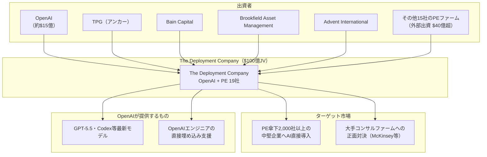

**17.5%固定年次リターン**（5年間保証）を外部出資家に約束した構造が業界で注目されている。

---

### 4.3 Anthropic

#### 金融サービス向け104種のエージェントテンプレート公開（2026年5月5日）

AnthropicがNYでの招待制金融サービス向け発表会で、投資銀行・保険・会計業務向けの**104種の即戦力エージェントテンプレート**をリリース。[[14]](#ref-14)[[15]](#ref-15)

**104種のエージェント一覧:**

| カテゴリ | エージェント名 | 主要タスク |
|---|---|---|
| **投資銀行** | Pitch Builder | ピッチブック自動作成 |
| **投資銀行** | Meeting Preparer | 会議前の情報収集・資料準備 |
| **投資銀行** | Earnings Reviewer | 決算書の自動レビュー |
| **投資銀行** | Model Builder | 財務モデル構築 |
| **リサーチ** | Market Researcher | 市場調査・競合分析 |
| **バリュエーション** | Valuation Reviewer | バリュエーション検証 |
| **経理・会計** | General Ledger Reconciler | 総勘定元帳の照合 |
| **経理・会計** | Month-End Closer | 月次決算クローズ |
| **監査** | Statement Auditor | 財務諸表監査支援 |
| **コンプライアンス** | KYC Screener | KYCファイルのスクリーニング |

**デプロイ形態:**

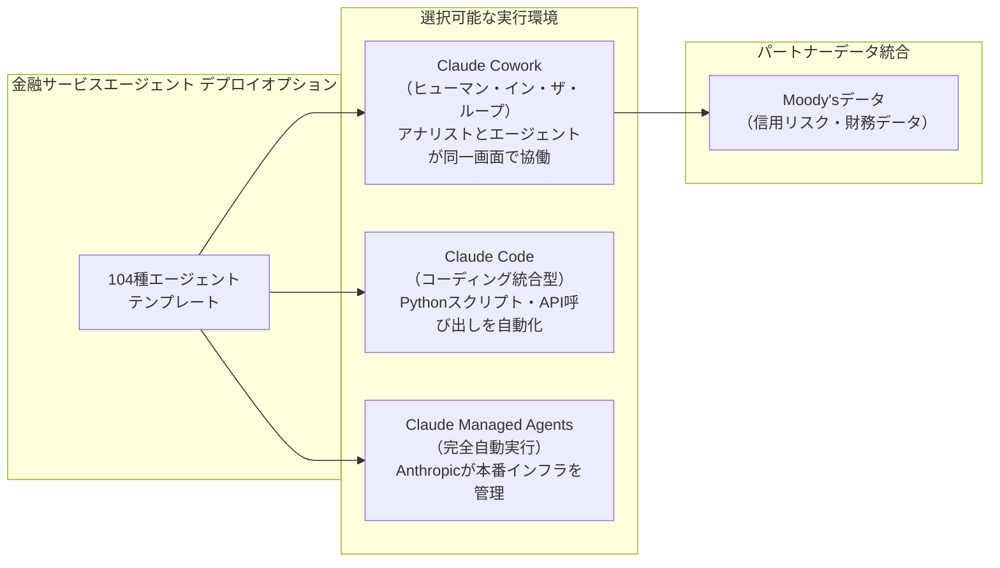

#### Anthropic × Blackstone/Goldman Sachs：$15億エンタープライズJV設立（2026年5月4日）

AnthropicがBlackstone・Hellman & Friedman・Goldman Sachsを筆頭とする**$15億のエンタープライズAIサービスJV**を設立。OpenAIの“The Deployment Company”と同日発表となり、AIラボによるコンサルティング業界への侵攻が一気に加速。[[16]](#ref-16)[[17]](#ref-17)[[18]](#ref-18)

| 投資家 | 出資額 |
|---|---|
| **Blackstone** | 約$3億 |
| **Hellman & Friedman** | 約$3億 |
| **Anthropic** | 約$3億 |
| **Goldman Sachs** | 約$1.5億 |
| General Atlantic、Apollo、Sequoia等 | 残額 |
| **合計** | **約$15億** |

**ミッション:** Anthropicのエンジニアと Claude モデルを企業のコア業務に直接埋め込み、中堅企業のワークフロー全体を再設計する。

#### Claude for Microsoft 365 GA：Excel・Word・PowerPoint正式提供、Outlookはベータ（2026年5月5日）

Claude for Excel、PowerPoint、Word（Officeアドイン）が**一般提供（GA）**開始。Claude for Outlookはパブリックベータ。4アプリを横断したコンテキスト引き継ぎが特徴。[[14]](#ref-14)

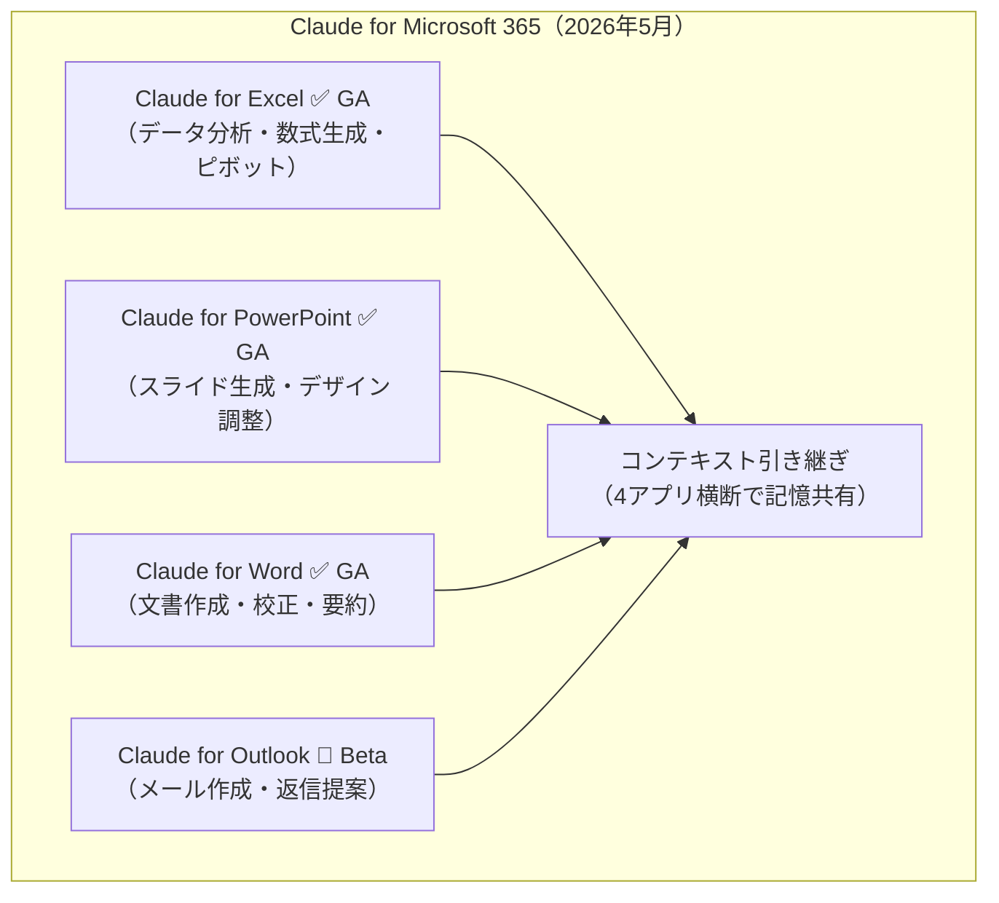

---

## 5. AI Agent搭載SaaS製品情報

### 5.1 Adobe Firefly AI Assistant：クロスアプリ創作エージェントがパブリックベータ（2026年4月27日）

Adobeが**Firefly AI Assistant**をパブリックベータに移行。単一チャットから604以上のプロ向けツールを横断してPhotoshop・Lightroom・Premiere等のマルチステップワークフローを自律実行。[[19]](#ref-19)[[20]](#ref-20)[[21]](#ref-21)

**Firefly AI Assistantの主要機能:**

| 機能 | 内容 |
|---|---|
| **マルチアプリオーケストレーション** | Photoshop・Lightroom・Premiere・Firefly等を自然言語1文で横断自動化 |
| **60+プロツール対応** | Auto Tone・Generative Fill・Remove Background・Vectorize・Presets等 |
| **Creative Skills** | バッチ写真編集・ムードボード作成・ポートレートレタッチ・SNS素材生成等のプリビルト自動化 |
| **サードパーティ連携** | Claude（Anthropic）等の外部チャットボットにライトウェイト版を組み込み予定 |

**対象プラン:** Creative Cloud Pro / Firefly Pro / Pro Plus / Premium

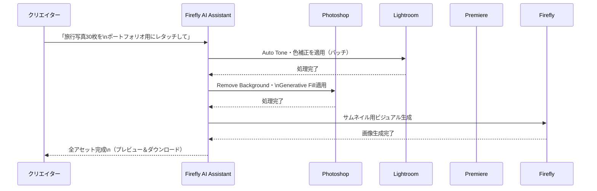

---

### 5.2 Cloudflare × Stripe：AIエージェントの完全自律デプロイメントプロトコル

CloudflareとStripeが共同開発した**Stripe Projects（オープンベータ）**により、AIコーディングエージェントがドメイン取得・アカウント作成・有料サブスクリプション開始・本番デプロイまでを人間介入ゼロで実行可能に。[[22]](#ref-22)

**エージェント自律デプロイの3フェーズ:**

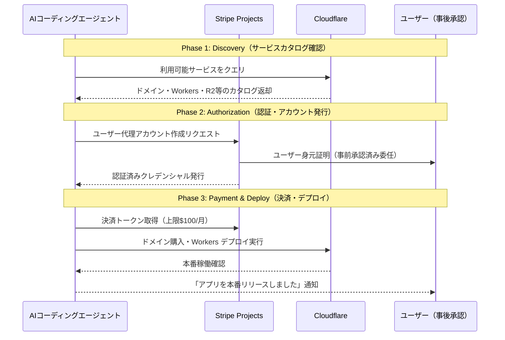

**安全対策:**
- クレジットカード番号等の生の決済情報はエージェントに一切渡らない
- Stripeがデフォルトで**月間上限$100/月**を設定
- ユーザーはいつでも委任を撤回可能

---

## 6. その他特筆すべき情報

### 6.1 AIエージェント決済の2つの標準：x402 vs AP2の競合と協調

2026年春、AIエージェントが自律的に決済を実行する基盤として2つのプロトコルが台頭している。

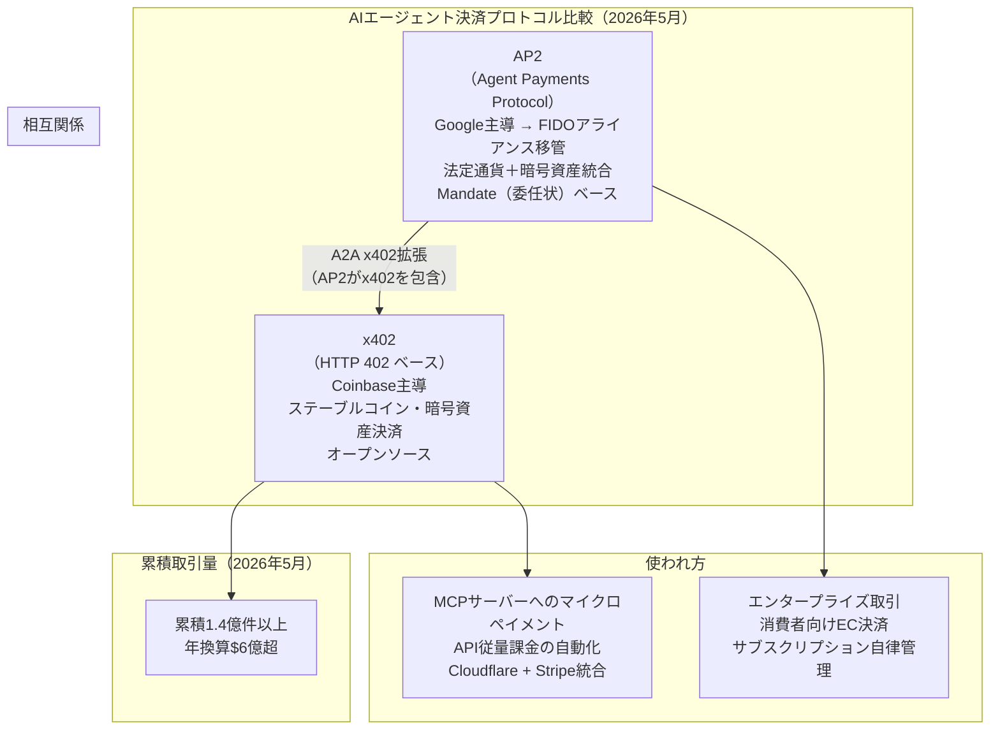

**意義:** x402がMCP・APIの従量決済（ミクロ取引）を担い、AP2がエンタープライズ取引の信頼基盤（委任状ベース）を担う形で役割分担が進む。Googleのx402統合によりプロトコル間の互換性が担保された。

---

### 6.2 OpenAI × Anthropic：AIラボのコンサルティング楫界参入という構造変化

2026年5月同週に、OpenAI（$100億JV）とAnthropic（$15億JV）が両方ともPEファームと組んでエンタープライズAI展開専業JVを設立。これはコンサルティング楫界の構造的なリスクを示す。

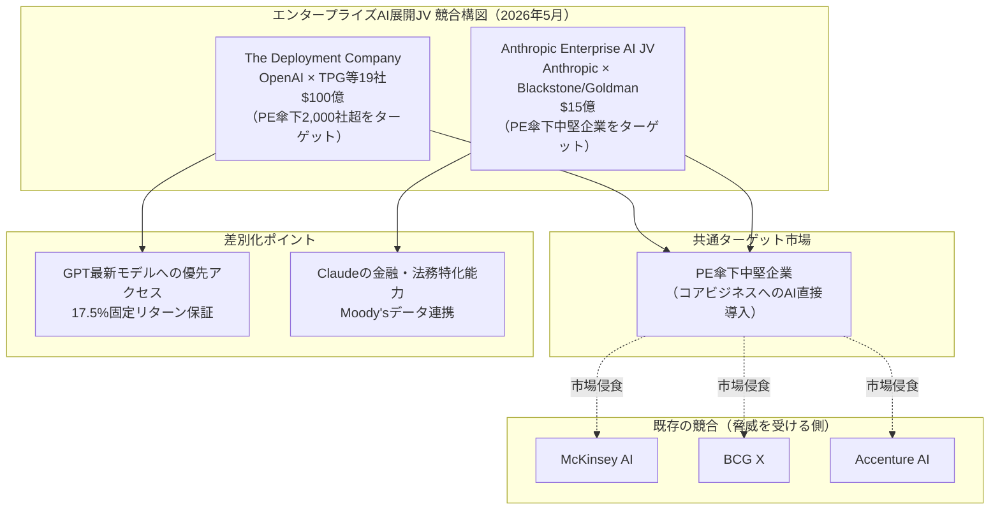

**AIラボ直接展開の意味:** 従来はモデルAPIを販売してコンサルが実装するバリューチェーンだったが、ラボ自身が実装・導入まで垂直統合することで「AI Consulting as a Service」の市場が生まれつつある。

---

## 7. 参考リンク

**[1]** [Google Workspace Updates: New: Agent tools and security updates for Google Workspace developers](https://workspaceupdates.googleblog.com/2026/05/agent-tools-and-security-updates-for-workspace-developers.html)

**[2]** [Announcing official MCP support for Google services | Google Cloud Blog](https://cloud.google.com/blog/products/ai-machine-learning/announcing-official-mcp-support-for-google-services)

**[3]** [Announcing Agent Payments Protocol (AP2) | Google Cloud Blog](https://cloud.google.com/blog/products/ai-machine-learning/announcing-agents-to-payments-ap2-protocol)

**[4]** [Google donates Agent Payments Protocol to FIDO Alliance | Google Blog](https://blog.google/products-and-platforms/platforms/google-pay/agent-payments-protocol-fido-alliance/)

**[5]** [Building Smarter Agents with FoundryIQ: Microsoft's Agentic RAG Platform | Microsoft Azure Blog](https://medium.com/microsoftazure/building-smarter-agents-with-foundryiq-microsofts-agentic-rag-platform-166a0fcebbaf)

**[6]** [Building an Enterprise Knowledge Copilot with Foundry IQ and Agentic Retrieval on Azure AI | Microsoft Community Hub](https://techcommunity.microsoft.com/blog/azuredevcommunityblog/building-an-enterprise-knowledge-copilot-with-foundry-iq-and-agentic-retrieval-o/4512308)

**[7]** [Remote agents in Vibe. Powered by Mistral Medium 3.5. | Mistral AI](https://mistral.ai/news/vibe-remote-agents-mistral-medium-3-5)

**[8]** [Mistral AI Launches Remote Agents in Vibe and Mistral Medium 3.5 with 77.6% SWE-Bench Verified Score | MarkTechPost](https://www.marktechpost.com/2026/05/02/mistral-ai-launches-remote-agents-in-vibe-and-mistral-medium-3-5-with-77-6-swe-bench-verified-score/)

**[9]** [The Llama 4 herd: The beginning of a new era of natively multimodal AI innovation | Meta AI Blog](https://ai.meta.com/blog/llama-4-multimodal-intelligence/)

**[10]** [OpenAI raises $122 billion to accelerate the next phase of AI | OpenAI](https://openai.com/index/accelerating-the-next-phase-ai/)

**[11]** [OpenAI, not yet public, raises $3B from retail investors in monster $122B fund raise | TechCrunch](https://techcrunch.com/2026/03/31/openai-not-yet-public-raises-3b-from-retail-investors-in-monster-122b-fund-raise/)

**[12]** [OpenAI Finalizes $10B Venture With Private Equity Firms to Deploy AI | Bloomberg](https://www.bloomberg.com/news/articles/2026-05-04/openai-finalizes-10-billion-joint-venture-with-pe-firms-to-deploy-ai)

**[13]** [OpenAI closes The Deployment Company, a $10bn enterprise AI bet on private equity | The Next Web](https://thenextweb.com/news/openai-deployco-finalized-10-billion-joint-venture)

**[14]** [Agents for financial services and insurance | Anthropic](https://www.anthropic.com/news/finance-agents)

**[15]** [Anthropic deepens push into Wall Street with new AI agents, full Microsoft 365 integration, Moody's data partnership | Fortune](https://fortune.com/2026/05/05/anthropic-wall-street-financial-services-agents-jamie-dimon/)

**[16]** [Anthropic and OpenAI are both launching joint ventures for enterprise AI services | TechCrunch](https://techcrunch.com/2026/05/04/anthropic-and-openai-are-both-launching-joint-ventures-for-enterprise-ai-services/)

**[17]** [Anthropic Partners with Blackstone, Hellman & Friedman, and Goldman Sachs to Launch Enterprise AI Services Firm | Blackstone Press Release](https://www.blackstone.com/news/press/anthropic-partners-with-blackstone-hellman-friedman-and-goldman-sachs-to-launch-enterprise-ai-services-firm/)

**[18]** [Anthropic teams with Goldman, Blackstone and others on $1.5 billion AI venture targeting PE-owned firms | CNBC](https://www.cnbc.com/2026/05/04/anthropic-goldman-blackstone-ai-venture.html)

**[19]** [Firefly AI Assistant now available in public beta | Adobe Blog](https://blog.adobe.com/en/publish/2026/04/27/firefly-ai-assistant-public-beta)

**[20]** [Introducing Firefly AI Assistant – a new way to create with our creative agent | Adobe Blog](https://blog.adobe.com/en/publish/2026/04/15/introducing-firefly-ai-assistant-new-way-create-with-our-creative-agent)

**[21]** [Adobe's new Firefly AI assistant can use Creative Cloud apps to complete tasks | TechCrunch](https://techcrunch.com/2026/04/15/adobes-new-firefly-ai-assistant-can-use-creative-cloud-apps-to-complete-tasks/)

**[22]** [Agents can now create Cloudflare accounts, buy domains, and deploy | Cloudflare Blog](https://blog.cloudflare.com/agents-stripe-projects/)

**[23]** [x402 - Payment Required | Internet-Native Payments Standard](https://www.x402.org/)

**[24]** [Anthropic and OpenAI establish joint ventures on Wall Street to accelerate enterprise AI adoption | SiliconANGLE](https://siliconangle.com/2026/05/04/anthropic-openai-establish-joint-ventures-wall-street-accelerate-enterprise-ai-adoption/)
