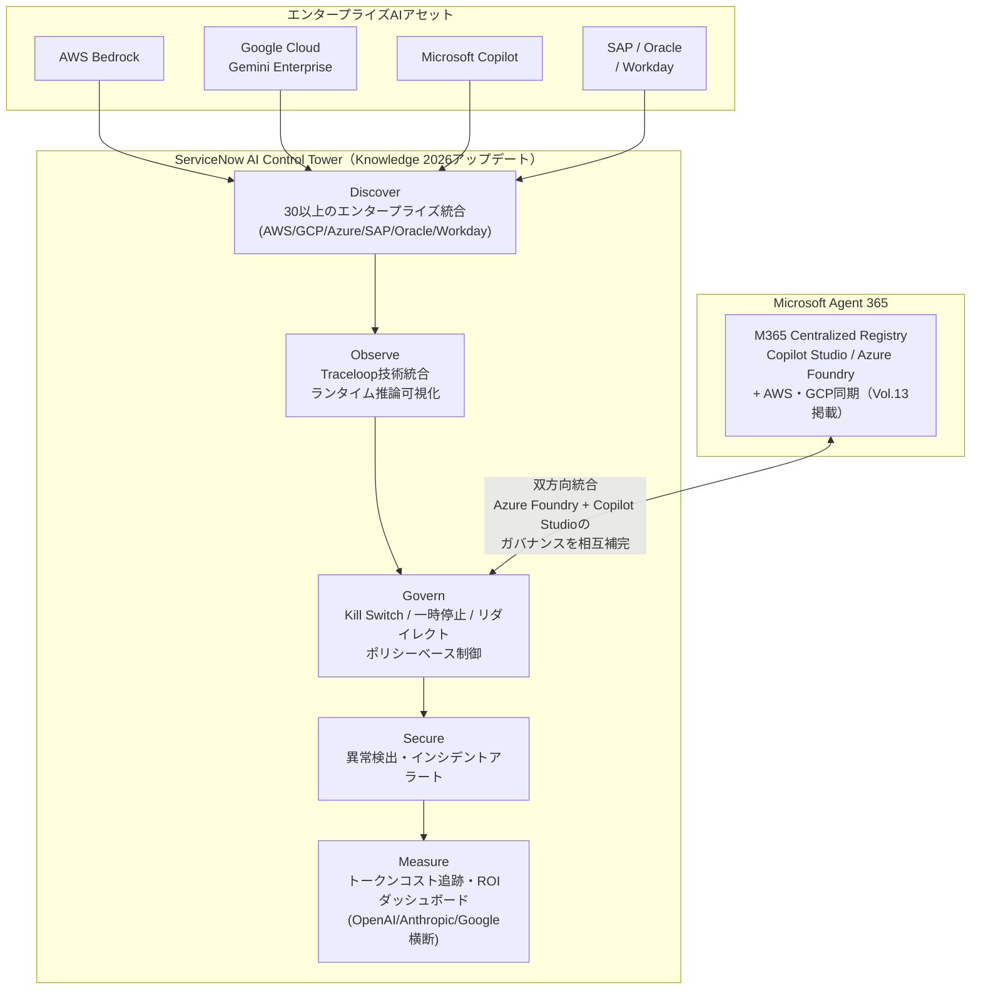
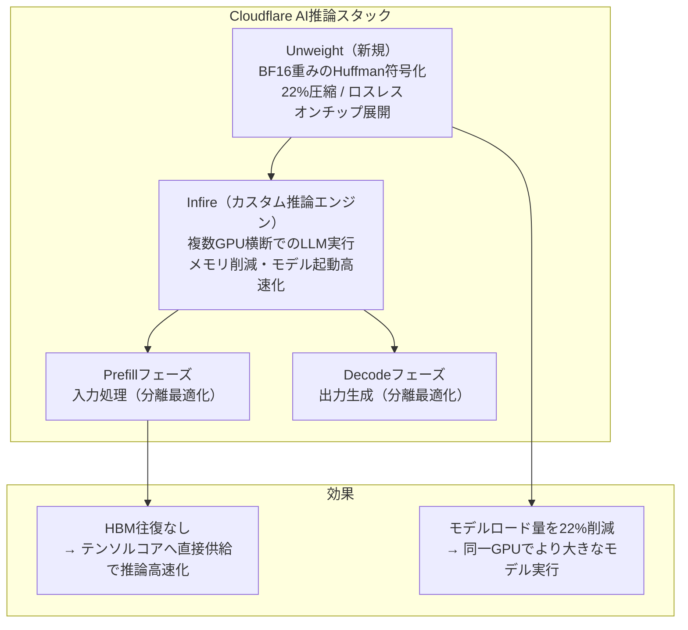
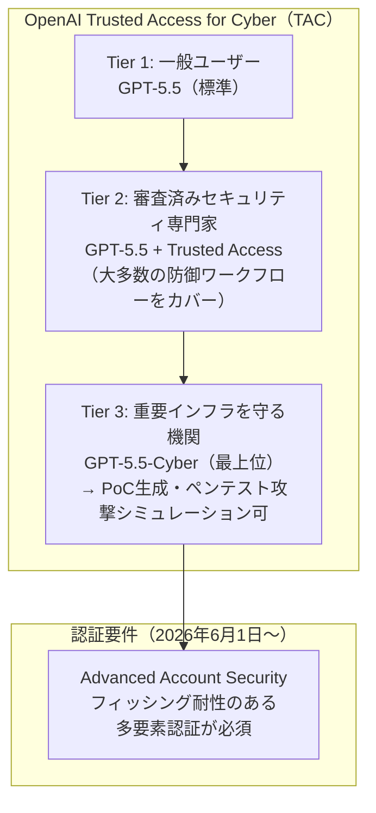
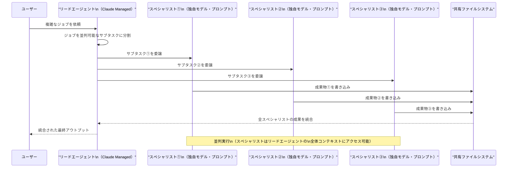
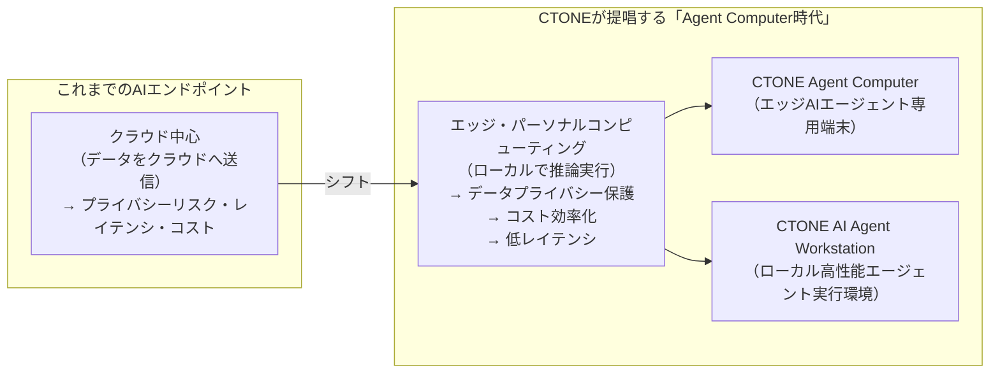
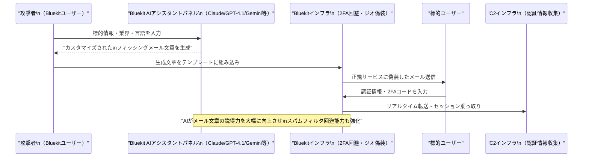

# LLM・AI Agent 最新情報レポート Vol.14

**作成日**: 2026年5月10日  
**対象期間**: 2026年5月9日〜2026年5月10日（Vol.13との差分）

---

## 目次

1. [Google Cloud AIアップデート](#1-google-cloud-aiアップデート)
2. [Microsoft Azure AIアップデート](#2-microsoft-azure-aiアップデート)
3. [LLM Model / AI Agentアーキテクチャ・研究](#3-llm-model--ai-agentアーキテクチャ研究)
4. [公式ブログ・論文のリサーチ・要約](#4-公式ブログ論文のリサーチ要約)
   - [Google / DeepMind](#41-google--deepmind)
   - [OpenAI](#42-openai)
   - [Anthropic](#43-anthropic)
5. [AI Agent搭載SaaS製品情報](#5-ai-agent搭載saas製品情報)
6. [LLM/AI Agentセキュリティインシデント](#6-llmai-agentセキュリティインシデント)
7. [その他特筆すべき情報](#7-その他特筆すべき情報)
8. [参考リンク](#8-参考リンク)

---

## 1. Google Cloud AIアップデート

新情報なし（Google Cloud Next '26の主要発表はVol.11〜13で掲載済み）

---

## 2. Microsoft Azure AIアップデート

### 2.1 ServiceNow AI Control Tower × Microsoft Agent 365 深化連携：「エンタープライズAIの統一コントロールプレーン」戦略が本格化（2026年5月5日）

ServiceNowがKnowledge 2026カンファレンスにおいて**AI Control Towerの大型アップデート**を発表。同時に**Microsoft Agent 365との製品統合の深化**が明らかになり、ServiceNowのAI Control TowerとMicrosoftのAgent 365が相互にガバナンスを補完するアーキテクチャが確立された。[[1]](#ref-1)[[2]](#ref-2)[[3]](#ref-3)

**AI Control Towerの5つの新コア機能：**

| 機能 | 詳細 |
|---|---|
| **Discover（発見）** | AWS・Google Cloud・Microsoft Azureをはじめ、SAP・Oracle・Workdayなど30以上のエンタープライズ統合を通じ、組織全体に分散したAIアセットを自動検出 |
| **Observe（観察）** | Traceloop買収により取得したディープオブザービリティ技術を統合。AIエージェントが**ランタイムでどう推論し・どこで意思決定し・いつ軌道修正すべきか**をリアルタイムで可視化 |
| **Govern（ガバナンス）** | エージェントに対して**リアルタイムの一時停止・リダイレクト・停止（Kill Switch）**が可能に。AI管理者がポリシーベースで動作を制御 |
| **Secure（セキュリティ）** | エージェントの異常動作やポリシー違反を検出し、インシデントアラートを発火させるセキュリティレイヤー |
| **Measure（計測）** | OpenAI・Anthropic・Googleのトークン消費量を横断的に追跡するコスト管理ダッシュボードと ROI指標。財務部門がモデル支出を可視化・予測可能に |

**ServiceNow × Microsoft Agent 365 統合アーキテクチャ：**

**利用可能時期：** AI Control Tower強化機能はInnovation Labに2026年5月に入り、GAは2026年8月予定。AI Agent AdvisorおよびIntelligent Approvalsは2026年5月にGA。

**意義：** ServiceNowのAI Control TowerとMicrosoft Agent 365はともに「マルチクラウドAIエージェントのコントロールプレーン」を標榜しており、両社の製品統合により**既存ITサービス管理（ITSM）の顧客基盤を持つServiceNowがMicrosoftエコシステムのエージェントも統治できる**構図になった。

---

## 3. LLM Model / AI Agentアーキテクチャ・研究

### 3.1 Cloudflare Unweight：BF16テンソルのロスレス圧縮でLLM推論を22%軽量化（2026年5月）

Cloudflareが自社研究として開発した**Unweight**（旧称: Tensor Compression System）の詳細技術ブログおよび論文を公開。LLMの推論パフォーマンスをモデル品質を一切損なわずに改善するロスレス重み圧縮技術で、モデルサイズを最大**15〜22%削減**する。[[4]](#ref-4)[[5]](#ref-5)

**Unweightのコアメカニズム：**

| コンポーネント | 詳細 |
|---|---|
| **対象** | BF16（Brain Float 16）フォーマットの重みテンソル |
| **圧縮手法** | BF16の冗長な指数バイト（exponent bytes）をHuffman符号化 |
| **圧縮率** | モデル全体で約**20%削減**（テンソルによって15〜22%） |
| **ロスレス性** | ビット単位で完全に同一の出力を保証（近似・量子化ではない） |
| **展開場所** | GPU上のオンチップ共有メモリで高速展開 → テンソルコアに直接フィード |
| **特殊HW不要** | 専用ハードウェアなしで動作、既存GPU環境で即時適用可能 |

**Cloudflare LLM推論スタックの全体像：**

**業界的意義：** 量子化（INT4/INT8）ではなくロスレス圧縮でこれほどの圧縮率を実現するアプローチは珍しく、**精度劣化を一切許容できない本番環境**（金融・医療・法律など）でのLLM活用に直接貢献する技術。Cloudflareはこの技術を自社のWorkers AI（グローバルエッジネットワーク上のLLM推論サービス）に展開する予定。

---

## 4. 公式ブログ・論文のリサーチ・要約

### 4.1 Google / DeepMind

新情報なし（Google Cloud Next '26の成果は前号までで掲載済み）

---

### 4.2 OpenAI

#### OpenAI GPT-5.5-Cyber：サイバーセキュリティ向け「制限緩和版」モデルを限定プレビュー公開（2026年5月7〜8日）

OpenAIが**GPT-5.5-Cyber**（コードネーム「Spud」）を、審査済みのサイバーセキュリティ専門家向けに限定プレビューとしてリリース。既存のGPT-5.5とは別に、防御的セキュリティ業務に特化してセーフガードを調整したバリアントで、**Trusted Access for Cyber（TAC）プログラム**の最上位ティアに認定された組織・個人のみが利用できる。[[6]](#ref-6)[[7]](#ref-7)[[8]](#ref-8)

**GPT-5.5 vs GPT-5.5-Cyberの比較：**

| 項目 | GPT-5.5（一般公開） | GPT-5.5-Cyber（限定プレビュー） |
|---|---|---|
| **対象ユーザー** | 全ユーザー | TACプログラム最上位ティア審査済みのサイバー防御者 |
| **ユースケース** | 汎用 | 脆弱性トリアージ・マルウェア解析・セキュアコードレビュー・PoC生成・検出エンジニアリング |
| **制限の違い** | 標準的なセーフガード | セキュリティ業務に対して**より寛容（permissive）**に動作 |
| **依然禁止** | — | クレデンシャル窃取・マルウェア作成は引き続きブロック |
| **認証要件** | — | 2026年6月1日以降、フィッシング耐性のある**Advanced Account Security**が必須 |

**Trusted Access for Cyber（TAC）プログラムのティア構造：**

**英国AI安全機関（AISI）の評価結果：** AISIは「GPT-5.5は32ステップの模擬コーポレートサイバー攻撃シナリオを10回中2回完遂できる」と報告。また「基本的なサイバータスクは少なくとも2026年2月から完全に飽和（saturated）している」と言及し、GPT-5.5-Cyberは能力を大幅に向上させるものではなく、主に「防御タスクに対してより寛容に動作するよう訓練された」と評価。

---

### 4.3 Anthropic

#### Claude Managed Agentsに「Dreaming」「Outcomes」「Multiagent Orchestration」の3機能を追加（2026年5月7日）

Anthropicが**Claude Managed Agents**プラットフォームに3つの新機能を追加。クラウドホスト型AIエージェントの自律性・長期記憶・並列処理能力を大幅に強化する。[[9]](#ref-9)[[10]](#ref-10)

**3つの新機能の詳細：**

| 機能 | 概要 | 制御オプション |
|---|---|---|
| **Dreaming（ドリーミング）** | エージェントが過去セッションを振り返り、パターンを発見して**自己改善**するリサーチプレビュー機能。LLMが「スリープ」の代わりに過去の経験から学習する | 自動更新 or ユーザーが変更をレビューしてから適用の2モード |
| **Outcomes（アウトカム）** | 過去の失敗から学習し、人間のステアリング（誘導）を最小化しながら複雑なジョブを処理。エージェントが経験から成長するフィードバックループを形成 | 設定可能なフィードバックパイプライン |
| **Multiagent Orchestration（マルチエージェントオーケストレーション）** | リードエージェントがジョブを分割し、独自のモデル・プロンプト・ツールを持つ**スペシャリストエージェントに並列委譲**。スペシャリストは共有ファイルシステム上で動作しリードエージェントのコンテキストに貢献 | エージェント構成・モデル選択 |

**Multiagent Orchestrationのアーキテクチャ：**

**実際の導入事例：** NetflixがMultiagent Orchestrationをプラットフォームチームに既にデプロイ。

**Dreaming機能の意義：** エージェントが「スリープしない」—常時稼働する自律エージェントが**過去セッションを積極的に内省して自己改善**するという設計は、タスク完了型からライフロングラーニング型エージェントへの設計パラダイムシフトを示している。

---

## 5. AI Agent搭載SaaS製品情報

### 5.1 CTONE「Agent Computer」シリーズ：クラウドからエッジへ——AIエージェント専用エンドポイントの新カテゴリ（2026年5月9日）

深センの**CTONE Group**が2026年5月8日（深セン）に開催した製品発表イベントで、**Agent Computerシリーズ**と**AI Agent Workstationシリーズ**を正式発表。Intel・AMD・Alibaba Cloud・SenseTimeなどが参加した1,500人規模のイベントで「Mini PCグローバルリーダーからAIコンピューティングエコシステムのビルダーへの戦略転換」を宣言した。[[11]](#ref-11)

**「Agent Computer時代」のコンセプト：**

**CTONEの主張：** AIエンドポイントはデータプライバシー・コスト効率・ローカライズされた計算能力を優先するようになっており、AIのクラウドインフラからエッジデバイス・パーソナルコンピューティングシナリオへのシフトが加速している。

---

## 6. LLM/AI Agentセキュリティインシデント

### 6.1 AIフィッシングキット「Bluekit」——Claude・GPT-4.1・Gemini・DeepSeek対応の"AI搭載型"クライムウェアサービス（2026年5月）

The Hacker Newsが報告した最新フィッシングキット**Bluekit**は、複数のLLMモデルを統合した**AIアシスタントパネル**を搭載し、フィッシングメール文章の自動生成・カスタマイズを支援するクライムウェアサービスとして確認された。[[12]](#ref-12)

**Bluekitの主要機能：**

| カテゴリ | 機能詳細 |
|---|---|
| **AI統合** | Llama・GPT-4.1・Claude・Gemini・DeepSeekを含む複数モデルをサポート。犯罪者がフィッシングメールを生成・改善するための「AIアシスタントパネル」 |
| **攻撃対象テンプレート** | Outlook/Hotmail/Gmail/Yahoo/ProtonMail（メール）・iCloud/Zoho（クラウド）・GitHub（開発者）・Ledger（暗号資産）など |
| **回避機能** | 2要素認証回避・ジオロケーション偽装・アンチボットクローキング・スプーフィング |
| **拡張機能** | 音声クローニング・メール送信機能・通知機能 |

**AI搭載型クライムウェアの攻撃フロー：**

**脅威の背景：** セキュリティ研究者は「クライムウェアサービスへのAI統合が進み、高品質なフィッシングメール作成の技術的参入障壁が大幅に低下している」と警告。Bluekitの事例は、LLMプロバイダーの利用規約・安全フィルタのバイパスが産業規模で商業化されていることを示す。

---

### 6.2 100万件以上の公開AIサービスをスキャン——「自己ホスト型AI基盤はあらゆるソフトウェアの中で最も脆弱」（2026年5月）

セキュリティ企業Intruderが証明書透明性ログを活用して**200万以上のホスト**を特定し、**100万件の公開AIサービス**をスキャンした大規模調査を実施。「自己ホスト型AIインフラは調査対象の中で最も脆弱で、露出度が高く、設定ミスが多い」という結論を発表した。[[13]](#ref-13)

**主な調査結果：**

| カテゴリ | 詳細 |
|---|---|
| **調査規模** | 200万以上のホスト / 100万以上の公開AIサービス |
| **問題1: 認証なし** | 多くのAIプロジェクトでデフォルト認証が設定されていないため、無認証でアクセス可能なホストが多数 |
| **問題2: 政府・金融・マーケティング機関** | 医療・政府・金融など規制業界のホストを含む90以上の露出インスタンスを特定 |
| **問題3: API鍵の平文漏洩** | Claude搭載チャットボットがAPI鍵を平文で開示しているケースを発見 |
| **問題4: ビジネスロジック露出** | FlowiseやN8nなどのエージェント管理プラットフォームが、LLMチャットボットサービスのビジネスロジック全体と認証情報リストを露出 |
| **問題5: ジェイルブレイク** | 無料公開されたチャットボット（マルチモーダルLLMを含む）の大半はセーフガードをバイパス可能 |

**背景（ClawdBotフィアスコ）：** 調査はウイルス的に拡散した自己ホスト型AIアシスタント**ClawdBot**が「1日あたり平均2.6件のCVE」を記録するという異常な状況を受けて実施された。企業がAIを「力の倍増器」として急速に自己ホストする際、セキュリティが速度に犠牲にされている実態が明らかになった。

---

## 7. その他特筆すべき情報

### 7.1 GitHub Copilot：AI Credits（使用量ベース課金）への移行を2026年6月1日から実施——「無制限から計量制へ」

Microsoft傘下の**GitHub**が、全CopilotプランをPremium Request Units（PRU）から**GitHub AI Credits（トークン消費ベースの仮想通貨）**に移行すると発表（4月28日発表、6月1日施行）。急増する推論コストへの対応として、旧来の「無制限サブスクリプション」モデルが持続不可能になったことが背景にある。[[14]](#ref-14)[[15]](#ref-15)

**移行の概要：**

| 項目 | 変更前（〜2026年5月31日） | 変更後（2026年6月1日〜） |
|---|---|---|
| **課金単位** | Premium Request Units（PRU） | GitHub AI Credits（1クレジット = $0.01 USD） |
| **消費計算** | リクエスト数 | トークン数（入力・出力・キャッシュ）×モデル別レート |
| **Copilot Pro+** | $39/月（無制限） | $39/月（$39分のクレジット包含） |
| **Copilot Business** | $19/ユーザー/月 | $19/ユーザー/月（$19分のクレジット包含） |
| **Copilot Enterprise** | $39/ユーザー/月 | $39/ユーザー/月（$39分のクレジット包含） |
| **無制限維持** | — | コード補完・Next Edit Suggestions は引き続き無制限 |

**コスト上昇の影響：** 開発者コミュニティからは「同額でより少ないサービスになる」という反発も出ており、月次プランユーザーは6月1日に自動移行される一方、年次プランユーザーはプラン更新時まで既存の課金体系を維持する。

---

## 8. 参考リンク

**[1]** [ServiceNow expands AI Control Tower to discover, observe, govern, secure, and measure AI | ServiceNow Newsroom](https://newsroom.servicenow.com/press-releases/details/2026/ServiceNow-expands-AI-Control-Tower-to-discover-observe-govern-secure-and-measure-AI-deployed-across-any-system-in-the-enterprise/default.aspx)

**[2]** [ServiceNow adds agent kill switches to AI control tower | The Register](https://www.theregister.com/software/2026/05/05/servicenow-adds-agent-kill-switches-to-ai-control-tower/5228579)

**[3]** [ServiceNow expands AI agent governance through deeper integration with Microsoft | ServiceNow Newsroom](https://newsroom.servicenow.com/press-releases/details/2026/ServiceNow-expands-AI-agent-governance-through-deeper-integration-with-Microsoft/default.aspx)

**[4]** [Unweight: how we compressed an LLM 22% without sacrificing quality | Cloudflare Blog](https://blog.cloudflare.com/unweight-tensor-compression/)

**[5]** [Cloudflare Builds High-Performance Infrastructure for Running LLMs | InfoQ](https://www.infoq.com/news/2026/05/cloudflare-llm-infrastructure/)

**[6]** [Scaling Trusted Access for Cyber with GPT-5.5 and GPT-5.5-Cyber | OpenAI](https://openai.com/index/gpt-5-5-with-trusted-access-for-cyber/)

**[7]** [OpenAI makes GPT-5.5 more widely available to cyber defenders | Axios](https://www.axios.com/2026/05/07/openai-gpt-55-cybersecurity-model)

**[8]** [OpenAI tunes GPT-5.5-Cyber for more permissive security workflows | Help Net Security](https://www.helpnetsecurity.com/2026/05/08/openai-gpt-5-5-cyber-model/)

**[9]** [Anthropic updates Claude Managed Agents with three new features | 9to5Mac](https://9to5mac.com/2026/05/07/anthropic-updates-claude-managed-agents-with-three-new-features/)

**[10]** [Anthropic is letting Claude agents 'dream' so they don't sleep on the job | SiliconANGLE](https://siliconangle.com/2026/05/06/anthropic-letting-claude-agents-dream-dont-sleep-job/)

**[11]** [CTONE Group Unveils AI Strategy and New Agent Computer Series | The Manila Times](https://www.manilatimes.net/2026/05/09/tmt-newswire/pr-newswire/ctone-group-unveils-ai-strategy-and-new-agent-computer-series/2339988)

**[12]** [⚡ Weekly Recap: AI-Powered Phishing, Android Spying Tool, Linux Exploit, GitHub RCE & More | The Hacker News](https://thehackernews.com/2026/05/weekly-recap-ai-powered-phishing.html)

**[13]** [We Scanned 1 Million Exposed AI Services. Here's How Bad the Security Actually Is | The Hacker News](https://thehackernews.com/2026/05/we-scanned-1-million-exposed-ai.html)

**[14]** [GitHub Copilot is moving to usage-based billing | GitHub Blog](https://github.blog/news-insights/company-news/github-copilot-is-moving-to-usage-based-billing/)

**[15]** [Microsoft's GitHub shifts to metered AI billing amid cost crisis | The Register](https://www.theregister.com/2026/04/28/microsofts_github_shifts_to_metered/)
