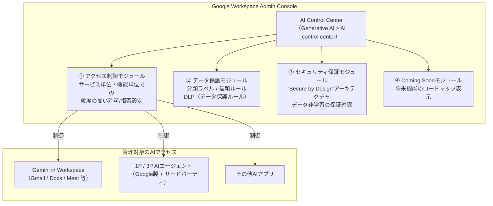
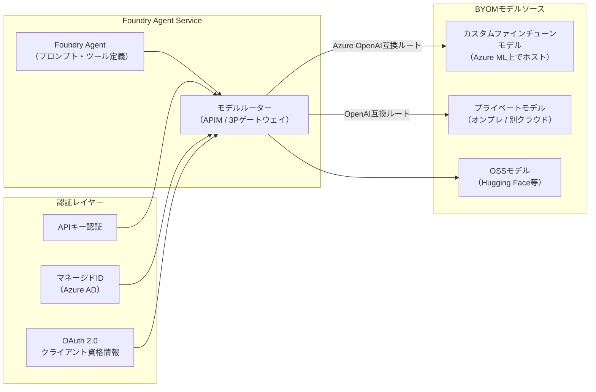
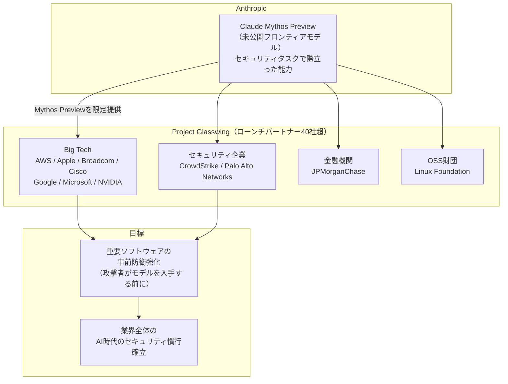
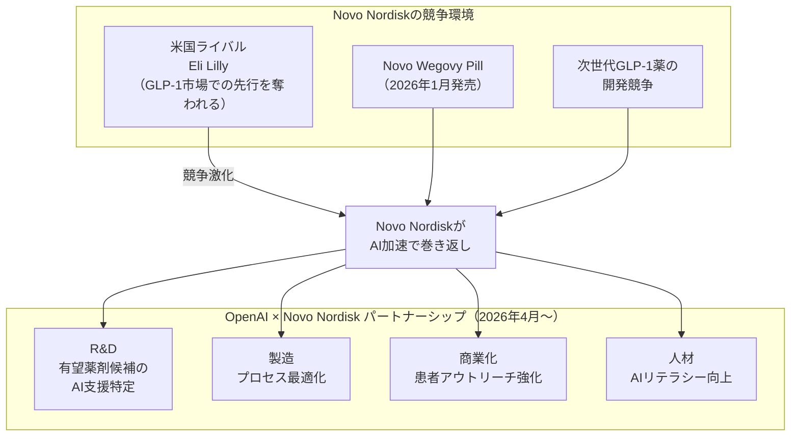
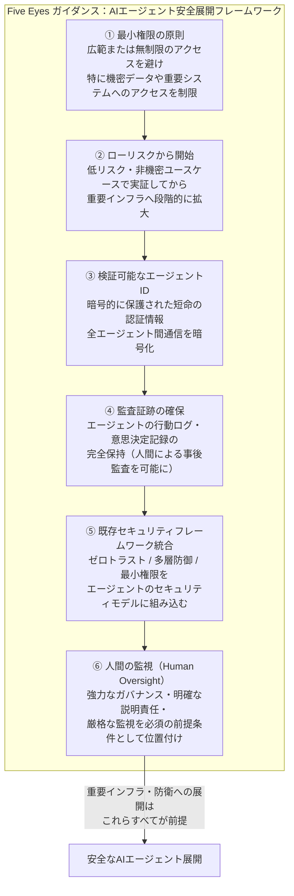
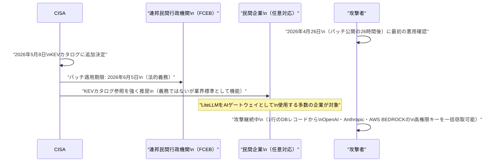

# LLM・AI Agent 最新情報レポート Vol.15

**作成日**: 2026年5月11日  
**対象期間**: 2026年5月10日〜2026年5月11日（Vol.14との差分）

---

## 目次

1. [Google Cloud AIアップデート](#1-google-cloud-aiアップデート)
2. [Microsoft Azure AIアップデート](#2-microsoft-azure-aiアップデート)
3. [LLM Model / AI Agentアーキテクチャ・研究](#3-llm-model--ai-agentアーキテクチャ研究)
4. [公式ブログ・論文のリサーチ・要約](#4-公式ブログ論文のリサーチ要約)
   - [Google / DeepMind](#41-google--deepmind)
   - [OpenAI](#42-openai)
   - [Anthropic](#43-anthropic)
5. [AI Agent搭載SaaS製品情報](#5-ai-agent搭載saas製品情報)
6. [LLM/AI Agentセキュリティインシデント](#6-llmai-agentセキュリティインシデント)
7. [その他特筆すべき情報](#7-その他特筆すべき情報)
8. [参考リンク](#8-参考リンク)

---

## 1. Google Cloud AIアップデート

### 1.1 Google Workspace「AI Control Center」GA：全AIエージェントを一元管理する新しい管理コンソールハブ（2026年5月4日 GA）

Googleが**Google Workspace Admin Console**内の新機能として**AI Control Center**（AI制御センター）を一般提供（GA）開始。エンタープライズのGoogle Workspace管理者が、組織内のすべての生成AIアクションおよびエージェントへのアクセスを単一の「ガラスの一枚板（Single Pane of Glass）」で管理・監視・ガバナンスできる中央ハブ。[[1]](#ref-1)[[2]](#ref-2)

**AI Control Centerの4つのコアモジュール：**

| モジュール | 役割 |
|---|---|
| **アクセス制御** | GeminiやエージェントがWorkspaceデータにアクセスできるサービスを粒度高く制御（例：Meet内のGeminiのみ許可など） |
| **データ保護** | 分類ラベル・信頼ルール・データ保護ルールなどの基盤的な保護をAI使用に適用 |
| **セキュリティ保証** | 「Secure by Design」アーキテクチャへの準拠状況を表示。ユーザーデータがモデル学習に使用されないことを確認できる保証レイヤー |
| **Coming Soon** | 今後追加予定の機能を「Coming soon」としてプレビュー表示。管理者が長期的なロールアウト計画を立てられる |

**AI Control Centerのアーキテクチャと管理フロー：**

**アクセスと可用性：** Admin Console > Generative AI > AI control centerから既定で利用可能。同時期にGoogle Workspace Studioのグローバル展開（英語に加えてフランス語・ドイツ語・イタリア語・日本語・韓国語・ポルトガル語・スペイン語）も完了。[[1]](#ref-1)

**意義：** ServiceNow AI Control TowerやMicrosoft Agent 365が「マルチクラウドAIエージェントのコントロールプレーン」を標榜するなか、GoogleもWorkspaceエコシステム内の統一ガバナンスハブを整備した。エンタープライズAI管理の「単一制御点」を巡る3社の競争が本格化している。

---

## 2. Microsoft Azure AIアップデート

### 2.1 Azure AI Foundry「Bring Your Own Model（BYOM）」GA：任意のモデルゲートウェイをFoundry Agentに接続（2026年5月上旬）

MicrosoftがAzure AI Foundry Agent Serviceの新機能**Bring Your Own Model（BYOM）**を一般提供（GA）。Foundryの組み込みモデルカタログに限らず、**Azure API ManagementやサードパーティAIゲートウェイの背後にあるカスタムモデル・プライベートモデル**をFoundry Agentと接続できる機能。[[3]](#ref-3)

**BYOM for Foundry Agent Serviceの主要機能：**

| 機能カテゴリ | 詳細 |
|---|---|
| **接続タイプ** | Azure API Management（APIM）または任意のサードパーティAIゲートウェイを選択可能 |
| **認証方式** | APIキー / マネージドID（カスタム対象ユーザー指定可） / OAuth 2.0クライアント資格情報の3方式に対応 |
| **ルーティング互換性** | Azure OpenAIスタイルおよびOpenAIスタイルのURLルート両対応。既存ゲートウェイのURL構造に合わせて柔軟に設定 |
| **Foundry Portal連携** | Build > Agentsでエージェント新規作成時に、BYOMで追加したモデルを選択しプレイグラウンドでテスト可能 |

**BYOMアーキテクチャの概念図：**

**意義：** これまでFoundry Agentはマイクロソフトのモデルカタログに収録されたモデルのみを利用できたが、BYOMにより「どのモデルでもFoundryのエージェントランタイムで動かせる」構造になった。Foundryを社内AIゲートウェイのオーケストレーション層として位置付ける企業にとって、既存のモデルホスティング資産をそのまま活用できる。

---

## 3. LLM Model / AI Agentアーキテクチャ・研究

### 3.1 Anthropic Claude Mythos Preview + Project Glasswing：フロンティアAIが数千件のゼロデイ脆弱性を自律発見（2026年4月7日発表）

Anthropicが未公開のフロンティアモデル**Claude Mythos Preview**と、その能力を活用した産学連携セキュリティイニシアティブ**Project Glasswing**を発表。Mythos Previewが主要OS・ブラウザ・インフラソフトウェアにわたる**数千件のゼロデイ脆弱性を完全自律で発見・実証（PoC）**したという衝撃的な結果が明らかになった。[[4]](#ref-4)[[5]](#ref-5)[[6]](#ref-6)

**Claude Mythos Previewの能力：**

| 評価項目 | 内容 |
|---|---|
| **ゼロデイ発見スケール** | 主要OS全種・主要ブラウザ全種・その他重要ソフトウェアにわたる数千件を特定 |
| **自律PoC事例（CVE-2026-4747）** | FreeBSD NFS実装の17年物RCE脆弱性を完全自律で発見・PoC実行。NFS稼働中のマシンにインターネット上の未認証ユーザーがルート権限を取得可能。**人間は初期リクエスト後一切介入していない** |
| **セキュリティ特化度** | 「汎用タスクで強力だが、コンピュータセキュリティタスクで際立って高い能力を示す」とAnthropicが評価 |

**Project Glasswingの枠組み：**

**「防衛者優先」の公開戦略：** Anthropicは、Mythos Previewを一般公開するのではなく、審査済みの重要インフラパートナー・オープンソース開発者（約40組織）に先行提供することで「攻撃者が類似能力を入手する前に、防衛者が最重要システムを修復できる」期間を設けるアプローチを取った。

**セキュリティコミュニティへの影響：** セキュリティ研究者Bruce Schneierは「AIが自律的に研究レベルの脆弱性を発見できる世界が実現した」とブログで言及。一方でClaude Mythos Previewが攻撃者の手に渡った場合の破壊的リスクについての論争も起きており、「防衛と攻撃の非対称性をAIがどう変えるか」が業界最大の論点になっている。[[6]](#ref-6)[[7]](#ref-7)

---

## 4. 公式ブログ・論文のリサーチ・要約

### 4.1 Google / DeepMind

新情報なし（前号までで掲載済み）

---

### 4.2 OpenAI

新情報なし（前号までで掲載済み）

---

### 4.3 Anthropic

#### Anthropic「Project Glasswing」ブログ：フロンティアAIで攻撃者の先を行く防衛戦略を公式解説

上記「3.1」のClaude Mythos PreviewとProject Glasswingについて、Anthropicが公式ブログ・セキュリティサイト（red.anthropic.com）で詳細解説を公開。「私たちが今やっていることは、攻撃者がAIを手に入れる前に、防衛者がシステムを修復できるようにすること」という哲学が明示された。[[4]](#ref-4)[[5]](#ref-5)

技術的な詳細については[3. LLM Model / AI Agentアーキテクチャ・研究](#3-llm-model--ai-agentアーキテクチャ研究)を参照。

---

## 5. AI Agent搭載SaaS製品情報

### 5.1 Novo Nordisk × OpenAI：創薬・製造・商業化の全体をAIで変革する戦略的パートナーシップ（2026年4月14日）

デンマークの製薬大手**Novo Nordisk**（GLP-1肥満治療薬Wegovyのメーカー）が**OpenAI**と戦略的パートナーシップを締結。研究開発から製造・サプライチェーン・商業化まで**事業全体にAIを統合**し、2026年末までに完全デプロイを目指す。[[8]](#ref-8)[[9]](#ref-9)

**パートナーシップの適用範囲：**

| 領域 | AIの活用内容 |
|---|---|
| **創薬・R&D** | 複雑なデータセット解析・有望新薬候補の特定・研究から患者到達までのタイムライン短縮 |
| **製造・サプライチェーン** | 製造プロセスの最適化・在庫予測・配送効率化 |
| **商業化・マーケティング** | 患者への適切なアウトリーチ・市場分析の高度化 |
| **人材育成** | OpenAIがNovo全グローバル従業員のAIリテラシー向上・スキルアップを支援 |

**戦略的背景：**

**意義：** 創薬のような**多段階・長期・規制厳格**な産業領域でのOpenAI製品の本格統合事例として注目される。GLP-1市場という数十億ドル規模の競争でのAI活用は「医薬品開発のAIエージェント化」の先行事例となる可能性がある。

---

## 6. LLM/AI Agentセキュリティインシデント

### 6.1 Five Eyes「エージェント型AIの慎重な導入」共同ガイダンス発表：重要インフラへのAIエージェント展開に初の国際規制勧告（2026年5月1日）

米国（CISA・NSA）・オーストラリア（ASD ACSC）・カナダ（CCCS）・ニュージーランド（NZ NCSC）・英国（UK NCSC）の**6機関**が共同で**「Careful Adoption of Agentic AI Services（エージェント型AIサービスの慎重な採用）」**を公開。エージェント型AI特有のサイバーセキュリティリスクと対策をまとめた**初の国際的な政府連携ガイダンス**。[[10]](#ref-10)[[11]](#ref-11)[[12]](#ref-12)

**Five Eyes共同ガイダンスが識別した5つのリスクカテゴリ：**

| リスクカテゴリ | 具体的なリスク例 |
|---|---|
| **権限（Privilege）リスク** | 過剰な権限付与・権限昇格・ラテラルムーブメント。エージェントが運用上必要以上のシステムアクセス権を持つ「権限クリープ」 |
| **設計・設定リスク** | エージェントが期待する環境外で動作した場合の不安定動作、設定ミスによる意図しないデータ露出 |
| **行動（Behavioral）リスク** | 目標の誤解釈・仕様外行動・マルチエージェント連鎖での予期しない挙動の増幅 |
| **構造（Structural）リスク** | マルチエージェントシステムのプロンプトインジェクション・サプライチェーン攻撃・信頼できないソースからの悪意あるコンテンツ注入 |
| **説明責任（Accountability）リスク** | エージェントが行った意思決定のログ不足・人間による事後監査が困難になる不透明な実行経路 |

**ガイダンスの主要勧告と実装アーキテクチャ：**

**発表背景：** ガイダンス冒頭で「エージェント型AIは電力グリッド・水道・防衛調達・IT運用を含む重要インフラ内で既に動作しており、多くの場合、担当エージェントは人間の管理者がリアルタイムで監査できる以上のシステムアクセス権を持って稼働している」と明記。**LiteLLM脆弱性の実際の悪用**（Vol.11掲載）や**Claude/GPTを悪用したメキシコ水道局攻撃**（Vol.12掲載）などの事例が、本ガイダンス策定を急いだ背景にある。

---

### 6.2 LiteLLM CVE-2026-42208：CISAがKnown Exploited Vulnerabilities（KEV）カタログに追加——連邦機関への対応義務化（2026年5月8日）

Vol.11（2026年5月7日）で報告したオープンソースLLMゲートウェイ**LiteLLM**のSQLインジェクション脆弱性（CVE-2026-42208）について、米国**CISA（Cybersecurity and Infrastructure Security Agency）**が2026年5月8日付で**KEV（Known Exploited Vulnerabilities）カタログ**に追加した。[[13]](#ref-13)[[14]](#ref-14)

**KEVカタログ追加の意義と対応要件：**

| 項目 | 内容 |
|---|---|
| **CISA KEV追加日** | 2026年5月8日 |
| **対応期限（連邦機関）** | 2026年6月5日（Federal Civilian Executive Branch機関はこの日までにパッチ適用が義務） |
| **CVSSスコア** | 9.8（Critical） |
| **脆弱性の性質** | 認証前（Pre-Auth）から悪用可能なSQLインジェクション。LLMプロバイダーキー（OpenAI・Anthropic・AWS Bedrock）を一括窃取可能 |
| **修正バージョン** | LiteLLM 1.83.7-stable以降 |

**KEVカタログへの追加が意味すること：**

**注意点：** Vol.11では「脆弱性の発見と最初の悪用（4月26日）」を報告済み。本号のKEVカタログ追加（5月8日）は、CISAが「能動的に悪用されている」と正式認定した新たな節目であり、未パッチ環境が依然多数存在することを示している。

---

## 7. その他特筆すべき情報

### 7.1 Google I/O 2026：5月19〜20日開催——Gemini 4・アジェンティックAI・Android 17が主要テーマ（2026年5月11日現在）

**Google I/O 2026**が2026年5月19日（火）〜20日（水）に開催予定。基調講演は5月19日 午前10時（太平洋時間）からLivestream配信。例年最大のデベロッパーカンファレンスとして、AIエージェント・LLMに関する重要発表が予想される。[[15]](#ref-15)[[16]](#ref-16)

**Google I/O 2026での主要予想発表：**

| カテゴリ | 予想コンテンツ |
|---|---|
| **Gemini 4** | Googleのフラッグシップモデル最新世代。高速応答・推論強化・Workspaceへの深い統合が期待される |
| **アジェンティックAI** | シンプルな生成AIから「複雑なタスクを最小限の監視で実行するエージェント」へのシフトが主テーマ |
| **Android 17** | AIエージェントとAndroidの統合強化。AI搭載デバイスアプリの次期アーキテクチャ |
| **Aluminum OS** | Sameer Samat確認済みの新OS。2026年中のローンチが有力 |
| **Android XR** | 拡張現実デバイスとGeminiエージェントの連携 |

**LLMコミュニティへの注目ポイント：** Google Cloud Next '26（4月22〜24日・Vol.12掲載）での大規模発表後、I/O 2026はコンシューマーおよびデベロッパー向けのAI機能・APIをどこまで拡張するかが焦点。特に**Gemini 4の能力（Claude Opus 4.7やGPT-5.5との対比）**と**エージェントAPIの次世代仕様（ADK v2等）**への関心が高い。

---

## 8. 参考リンク

**[1]** [Google Workspace Updates: Securely manage AI and agent access to Workspace data with the AI control center | Google Workspace Updates Blog](https://workspaceupdates.googleblog.com/2026/05/securely-manage-AI-and-agent-access-to-Workspace-data-with-the-AI-control-center.html)

**[2]** [Google Workspace now has a central hub to control all AI and agent access | GadgetBond](https://gadgetbond.com/google-workspace-ai-control-center/)

**[3]** [Bring Your Own Model to Foundry Agent Service Is Now Generally Available | Microsoft Community Hub](https://techcommunity.microsoft.com/blog/azure-ai-foundry-blog/bring-your-own-model-to-foundry-agent-service-is-now-generally-available/4515133)

**[4]** [Project Glasswing: Securing critical software for the AI era | Anthropic](https://www.anthropic.com/glasswing)

**[5]** [Claude Mythos Preview | red.anthropic.com](https://red.anthropic.com/2026/mythos-preview/)

**[6]** [Anthropic's Claude Mythos Finds Thousands of Zero-Day Flaws Across Major Systems | The Hacker News](https://thehackernews.com/2026/04/anthropics-claude-mythos-finds.html)

**[7]** [On Anthropic's Mythos Preview and Project Glasswing | Schneier on Security](https://www.schneier.com/blog/archives/2026/04/on-anthropics-mythos-preview-and-project-glasswing.html)

**[8]** [Novo Nordisk partners with OpenAI as AI drug discovery hopes mount | CNBC](https://www.cnbc.com/2026/04/14/novo-nordisk-openai-ai-drug-discovery-healthcare-nvo.html)

**[9]** [Novo Nordisk and OpenAI partner to transform how medicines are discovered and delivered | BioSpace](https://www.biospace.com/press-releases/novo-nordisk-and-openai-partner-to-transform-how-medicines-are-discovered-and-delivered)

**[10]** [Careful Adoption of Agentic AI Services | CISA](https://www.cisa.gov/resources-tools/resources/careful-adoption-agentic-ai-services)

**[11]** [CISA, US and International Partners Release Guide to Secure Adoption of Agentic AI | CISA Newsroom](https://www.cisa.gov/news-events/news/cisa-us-and-international-partners-release-guide-secure-adoption-agentic-ai)

**[12]** [Five Eyes warn agentic AI is too dangerous for rapid rollout | The Register](https://www.theregister.com/2026/05/04/five_eyes_agentic_ai_recommendations/)

**[13]** [CISA Adds Critical LiteLLM SQL Injection Flaw (CVE-2026-42208) to KEV Catalog Amid Active Exploitation | Windows News](https://windowsnews.ai/article/cisa-adds-critical-litellm-sql-injection-flaw-cve-2026-42208-to-kev-catalog-amid-active-exploitation.417219)

**[14]** [U.S. CISA adds a flaw in BerriAI LiteLLM to its Known Exploited Vulnerabilities catalog | Security Affairs](https://securityaffairs.com/191964/security/u-s-cisa-adds-a-flaw-in-berriai-litellm-to-its-known-exploited-vulnerabilities-catalog.html)

**[15]** [From Android 17, Gemini 4 to AI: Everything to expect at Google I/O 2026 | BusinessToday](https://www.businesstoday.in/technology/story/from-android-17-gemini-4-to-ai-everything-to-expect-at-google-io-2026-530775-2026-05-11)

**[16]** [Google I/O 2026: What to expect next week including Android 17, AI announcements and more | Yahoo Tech](https://tech.yahoo.com/general/article/google-io-2026-what-to-expect-next-week-including-android-17-ai-announcements-and-more-131200995.html)
