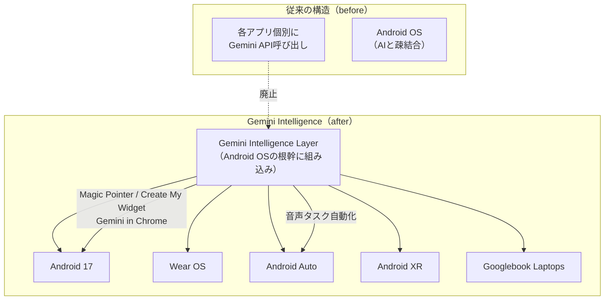
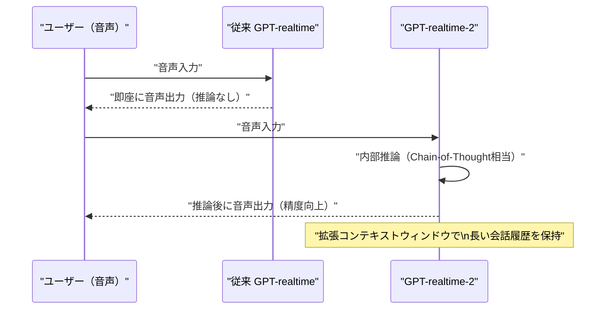
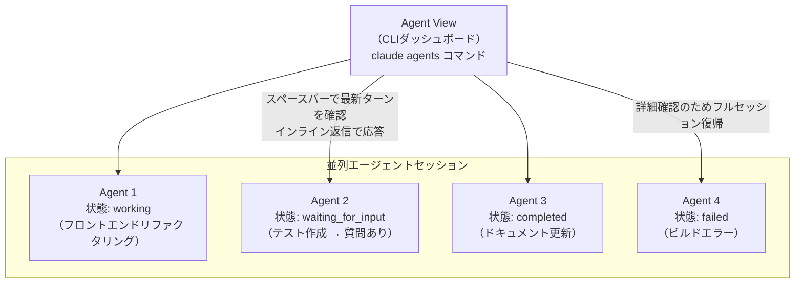
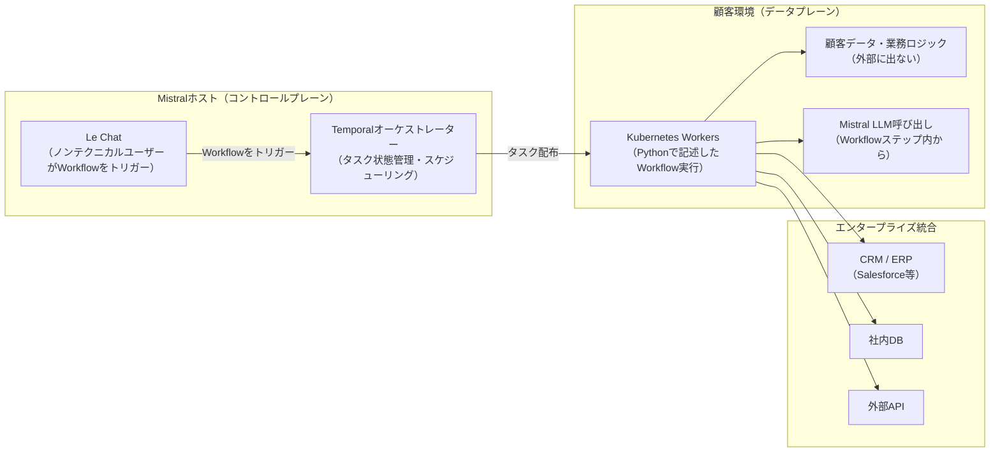
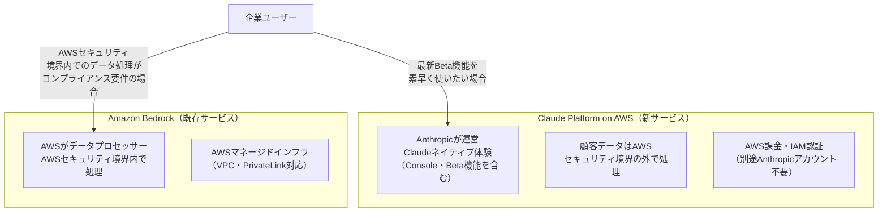
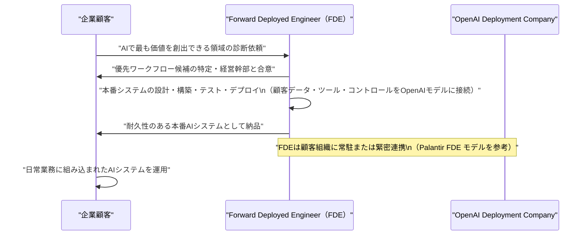
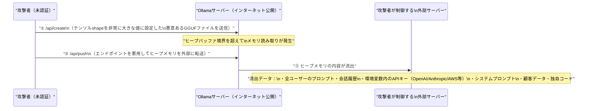
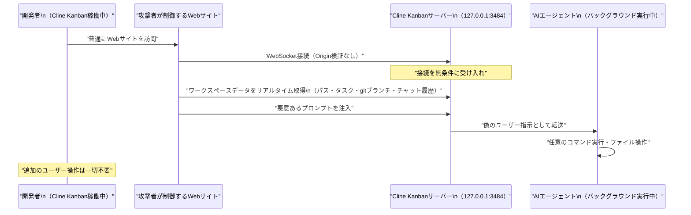
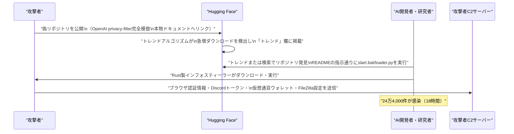

# LLM・AI Agent 最新情報レポート Vol.16

**作成日**: 2026年5月12日  
**対象期間**: 2026年5月11日〜2026年5月12日（Vol.15との差分）

---

## 目次

1. [Google AIアップデート（Android Show: I/O Edition）](#1-google-aiアップデートandroid-show-io-edition)
2. [Microsoft Azure AIアップデート](#2-microsoft-azure-aiアップデート)
3. [LLM Model / AI Agentアーキテクチャ・研究](#3-llm-model--ai-agentアーキテクチャ研究)
4. [公式ブログ・論文のリサーチ・要約](#4-公式ブログ論文のリサーチ要約)
   - [Google / DeepMind](#41-google--deepmind)
   - [OpenAI](#42-openai)
   - [Anthropic](#43-anthropic)
5. [AI Agent搭載SaaS製品情報](#5-ai-agent搭載saas製品情報)
6. [LLM/AI Agentセキュリティインシデント](#6-llmai-agentセキュリティインシデント)
7. [その他特筆すべき情報](#7-その他特筆すべき情報)
8. [参考リンク](#8-参考リンク)

---

## 1. Google AIアップデート（Android Show: I/O Edition）

### 1.1 The Android Show: I/O Edition 2026（5月12日開催）：Gemini Intelligence・Googlebook・Android XRを発表

Googleが**Google I/O 2026（5月19〜20日）の前哨戦**として、**The Android Show: I/O Edition**をPT午前10時からLivestream配信。Gemini AIをAndroidの根幹に組み込む戦略的転換と、新ハードウェアカテゴリ「Googlebook」を正式発表した。[[1]](#ref-1)[[2]](#ref-2)[[3]](#ref-3)

**主要発表内容：**

| カテゴリ | 発表内容 |
|---|---|
| **Gemini Intelligence** | AndroidのOS根幹に組み込まれるAIインテリジェンス層。Wear OS・Android Auto・Android XR・Android 17に展開 |
| **Magic Pointer** | 「Select anything to ask Gemini」機能。画面上の任意要素を選択してGeminiに質問可能な文脈認識UI |
| **Create My Widget** | 自然言語でカスタムウィジェットを"バイブコーディング"。例：「毎週月曜に高タンパク質ミールプレップ3種を提案して」と入力するだけでウィジェット生成 |
| **Android Auto** | Gemini Intelligenceがカーインフォテインメントに搭載。複雑なタスクを音声のみで実行可能に |
| **Gemini in Chrome for Android** | Webページ要約・コンテンツへの質問・ブラウジングタスクの自動化をAndroid上のChromeで実現 |
| **Googlebook** | Acer・ASUS・Dell・HP・Lenovo製の新AIノートPC。Gemini Intelligence中心に設計。2026年秋発売予定。全機種にキーボード上の「Glowbar」を搭載 |
| **Android 17** | 3D絵文字・クロスプラットフォーム互換性強化など大規模ビジュアルリニューアル |

**Gemini Intelligence アーキテクチャの変化：**

**意義：** 単なる「アプリとしてのAIアシスタント」から「OSそのものの知性層」へのパラダイムシフト。AppleのApple Intelligenceと正面から競合する設計思想であり、エコシステム全体（モバイル・ウェアラブル・自動車・XR・ラップトップ）にGeminiを統合することで「Googleデバイスを使う限りAIは常に存在する」体験を目指す。[[4]](#ref-4)

---

## 2. Microsoft Azure AIアップデート

### 2.1 GPT-chat-latest が Microsoft Foundry でリリース（5月12日頃）

**GPT-chat-latest**が**Microsoft Foundry**でロールアウト開始。GPT-5.5をベースにした最新チャットモデルで、マルチターンアシスタント・エージェンティックシステム・検索連携アプリ向けに最適化されている。[[5]](#ref-5)[[6]](#ref-6)

**GPT-chat-latest の主要特性：**

| 項目 | 内容 |
|---|---|
| **ベースモデル** | GPT-5.5（GPT-5.4とGPT-5.3-chatからの継続的改良） |
| **効率性** | 同等品質を維持しながら、GPT-5.3-chatと比較して出力トークン数を**約25〜30%削減** |
| **ツール呼び出し精度** | 事実正確性・ツールコール・応答効率で有意な向上 |
| **用途** | マルチターンアシスタント・ツールを使うエージェンティックシステム・RAG（検索拡張生成）アプリ |
| **デプロイ** | Foundry Models / Azure OpenAI Service 経由で利用可能 |

---

### 2.2 新 GPT-realtime モデル群が Microsoft Foundry にロールアウト（5月12日頃）

**GPT-realtime-2**・**GPT-realtime-translate**・**GPT-realtime-whisper** の3モデルが Microsoft Foundry に追加。リアルタイム音声AIの新世代として、推論機能・多言語翻訳・ライブ文字起こしを強化した。[[7]](#ref-7)

**GPT-realtime 新モデル詳細：**

| モデル | 概要 | 主な進化点 |
|---|---|---|
| **GPT-realtime-2** | Speech-to-speechモデルの世代交代版 | 発話前に**内部推論を実行**できるようになった（従来は即時応答のみ）。拡張されたコンテキストウィンドウを持ち、複雑な問題を考えてから発話可能 |
| **GPT-realtime-translate** | リアルタイム多言語音声翻訳モデル | ライブの多言語翻訳・インターネーション（国際化）シナリオを想定した低遅延設計 |
| **GPT-realtime-whisper** | リアルタイム音声文字起こしモデル | ライブトランスクリプション特化の最新世代Whisperベース |

**アーキテクチャの進化（GPT-realtime-2）：**

---

## 3. LLM Model / AI Agentアーキテクチャ・研究

### 3.1 Claude Code「Agent View」：並列AIエージェントを1つのCLIで管理（Research Preview・5月11日）

Anthropicが**Claude Code**の新機能**Agent View**をResearch Previewとして公開。複数のAIコーディングセッションを1つのCLIダッシュボードから管理・監視・指示できる仕組みで、従来は各セッションを個別のターミナルで管理していた課題を解決する。[[8]](#ref-8)[[9]](#ref-9)

**Agent Viewの主要機能：**

| 操作 | 方法 |
|---|---|
| **Agent Viewを開く** | `claude agents` コマンドを実行 または 任意セッションから左矢印キー |
| **バックグラウンド送信** | `/bg` コマンド または `claude --bg "<タスク>"` で新規バックグラウンドジョブ起動 |
| **状態確認（ピーク）** | スペースバーで最新ターンをインラインプレビュー |
| **インライン返信** | 添付なしで返信・指示を送信（フルログに移行不要） |
| **フルセッション復帰** | EnterまたはRightArrowでフルトランスクリプトに添付 |

**Agent Viewのアーキテクチャ：**

**利用条件：** Claude Code v2.1.139以降。Pro・Max・Team・Enterprise・Claude APIプランで利用可能。

---

### 3.2 Mistral AI Workflows：Temporalベースの本番対応AIオーケストレーションエンジン（公開プレビュー）

Mistral AIが**Workflows**を公開プレビューとしてMistral Studio上でリリース。実験段階のAIエージェントを本番ビジネスプロセスへ移行させるための**耐久性・可観測性・フォールトトレランス**を備えたオーケストレーションレイヤー。[[10]](#ref-10)[[11]](#ref-11)

**Workflowsの技術的特徴：**

| 要素 | 詳細 |
|---|---|
| **基盤エンジン** | **Temporal**（Netflix・Stripe・Salesforceが使用するデュラブル実行エンジンをAIワークロード向けに拡張） |
| **言語** | PythonでWorkflowを記述し、Le Chatから組織内の誰でもトリガー可能 |
| **データアーキテクチャ** | コントロールプレーン（Mistralホスト）とデータプレーン（顧客KubernetesにWorkerをデプロイ）を分離。**データと業務ロジックは顧客環境内に留まる** |
| **AIエージェント拡張** | ストリーミング・ペイロード管理・マルチテナンシー・可観測性をTempalの基盤に追加 |
| **実績** | ASML・ABANCA・CMA-CGM・France Travail・La Banque Postale・Moeve等が既に日次で数百万件の実行 |

**Workflows デプロイメントアーキテクチャ：**

**意義：** LangChain・LlamaIndex等の「実験的AI連携ライブラリ」と、Netflix/Stripe級のミッションクリティカルなワークフロー実行基盤の間にあったギャップを埋める。**「PoC→本番」の壁を下げる**オーケストレーション層として、エンタープライズAIエージェントの採用加速が期待される。

---

## 4. 公式ブログ・論文のリサーチ・要約

### 4.1 Google / DeepMind

新情報なし（Google I/O 2026本番は5月19〜20日。本日のAndroid ShowはPre-I/Oイベントとして詳細は[第1章](#1-google-aiアップデートandroid-show-io-edition)を参照）

---

### 4.2 OpenAI

#### OpenAI「OpenAI Deployment Company」公式発表（5月11日）：$40億規模でエンタープライズAI展開専門法人を設立

OpenAIが**OpenAI Deployment Company**の設立を正式発表。TPGをリードとする19の投資会社・コンサルティング会社・システムインテグレーターが参加し、**40億ドル超**の初期投資でエンタープライズ向けAIデプロイメント専門組織を立ち上げた。[[12]](#ref-12)[[13]](#ref-13)[[14]](#ref-14)

詳細はセクション5を参照。

---

### 4.3 Anthropic

#### Anthropic Q1 2026: 年率換算300億ドル突破・前年同期比80倍成長（5月11日）

AnthropicのCEO**Dario Amodei**が2026年Q1の急成長を明らかにした。**年率換算（ARR）300億ドル**を達成し、前年Q1と比較して**80倍成長**という驚異的な数字が注目を集めている。[[15]](#ref-15)[[16]](#ref-16)[[17]](#ref-17)

**Anthropicの収益成長トラジェクトリ：**

| 時期 | 年率換算収益（ARR） |
|---|---|
| 2024年1月 | 約870万ドル |
| 2024年12月 | 約10億ドル |
| 2025年末 | 約90億ドル |
| 2026年2月 | 約140億ドル |
| 2026年3月 | 約190億ドル |
| **2026年4月** | **約300億ドル** |

**主要ドライバー：**
- **Claude Code**：2025年中旬の公開から**6ヶ月でARR10億ドル**を突破。社の歴史上最速成長プロダクト
- **エンタープライズ顧客**：年間100万ドル以上支払う企業顧客が**1,000社超**（2026年2月比2倍）
- **インフラ拡張**：SpaceXとColossus 1データセンター（30万kW・22万枚のNVIDIA GPU）の全コンピュートを利用する合意を締結。急激な需要拡大に対応

---

#### Anthropic「Claude Platform on AWS」GA：AWSアカウント経由でAnthropicネイティブAPIを直接利用（5月11日）

Anthropicの**Claude Platform**が**AWS**を通じて一般利用（GA）開始。**AWS初の**Anthropicネイティブプラットフォーム体験をAWSアカウント経由で提供する新形態のサービス。[[18]](#ref-18)[[19]](#ref-19)[[20]](#ref-20)

**Claude Platform on AWS の主要特性：**

| 項目 | 内容 |
|---|---|
| **提供モデル** | Claude Opus 4.7・Sonnet 4.6・Haiku 4.5（新モデルは随時追加） |
| **APIアクセス** | Messages API・Files API・Message Batches API・Claude Managed Agents・Agent Skills・コード実行・Tool Use |
| **開発環境** | Claude Console（プロンプト改善・プロンプト生成・評価ツール）に直接アクセス |
| **認証・課金** | AWSのIAM認証・Billingを統合（Anthropicへの別途登録不要） |
| **データ境界** | Anthropicがオペレーター。**AWSセキュリティ境界の外**でデータを処理（Amazon Bedrockとの本質的な違い）|
| **利用可能リージョン** | 米国・カナダ・南米・欧州・アジア太平洋（17リージョン）でGA |

**Claude Platform on AWS vs Amazon Bedrock の違い：**

---

## 5. AI Agent搭載SaaS製品情報

### 5.1 OpenAI Deployment Company：FDEモデルで企業AI展開を専門支援（5月11日）

OpenAIが設立した**OpenAI Deployment Company**は、企業のAI導入を「Forward Deployed Engineer（FDE）」と呼ぶAI展開専門エンジニアが常駐支援する新形態のAIコンサルティング・システムインテグレーション事業体。[[12]](#ref-12)[[13]](#ref-13)[[14]](#ref-14)

**出資・参加組織（19社）：**

| 役割 | 組織 |
|---|---|
| **リード** | TPG |
| **共同リード** | Advent International・Bain Capital・Brookfield |
| **ファウンディングパートナー** | B Capital・BBVA・Emergence Capital・Goldman Sachs・SoftBank Corp.・Warburg Pincus 等 |
| **コンサル・SI** | Bain & Company・Capgemini・McKinsey & Company |

**Tomoro買収：** 英スコットランド発のApplied AIコンサルティング企業**Tomoro**（Tesco・Virgin Atlantic・Supercell等を顧客に持つ）を買収し、約**150名のFDE・Deployment Specialist**を即日確保。

**標準エンゲージメントモデル：**

**意義：** Salesforce・Accenture・IBMなどの従来型SI勢に対してOpenAIが直接「最前線のAI展開能力」を持つ組織を設立した意味は大きい。$40億超の初期資金で積極的にM&Aをしながらスケールするモデルは、Microsoft AI Cloud, Google PSE等のライバルサービスへの挑戦状でもある。

---

### 5.2 Mistral AI Workflows：エンタープライズAIエージェントを本番で動かすオーケストレーションSaaS

（アーキテクチャの詳細は[3.2](#32-mistral-ai-workflowstemporalベースの本番対応aiオーケストレーションエンジン公開プレビュー)を参照）

Mistral Workflowsは**Mistral Studioのパブリックプレビュー**として提供開始。企業がMistral AIのモデルを使ったAIエージェントを、PoC段階から本番ミッションクリティカルな業務プロセスへ移行できるSaaSオーケストレーションサービスとして位置付けられている。[[10]](#ref-10)[[11]](#ref-11)

- **価格モデル**: Mistral Platform（Mistral Studio）のサブスクリプション内で提供（詳細なWorkflows専用価格はプレビュー中）
- **データ主権**: Workerは顧客のKubernetes環境にデプロイされるため、センシティブデータを外部に送信せずにAI処理が可能

---

## 6. LLM/AI Agentセキュリティインシデント

### 6.1 「Bleeding Llama」（CVE-2026-7482、CVSS 9.1）：Ollama未認証メモリ漏洩で30万台サーバーが危機（5月12日）

オープンソースLLMランタイム**Ollama**に**ヒープ領域の範囲外読み取り（heap OOB read）**脆弱性が発見された。**Cyera Research**が命名した「**Bleeding Llama**」は、認証不要・わずか**3つのAPIコール**でサーバーの全プロセスメモリを外部に流出させられる。世界で**30万台超**のOllamaサーバーがインターネット上に露出しており、広範な影響が懸念される。[[21]](#ref-21)[[22]](#ref-22)[[23]](#ref-23)

**脆弱性の技術的詳細：**

| 項目 | 内容 |
|---|---|
| **CVE番号** | CVE-2026-7482 |
| **CVSSスコア** | 9.1（Critical） |
| **脆弱性の種別** | GGUFモデルローダーにおけるHeap Out-of-Bounds Read |
| **根本原因** | 攻撃者が提供したGGUFファイルのテンソルオフセット・サイズがファイル長を超えていても、システムがヒープバッファ外のメモリを読み取ってしまう |
| **必要な認証** | 不要（Pre-auth） |
| **修正バージョン** | Ollama 0.17.1 |

**攻撃フロー（3ステップで完結）：**

**影響範囲：** Ollamaは開発者・企業が自社インフラでローカルLLMを動かすために広く利用されており、意図せずインターネット側に公開されているケースが多数存在する。特にCI/CDパイプラインや内部AIサービスとして稼働しているOllamaインスタンスが標的になり得る。

**推奨対策：**
1. 即刻 **Ollama 0.17.1** へアップグレード
2. Ollamaをインターネット直接公開しない（認証プロキシ・APIゲートウェイを前段に配置）
3. IPアクセスフィルタ・ファイアウォールで公開範囲を制限

---

### 6.2 Cline AI Coding AgentのWebSocketハイジャック脆弱性（CVE-2026-44211、CVSS 9.7）：VisitするだけでAIエージェントを乗っ取り可能（5月12日）

AI Coding Agentとして開発者に広く使われる**Cline**（オープンソースCLIエージェント）の**Kanbanサーバー機能**に、**クロスオリジンWebSocketハイジャック**脆弱性が発見された。開発者が**悪意あるWebサイトを訪問するだけで**、そのサイトからAIエージェントセッションを完全に乗っ取られる。[[24]](#ref-24)[[25]](#ref-25)[[26]](#ref-26)

**脆弱性の技術詳細：**

| 項目 | 内容 |
|---|---|
| **CVE番号** | CVE-2026-44211 |
| **CVSSスコア** | 9.7（Critical） |
| **対象** | `kanban` npmパッケージ（Cline CLI内で利用） |
| **原因** | KanbanサーバーがWebSocketを `127.0.0.1:3484` でOriginヘッダー検証なしに起動 |
| **CWE** | CWE-306（重要機能での認証欠如）・CWE-1385（WebSocketのOrigin検証欠如） |
| **修正バージョン** | Cline v0.1.66 |

**攻撃シナリオ：**

**影響：** コードベースのデータ漏洩だけでなく、AIエージェントに任意のコマンドを実行させることができるため**実質的なRCE（リモートコード実行）**と同等の被害をもたらす。即刻 **Cline v0.1.66** へのアップデートを推奨。

---

### 6.3 米国Community Bankが顧客データを無許可AIアプリに誤送信（5月12日）

ペンシルベニア・オハイオ・ウェストバージニア州で営業する**Community Bank**が、行内従業員が**無許可のAIベースソフトウェアアプリケーション**に顧客個人情報をアップロードしたことによるセキュリティ事故を自主開示した。[[27]](#ref-27)[[28]](#ref-28)

**事故概要：**

| 項目 | 内容 |
|---|---|
| **露出した情報** | 顧客の氏名・生年月日・社会保障番号（SSN） |
| **原因** | 行内従業員が「unauthorized AI-based software application」にデータをアップロード |
| **業務影響** | なし（顧客は口座・決済サービスへのアクセスを維持） |
| **対応** | 自主的に規制当局および顧客に開示 |

**注目点：** 企業のAIガバナンス体制が整備されていない場合に発生する「**Shadow AI**」の典型事例。従業員がデータ処理の利便性のためにAIチャットボット等に業務データを送信するリスクは、金融業界に限らず全業種に共通する構造的課題として今後さらに増加することが予想される。

---

### 6.4 Hugging Faceで偽OpenAIモデルによるサプライチェーン攻撃：18時間で24万4,000ダウンロード（5月12日）

セキュリティ研究者が**Hugging Face**上でOpenAIを装った悪意あるリポジトリ「**Open-OSS/privacy-filter**」を発見。OpenAIの本物の「Privacy Filter」リリースを完璧に模倣し、Hugging Faceのトレンドリストに掲載されるほどの拡散力で**Rust製インフォスティーラーマルウェア**を配布していた。[[29]](#ref-29)[[30]](#ref-30)[[31]](#ref-31)

**攻撃の詳細：**

| 項目 | 内容 |
|---|---|
| **リポジトリ名** | `Open-OSS/privacy-filter` |
| **偽装対象** | OpenAI公式Privacy Filter（モデルカードをほぼ完全にコピー、OpenAI公式ドキュメントへのリンクも含む） |
| **拡散規模** | **18時間で24万4,000ダウンロード・667いいね**（Hugging Faceトレンド入り） |
| **ペイロード** | Rust製インフォスティーラー（`start.bat`（Windows）または`loader.py`（Unix系）を実行させる） |
| **攻撃ターゲット** | ChromiumベースブラウザとFirefox、Discordローカルストレージ、仮想通貨ウォレット、FileZilla設定、ホストシステム情報 |
| **被害** | 認証情報窃取・セッションハイジャック・仮想通貨資産窃取・組織内ラテラルムーブメント |

**攻撃の流れ：**

**背景：** The Next Webの調査によると、Hugging FaceとClawHub（AIモデル・エージェントスキルの2大リポジトリ）が組織的なサプライチェーン攻撃に複数回さらされており、**共通インフラを持つ一連の攻撃キャンペーン**の可能性が示唆されている。AIモデルやエージェントスキルをオープンソースリポジトリからダウンロードする際は、公式ソースからの公式リポジトリであることの確認が重要。

---

## 7. その他特筆すべき情報

### 7.1 Google I/O 2026 本番キーノート（5月19日）：本日のAndroid ShowはPreイベント

本日（5月12日）の**The Android Show: I/O Edition**は**前哨戦**であり、Google I/O本番キーノートは**2026年5月19日（火）午前10時（太平洋時間）**から。本番ではAndroid以外のGemini 4・Google Cloud AI・開発者向けAPI・検索AI等のフルスタック発表が見込まれる。

**Google I/O 2026の主要な追加期待発表（5月19〜20日）：**

| カテゴリ | 期待内容 |
|---|---|
| **Gemini 4** | GoogleのフラッグシップモデルLLM最新世代 |
| **Gemini Ultra / Deep Research 2.0** | マルチステップ調査・計画・実行を行うエージェント強化版 |
| **Aluminum OS** | Sameer Samat確認済みの新OS |
| **Android XR** | 拡張現実デバイスとGemini Intelligence連携 |
| **Google ADK v2** | Agent Development Kitの次世代APIと仕様 |

---

### 7.2 Anthropicが未許可の株式転売プラットフォームに警告（5月12日）

Anthropicが**投資家向けに公式警告**を発出。第三者プラットフォームがAnthropicの株式を直接または先渡し契約（フォワードコントラクト）として販売していると主張しているケースについて、「Anthropicは特別目的事業体（SPV）による株式取得を**許可していない**。SPVへの株式移転は転送制限により**無効**となる」と明示した。[[32]](#ref-32)

---

## 8. 参考リンク

**[1]** [The Android Show: I/O Edition 2026 | Google Blog](https://blog.google/products-and-platforms/platforms/android/android-show-io-edition-2026/)

**[2]** [Everything Google announced at its Android Show, from Googlebooks to vibe-coded widgets | TechCrunch](https://techcrunch.com/2026/05/12/everything-google-announced-at-its-android-show-from-googlebooks-to-vibe-coded-widgets/)

**[3]** [Biggest Android Show Google I/O Edition announcements — Googlebook, Android 17, Gemini Intelligence, Android Auto, and more | Tom's Guide](https://www.tomsguide.com/phones/live/the-android-show-google-i-o-edition-live-all-the-latest-android-gemini-ai-and-android-xr-news-as-it-happens)

**[4]** [Google announces Googlebooks with Gemini Intelligence focus, coming this fall | 9to5Google](https://9to5google.com/2026/05/12/googlebooks-announcement/)

**[5]** [Introducing OpenAI's newest chat model in Microsoft Foundry | Microsoft Community Hub](https://techcommunity.microsoft.com/blog/azure-ai-foundry-blog/introducing-openais-newest-chat-model-in-microsoft-foundry/4516848)

**[6]** [GPT-chat-latest Rolls Out in Microsoft Foundry | WinCentral](https://thewincentral.com/gpt-chat-latest-microsoft-foundry-rollout/)

**[7]** [A New Chapter for Realtime AI: Reasoning, Translation, and Real-Time Transcription | Microsoft Community Hub](https://techcommunity.microsoft.com/blog/azure-ai-foundry-blog/a-new-chapter-for-realtime-ai-reasoning-translation-and-real-time-transcription/4517124)

**[8]** [Agent view in Claude Code | Claude Blog](https://claude.com/blog/agent-view-in-claude-code)

**[9]** [Anthropic adds Agent View to Claude Code CLI interface | Testing Catalog](https://www.testingcatalog.com/anthropic-adds-agent-view-for-claude-code-for-parralel-work/)

**[10]** [Workflows for work that runs the business | Mistral AI](https://mistral.ai/news/workflows)

**[11]** [Mistral AI launches Workflows, a Temporal-powered orchestration engine already running millions of daily executions | VentureBeat](https://venturebeat.com/technology/mistral-ai-launches-workflows-a-temporal-powered-orchestration-engine-already-running-millions-of-daily-executions)

**[12]** [OpenAI launches the OpenAI Deployment Company to help businesses build around intelligence | OpenAI](https://openai.com/index/openai-launches-the-deployment-company/)

**[13]** [OpenAI launches $4bn Deployment Company with TPG, Advent, Bain, and Brookfield | The Next Web](https://thenextweb.com/news/openai-deployment-company-4bn-tpg-tomoro)

**[14]** [OpenAI acquires Scottish AI firm Tomoro in $4bn deployment drive | Digit](https://www.digit.fyi/openai-acquires-scottish-ai-firm-tomoro-in-4bn-deployment-drive/)

**[15]** [Anthropic says it hit a $30 billion revenue run rate after 'crazy' 80x growth | VentureBeat](https://venturebeat.com/technology/anthropic-says-it-hit-a-30-billion-revenue-run-rate-after-crazy-80x-growth)

**[16]** [Anthropic grew 80-fold in a single quarter. Now it's renting Elon Musk's data center to cope | Fortune](https://fortune.com/2026/05/08/anthropic-80fold-growth-quarter-renting-elon-musk-data-center/)

**[17]** [Anthropic CEO says 80-fold growth in first quarter explains 'difficulties with compute' | CNBC](https://www.cnbc.com/2026/05/06/anthropic-ceo-dario-amodei-says-company-crew-80-fold-in-first-quarter.html)

**[18]** [Introducing Claude Platform on AWS: Anthropic's native platform, through your AWS account | AWS Machine Learning Blog](https://aws.amazon.com/blogs/machine-learning/introducing-claude-platform-on-aws-anthropics-native-platform-through-your-aws-account/)

**[19]** [Anthropic brings native Claude platform into AWS accounts | TechInformed](https://techinformed.com/anthropic-brings-native-claude-platform-into-aws-accounts/)

**[20]** [Anthropic's Claude Platform comes to AWS | The New Stack](https://thenewstack.io/anthropics-claude-platform-comes-to-aws/)

**[21]** [Bleeding Llama: Critical Unauthenticated Memory Leak in Ollama | Cyera Research](https://www.cyera.com/research/bleeding-llama-critical-unauthenticated-memory-leak-in-ollama)

**[22]** [Critical Bug Could Expose 300,000 Ollama Deployments to Information Theft | SecurityWeek](https://www.securityweek.com/critical-bug-could-expose-300000-ollama-deployments-to-information-theft/)

**[23]** [Bleeding Llama (CVE-2026-7482): Critical Unauthenticated Memory Leak in Ollama | Security Boulevard](https://securityboulevard.com/2026/05/bleeding-llama-cve-2026-7482-critical-unauthenticated-memory-leak-in-ollama/)

**[24]** [Cline Kanban WebSocket Vulnerability Enables Malicious Sites to Take Over AI Coding Agents | GBHackers](https://gbhackers.com/cline-kanban-websocket-vulnerability/)

**[25]** [Cline Kanban WebSocket Hijack: How a Localhost Vulnerability Exposes AI Agents | Oasis Security](https://www.oasis.security/blog/cline-kanban-websocket-hijack)

**[26]** [Cline Kanban Flaw Lets Websites Hijack AI Coding Agents | Infosecurity Magazine](https://www.infosecurity-magazine.com/news/cline-kanban-websocket-hijack-ai/)

**[27]** [U.S. bank disclose security lapse after sharing customer data with AI app | TechCrunch](https://techcrunch.com/2026/05/12/u-s-bank-disclose-security-lapse-after-sharing-customer-data-with-ai-app/)

**[28]** [US bank reports itself after slinging customer data at 'unauthorized AI app' | The Register](https://www.theregister.com/security/2026/05/12/us-bank-reports-itself-after-ai-customer-data-mishap/5238787)

**[29]** [Malicious Hugging Face model masquerading as OpenAI release hits 244K downloads | CSO Online](https://www.csoonline.com/article/4169407/malicious-hugging-face-model-masquerading-as-openai-release-hits-244k-downloads.html)

**[30]** [Hugging Face and ClawHub compromised with hundreds of malicious AI models and agent skills as supply chain attacks target AI infrastructure | The Next Web](https://thenextweb.com/news/hugging-face-clawhub-malware-ai-supply-chain)

**[31]** [Malicious Hugging Face Repository Typosquats OpenAI | Infosecurity Magazine](https://www.infosecurity-magazine.com/news/malicious-hugging-face-repo/)

**[32]** [Anthropic warns investors against secondary platforms offering access to its shares | TechCrunch](https://techcrunch.com/2026/05/12/anthropic-warns-investors-against-secondary-platforms-offering-access-to-its-shares/)
