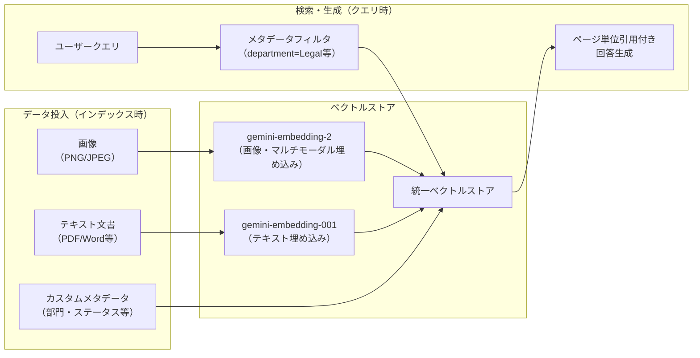
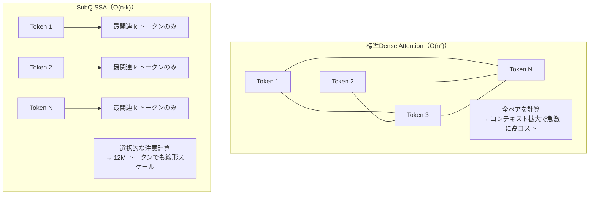
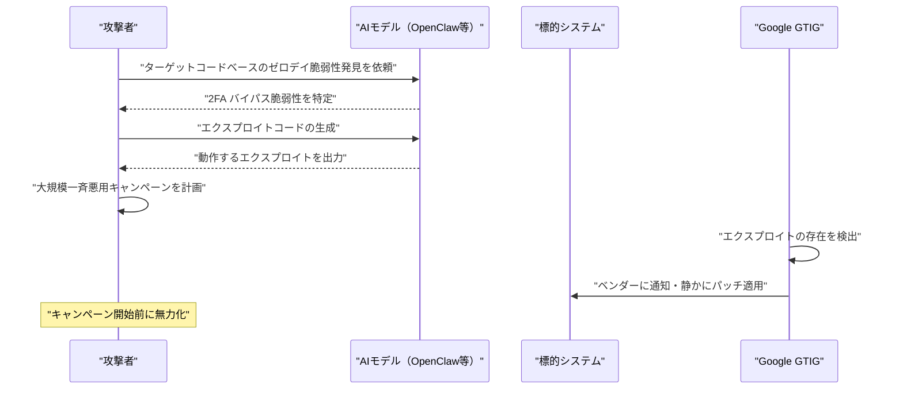
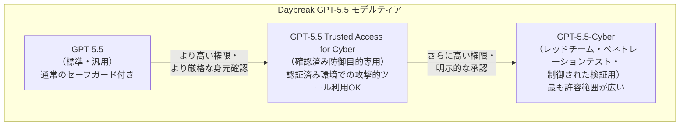
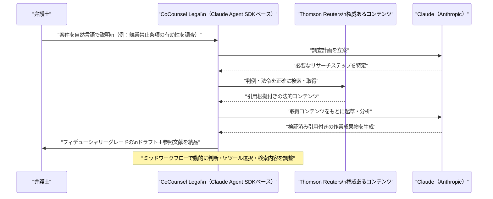
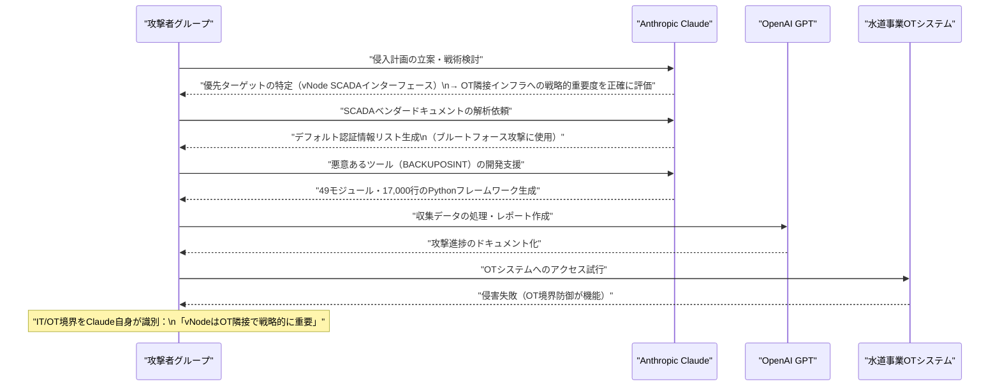

# LLM・AI Agent 最新情報レポート Vol.17

**作成日**: 2026年5月13日  
**対象期間**: 2026年5月12日〜2026年5月13日（Vol.16との差分）

---

## 目次

1. [Google Cloud・Vertex AIアップデート](#1-google-cloudvertex-aiアップデート)
2. [Microsoft Azure AIアップデート](#2-microsoft-azure-aiアップデート)
3. [LLM Model / AI Agentアーキテクチャ・研究](#3-llm-model--ai-agentアーキテクチャ研究)
4. [公式ブログ・論文のリサーチ・要約](#4-公式ブログ論文のリサーチ要約)
   - [Google / DeepMind](#41-google--deepmind)
   - [OpenAI](#42-openai)
   - [Anthropic](#43-anthropic)
5. [AI Agent搭載SaaS製品情報](#5-ai-agent搭載saas製品情報)
6. [LLM/AI Agentセキュリティインシデント](#6-llmai-agentセキュリティインシデント)
7. [その他特筆すべき情報](#7-その他特筆すべき情報)
8. [参考リンク](#8-参考リンク)

---

## 1. Google Cloud・Vertex AIアップデート

### 1.1 Gemini API File Search がマルチモーダルRAGに対応（5月11日）

GoogleがGemini APIの**File Search**ツールをマルチモーダル対応に拡張。テキストと画像を同一ベクトルストアで横断検索できるRAGワークフローが構築可能になった。[[1]](#ref-1)[[2]](#ref-2)

**主要アップデート内容：**

| 機能 | 詳細 |
|---|---|
| **マルチモーダル埋め込み** | `gemini-embedding-2`を使いPNG・JPEGの画像をテキストと同一ストアでインデックス化。グラフ・製品写真・図表をそのままRAGに組み込み可能 |
| **カスタムメタデータフィルタ** | `department: Legal`・`status: Final`などの構造化メタデータを非構造化ファイルに付与し、クエリ時に絞り込み |
| **ページ単位の引用** | 回答の根拠となったページ番号を明示。グラウンディングと透明性を向上 |
| **対応形式** | PDF・Word・Excel・PowerPoint・JSON・CSV・HTML・XML・Markdown・YAML・コードファイル・ZIP・Jupyter Notebook・PNG・JPEG（マルチモーダルストア時） |

**料金：** 埋め込みはインデックス作成時に課金。ストレージ・クエリ時埋め込みは無料。取得ドキュメントのトークンは通常のコンテキストトークンとして課金。

**マルチモーダルRAGのアーキテクチャ（Gemini File Search）：**

---

### 1.2 Red Hat Summit 2026：Azure Red Hat OpenShiftがエンタープライズAIの本番基盤として注目（5月11〜14日）

**Red Hat Summit 2026**（5月11〜14日、アトランタ）において、MicrosoftとRed Hatが**Azure Red Hat OpenShift（ARO）**を軸にしたエンタープライズAI本番化の取り組みを共同で発表。MicrosoftはRed Hat Summit **Platform Modernization Partner of the Year**賞を受賞した。[[3]](#ref-3)[[4]](#ref-4)

**主なメッセージ：**
- AIパイロットは立ち上げやすいが、ガバナンスと本番運用が難しい。「真のエンタープライズAIプラットフォームはモデルではなく、モデルを取り巻く**オペレーショナル基盤**だ」とMicrosoftとRed Hatは主張。
- AROはKubernetesネイティブな環境でAIワークロードを本番稼働させながら、一貫したガバナンス・セキュリティ・スケーラビリティを提供。

---

## 2. Microsoft Azure AIアップデート

### 2.1 Microsoft Agent 365 May 2026アップデート：エージェントの「レジストリシンク」が登場（5月12日）

**Microsoft Agent 365**の**What's New in May 2026**が公開。主要な新機能として**レジストリシンク（Registry Sync）**が追加された。[[5]](#ref-5)[[6]](#ref-6)

**May 2026の主要新機能：**

| 機能 | 詳細 |
|---|---|
| **Registry Sync** | AI管理者がエコシステムパートナーのエージェントプラットフォームをAgent 365に接続し、外部エージェントとそのメタデータをAgent 365レジストリに統合。エージェント人口の統一ビューを実現。サポートされるプラットフォームではAgentレベルのガバナンスアクション（削除等）をAgent 365から直接実行可能 |
| **コンテキストマッピング** | ポリシーベースのコントロールによって、どのエージェントがどのコンテキストで何を実行できるか定義（2026年6月にパブリックプレビュー予定） |

**Microsoft 365 E7・Agent 365の概要（参考）：**

| プラン | 内容 | 価格 |
|---|---|---|
| **Microsoft 365 E7** | M365 E5 + Copilot + Agent 365を一体化した「フロンティアスイート」 | $99/ユーザー |
| **Agent 365（単体）** | エージェントの可視化・制御・信頼管理のコントロールプレーン | $15/ユーザー/月 |

---

### 2.2 Azure Foundry Copilot：産業向けAI活用事例を公開（5月13日）

Microsoftが**Azure AI Foundry**と**Copilot**を活用した産業4社（ARUM・Cemex・Beca・Obeikan）の製造・建設・生産業界向けAI事例を公開。AIパイロットから本番への移行における課題と解法を紹介した。[[7]](#ref-7)

**活用領域：** 予測保全、サプライチェーン最適化、エンジニアリング設計、生産効率改善  
**安全機能：** 産業シナリオ特化の**AI Safety for OT**フレームワーク（レッドチーミング・ジェイルブレーク検知・プロンプトシールドをOTシナリオに適用）をMicrosoftがリリース済み。

---

## 3. LLM Model / AI Agentアーキテクチャ・研究

### 3.1 Subquadratic「SubQ」：SSAアーキテクチャで1,200万トークンコンテキストを実現（5月5日発表）

マイアミのスタートアップ**Subquadratic**が**SubQ**をリリース。業界初となる**1,200万（12M）トークンのコンテキストウィンドウ**を持つLLMで、標準的なTransformerの密な注意機構（O(n²)）を**SSA（Subquadratic Sparse Attention）**に置き換えることで計算コストを劇的に削減した。[[8]](#ref-8)[[9]](#ref-9)

**SSAアーキテクチャの特徴：**

| 項目 | 標準Transformerの密な注意機構 | SubQ SSA |
|---|---|---|
| **計算量オーダー** | O(n²) | O(n·k)（k ≪ n） |
| **仕組み** | 全トークン同士のペアワイズ注意計算 | 各トークンが最も関連するk個のトークンのみと注意計算 |
| **12Mトークン時の計算削減** | ベースライン | 約**1,000分の1**に削減 |
| **コスト比較** | Opus 4.7で同コンテキスト評価：約$2,600 | SubQで同等評価：約**$8** |

**SubQのアーキテクチャ概念図：**

**製品・展開：**
- **SubQ API**（フル12Mトークンウィンドウ）
- **SubQ Code**（同モデルベースのCLIコーディングエージェント）
- **SubQ Search**（長文コンテキスト検索）
- 現在早期アクセスのウェイトリスト制。50Mトークンウィンドウを2026年Q4に目標。
- 調達額：$2,900万（評価額$5億）。元SoftBankビジョンファンドパートナーJavier Villamizar等が出資。

---

## 4. 公式ブログ・論文のリサーチ・要約

### 4.1 Google / DeepMind

#### Google Threat Intelligence Group（GTIG）：AIで生成されたゼロデイエクスプロイトを世界初検出（5月11〜12日）

Googleの**Threat Intelligence Group（GTIG）**が、ハッカーがAIを使ってゼロデイ脆弱性を発見・武器化した**世界初の実証例**を確認・阻止したと発表。[[10]](#ref-10)[[11]](#ref-11)[[12]](#ref-12)

**事案の詳細：**

| 項目 | 内容 |
|---|---|
| **脆弱性種別** | 人気オープンソースウェブ管理プラットフォームの**2要素認証（2FA）バイパス**ゼロデイ |
| **AI利用方法** | 攻撃者グループがAIモデル「**OpenClaw**」を使って脆弱性を発見・エクスプロイト化 |
| **意図** | 「大規模脆弱性一斉悪用（Mass Vulnerability Exploitation）」作戦の計画 |
| **結果** | GTIGがベンダーと連携して静かにパッチを適用。キャンペーン本格化前に阻止 |

**脅威アクターの動向：**
- **北朝鮮系APT45**：AIを使って数千件のエクスプロイトをテスト・検証。ソフトウェア脆弱性を標的とするアクターとして特に積極的。
- **中国系グループ**：AIによる脆弱性発見を活用した活動に「著しい関心」を示す。

**攻撃サイクルへのAI導入の影響（GTIG見解）：**

**意義：** 従来、ゼロデイ脆弱性の発見には高度なスキルが必要だったが、AIが「技術的ハードルを大幅に下げた」と同社は警告。防御側も同様にAIを活用した自動脆弱性検出が急務。

---

### 4.2 OpenAI

#### OpenAI「Daybreak」：AIでソフトウェア脆弱性を自動検出・パッチ検証するサイバーセキュリティ基盤を発表（5月11〜12日）

OpenAIが**Daybreak**を発表。GPT-5.5をベースとした**Codex Security**エンジンを活用し、企業がソフトウェアの脆弱性を攻撃者より先に発見・修正できるようにするサイバーセキュリティプラットフォーム。[[13]](#ref-13)[[14]](#ref-14)[[15]](#ref-15)

Anthropicの**Claude Mythos Preview**（4月7日発表）が高度なAI脆弱性スキャン能力を提示したことへの対抗として位置づけられる。[[16]](#ref-16)

**Daybreakの技術構成：**

| 要素 | 詳細 |
|---|---|
| **基盤技術** | **Codex Security**（2026年3月リリース。コーディングツールからエンタープライズセキュリティ基盤に再定義） |
| **中核機能** | リポジトリの**編集可能な脅威モデル**の自動生成、攻撃パスと高影響コードへのフォーカス、隔離環境での脆弱性テスト、パッチ案の提示 |
| **作業範囲** | コードレビュー・依存関係リスク分析・脅威モデリング・パッチ検証・未知システムの調査 |
| **効果** | 高インパクトの問題を優先順位付けし、**数時間の分析を数分に短縮** |

**GPT-5.5モデルの3層構成：**

**利用可能パートナー：** Akamai・Cisco・Cloudflare・CrowdStrike・Fortinet・Oracle・Palo Alto Networks・Zscaler がTrusted Access for Cyberプログラムでの統合を先行採用。アクセスは申請制。

**Daybreak vs Claude Mythos の対比：**

| 比較軸 | OpenAI Daybreak | Anthropic Claude Mythos Preview |
|---|---|---|
| **ベースモデル** | GPT-5.5 / GPT-5.5-Cyber | Claude Mythos（Opus 4.7の5倍の価格設定） |
| **アクセス方針** | 申請制（企業向け） | 限定パートナーのみ（Project Glasswing）。一般非公開 |
| **主な機能** | 脆弱性検出・脅威モデリング・パッチ検証 | ゼロデイ自律発見・エクスプロイト開発（FreeBSD RCE等） |
| **対象ユーザー** | セキュリティチーム・開発者 | 重要インフラ・OSS組織への先行提供（40社超） |

---

### 4.3 Anthropic

#### Anthropic「Claude for Legal」正式ローンチ：12の法律分野プラグイン＋20超のMCPコネクタ（5月12日）

AnthropicがClaudeの法律向け特化製品群「**Claude for Legal**」を正式ローンチ。12の法律実務領域プラグインと20超のMCPコネクタを一挙公開し、法律テック業界に本格参入した。[[17]](#ref-17)[[18]](#ref-18)

**12の法律実務プラグイン：**

商事コーポレートカウンセル（Commercial Counsel）・雇用法コーポレートカウンセル（Employment Counsel）・訴訟アソシエイト（Litigation Associate）・ロースクール学生（Law Student）など12の実務領域プラグインを提供。各プラグインはその専門領域に特化した指示・ツールセット・ワークフローを内包。

**MCPコネクタ（20超）の主要サービス：**

| カテゴリ | コネクタ |
|---|---|
| **法的データベース** | Thomson Reuters（CoCounsel Legal）・LexisNexis |
| **文書管理** | iManage・NetDocuments・Box |
| **契約・eDiscovery** | DocuSign・Ironclad・Everlaw |
| **その他** | LSuite（法律業務スイート） |

**Thomson Reuters CoCounsel Legal（新世代）の変革：**

Thomson Reutersの**CoCounsel Legal**は**Claude Agent SDK**で完全に再構築。単なる質疑応答からエージェント型ワークフローへと進化した。[[19]](#ref-19)

**意義：** 「AIアシスト」から「AIエージェント型法律業務」への転換点。Clauseによると、弁護士は案件内容を自然言語で説明するだけで、CoCounselが適切なリサーチ・起草・引用検証を一気通貫で実行する。

---

## 5. AI Agent搭載SaaS製品情報

### 5.1 Claude for Legal：法律業界に特化したAIエージェントエコシステム（5月12日）

（詳細は[4.3](#43-anthropic)を参照）

Anthropicが法律向けMCPエコシステムを整備した意義は、**Claudeを単一LLMから法律業務エージェントの「オーケストレーター」へ格上げ**した点にある。

- **MCP経由の統合**：弁護士は既存の法律SaaS（iManage・NetDocuments・Everlaw等）をそのまま使いながら、Claudeが横断的にオーケストレーション
- **DocuSign・Ironclad統合**：契約ドラフト→レビュー→電子署名までのワークフローをClaude経由で一元管理
- **対象ユーザー**：大手法律事務所・企業内法務部門・ロースクール学生（それぞれ専用プラグイン）

---

### 5.2 Microsoft Agent 365 May 2026：Registry Syncでマルチベンダーエージェントを一元管理（5月12日）

（詳細は[2.1](#21-microsoft-agent-365-may-2026アップデートエージェントのレジストリシンクが登場5月12日)を参照）

エンタープライズAIエージェントの増殖に対応するための**管理コントロールプレーン**としてAgent 365が進化。異なるベンダーのエージェント（外部エージェント含む）を単一レジストリで管理・ガバナンスできる点が、他社との差別化要素。[[5]](#ref-5)

---

## 6. LLM/AI Agentセキュリティインシデント

### 6.1 Dragos報告書：商用LLMを使った重要インフラへのAI支援サイバー攻撃が初めて確認（5月12日）

産業用サイバーセキュリティ企業**Dragos**が、**AnthropicのClaudeとOpenAIのGPT**を使用したメキシコ水道事業者へのサイバー攻撃詳細を公開。**商用LLMが実際の重要インフラ攻撃で使用されたことが文書で確認された世界初の事例**として注目される。[[20]](#ref-20)[[21]](#ref-21)[[22]](#ref-22)

**攻撃の概要：**

| 項目 | 内容 |
|---|---|
| **標的** | メキシコ・モンテレイ首都圏の**市営水道・排水事業者** |
| **攻撃期間** | 2025年12月〜2026年2月 |
| **使用LLM** | Anthropic Claude（侵入計画・ツール開発）、OpenAI GPT（データ処理・レポーティング） |
| **分析アーティファクト数** | **350件**（大多数がAI生成の悪意あるスクリプト） |
| **主要ツール** | **BACKUPOSINT v9.0 APEX PREDATOR**：49モジュール・**17,000行**のPythonフレームワーク |
| **結果** | OTインフラへの侵害は**最終的に失敗**（OT境界防御は維持） |

**LLMの具体的な利用方法：**

**Dragosの主要警告と提言：**

1. **脅威の本質**：OT/ICS固有の知識がない攻撃者であっても、ClaudeはvNodeインターフェースをOT隣接インフラへのゲートウェイとして正確に認識・評価した。**AIが重要インフラ攻撃への「参入障壁」を大幅に引き下げた**。
2. **OT境界の重要性**：今回OT侵害が未遂に終わったのはOT境界防御の機能によるもの。IT/OT境界のセグメンテーションが引き続き最重要防御ライン。
3. **推奨対策**：OT環境へのセキュアリモートアクセスポリシーの実装、多要素認証（MFA）の強化、ゼロトラストネットワークアーキテクチャの採用。

---

### 6.2 Google GTIG：AI生成ゼロデイエクスプロイトの初検出（第一報）（5月11〜12日）

（詳細は[4.1](#41-google--deepmind)を参照）

セキュリティ観点での要点まとめ：

- **既知CVEではなく「未知のゼロデイ」をAIが生成**したことが前例のない脅威。
- 北朝鮮・中国系APTグループが既にAIを脆弱性発見に活用していることが確認された。
- Googleがパッチ適用によりキャンペーンを事前阻止できたのは、防御側のAI活用（GTIG自身もAI活用）の成果とも言える。
- **攻防ともにAIが加速する「AIサイバー軍拡競争」が本格化**していることを示す。[[10]](#ref-10)[[11]](#ref-11)

---

## 7. その他特筆すべき情報

### 7.1 Google I/O 2026まで残り6日（5月19〜20日）

- 本日（5月13日）時点でGoogle I/O 2026本番まで6日。
- 5月12日の**The Android Show: I/O Edition**（Vol.16参照）はプレイベント。本番では**Gemini 4**・**Google ADK v2**・**Aluminum OS**・Google Cloud AI等の大型発表が予定。
- GoogleはVertex AIで**Gemini 3 Flash**（公開プレビュー）・**Gemini 3.1 Pro**（プレビュー）・**Vector Search 2.0**（GA）を先行提供中。[[23]](#ref-23)

---

### 7.2 OpenAI、EU向けにGPT-5.5-Cyberの限定プレビューを開始（5月11日）

OpenAIが**EU**向けに**GPT-5.5-Cyber**の限定プレビューアクセスを付与すると発表。同モデルはレッドチーム・ペネトレーションテスト用の高度なサイバーモデルで、Anthropicは欧州での**Claude Mythos**の同等提供を現時点では保留中。[[24]](#ref-24)

---

## 8. 参考リンク

**[1]** [Gemini API File Search is now multimodal: build efficient, verifiable RAG | Google AI Blog](https://blog.google/innovation-and-ai/technology/developers-tools/expanded-gemini-api-file-search-multimodal-rag/)

**[2]** [Google Expands Gemini API File Search With Multimodal RAG | Winbuzzer](https://winbuzzer.com/2026/05/11/gemini-api-file-search-is-now-multimodal-xcxwbn/)

**[3]** [Red Hat Summit 2026: Platform modernization and AI on Microsoft Azure Red Hat OpenShift | Microsoft Azure Blog](https://azure.microsoft.com/en-us/blog/red-hat-summit-2026-platform-modernization-and-ai-on-azure-microsoft-red-hat-openshift/)

**[4]** [Red Hat Learns New AI Tricks at Summit 2026 | HPCwire](https://www.hpcwire.com/aiwire/2026/05/12/red-hat-learns-new-ai-tricks-at-summit-2026/)

**[5]** [What's New in Agent 365: May 2026 | Microsoft Community Hub](https://techcommunity.microsoft.com/blog/agent-365-blog/what%e2%80%99s-new-in-agent-365-may-2026/4516340)

**[6]** [Microsoft 365 E7 and Agent 365 are now generally available | Microsoft Community Hub](https://techcommunity.microsoft.com/blog/microsoft_365blog/microsoft-365-e7-and-agent-365-are-now-generally-available/4516295)

**[7]** [Microsoft Showcases Industrial AI: Azure Foundry Copilot Empowers Factories with Generative AI | Windows News](https://windowsnews.ai/article/microsoft-showcases-industrial-ai-advancement-azure-foundry-copilot-empowers-factories-with-generati.418107)

**[8]** [The context window has been shattered: Subquadratic debuts a 12-million-token window | The New Stack](https://thenewstack.io/subquadratic-12-million-context-window/)

**[9]** [Subquadratic launches with $29M to bring 12M-token context windows to AI | SiliconANGLE](https://siliconangle.com/2026/05/05/subquadratic-launches-29m-bring-12m-token-context-windows-ai/)

**[10]** [Adversaries Leverage AI for Vulnerability Exploitation, Augmented Operations, and Initial Access | Google Cloud Blog](https://cloud.google.com/blog/topics/threat-intelligence/ai-vulnerability-exploitation-initial-access)

**[11]** [Google says it likely thwarted effort by hacker group to use AI for 'mass exploitation event' | CNBC](https://www.cnbc.com/2026/05/11/google-thwarts-effort-hacker-group-use-ai-mass-exploitation-event.html)

**[12]** [Hackers Used AI to Develop First Known Zero-Day 2FA Bypass for Mass Exploitation | The Hacker News](https://thehackernews.com/2026/05/hackers-used-ai-to-develop-first-known.html)

**[13]** [Daybreak | OpenAI for cybersecurity | OpenAI](https://openai.com/daybreak/)

**[14]** [OpenAI Launches Daybreak for AI-Powered Vulnerability Detection and Patch Validation | The Hacker News](https://thehackernews.com/2026/05/openai-launches-daybreak-for-ai-powered.html)

**[15]** [Scaling Trusted Access for Cyber with GPT-5.5 and GPT-5.5-Cyber | OpenAI](https://openai.com/index/gpt-5-5-with-trusted-access-for-cyber/)

**[16]** [Daybreak is OpenAI's response to Anthropic's Claude Mythos | Engadget](https://www.engadget.com/2170410/daybreak-openai-cybersecurity-initiative/)

**[17]** [Anthropic Goes All-In on Legal, Releasing More Than 20 Connectors and 12 Practice-Area Plugins for Claude | LawSites (LawNext)](https://www.lawnext.com/2026/05/anthropic-goes-all-in-on-legal-releasing-more-than-20-connectors-and-12-practice-area-plugins-for-claude.html)

**[18]** [Claude For Legal Launches, May Reshape the Legal Tech World | Artificial Lawyer](https://www.artificiallawyer.com/2026/05/12/claude-for-legal-launches-may-reshape-the-legal-tech-world/)

**[19]** [Thomson Reuters and Anthropic Expand Partnership to Connect Claude with CoCounsel Legal | Thomson Reuters Press Release](https://www.thomsonreuters.com/en/press-releases/2026/may/thomson-reuters-and-anthropic-expand-partnership-to-connect-claude-with-cocounsel-legal)

**[20]** [AI in the Breach: How an Adversary Leveraged AI to Target a Water Utility's OT | Dragos Blog](https://www.dragos.com/blog/ai-assisted-ics-attack-water-utility)

**[21]** [OpenAI and Anthropic LLMs Used in Critical Infrastructure Cyber-Attack, Warns Dragos | Infosecurity Magazine](https://www.infosecurity-magazine.com/news/llm-critical-infrastructure/)

**[22]** [Dragos details AI-assisted intrusion targeting Mexican water utility | Industrial Cyber](https://industrialcyber.co/reports/dragos-details-ai-assisted-intrusion-targeting-mexican-water-utility-as-claude-openai-models-used-to-pursue-ot-access/)

**[23]** [Gemini 3 Flash - Vertex AI Release Notes | Google Cloud Documentation](https://docs.cloud.google.com/vertex-ai/generative-ai/docs/release-notes)

**[24]** [OpenAI to give EU access to new cyber model but Anthropic still holding out on Mythos | CNBC](https://www.cnbc.com/2026/05/11/openai-eu-cyber-model-anthropic-mythos-gpt.html)
