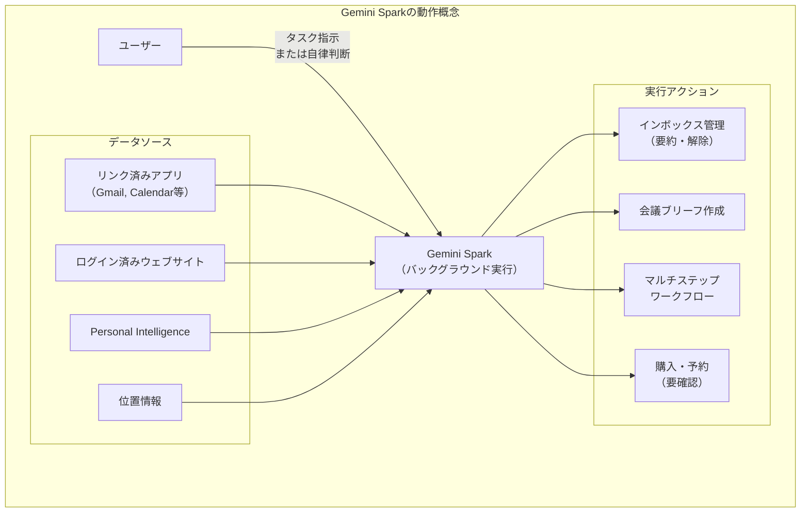
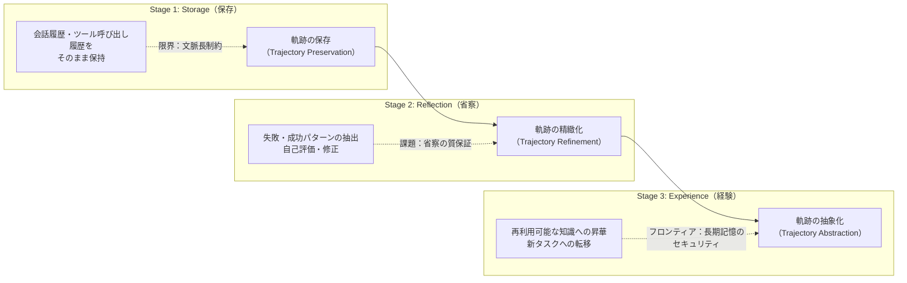
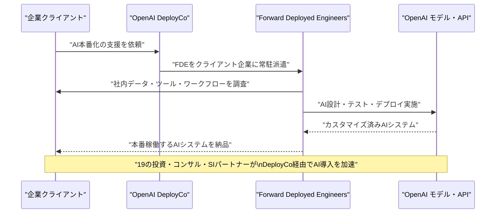
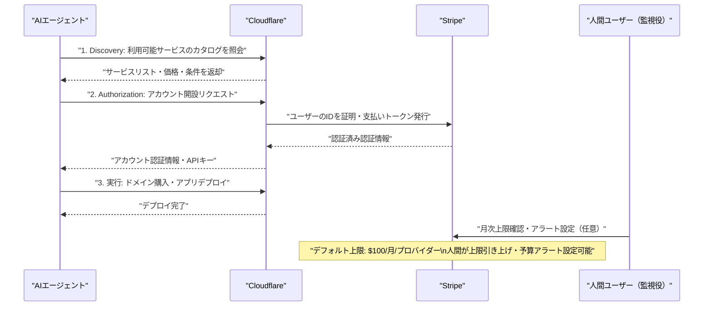
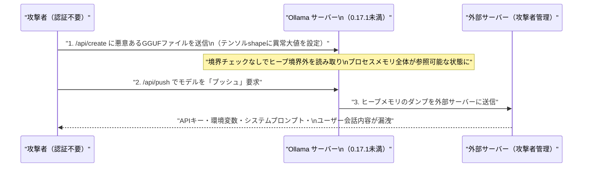

# LLM・AI Agent 最新情報レポート Vol.18

**作成日**: 2026年5月14日  
**対象期間**: 2026年5月13日〜2026年5月14日（Vol.17との差分）

---

## 目次

1. [Google Cloud・Androidアップデート](#1-google-cloudandroidアップデート)
2. [Microsoft Azure AIアップデート](#2-microsoft-azure-aiアップデート)
3. [LLM Model / AI Agentアーキテクチャ・研究](#3-llm-model--ai-agentアーキテクチャ研究)
4. [公式ブログ・論文のリサーチ・要約](#4-公式ブログ論文のリサーチ要約)
   - [Google / Android](#41-google--android)
   - [OpenAI](#42-openai)
   - [Anthropic](#43-anthropic)
5. [AI Agent搭載SaaS製品情報](#5-ai-agent搭載saas製品情報)
6. [LLM/AI Agentセキュリティインシデント](#6-llmai-agentセキュリティインシデント)
7. [その他特筆すべき情報](#7-その他特筆すべき情報)
8. [参考リンク](#8-参考リンク)

---

## 1. Google Cloud・Androidアップデート

### 1.1 Gemini Spark：Google I/O前にリーク—日常業務を自律実行するAIエージェント（5月14日）

Googleが近日中に提供予定の新AIエージェント「**Gemini Spark**」が、Geminiアプリのベータ版（v17.23）への参照実装のリークにより5月14日に詳細が明らかになった。Google I/O 2026（5月19〜20日）のメイン発表となる見込み。[[1]](#ref-1)[[2]](#ref-2)

**Gemini Sparkの主要機能：**

| 機能カテゴリ | 詳細 |
|---|---|
| **バックグラウンド自律実行** | ユーザーの手動操作を待たず、バックグラウンドで継続的に稼働しタスクを先読み・自律実行 |
| **インボックス管理** | ニュースレターの要約・アーカイブ・購読解除を自動化 |
| **会議前ブリーフ** | 重要会議の前に関連情報を自動収集・要約して提示 |
| **マルチアプリ操作** | リンク済みのGoogleアプリ・サードパーティサービスを横断してワークフローを完結 |
| **データ参照元** | リンク済みアプリ、チャット履歴、スケジュール済みタスク、ログイン済みウェブサイト、位置情報、Personal Intelligence |

**UIデザイン：** 「Chat」と「Agent」の2タブ構成。Agentタブではアクティブタスクとスケジュール実行タスクの一覧を確認・管理可能。

**注意事項（Googleの公式警告）：**
> 「Gemini Sparkは実験的です。機密情報を第三者に共有したり、確認なしに購入を行う場合があります。」

---

### 1.2 Gemini Intelligence：AndroidをOSから「インテリジェンスシステム」へ転換（5月12〜14日）

Googleが「**Gemini Intelligence**」を正式ブランド化。The Android Show: I/O Edition 2026（5月12日）で発表され、5月14日にさらなる詳報が公開された。AndroidをOSではなく「インテリジェンスシステム」として再定義する戦略的転換として位置付けられている。[[3]](#ref-3)[[4]](#ref-4)[[5]](#ref-5)

**主要機能（初期展開）：**

| 機能 | 概要 |
|---|---|
| **Chrome Auto Browse** | Geminiがブラウザを操作してフォーム入力・検索を代行 |
| **AI生成ウィジェット** | 自然言語でウィジェットをその場で生成（"Create My Widget"） |
| **Gboard Rambler** | 音声入力の文章を自動で整形・校正 |
| **Android Auto連携** | メール・カレンダー・メッセージのコンテキストを車内で活用 |
| **Magic Pointer** | Googlebook向けの高精度AIポインター |

**展開ロードマップ：**
- **夏2026**：Samsung Galaxy最新機種・Google Pixel端末に先行提供
- **2026年後半**：スマートウォッチ・Android Auto・スマートグラス・Chromebookへ拡大
- **秋2026**：初代**Googlebook**（Android＋Gemini搭載ノートPC）発売予定

---

### 1.3 Vertex AI：Lyria 3 音楽生成モデルがパブリックプレビュー

GoogleがVertex AI上で音楽生成モデル**Lyria 3**をパブリックプレビューとして提供開始。[[6]](#ref-6)

| モデル | 生成時間 | 用途 |
|---|---|---|
| `lyria-3-pro-preview` | 最大184秒 | 高品質な楽曲生成 |
| `lyria-3-clip-preview` | 最大30秒 | 短尺クリップ生成 |

**Gemini 2.5モデル群の提供期間延長：** Gemini 2.5 Pro・Flash・Flash-Liteのサポート終了日が**2026年10月16日**に延長された。

---

## 2. Microsoft Azure AIアップデート

### 2.1 DeepSeek V4 Flash・V4 Pro：Microsoft Foundryで提供開始（5月1日）

**DeepSeek V4 Flash**および**DeepSeek V4 Pro**がMicrosoft Foundryで利用可能になった。[[7]](#ref-7)[[8]](#ref-8)

| モデル | 最適用途 | 特長 |
|---|---|---|
| **DeepSeek V4 Flash** | 低レイテンシ・コスト効率 | リアルタイム推論向けに設計 |
| **DeepSeek V4 Pro** | 複雑な推論・高スループット | 高精度なタスク処理 |

**意義：** MicrosoftがOpenAIモデル群以外の主要LLMをFoundryに積極的に統合し、エンタープライズユーザーへのモデル選択肢を拡充。DeepSeekの高性能・低コスト特性がエンタープライズ採用を後押しする見込み。

---

## 3. LLM Model / AI Agentアーキテクチャ・研究

### 3.1 arXiv新論文：LLMエージェントのメモリ機構の進化に関するサーベイ（5月7日）

「**From Storage to Experience: A Survey on the Evolution of LLM Agent Memory Mechanisms**」（arXiv: 2605.06716）が公開された。[[9]](#ref-9)

LLMエージェントのメモリ機構を「保存（Storage）→省察（Reflection）→経験（Experience）」の3段階進化フレームワークで体系化。

**3段階フレームワーク：**

**主な知見：**
- 現在の研究焦点は「LLMが訓練データを漏洩するか」から「永続的メモリを持つエージェントがセッション横断で毒化・不正アクセス・伝播されるか」へシフト
- 組織共有ステートにおけるメモリの「Mnemonic Sovereignty（記憶主権）」が新たなセキュリティ概念として浮上

---

### 3.2 産業向けLLM活用のアーキテクチャ論文（arXiv: 2505.16120）

「**LLM-Powered AI Agent Systems and Their Applications in Industry**」が産業向けLLMエージェントシステムの包括的レビューを提供。[[10]](#ref-10)

**主要な知見：**
- タスクが長期化・複雑化するにつれて、実行信頼性を左右するのは**モデルの能力よりもエージェント実行ハーネス（infrastructure layer）**
- 現代的なエージェントハーネスの5層構成：
  1. **LLM推論コア**（Central LLM Reasoning Core）
  2. **ゲートウェイ・セッション層**（Gateway & Session Layer）
  3. **コンテキスト管理・メモリ層**（Context Management & Memory Layer）
  4. **指示・ツール層**（Instructions & Tools Layer）
  5. **トリガー・出力層**（Triggers & Outputs Layer）

---

## 4. 公式ブログ・論文のリサーチ・要約

### 4.1 Google / Android

#### Gemini Intelligence公式ブログ：「よりスマートで能動的なAndroid」（5月12〜14日）

（詳細は[1.2](#12-gemini-intelligenceandroidをosからインテリジェンスシステムへ転換5月12〜14日)を参照）

Googleの公式ブログ「A smarter, more proactive Android with Gemini Intelligence」でGemini IntelligenceをOSレベルの機能として正式に位置付け、「AndroidはOSではなくインテリジェンスシステムへ移行する」というビジョンを明示した。[[3]](#ref-3)

---

### 4.2 OpenAI

#### OpenAI DeployCo（OpenAI Deployment Company）正式ローンチ（5月11〜12日）

OpenAIが**OpenAI Deployment Company（DeployCo）**を正式に立ち上げ。19の大手投資・コンサル・SIファームと提携し、エンタープライズのAI本番化を支援する専門会社を設立した。[[11]](#ref-11)[[12]](#ref-12)[[13]](#ref-13)

**概要：**

| 項目 | 内容 |
|---|---|
| **初期投資額** | **$40億**（OpenAI負担） |
| **共同創業パートナー** | TPG（主幹）、Advent、Bain Capital、Brookfield |
| **コンサル・SI参加企業** | Bain & Company、Capgemini、McKinsey & Company 他 |
| **金融パートナー** | BBVA 他 |
| **主要サービス** | 企業内への**Forward Deployed Engineers（FDEs）**派遣、AI設計・テスト・デプロイ |
| **買収企業** | **Tomoro**（応用AIコンサル・エンジニアリング会社）〜150名のFDE・スペシャリストを獲得 |
| **バリュエーション** | **$140億** |

**Anthropicとの対比：** Anthropicも同月初旬に複数のウォールストリート金融サービス企業と共同でAIツールの販売・導入会社を設立しており、OpenAIはこれに追随する形となった。

---

### 4.3 Anthropic

#### Anthropic：評価額最大$9,500億での$300〜500億規模の資金調達が進行中（5月12〜13日）

AnthropicがOpenAIの現在の評価額を初めて上回る可能性のある大型資金調達ラウンドを協議中であることが明らかになった。[[14]](#ref-14)[[15]](#ref-15)[[16]](#ref-16)

**資金調達ラウンドの概要：**

| 項目 | 内容 |
|---|---|
| **調達規模** | $300〜500億（交渉中） |
| **評価額（ポストマネー）** | **$8,500〜$9,500億**（最大$9,500億の場合、OpenAIを超える） |
| **前回ラウンド** | 2026年2月に$380億評価額でのSeries G（$300億調達） |
| **年間収益ランレート** | **$400億**（$300億超を最近突破、急速成長中） |
| **主要既存投資家** | Google（最大$400億コミット）、Amazon（最大$250億コミット） |
| **取締役会決定時期** | 2026年5月中を予定 |
| **IPO可能性** | 早ければ2026年10月 |

**業界的意義：** 評価額$9,500億はSamsung・Alibaba・TSMC等の時価総額を上回る規模。AIスタートアップとして前例のない評価額に達する可能性がある。

---

## 5. AI Agent搭載SaaS製品情報

### 5.1 Cloudflare × Stripe：AIエージェントが人間不要でクラウドアカウントを開設・ドメイン購入・デプロイ（4月30日）

CloudflareとStripeが共同設計した新プロトコルにより、AIエージェントが人間の手を借りずに**Cloudflareアカウント開設・ドメイン購入・アプリケーションのデプロイ**を完了できるようになった。[[17]](#ref-17)[[18]](#ref-18)

**プロトコルの3ステップ：**

**技術仕様：** OAuth・OpenID Connect（OIDC）・支払いトークン化標準を統合。エージェントは「クラウドインフラを管理・支払いできるエンティティ」として認識される。

**統合パートナー：** PlanetScaleも統合パートナーとして参加。Stripeに登録済みの開発者であれば誰でも利用可能。

**業界への影響：** Salesforceも同時期に「ヘッドレスアーキテクチャ」を発表し、AIエージェントが従来のUIを介さずAPI経由でデータ・ワークフロー・タスクに直接アクセスできる設計に移行している。

---

### 5.2 OpenAI DeployCo：エンタープライズAI導入の専門SaaS事業体として本格稼働

（詳細は[4.2](#42-openai)を参照）

DeployCo は単なるコンサルではなく、OpenAIモデルを中核に据えた「**Enterprise AI-as-a-Service**」事業体として機能。Capgemini・McKinseyなど既存のSI・コンサル大手が参画することで、既存エンタープライズのAI移行の主要ルートを押さえる狙いがある。[[11]](#ref-11)

---

## 6. LLM/AI Agentセキュリティインシデント

### 6.1 「Bleeding Llama」（CVE-2026-7482）：Ollamaの重大脆弱性が世界30万超のサーバーを危険に晒す

Cyeraの研究チームが、Ollamaに存在するヒープ領域の境界外読み取り脆弱性（CVE-2026-7482）を公開。認証不要で攻撃可能な**CVSS 9.1（Critical）**の深刻な脆弱性で、世界中の約30万台のサーバーが影響を受ける可能性がある。[[19]](#ref-19)[[20]](#ref-20)[[21]](#ref-21)

**技術的詳細：**

| 項目 | 内容 |
|---|---|
| **CVE番号** | CVE-2026-7482 |
| **通称** | Bleeding Llama |
| **CVSS スコア** | **9.1（Critical）** |
| **脆弱性の種類** | ヒープ領域の境界外読み取り（Heap Out-of-Bounds Read） |
| **根本原因** | GGUFファイル処理ロジックで、テンソルのオフセット・サイズが実際のファイル長を超えても検証されない |
| **影響バージョン** | Ollama **0.17.1未満**のすべて |
| **修正バージョン** | **0.17.1以上**で修正済み |
| **推定影響範囲** | インターネット公開サーバー約**30万台** |

**攻撃の手順（3 APIコール）：**

**漏洩する可能性のある情報：**
- APIキー・環境変数
- システムプロンプト（プロプライエタリなプロンプト設計）
- ユーザーとの会話内容
- その他プロセスメモリ上のデータ

**リスク要因：** Ollamaはデフォルトでlocalhostにバインドするが、多くのデプロイでは`0.0.0.0`バインドやリバースプロキシ経由で外部公開されており、追加認証なしに攻撃可能となる。

**対応策：** 直ちに**Ollama 0.17.1以上**へアップデート。外部公開している場合はファイアウォールルールの見直しと認証レイヤーの追加が推奨。

---

### 6.2 大規模AIインフラのセキュリティ実態調査：100万サービスをスキャンして判明した惨状

研究チームが証明書透明性ログを活用して200万ホストから100万のAI公開サービスをスキャンし、現状のAIインフラのセキュリティ実態を報告。[[22]](#ref-22)

**調査結果の要点：**
- AIインフラは過去に調査したいかなるソフトウェアカテゴリよりも「**より脆弱で、より露出していて、より設定ミスが多い**」
- 2026年1月末時点で、Pilllar Securityが記録した全攻撃トラフィックの**60%がMCPエンドポイントの偵察（Reconnaissance）に集中**。攻撃者が内部インフラへの侵入経路を積極的にマッピングしている
- 「ClawdBot」フィアスコ（自己ホスト型AIアシスタント）が1日平均**2.6件のCVE**を出し続けている事態も報告

**MCP（Model Context Protocol）への攻撃急増：**

2026年前半にかけてMCPエンドポイントへの偵察トラフィックが急増している背景には、MCPが認証なしで公開されているケースが多く、内部ツール・データベース・APIへの「橋渡し」として攻撃者にとって魅力的であることがある。

---

## 7. その他特筆すべき情報

### 7.1 Google I/O 2026まで残り5日（5月19〜20日）

本日（5月14日）時点でGoogle I/O 2026本番まで5日。

- **Gemini Spark**（本日リーク）をはじめ、**Gemini 4**・**Google ADK v2**・**Gemini Omni**・**Googlebook**正式発表が期待される
- 5月12日のAndroid Showはプレイベント。本番I/Oキーノートでより詳細な技術仕様と提供時期が発表される見込み

**主な期待発表：**

| 発表カテゴリ | 詳細 |
|---|---|
| **Gemini 4** | 次世代フラッグシップモデル。マルチモーダル推論能力の大幅強化が示唆 |
| **Gemini Omni** | 統合型マルチモーダルモデル（事前リーク多数） |
| **Gemini Spark** | 日常AIエージェント（本日リーク。I/Oで正式発表予定） |
| **Google ADK v2** | Agent Development Kitのメジャーアップデート |
| **Googlebook** | Android＋Gemini搭載のAIファーストノートPC。秋発売予定 |

---

### 7.2 Anthropic：エンタープライズAI採用でOpenAIを初めて逆転

VentureBeatのレポートによると、AnthropicがエンタープライズAI採用においてOpenAIを初めて上回ったという調査結果が公開された。[[23]](#ref-23)

**ただし3つのリスク要因も指摘：**
1. OpenAI DeployCo発足による大手SIとの関係構築でOpenAIが逆転する可能性
2. Googleが$400億の投資コミットを持つ既存投資家であり、Gemini推進に利害関係を持つ
3. オープンウェイトモデル（Meta Llama等）のエンタープライズ採用増加

---

## 8. 参考リンク

**[1]** ['Gemini Spark' is Google's upcoming AI agent in the Gemini app | 9to5Google](https://9to5google.com/2026/05/14/gemini-spark-insight/)

**[2]** [Google prepares Gemini Spark AI Agent ahead of I/O launch | Testing Catalog](https://www.testingcatalog.com/google-prepares-gemini-spark-ai-agent-ahead-of-i-o-launch/)

**[3]** [A smarter, more proactive Android with Gemini Intelligence | Google Blog](https://blog.google/products-and-platforms/platforms/android/gemini-intelligence/)

**[4]** [The Android Show: I/O Edition 2026 | Google Blog](https://blog.google/products-and-platforms/platforms/android/android-show-io-edition-2026/)

**[5]** [Google Rolls Android AI Into Gemini Intelligence Push | Winbuzzer](https://winbuzzer.com/2026/05/14/google-rolls-android-ai-into-gemini-intelligence-push-xcxwbn/)

**[6]** [Vertex AI release notes | Generative AI on Vertex AI | Google Cloud Documentation](https://docs.cloud.google.com/vertex-ai/generative-ai/docs/release-notes)

**[7]** [Azure May 2026: 7 Game-Changing Updates | HubSite365](https://www.hubsite365.com/en-ww/crm-pages/azure-update-1st-may-2026.htm)

**[8]** [Azure Update 8th May 2026 | HubSite365](https://www.hubsite365.com/en-ww/crm-pages/azure-update-8th-may-2026-a0cd0da1-3daf-402d-9a73-e61df7bdcda2.htm)

**[9]** [From Storage to Experience: A Survey on the Evolution of LLM Agent Memory Mechanisms | arXiv:2605.06716](https://arxiv.org/abs/2605.06716)

**[10]** [LLM-Powered AI Agent Systems and Their Applications in Industry | arXiv:2505.16120](https://arxiv.org/html/2505.16120v2)

**[11]** [OpenAI launches the OpenAI Deployment Company to help businesses build around intelligence | OpenAI](https://openai.com/index/openai-launches-the-deployment-company/)

**[12]** [OpenAI Launches DeployCo, a $4B-Backed AI Consulting Powerhouse | eWeek](https://www.eweek.com/news/openai-deployco-enterprise-ai-consulting/)

**[13]** [Capgemini strengthens its position in enterprise AI with investment in the OpenAI Deployment Company | Capgemini](https://www.capgemini.com/news/press-releases/capgemini-strengthens-its-position-in-enterprise-ai-with-investment-in-the-openai-deployment-company/)

**[14]** [Anthropic in talks for funding at a valuation as high as $950 billion | Sherwood News](https://sherwood.news/tech/anthropic-in-talks-for-funding-at-a-valuation-as-high-as-950-billion-which-would-make-it-bigger-than-openai/)

**[15]** [Anthropic In Talks to Raise $30 Billion at $900 Billion Valuation | Bloomberg](https://www.bloomberg.com/news/articles/2026-05-12/anthropic-in-talks-to-raise-30-billion-at-900-billion-valuation)

**[16]** [Anthropic's new funding round sees valuation approaching $1tn | Music Ally](https://musically.com/2026/05/13/anthropics-new-funding-round-sees-valuation-approaching-1tn/)

**[17]** [Agents can now create Cloudflare accounts, buy domains, and deploy | Cloudflare Blog](https://blog.cloudflare.com/agents-stripe-projects/)

**[18]** [Stripe and Cloudflare Launch Open Protocol for AI Agent Self-Service Deployment | KuCoin](https://www.kucoin.com/news/flash/stripe-and-cloudflare-launch-open-protocol-for-ai-agent-self-service-deployment)

**[19]** [Bleeding Llama: Critical Unauthenticated Memory Leak in Ollama | Cyera Research](https://www.cyera.com/research/bleeding-llama-critical-unauthenticated-memory-leak-in-ollama)

**[20]** [Critical Bug Could Expose 300,000 Ollama Deployments to Information Theft | SecurityWeek](https://www.securityweek.com/critical-bug-could-expose-300000-ollama-deployments-to-information-theft/)

**[21]** [Ollama Out-of-Bounds Read Vulnerability Allows Remote Process Memory Leak | The Hacker News](https://thehackernews.com/2026/05/ollama-out-of-bounds-read-vulnerability.html)

**[22]** [We Scanned 1 Million Exposed AI Services. Here's How Bad the Security Actually Is | The Hacker News](https://thehackernews.com/2026/05/we-scanned-1-million-exposed-ai.html)

**[23]** [Anthropic finally beat OpenAI in business AI adoption — but 3 big threats could erase its lead | VentureBeat](https://venturebeat.com/technology/anthropic-finally-beat-openai-in-business-ai-adoption-but-3-big-threats-could-erase-its-lead)
