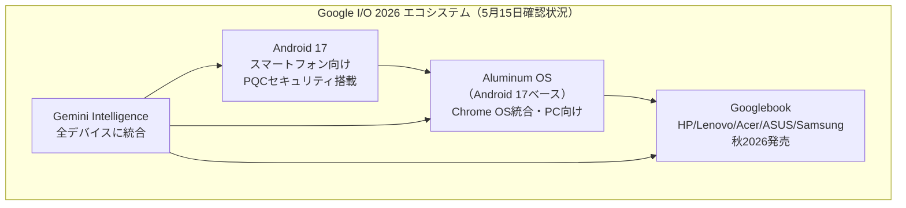
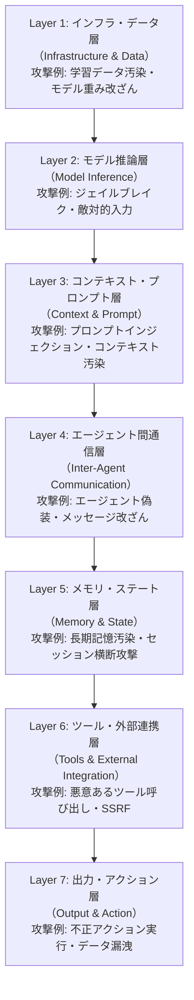
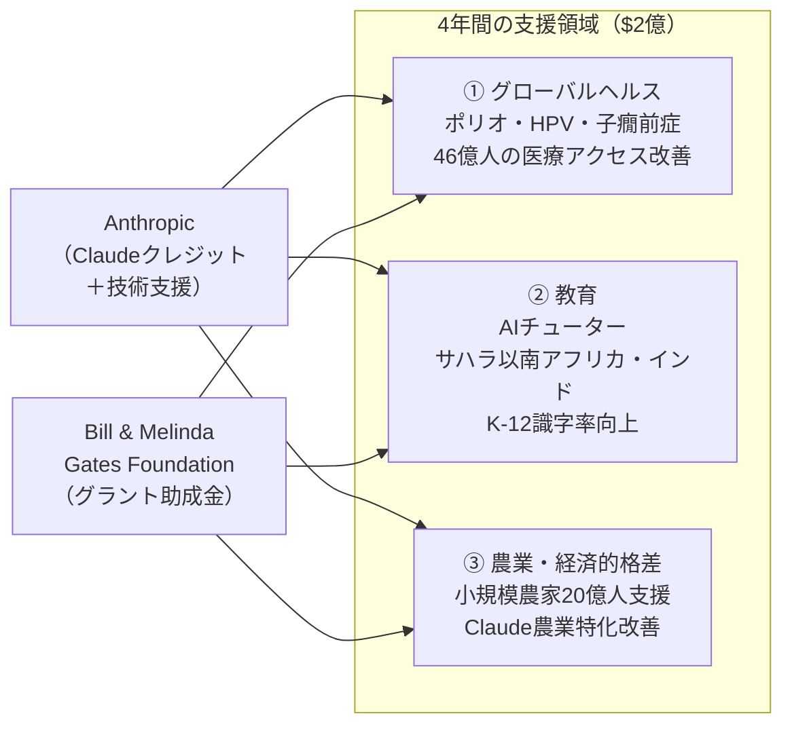
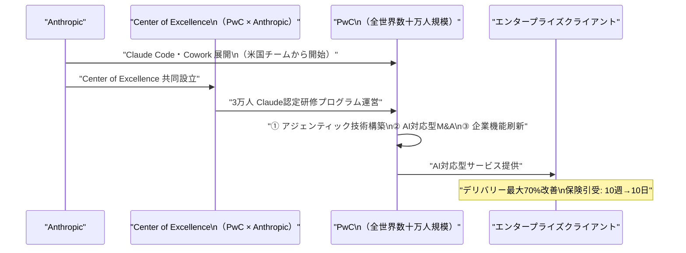
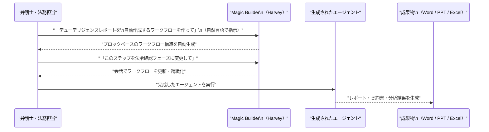

# LLM・AI Agent 最新情報レポート Vol.19

**作成日**: 2026年5月15日  
**対象期間**: 2026年5月14日〜2026年5月15日（Vol.18との差分）

---

## 目次

1. [Google Cloud・Androidアップデート](#1-google-cloudandroidアップデート)
2. [Microsoft Azure AIアップデート](#2-microsoft-azure-aiアップデート)
3. [LLM Model / AI Agentアーキテクチャ・研究](#3-llm-model--ai-agentアーキテクチャ研究)
4. [公式ブログ・論文のリサーチ・要約](#4-公式ブログ論文のリサーチ要約)
   - [Google / Android](#41-google--android)
   - [OpenAI](#42-openai)
   - [Anthropic](#43-anthropic)
5. [AI Agent搭載SaaS製品情報](#5-ai-agent搭載saas製品情報)
6. [LLM/AI Agentセキュリティインシデント](#6-llmai-agentセキュリティインシデント)
7. [その他特筆すべき情報](#7-その他特筆すべき情報)
8. [参考リンク](#8-参考リンク)

---

## 1. Google Cloud・Androidアップデート

### 1.1 Google I/O 2026 直前詳報：Aluminum OS正式確定・Googlebook全パートナー公開（5月14〜15日）

Google I/O 2026（5月19〜20日）を4日後に控え、5月14〜15日にかけてAndroid Show（5月12日）で発表された内容の補足情報が続々と確認されている。特に**Aluminum OS**（旧称: Aluminium OS）と**Googlebook**の詳細が公式確認された。[[1]](#ref-1)[[2]](#ref-2)[[3]](#ref-3)

#### Aluminum OS：ChromeOSを統合したデスクトップOSが2026年中にリリース

| 項目 | 詳細 |
|---|---|
| **ベース** | Android 17 |
| **位置付け** | ChromeOS＋Androidを統合した新デスクトップOS |
| **UI** | カスタムウィンドウマネージャー・タスクバー・仮想デスクトップを完全新設計 |
| **AI統合** | GeminiをOSの全レイヤーに組み込み |
| **競合** | Windows・macOSに直接対抗するポジショニング |
| **リリース予定** | Q2〜Q3 2026 |

**ハードウェアパートナー一覧（確認済み）：**

| メーカー | 展開レンジ |
|---|---|
| **HP** | エントリー〜プレミアム（全レンジ） |
| **Lenovo** | プレミアム |
| **Acer** | エントリー〜ミドル |
| **ASUS** | ミドル |
| **Samsung** | プレミアム（MacBook競合モデルを含む） |

#### Android 17 新確認機能（5月14〜15日時点）

- **量子耐性セキュリティ（PQC）**：量子コンピュータ攻撃への耐性機能を標準搭載
- アプリバブル機能
- Wi-Fi・モバイルデータの独立したクイック設定タイル
- Find Hub 新機能

---

## 2. Microsoft Azure AIアップデート

新情報なし（2026年5月14〜15日時点で、Vol.18以降の新たなAzure AI発表は確認されず）

---

## 3. LLM Model / AI Agentアーキテクチャ・研究

### 3.1 エージェンティックAIの7層セキュリティ攻撃面モデル（arXiv: 2604.23338）

「**A Systematic Survey of Security Threats and Defenses in LLM-Based AI Agents: A Layered Attack Surface Framework**」（arXiv: 2604.23338）が、エージェントAIのセキュリティ脅威を構造化する**7層攻撃面モデル（Layered Attack Surface Model）**を提案。[[4]](#ref-4)

**論文の中心主張：** ステートレスなLLMと異なり、エージェントAIは「永続メモリ・外部ツール呼び出し・エージェント間協調・セッション横断動作」を持つため、質的に異なるセキュリティ攻撃面が生じる。

**7層攻撃面モデル：**

**各レイヤーの防御策概要：**

| レイヤー | 主要な脅威 | 防御アプローチ |
|---|---|---|
| L1 インフラ | 学習データ汚染 | データサプライチェーン検証、モデルウォーターマーク |
| L2 推論 | ジェイルブレイク | アライメント強化、出力フィルタリング |
| L3 プロンプト | プロンプトインジェクション | 入力サニタイズ、コンテキスト分離 |
| L4 通信 | エージェント偽装 | 認証プロトコル、メッセージ署名 |
| L5 メモリ | 長期記憶汚染 | メモリ整合性チェック、アクセス制御 |
| L6 ツール | 悪意あるAPI呼び出し | ツール呼び出しサンドボックス、許可リスト |
| L7 出力 | 不正アクション | 人間承認フロー、アクション監査ログ |

---

## 4. 公式ブログ・論文のリサーチ・要約

### 4.1 Google / Android

新情報なし（5月19日のI/Oキーノートを待機中）

---

### 4.2 OpenAI

新情報なし（2026年5月14〜15日時点）

---

### 4.3 Anthropic

#### Anthropic × Bill & Melinda Gates Foundation：グローバルヘルス・教育向け$2億パートナーシップ締結（5月14日）

AnthropicとBill & Melinda Gates Foundationが、グローバルヘルス・生命科学・教育・経済的格差解消を目的とした**$2億・4年間のパートナーシップ**を5月14日に正式発表。グラント助成金・Claudeクレジット・技術サポートを組み合わせた包括的な支援体制を提供する。[[5]](#ref-5)[[6]](#ref-6)[[7]](#ref-7)

**パートナーシップの概要：**

| 項目 | 内容 |
|---|---|
| **総額** | **$2億**（グラント＋Claudeクレジット＋技術支援） |
| **期間** | 4年間 |
| **目標** | 「市場原理だけでは届かない領域へのAIの恩恵を拡大」 |

**主要フォーカス領域：**

**① グローバルヘルス（最大投資）**
- 46億人が必須医療サービスにアクセスできない低・中所得国での医療改善
- ポリオ・HPV・子癇前症（eclampsia/preeclampsia）など見落とされがちな疾患の研究加速
- 新ワクチン・治療薬の開発支援

**② 教育**
- K-12生徒向けエビデンスベースのAIチューターリング
- サハラ以南アフリカ・インドでの基礎識字率・算数向上プログラム
- 就労移行期の学生へのキャリアガイダンス

**③ 農業・経済的格差解消**
- 約20億人の収入を支える小規模農家の農業生産性向上
- Claudeへの農業特化改善の実装

**業界的意義：** AnthropicとしてはこれまでのB2B・エンタープライズ中心の事業モデルを超え、国際開発・公衆衛生領域へのアクセスを確立する戦略的転換点と位置付けられる。

---

#### PwC × Anthropic：アライアンス拡大、3万人Claude認定研修＆Center of Excellence設立（5月14日）

PwCとAnthropicが戦略的アライアンスを大幅拡大し、**3万人のPwCプロフェッショナルをClaude認定研修**する計画と共同Center of Excellenceの設立を発表。[[8]](#ref-8)[[9]](#ref-9)

**展開の全体像：**

| 項目 | 内容 |
|---|---|
| **認定研修対象** | **3万人**のPwCプロフェッショナル |
| **展開ツール** | Claude Code・Claude Cowork（米国チームから開始→グローバル展開） |
| **共同設立** | Claude活用の**Center of Excellence** |
| **3大フォーカス** | ① アジェンティック技術構築、② AI対応型M&A、③ 企業機能の刷新 |

**既存導入での計測済み成果：**
- 案件デリバリー改善率：最大**70%向上**
- 保険引受サイクル：**10週間 → 10日間**に短縮（採算が取れなかった事業ラインが成立）

**業界的意義：** OpenAI DeployCo（Vol.18参照、19の大手SI・コンサル参画）に対抗する形で、AnthropicがPwC（世界最大級のコンサルの一つ）との深化した二者間パートナーシップを強化。「エンタープライズAI導入のメインルート」を両社が競って確立しようとしている構図が明確になった。

---

## 5. AI Agent搭載SaaS製品情報

### 5.1 Anthropic：Claude for Small Business 正式ローンチ＆全国ツアー開始（5月13〜14日）

AnthropicがSMB（中小企業）向けAIパッケージ**「Claude for Small Business」**を5月13日に正式ローンチ。5月14日からシカゴを皮切りに全国ツアーを開始した。[[10]](#ref-10)[[11]](#ref-11)

**製品概要：**

| 項目 | 内容 |
|---|---|
| **提供形態** | Claude Cowork（デスクトップ自動化プラットフォーム）内のトグルで有効化 |
| **対象** | 大企業ではなく地域の小売・飲食・サービス業等のSMB |
| **主要統合** | QuickBooks、PayPal、HubSpot、Canva、DocuSign、Google Workspace、Microsoft 365 |
| **コンテンツ** | 業務別コネクタ＋アジェンティックワークフロー＋再利用可能な「スキル」のパッケージ |

**全国ツアー（無料）：**
- 1日半のAIリテラシー研修＋ハンズオンワークショップ
- 各都市100名の中小企業経営者を対象
- 5月14日シカゴ開始→全国順次展開

---

### 5.2 Harvey AI：Magic Builder（自然言語ワークフロービルダー）が一般提供へ（5月2026年）

法律AI SaaSの**Harvey**（評価額$110億）が2026年5月、エージェントプラットフォームを大幅アップデート。「**Build with Harvey（Magic Builder）**」により、自然言語での指示だけでワークフローエージェントを構築できるようになった。[[12]](#ref-12)[[13]](#ref-13)

**アップデート概要：**

| 機能 | 詳細 |
|---|---|
| **500+法律エージェント** | 弁護士が構築した全主要プラクティスエリア対応エージェント群 |
| **Magic Builder** | 自然言語の説明からブロックベースのエージェント構造を自動生成 |
| **会話型改善** | 生成後も継続会話でワークフローを段階的に最適化 |
| **成果物対応** | Word・PowerPoint・Excel形式での最終成果物を自動生成 |
| **Agent Builder** | 2026年5月5日よりEarly Accessで提供開始、順次一般展開中 |

**市場背景：** Harveyは2026年3月に$2億・評価額$110億の調達ラウンドを完了（Sequoia Capital・GIC共同主導）。「弁護士が作った法律エージェント500本以上」を搭載することで、法律業務のバーティカルAI覇権を確立する戦略を加速している。

---

## 6. LLM/AI Agentセキュリティインシデント

新情報なし（2026年5月14〜15日時点で、Vol.18以降の新たな重大インシデントは確認されず）

---

## 7. その他特筆すべき情報

### 7.1 Google I/O 2026 カウントダウン（5月15日時点：あと4日）

本日5月15日時点でGoogle I/O 2026（5月19〜20日）まであと4日。5月14〜15日に確認された期待発表の最新整理：

| 発表カテゴリ | 確認状況 | 詳細 |
|---|---|---|
| **Gemini 4** | 期待（未確認） | 次世代フラッグシップモデル。マルチモーダル推論の大幅強化が示唆 |
| **Gemini Omni** | リーク多数 | テキスト・画像・動画生成を単一パイプラインで統合 |
| **Gemini Spark** | リーク済み（5/14） | バックグラウンド自律実行エージェント（Vol.18参照） |
| **Aluminum OS** | **正式確認** | Android 17ベース。HP/Lenovo/Acer/ASUS/Samsung 5社パートナー |
| **Googlebook** | **正式発表済み** | Acer/ASUS/Lenovo/HP/Samsung、秋2026発売 |
| **Android XR グラス** | 正式確認 | I/Oでプレビュー予定 |
| **AI Mode（検索）** | 期待 | AI Overviewsの進化版として位置付け |
| **Google ADK v2** | 期待 | Agent Development Kitのメジャーアップデート |

[[14]](#ref-14)

---

## 8. 参考リンク

**[1]** [What to Expect from Google I/O 2026: Gemini upgrades, Android features, Aluminium OS, and more | Android Authority](https://www.androidauthority.com/what-to-expect-from-google-io-2026-3664979/)

**[2]** [Googlebook: Google's New Gemini-Powered Laptop to Replace Chromebook - AluminiumOS | Aluminium-OS.com](https://aluminium-os.com/googlebook-google-ai-laptop/)

**[3]** [Google I/O 2026: Gemini-powered Googlebook laptops unveiled | TechNave](https://technave.com/gadget/Google-I-O-2026-Gemini-powered-Googlebook-laptops-unveiled-46569.html)

**[4]** [A Systematic Survey of Security Threats and Defenses in LLM-Based AI Agents: A Layered Attack Surface Framework | arXiv:2604.23338](https://arxiv.org/abs/2604.23338)

**[5]** [Anthropic forms $200 million partnership with the Gates Foundation | Anthropic](https://www.anthropic.com/news/gates-foundation-partnership)

**[6]** [Making AI work for more people | Bill & Melinda Gates Foundation](https://www.gatesfoundation.org/ideas/media-center/press-releases/2026/05/ai-anthropic-partnership)

**[7]** [Anthropic and Gates Foundation commit $200 million to AI tools for health, education, and agriculture | TechHQ](https://techhq.com/news/anthropic-gates-foundation-ai-partnership/)

**[8]** [PwC is deploying Claude to build technology, execute deals, and reinvent enterprise functions for clients | Anthropic](https://www.anthropic.com/news/pwc-expanded-partnership)

**[9]** [PwC expands Anthropic alliance, will train 30,000 staff on Claude | SiliconANGLE](https://siliconangle.com/2026/05/14/pwc-expands-anthropic-alliance-will-train-30000-staff-claude/)

**[10]** [Introducing Claude for Small Business | Anthropic](https://www.anthropic.com/news/claude-for-small-business)

**[11]** [Anthropic courts a new kind of customer: small business owners | TechCrunch](https://techcrunch.com/2026/05/13/anthropic-courts-a-new-kind-of-customer-small-business-owners/)

**[12]** [Introducing Agent Builder: Build Smarter Agents for Complex Legal Work | Harvey AI Blog](https://www.harvey.ai/blog/introducing-agent-builder)

**[13]** [Built by Lawyers, Tailored by You: Harvey Launches Purpose-Built Legal Agents Across Every Major Practice Area | The Legal Wire](https://thelegalwire.ai/built-by-lawyers-tailored-by-you-harvey-launches-purpose-built-legal-agents-across-every-major-practice-area/)

**[14]** [Live Updates From Google I/O 2026 | Gizmodo](https://gizmodo.com/live-updates-from-google-io-2026-2000757469)
