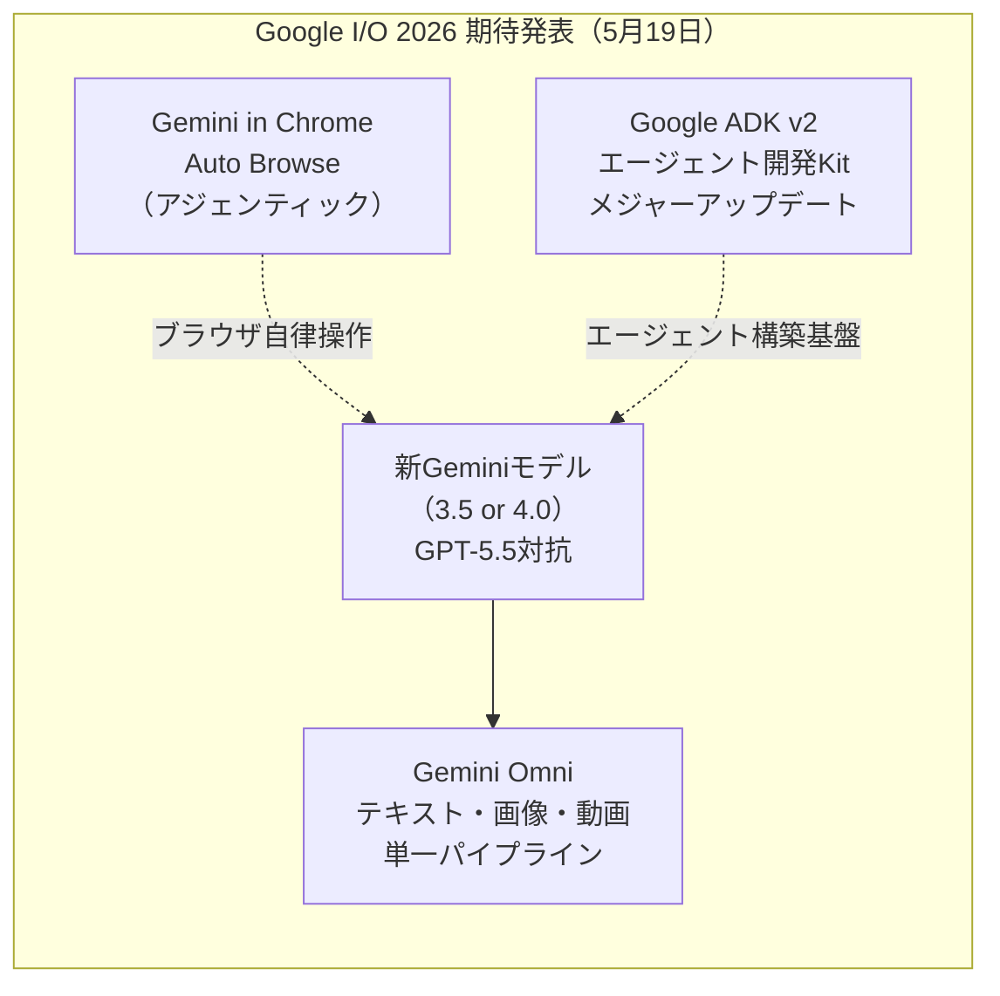
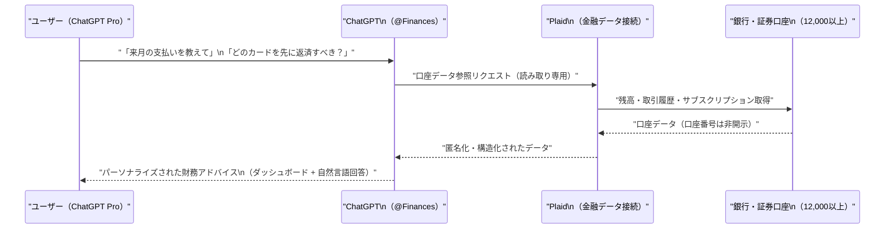
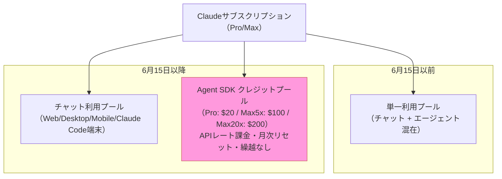
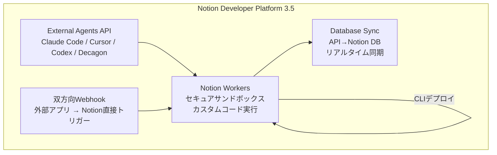
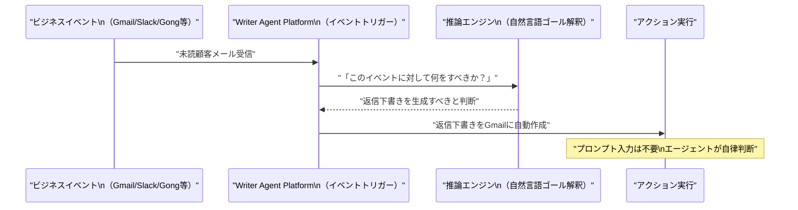
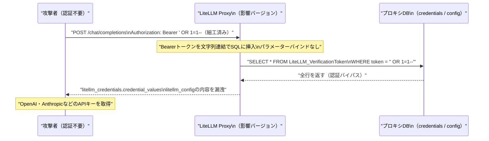

# LLM・AI Agent 最新情報レポート Vol.20

**作成日**: 2026年5月16日  
**対象期間**: 2026年5月15日〜2026年5月16日（Vol.19との差分）

---

## 目次

1. [Google Cloud・Androidアップデート](#1-google-cloudandroidアップデート)
2. [Microsoft Azure AIアップデート](#2-microsoft-azure-aiアップデート)
3. [LLM Model / AI Agentアーキテクチャ・研究](#3-llm-model--ai-agentアーキテクチャ研究)
4. [公式ブログ・論文のリサーチ・要約](#4-公式ブログ論文のリサーチ要約)
   - [Google](#41-google)
   - [OpenAI](#42-openai)
   - [Anthropic](#43-anthropic)
5. [AI Agent搭載SaaS製品情報](#5-ai-agent搭載saas製品情報)
6. [LLM/AI Agentセキュリティインシデント](#6-llmai-agentセキュリティインシデント)
7. [その他特筆すべき情報](#7-その他特筆すべき情報)
8. [参考リンク](#8-参考リンク)

---

## 1. Google Cloud・Androidアップデート

### 1.1 Google I/O 2026（5月19日）直前：新Geminiモデル公開が秒読み

Google I/O 2026（5月19〜20日）の3日前となる5月15〜16日時点で、Googleが **新しいGeminiモデルをI/O直前に公開する**動きがあることが複数メディアによって報告されている。[[1]](#ref-1)[[2]](#ref-2)

**期待される発表内容：**

| 項目 | 詳細 |
|---|---|
| **新Geminiモデル** | Gemini 3.5 または Gemini 4.0。マルチモーダル推論の大幅強化、GPT-5.5への対抗を狙う |
| **Gemini Omni** | テキスト・画像・動画生成を単一パイプラインで統合する初のモデル（リーク多数） |
| **Gemini in Chrome「Auto Browse」** | GeminiがChromeブラウザを自律操作してフォーム入力・検索を代行するアジェンティック機能 |
| **Google ADK v2** | Agent Development Kitのメジャーアップデート |

**業界背景：** OpenAIがGPT-5.5 Instant（5月5日リリース）でChatGPTの精度・簡潔さを大幅改善した直後にあたり、GoogleがI/O前後で反撃に出るタイミングとして注目されている。

---

## 2. Microsoft Azure AIアップデート

新情報なし（2026年5月15〜16日時点で、Vol.19以降の新たなAzure AI発表は確認されず）

---

## 3. LLM Model / AI Agentアーキテクチャ・研究

### 3.1 DeepSeek：ハードウェア制約下での効率アーキテクチャ革新（2026年5月時点）

DeepSeekが2026年のハードウェア輸出規制下での制約を逆手に取ったアーキテクチャ改善に関する詳報が5月15日前後に整理・公開された。[[3]](#ref-3)

**主要なアーキテクチャ的工夫：**

| 技術 | 概要 | 効果 |
|---|---|---|
| **MoE（Mixture-of-Experts）スパース化** | 全パラメータを毎回使わず、ルーターが必要な専門家モデルのみ選択 | 計算コスト削減・大規模化を両立 |
| **Multi-Latent Attention（MLA）** | KVキャッシュを圧縮する新アテンション機構（GQAの進化版） | メモリ効率を飛躍的に向上 |
| **推論時スケーリング（Inference-Time Scaling）** | 学習後の推論フェーズに計算資源を集中配分 | 高性能チップ不要で高精度推論を実現 |
| **単純タスクのオフロード** | 単純なLLMタスクを軽量モデルに委譲してパラメータを節約 | 数十億パラメータ規模を節約可能 |

**業界的意義：** H100等の高性能GPU調達が制限される中、DeepSeekのアーキテクチャ選択は「ハードウェアへの依存度を下げる方向へ業界を牽引する」先行事例として世界的に注目されている。2026年は推論時スケーリングがLLMアーキテクチャの主要トレンドとなる見込みが強まっている。

---

## 4. 公式ブログ・論文のリサーチ・要約

### 4.1 Google

#### Gemini in Chrome「Auto Browse」：ブラウザをエージェントに変える（I/O直前確認）

GoogleがChrome for Androidに**「Auto Browse」機能**を導入することを確認。GeminiがChrome上でフォーム入力・ウェブ検索・ページ操作を代行するアジェンティック体験を提供する。[[4]](#ref-4)

**位置付け：** 従来のブラウザ体験（ユーザーが操作）から「エージェントが操作し、ユーザーが承認する」モデルへの転換を明示する最初の大規模展開となる。

---

### 4.2 OpenAI

#### ChatGPT 個人財務ツール：Plaid経由で1万2,000以上の金融機関に接続（5月15日）

OpenAIが5月15日、**ChatGPT個人財務ツール**をChatGPT Proユーザー向けにプレビューとして提供開始した。金融データ接続サービスPlaidとの提携により、銀行・証券・クレジットカード口座をChatGPTに安全に連携できる。[[5]](#ref-5)[[6]](#ref-6)[[7]](#ref-7)

**機能概要：**

| 項目 | 内容 |
|---|---|
| **対応機関数** | Schwab・Fidelity・Chase・Robinhood・American Express・Capital One等 **1万2,000以上** |
| **提供対象** | まずChatGPT Pro（米国）。順次Plus・Free・Businessへ拡大予定 |
| **アクセス方法** | サイドバー「Finances」→「Get started」または `@Finances, connect my accounts` |
| **ダッシュボード** | ポートフォリオ実績・支出・サブスクリプション・近日の支払い一覧 |
| **できないこと** | 口座番号の閲覧・口座操作（残高/取引/投資/負債の参照のみ） |
| **データ削除** | 連携解除後30日以内に同期データを削除 |
| **今後の拡張** | Intuit連携（節税分析・クレジットカード審査確率計算等） |

**プライバシー設計：** OpenAIは口座番号を参照できない読み取り専用接続のみ。Plaidが認証と匿名化を担い、ChatGPTがアドバイスロジックを提供する役割分担となっている。

**業界的意義：** これまでChatGPTは汎用的な財務知識しか提供できなかったが、個人の実データに基づく具体的な提案が可能になる。金融アドバイスにおける「AI x 実口座データ」の組み合わせは業界初の大規模展開となる。

---

#### OpenAI CFO「コンピュートの垂直な壁」―更なる資金調達を示唆（5月15日）

OpenAIのCFO **Sarah Friar** が5月15日、「需要の垂直な壁（vertical wall of demand）が見えている一方、2026年にはコンピュートが十分ではない」と語り、**追加資金調達の可能性**を示唆した。[[8]](#ref-8)

> 「我々は需要の垂直な壁を目撃している。しかし2026年にはコンピュートがそれほど多くない。」
> — Sarah Friar, OpenAI CFO (2026年5月15日)

現在OpenAIは$3,000億を超える年間収益ランレートを記録。急増する推論需要に対してGPUクラスター増強のための追加資本が必要な状況。

---

### 4.3 Anthropic

#### Claude Code v2 アップデート（5月15日）：Opus 4.7デフォルト化・プラグイン依存管理強化

Anthropicが5月15日、Claude Codeのメジャーアップデートをリリース。[[9]](#ref-9)[[10]](#ref-10)

**主な変更点：**

| 機能 | 詳細 |
|---|---|
| **Fastモード デフォルトモデル変更** | Fast mode が **Opus 4.6** → **Opus 4.7** へ変更（出力速度維持・品質向上） |
| **プラグイン依存管理** | 他のプラグインが依存しているプラグインを無効化しようとすると拒否する依存エンフォースメントを追加 |
| **コンテキストコスト投影** | `/plugin` マーケットプレイス閲覧ペインに「ターンごと・起動ごとのトークン推定コスト」を表示 |
| **バックグラウンドセッション強化** | Worktreeバックグラウンド分離の拡張、`claude agents` および バックグラウンドセッションオプションの拡充 |
| **PowerShell対応改善** | Windows環境でのPowerShell安定性向上 |
| **バグ修正** | Windows・macOS・CLIの安定性問題を複数修正 |

---

#### AnthropicがClaude Agent SDK利用を独立課金プールへ分離—6月15日から適用（5月13〜15日確定）

Anthropicが2026年6月15日より、**Claude Agent SDK経由のプログラム的使用量をサブスクリプションの通常枠から分離**し、独立した月次クレジットプールで管理する方針を正式確定した。[[11]](#ref-11)[[12]](#ref-12)[[13]](#ref-13)

**変更の全体像：**

| サブスクリプション | Agent SDK月次クレジット | 料金体系 |
|---|---|---|
| **Claude Pro** | **$20** | APIレート換算 |
| **Max 5x** | **$100** | APIレート換算 |
| **Max 20x** | **$200** | APIレート換算 |

**対象となるプログラム的利用（6月15日以降は独立プールから消費）：**
- Claude Agent SDK / `claude -p` コマンド
- Claude Code GitHub Actions
- OpenClaw・Conductor・Zed・Jeanなどサードパーティエージェントフレームワーク

**対象外（従来のサブスクリプション枠のまま）：**
- Web・デスクトップ・モバイルでのChatUI利用
- Claude Codeターミナル使用
- Claude Cowork利用

**ユーザーへの影響：** エージェントが非効率でトークンを大量消費する場合、新クレジットプールが先に枯渇する。枯渇後は通常サブスクリプション枠から補填されず、追加クレジット購入が必要となる。開発者コミュニティでは**12〜175倍の実質値上げ**との試算も出ており、論議を呼んでいる。

---

## 5. AI Agent搭載SaaS製品情報

### 5.1 Notion 3.5 Developer Platform：外部AIエージェントをワークスペースに統合（5月13日）

NotionがVersion 3.5で**Developer Platform**を正式ローンチ。Claude Code・Cursor・Codex・Decagonなど主要AIエージェントをNotion内で直接稼働させる統合基盤を提供した。[[14]](#ref-14)[[15]](#ref-15)

**主要コンポーネント：**

| コンポーネント | 詳細 |
|---|---|
| **Notion Workers** | セキュアサンドボックス上でカスタムコードをホスト実行。CLIでデプロイ。ベータ期間中無料、8月11日以降はNotionクレジット制 |
| **External Agents API** | Claude Code・Cursor・Codex・Decagonなど外部エージェントをワークスペースに招待 |
| **Webhook（双方向化）** | 従来の一方向（Notion→外部）から、外部アプリがNotionを直接トリガーできる双方向Webhookへ |
| **Database Sync** | 任意のAPIデータソースをNotion DBにリアルタイム同期（Workers基盤上で動作） |

**意義：** NotionがSaaSツールから「AIエージェントの制御室（Control Room）」へ転換する戦略的ピボット。エージェントがNotionを「仕事の記憶装置と実行ハブ」として利用できる設計になっている。

---

### 5.2 Writer：プロンプト不要の自律AIエージェントで Amazon・Microsoft・Salesforceに挑戦

エンタープライズAI SaaSの**Writer**が、**プロンプトを待たず自律的に動作するイベントトリガー型AIエージェント**を発表。[[16]](#ref-16)[[17]](#ref-17)

**仕組みと特長：**

| 項目 | 詳細 |
|---|---|
| **トリガー対象** | Gmail・Gong・Google Calendar・Google Drive・SharePoint・Slack 等のビジネスイベント |
| **自律アクション例** | 未読顧客メール受信→返信下書き自動生成 / 停滞商談検知→フォローアップ送信 / 会議録音→チャンネルへの自動要約 |
| **従来の自動化との差異** | Zapierのような「rigid条件ロジック」ではなく、自然言語ゴールとイベントコンテキストを解釈してアクション要否を自律判断 |
| **ガバナンス** | BYOE（独自暗号鍵持ち込み）・コネクター権限プロファイル・DatadogプラグインによるLLMリクエスト全ログ記録 |
| **新コネクタ** | Adobe Experience Manager連携を追加 |

**競合ポジション：** MicrosoftのCopilot・SalesforceのAgentforce・AmazonのQ Business に対し、「人間がプロンプトを入力する前から動く」という差別化軸で勝負する姿勢を明確化。

---

## 6. LLM/AI Agentセキュリティインシデント

### 6.1 メキシコ水道施設サイバー攻撃にClaude・GPTが悪用（2026年5月確認）

メキシコ・モンテレイ都市圏の水道事業者のIT環境が攻撃者に侵害され、**Anthropic Claude および OpenAIのGPTモデルが攻撃計画・実行支援に使用された**ことが確認された。[[18]](#ref-18)

**攻撃の概要：**

| 項目 | 内容 |
|---|---|
| **標的** | メキシコ・モンテレイ都市圏の水道インフラ事業者 |
| **攻撃段階** | IT環境侵害後、OT（運用技術）インフラへの侵入を試みた |
| **LLM利用** | 攻撃者がAnthropicのClaudeおよびOpenAIのGPTを攻撃計画・実行のサポートに活用 |
| **被害状況** | IT環境の侵害は確認されたが、OTインフラへの攻撃は防御に成功 |

**業界的意義：** 重要インフラを標的にしたサイバー攻撃にLLMが「計画補佐ツール」として使用された事例として注目される。LLMプロバイダー側のセーフガード（有害利用の検出・拒否）の実効性が問われる事案となっている。

---

### 6.2 LiteLLM CVE-2026-42208：CISA KEV登録済み・事前認証SQLインジェクションを早急にパッチ適用

オープンソースLLMゲートウェイ**LiteLLM**に存在するSQLインジェクション脆弱性（CVE-2026-42208、CVSS 9.3）が公表から**36時間以内に実際の攻撃に悪用**され、CISAの既知悪用脆弱性（KEV）カタログに登録された。[[19]](#ref-19)[[20]](#ref-20)[[21]](#ref-21)

**脆弱性の詳細：**

| 項目 | 内容 |
|---|---|
| **CVE番号** | CVE-2026-42208 |
| **CVSS スコア** | **9.3（Critical）** |
| **種別** | 事前認証SQLインジェクション（Pre-Authentication SQL Injection） |
| **根本原因** | Proxy APIキー検証クエリで呼び出し元のBearerトークン値をパラメーターバインドなしに文字列連結 |
| **影響バージョン** | LiteLLM >= 1.81.16 かつ < 1.83.7 |
| **修正バージョン** | **v1.83.10-stable**（最新推奨） |
| **CISA KEV登録** | 2026年5月8日（FCEB機関は5月11日までのパッチ適用が義務化） |

**攻撃の流れ：**

**漏洩リスク情報：** `litellm_credentials.credential_values`（上流LLMプロバイダーのAPIキー）および `litellm_config`（プロキシ実行環境の設定）が標的にされた。

**対応：** 直ちに **v1.83.10-stable 以上** へアップグレード。LiteLLMはGitHub Star 22,000超の主要LLMゲートウェイであり、OpenAI・Anthropic・他モデルプロバイダーの統合フロントエンドとして広く使われているため、速やかな対応が必要。

---

## 7. その他特筆すべき情報

### 7.1 Anthropic：Claude Mythos Preview — 17年前のFreeBSDゼロデイを自律発見・悪用

Anthropicの最強モデル**Claude Mythos Preview**に関して、5月15日時点での最新情報がまとまった。[[22]](#ref-22)[[23]](#ref-23)[[24]](#ref-24)

**モデル概要：**

| 項目 | 内容 |
|---|---|
| **発表日** | 2026年4月7日 |
| **SWE-benchスコア** | **93.9%**（Opus 4.6を全ベンチマークで凌駕） |
| **USAMOスコア** | **97.6%** |
| **最大の特徴** | 17年間発見されていなかったFreeBSDのRCE脆弱性（NFSマウントでroot権限取得）を**完全自律で発見・悪用** |
| **提供形態** | 一般公開せず。約40の組織（Microsoft・Apple・AWS・CrowdStrike・JPMorganChase等）に限定提供 |

**Project Glasswing：** Anthropicはサイバーセキュリティリスクを理由にMythos Previewを一般公開しない代わりに、ビッグテックを中心とした産業コンソーシアム「**Project Glasswing**」を立ち上げ、参加組織の基盤システムの脆弱性発見・修正を推進している。

**Pentagon（米国防総省）の評価：** 国防総省幹部がProject GlaswingとClaude Mythosに「機会を見出す」とコメントしており、軍事・防衛領域での活用検討が始まっている。

**業界への影響：** 「人間の専門家を超えるレベルでの脆弱性発見能力」を持つモデルが存在することが明示され、AIを用いた攻撃側・防御側の両面での利用が急速に現実的な議論となってきた。

---

## 8. 参考リンク

**[1]** [Google is about to release a new Gemini model | Sources News](https://sources.news/p/google-about-to-release-new-gemini)

**[2]** [Google May Launch New Gemini Model at I/O Event to Tackle OpenAI's GPT-5.5 | AndroidHeadlines](https://www.androidheadlines.com/2026/05/google-io-new-gemini-model-launch-gpt-5-5-rival.html)

**[3]** [DeepSeek looks to offload simple LLM tasks to save billions of parameters | SDxCentral](https://www.sdxcentral.com/news/deepseek-looks-to-offload-simple-llm-tasks-to-save-billions-of-parameters/)

**[4]** [Google I/O 2026 Live Blog: Android 17, Android XR glasses, and all the Gemini AI news | Android Central](https://www.androidcentral.com/phones/live/google-i-o-2026-live-blog-android-17-android-xr-glasses-and-all-the-gemini-ai-news)

**[5]** [A new personal finance experience in ChatGPT | OpenAI](https://openai.com/index/personal-finance-chatgpt/)

**[6]** [OpenAI launches ChatGPT for personal finance, will let you connect bank accounts | TechCrunch](https://techcrunch.com/2026/05/15/openai-launches-chatgpt-for-personal-finance-will-let-you-connect-bank-accounts/)

**[7]** [What ChatGPT's new experience signals for digital finance | Plaid Blog](https://plaid.com/blog/chatgpt-personal-finance-plaid/)

**[8]** [OpenAI Considers Raising More Capital to Meet AI Demand | PYMNTS.com](https://www.pymnts.com/news/artificial-intelligence/2026/openai-considers-raising-more-capital-meet-ai-demand/)

**[9]** [Anthropic Traces Six Weeks of Claude Code Quality Complaints to Three Overlapping Product Changes | InfoQ](https://www.infoq.com/news/2026/05/anthropic-claude-code-postmortem/)

**[10]** [Claude Code Updates by Anthropic - May 2026 | Releasebot](https://releasebot.io/updates/anthropic/claude-code)

**[11]** [Anthropic puts Claude agents on a meter across its subscriptions | InfoWorld](https://www.infoworld.com/article/4171274/anthropic-puts-claude-agents-on-a-meter-across-its-subscriptions.html)

**[12]** [Anthropic reinstates OpenClaw and third-party agent usage on Claude subscriptions — with a catch | VentureBeat](https://venturebeat.com/technology/anthropic-reinstates-openclaw-and-third-party-agent-usage-on-claude-subscriptions-with-a-catch)

**[13]** [Anthropic splits billing again: Agent SDK gets separate credit pools | The New Stack](https://thenewstack.io/anthropic-agent-sdk-credits/)

**[14]** [Introducing Notion's Developer Platform | Notion Blog](https://www.notion.com/blog/introducing-developer-platform)

**[15]** [Notion just turned its workspace into a hub for AI agents | TechCrunch](https://techcrunch.com/2026/05/13/notion-just-turned-its-workspace-into-a-hub-for-ai-agents/)

**[16]** [Writer launches AI agents that can act without prompts, taking on Amazon, Microsoft and Salesforce | VentureBeat](https://venturebeat.com/technology/writer-launches-ai-agents-that-can-act-without-prompts-taking-on-amazon-microsoft-and-salesforce)

**[17]** [Announcing WRITER AI HQ: AI agent platform for enterprise | Writer Blog](https://writer.com/blog/writer-ai-hq/)

**[18]** [OpenAI and Anthropic LLMs Used in Critical Infrastructure Cyber-Attack | Infosecurity Magazine](https://www.infosecurity-magazine.com/news/llm-critical-infrastructure/)

**[19]** [LiteLLM CVE-2026-42208 SQL Injection Exploited within 36 Hours of Disclosure | The Hacker News](https://thehackernews.com/2026/04/litellm-cve-2026-42208-sql-injection.html)

**[20]** [CVE-2026-42208: Targeted SQL injection against LiteLLM's authentication path discovered 36 hours following vulnerability disclosure | Sysdig](https://www.sysdig.com/blog/cve-2026-42208-targeted-sql-injection-against-litellms-authentication-path-discovered-36-hours-following-vulnerability-disclosure)

**[21]** [Security Update: CVE-2026-42208 in LiteLLM Proxy | LiteLLM Docs](https://docs.litellm.ai/blog/cve-2026-42208-litellm-proxy-sql-injection)

**[22]** [Claude Mythos Preview | red.anthropic.com](https://red.anthropic.com/2026/mythos-preview/)

**[23]** [Claude Mythos: What Does Anthropic's New Model Mean for the Future of Cybersecurity? | Centre for Emerging Technology and Security, The Alan Turing Institute](https://cetas.turing.ac.uk/publications/claude-mythos-future-cybersecurity)

**[24]** [Pentagon Leader Sees 'Opportunity' in Anthropic's Project Glasswing and Claude Mythos | GovConWire](https://www.govconwire.com/articles/anthropic-glasswing-claude-mythos-katherine-sutton-dow-cybersecurity)
