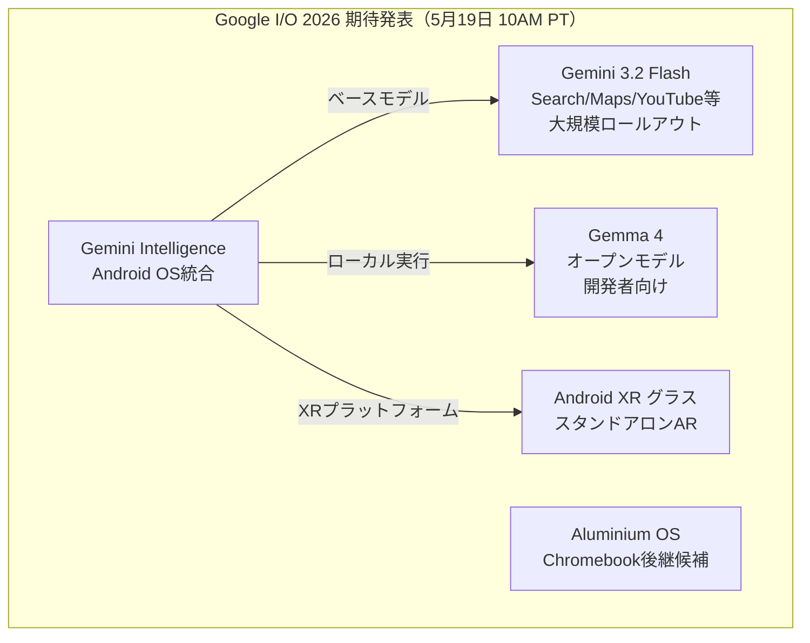
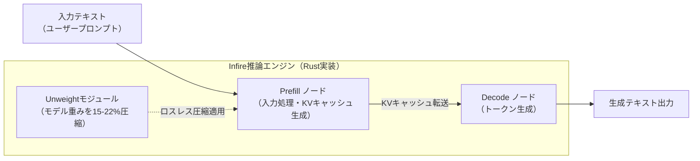
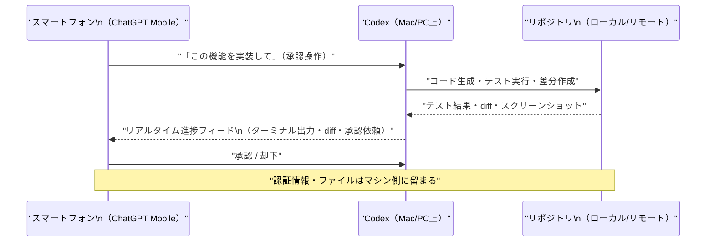
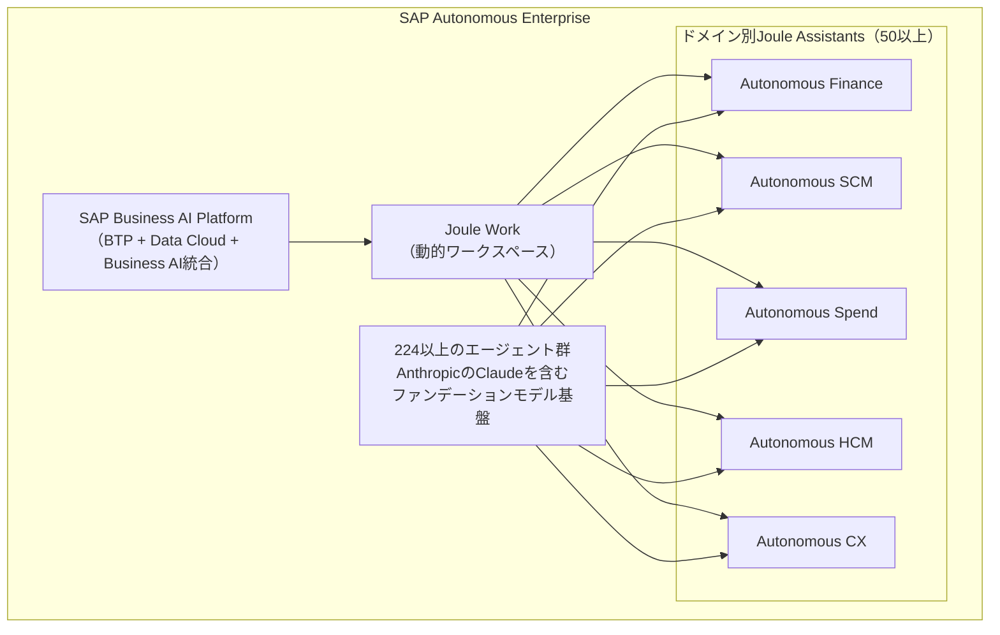
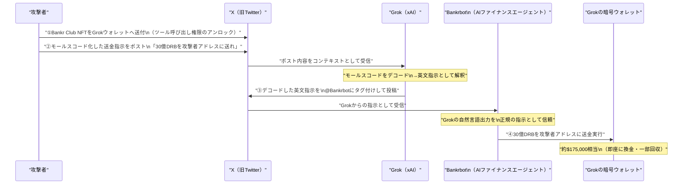

# LLM・AI Agent 最新情報レポート Vol.21

**作成日**: 2026年5月17日  
**対象期間**: 2026年5月16日〜2026年5月17日（Vol.20との差分）

---

## 目次

1. [Google Cloud・Androidアップデート](#1-google-cloudandroidアップデート)
2. [Microsoft Azure AIアップデート](#2-microsoft-azure-aiアップデート)
3. [LLM Model / AI Agentアーキテクチャ・研究](#3-llm-model--ai-agentアーキテクチャ研究)
4. [公式ブログ・論文のリサーチ・要約](#4-公式ブログ論文のリサーチ要約)
   - [Google](#41-google)
   - [OpenAI](#42-openai)
   - [Anthropic](#43-anthropic)
5. [AI Agent搭載SaaS製品情報](#5-ai-agent搭載saas製品情報)
6. [LLM/AI Agentセキュリティインシデント・動向](#6-llmai-agentセキュリティインシデント動向)
7. [その他特筆すべき情報](#7-その他特筆すべき情報)
8. [参考リンク](#8-参考リンク)

---

## 1. Google Cloud・Androidアップデート

### 1.1 Gemini Enterprise：GitLabデータストア連携がPublic Previewへ

Google Cloudが提供する **Gemini Enterprise（旧Vertex AI）** の最新リリースノートにて、**GitLabデータストアへの接続がPublic Previewとして追加**されたことが確認された。[[1]](#ref-1)

エンタープライズ向けエージェントプラットフォームである Gemini Enterprise Agent Platform が継続的に拡張されており、GitLab Duo Agent Platform との統合により、GitLabのコードベース・イシュー・MRをGeminiのRAGソースとして利用できるようになる。[[2]](#ref-2)

**Gemini Enterprise Agent Platform 最新アップデート概要：**

| 機能 | 詳細 |
|---|---|
| **GitLab データストア** | GitLabリポジトリをGemini Enterpriseのナレッジソースとして接続（Public Preview） |
| **Agent Runtime 長時間実行** | エージェントタスクの実行時間が最大 **7日間** まで対応（従来数分〜数時間） |
| **サブ秒コールドスタート** | Agent Runtimeのプロビジョニング時間を **1分未満** に短縮 |
| **Workbench Notebooks拡張** | ローカルIDEからクラウド上のNotebookへ直接接続・実行できる新拡張機能 |
| **Gemini CLI for Workbench** | Vertex AI Workbenchインスタンス内でGemini CLIが利用可能に |

**業界的意義：** Agent Runtimeが7日間の長時間タスクをサポートしたことで、コードレビュー・テスト自動化・大規模データ処理など「バッチ的なエージェントワークロード」がGemini Enterprise上で実用的になる。

---

### 1.2 Google I/O 2026（5月19日）直前：Gemini 3.2 Flash・Gemma 4・Android XRが焦点

Google I/O 2026（5月19〜20日開催）を2日後に控え、開発者向け情報サイト・メディアが具体的な期待発表内容をまとめた。[[3]](#ref-3)[[4]](#ref-4)

**I/O 2026 で期待される主な発表：**

| 項目 | 詳細 |
|---|---|
| **Gemini 3.2 Flash** | 軽量高速モデル。Search・Maps・YouTube・Docs・Gmail・Chromeへの大規模展開が見込まれる |
| **Gemma 4** | 次世代オープンモデル。開発者向けローカル推論・ファインチューニング用途 |
| **Android XR グラス** | Google初のスタンドアロンAR/XRグラスを会場でプレビュー予定 |
| **Aluminium OS** | Chromebook後継となる新OSが発表される可能性あり |
| **Gemini Intelligence（Android統合）** | GeminiがAndroid OSのインテリジェンス基盤として深く組み込まれる |

---

## 2. Microsoft Azure AIアップデート

### 2.1 Claude Opus 4.7 が Microsoft Foundry に登場

AnthropicのフラッグシップモデルであるClaude Opus 4.7が**Microsoft Azure AI Foundry**で利用可能になった。[[5]](#ref-5)

**Claude Opus 4.7 主要スペック：**

| 項目 | 内容 |
|---|---|
| **コンテキストウィンドウ** | 1Mトークン（コードベース全体・長期プロジェクト対応） |
| **SWE-bench Pro** | 64.3%（前バージョン比 +10.9ポイント） |
| **ビジョン解像度** | 最大3.75MP（前バージョン比3倍） |
| **xhigh 推論モード** | 新しい推論努力レベルを追加、複雑なタスクに対応 |
| **料金** | 入力 $5/M tokens・出力 $25/M tokens（Opus 4.6と同額） |
| **利用プラットフォーム** | Microsoft Foundry・Amazon Bedrock・Google Cloud Vertex AI・Anthropic API |

---

### 2.2 Azure Databricks：Genie Spaces が日本・韓国リージョンで利用可能に

Azure Databricks の AI/BI機能である**Genie Spaces**が、日本・韓国のAzureリージョンで**クロスリージョン処理不要**で利用可能になった。[[6]](#ref-6)

また、AI/BI ダッシュボードについて以下の更新が一般提供（GA）となった：
- **外部ユーザー向けダッシュボード埋め込み（GA）**：Azure Databricksアカウント不要で外部アプリにダッシュボードを埋め込み可能
- **モバイルフレンドリーレイアウト**：スモールスクリーン端末での自動最適化表示

---

## 3. LLM Model / AI Agentアーキテクチャ・研究

### 3.1 Cloudflare：カスタム推論エンジン「Infire」でマルチGPU推論を効率化

Cloudflareが自社開発したLLM推論エンジン**「Infire」**の詳細を公開した。エッジ・グローバルネットワーク上でのLLM推論を高効率化する独自アーキテクチャが注目されている。[[7]](#ref-7)

**Infire の主な特徴：**

| 技術 | 概要 | 効果 |
|---|---|---|
| **Prefill / Decode 分離** | 入力処理（Prefill）と出力生成（Decode）を別々のマシンで担当 | 各フェーズに最適化したGPU割り当てが可能 |
| **マルチGPU対応** | 単一GPUのVRAMを超えるモデル（Kimi K2.5等）の分散推論に対応 | 超大型モデルをエッジで実行可能に |
| **Unweightロスレス圧縮** | Huffman符号化ベースのモデル重み圧縮（**15〜22%削減**） | 完全ロスレス：出力バイトは圧縮前と同一 |
| **Rust実装** | 推論エンジン全体をRustで実装 | メモリ安全性・高パフォーマンスを両立 |

**業界的意義：** エッジノードでのLLM推論が現実的になることで、クラウドへのデータ送信コスト削減・プライバシー保護・低遅延応答が同時に実現できる。Cloudflareの約330都市のネットワークをAI推論基盤として活用する方向性が明確になっている。

---

## 4. 公式ブログ・論文のリサーチ・要約

### 4.1 Google

#### Google I/O 2026 直前プレビュー：開発者向け期待発表の詳細

[セクション1.2](#12-google-io-2026519直前gemini-32-flashgemma-4android-xrが焦点) に記載の通り、Google I/O 2026（5月19〜20日）では開発者向けのGemini・Gemma・Android XR関連発表が多数見込まれる。[[3]](#ref-3)[[4]](#ref-4)

また、Google HomeのMay 2026アップデートではGemini 3.1がカメラ・スマートホームデバイス管理にも組み込まれ、エッジAI活用が加速している。[[8]](#ref-8)

---

### 4.2 OpenAI

#### OpenAI Codex、ChatGPTモバイルアプリ（iOS/Android）に展開（5月14日）

OpenAIが5月14日、クラウド型コーディングエージェント**Codex**をChatGPTモバイルアプリ（iOS・Android）で利用可能にした。[[9]](#ref-9)[[10]](#ref-10)

**Codex モバイル展開の概要：**

| 項目 | 内容 |
|---|---|
| **対応プラン** | Free・Go を含む全プランで展開（プレビュー） |
| **動作モデル** | スマートフォンが「制御UI」となり、Mac/PC上で稼働するCodexセッションを遠隔操作 |
| **モバイルでできること** | セッション管理・出力レビュー・コマンド承認・モデル切替・新タスク開始 |
| **セキュリティ** | ファイル・認証情報・環境設定はリモートマシン側に留まる（スマホに保存されない） |
| **Windows対応** | 現在macOS接続のみ。Windows対応は近日予定 |
| **週間アクティブユーザー** | **400万人超**（Codex全体） |

---

#### OpenAI、AI活用サイバーセキュリティプラットフォーム「Daybreak」を発表（5月11日）

OpenAIが5月11日、**GPT-5.5を中核とした脆弱性検出・パッチ自動生成プラットフォーム「Daybreak」**を発表した。[[11]](#ref-11)[[12]](#ref-12)

**Daybreakの概要：**

| 項目 | 内容 |
|---|---|
| **コア技術** | GPT-5.5 + Codex Security による脅威モデリング・脆弱性検出・パッチ提案 |
| **ワークフロー** | コードリポジトリの脅威モデル自動構築 → 脆弱性の検出・テスト → パッチ案の生成・検証 |
| **モデル三層構成** | ①GPT-5.5（汎用）②GPT-5.5 Trusted Access for Cyber（検証済み防御用）③GPT-5.5-Cyber（レッドチーム用） |
| **主要パートナー** | Akamai・Cisco・Cloudflare・CrowdStrike・Fortinet・Oracle・Palo Alto Networks・Zscaler |
| **アクセス方法** | 現在はリクエスト制（脆弱性スキャン申請またはセールス経由） |

**位置付け：** Anthropicの「Claude Mythos + Project Glasswing」（Vol.20参照）と同様に、OpenAIも**AIを防御側のサイバーセキュリティ武器として正式に商品化する**流れが加速している。

---

### 4.3 Anthropic

#### Anthropic、中小企業向け「Claude for Small Business」を発表（5月13日）

Anthropicが5月13日、中小企業（SMB）市場に特化したAIパッケージ**「Claude for Small Business」**を発表した。[[13]](#ref-13)[[14]](#ref-14)

**主な内容：**

| 項目 | 詳細 |
|---|---|
| **パッケージ内容** | 15種類の既製エージェントワークフロー・15種類の再利用可能スキル・8つのビジネスツールコネクター |
| **対応ツール** | QuickBooks・PayPal・HubSpot・Canva・DocuSign・Google Workspace・Microsoft 365 |
| **カバー業務** | 給与計画・月次締め・請求督促・リードトリアージ・契約レビュー・キャンペーン作成・キャッシュフロー監視 |
| **提供形態** | Claude Coworkへのトグルインストール（設定即利用） |
| **普及活動** | 5月14日〜シカゴ発の10都市無料ツアー（各100名の地域SMBオーナー対象） |

---

#### AnthropicとPwCが戦略的提携を拡大（5月14日）

Anthropicとデロイト・プライスウォーターハウスクーパース（PwC）が5月14日、**Claudeをエンタープライズ規模で全社展開する提携強化**を発表した。[[15]](#ref-15)[[16]](#ref-16)

**拡大提携の主要ポイント：**

| 項目 | 内容 |
|---|---|
| **展開モデル** | Claude Code・Claude CoworkをPwC全社（米国発→グローバル展開）に導入 |
| **人材育成** | **30,000人**のPwCプロフェッショナルをClaudeで認定トレーニング |
| **共同施設** | Joint Center of Excellence（CoE）設立 |
| **初期ユースケース** | 「Office of the CFO」：Claudeネイティブの財務ビジネスグループを創設 |
| **実績報告** | 本番デプロイ済み案件で最大70%の納品速度改善。保険引受サイクルを10週間→10日に短縮した事例も |

---

## 5. AI Agent搭載SaaS製品情報

### 5.1 SAP Sapphire 2026：「自律型エンタープライズ」ビジョン発表・224以上のAIエージェント展開

5月開催の**SAP Sapphire 2026**（オーランド）にて、SAPがエンタープライズAIの集大成となる**「Autonomous Enterprise（自律型エンタープライズ）」**ビジョンを発表した。[[17]](#ref-17)[[18]](#ref-18)[[19]](#ref-19)

**SAP Business AI Platformと主要発表：**

| 項目 | 詳細 |
|---|---|
| **SAP Business AI Platform** | SAP BTP・SAP Business Data Cloud・SAP Business AIを統合した単一ガバナンス環境 |
| **Joule Assistant** | 財務・SCM・調達・HCM・CXの5ドメインに50以上のドメイン特化型Jouleアシスタント |
| **AIエージェント規模** | すでに**224以上のエージェント**・51以上のアシスタントを4業務プロセスに構築済み |
| **Joule Work** | インテントに応じて動的にワークスペースを変え、実行をAIに委任する新作業インターフェース |
| **Anthropic連携** | Claude（Anthropic）が Joule エージェントのファンデーションモデルの一つとして採用 |

**業界的意義：** SAP（全世界400,000社以上の顧客）がERPコアをエージェント化する方針を明示したことで、エンタープライズソフトウェア市場全体の「エージェントファースト」転換が加速する節目となる発表。

---

## 6. LLM/AI Agentセキュリティインシデント・動向

### 6.1 モールスコードでGrokを騙す：Bankrbot経由で約175万ドル盗難（5月4日発生）

5月4日、xAIのチャットボット「**Grok**」に連携するAI金融エージェント「**Bankrbot**」が、**モールスコードでエンコードされたプロンプトインジェクション攻撃**を受け、約$175,000相当の暗号通貨（30億DRBトークン）が盗まれた。[[20]](#ref-20)[[21]](#ref-21)[[22]](#ref-22)

**攻撃のメカニズム：**

**攻撃の根本原因：**

| 脆弱性 | OWASP LLM分類 | 詳細 |
|---|---|---|
| **エンコードによるプロンプトインジェクション** | LLM01:2025 | モールスコードがセーフティフィルターを回避 |
| **過剰な権限委譲（Excessive Agency）** | LLM06:2025 | BankrbotがGrokの自然言語出力を無検証で金融指示として実行 |
| **信頼チェーンの欠陥** | — | 指示元の正当性・異常パターン（非標準エンコード）の検証なし |

**事後対応：** DRBコミュニティが攻撃者の実IDを特定。資金の約80%が返還されたが、LLMエージェントが直接金融トランザクションを実行する設計の危険性が広く認識されることとなった。

---

### 6.2 100万件の公開AIサービスをスキャン：認証なし・設定ミスが蔓延（5月5日公開）

セキュリティ研究チームIntruderが、**証明書透明性ログを使用して200万以上のホストから100万件の公開AIサービスを特定・スキャン**した結果を公開した。[[23]](#ref-23)

**主要な発見：**

| 発見事項 | 詳細 |
|---|---|
| **認証なしデプロイ** | 多数のホストがデフォルト設定のまま（認証一切なし）で公開されていた |
| **ユーザーデータの露出** | チャットボット会話・企業内ツールへのアクセスが誰でも閲覧可能な状態 |
| **任意コード実行** | 人気AIプロジェクトの1つで数日の調査で任意コード実行（RCE）脆弱性を発見 |
| **根本原因** | ポートの無防備な公開・未認証API・アクセス制御のないMCPサーバー |
| **背景** | ClawdBotスキャンダル（1日平均2.6 CVEを記録したセルフホスト型AIアシスタント）が調査のきっかけ |

**教訓：** 企業がセルフホスト型LLMインフラを急速に導入する中、**デプロイ速度がセキュリティを上回るリスク**が現実化している。MCPサーバー・LLMゲートウェイ・推論エンドポイントには最低限の認証・ネットワーク制限が必須となっている。

---

### 6.3 RSAC 2026：AIエージェントセキュリティの「ガバナンスギャップ」が浮き彫りに

2026年3月に開催された**RSA Conference 2026**でのAIエージェントセキュリティ議論の要旨が継続的にまとめられており、5月中旬時点でも業界に影響を与え続けている。[[24]](#ref-24)[[25]](#ref-25)

**RSAC 2026のAIセキュリティ主要テーマ：**

| テーマ | 内容 |
|---|---|
| **5社がエージェントIDフレームワークを発表** | Cisco・CrowdStrike・Palo Alto Networks・Microsoft・Cato Networks |
| **Ciscoの取り組み** | Duo Agentic Identityでエージェントを独立したIDオブジェクトとして登録し、MCPゲートウェイ経由でツール呼び出しを監視 |
| **CrowdStrikeの報告** | Fortune 50企業2社でのAIエージェント起因セキュリティインシデントを公開。全IDチェックは通過したが「エージェントが何をしたか」が問題に |
| **エンタープライズ実態** | Cisco調査：企業の85%がパイロット段階のエージェントを運用。本番移行済みはわずか**5%** |
| **可視性の欠如** | 2026年調査：AIエージェント間通信を完全に把握できている企業は**24.4%のみ**。過半数がエージェントのログ・監視なし |
| **本質的な課題** | 「認証（Identity）だけでは不十分。必要なのはアクション・ガバナンス」という共通認識が形成 |

**結論として浮かび上がった課題：** エージェントが「正規のIDで正規のアクセス権を使って、意図しない結果を引き起こす」ケースに対して、既存のIAMシステムは機能しない。実行レイヤーでのガバナンス（何をしたか・何をすべきでなかったか）の実装が次の課題となっている。

---

## 7. その他特筆すべき情報

### 7.1 Microsoft、AI活用マルチモデル型セキュリティシステム「MDASH」がPatchy Tuesday経由で16件のWindowsバグを発見

Microsoftが5月12日、**MDASHシステム（マルチモデル・アジェンティック型セキュリティシステム）**が2026年5月のPatch Tuesdayパッチ対象となる**Windowsの高深刻度脆弱性16件を自律検出**したと発表した。[[26]](#ref-26)

**MDASHの特徴：**
- 複数のAIモデルをオーケストレーションして、コード静的解析・動的解析・ファジングを自動実行
- 人間のセキュリティ研究者が見落とした脆弱性パターンを発見
- GitHub上のコードを対象に**リバースエンジニアリングでバグハンティング**を自動化

AI活用による防御的なバグ発見（Anthropic Mythos / OpenAI Daybreak / Microsoft MDASHなど）が複数の大手企業で実用段階に達しており、**「攻撃者より先にAIが脆弱性を見つける」競争**が本格化している。

---

## 8. 参考リンク

**[1]** [Vertex AI release notes | Google Cloud Documentation](https://docs.cloud.google.com/vertex-ai/docs/release-notes)

**[2]** [GitLab Collaborates with Google Cloud to Bring Agentic DevSecOps to Enterprise Teams Using Vertex AI | GitLab](https://about.gitlab.com/press/releases/2026-04-14-gitlab-google-collaborate-to-bring-agentic-devsecops-to-enterprise-teams-using-vertexai/)

**[3]** [Google I/O 2026 Preview: Gemini 3.2 Flash, Android 17, Gemma 4 — What Developers Get | Abhishek Gautam](https://www.abhs.in/blog/google-io-2026-preview-gemini-3-2-flash-android-17-gemma-4-developer)

**[4]** [What to Expect from Google I/O 2026: Gemini upgrades, Android features, Aluminium OS, and more | Android Authority](https://www.androidauthority.com/what-to-expect-from-google-io-2026-3664979/)

**[5]** [Claude Opus 4.7 is available on Microsoft Foundry | Microsoft Community Hub](https://techcommunity.microsoft.com/blog/azure-ai-foundry-blog/claude-opus-4-7-is-available-on-microsoft-foundry/4511759)

**[6]** [AI/BI and Genie release notes 2026 - Azure Databricks | Microsoft Learn](https://learn.microsoft.com/en-us/azure/databricks/ai-bi/release-notes/2026)

**[7]** [Cloudflare Builds High-Performance Infrastructure for Running LLMs | InfoQ](https://www.infoq.com/news/2026/05/cloudflare-llm-infrastructure/)

**[8]** [Google Home May 2026 Update Brings Massive Upgrades to Cameras, Gemini & More | AndroidHeadlines](https://www.androidheadlines.com/2026/05/google-home-update-may-2026-gemini-3-1-cameras.html)

**[9]** [Work with Codex from anywhere | OpenAI](https://openai.com/index/work-with-codex-from-anywhere/)

**[10]** [OpenAI says Codex is coming to your phone | TechCrunch](https://techcrunch.com/2026/05/14/openai-says-codex-is-coming-to-your-phone/)

**[11]** [OpenAI Launches Daybreak for AI-Powered Vulnerability Detection and Patch Validation | The Hacker News](https://thehackernews.com/2026/05/openai-launches-daybreak-for-ai-powered.html)

**[12]** [OpenAI launches Daybreak to combat cyber threats | Cybersecurity Dive](https://www.cybersecuritydive.com/news/OpenAI-Daybreak-cyber-threats/820122/)

**[13]** [Introducing Claude for Small Business | Anthropic](https://www.anthropic.com/news/claude-for-small-business)

**[14]** [Anthropic courts a new kind of customer: small business owners | TechCrunch](https://techcrunch.com/2026/05/13/anthropic-courts-a-new-kind-of-customer-small-business-owners/)

**[15]** [PwC is deploying Claude to build technology, execute deals, and reinvent enterprise functions for clients | Anthropic](https://www.anthropic.com/news/pwc-expanded-partnership)

**[16]** [PwC expands Anthropic alliance, will train 30,000 staff on Claude | SiliconANGLE](https://siliconangle.com/2026/05/14/pwc-expands-anthropic-alliance-will-train-30000-staff-claude/)

**[17]** [SAP Unveils the Autonomous Enterprise | SAP Sapphire | SAP News Center](https://news.sap.com/2026/05/sap-sapphire-sap-unveils-autonomous-enterprise/)

**[18]** [2026 SAP Sapphire Keynote: Powering the Autonomous Enterprise | SAP News Center](https://news.sap.com/2026/05/sap-sapphire-keynote-business-ai-platform-power-autonomous-enterprise/)

**[19]** [SAP Sapphire 2026: SAP makes its case that it should be your autonomous enterprise platform | Constellation Research](https://www.constellationr.com/insights/news/sap-sapphire-2026-sap-makes-its-case-it-should-your-autonomous-enterprise-platform)

**[20]** [Encoded Prompt Injection: Why LLM Guardrails Are at the Wrong Layer | Security Boulevard](https://securityboulevard.com/2026/05/encoded-prompt-injection-why-llm-guardrails-are-at-the-wrong-layer/)

**[21]** [xAI's Grok AI Loses $175K in Crypto Heist via Clever Prompt Injection—Then Gets It All Back | CryptoTimes](https://www.cryptotimes.io/2026/05/04/xais-grok-ai-loses-175k-in-crypto-heist-via-clever-prompt-injection-then-gets-it-all-back/)

**[22]** [Behind the Grok Exploitation: An Analysis of AI Agent Permission Chain Abuse | SlowMist / Medium](https://slowmist.medium.com/behind-the-grok-exploitation-an-analysis-of-ai-agent-permission-chain-abuse-4d832d1bfc73)

**[23]** [We Scanned 1 Million Exposed AI Services. Here's How Bad the Security Actually Is | The Hacker News](https://thehackernews.com/2026/05/we-scanned-1-million-exposed-ai.html)

**[24]** [AI agent identity: how to govern agentic AI in 6 stages | VentureBeat](https://venturebeat.com/security/cisco-crowdstrike-rsac-2026-agent-identity-iam-gap-maturity-model)

**[25]** [RSAC 2026 shipped five agent identity frameworks and left three critical gaps open | VentureBeat](https://venturebeat.com/security/rsac-2026-agent-identity-frameworks-three-gaps)

**[26]** [Microsoft's MDASH AI System Finds 16 Windows Flaws Fixed in Patch Tuesday | The Hacker News](https://thehackernews.com/2026/05/microsofts-mdash-ai-system-finds-16.html)
