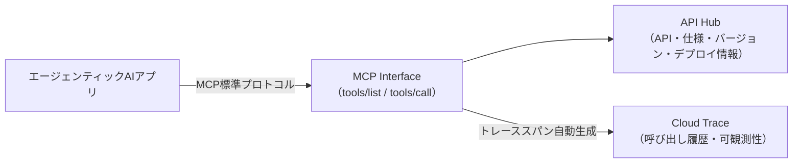
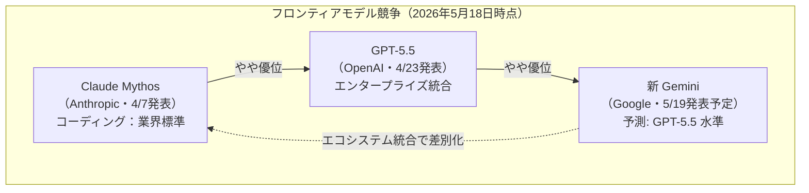
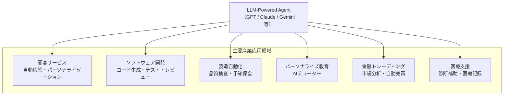
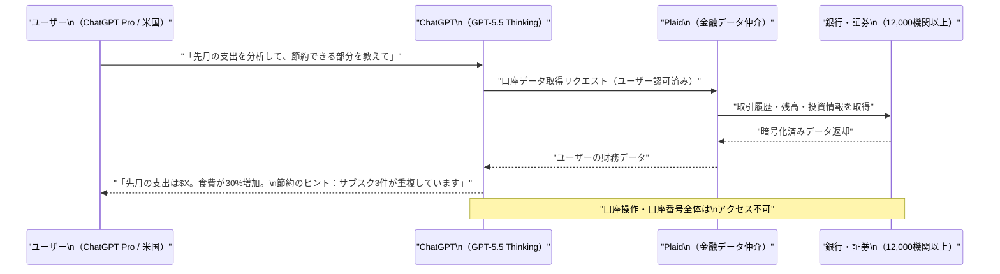

# LLM・AI Agent 最新情報レポート Vol.22

**作成日**: 2026年5月18日  
**対象期間**: 2026年5月17日〜2026年5月18日（Vol.21との差分）

---

## 目次

1. [Google Cloud・Androidアップデート](#1-google-cloudandroidアップデート)
2. [Microsoft Azure AIアップデート](#2-microsoft-azure-aiアップデート)
3. [LLM Model / AI Agentアーキテクチャ・研究](#3-llm-model--ai-agentアーキテクチャ研究)
4. [公式ブログ・論文のリサーチ・要約](#4-公式ブログ論文のリサーチ要約)
   - [Google](#41-google)
   - [OpenAI](#42-openai)
   - [Anthropic](#43-anthropic)
5. [AI Agent搭載SaaS製品情報](#5-ai-agent搭載saas製品情報)
6. [LLM/AI Agentセキュリティインシデント](#6-llmai-agentセキュリティインシデント)
7. [その他特筆すべき情報](#7-その他特筆すべき情報)
8. [参考リンク](#8-参考リンク)

---

## 1. Google Cloud・Androidアップデート

### 1.1 Vertex AI：API Hub が MCP ツールとして公開（Public Preview）

Googleの最新 Vertex AI リリースノートにて、**API Hub の読み取り専用 API が Model Context Protocol（MCP）ツールとして公開**されたことが確認された。[[1]](#ref-1)

エージェンティックAIアプリケーションが標準MCP仕様の `tools/list` および `tools/call` メソッドを通じて、API Hub 上のリソース（API・仕様・バージョン・デプロイメント）を列挙・検査できるようになる。

同リリースノートでは以下の追加アップデートも確認されている。

| 機能 | 詳細 | 状態 |
|---|---|---|
| **API Hub → MCPツール** | API HubのリソースをMCP標準で読み取り可能に | Public Preview |
| **AI.COUNT_TOKENS 関数** | テキスト入力のトークン数推定・モダリティ別内訳確認 | GA |
| **Remote MCP トレーシング** | `tools/call` 操作に自動でトレーススパンを生成し Cloud Trace と連携 | Public Preview |

**業界的意義：** API Hub と MCP の統合により、企業内の API カタログが AI エージェントの「発見可能なツール」として機能するようになる。エンタープライズエージェントが社内 API を自律的に探索・利用する基盤として注目される。

---

### 1.2 Google I/O 2026 前日（5/18）：新 Gemini モデルの競合ポジショニング分析

Google I/O 2026（5月19日 10AM PT 開始）を翌日に控えた5月17〜18日、複数のメディアが**新 Gemini モデルの競合上の位置付け**を詳細に分析・報道した。[[2]](#ref-2)[[3]](#ref-3)[[4]](#ref-4)[[5]](#ref-5)

**競合ポジショニングの核心：**

TechTimes（5月17日）は「新 Gemini は GPT-5.5 と同水準、Claude Mythos より劣後する」という業界コンセンサスを報道。一方で AndroidHeadlines は「Google が GPT-5.5 に対抗できる新 Gemini モデルを準備中」と強調しており、競合差の語り方でメディアのトーンが分かれている。

| モデル | 開発元 | 発表時期 | ポジション |
|---|---|---|---|
| **Claude Mythos** | Anthropic | 2026年4月7日 | 最先端フロンティア（コーディング業界標準） |
| **GPT-5.5** | OpenAI | 2026年4月23日 | 次点フロンティア（エンタープライズ統合） |
| **新 Gemini（予測）** | Google | 2026年5月19日発表予定 | GPT-5.5 水準と予測、エコシステム統合で差別化 |

**Google I/O 2026 で期待される Gemini 関連発表：**

| 発表候補 | 内容 |
|---|---|
| **Gemini 3.2 Flash** | 軽量高速モデル。Search・Maps・YouTube・Docs・Gmail・Chrome へ大規模展開 |
| **Gemini 3.5 Ultra** | 推論強化型プレミアムモデル（GPT-5.5 対抗） |
| **Gemini 4.0** | リリースサイクル分析では可能性は低いが、サプライズ発表の可能性も残す |
| **Gemini Omni** | テキスト・画像・動画を単一パイプラインで統合生成（UIリーク確認済み） |
| **Gemini Spark** | バックグラウンド自律実行エージェント |

**業界的意義：** Google は Gemini の絶対的な性能差よりも「Search・Maps・YouTube・Docs・Gmail・Chrome への大規模展開」、すなわち**インフラレベルの AI 統合**による差別化を打ち出す方向が見込まれる。「高性能な単一モデル」ではなく「数十億人のユーザーへ実際に届く AI」という訴求が Google の独自強みとなる。

---

## 2. Microsoft Azure AIアップデート

新情報なし（2026年5月17〜18日時点）

---

## 3. LLM Model / AI Agentアーキテクチャ・研究

### 3.1 産業応用包括調査：「LLM-Powered AI Agent Systems and Their Applications in Industry」（arXiv:2505.16120）

Guannan Liang・Qianqian Tong による調査論文「**LLM-Powered AI Agent Systems and Their Applications in Industry**」（arXiv:2505.16120、2026年5月4日最終更新）が、LLM エージェントシステムの産業応用を包括的に整理している。[[6]](#ref-6)

**論文の中心観点：**

従来のルールベース・強化学習ベースのエージェントから LLM 駆動アーキテクチャへの進化を体系化し、現代のエージェントシステムを3カテゴリに分類している。

| カテゴリ | 概要 | 代表的応用 |
|---|---|---|
| **ソフトウェアベース** | テキスト・コード・分析を主とするデジタルエージェント | 顧客サービス・ソフトウェア開発 |
| **フィジカル（ロボット）** | 物理環境で動作するロボット・自律システム | 製造自動化・倉庫ロボット |
| **アダプティブハイブリッド** | デジタル⇔フィジカルを動的に切り替えるシステム | スマートファクトリー・医療支援 |

**産業別応用の全体像：**

**論文が指摘する主要課題と解決アプローチ：**

| 課題 | 解決アプローチ |
|---|---|
| 高推論レイテンシ | モデル最適化・量子化・推論効率化 |
| 出力の不確実性 | 検証フレームワーク・人間-in-the-loop |
| 評価指標の不足 | 標準ベンチマーク整備・タスク固有評価 |
| セキュリティ脆弱性 | ロバスト評価・サンドボックス実行 |

**業界的意義：** マルチモーダル LLM の普及により、エージェントシステムがテキスト・画像・音声・構造化データを横断して処理できる段階に到達していることを改めて整理した包括的サーベイ。

---

## 4. 公式ブログ・論文のリサーチ・要約

### 4.1 Google

新情報なし（Google I/O 2026 キーノートは明日5/19 10AM PT 開始。正式発表は次号 Vol.23 で報告予定）

---

### 4.2 OpenAI

#### OpenAI、ChatGPT にパーソナルファイナンス機能をリリース（5月18日）

OpenAI が2026年5月18日、**ChatGPT Pro ユーザー（米国限定）向けにパーソナルファイナンス機能のプレビュー**をリリースした。銀行口座・投資口座と連携し AI が個人の財務状況を分析・アドバイスする機能として、既存のパーソナルファイナンス市場に直接参入するものとして注目される。[[7]](#ref-7)[[8]](#ref-8)[[9]](#ref-9)[[10]](#ref-10)

**機能概要：**

| 項目 | 詳細 |
|---|---|
| **対象ユーザー** | ChatGPT Pro（米国限定・小規模プレビュー）→ Plus → 全ユーザーへ順次拡大予定 |
| **連携技術** | Plaid 経由（Intuit 連携も近日予定）。**12,000 以上の金融機関**に対応 |
| **アクセス可能データ** | 残高・取引履歴・投資・負債（口座番号全体・操作権限へのアクセスはなし） |
| **基盤モデル** | **GPT-5.5 Thinking**（複雑な個人財務タスク向けに最適化） |
| **アクセス方法** | サイドバーの「Finances」タブ or 会話内で `@Finances、口座を接続して` と入力 |
| **注記** | 「プロの財務アドバイスの代替ではない」と明示。免責事項あり |

**業界的意義：** ChatGPT（月間アクティブユーザー8億人超）が個人の金融データと接続することで、Mint・YNAB などの既存パーソナルファイナンス市場への直接参入を意味する。一方で OpenAI が機密性の高い金融データを扱うことへのプライバシー懸念も指摘されており、「AI × 金融」領域の規制・信頼面での課題が浮き彫りとなる局面でもある。

---

### 4.3 Anthropic

新情報なし（2026年5月17〜18日時点）

---

## 5. AI Agent搭載SaaS製品情報

### 5.1 ChatGPT Finances：パーソナルファイナンス AI エージェント（5月18日）

[4.2 OpenAI](#42-openai) に詳細記載の通り、OpenAI が5月18日に ChatGPT へパーソナルファイナンス機能をリリース。[[7]](#ref-7)[[10]](#ref-10)

**既存パーソナルファイナンス SaaS への影響：**

| 既存サービス | 影響度 | 補足 |
|---|---|---|
| **Mint（Intuit）** | 中（Intuit は連携予定のため競合と協調が共存） | Plaid 経由での接続予定 |
| **YNAB** | 高（会話型 AI による予算管理が代替可能） | 価格・UX 面での比較検討が生じる |
| **Personal Capital / Empower** | 中〜高 | 投資分析機能が競合 |
| **銀行付属マネー管理機能** | 中（銀行横断的な口座対応で優位） | 複数行を一元管理できる点が差別化 |

---

## 6. LLM/AI Agentセキュリティインシデント

新情報なし（2026年5月17〜18日時点）

---

## 7. その他特筆すべき情報

### 7.1 Google I/O 2026 明日開幕：チェックポイントまとめ

明日（2026年5月19日 10:00 AM PT）より Google I/O 2026 の基調講演（Keynote）が開始される。開発者向け Keynote は同日 13:30 PT。[[3]](#ref-3)[[5]](#ref-5)

**タイムライン：**

| 日時（PT） | セッション |
|---|---|
| **5/19 10:00 AM** | Google Keynote（Sundar Pichai 登壇予定） |
| **5/19 1:30 PM** | Developer Keynote |
| **5/19〜20** | セッション・ハンズオンラボ・デモ |

**注目ポイント（未発表）：**

1. 新 Gemini モデル（Gemini 3.2 Flash / 3.5 / 4.0 のいずれか）の性能と競合差の明確化
2. **Gemini Omni**（テキスト・画像・動画統合生成）の正式発表
3. **Android XR グラス** のスタンドアロン AR/XR ハードウェアプレビュー
4. **Google Agent Development Kit（ADK）v2** - エージェント開発者向け大型アップデートの可能性

次号 Vol.23 にて Google I/O 2026 の発表内容を完全カバー予定。

---

## 8. 参考リンク

**[1]** [Vertex AI release notes | Google Cloud Documentation](https://docs.cloud.google.com/vertex-ai/docs/release-notes)

**[2]** [Google I/O 2026 Keynote Opens Tuesday as New Gemini Lands Behind Mythos and GPT-5.5 | TechTimes](https://www.techtimes.com/articles/316755/20260517/google-i-o-2026-keynote-opens-tuesday-new-gemini-lands-behind-mythos-gpt-55.htm)

**[3]** [Google I/O 2026: Gemini 4.0, XR Glasses, Omni, and AI Agents — Everything Coming on May 19 | AIxploria](https://www.aixploria.com/en/ai-radar/google-io-2026-gemini-announcements-preview/)

**[4]** [Google May Launch New Gemini Model at I/O Event to Tackle OpenAI's GPT-5.5 | AndroidHeadlines](https://www.androidheadlines.com/2026/05/google-io-new-gemini-model-launch-gpt-5-5-rival.html)

**[5]** [Google I/O 2026: Gemini Intelligence, Googlebooks, Android XR glasses, and what to expect from the keynote | The Next Web](https://thenextweb.com/news/google-io-2026-gemini-intelligence-android-xr-glasses)

**[6]** [LLM-Powered AI Agent Systems and Their Applications in Industry | arXiv:2505.16120](https://arxiv.org/abs/2505.16120)

**[7]** [OpenAI Launches ChatGPT Personal Finance Service For Pro Users | Dataconomy](https://dataconomy.com/2026/05/18/chatgpt-personal-finance-service-pro-users/)

**[8]** [OpenAI Launches Personal Finance Experience in ChatGPT for Pro Users in the US | gHacks Tech News](https://www.ghacks.net/2026/05/18/openai-launches-personal-finance-experience-in-chatgpt-for-pro-users-in-the-us/)

**[9]** [ChatGPT Can Now Connect to Your Financial Accounts for Budgeting Advice | MacRumors](https://www.macrumors.com/2026/05/15/chatgpt-personal-finance/)

**[10]** [ChatGPT's Personal Finance Test Is Rolling Out in the U.S.—With a Major Warning Label | Inc.](https://www.inc.com/lucia-auerbach/chatgpts-personal-finance-test-is-rolling-out-in-the-u-s-with-a-major-warning-label/91346331)
