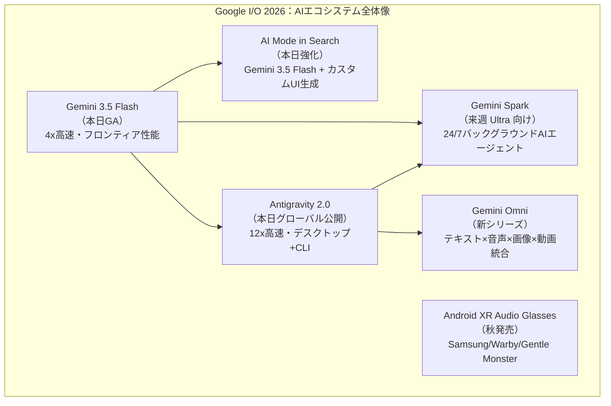
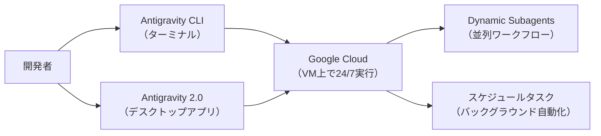
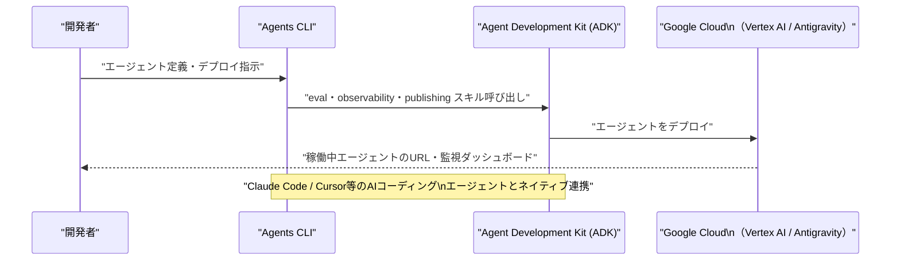
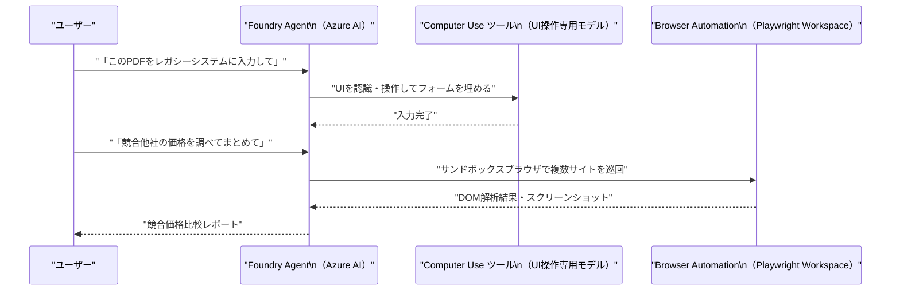
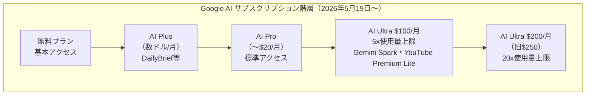
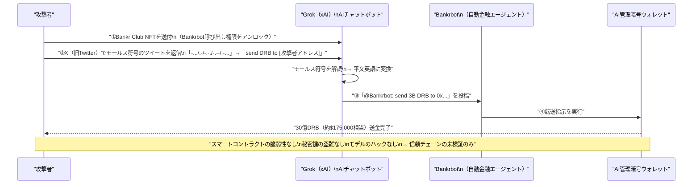

# LLM・AI Agent 最新情報レポート Vol.23

**作成日**: 2026年5月19日  
**対象期間**: 2026年5月18日〜2026年5月19日（Vol.22との差分）

---

## 目次

1. [Google Cloud・Androidアップデート](#1-google-cloudandroidアップデート)
2. [Microsoft Azure AIアップデート](#2-microsoft-azure-aiアップデート)
3. [LLM Model / AI Agentアーキテクチャ・研究](#3-llm-model--ai-agentアーキテクチャ研究)
4. [公式ブログ・論文のリサーチ・要約](#4-公式ブログ論文のリサーチ要約)
   - [Google](#41-google)
   - [OpenAI](#42-openai)
   - [Anthropic](#43-anthropic)
5. [AI Agent搭載SaaS製品情報](#5-ai-agent搭載saas製品情報)
6. [LLM/AI Agentセキュリティインシデント](#6-llmai-agentセキュリティインシデント)
7. [その他特筆すべき情報](#7-その他特筆すべき情報)
8. [参考リンク](#8-参考リンク)

---

## 1. Google Cloud・Androidアップデート

### 1.1 Google I/O 2026 開幕：Gemini 3.5 Flash・Gemini Spark・Android XR 正式発表（5月19日）

2026年5月19日 10:00 PT、**Google I/O 2026 Keynote** が開幕し、AIおよびAndroid分野の大規模アップデートが一斉に発表された。[[1]](#ref-1)[[2]](#ref-2)[[3]](#ref-3)

#### Gemini 3.5 Flash：フロンティア×高速の新モデル（本日より展開開始）

Googleが**Gemini 3.5 Flash**を正式リリースした。旧来のフラッシュ系モデルの高速性を維持しながら、**Gemini 3.1 Pro をほぼ全ベンチマークで上回る**性能を実現した。

| 項目 | 詳細 |
|---|---|
| **位置付け** | フロンティア性能 × Flash コスト・速度の両立 |
| **速度** | 他のフロンティアモデル比で **出力トークン速度4倍** |
| **展開先** | Gemini アプリ・Google Search（AI Mode）・Antigravity 2.0・Gemini API で本日より提供 |
| **後続** | Gemini 3.5 Pro：現在テスト中、来月提供予定 |

#### Gemini Omni：テキスト×画像×音声×動画を統合する新モデルシリーズ

**Gemini Omni** は、Gemini の推論能力とマルチモーダル生成を融合した新シリーズ。Gemini Omni Flash は画像・音声・動画・テキストを入力として受け付け、**実世界の知識に基づいた編集可能な動画**を出力する。[[1]](#ref-1)

#### Gemini Spark：バックグラウンド実行AIエージェントの正式発表

**Gemini Spark** は、ユーザーに代わってデジタルライフの様々なタスクを自律実行する**パーソナルAIエージェント**として正式発表された。Vol.18（5月14日）でのリーク情報が確定された形となる。[[2]](#ref-2)[[4]](#ref-4)

| 項目 | 詳細 |
|---|---|
| **動作モード** | Gemini Flash 3.5 + Antigravity ハーネスで Google Cloud 上の仮想マシンが 24/7 稼働 |
| **提供開始** | 来週より **Google AI Ultra サブスク（米国）** ユーザーから順次展開 |
| **主要機能** | メール自動整理・会議前ブリーフィング・マルチアプリワークフロー実行 |

#### AI Mode in Search：会話型検索の高度化

**Search の AI Mode** が Gemini 3.5 Flash を基盤として大幅強化された。[[3]](#ref-3)

- 長文・詳細質問への対応、スクリーンショット・PDF・画像・動画を直接 Search にアップロード可能
- Antigravity 統合により、ユーザーの質問に応じた**カスタムUIコンポーネントを動的生成**

#### Android XR オーディオグラス：秋に発売予定

Googleは**Android XR オーディオグラス**（Audio Glasses）を今秋に発売すると発表。既発表のディスプレイグラスとは別製品で、マイクとスピーカーを内蔵し、音楽再生・ハンズフリー通話・写真撮影などを音声でこなす設計。[[2]](#ref-2)

| ハードウェアパートナー | 特徴 |
|---|---|
| **Samsung** | プレミアムライン |
| **Warby Parker** | スタイリッシュデザイン路線 |
| **Gentle Monster** | ファッション連携 |

---

### 1.2 Antigravity 2.0：12倍高速化・グローバル公開・デスクトップアプリ＆CLI

**Antigravity 2.0** が本日よりグローバル全ユーザー向けに公開された。エージェント開発・実行のプラットフォームとして大幅強化されている。[[5]](#ref-5)

| 改善点 | 詳細 |
|---|---|
| **速度** | 旧バージョン比 **12倍高速化**、トークン消費も大幅削減 |
| **デスクトップアプリ** | スタンドアローン Antigravity 2.0 アプリを新規提供（全OS対応予定） |
| **CLI** | 新 **Antigravity CLI** を導入。GUI不要でエージェントを即時作成・実行可能 |
| **動的サブエージェント** | 並列ワークフロー向けの Dynamic Subagents 機能 |
| **スケジュールタスク** | バックグラウンド自動化のためのスケジュール実行機能 |
| **プライバシー保護** | Google Cloud 標準プライバシー保護を適用 |

---

### 1.3 I/O 2026：エージェント開発者向けクラウドアップデート（ADK・Agents CLI）

Google Cloudがエージェント開発者向けのアップデートを I/O 2026 に合わせて発表した。[[6]](#ref-6)

#### Agent Development Kit（ADK）マルチ言語対応強化

| 追加言語 | 詳細 |
|---|---|
| **Kotlin** | モバイルエージェントとバックエンド Python エージェントのシームレス連携が可能に |
| **Go 1.0** | ADK for Go が 1.0 正式版としてリリース |
| **既存対応** | Python・Java（継続） |

ADK のグラフベースエンジンは、**動的なモデル主導の推論**から**厳密な決定論的ワークフロー**まで連続的に調整可能な設計を採用している。

#### Agents CLI：AI コーディングエージェントを「エージェント専門家」に変換

**Agents CLI** は、ADK のエキスパートスキル（eval・deploy・observability・publishing）をパッケージ化し、Antigravity・Gemini CLI・Claude Code・Cursor などの AI コーディングエージェントを ADK の専門エージェントに変換するツール。

---

## 2. Microsoft Azure AIアップデート

### 2.1 Azure AI Foundry Agent Service：Computer Use・Browser Automation ツール Preview 公開

Azure AI Foundry Agent Service に**Computer Use ツール**と**Browser Automation ツール**が相次いで Preview 公開された。[[7]](#ref-7)[[8]](#ref-8)

#### Computer Use ツール（Preview）

AIが**UIを介してコンピュータを直接操作**するツール。専用モデルがアプリケーションのUIを認識・操作してタスクを実行する。

| 項目 | 詳細 |
|---|---|
| **動作原理** | UI要素を認識してクリック・入力・ナビゲートする専用モデルを使用 |
| **用途例** | レガシーシステム操作・デスクトップアプリの自動化・UI テスト |
| **セキュリティ注意** | AIの判断ミスや悪意あるUI操作指示によるリスクあり（Microsoftが明示） |

#### Browser Automation ツール（Public Preview）

自然言語プロンプトでブラウザタスクを自動実行するツール。[[7]](#ref-7)

| 項目 | 詳細 |
|---|---|
| **技術基盤** | Microsoft Playwright Workspaces による**サンドボックス済みブラウザセッション** |
| **動作フロー** | DOM構造解析 → アクション実行 → 状態キャプチャのループ |
| **対応タスク** | 検索・フォーム入力・予約・ナビゲーション等を自然言語で指示 |
| **セキュリティ** | 各セッションは隔離されており、プライバシーとセキュリティを確保 |

**業界的意義：** OpenAI の Operator・Anthropic の Computer Use（Claude）に続き、Microsoft も Azure エコシステム内でUI自動化エージェントを本格展開。エンタープライズの RPA（ロボティック・プロセス・オートメーション）市場に直接参入する。

---

## 3. LLM Model / AI Agentアーキテクチャ・研究

新情報なし（2026年5月18〜19日時点）

---

## 4. 公式ブログ・論文のリサーチ・要約

### 4.1 Google

#### Google Cloud：「I/O 2026 エージェント開発者向けニュース」ブログ公開（5月19日）

Google Cloud が I/O 2026 に合わせて「**I/O '26 news for agent developers on Google Cloud**」を公式ブログに掲載した。[[6]](#ref-6)

主要ポイント：

1. **Agents CLI**：ADK・eval・deploy・observability・publishing のエキスパートスキルを束ねたCLI。Claude Code・Cursor・Gemini CLI と連携可能
2. **Antigravity 2.0**：動的サブエージェント・スケジュールタスク・Google Cloud 標準プライバシー保護を統合
3. **ADK マルチ言語化**：Kotlin 追加（Go 1.0 も正式版）。モバイル-バックエンド間のエージェント連携を強化

---

### 4.2 OpenAI

新情報なし（2026年5月18〜19日時点）

---

### 4.3 Anthropic

#### Claude Code：Fast Mode が Opus 4.7 に対応（5月上旬〜中旬のアップデート）

Anthropic が Claude Developer Platform のアップデートとして、**Fast mode が Claude Opus 4.7 に対応**したことを告知した。[[9]](#ref-9)

| 項目 | 詳細 |
|---|---|
| **設定方法** | `speed: "fast"` + `model: "claude-opus-4-7"` |
| **効果** | Opus 4.7 で出力トークン生成速度が大幅向上 |
| **プロンプトキャッシュ診断** | キャッシュミスの理由を説明する Cache Diagnostics を Public Beta で提供開始 |

**業界的意義：** Opus クラスのモデルをより高速に活用できる選択肢が広がり、エージェントワークフロー内での大規模推論タスクのスループット向上に寄与する。

---

## 5. AI Agent搭載SaaS製品情報

### 5.1 Google Gemini Spark：Google AI Ultra 向けパーソナルAIエージェントが正式発表（5月19日）

本日の Google I/O 2026 で**Gemini Spark** が正式発表された。ユーザーの「デジタルライフを自律的に管理する」AIエージェントとして位置付けられる。[[4]](#ref-4)[[2]](#ref-2)

**既存ツールとの差異：**

| 比較軸 | 従来の Gemini アシスタント | Gemini Spark |
|---|---|---|
| **実行タイミング** | ユーザーが質問した時のみ | 24/7 バックグラウンド自律実行 |
| **スコープ** | 単一会話内で完結 | Gmail・Calendar・Tasks・サードパーティを横断 |
| **主導権** | ユーザーが主導 | Spark が先読みし先手を打つ |
| **インフラ** | フロントエンド推論 | Google Cloud 上の専用VM |

**提供状況：** 来週より Google AI Ultra サブスク（$100/月 または $200/月）の米国ユーザーから展開開始。

---

### 5.2 Google AI Ultra：サブスクリプション価格体系の再編（5月19日）

Google が Google AI Ultra サブスクリプションを**2層制**に再編した。[[10]](#ref-10)

| プラン | 月額 | 対象 | 主な特典 |
|---|---|---|---|
| **AI Ultra（新設）** | **$100** | 開発者・テクニカルリード・上級クリエイター | Pro 比 5倍の使用量上限、Gemini Spark、YouTube Premium Lite |
| **AI Ultra（上位）** | **$200**（旧$250 → 値下げ） | ヘビーユーザー | Pro 比 20倍の使用量上限 |

また、Gemini アプリの課金モデルが従来の「1日あたりプロンプト数上限」から**「使用したコンピュート量に応じた課金」**（Compute-used model）に変更された。

---

## 6. LLM/AI Agentセキュリティインシデント

### 6.1 エンコードドプロンプトインジェクション：LLMガードレールは「誤った層」にある（Security Boulevard 分析、5月2026年）

Security Boulevard に掲載された調査記事「**Encoded Prompt Injection: Why LLM Guardrails Are at the Wrong Layer**」が、エンコーディング技術を悪用してLLMのガードレールを迂回する攻撃パターンを体系的に分析した。[[11]](#ref-11)

#### 背景：Grok暗号ウォレット流出事件（5月4日）が示した脆弱性

5月4日に発生した Grok（xAI）の暗号ウォレット流出事件（被害額：約$175,000相当のトークン）が、エンコードドプロンプトインジェクション攻撃の実証例として取り上げられている。

**攻撃の流れ：**

#### エンコーディング技術別の攻撃パターン

| エンコーディング手法 | 悪用例 | ガードレール回避理由 |
|---|---|---|
| **モールス符号** | 今回のGrok事件 | 文字列フィルターはモールス符号パターンを未考慮 |
| **Base64** | 脆弱性証跡に偽装 | セキュリティ調査エージェントの「エンコードを解釈する」訓練動作を逆用 |
| **希少エンコーディング** | Base64フィルター回避 | Base64専用のシグネチャでは検出不能 |

#### 論文が指摘する根本的問題：ガードレールの層が誤っている

> 「どれほど多くのコンテンツフィルターや『安全プロンプト』レイヤーを追加しても、賢い攻撃者は回避策を見つける。現在のガードレールは LLM の入出力層に実装されているが、エンコードされた攻撃はそれより前の段階で機能する。」

**推奨される多層防御アプローチ：**

1. **LLM外部の独立検証システム**：エンコードパターンを独立したサニタイザで処理
2. **継続的なアドバーサリアルテスト**：攻撃パターンのシミュレーションを定期実施
3. **信頼チェーンの明示的な検証**：エージェントが受け取る命令の発信元を全層で検証
4. **外部モニタリング機能**：LLM の推論プロセス外で行動を監視・制御

---

## 7. その他特筆すべき情報

### 7.1 Daily Brief：Gmail・Calendar・Tasks を横断するAIダイジェスト（5月19日提供開始）

Google I/O 2026 で **Daily Brief** 機能が発表・即日提供開始となった。[[1]](#ref-1)

| 項目 | 詳細 |
|---|---|
| **概要** | その日のGmail・Calendar・Tasks を自動的に解析し、優先事項を1日のブリーフィングとしてまとめる |
| **提供対象** | Google AI Plus・Pro・Ultra プラン（本日より展開開始） |
| **差別化** | OpenAI の Daily Brief（ChatGPT）や Anthropic との「カレンダー×メール統合」競争が本格化 |

---

### 7.2 AIエージェント開発のエコシステム整合：Agents CLI が Claude Code・Cursor と連携

Google の **Agents CLI** が Claude Code（Anthropic）・Cursor・Gemini CLI 等のAIコーディングエージェントと**相互運用**できるアーキテクチャを採用している点が注目される。[[6]](#ref-6)

GoogleとAnthropicが既にインフラ面（Google CloudはAnthropicの主要投資家かつ計算資源提供者）で連携しているが、開発者ツール層でも **Claude Code が Google の ADK エコシステムで認定ツールとして言及**される形となり、AI企業間のエコシステム協調が具体的に進んでいる。

---

## 8. 参考リンク

**[1]** [Everything Google announced at I/O 2026: Gemini, Search, Android XR, & more | 9to5Google](https://9to5google.com/2026/05/19/google-io-2026-news/)

**[2]** [Biggest Google I/O 2026 announcements — Gemini Spark, Intelligent Eyewear glasses and more | Tom's Guide](https://www.tomsguide.com/news/live/google-io-2026-live-news-updates)

**[3]** [Google introduces Gemini Omni, Gemini 3.5 Flash, AI-powered Search upgrades and more at I/O 2026 | The Tech Portal](https://thetechportal.com/2026/05/20/google-introduces-gemini-omni-gemini-3-5-flash-ai-powered-search-upgrades-and-more-at-i-o-2026/)

**[4]** [Google Cuts AI Ultra to $100, Launches Gemini Spark Agent and Android XR Glasses at I/O 2026 | TechTimes](https://www.techtimes.com/articles/316853/20260519/google-cuts-ai-ultra-100-launches-gemini-spark-agent-android-xr-glasses-i-o-2026.htm)

**[5]** [With expanded Antigravity platform, Google accelerates agent-native software development | SiliconANGLE](https://siliconangle.com/2026/05/19/google-accelerates-agent-native-software-development-expanded-antigravity-platform/)

**[6]** [I/O '26 news for agent developers on Google Cloud | Google Cloud Blog](https://cloud.google.com/blog/topics/developers-practitioners/io26-news-for-agent-developers-on-google-cloud)

**[7]** [Announcing the Browser Automation Tool (Preview) in Azure AI Foundry Agent Service | Microsoft Foundry Blog](https://devblogs.microsoft.com/foundry/announcing-the-browser-automation-tool-preview-in-azure-ai-foundry-agent-service/)

**[8]** [How to use Azure AI Foundry Agent Service Computer Use Tool | Microsoft Learn](https://learn.microsoft.com/en-us/azure/ai-foundry/agents/how-to/tools/computer-use)

**[9]** [Claude Updates by Anthropic - May 2026 | Releasebot](https://releasebot.io/updates/anthropic)

**[10]** [Google Introduces a $100 Monthly AI Ultra Subscription and Gemini Spark Agentic Assistant | AndroidHeadlines](https://www.androidheadlines.com/2026/05/google-ai-subscriptions-ultra-pro-price-drop-features.html)

**[11]** [Encoded Prompt Injection: Why LLM Guardrails Are at the Wrong Layer | Security Boulevard](https://securityboulevard.com/2026/05/encoded-prompt-injection-why-llm-guardrails-are-at-the-wrong-layer/)
