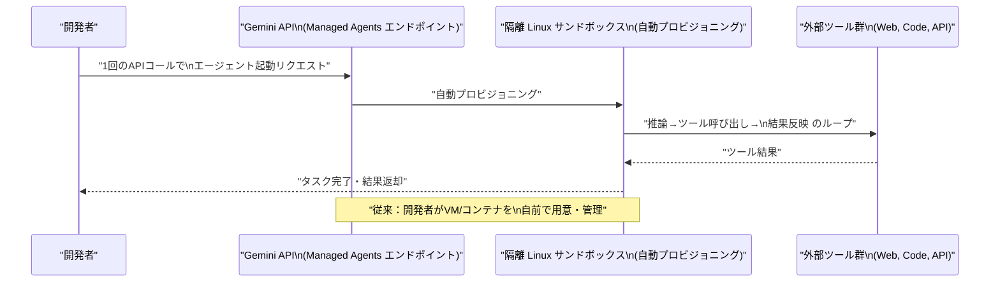
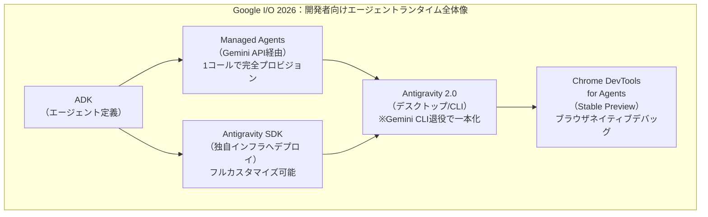
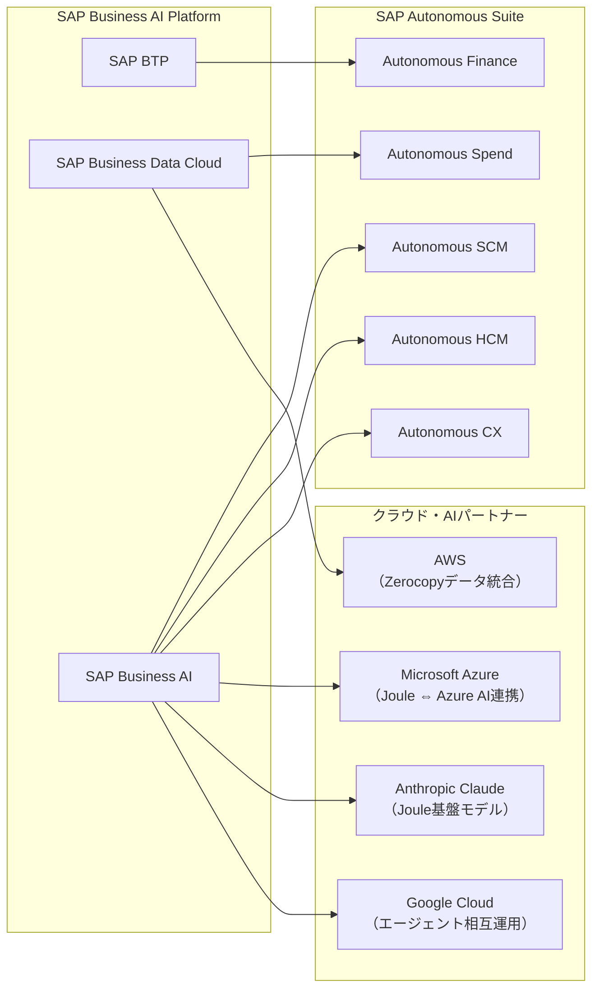
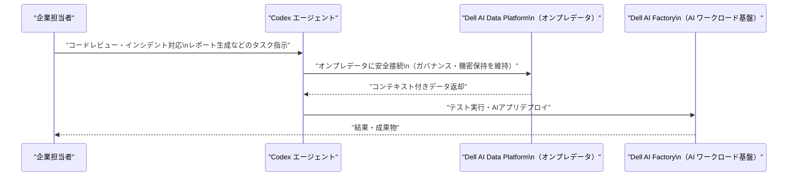
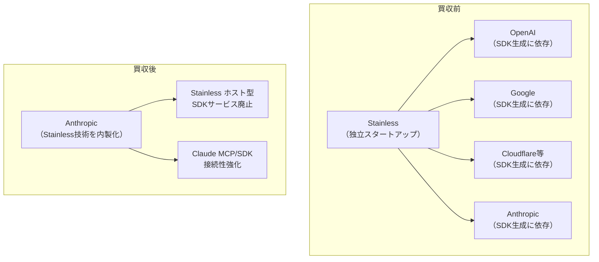
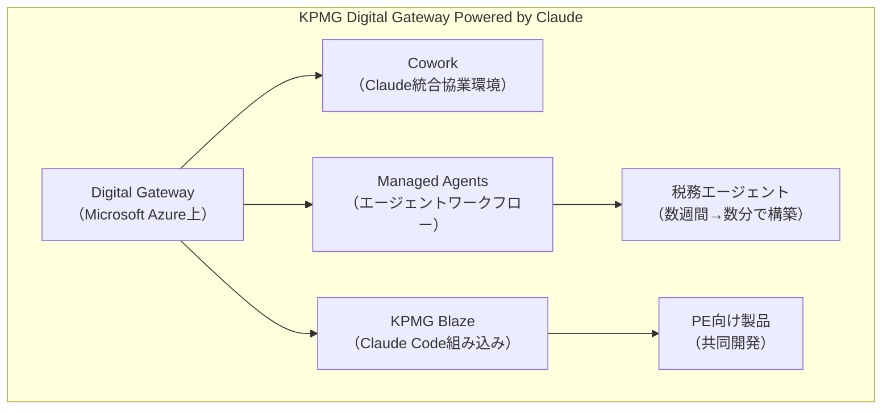
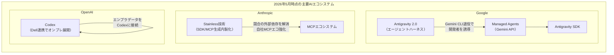

# LLM・AI Agent 最新情報レポート Vol.24

**作成日**: 2026年5月20日  
**対象期間**: 2026年5月19日〜2026年5月20日（Vol.23との差分）

---

## 目次

1. [Google Cloudアップデート](#1-google-cloudアップデート)
2. [Microsoft Azure AIアップデート](#2-microsoft-azure-aiアップデート)
3. [LLM Model / AI Agentアーキテクチャ・研究](#3-llm-model--ai-agentアーキテクチャ研究)
4. [公式ブログ・論文のリサーチ・要約](#4-公式ブログ論文のリサーチ要約)
   - [Google](#41-google)
   - [OpenAI](#42-openai)
   - [Anthropic](#43-anthropic)
5. [AI Agent搭載SaaS製品情報](#5-ai-agent搭載saas製品情報)
6. [LLM/AI Agentセキュリティインシデント](#6-llmai-agentセキュリティインシデント)
7. [その他特筆すべき情報](#7-その他特筆すべき情報)
8. [参考リンク](#8-参考リンク)

---

## 1. Google Cloudアップデート

### 1.1 Google I/O 2026 Developer Keynote：Managed Agents・Antigravity SDK・Chrome DevTools for Agents 詳報（5月19〜20日）

Vol.23 でカバーしたメインキーノートに続き、**I/O 2026 Developer Keynote** では開発者向けの詳細な機能群が発表された。[[1]](#ref-1)[[2]](#ref-2)[[3]](#ref-3)

#### Managed Agents in Gemini API：インフラ不要の1コールエージェント

**Managed Agents** は、Antigravity エージェントハーネスを **Gemini API 経由で利用できる新機能**。従来はエージェント実行環境を自前で構築する必要があったが、単一の API コールで「完全にプロビジョニングされたエージェント＋リモートサンドボックス」が即時起動する。[[1]](#ref-1)

| 特性 | 詳細 |
|---|---|
| **起動方法** | 単一 API コール |
| **実行環境** | 隔離された Linux 環境（サンドボックス） |
| **機能** | 推論・サードパーティツール使用・コード実行 |
| **用途** | プロトタイプから本番まで、インフラ不要で即時利用 |

#### Antigravity SDK：エージェントハーネスへのプログラマティックアクセス

**Antigravity SDK** が新たにリリースされ、Antigravity のエージェントハーネス（Google 自社プロダクトを動かすのと同じ基盤）に**プログラムからフルアクセス**できるようになった。[[2]](#ref-2)[[3]](#ref-3)

- Google 製品が利用するのと同一のエージェントハーネスを開発者が直接操作可能
- Gemini モデル向けに最適化済みで、カスタムエージェント挙動を定義し、**自前インフラにデプロイ**することが可能
- Managed Agents（Google Cloud 上で実行）か、SDK（独自インフラで実行）か、用途に合わせて選択可能

#### Chrome DevTools for Agents：ブラウザネイティブのエージェントデバッグ

**Chrome DevTools for Agents** が Stable チャンネルの Preview として出荷された。[[1]](#ref-1)

- ブラウザ上で動作する AI エージェントの推論フロー・ツール呼び出し・状態遷移を可視化してデバッグ可能
- エージェント開発のデバッグループがブラウザ完結になる

#### Gemini CLI：I/O 2026 をもって正式退役

**Gemini CLI** が I/O 2026 をもって**正式に退役（retirement）**され、Antigravity 2.0 / Antigravity CLI に一本化された。[[3]](#ref-3) これにより Google のエージェントネイティブな開発体験が Antigravity に集約される形となる。

---

## 2. Microsoft Azure AIアップデート

### 2.1 SAP Sapphire 2026：SAP × Azure の AI エージェント連携強化（5月2026年）

SAP Sapphire 2026 において、**Microsoft Azure と SAP が AI エージェント連携の深化**を発表した。[[4]](#ref-4)[[5]](#ref-5)

SAP は新たに発表した **SAP Business AI Platform** の中で、**Joule エージェントと外部エージェントフレームワーク間の双方向エージェント間連携（agent-to-agent interoperability）** を実現する戦略を明示し、Azure AI Agents との相互運用を発表した。

| 連携内容 | 詳細 |
|---|---|
| **SAP × Azure AI** | Joule エージェントと Azure AI エージェントフレームワークの双方向連携 |
| **SAP Business Data Cloud × Azure** | Amazon Athena との Zerocopy データ統合（マルチクラウドでのデータアクセス） |
| **SAP Autonomous Suite** | Finance・Spend・SCM・HCM・CX の5領域で200以上のエージェントを提供予定 |
| **Autonomous Close Assistant** | 財務クローズプロセスを「週単位→日単位」に短縮するエージェント |

**業界的意義：** SAP という ERP 大手が「AI エージェントが業務全体を自律実行する」ビジョン（Autonomous Enterprise）を掲げ、Azure・Anthropic・Google・AWS との連携で具体化した。SaaS/ERP 分野での AI エージェント普及が加速する。

---

## 3. LLM Model / AI Agentアーキテクチャ・研究

新情報なし（2026年5月19〜20日時点）

---

## 4. 公式ブログ・論文のリサーチ・要約

### 4.1 Google

#### I/O 2026 Developer Keynote ブログ公開（5月19〜20日）

Google Developers Blog に「**All the news from the Google I/O 2026 Developer keynote**」が公開された。[[1]](#ref-1)[[2]](#ref-2)

主要ポイント：

1. **Managed Agents（Gemini API）**：単一APIコールでエージェントを完全プロビジョニング
2. **Antigravity SDK**：ハーネスのプログラマティック制御・独自インフラデプロイ
3. **Chrome DevTools for Agents**：ブラウザネイティブのエージェントデバッグツール（Stable Preview）
4. **Gemini CLI 退役**：Antigravity 系ツールへ一本化

---

### 4.2 OpenAI

#### OpenAI × Dell Technologies：Codex をオンプレミス・ハイブリッド環境に展開（5月19日）

OpenAI と Dell Technologies が**Codex のハイブリッド／オンプレミス展開に向けた協業**を発表した。[[6]](#ref-6)[[7]](#ref-7)

| 項目 | 詳細 |
|---|---|
| **発表日** | 2026年5月19日 |
| **Codex の利用状況** | 週間利用開発者数：400万人超 |
| **展開先** | Dell AI Data Platform（オンプレのデータを Codex に接続） |
| **技術範囲** | Dell AI Factory との連携探索（データ準備・システム管理・テスト・AIデプロイ） |
| **主な価値** | 機密性の高いオンプレデータを外部に出さずに Codex を活用可能 |

**背景：** Codex はソフトウェア開発ライフサイクル全体（コードレビュー・テストカバレッジ・インシデント対応・リポジトリ横断推論）だけでなく、レポート作成・リード選定・業務調整など**知識労働領域**にも拡大しつつあり、Dell 環境でのエンタープライズ活用を加速させる狙いがある。

---

### 4.3 Anthropic

#### Anthropic、Stainless を約300億円超で買収：SDK・MCP サーバー生成インフラを内製化（5月18〜20日）

Anthropic が SDK・CLI・MCP サーバー生成ツールを提供するスタートアップ **Stainless** を買収した。買収額は **3億ドル超**と報じられている。[[8]](#ref-8)[[9]](#ref-9)[[10]](#ref-10)

| 項目 | 詳細 |
|---|---|
| **発表日** | 2026年5月18〜19日 |
| **Stainless の創業** | 2022年（元 Stripe エンジニア Alex Rattray） |
| **主要機能** | API スペックから TypeScript・Python・Go・Java 等の SDK/CLI/MCP サーバーを自動生成 |
| **主要顧客（旧）** | OpenAI・Google・Cloudflare 等（競合他社も含む） |
| **買収後** | Stainless のホスト型 SDK 生成サービスは**廃止**（既存顧客はSDKの所有権と改変権を維持） |

**戦略的意義：**

1. **競合の SDK インフラを内製化**：OpenAI や Google が依存していた SDK 生成ツールが Anthropic 傘下に入り、競合他社の依存関係が消滅
2. **AI エージェント接続性の強化**：Stainless の技術を活用して Claude がより多くの外部データソース・ツールと連携できるよう強化
3. **MCP エコシステムの拡大**：MCP（Model Context Protocol）サーバー生成の自動化基盤を確保

---

#### Anthropic × KPMG：276,000人超の従業員に Claude を展開するグローバルアライアンス締結（5月19日）

Anthropic と KPMG が**グローバル戦略アライアンス**を締結し、**KPMG Digital Gateway Powered by Claude** を発表した。[[11]](#ref-11)[[12]](#ref-12)

| 項目 | 詳細 |
|---|---|
| **発表日** | 2026年5月19日 |
| **対象従業員数** | KPMG グローバル **276,000人超** |
| **プラットフォーム** | KPMG Digital Gateway（Microsoft Azure 上に構築） |
| **初期フォーカス** | タックスクライアント・プライベートエクイティ企業向けサービス |
| **Claude Code 活用** | KPMG Blaze：Claude Code を組み込み、クライアントの IT モダナイゼーションを加速 |

**技術的特徴：**

- Digital Gateway に **Cowork** および **Managed Agents** を統合し、**エージェントワークフローをリアルタイムで構築**可能
- 従来：税制変更対応のAIエージェント構築に「**数週間**」が必要→ 新環境では「**数分**」で同等機能を実現
- Anthropic は KPMG を**プライベートエクイティ分野の優先パートナー**に指定し、PE ポートフォリオ企業向け製品を共同開発

**業界的意義：** Big Four 監査法人の一角が全グローバル従業員への Claude 展開を決定。監査・税務・コンサルティングといった**知識集約型プロフェッショナルサービス**における AI エージェント活用が本格化する象徴的な事例となった。

---

## 5. AI Agent搭載SaaS製品情報

### 5.1 SAP Sapphire 2026：「Autonomous Enterprise」ビジョンと SAP Business AI Platform 発表

SAP CEO Christian Klein が SAP Sapphire 2026 で**Autonomous Enterprise**（エージェントが業務全体を自律実行する企業）ビジョンを発表し、**SAP Business AI Platform** を正式公開した。[[4]](#ref-4)[[5]](#ref-5)

#### SAP Business AI Platform の構成

SAP Business Technology Platform（BTP）・SAP Business Data Cloud・SAP Business AI を **単一のガバナンス済み環境** に統合。

#### SAP Autonomous Suite：5領域で200以上のエージェント

| 領域 | 内容 |
|---|---|
| **Autonomous Finance** | Autonomous Close Assistant（財務クローズを週→日単位に短縮）、仕訳・照合・エラー解決を自動化 |
| **Autonomous Spend** | 調達・経費管理の自動化 |
| **Autonomous Supply Chain Management** | サプライチェーン計画・実行の自動化 |
| **Autonomous HCM** | 人事プロセスの自動化（Joule エージェント） |
| **Autonomous CX** | 顧客体験の自動化 |

#### 特筆すべき点：機関知識（Institutional Knowledge）の AI 注入

SAP のエージェントは**7,000以上のビジネスプロセス・700万以上のデータフィールド**をナビゲートする能力を持ち、実行前に**ID・アクセス権の検証**を行うことでガバナンスを担保する。

---

## 6. LLM/AI Agentセキュリティインシデント

新情報なし（2026年5月19〜20日時点）

---

## 7. その他特筆すべき情報

### 7.1 開発者ツールエコシステムの再編：Google・Anthropic・OpenAI が相次いでインフラ垂直統合

2026年5月19〜20日の発表を横断すると、主要 AI 企業が**エージェント開発インフラの垂直統合**を加速しているパターンが鮮明になる。

| 企業 | アクション | 目的 |
|---|---|---|
| **Google** | Gemini CLI 退役→Antigravity 2.0 一本化、Antigravity SDK/Managed Agents 提供 | エージェントランタイムを Google Cloud に集約 |
| **Anthropic** | Stainless（SDK/MCP生成基盤）買収・ホスト型サービス廃止 | SDK・MCP インフラを Claude エコシステムに内製化 |
| **OpenAI** | Dell との Codex オンプレ展開協業 | 機密データを持つエンタープライズへの浸透 |

この垂直統合の流れにより、**中立的な AI インフラ（Stainless 等）が縮小し、各社のエコシステムへの囲い込み**が進行している。開発者・企業ユーザーは SDK・エージェントハーネスの選択が特定ベンダーへの依存に直結するリスクを意識し始めている。

---

## 8. 参考リンク

**[1]** [All the news from the Google I/O 2026 Developer keynote | Google Developers Blog](https://developers.googleblog.com/all-the-news-from-the-google-io-2026-developer-keynote/)

**[2]** [I/O 2026 developer highlights: Antigravity, Gemini API, AI Studio | Google Blog](https://blog.google/innovation-and-ai/technology/developers-tools/google-io-2026-developer-highlights/)

**[3]** [Google Launches Antigravity 2.0 at I/O 2026: A Standalone Agent-First Platform with CLI, SDK, Managed Execution, and Enterprise Support | MarkTechPost](https://www.marktechpost.com/2026/05/19/google-launches-antigravity-2-0-at-i-o-2026-a-standalone-agent-first-platform-with-cli-sdk-managed-execution-and-enterprise-support/)

**[4]** [2026 SAP Sapphire Keynote: Powering the Autonomous Enterprise | SAP News Center](https://news.sap.com/2026/05/sap-sapphire-keynote-business-ai-platform-power-autonomous-enterprise/)

**[5]** [Advancing enterprise AI: New SAP on Azure announcements from SAP Sapphire 2026 | Microsoft Azure Blog](https://azure.microsoft.com/en-us/blog/advancing-enterprise-ai-new-sap-on-azure-announcements-from-sap-sapphire-2026/)

**[6]** [OpenAI and Dell Technologies partner to bring Codex to hybrid and on-premises enterprise environments | OpenAI](https://openai.com/index/dell-codex-enterprise-partnership/)

**[7]** [OpenAI and Dell Bring Codex Closer to Enterprise Data | Winbuzzer](https://winbuzzer.com/2026/05/19/openai-and-dell-bring-codex-closer-to-enterprise-data-xcxwbn/)

**[8]** [Anthropic acquires Stainless | Anthropic](https://www.anthropic.com/news/anthropic-acquires-stainless)

**[9]** [Anthropic has acquired the dev tools startup used by OpenAI, Google, and Cloudflare | TechCrunch](https://techcrunch.com/2026/05/18/anthropic-has-acquired-the-dev-tools-startup-used-by-openai-google-and-cloudflare/)

**[10]** [Anthropic's Stainless steal tightens grip on AI dev tooling | The Register](https://www.theregister.com/ai-ml/2026/05/20/anthropics-stainless-steal-tightens-grip-on-ai-dev-tooling/5243053)

**[11]** [KPMG integrates Claude across its core business and workforce of more than 276,000 in strategic alliance | Anthropic](https://www.anthropic.com/news/anthropic-kpmg)

**[12]** [KPMG and Anthropic sign global alliance and launch Digital Gateway Powered by Claude | KPMG](https://kpmg.com/xx/en/media/press-releases/2026/05/kpmg-and-anthropic-sign-global-alliance-and-launch-digital-gateway-powered-by-claude.html)
