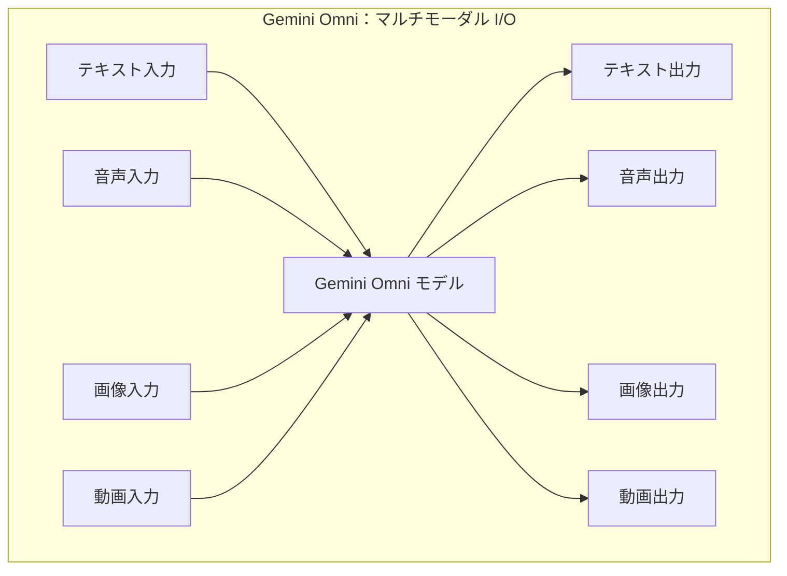
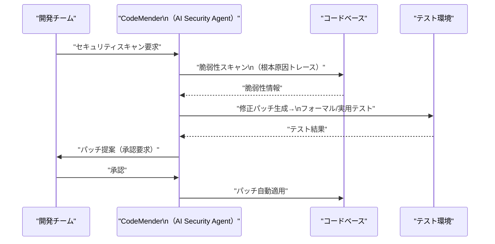
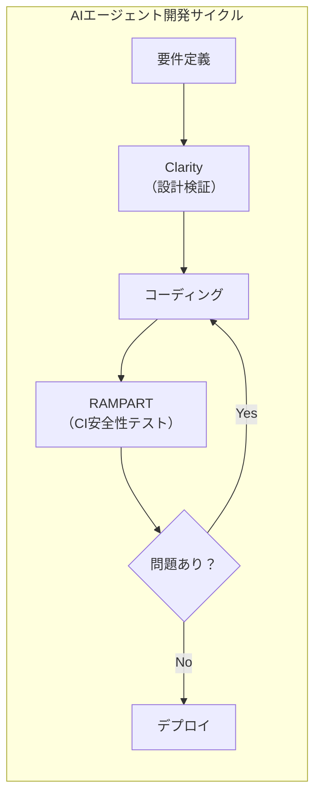
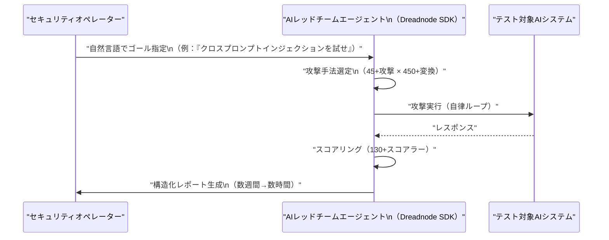
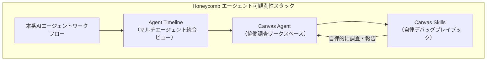
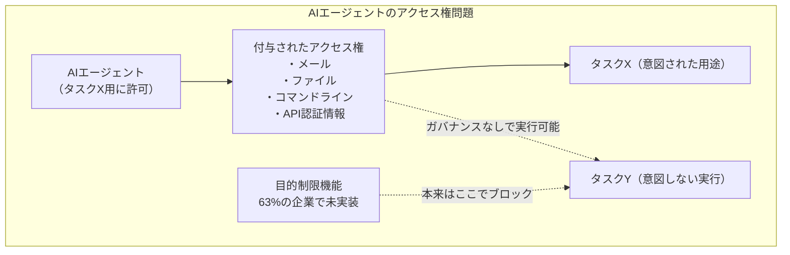
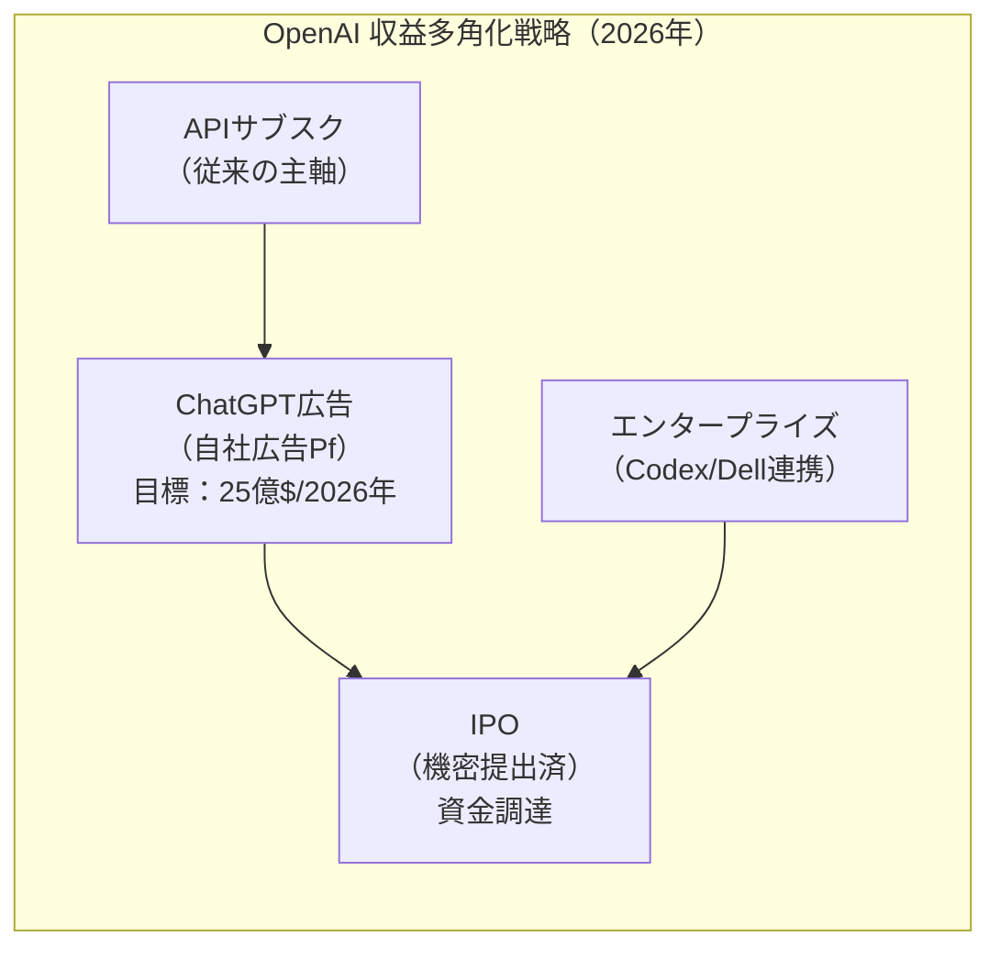

# LLM・AI Agent 最新情報レポート Vol.25

**作成日**: 2026年5月21日  
**対象期間**: 2026年5月20日〜2026年5月21日（Vol.24との差分）

---

## 目次

1. [Google Cloudアップデート](#1-google-cloudアップデート)
2. [Microsoft Azure AIアップデート](#2-microsoft-azure-aiアップデート)
3. [LLM Model / AI Agentアーキテクチャ・研究](#3-llm-model--ai-agentアーキテクチャ研究)
4. [公式ブログ・論文のリサーチ・要約](#4-公式ブログ論文のリサーチ要約)
   - [Google](#41-google)
   - [OpenAI](#42-openai)
   - [Anthropic](#43-anthropic)
5. [AI Agent搭載SaaS製品情報](#5-ai-agent搭載saas製品情報)
6. [LLM/AI Agentセキュリティインシデント](#6-llmai-agentセキュリティインシデント)
7. [その他特筆すべき情報](#7-その他特筆すべき情報)
8. [参考リンク](#8-参考リンク)

---

## 1. Google Cloudアップデート

### 1.1 Google Cloud視点のI/O 2026まとめ：Gemini 3.5 Flash / Omni と CodeMender 詳報（5月20〜21日）

Vol.24 でカバーした Developer Keynote（Antigravity SDK等）に続き、**Google Cloud Blog** が Cloud利用者向けの詳細を公開した。[[1]](#ref-1)[[2]](#ref-2)

#### Gemini 3.5 Flash：最強のエージェント・コーディングモデル

| 指標 | 値 |
|---|---|
| **Terminal-Bench 2.1スコア** | 76.2% |
| **GDPval-AA Eloスコア** | 1,656 |
| **コスト** | 同等のフロンティアモデル比 **50%未満** |
| **速度** | 同等モデル比 **4倍高速** |
| **提供チャネル** | Gemini API / Antigravity / Gemini Enterprise / Geminiアプリ / AI Studio |

Gemini 3.5 Flash は Gemini 3.1 Pro をコーディング・エージェントベンチマークで上回り、**長期的・多ステップのエージェントタスク**に最適化されたモデルとして位置づけられる。内部テストでは、**OSをゼロから構築するコーディングパイプライン**を自律実行したとされる。

また、**Gemini 3.5 Pro** は来月中にリリース予定（現在テスト中）。

#### Gemini Omni：あらゆる入力からあらゆる出力を生成する新マルチモーダルモデル

Gemini Omni は**テキスト・音声・画像・動画の任意の組み合わせを入力として受け付け、任意の形式で出力**できる新世代マルチモーダルモデル。数週間以内に Gemini API および Agent Platform 経由でロールアウト予定。[[1]](#ref-1)

#### CodeMender：AIセキュリティエージェントのAPI外部公開（5月20日）

Google DeepMind の **CodeMender** は、コードの脆弱性を自律的に検出・修正するAIセキュリティエージェント。5月20日、Google は**外部の専門家グループに CodeMender の API テストアクセスを拡大**し、Anthropic の Claude Mythos との競争に本格参入した。[[3]](#ref-3)[[4]](#ref-4)

| 機能 | 詳細 |
|---|---|
| **脆弱性検出** | Geminiモデルの高度な推論で脆弱性の根本原因をトレース |
| **パッチ生成** | 修正案を自動ドラフト |
| **パッチ検証** | フォーマルテストと実用テストで修正案を検証してから適用 |
| **適用** | ユーザー承認後にパッチを自動適用 |

#### AI Content Detection API

Google は AI が生成したコンテンツを検出する **AI Content Detection API** を新たに提供。Google および他社モデルが生成したコンテンツの識別に対応し、責任あるメディアガバナンスを支援する。[[1]](#ref-1)

---

## 2. Microsoft Azure AIアップデート

### 2.1 RAMPART & Clarity：AIエージェント開発フローに安全性を組み込むOSSツール（5月20〜21日）

Microsoft Security Blog が5月20日に **RAMPART** と **Clarity** の2つのオープンソースツールを公開した。AIエージェント開発のワークフローに安全性テストを組み込む初の包括的OSS実装として注目されている。[[5]](#ref-5)[[6]](#ref-6)[[7]](#ref-7)

#### RAMPART：AIエージェント向け安全性・セキュリティテストフレームワーク

**RAMPART**（Red-teaming Agent Models for Probing Adversarial and Responsible Threats）は、AIエージェントに対して**敵対的シナリオと正常シナリオの両方をCIで繰り返し実行可能**なテストに変換する Pytest ネイティブのフレームワーク。

| 特性 | 詳細 |
|---|---|
| **ベース** | Microsoft PyRIT（ジェネレーティブAI用レッドチーム自動化フレームワーク）の上に構築 |
| **対象者** | セキュリティ研究者ではなくエンジニア（CI統合を想定した開発者体験） |
| **テスト対象** | クロスプロンプトインジェクション・意図しない行動回帰・データ漏洩 |
| **カバー範囲** | 敵対的攻撃と良性の問題の両方、各種ハームカテゴリ |

PyRIT が「システム構築後の黒箱発見」向けであるのに対し、**RAMPART は「システム構築中に継続的に実行するエンジニアリングテスト」**向けに設計されている。

#### Clarity：コード着手前の設計検証ツール

**Clarity** は、チームがコードを一行も書く前に「正しいものを構築しようとしているか」を確認する「構造化されたサウンディングボード」。

| ステップ | 内容 |
|---|---|
| 問題の明確化 | 解決しようとしている問題が適切に定義されているか検証 |
| 解決策の探索 | 複数のアプローチを比較・評価 |
| 失敗分析 | 想定される失敗モードの事前特定 |
| 決定記録 | 設計上の意思決定を文書化 |

実行環境：デスクトップアプリ・Webインターフェース・コーディングエージェント内の3形態に対応。

### 2.2 Azure AI Foundry Agent Service：Computer Use Tool と Browser Automation Tool（5月）

Azure AI Foundry Agent Service に2つの新ツールが追加された。[[8]](#ref-8)[[9]](#ref-9)

| ツール | 状態 | 概要 |
|---|---|---|
| **Computer Use Tool** | Preview | UIを通じてコンピュータシステムを操作する専門AIツール |
| **Browser Automation Tool** | Public Preview | Playwright Workspace を活用した自然言語ブラウザ操作（フォーム入力・予約・検索等） |

**Browser Automation Toolのセキュリティ注記：** WebページのAIへの悪意ある指示（プロンプトインジェクション）によりセキュリティリスクが発生しうると Microsoft は明記している。ブラウザセッションはプライバシー・セキュリティのために隔離環境で実行される。

### 2.3 Azure Marketplace：59件の新規オファー（5月21日）

5月21日、Azure Marketplace に59件の新規オファーが追加され、クラウドソリューション・AIアプリ・AIエージェントのラインアップが拡充された。[[10]](#ref-10)

---

## 3. LLM Model / AI Agentアーキテクチャ・研究

### 3.1 論文：「Redefining AI Red Teaming in the Agentic Era: From Weeks to Hours」（arxiv 2605.04019）

2026年5月公開の arXiv 論文 [[11]](#ref-11) が、**AIレッドチームのエージェント化による効率革命**を報告した。

**背景・問題意識：**
現行のAIレッドチームでは、オペレーターが攻撃・変換・スコアラーのワークフローを手動で組み上げるため、**設定作業に数週間**を要していた。また、ライブラリに固有のワークフローに縛られ、脆弱性の探索より実装に時間を取られていた。

**提案手法：Dreadnode SDK ベースのAIレッドチームエージェント**

| コンポーネント | 規模 |
|---|---|
| **敵対的攻撃** | 45種類以上 |
| **変換（Transforms）** | 450種類以上 |
| **スコアラー** | 130種類以上 |

- オペレーターは**自然言語でゴール（何を調べるか）を指定**するだけで、エージェントが攻撃選定・変換合成・実行・報告を自律実行する
- マルチエージェントシステム・多言語・マルチモーダルのターゲットに対応
- 人間中心の手法と比較して**自律エージェントが大多数のブラックボックスレッドチーム課題を解決**

**意義：** 2026年5月時点でAIレッドチームは「セキュリティ研究の好奇心」から「運用上の基本要件」へと進化している。本論文はその技術的基盤となる自動化アーキテクチャを示した。

---

## 4. 公式ブログ・論文のリサーチ・要約

### 4.1 Google

#### Google Cloud、I/O 2026の成果をCloud視点でまとめブログ公開（5月20〜21日）

「**Innovations from Google I/O 26 on Google Cloud**」と題したブログが Google Cloud Blog に公開され、I/O 2026 の発表を Cloud 利用者視点でまとめた。[[1]](#ref-1)

主な Cloud 提供機能：
- **Gemini 3.5 Flash** が Gemini Enterprise・Gemini API で即日利用可能
- **Gemini Spark** が Gemini Enterprise・Workspace 向けにまもなく提供（まず AI Ultra 加入者向け）
- **Managed Agents API** が Agent Platform でシングル API コールで利用可能（Vol.24 で既報）
- **CodeMender** が Agent Platform 経由で提供

---

### 4.2 OpenAI

#### ChatGPT 自社広告プラットフォーム セルフサービス化（5月21日）

OpenAI は ChatGPT 内に広告を掲載できる **セルフサービス型広告プラットフォーム（Ads Manager Beta）** を正式ローンチした。[[12]](#ref-12)[[13]](#ref-13)

| 項目 | 詳細 |
|---|---|
| **提供開始** | 2026年5月21日（米国向けベータ） |
| **以前の参入障壁** | 最低出稿額 50,000ドル → **完全撤廃** |
| **入札モデル** | CPM（インプレッション単価）と CPC（クリック単価）の両対応 |
| **パートナー代理店** | Dentsu・Omnicom・Publicis・WPP |
| **アドテクパートナー** | Adobe・Criteo・Kargo・Pacvue・StackAdapt |
| **広告ポリシー** | 広告が ChatGPT のオーガニック出力に影響しないと明言 |
| **収益目標** | 2026年：25億ドル / 2030年：1,000億ドル |

セルフサービス化により、これまで大手代理店に頼らざるを得なかった中小企業・スタートアップも ChatGPT 広告を直接購入・管理・最適化できるようになった。

#### OpenAI IPO 機密提出の報道（5月21日）

5月21日、OpenAI が株式上場（IPO）のための**機密提出（Confidential Filing）**を進めているとの報道が出た。[[14]](#ref-14)

- 市場予測（Kalshi）：2026年秋までにIPO正式発表の確率 **60%（10月以前）〜 81%（11月以前）**
- 機密提出後、正式な目論見書開示・ロードショーへと移行する見込み

---

### 4.3 Anthropic

#### Anthropic、世界の金融規制当局に Claude Mythos が発見した脆弱性を事前報告へ

Anthropic が Claude Mythos Preview（4月7日発表）を使って検出した**OSやブラウザのゼロデイ脆弱性の情報を、世界の金融規制当局に事前ブリーフィング**する計画を明らかにした。[[15]](#ref-15)[[16]](#ref-16)

- Mythos は「あらゆる主要 OS・主要ブラウザ」で数千件のゼロデイ脆弱性を発見
- Anthropic は FreeBSD の17年来の RCE 脆弱性（NFS 経由で root 権限取得）を Mythos が自律的に特定・悪用したと開示
- Project Glasswing（約40社で構成：Amazon・Microsoft・JPMorgan Chase 等）を通じて、脆弱性情報を責任ある形で共有・修正する仕組みを構築中

**注記：** Claude Mythos Preview 自体は4月7日発表（Vol.24 以前のレポートで報告済）。今回の新情報は「金融規制当局への脆弱性ブリーフィング計画」の具体化。

#### Anthropic、初の四半期黒字見通しと SpaceX との大型コンピューティング契約

Anthropic が Claude AI の収益急増を背景に**四半期ベースでの初の営業黒字**に迫っていると報じられた。[[17]](#ref-17)

| 項目 | 詳細 |
|---|---|
| **2026年6月期の売上予測** | 109億ドル（四半期） |
| **SpaceX コンピューティング契約** | 月125,000万ドル（2029年5月まで） |
| **対象施設** | SpaceX のAI学習データセンター Colossus・Colossus II の両クラスター |

---

## 5. AI Agent搭載SaaS製品情報

### 5.1 Honeycomb O11yCon 2026：AIエージェントの可観測性をテーマに開催（5月20〜21日）

Honeycomb の年次カンファレンス **O11yCon 2026**（5月20〜21日、サンフランシスコ）が「エージェント時代の可観測性」をテーマに開催された。[[18]](#ref-18)[[19]](#ref-19)

5月12〜14日の Innovation Week で発表された以下の機能が正式に展示された：

| 機能 | 概要 | 提供状況 |
|---|---|---|
| **Agent Timeline** | マルチエージェント・マルチトレースを単一ビューで可視化。LLMコール・ツール呼び出し・エージェント引き継ぎ・下流システムへの影響をリアルタイムで連結 | Early Access（翌月 GA 予定） |
| **Canvas Agent** | 自然言語でクエリし、エンジニアと AI エージェントが協働調査・可視化スナップショットを共有する協働ワークスペース | 全顧客向けに提供済 |
| **Canvas Skills** | Kafka 等のフレームワークのデバッグノウハウをプレイブック化して自律実行するリユーザブルスキル | 全顧客向けに提供済 |

### 5.2 Broadridge：機関投資家向けアジェンティックAIの本番稼働（5月11日）

金融インフラ大手 Broadridge が**資本市場・ウェルス管理の業務全域でアジェンティックAIの本番稼働**を正式発表した。[[20]](#ref-20)

| 指標 | 値 |
|---|---|
| **削減可能なオペレーションコスト** | Day 1で **最大30%** |
| **本番稼働クライアント数** | 2024年以来 **40社以上** |
| **月間処理トランザクション数** | 数百万件 |
| **運用基盤** | 60年超の業務経験・日次15兆ドル取引・数十億件のトランザクション |

**本番稼働中の機能：**
- 決済エラー・照合ブレーク自動解決
- 口座開設・維持ワークフロー
- リアルタイム評価例外処理
- 顧客問い合わせ自動化
- メールワークフロー処理（DeepSee との連携）

全ワークフローは**人間監督アーキテクチャ**下で動作し、監査可能性と規制要件に対応。

---

## 6. LLM/AI Agentセキュリティインシデント

### 6.1 調査報告：65%の企業がAIエージェントセキュリティインシデントを経験

Cloud Security Alliance と Token Security が4月21日に公開した報告書「**Autonomous but Not Controlled: AI Agent Incidents Now Common in Enterprises**」が引き続き業界で大きな注目を集めている。[[21]](#ref-21)[[22]](#ref-22)

**主要データ：**

| 指標 | 割合 |
|---|---|
| AIエージェント起因のセキュリティインシデント経験企業 | **65%** |
| インシデントのうち「データ漏洩」が関与 | **61%** |
| インシデントのうち「業務中断」 | **43%** |
| インシデントのうち「意図しないビジネスプロセス実行」 | **41%** |
| インシデントのうち「金銭的損失」 | **35%** |

**ガバナンスの致命的ギャップ：**

- **63%** の企業が AIエージェントの「目的制限（Purpose Limitation）」を強制できない
  →タスクX向けに付与されたアクセス権がタスクYの実行を妨げない
- **60%** の企業が不正動作する AIエージェントを停止できない
  →データ漏洩が発生しても傍観するしかない状態

### 6.2 AIMS：AIエージェントアイデンティティのための業界標準モデル（IETF Internet-Draft）

**AIMS（AI Identity Management Standard）** が IETF の Internet-Draft として提出され、業界での共通言語確立に向けた第一歩となっている。[[23]](#ref-23)[[24]](#ref-24)

**背景：**
- Cloud Security Alliance 2026報告：AIアイデンティティの作成・削除に関する正式ポリシーを文書化している企業は **25%のみ**
- AIエージェントのアイデンティティは人間ユーザーと根本的に異なる：プロンプトに応じてインスタンス化され、セッションスコープの権限取得→複数データシステムの横断→出力生成→終了という一連がわずか**数秒**で完了

**AIMSのカバー範囲：**

| レイヤー | 内容 |
|---|---|
| 初期認証 | エージェントがシステムにどのように認証されるか |
| セッション権限 | セッションスコープでの最小権限付与 |
| ライフサイクル管理 | エージェントの作成・停止・廃止プロセス |
| アクセス制御 | 目的制限・権限昇格の防止 |
| 監査ログ | エージェント行動の追跡・説明責任 |

### 6.3 Microsoft RAMPART & Clarity（セキュリティ対策としての位置づけ）

セクション2.1で紹介した Microsoft の RAMPART & Clarity は、Vercel 侵害事例（4月21日：サードパーティAIツール Context.ai の侵害からVercel内部システムへピボット）を含む一連のAIエージェントインシデントへの対応策として、**開発フローへの安全性テスト統合**を実現するものと位置づけられている。[[5]](#ref-5)[[25]](#ref-25)

---

## 7. その他特筆すべき情報

### 7.1 AIレッドチームの民主化：自律エージェントが専門家の役割を変える

2026年5月21日時点で、AIセキュリティ領域において重要な構造変化が進行している。[[11]](#ref-11)[[26]](#ref-26)

| 変化 | 従来 | 2026年 |
|---|---|---|
| **レッドチーム実施者** | 専門セキュリティ研究者が手動で数週間 | AIエージェントが自律的に数時間 |
| **実施タイミング** | システム構築後 | 開発サイクル中（CI統合） |
| **攻撃の複雑性** | 単一ベクター | 45+攻撃×450+変換の組み合わせ |

Microsoft の研究では、**100エージェント超の本番プラットフォーム**をレッドチームし、ネットワークレベルの4つのリスクを特定：
1. **エージェントワーム**の伝播
2. 信頼されるエージェントの評判を借用した**増幅攻撃**
3. 情報検証システムへの**トラストキャプチャ攻撃**
4. エージェントチェーンを通じた攻撃の**不可視化**

### 7.2 OpenAI のビジネスモデル転換：広告＋IPO の二段階戦略

OpenAI が5月21日に発表した自社広告プラットフォームのセルフサービス化と IPO 機密提出は、**同社のビジネスモデルを「API 収益依存」から「メディア＋資本市場」へと多角化**する動きとして注目される。

---

## 8. 参考リンク

**[1]** [Innovations from Google I/O 26 on Google Cloud | Google Cloud Blog](https://cloud.google.com/blog/products/ai-machine-learning/innovations-from-google-io-26-on-google-cloud)

**[2]** [With Gemini 3.5 Flash, Google bets its next AI wave on agents, not chatbots | TechCrunch](https://techcrunch.com/2026/05/19/with-gemini-3-5-flash-google-bets-its-next-ai-wave-on-agents-not-chatbots/)

**[3]** [Google Expands Access to CodeMender AI to Compete with Anthropic in Cybersecurity | MWM](https://mwm.ai/articles/google-widens-codemender-access-entering-ai-cybersecurity-race-in-may-2026)

**[4]** [Introducing CodeMender: an AI agent for code security | Google DeepMind](https://deepmind.google/blog/introducing-codemender-an-ai-agent-for-code-security/)

**[5]** [Introducing RAMPART and Clarity: Open source tools to bring safety into Agent development workflow | Microsoft Security Blog](https://www.microsoft.com/en-us/security/blog/2026/05/20/introducing-rampart-and-clarity-open-source-tools-to-bring-safety-into-agent-development-workflow/)

**[6]** [Microsoft Open-Sources RAMPART and Clarity to Secure AI Agents During Development | The Hacker News](https://thehackernews.com/2026/05/microsoft-open-sources-rampart-and.html)

**[7]** [Microsoft storms RAMPART, adds Clarity to agentic AI safety | The Register](https://www.theregister.com/security/2026/05/21/microsoft-open-sources-agentic-ai-safety-tools/5243822)

**[8]** [Announcing the Browser Automation Tool (Preview) in Azure AI Foundry Agent Service | Microsoft Foundry Blog](https://devblogs.microsoft.com/foundry/announcing-the-browser-automation-tool-preview-in-azure-ai-foundry-agent-service/)

**[9]** [What's new in Foundry Agent Service? | Microsoft Learn](https://learn.microsoft.com/en-us/azure/ai-foundry/agents/whats-new?view=foundry-classic)

**[10]** [New in Microsoft Marketplace: May 21, 2026 | Microsoft Community Hub](https://techcommunity.microsoft.com/blog/marketplace-blog/new-in-microsoft-marketplace-may-21-2026/4508147)

**[11]** [Redefining AI Red Teaming in the Agentic Era: From Weeks to Hours | arXiv 2605.04019](https://arxiv.org/abs/2605.04019)

**[12]** [New ways to buy ChatGPT ads | OpenAI](https://openai.com/index/new-ways-to-buy-chatgpt-ads/)

**[13]** [OpenAI Opens ChatGPT Ads to Self-Service Platform | AdWeek](https://www.adweek.com/media/openai-opens-chatgpt-ads-to-self-service-platform/)

**[14]** [OpenAI IPO announcement odds spike after reports of confidential filing | Kalshi News](https://news.kalshi.com/p/openai-ipo-announcement-odds-2026)

**[15]** [Anthropic to brief global financial regulators on cyber flaws found by Claude Mythos | The Decoder](https://the-decoder.com/anthropic-to-brief-global-financial-regulators-on-cyber-flaws-found-by-claude-mythos/)

**[16]** [Claude Mythos Preview | red.anthropic.com](https://red.anthropic.com/2026/mythos-preview/)

**[17]** [Anthropic nears rare AI profit milestone as Claude boom fuels revenue surge | Gulf Business](https://gulfbusiness.com/en/2026/tech/anthropic-nears-profitability-claude-ai-revenue-surge-spacex-compute-deal/)

**[18]** [Honeycomb Launches Agent Observability, Bringing Full Visibility to Agentic Workflows in Production | Honeycomb Blog](https://www.honeycomb.io/blog/honeycomb-launches-agent-observability-full-visibility-agentic-workflows)

**[19]** [Honeycomb Unveils Agent Timeline, Canvas Agent & Skills for AI Observability | The Fast Mode](https://www.thefastmode.com/technology-solutions/48504-honeycomb-unveils-agent-timeline-canvas-agent-skills-for-ai-observability)

**[20]** [Broadridge Deploys Agentic AI at Institutional Scale Across Capital Markets and Wealth Operations | Broadridge](https://www.broadridge.com/press-release/2026/broadridge-deploys-agentic-ai)

**[21]** [AI Agent Security Incidents Hit 65% of Firms in 2026 | Kiteworks](https://www.kiteworks.com/cybersecurity-risk-management/ai-agent-security-incidents-2026/)

**[22]** [65 Percent of Enterprises Have Already Experienced AI Agent Security Incidents | Token Security](https://www.token.security/blog/65-percent-of-enterprises-have-already-experienced-ai-agent-security-incidents)

**[23]** [AIMS: A Model for AI Agent Identity | Security Boulevard](https://securityboulevard.com/2026/05/aims-a-model-for-ai-agent-identity/)

**[24]** [AIMS: A Model for AI Agent Identity | Aembit Blog](https://aembit.io/blog/aims-a-model-for-ai-agent-identity/)

**[25]** [AI red teaming agents change how LLMs get tested | Help Net Security](https://www.helpnetsecurity.com/2026/05/21/ai-red-teaming-agents-research/)

**[26]** [Red-teaming a network of agents: Understanding what breaks when AI agents interact at scale | Microsoft Research](https://www.microsoft.com/en-us/research/blog/red-teaming-a-network-of-agents-understanding-what-breaks-when-ai-agents-interact-at-scale/)
