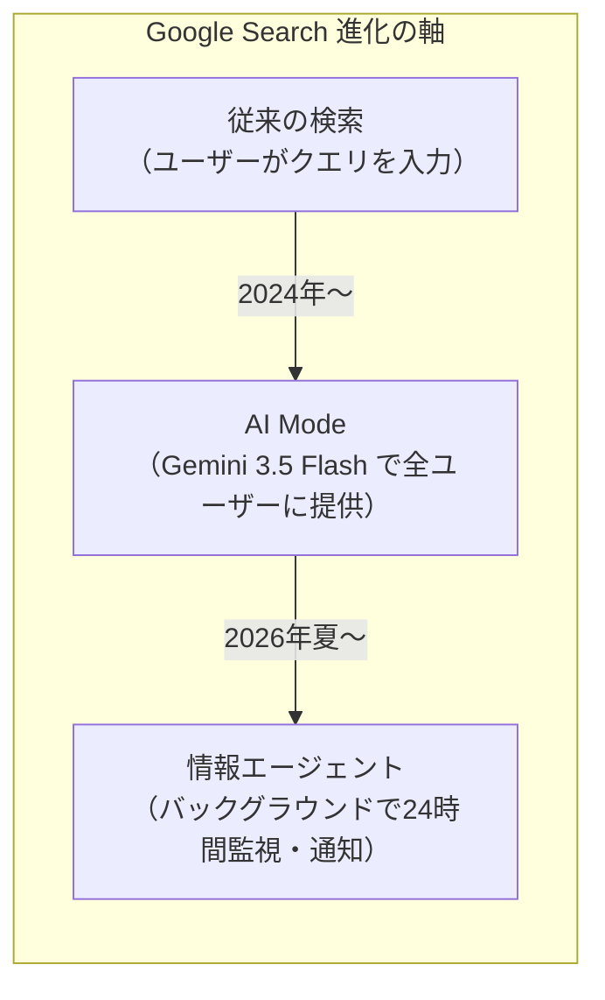
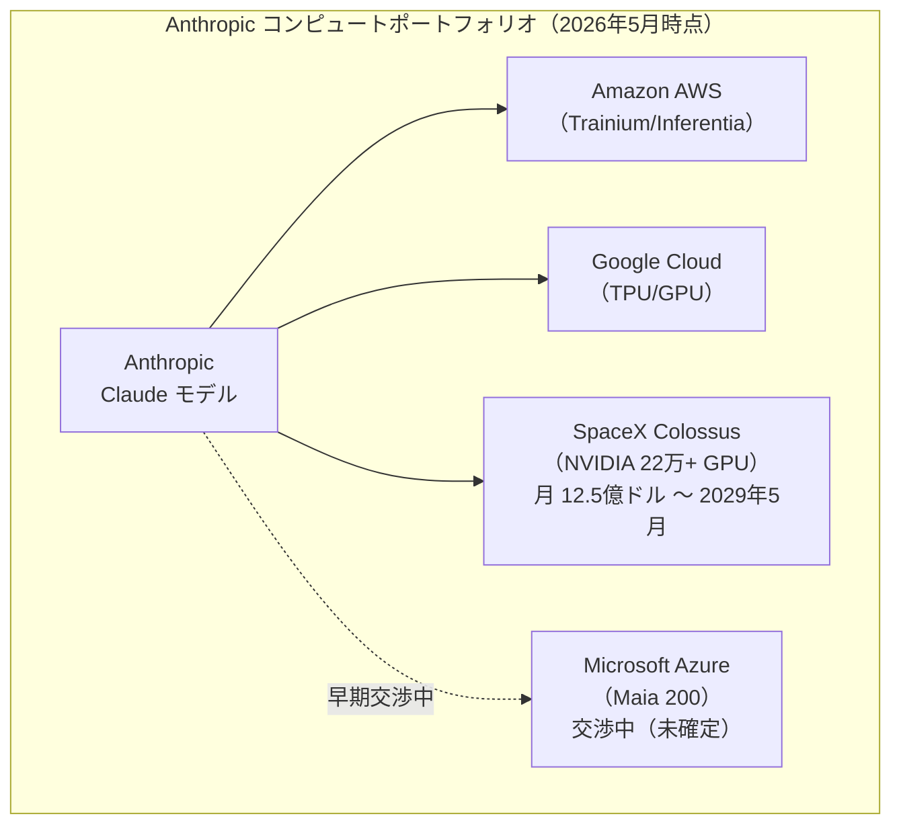
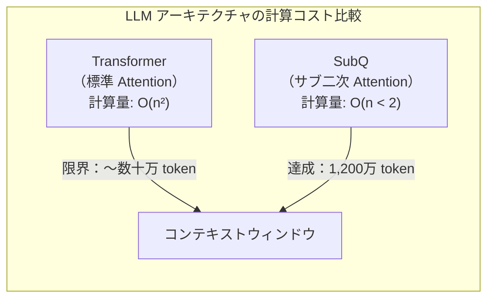
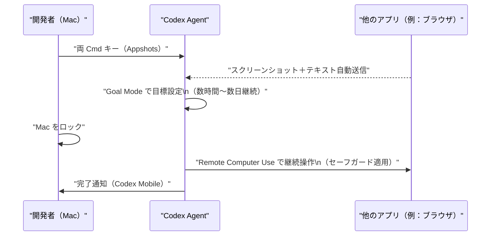
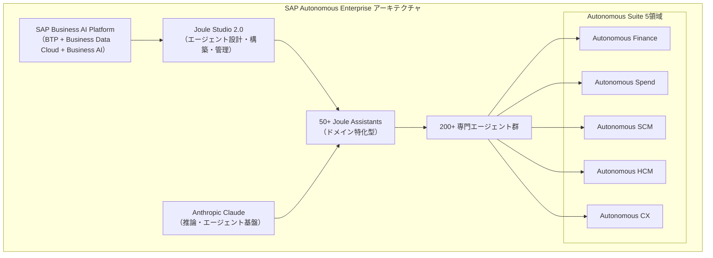
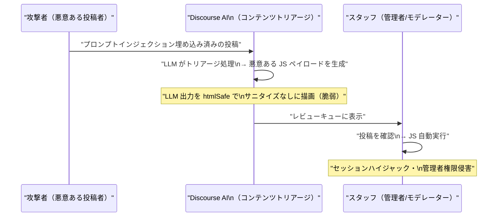

# LLM・AI Agent 最新情報レポート Vol.26

**作成日**: 2026年5月22日  
**対象期間**: 2026年5月21日〜2026年5月22日（Vol.25との差分）

---

## 目次

1. [Google Cloudアップデート](#1-google-cloudアップデート)
2. [Microsoft Azure AIアップデート](#2-microsoft-azure-aiアップデート)
3. [LLM Model / AI Agentアーキテクチャ・研究](#3-llm-model--ai-agentアーキテクチャ研究)
4. [公式ブログ・論文のリサーチ・要約](#4-公式ブログ論文のリサーチ要約)
   - [Google](#41-google)
   - [OpenAI](#42-openai)
   - [Anthropic](#43-anthropic)
5. [AI Agent搭載SaaS製品情報](#5-ai-agent搭載saas製品情報)
6. [LLM/AI Agentセキュリティインシデント](#6-llmai-agentセキュリティインシデント)
7. [その他特筆すべき情報](#7-その他特筆すべき情報)
8. [参考リンク](#8-参考リンク)

---

## 1. Google Cloudアップデート

### 1.1 Google Search「情報エージェント（Information Agents）」：常時稼働型AI検索の正式発表（I/O 2026）

Google I/O 2026 において、Google は従来の検索ボックスを大幅刷新する「**情報エージェント（Information Agents）**」を発表した。[[1]](#ref-1)[[2]](#ref-2)

Vol.25 でカバーした Gemini 3.5 Flash / CodeMender（クラウドインフラ視点）に対し、本項では**エンドユーザー向け検索プロダクトへのエージェント統合**を取り上げる。

#### 情報エージェントの概要

| 項目 | 内容 |
|---|---|
| **機能** | ユーザーが指定したトピックをバックグラウンドで24時間監視し、重要な更新をプッシュ通知で配信 |
| **モデル** | Gemini 3.5 Flash をデフォルトモデルとして採用 |
| **ロールアウト** | 2026年夏、米国 AI Pro / Ultra サブスクライバーに先行提供 |
| **位置づけ** | 2003年に開始した「Google アラート」の次世代進化版 |

従来の検索はユーザーが能動的にクエリを入力する必要があったが、情報エージェントは**ユーザーが何もしなくても**継続的にウェブを監視し、合成した洞察を届ける。

**使用例：**
- 「近所の映画館でスター・ウォーズ新作が公開されたら教えて」→ エージェントが上映スケジュールを監視して通知
- 「好きなアスリートがスニーカーコラボを発表したら教えて」→ ニュースを横断検索して通知

#### Google Search の最大刷新：検索ボックスの置き換え

Google は検索ボックスを「**AIパワードインターフェース**」に置き換える過去25年で最大規模のUIリデザインも同時に発表。AI Mode の全ユーザー向け提供と情報エージェントの組み合わせにより、Google は「反応型検索」から「能動型エージェント」へのシフトを本格化した。

---

## 2. Microsoft Azure AIアップデート

### 2.1 MAI-Image-2-Efficient：高速・低コストな画像生成モデルを Microsoft Foundry Labs に追加（5月）

Microsoft は自社開発テキスト→画像モデル **MAI-Image-2-Efficient**（Image-2e）を Microsoft Foundry Labs に追加した。[[3]](#ref-3)[[4]](#ref-4)

| 指標 | 値 |
|---|---|
| **ベースモデル** | MAI-Image-2（Arena.ai 画像モデルランキング #3） |
| **速度改善** | MAI-Image-2 比 **22%高速** |
| **効率改善** | MAI-Image-2 比 **4倍効率的** |
| **競合比** | 主要テキスト→画像モデル比 **40%高速** |
| **料金（テキスト入力）** | $5 / 1M tokens |
| **料金（画像出力）** | $19.50 / 1M tokens |

大量の画像生成が必要な EC プラットフォーム・メディア・マーケティングチームを主要ターゲットとし、**同一品質を低 GPU コストで提供**することを狙いとする。

### 2.2 SocialReasoning-Bench：エージェントの代理行動能力を測定する新オープンソースベンチマーク（5月）

Microsoft Research AI Frontiers が **SocialReasoning-Bench** を公開した。エージェントが「代理するユーザーに対して十分に働けているか」を測定する世界初クラスのベンチマーク。[[5]](#ref-5)

#### ベンチマークの測定軸

| メトリクス | 内容 |
|---|---|
| **Outcome Optimality** | エージェントがユーザーのために獲得できた価値の割合（決定論的「合理的エージェント」ポリシーとの比較） |
| **Due Diligence** | 交渉プロセスの質（合理的エージェントポリシーとのスコア比較） |

#### 対応シナリオ（現在の公開版）

1. **Calendar Coordination**：複数ユーザー間で最適なスケジュールを調整するシナリオ
2. **Marketplace Negotiation**：商品取引における価格交渉シナリオ

**意義：** 既存のエージェントベンチマークはタスク完了率を測定するものが多いが、SocialReasoning-Bench は「ユーザーの利益を代弁できているか」という**代理人としての品質**を評価する点で新規性が高い。

### 2.3 Anthropic、Microsoft の自社製 AI チップ「Maia 200」使用へ交渉中（5月21日）

Anthropic が Microsoft 製 AI サーバーチップ **Maia 200** のレンタルに向けて初期交渉を開始したと報じられた。[[6]](#ref-6)[[7]](#ref-7)

| 項目 | 内容 |
|---|---|
| **背景** | Microsoft の 2025年11月に発表した Anthropic への 50億ドル投資に続く動き |
| **Anthropic の約束** | Azure に 300億ドルの支出を確約済み |
| **Maia 200の特殊性** | Microsoft がこれまで自社データセンター専用として外部提供していなかったチップ |
| **狙い** | NVIDIA 半導体への依存低減（Google・Amazon 同様） |

Dario Amodei CEO は「コンピュート（計算リソース）の調達困難」を明言しており、SpaceX Colossus 契約（Vol.25 既報）に加えて Microsoft Maia チップという第三の調達源を模索している。

---

## 3. LLM Model / AI Agentアーキテクチャ・研究

### 3.1 SubQ：商用初の「サブ二次（Sub-quadratic）」LLM、1200万コンテキストを達成

**SubQ** が、商用 LLM として初めてサブ二次（Sub-quadratic）アーキテクチャを採用した LLM を出荷し、**1,200万トークンのコンテキストウィンドウ**を実現したと報告された。[[8]](#ref-8)

#### 従来の Transformer との違い

従来の Transformer は Attention 計算が**入力長の二乗（O(n²)）** のコストを要するため、長文脈への対応にはメモリ・計算コストが指数的に増加する問題があった。SubQ は線形またはサブ二次オーダーで Attention を近似する新アーキテクチャを採用することで、1,200万トークンという従来比数十倍のコンテキストを商用レベルで実現した。

**意義：** 超長文書の一括処理（法的文書・コードベース全体・長期会話履歴）が商用サービスで実現可能になる段階に入りつつある。

### 3.2 arXiv 論文：「LLM-Powered AI Agent Systems and Their Applications in Industry」（arXiv 2505.16120）

2026年5月4日公開の論文がエージェントシステムの産業応用課題を体系的に整理した。[[9]](#ref-9)

**主要な課題と対策：**

| 課題 | 対策アプローチ |
|---|---|
| 高推論レイテンシ | モデル最適化・軽量化 |
| 出力の不確実性 | アンサンブル・検証レイヤー |
| 評価メトリクスの欠如 | ベンチマーク標準化（例：SWE-Bench, SocialReasoning-Bench） |
| セキュリティ脆弱性 | 多層セキュリティプロトコル（プロンプトインジェクション対策等） |

---

## 4. 公式ブログ・論文のリサーチ・要約

### 4.1 Google

#### Google 検索の I/O 2026 アップデートブログ公開（5月21〜22日）

Google が「**Google Search's I/O 2026 updates: AI agents and more**」ブログを公開した。[[1]](#ref-1)[[2]](#ref-2)

主なトピック（Vol.25 未掲載分）：

- **情報エージェント（Information Agents）**：セクション 1.1 で詳述
- **ローカル予約のエージェント拡張**：特定の飲食店・体験・サービスを条件指定して検索→予約できるエージェント機能を Search に統合
- **AI Mode の全ユーザー開放**：Gemini 3.5 Flash をデフォルトモデルとして AI Mode をグローバル展開

---

### 4.2 OpenAI

#### Codex 大型アップデート（5月22日）：Appshots・Goal Mode GA・リモートコンピュータ使用

OpenAI が Codex の大型アップデートを5月22日にリリースした。[[10]](#ref-10)[[11]](#ref-11)

| 機能 | 内容 |
|---|---|
| **Appshots（macOS）** | 両 Command キーを押すとアクティブなアプリウィンドウのスクリーンショット＋テキストを Codex スレッドに即時送信。コンテキスト共有の手間を大幅削減 |
| **Goal Mode（GA）** | 目標と成功基準を定義すると Codex が数時間〜数日単位で自律的に目標に向かって動き続ける。Codex アプリ・IDE 拡張・CLI に対応 |
| **リモートコンピュータ使用（Remote Computer Use）** | Mac がロックされた後も Codex がデスクトップアプリを操作可能。Codex Mobile 経由でのリモート制御にも対応。短命な認可・画面カバー・ローカル入力でのリロックなどセーフガードを実装 |
| **GPT-5.3-Codex-Spark** | 128k コンテキストウィンドウのテキスト専用軽量モデル。IDE 拡張・Codex アプリのモデルセレクターから選択可能 |
| **ブラウザ使用改善** | 高精度アノテーションモード・高速アセット抽出・読み取り専用 JS コンテキスト・タブグループ管理の改善 |
| **Windows 版アルファ** | Codex アプリの Windows 向けアルファテスト開始（申込制） |

#### GPT-5.5 が ChatGPT のデフォルトモデルに

OpenAI は **GPT-5.5** を ChatGPT の新デフォルトモデルとして設定した。「規制対象トピックでのハルシネーション低減」を主要改善点として掲げ、信頼性向上に重点を置く。[[8]](#ref-8)

---

### 4.3 Anthropic

#### Anthropic、Q2 2026 に初の四半期営業黒字見通し（5月21日）

Anthropic が投資家向けに最新の財務見通しを共有した。[[12]](#ref-12)

| 指標 | 値 |
|---|---|
| **Q2 2026 売上予測** | 109億ドル（前四半期 Q1：48億ドル、+130%） |
| **Q2 2026 営業利益予測** | 約5億5,900万ドル（四半期初の黒字） |
| **年換算売上（現ペース）** | 436億ドル |
| **評価額** | 9,000億ドル |

Claude の急速な需要拡大（Code with Claude 2026 カンファレンスで「今年の需要は 80倍成長」と発表済）が黒字化を後押しした。

---

## 5. AI Agent搭載SaaS製品情報

### 5.1 SAP Sapphire 2026：「自律型企業（Autonomous Enterprise）」ビジョンと200本超のエージェント（5月19〜21日）

SAP が年次カンファレンス **SAP Sapphire 2026**（オーランド）で「**自律型企業（Autonomous Enterprise）**」ビジョンを発表した。全社 ERP を AIエージェントで自律稼働させる大胆な構想として業界の注目を集めている。[[13]](#ref-13)[[14]](#ref-14)[[15]](#ref-15)

#### SAP Business AI Platform

従来バラバラだった SAP Business Technology Platform・SAP Business Data Cloud・SAP Business AI を**単一のガバナンス環境**に統合した新プラットフォーム。

| レイヤー | 内容 |
|---|---|
| **データ統合** | SAP Business Data Cloud でビジネスコンテキストをグラウンディング |
| **エージェント開発** | Joule Studio 2.0 で企業が独自エージェントを設計・構築・管理 |
| **組み込みモデル** | Anthropic Claude を主要推論・エージェント基盤として採用 |

#### Autonomous Suite（5領域・200本超エージェント）

| 領域 | 主な自律エージェント |
|---|---|
| Autonomous Finance | 財務クローズ圧縮（週→日）・仕訳・照合・エラー解決 |
| Autonomous Spend | 調達・支出管理の自律化 |
| Autonomous Supply Chain | サプライチェーン計画・在庫最適化 |
| Autonomous HCM | 人事管理・給与・採用ワークフロー |
| Autonomous CX | 顧客体験・カスタマーサービス自動化 |

#### Joule Studio 2.0 と Industry AI

- **Joule Studio 2.0**：6月より最初の顧客向け提供開始。エージェントのライフサイクル（設計→構築→管理）を一元化
- **Industry AI**：製造・小売・公共・ヘルスケア等7業種向けに規制要件・業種データモデルを組み込んだ業界特化型自律ソリューション

---

## 6. LLM/AI Agentセキュリティインシデント

### 6.1 CVE-2026-27740：Discourse AI のプロンプトインジェクション→ XSS 脆弱性

Discourse の AI 搭載コンテンツトリアージ機能に **クロスサイトスクリプティング（XSS）脆弱性**が発見された（CVE-2026-27740）。[[16]](#ref-16)

#### 攻撃の仕組み

| 項目 | 詳細 |
|---|---|
| **CVE ID** | CVE-2026-27740 |
| **脆弱性種別** | Prompt Injection → XSS（Stored） |
| **影響対象** | Discourse AI プラグイン（コンテンツトリアージ機能） |
| **根本原因** | LLM 生成コンテンツを `htmlSafe` でサニタイズなしにレンダリングするトラストバウンダリー違反 |
| **攻撃経路** | 悪意ある投稿 → AI がプロンプトインジェクションで操作 → スタッフのブラウザで JS 実行 |
| **影響** | セッションハイジャック・管理者アカウント侵害・設定変更 |
| **修正方法** | テンプレートへの補間前に `ERB::Util.html_escape` を適用 |

**教訓：** LLM 生成コンテンツは「ユーザー入力と同等の非信頼コンテンツ」として扱い、HTMLエスケープ等の標準的なサニタイゼーションを必ず適用する必要がある。

### 6.2 CVE（未採番）：OpenAI Codex の GitHub トークン漏洩脆弱性

OpenAI Codex に、Pull Request の説明文に埋め込んだプロンプトインジェクションでリモートコード実行と **GitHub トークン侵害**が可能な脆弱性が発見された。CVSS スコアは **9.6（Critical）**。[[17]](#ref-17)

| 項目 | 詳細 |
|---|---|
| **CVE** | CVE-2025-53773 |
| **攻撃手法** | PR 説明文への隠れたプロンプトインジェクション |
| **影響** | リモートコード実行・GitHub アクセストークンの漏洩 |
| **CVSS** | 9.6（Critical） |

GitHub 上で AI コーディングツールを使用している開発者は、外部からの PR 説明文に対してコンテキスト隔離の実装を検討すべきである。

---

## 7. その他特筆すべき情報

### 7.1 OpenAI、AI 動画生成アプリ「Sora」を公開6か月で終了

OpenAI が AI 動画生成アプリ **Sora** を公開からわずか6か月で提供終了した。[[8]](#ref-8)

| 指標 | 値 |
|---|---|
| **月間アクティブユーザー数（終了時）** | 50万人未満 |
| **終了理由（推定）** | 採用率低迷・動画 AI 競争の激化（Sora 対 Runway・Kling 等） |

動画生成 AI はコンテンツ・映像業界向けに急速に発展しているが、一般消費者向け普及は依然として課題が残ることを示す例となった。

### 7.2 AMD Instinct で訓練された初の商用 LLM「ZAYA1-8B」登場

**Zyphra** が **ZAYA1-8B** を Apache 2.0 ライセンスで公開。同モデルは **AMD Instinct GPU のみを使用して最初からエンドツーエンドで訓練**した初の商用 LLM として注目される。[[8]](#ref-8)

**意義：** NVIDIA GPU 依存からの脱却を実証する先例として、AMD・Intel 等の競合 GPU エコシステムの実用性を裏付けるデータポイントとなる。

### 7.3 エンタープライズ AI エージェントの収益化モデル：消費量ベース課金への移行

Deloitte・SaaS Mag 等の業界調査によれば、2026年の AI Agent SaaS 市場では**シート課金からアウトカム課金・消費量ベース課金への転換**が加速している。[[18]](#ref-18)

| 課金モデル | 特徴 | 採用例 |
|---|---|---|
| 従来型シート課金 | ユーザー数に比例 | 多くの SaaS |
| 消費量ベース（Consumption） | API 呼び出し・タスク数に比例 | OpenAI API |
| アウトカム課金 | 達成したビジネス成果に比例 | Broadridge・SAP 一部機能 |

SAP Sapphire での Autonomous Suite 発表はこのトレンドを体現しており、「エージェントが実際に実行した業務プロセス」に対して価値を提供するモデルへの移行を示している。

---

## 8. 参考リンク

**[1]** [Google Search's I/O 2026 updates: AI agents and more | Google Blog](https://blog.google/products-and-platforms/products/search/search-io-2026/)

**[2]** [Google launches always-on information agents in Search at I/O 2026 | The Next Web](https://thenextweb.com/news/google-wants-search-to-work-while-you-sleep-and-its-new-information-agents-are-the-plan)

**[3]** [Introducing MAI-Image-2-Efficient: Faster, More Efficient Image Generation | Microsoft Community Hub](https://techcommunity.microsoft.com/blog/azure-ai-foundry-blog/introducing-mai-image-2-efficient-faster-more-efficient-image-generation/4510918)

**[4]** [What's New in Microsoft Foundry Labs – May 2026 | Microsoft Community Hub](https://techcommunity.microsoft.com/blog/azure-ai-foundry-blog/whats-new-in-microsoft-foundry-labs-%E2%80%93-may-2026/4520310)

**[5]** [What's New in Microsoft Foundry Labs – May 2026 (SocialReasoning-Bench) | Microsoft Community Hub](https://techcommunity.microsoft.com/blog/azure-ai-foundry-blog/whats-new-in-microsoft-foundry-labs-%E2%80%93-may-2026/4520310)

**[6]** [Anthropic in Early Talks to Use Microsoft AI Chips, Information Reports | Bloomberg](https://www.bloomberg.com/news/articles/2026-05-21/anthropic-in-talks-to-use-microsoft-ai-chips-information-says)

**[7]** [Anthropic, Microsoft in talks for AI chip deal after $5 billion investment | CNBC](https://www.cnbc.com/2026/05/21/anthropic-microsoft-maia-200-ai-chip.html)

**[8]** [New AI Models May 2026: The Frontier Took a Breath, Architecture Took the Stage | WhatLLM.org](https://whatllm.org/blog/new-ai-models-may-2026)

**[9]** [LLM-Powered AI Agent Systems and Their Applications in Industry | arXiv 2505.16120](https://arxiv.org/html/2505.16120v2)

**[10]** [Changelog – Codex | OpenAI Developers](https://developers.openai.com/codex/changelog)

**[11]** [Codex Updates by OpenAI - May 2026 | Releasebot](https://releasebot.io/updates/openai/codex)

**[12]** [Anthropic in Early Talks to Use Microsoft AI Chips, Information Reports | Bloomberg](https://www.bloomberg.com/news/articles/2026-05-21/anthropic-in-talks-to-use-microsoft-ai-chips-information-says)

**[13]** [SAP Unveils the Autonomous Enterprise | SAP Sapphire | SAP News Center](https://news.sap.com/2026/05/sap-sapphire-sap-unveils-autonomous-enterprise/)

**[14]** [2026 SAP Sapphire Keynote: Powering the Autonomous Enterprise | SAP News Center](https://news.sap.com/2026/05/sap-sapphire-keynote-business-ai-platform-power-autonomous-enterprise/)

**[15]** [SAP Sapphire 2026 Intros 'Autonomous Enterprise' Vision | Channel Insider](https://www.channelinsider.com/ai/sap-sapphire-2026-business-ai-joule-agents/)

**[16]** [CVE-2026-27740: Discourse AI LLM XSS Vulnerability | SentinelOne](https://www.sentinelone.com/vulnerability-database/cve-2026-27740/)

**[17]** [Critical Vulnerability in OpenAI Codex Allowed GitHub Token Compromise | SecurityWeek](https://www.securityweek.com/critical-vulnerability-in-openai-codex-allowed-github-token-compromise/)

**[18]** [SaaS meets AI agents: Transforming budgets, customer experience, and workforce dynamics | Deloitte](https://www.deloitte.com/us/en/insights/industry/technology/technology-media-and-telecom-predictions/2026/saas-ai-agents.html)
