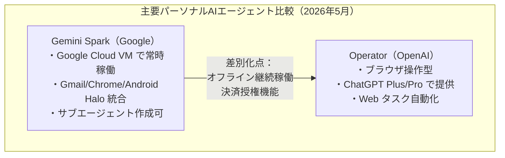
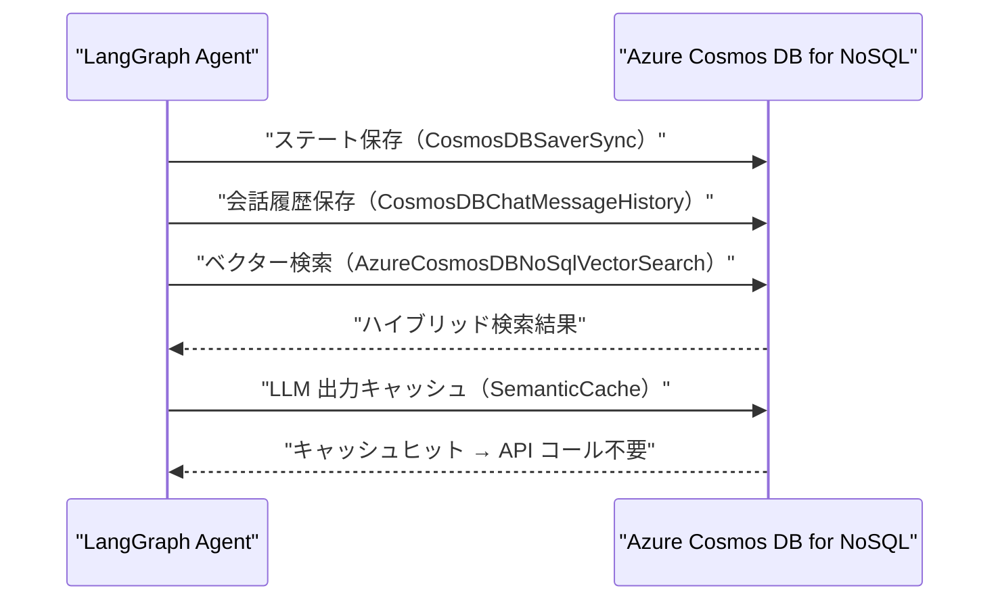
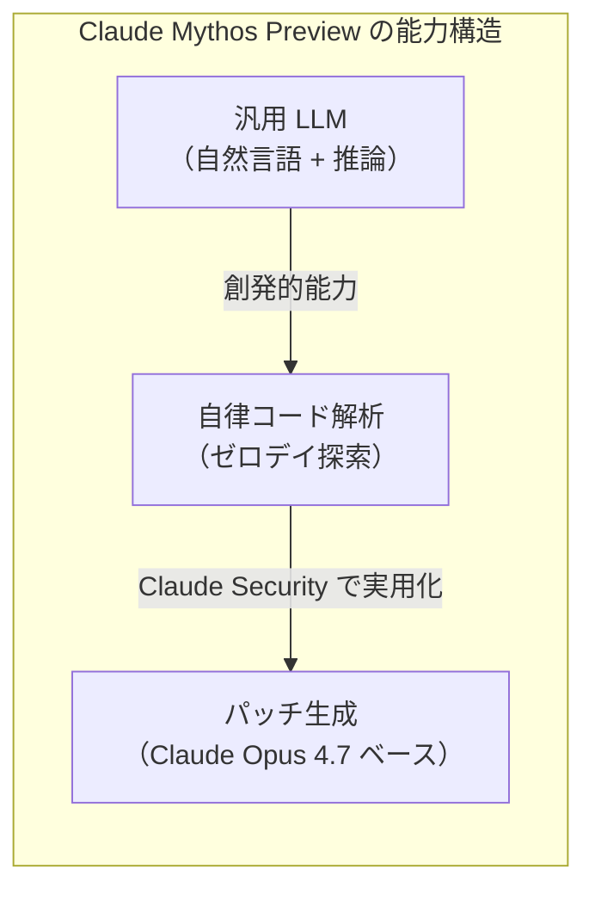
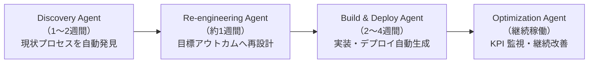
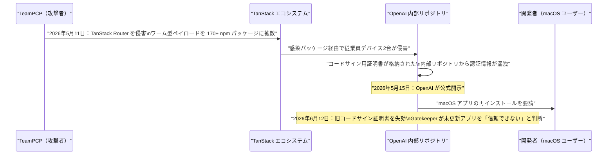

# LLM・AI Agent 最新情報レポート Vol.27

**作成日**: 2026年5月23日  
**対象期間**: 2026年5月22日〜2026年5月23日（Vol.26との差分）

---

## 目次

1. [Google Cloudアップデート](#1-google-cloudアップデート)
2. [Microsoft Azure AIアップデート](#2-microsoft-azure-aiアップデート)
3. [LLM Model / AI Agentアーキテクチャ・研究](#3-llm-model--ai-agentアーキテクチャ研究)
4. [公式ブログ・論文のリサーチ・要約](#4-公式ブログ論文のリサーチ要約)
   - [Google](#41-google)
   - [OpenAI](#42-openai)
   - [Anthropic](#43-anthropic)
5. [AI Agent搭載SaaS製品情報](#5-ai-agent搭載saas製品情報)
6. [LLM/AI Agentセキュリティインシデント](#6-llmai-agentセキュリティインシデント)
7. [その他特筆すべき情報](#7-その他特筆すべき情報)
8. [参考リンク](#8-参考リンク)

---

## 1. Google Cloudアップデート

### 1.1 Gemini Spark：24時間稼働型パーソナルAIエージェント、米国AIUltra向けベータ開始

Google I/O 2026（5月19日〜）で発表された **Gemini Spark** が、米国の Google AI Ultra サブスクライバーへのベータ配布を5月末に開始した。[[1]](#ref-1)[[2]](#ref-2)[[3]](#ref-3)

Vol.26 でカバーした「情報エージェント（Information Agents）」が *Search* に組み込まれた検索拡張機能であるのに対し、Gemini Spark は**ユーザーのデジタル生活全体を横断する自律型パーソナルエージェント**として別製品に位置づけられる。

#### Gemini Spark の主要機能

| 機能 | 詳細 |
|---|---|
| **常時稼働** | Google Cloud 上の専有 VM で動作。ユーザーの PC・スマホがオフでも継続稼働 |
| **Gmail 統合** | Spark 専用の Gmail アドレスに送信するだけでタスクを依頼可能 |
| **Chrome 連携** | Web を Spark が直接操作可能（ブラウザオートメーション） |
| **Android Halo** | Android でエージェントの進捗をリアルタイム追跡できる新インターフェース |
| **サブエージェント作成** | ユーザーが目的別カスタムサブエージェントを生成・管理可能 |
| **決済授権** | 予算と利用可能店舗を指定した上で Spark による支払いを許可可能 |
| **外部アプリ統合** | Canva・OpenTable・Instacart など主要アプリと連携、今後も拡大予定 |

#### OpenAI Operator との比較

---

### 1.2 Google AI Mode：リリース1年で月間利用者10億人突破

Google が I/O 2026 キーノートで、**AI Mode の月間利用者が10億人を突破**したと発表した。[[4]](#ref-4)[[5]](#ref-5)

| 指標 | 値 |
|---|---|
| **月間利用者数** | 10億人超（リリース1年で達成） |
| **クエリ成長率** | 四半期ごとに2倍以上 |
| **平均クエリ長** | 従来検索比 **3倍** |
| **フォローアップクエリ成長** | 米国で月次 **+40%** |
| **マルチモーダル入力比率** | 全 AI Mode クエリの **16%**（音声・画像・動画） |
| **プランニングクエリ成長** | I/O 前6か月で AI Mode 全体の **80% の速さ** |

検索クエリの長文化・マルチターン化・マルチモーダル化という3つのトレンドが同時進行しており、「検索ボックスへの入力」から「AIとの対話」へのパラダイム転換が統計的に裏付けられた。

---

## 2. Microsoft Azure AIアップデート

### 2.1 `langchain-azure-cosmosdb` v1.0：エージェントアプリ向け統合永続化レイヤー

Microsoft が Azure Cosmos DB の LangChain/LangGraph 公式コネクタ **`langchain-azure-cosmosdb` v1.0** をリリースした（5月22日）。[[6]](#ref-6)[[7]](#ref-7)

エージェントアプリに必要な全ての永続化ニーズを **Azure Cosmos DB for NoSQL 単一データベース** で賄えるよう、6種類の統合を同梱する。

#### 6つの統合コンポーネント

| コンポーネント | 機能 |
|---|---|
| `AzureCosmosDBNoSqlVectorSearch` | ベクター検索・全文検索・ハイブリッド検索 |
| `AzureCosmosDBNoSqlSemanticCache` | LLM 出力のセマンティックキャッシュ（コスト削減） |
| `CosmosDBChatMessageHistory` | TTL 付きチャット履歴の永続化 |
| `CosmosDBSaverSync` | LangGraph エージェントのステート自動永続化（チェックポインタ） |
| LangGraph Store | エージェントの長期メモリストア |
| LangGraph Cache | エージェント中間出力のキャッシュ |

#### LangGraph エージェントとの統合フロー

認証は **アクセスキー** と **Microsoft Entra ID（マネージドID）** の両方に対応しており、エンタープライズのゼロトラストアーキテクチャと親和性が高い。

---

## 3. LLM Model / AI Agentアーキテクチャ・研究

### 3.1 Anthropic「Claude Mythos Preview」：汎用モデルが示したサイバーセキュリティ超能力

Anthropic が Project Glasswing を通じて **Claude Mythos Preview** の有するサイバーセキュリティ能力を公開した（5月22日）。[[8]](#ref-8)[[9]](#ref-9)

Mythos Preview は汎用モデルとして開発されたが、テスト中にこれまでのモデルを「劇的に上回る」セキュリティ能力が判明し、自律的な脆弱性探索に転用された。

#### 脆弱性発見実績（Project Glasswing 第一フェーズ）

| 指標 | 値 |
|---|---|
| **スキャン対象** | 主要 OS 全種・主要ブラウザ全種・その他重要ソフトウェア |
| **パートナー企業数** | Microsoft、Apple、Google、Cloudflare を含む50社以上 |
| **発見した高・致命的ゼロデイ数** | **10,000件超**（1か月以内） |
| **真陽性率（高・致命的）** | 90.6%（誤検知率が極めて低い） |

#### Mythos Preview のアーキテクチャ的示唆

従来の LLM は「自然言語理解・生成」に特化して設計されてきたが、Mythos Preview の事例は**大規模汎用モデルが特定ドメイン（セキュリティ解析）で専門ツールを超える能力を自然に獲得しうる**ことを示す新たなデータポイントとなった。

---

## 4. 公式ブログ・論文のリサーチ・要約

### 4.1 Google

#### Google I/O 2026：Gemini アプリへのクリエイティブプラットフォーム統合（5月22日〜）

Google が Gemini アプリに **Adobe・Canva・CapCut** を直接統合すると発表した。[[2]](#ref-2)[[3]](#ref-3)

| 統合プラットフォーム | 主な用途 |
|---|---|
| **Adobe** | Photoshop/Firefly との連携による画像編集・生成 |
| **Canva** | デザインテンプレートとの連携、Gemini Spark 経由の自動制作 |
| **CapCut** | 動画編集・ショート動画生成の AI 支援 |

Gemini アプリが単なるチャット UI から**マルチツール型クリエイティブハブ**へと進化しており、OpenAI の GPT Store と正面から競合する構図が明確になった。

---

### 4.2 OpenAI

新情報なし（Vol.26 にて Codex 大型アップデート・GPT-5.5 デフォルト設定・Sora 終了を網羅済み）

---

### 4.3 Anthropic

#### Project Glasswing 拡張：Claude Security 公開ベータ開始（5月22日）

Anthropic が **Project Glasswing** を拡張し、**Claude Security** を企業向け公開ベータとして提供開始した。[[10]](#ref-10)[[11]](#ref-11)[[12]](#ref-12)

| 項目 | 内容 |
|---|---|
| **使用モデル** | Claude Opus 4.7 |
| **機能** | コードベースのスキャン、脆弱性トリアージ、修正パッチ自動生成 |
| **成果（ベータ期間）** | 企業向けに 2,100件超の脆弱性修正を支援済み |
| **対象** | セキュリティチームが認定を受けて利用可能（公開ベータ） |
| **オープンソース版** | 1,000件超の OSS プロジェクトをスキャン済み、6,202件の高・致命的脆弱性を特定 |

**Cyber Verification ツール** も同時に提供開始。セキュリティ研究者が Anthropic に AI の悪用事例を共有することで、防御側の研究・対策を強化するための新たなパートナーシッププログラムも開設された。

---

## 5. AI Agent搭載SaaS製品情報

### 5.1 Camunda ProcessOS：ビジネスプロセス自律最適化の「エージェント OS」クローズドベータ開始（5月20日）

プロセス自動化プラットフォーム Camunda が **ProcessOS** を発表し、クローズドベータを開始した（5月20日）。[[13]](#ref-13)[[14]](#ref-14)

#### ProcessOS の4つのライフサイクルエージェント

| 項目 | 内容 |
|---|---|
| **インフラ** | AWS ネイティブ（Amazon Bedrock / Bedrock AgentCore 深統合） |
| **KPI 定義** | サイクルタイム・手作業量・品質・コスト・スループット・コンプライアンスを自然言語で指定 |
| **ガバナンス** | ヒューマンレビュー・パターン再利用・既存統合への接続 |
| **ステータス** | クローズドベータ（2026年5月20日〜） |

従来の BPM（ビジネスプロセス管理）ツールが「モデリング→実装」に数か月要していたのに対し、ProcessOS は**発見から本番稼働まで平均4〜7週間**への圧縮を目標とする。

---

### 5.2 Salesforce Agentforce Coworker：全 CRM 検索バーへの AI エージェント統合（5月21日 GA ベータ）

Salesforce CEO **Marc Benioff** が5月21日に **Agentforce Coworker** を発表し、全 Agentforce 顧客向けのベータ提供を開始した。[[15]](#ref-15)

| 機能 | 内容 |
|---|---|
| **統合先** | Salesforce Global Search（全画面の検索バーから直接利用） |
| **操作方法** | 自然言語で CRM に問い合わせ・アクション実行 |
| **主なユースケース** | アカウント概要取得・リスク発見・次のアクション提案 |
| **差別化** | タブ切り替え・コピペ不要。CRM コンテキストを保持したままエージェントが行動 |
| **対象** | Agentforce 契約顧客（オプトインで有効化） |

Salesforce が標榜する「**Every Workflow, Every Experience**（すべてのワークフローにエージェントを）」戦略の具体実装であり、検索 UI をエージェントへの自然言語インターフェースとして転用するアーキテクチャは、Google AI Mode・Microsoft Copilot のエンタープライズ版と競合する。

---

## 6. LLM/AI Agentセキュリティインシデント

### 6.1 TeamPCP TanStack サプライチェーン攻撃：OpenAI macOS アプリの署名証明書が6月12日に失効予定

脅威グループ **TeamPCP** による TanStack エコシステムへのサプライチェーン攻撃が、OpenAI の内部システムに波及していることが5月22〜23日にかけて明らかになった。[[16]](#ref-16)[[17]](#ref-17)[[18]](#ref-18)

#### 攻撃タイムライン

#### 攻撃の影響範囲

| 項目 | 詳細 |
|---|---|
| **侵害されたデバイス** | OpenAI 従業員デバイス 2台 |
| **漏洩情報** | コードサイン証明書に関する認証情報（ユーザーデータ・本番システムへのアクセスなし） |
| **影響を受ける製品** | ChatGPT Desktop（macOS）・Codex App・Codex CLI・Atlas（macOS版） |
| **ユーザー対応期限** | 2026年6月12日までに最新版に更新必須 |
| **攻撃標的の特徴** | **Claude Code 設定ファイル**・GitHub トークン・npm 認証情報・AWS キー |

#### TeamPCP のターゲット傾向

TeamPCP は本キャンペーンで TanStack・LiteLLM・欧州委員会・Mistral AI・OpenAI（間接的）を短期間に侵害しており、**AI 開発ツールチェーンを標的とする最も活発なサプライチェーン脅威アクター**として認識されている。

特に **Claude Code 設定ファイルを明示的に標的にしている**点は、AI コーディングエージェントの普及に伴い、これらのツールが認証情報の高密度集積場所になっていることを示しており、注意が必要。

---

## 7. その他特筆すべき情報

### 7.1 ホワイトハウス AI 規制大統領令、署名式直前に撤回（5月21日）

トランプ大統領が AI モデルの事前レビューを義務化する**大統領令の署名を式典直前に撤回**した。[[19]](#ref-19)[[20]](#ref-20)

| 項目 | 内容 |
|---|---|
| **令の概要** | フロンティア AI モデルの公開前に最大90日間の自主的な政府レビューを義務化。NSA が機密テストに関与 |
| **交渉参加者** | OpenAI・Anthropic 等主要 AI 企業が条件交渉に参加済み |
| **撤回理由（トランプ大統領）** | 「AIでは中国に勝っており、その優位を妨げるものはしたくない」（競争力への悪影響を懸念） |
| **撤回理由（Sacks 元AI担当）** | 「規制色の強い内容に反対」 |
| **今後の方向性** | 代替策の検討中。自主規制・業界協定路線の可能性が高まる |

米国の AI 規制アプローチが「規制重視」から「競争優先」へと明確にシフトしたことを示す象徴的な事件となった。

---

### 7.2 Elon Musk vs OpenAI 訴訟：陪審が全請求を棄却（5月19日）

カリフォルニア州オークランドの連邦陪審が、Elon Musk の OpenAI・Sam Altman CEO に対する全ての請求を満場一致で棄却した。[[21]](#ref-21)

| 項目 | 内容 |
|---|---|
| **評決** | Musk の全請求を棄却（満場一致） |
| **評議時間** | 2時間未満 |
| **棄却理由** | 全ての請求が時効（statute of limitations）で遮断される |
| **訴訟の背景** | Musk が OpenAI の非営利使命からの逸脱・商業化を問題視して提訴 |

OpenAI にとっては企業変革（非営利→営利）を巡る法的リスクが大幅に軽減される判決であり、今後の PBC（公益法人）への転換プロセスが加速するとみられる。

---

## 8. 参考リンク

**[1]** [Google introduces Gemini Spark, a 24/7 agentic assistant with Gmail integration, at IO 2026 | TechCrunch](https://techcrunch.com/2026/05/19/google-introduces-gemini-spark-a-24-7-agentic-assistant-with-gmail-integration/)

**[2]** [100 things we announced at Google I/O 2026 | Google Blog](https://blog.google/innovation-and-ai/technology/ai/google-io-2026-all-our-announcements/)

**[3]** [Google Gemini Spark: The Personal AI Agent Revolution | Zen van Riel](https://zenvanriel.com/ai-engineer-blog/google-gemini-spark-personal-ai-agent-guide/)

**[4]** [Google Search AI Mode hits 1bn users; agentic search expands | Resultsense](https://www.resultsense.com/news/2026-05-20-google-search-ai-mode-billion-users/)

**[5]** [Google Reveals First AI Mode Usage Numbers After One Year | Search Engine Journal](https://www.searchenginejournal.com/google-shares-first-ai-mode-usage-data-after-one-year/575443/)

**[6]** [Introducing langchain-azure-cosmosdb: Build Agentic Apps and RAG with One Database | Azure Cosmos DB Blog](https://devblogs.microsoft.com/cosmosdb/langchain-azure-cosmos-db-agents-rag/)

**[7]** [Azure Updates in May 2026 | Azure Charts](https://azurecharts.com/updates?monthback=0)

**[8]** [Anthropic's Claude Mythos Preview Uncovers 10,000+ 0-Days in Project Glasswing | Cybersecurity News](https://cybersecuritynews.com/anthropics-claude-mythos-preview-0-days/)

**[9]** [Claude Mythos Preview | Anthropic Red Team Blog](https://red.anthropic.com/2026/mythos-preview/)

**[10]** [Project Glasswing: Securing critical software for the AI era | Anthropic](https://www.anthropic.com/glasswing)

**[11]** [Anthropic Expands Open Source Protection With Claude Security Scanner | Open Source For You](https://www.opensourceforu.com/2026/05/anthropic-expands-open-source-protection-with-claude-security-scanner/)

**[12]** [Anthropic's new Claude Security tool scans your codebase for flaws | Yahoo Tech](https://tech.yahoo.com/ai/claude/articles/anthropics-claude-security-tool-scans-170000060.html)

**[13]** [ProcessOS: The Agentic Operating System for Business Processes | Camunda](https://camunda.com/platform/process-os/)

**[14]** [Camunda announces ProcessOS, an agentic operating system for AI-first enterprise transformation | VMblog](https://vmblog.com/news/camunda-announces-processos-an-agentic-operating-system-for-ai-first-enterprise-transformation/)

**[15]** [Salesforce Announces Agentforce Coworker: AI 'In Every Search Bar' | Salesforce Ben](https://www.salesforceben.com/salesforce-announces-agentforce-coworker-ai-in-every-search-bar/)

**[16]** [TanStack Supply Chain Attack Hits Two OpenAI Employee Devices, Forces macOS Updates | The Hacker News](https://thehackernews.com/2026/05/tanstack-supply-chain-attack-hits-two.html)

**[17]** [OpenAI Urges macOS Users to Update After TanStack Supply Chain Attack Hits Signing Keys | Security Boulevard](https://securityboulevard.com/2026/05/openai-urges-macos-users-to-update-after-tanstack-supply-chain-attack-hits-signing-keys/)

**[18]** [TeamPCP Wave Four: GitHub Breach via Poisoned VS Code Extension, durabletask PyPI Worm | Phoenix Security](https://phoenix.security/teampcp-github-breach-durabletask-pypi-supply-chain-wave-four-2026/)

**[19]** [Trump abruptly scraps signing of landmark executive order regulating AI | NBC News](https://www.nbcnews.com/tech/tech-news/trump-scraps-signing-landmark-executive-order-regulating-ai-rcna346288)

**[20]** [White House postpones signing of AI executive order | Nextgov/FCW](https://www.nextgov.com/artificial-intelligence/2026/05/white-house-postpones-signing-ai-executive-order/413697/)

**[21]** [AI News Today - May 23, 2026: 12 Biggest Stories | Build Fast With AI](https://www.buildfastwithai.com/blogs/ai-news-today-may-23-2026)
