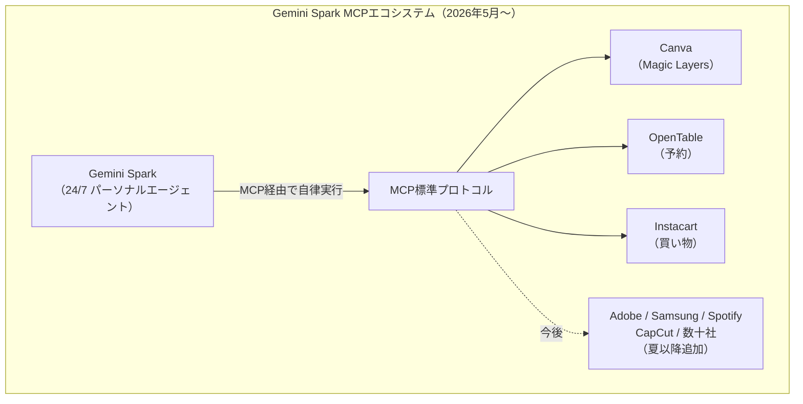
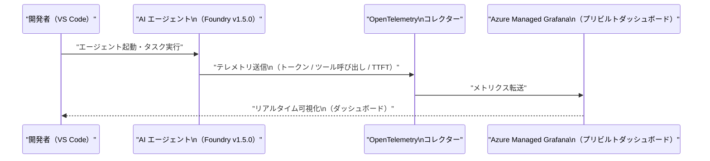
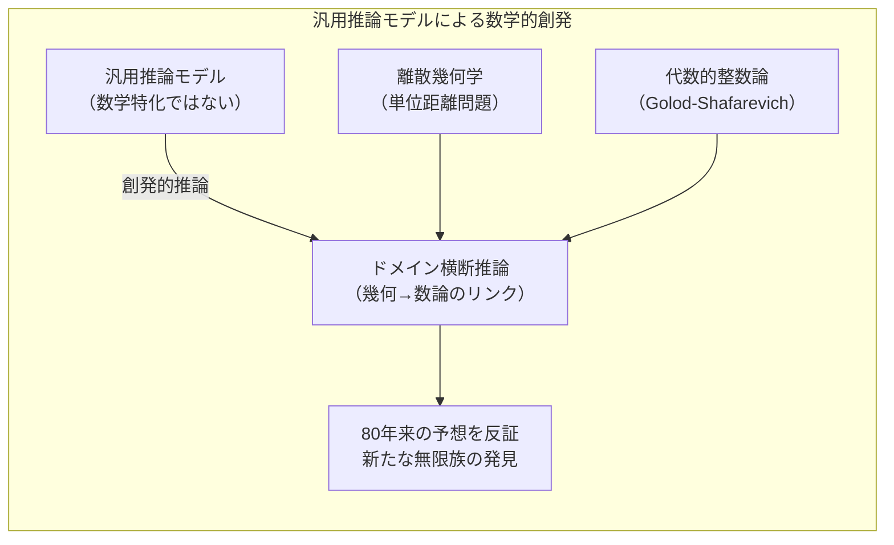
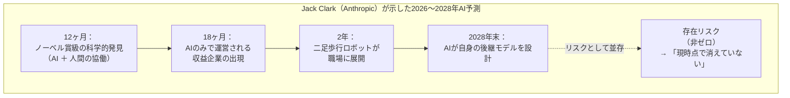
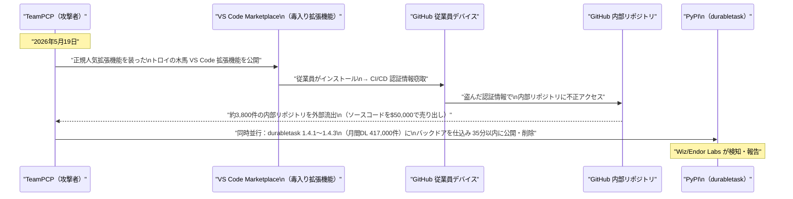
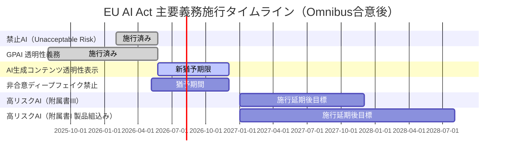

# LLM・AI Agent 最新情報レポート Vol.28

**作成日**: 2026年5月24日  
**対象期間**: 2026年5月23日〜2026年5月24日（Vol.27との差分）

---

## 目次

1. [Google Cloudアップデート](#1-google-cloudアップデート)
2. [Microsoft Azure AIアップデート](#2-microsoft-azure-aiアップデート)
3. [LLM Model / AI Agentアーキテクチャ・研究](#3-llm-model--ai-agentアーキテクチャ研究)
4. [公式ブログ・論文のリサーチ・要約](#4-公式ブログ論文のリサーチ要約)
   - [Google](#41-google)
   - [OpenAI](#42-openai)
   - [Anthropic](#43-anthropic)
5. [AI Agent搭載SaaS製品情報](#5-ai-agent搭載saas製品情報)
6. [LLM/AI Agentセキュリティインシデント](#6-llmai-agentセキュリティインシデント)
7. [その他特筆すべき情報](#7-その他特筆すべき情報)
8. [参考リンク](#8-参考リンク)

---

## 1. Google Cloudアップデート

### 1.1 Gemini Spark：Canva MCP 統合がAI Ultra向けにベータ開始

Vol.27 では「今後拡大予定」として記述していた **Gemini Spark の MCP サポート**について、Canva との統合が **Google AI Ultra サブスクライバー向けにベータ提供**を開始したことが確認された。[[1]](#ref-1)[[2]](#ref-2)

| 項目 | 内容 |
|---|---|
| **統合内容** | Canva の AI 機能（Magic Layers 含む）と Gemini Spark が MCP 経由でシームレス連携 |
| **対象ユーザー** | Google AI Ultra サブスクライバー（ベータ） |
| **その他ローンチパートナー** | OpenTable・Instacart（同時展開） |
| **夏以降予定** | Adobe・Samsung・Spotify・CapCut など数十社が追加される見込み |
| **技術的背景** | Claude・Cursor などが採用するオープン標準 MCP を採用しており、2,300以上のサーバーエコシステムとの将来的な互換性を確保 |

Gemini Spark が MCP という**オープン標準を採用**した点は重要で、Google 独自プロトコルへの閉鎖的な統合を避けることで、既存の Claude / Cursor 向け MCP エコシステムと共存する開発者フレンドリーな設計となっている。

---

## 2. Microsoft Azure AIアップデート

### 2.1 Azure AI Foundry Agent Framework v1.5.0：RAG・Skills・Memory サンプル拡充と Grafana 監視ダッシュボード

Azure AI Foundry の **Agent Framework が v1.5.0 にアップデート**され、エンタープライズ向けエージェント開発・監視の両面で機能強化が行われた。[[3]](#ref-3)[[4]](#ref-4)

#### v1.5.0 の主な変更点

| 変更点 | 内容 |
|---|---|
| **Foundry Hosted Agents サンプル拡充** | RAG・Skills・Memory の3パターンについてリファレンスサンプルを新規追加 |
| **ワークフロー出力処理改善** | オーケストレーションやワークフロー全体の出力ハンドリングが安定化 |
| **バグ修正** | core・GitHub Copilot・Hyperlight・Purview の各コンポーネントにまたがる修正 |
| **Azure OpenAI モデル報告の最新化** | 利用可能なモデルリストの自動更新精度を向上 |

#### Grafana ダッシュボード：AI エージェント監視の可視化

**Azure Managed Grafana 向けのプリビルトダッシュボード**が新たに提供され、VS Code 上で動作するエージェントが発する **OpenTelemetry シグナルをリアルタイム可視化**できるようになった。[[3]](#ref-3)

| 可視化指標 | 内容 |
|---|---|
| **エージェント操作ログ** | エージェントが実行したアクションの時系列 |
| **トークン使用量** | 入力・出力トークン数のリアルタイムトレース |
| **チャットセッション統計** | セッション数・継続時間分布 |
| **ツール呼び出し頻度** | どのツールが何回呼ばれているかの集計 |
| **レスポンスタイム** | モデル別の応答速度と TTFT（Time to First Token） |

従来は個別にログ収集・パース処理を実装する必要があったエージェント監視が、プリビルトダッシュボードで即時可視化できるようになり、**MLOps ならぬ AgentOps の標準化**が加速する。

---

## 3. LLM Model / AI Agentアーキテクチャ・研究

### 3.1 OpenAI 汎用推論モデルが Erdős 単位距離予想を証明：汎用モデルの数学的創発能力

OpenAI が5月20日に公開したブログで、**内部の汎用推論モデルが80年間未解決だったポール・エルデシュ（Paul Erdős）の離散幾何学予想を自律的に反証**したことが明らかになった。[[5]](#ref-5)[[6]](#ref-6)

#### 証明の概要

1946年に提唱されたエルデシュの単位距離問題（Unit Distance Problem）は、「n 点を平面上に配置したとき、距離がちょうど1になるペアの最大数はいくらか」を問うもの。約80年間、最良の配置は「正方格子」に類似する配置だと信じられてきた。

| 項目 | 内容 |
|---|---|
| **問題提唱者** | ポール・エルデシュ（1946年）、未解決期間 **約80年** |
| **使用モデル** | OpenAI 内部の汎用推論モデル（数学専用学習なし） |
| **証明手法** | 代数的整数論（Golod-Shafarevich 理論・無限類体塔）を幾何学問題に横断適用 |
| **成果** | 正方格子より**多項式因子で改善**する無限族の点配置を発見（指数 n^(1+δ), δ=0.014） |
| **独立検証** | Princeton 数学者 Will Sawin が δ=0.014 を確定。Fields 賞受賞者 Tim Gowers が「AI 数学のマイルストーン」と評価 |
| **発表媒体** | OpenAI 公式ブログ（5月20日） |

#### アーキテクチャ的示唆

この証明は**数学専用チューニングや問題固有のスキャフォールディングなしに、汎用推論モデルが独立したサブフィールドの中心的未解決問題を初めて自律証明**した事例として注目される。

従来のAI数学研究は「競技数学ベンチマーク（IMO 等）での高得点」にとどまっていたが、本事例は**研究レベルの未解決問題への創発的解決**として、DeepMind Aletheia（Vol.7 で報告）に続く大きな節目となった。

---

## 4. 公式ブログ・論文のリサーチ・要約

### 4.1 Google

新情報なし（Vol.27 までで Google I/O 2026 の主要発表を網羅済み）

---

### 4.2 OpenAI

#### Gartner 2026 Magic Quadrant for Enterprise AI Coding Agents：OpenAI と Codex が Leader に選出（5月20日）

Gartner が **「2026年版 エンタープライズ AI コーディングエージェント マジッククアドラント」** を公開し、**OpenAI（Codex）** が **Leader** に選出された。[[7]](#ref-7)[[8]](#ref-8)

| 企業 | 位置づけ | 特記事項 |
|---|---|---|
| **OpenAI（Codex）** | Leader | 週間利用者400万人超、NVIDIA 等エンタープライズ採用実績 |
| **GitHub（Copilot）** | Leader | **3年連続 Leader**。最多連続受賞 |
| **Cursor** | Leader | ビジョン・実行力ともに高評価 |
| その他 | 詳細は Gartner 報告書参照 | Challenger・Visionary・Niche Player 各区分にも主要プレーヤー |

**評価のポイント：**

- Codex は大規模コードベースの理解・ツール使用・テスト実行・人間レビュー向け準備という一連のソフトウェア開発ライフサイクルを自律実行できる点が評価された
- GPT-5.5 導入によるツール使用精度の向上とパフォーマンス改善も追加評価された

この報告書は、コーディングエージェント市場が「一般ツール」から「エンタープライズグレードの評価対象」へと成熟したことを示している。

---

### 4.3 Anthropic

#### Jack Clark、Oxford 講演：12ヶ月以内に AI がノーベル賞級発見、存在リスクは依然として非ゼロ（5月21日）

Anthropic 共同創業者 **Jack Clark** がオックスフォード大学での講演において、**12ヶ月以内に AI が人間と協働してノーベル賞に値する科学的発見を達成する**と予測すると同時に、AI の存在リスクが「依然として非ゼロ」であることを明言した。[[9]](#ref-9)[[10]](#ref-10)

#### 主要な発言

| 予測テーマ | 内容 | 期間目標 |
|---|---|---|
| **ノーベル賞級の科学的発見** | AI と人間の協働による達成 | **12ヶ月以内** |
| **二足歩行ロボットの現場展開** | 職人・技術者への現場補助 | **2年以内** |
| **AI のみで運営される企業** | 数百万ドル規模の売上を上げる AI 経営企業の出現 | **18ヶ月以内** |
| **AI の自己後継モデル設計** | AI が自身の次世代モデルの設計に参加 | **2028年末まで** |
| **存在リスク（Existential Risk）** | 「全人類を死に至らしめる可能性はゼロではない」 | 現時点 |

Clark は Anthropic が AI の商業的成長（9,000億ドル評価額・四半期初の黒字見通し）を追う一方で、「技術の進歩速度は人々が認識しているよりも速く、リスクは現実のものだ」と公言した。商業的成功とセーフティへの誠実な言及を並行させる姿勢は、業界内でも異色の立場として注目された。

---

## 5. AI Agent搭載SaaS製品情報

### 5.1 Gartner 2026 MQ から見えるエンタープライズ AI コーディングエージェント市場の成熟

Gartner が **Enterprise AI Coding Agents** を独立したマジッククアドラントとして初めて設定したことは、市場カテゴリとしての正式認定を意味する。[[7]](#ref-7)[[8]](#ref-8)

#### 主要 Leader プレーヤーの製品比較

| 製品 | 提供元 | 主な強み | エンタープライズ採用状況 |
|---|---|---|---|
| **Codex** | OpenAI | 複数ツール自律使用・大規模コードベース推論 | NVIDIA 等 Fortune 500 採用 |
| **GitHub Copilot** | GitHub/Microsoft | VSCode/JetBrains 統合・3年連続 Leader | 全世界100万企業以上 |
| **Cursor** | Anysphere | エディタネイティブ・MCP 対応・高精度補完 | スタートアップから大企業まで急速普及 |

この市場はわずか2年前まで「コード補完ツール」として認識されていたが、2026年の評価では「自律的にコードベース横断で推論・実行・テスト・PR準備までこなすエージェント」に評価軸が移行しており、SaaS 市場全体の AI エージェント化を象徴するカテゴリとなっている。

---

## 6. LLM/AI Agentセキュリティインシデント

### 6.1 TeamPCP Wave 4：毒入り VS Code 拡張機能で GitHub 内部リポジトリ 3,800件が流出（5月19〜20日）

Vol.27 でカバーした TanStack サプライチェーン攻撃（Wave 3）の直後、TeamPCP が **Wave 4 と呼ばれる新たな攻撃を展開**し、**GitHub の内部リポジトリ 3,800件超が流出**した。[[11]](#ref-11)[[12]](#ref-12)[[13]](#ref-13)

#### 攻撃タイムライン（Wave 4）

#### 攻撃の詳細

| 攻撃ベクター | 詳細 |
|---|---|
| **VS Code 拡張機能汚染** | 正規の人気拡張機能を偽装したマルウェア拡張を Marketplace に公開。GitHub 従業員がインストールし CI/CD 認証情報が流出 |
| **durabletask PyPI ワーム** | Microsoft の Azure Durable Task フレームワーク公式 Python SDK（月間 417,000 DL）の 3 バージョン（1.4.1・1.4.2・1.4.3）に悪意あるバックドアを埋め込み、35分以内に公開・削除 |
| **Mini Shai-Hulud ワーム** | CI/CD 認証情報を窃取し自動的に後続パッケージに感染を拡散する自己伝播型ワーム |
| **流出データ** | GitHub 内部リポジトリ約 3,800 件のソースコード |

#### Vol.27 との対比

| Wave | 主な標的 | 主要攻撃ベクター | 被害 |
|---|---|---|---|
| **Wave 3**（Vol.27で報告） | TanStack / OpenAI | npm パッケージ汚染 | OpenAI 従業員デバイス2台・コードサイン証明書漏洩 |
| **Wave 4**（本レポート） | GitHub / Microsoft Azure | VS Code 拡張機能 + PyPI | GitHub 内部リポジトリ 3,800件流出・durabletask ワーム |

TeamPCP は短期間に複数の AI/開発ツールチェーンを同時攻撃しており、**VS Code Marketplace という開発者の日常的な信頼先を新たな感染経路として確立**しつつある点が特に危険である。

---

## 7. その他特筆すべき情報

### 7.1 EU AI Act Omnibus 最終合意（5月7日）：高リスク義務を最大2年延期、SME 範囲拡大、非合意ディープフェイク禁止

Vol.5（5月5日）では「交渉合意に至らず」と報告していた **EU AI Act Omnibus** が、5月7日午前4時30分に欧州議会・理事会・欧州委員会の三者間で**最終合意**に達した。[[14]](#ref-14)[[15]](#ref-15)

#### 主要変更点

| 変更項目 | 旧規定 | 新規定 |
|---|---|---|
| **附属書III 高リスクAI（教育・雇用・生体認証等）施行** | 2026年8月2日 | **2027年12月2日**（約16か月延期） |
| **附属書I 高リスクAI（医療機器等に組み込まれるもの）施行** | 2026年8月2日 | **2028年8月2日**（2年延期） |
| **各国 AI 規制サンドボックス設置義務** | 2026年8月2日 | **2027年8月2日**（1年延期） |
| **AI 生成コンテンツの透明性表示猶予** | 6か月 | **3か月**（短縮） |
| **SME 簡易コンプライアンス対象範囲** | 〜250名・売上5,000万€ | **〜750名・売上150M€**（拡大） |
| **非合意ディープフェイク禁止** | なし | **全面禁止**（2026年12月2日まで猶予） |
| **EU レベル統合サンドボックス** | なし | **新設**（SME・スタートアップ優先アクセス） |

Omnibus の正式採択には欧州議会と理事会による正式投票が必要で、2026年6〜7月を目処に実施予定。企業は今回の延期を「追加猶予」ではなく**コンプライアンス態勢を整える残り時間**として活用することが求められる。

---

## 8. 参考リンク

**[1]** [Gemini Spark: Google's 24/7 AI Agent — I/O 2026 Developer Guide | DEV Community](https://dev.to/akaranjkar08/gemini-spark-googles-247-ai-agent-io-2026-developer-guide-6gn)

**[2]** [Google's Gemini Spark agent launches in major app overhaul | Resultsense](https://www.resultsense.com/news/2026-05-20-gemini-spark-app-evolution/)

**[3]** [Azure Updates in May 2026 | Azure Charts](https://azurecharts.com/updates?monthback=0)

**[4]** [New Microsoft tools connect AI agents with proper data | TechTarget](https://www.techtarget.com/searchdatamanagement/news/366634490/New-Microsoft-tools-connect-AI-agents-with-proper-data)

**[5]** [An OpenAI model has disproved a central conjecture in discrete geometry | OpenAI](https://openai.com/index/model-disproves-discrete-geometry-conjecture/)

**[6]** [OpenAI solves 80-year Erdős geometry problem: AI autonomously disproves the square grid conjecture | explainx.ai](https://explainx.ai/blog/openai-planar-unit-distance-erdos-problem-solved-2026)

**[7]** [OpenAI named a Leader in enterprise coding agents by Gartner | OpenAI](https://openai.com/index/gartner-2026-agentic-coding-leader/)

**[8]** [Cursor named a Leader in the 2026 Gartner® Magic Quadrant™ for Enterprise AI Coding Agents | Cursor](https://cursor.com/blog/cursor-leads-gartner-mq-2026)

**[9]** [Jack Clark: AI will help win a Nobel within 12 months | Resultsense](https://www.resultsense.com/news/2026-05-21-jack-clark-anthropic-ai-nobel-prize-prediction/)

**[10]** ["There is a non-zero chance AI could kill everyone," warns Anthropic co-founder Jack Clark | Startuppedia](https://startuppedia.in/trending/jack-clark-claims-that-advanced-ai-systems-could-eventually-wipe-out-humanity-11866896)

**[11]** [GitHub confirms 3,800 internal repos stolen through poisoned VS Code extension | VentureBeat](https://venturebeat.com/security/github-confirms-3800-repos-stolen-poisoned-vs-code-extension-supply-chain-worm-microsoft-python-sdk)

**[12]** [TeamPCP Wave Four: GitHub Breach via Poisoned VS Code Extension, durabletask PyPI Worm | Phoenix Security](https://phoenix.security/teampcp-github-breach-durabletask-pypi-supply-chain-wave-four-2026/)

**[13]** [durabletask: TeamPCP's Latest PyPI Compromise | Wiz Blog](https://www.wiz.io/blog/durabletask-teampcp-supply-chain-attack)

**[14]** [Artificial Intelligence: Council and Parliament agree to simplify and streamline rules | EU Council](https://www.consilium.europa.eu/en/press/press-releases/2026/05/07/artificial-intelligence-council-and-parliament-agree-to-simplify-and-streamline-rules/)

**[15]** [EU AI Act Update: Timeline Relief, Targeted Simplification, and New Prohibitions | Inside Privacy](https://www.insideprivacy.com/artificial-intelligence/eu-ai-act-update-timeline-relief-targeted-simplification-and-new-prohibitions/)
