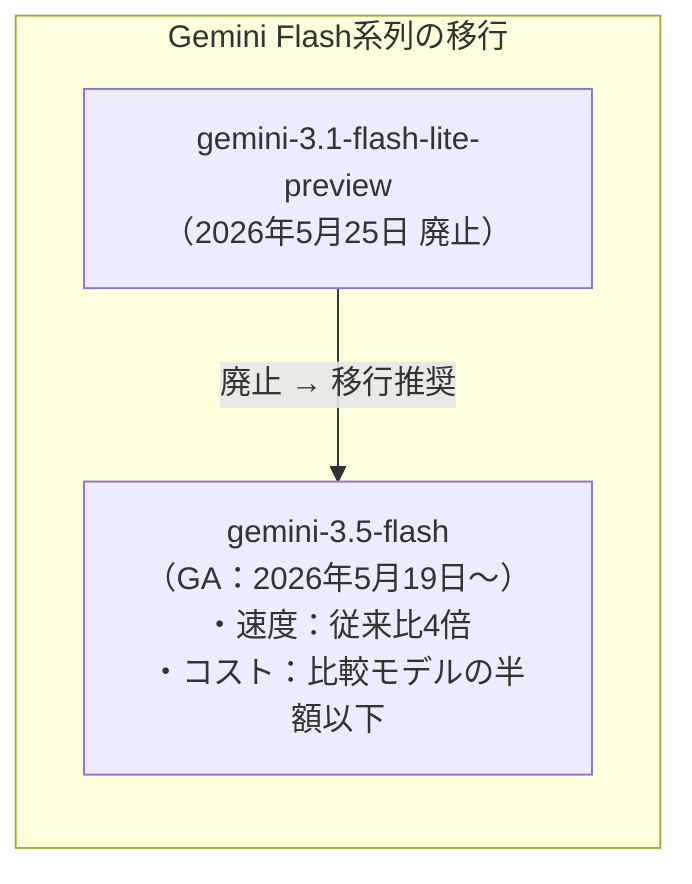
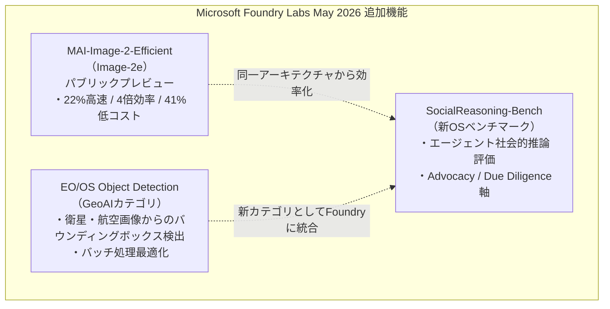
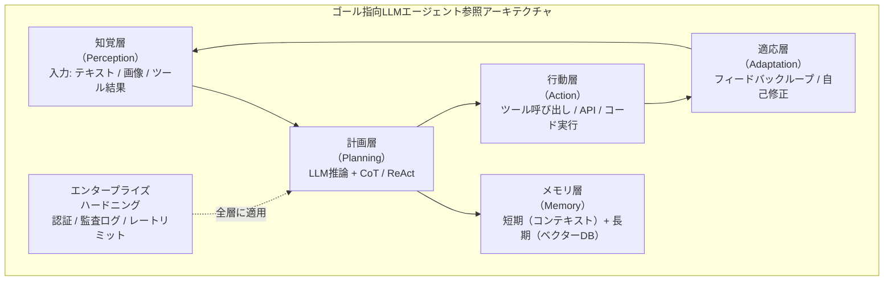
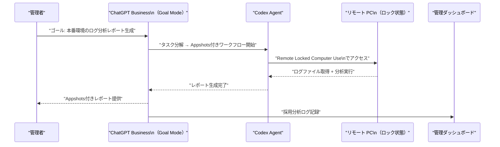
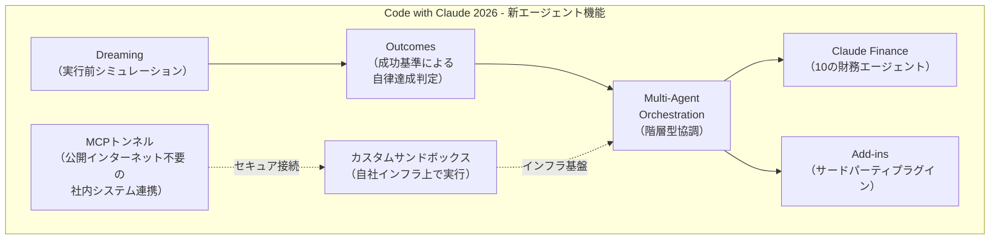
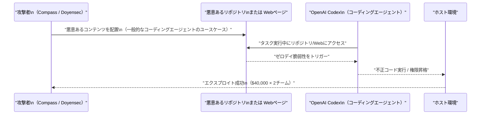
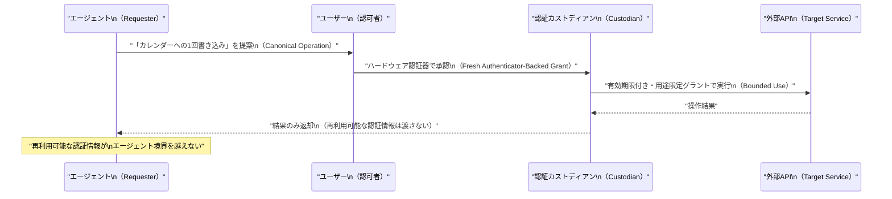

# LLM・AI Agent 最新情報レポート Vol.29

**作成日**: 2026年5月25日  
**対象期間**: 2026年5月24日〜2026年5月25日（Vol.28との差分）

---

## 目次

1. [Google Cloudアップデート](#1-google-cloudアップデート)
2. [Microsoft Azure AIアップデート](#2-microsoft-azure-aiアップデート)
3. [LLM Model / AI Agentアーキテクチャ・研究](#3-llm-model--ai-agentアーキテクチャ研究)
4. [公式ブログ・論文のリサーチ・要約](#4-公式ブログ論文のリサーチ要約)
   - [Google](#41-google)
   - [OpenAI](#42-openai)
   - [Anthropic](#43-anthropic)
5. [AI Agent搭載SaaS製品情報](#5-ai-agent搭載saas製品情報)
6. [LLM/AI Agentセキュリティインシデント](#6-llmai-agentセキュリティインシデント)
7. [その他特筆すべき情報](#7-その他特筆すべき情報)
8. [参考リンク](#8-参考リンク)

---

## 1. Google Cloudアップデート

### 1.1 Gemini API: gemini-3.1-flash-lite-preview が本日（5月25日）でシャットダウン

Gemini API の公式チェンジログによると、**プレビューモデル `gemini-3.1-flash-lite-preview` が 2026年5月25日をもって廃止**された。[[1]](#ref-1)

| 項目 | 内容 |
|---|---|
| **廃止モデル** | `gemini-3.1-flash-lite-preview` |
| **廃止日** | 2026年5月25日 |
| **推奨移行先** | `gemini-3.5-flash`（Google I/O 2026 で GA された最新フラッシュモデル） |
| **影響範囲** | プレビューAPIを直接利用していた開発者・サービス |

`gemini-3.1-flash-lite-preview` は軽量・低コストユースケース向けのプレビューモデルとして提供されていたが、Google I/O 2026（5月19日）で **Gemini 3.5 Flash** が一般提供（GA）となったため、後継への移行が促される形となった。Gemini 3.5 Flash は同モデル比でベンチマーク精度・速度ともに大幅に向上しており、移行のインセンティブは高い。

---

## 2. Microsoft Azure AIアップデート

### 2.1 Microsoft Foundry Labs 5月アップデート：MAI-Image-2-Efficient、SocialReasoning-Bench、GeoAI

**Microsoft Foundry Labs の「What's New – May 2026」** が公開され、画像生成・ソーシャル推論・地理空間AIの3分野で新モデル・新ベンチマーク・新エンドポイントが追加された。[[2]](#ref-2)[[3]](#ref-3)

---

#### MAI-Image-2-Efficient（Image-2e）: パブリックプレビュー

**MAI-Image-2-Efficient（通称 Image-2e）** が Foundry および MAI Playground でパブリックプレビュー公開された。MAI-Image-2 と同じアーキテクチャを持ちながら、プロダクションワークロード向けに効率化されたモデルである。[[3]](#ref-3)

| 指標 | MAI-Image-2 | **MAI-Image-2-Efficient（Image-2e）** |
|---|---|---|
| **速度** | ベースライン | **最大22%高速** |
| **GPU効率** | ベースライン | **4倍効率的** |
| **他社モデルとの比較** | — | レイテンシ・GPU使用量正規化で**平均40%上回る** |
| **画像出力価格** | $33 / 1M tokens | **$19.50 / 1M tokens（約41%削減）** |
| **テキスト入力価格** | $5 / 1M tokens | $5 / 1M tokens（変更なし） |

主なユースケースはECプラットフォームの大量バッチ画像生成、リアルタイムデザインツール、マーケティング向け自動コンセプトアート生成などである。

---

#### SocialReasoning-Bench: エージェント社会的推論ベンチマーク（新規公開）

**Microsoft Research AI Frontiers** が、**エージェントの「他者利益代弁能力（advocacy）」を測定する新しいオープンソースベンチマーク SocialReasoning-Bench** を公開した。[[2]](#ref-2)

| 項目 | 内容 |
|---|---|
| **測定対象** | エージェントが別ユーザーの利益を適切に代弁できるか（Advocacy） |
| **主要シナリオ** | Calendar Coordination（スケジュール調整代行）、Marketplace Negotiation（価格交渉代行） |
| **評価軸** | Outcome Optimality（結果の最適性）、Due Diligence（適切な注意義務） |
| **公開形態** | オープンソース |

既存のエージェントベンチマーク（SWE-bench、TAU-bench など）はタスク遂行精度を主に測定するが、SocialReasoning-Bench は「エージェントが依頼者以外の第三者や対話相手の利益を適切に考慮できるか」という**社会的知性・倫理的判断軸**を評価する点で独自性がある。

---

#### EO/OS Object Detection：新 GeoAI カテゴリとして Foundry に追加

航空・衛星画像向けの **EO/OS Object Detection** マネージドエンドポイントが Foundry に新たな **GeoAI カテゴリ**として追加された。バウンディングボックス検出に最適化されており、バッチ処理向け設計となっている。[[2]](#ref-2)

---

## 3. LLM Model / AI Agentアーキテクチャ・研究

### 3.1 「LLM-Powered AI Agent Systems and Their Applications in Industry」：産業応用視点での包括サーベイ

arXiv に公開された **「LLM-Powered AI Agent Systems and Their Applications in Industry」（arxiv: 2505.16120）** が、ルールベース・強化学習から現代のLLM駆動アーキテクチャに至るエージェントシステムの進化を包括的にまとめている。[[4]](#ref-4)

#### 主要な整理フレームワーク

| フェーズ | エージェントアーキテクチャ | 特徴 |
|---|---|---|
| **Pre-LLM Era** | ルールベース・RL | 固定ルール・強化学習による狭域タスク処理 |
| **LLM Integration** | LLM + Tool Use | 自然言語理解 + 外部ツール呼び出し |
| **現代 LLM-Driven** | マルチエージェント + マルチモーダル | 複数エージェント協調・音声/画像/コード統合推論 |

論文では産業応用例として、**ソフトウェアエンジニアリング・科学的発見・ロボティクス**の3分野でのLLMエージェント実装パターンを体系化している。

---

### 3.2 「From Prompt-Response to Goal-Directed Systems」：プロダクション向けLLMエージェント参照アーキテクチャ

**「From Prompt-Response to Goal-Directed Systems: The Evolution of Agentic AI Software Architecture」（arxiv: 2602.10479）** は、ステートレスなプロンプト駆動モデルから、**自律的な知覚・計画・行動・適応の反復制御ループ**を持つゴール指向システムへの設計パラダイムシフトを詳細に論じる。[[5]](#ref-5)

#### プロダクション向け参照アーキテクチャの主要要素

同論文はマルチエージェントトポロジーの分類（Hierarchical / Peer-to-Peer / Pipeline）と、エンタープライズ環境への展開チェックリスト（15項目）も提供しており、**設計から本番運用までをカバーする実践的参照資料**として注目される。

---

## 4. 公式ブログ・論文のリサーチ・要約

### 4.1 Google

#### Gemini 3.5 Flash：エージェント・コーディング特化の最強 Flash モデル詳細

Google I/O 2026（5月19日）で発表された **Gemini 3.5 Flash** のテクニカル詳細が公式ブログおよびサードパーティ解析から明らかになった。[[6]](#ref-6)[[7]](#ref-7)

| ベンチマーク | Gemini 3.5 Flash | 旧 Gemini 3.1 Pro | 優位性 |
|---|---|---|---|
| **Terminal-Bench 2.1** | **76.2%** | — | 長時間エージェントタスク |
| **GDPval-AA** | **1656 Elo** | — | エージェント汎用性評価 |
| **MCP Atlas** | **83.6%** | — | MCP ツール使用精度 |
| **CharXiv（マルチモーダル）** | **84.2%** | — | 画像・グラフ理解 |
| **出力速度** | 他フロンティアモデル比 **4倍** | — | リアルタイム推論 |
| **コスト** | 比較可能モデルの **半額以下** | — | 経済効率 |

Gemini 3.5 Flash の特筆すべき点は、**「Flash 系列でありながらフロンティアモデルに匹敵する精度を実現」**した点である。従来のFlashモデルは速度優先で精度を犠牲にしていたが、3.5世代でその二律背反が解消されつつある。

現在 Google は **Gemini 3.5 Pro**（内部利用中）の来月ロールアウトも予告しており、同モデルがどのような性能特性を持つかが次の注目点となる。

---

### 4.2 OpenAI

#### ChatGPT Business：Codex ワークフロー強化・ゴールモード GA・リモートロック PC 制御

ChatGPT Business プランに複数の新機能が追加された。[[8]](#ref-8)

| 機能 | 内容 | 利用可否 |
|---|---|---|
| **Codex ワークフロー with Appshots** | コーディングエージェントの作業状態をスクリーンショット付きで可視化・共有 | Business 向け GA |
| **Goal Mode（ゴールモード）** | 複数ステップタスクを自然言語でゴール指定して自律実行 | **一般提供（GA）** |
| **ブラウザアノテーション強化** | ブラウザ上で AI が要素にコメント・ハイライトを付与 | GA |
| **Browser-Use ツール改善** | Webブラウザ操作エージェントの安定性・精度向上 | GA |
| **Remote Locked Computer Use** | ロック状態のリモートPCをエージェントが操作 | Business 向けベータ |
| **共有プラグイン（Workspace Reuse）** | ワークスペース内でプラグイン設定を共有 | GA |
| **管理者向け採用分析** | 組織内の ChatGPT 活用状況ダッシュボード | GA |

特に **Remote Locked Computer Use** は、物理的にロックされた PC をリモートエージェントが操作できる機能であり、ITオペレーション自動化に向けた大きな一歩である。セキュリティ面での慎重な運用が求められる。

---

### 4.3 Anthropic

#### Code with Claude 2026（ロンドン）：5つの新エージェント機能を発表

Anthropic のデベロッパーカンファレンス **「Code with Claude 2026」** がロンドン（5月19〜21日）で開催され、5つの新エージェント機能がシップされた。[[9]](#ref-9)[[10]](#ref-10)[[11]](#ref-11)

| 機能 | 概要 |
|---|---|
| **Dreaming（ドリーミング）** | エージェントが実行前に複数シナリオをシミュレートし、最適アプローチを選択するプランニング機能 |
| **Outcomes（アウトカムズ）** | タスクを「成功基準」で定義し、エージェントが達成判定を自律実行 |
| **Multi-Agent Orchestration** | 複数の Claude エージェントを階層的に協調実行するネイティブオーケストレーション |
| **Claude Finance** | 財務分析・報告・予測向けに事前設定された10種のエージェント群 |
| **Add-ins** | サードパーティ機能をワンクリックでエージェントに追加するプラグイン機構 |

#### 注目のインフラ発表：サンドボックスと MCP トンネル

| インフラ機能 | 内容 |
|---|---|
| **カスタムサンドボックス** | 企業が自社インフラ上でエージェントを実行できる分離実行環境 |
| **MCP トンネル** | 社内システムとエージェントを**公開インターネットを経由せずに**接続する内部トンネル機能 |

MCP トンネルは、外部公開できない社内 API や機密データベースをエージェントに安全に連携する手段として、エンタープライズ導入の障壁を大きく下げる。

会場では「過去1週間で Claude が完全に書いた PR をシップした人は？」という問いに対し、**満員の会場の約半数が挙手した**という報告があり、AI によるコーディング自動化の急速な普及を象徴するシーンとなった。

---

## 5. AI Agent搭載SaaS製品情報

### 5.1 SAP Sapphire 2026：200以上のエージェントを擁する「Autonomous Enterprise」を発表

SAP は年次カンファレンス **SAP Sapphire 2026**（マドリード、5月21日）において、**Anthropic との戦略的パートナーシップのもと、200以上のドメイン特化エージェントを擁する「Autonomous Enterprise（自律型エンタープライズ）」構想**を発表した。[[12]](#ref-12)[[13]](#ref-13)

#### SAP Business AI Platform の構成

| 構成要素 | 内容 |
|---|---|
| **SAP Business Technology Platform** | 既存開発基盤 |
| **SAP Business Data Cloud** | データ統合・ガバナンス基盤 |
| **SAP Business AI** | AIエージェント実行・管理基盤 |
| **→ 統合後** | 上記3つを単一のガバナンス環境に統合した **SAP Business AI Platform** |

#### Joule エコシステムの拡張

| 機能 | 内容 |
|---|---|
| **Joule Assistants** | 財務・サプライチェーン・調達・HCM・CX に跨る **50以上のドメイン特化アシスタント** |
| **専門エージェント群** | Joule Assistants が指揮する **200以上の特化エージェント** |
| **Joule Work** | ユーザーが「望む業務アウトカム」を言語で記述するだけで、Joule がワークフロー・データ・エージェントを自律的にオーケストレーション |
| **Autonomous Close Assistant** | 財務クローズプロセスを「数週間から数日へ」短縮（仕訳・照合・エラー解決を自動化） |

Anthropic 社長 Daniela Amodei は「Claude が SAP の財務・人事・サプライチェーン全体のエージェント業務を担う」と声明を発表。企業ERPとLLMの大規模統合という観点で、SAP の本発表は業界全体への波及効果が大きい。

---

### 5.2 AI Agentビジネスモデルの4分岐：TechTimes 分析（5月24日）

TechTimes が**2026年5月24日**に公開した分析記事では、現在のAIエージェント市場が**4つの根本的に異なるビジネスモデル**に分化しつつあることを指摘している。[[14]](#ref-14)

| モデル | 代表例 | 特徴 |
|---|---|---|
| **オープンソース・コミュニティ型** | OpenClaw（GitHub Stars 37万超）、Hermes Agent（Nous Research） | コミュニティ主導の急成長。Hermes Agent は5月10日に OpenRouter 上の1日推論量1位（2,240億トークン）を記録 |
| **トークン課金型（Token Distribution）** | 各種 API エージェント | 利用量ベース（APIコール数・トークン数）で課金。従来のシート課金から脱却 |
| **SaaSサブスクリプション型** | Genspark（ARR $2億超、Series B $3.85億） | 月次・年次定額型。ただし「1ユーザー＝1ライセンス」モデルはエージェント化で崩壊しつつある |
| **アクイジション/統合型** | Manus（Meta が $20億で買収合意 → 中国当局が阻止） | 大手プラットフォームへの吸収統合 |

この分類は、従来の「SaaS対API」という二項対立を超えた**市場の多極化**を示している。特にオープンソース型の急成長は、クローズドモデルの優位性が縮小していることを示唆する。

---

## 6. LLM/AI Agentセキュリティインシデント

### 6.1 Pwn2Own Berlin 2026 最終結果：47件のゼロデイで$1,298,250、AIコーディングエージェントカテゴリが初登場

ベルリンで5月14〜16日に開催された **Pwn2Own Berlin 2026** が全3日間の競技を終了し、**47件のゼロデイ脆弱性に対して総額 $1,298,250（約1.9億円）** が支払われた。AIカテゴリが初めて本格導入されたことが今回の大きな特徴である。[[15]](#ref-15)[[16]](#ref-16)

#### AI 関連カテゴリの結果

| カテゴリ | 内容 | 結果 |
|---|---|---|
| **AI Database** | ベクトルDB・AIデータストア | 複数エントリが成功 |
| **Coding Agent** | AI コーディングエージェント | **OpenAI Codex が2チームにより独立して攻略（各 $40,000）** |
| **Local Inference** | ローカル推論エンジン | 複数成功 |
| **NVIDIA** | NVIDIA GPU・ドライバ | 複数成功 |

Compass Security と Doyensec の maitai チームがそれぞれ **独立して OpenAI Codex** を攻略し、各 $40,000 を獲得。Compass Security は **Anthropic Claude Code** にも挑戦したが、既存エントリとの1脆弱性衝突（collision）により $20,000 と 2 Master of Pwn ポイントを獲得した（フル攻略扱いにはならず）。

#### Coding Agent カテゴリのルールと示唆

ZDI（Zero Day Initiative）の規定では、コーディングエージェントへの攻撃は「一般的なエージェントのユースケースを代表するベクター（コントリビューター管理のWebページ・リポジトリ・メディアファイルとのインタラクション）」を利用する必要があった。これはすなわち、**現実の開発フローでエージェントが触れるリポジトリやWebコンテンツが攻撃ベクターになりうること**を公式競技の場で確認した初の事例といえる。

#### Pwn2Own 2026 最終順位

| 順位 | チーム | ポイント | 賞金 |
|---|---|---|---|
| **1位** | DEVCORE | 50.5 | **$505,000** |
| その他 | 複数チーム | — | 合計 $1,298,250 |

DEVCORE は Microsoft SharePoint・Exchange・Edge・Windows を攻略して優勝。AIカテゴリ以外でも多数のゼロデイが発見されており、エンタープライズソフトウェア全体の脆弱性の深刻さが改めて示された。

---

### 6.2 SUDP：エージェントシステム向け「秘密委任プロトコル」が提唱（5月25日ハイライト）

arXiv 論文 **「SUDP: Secret-Use Delegation Protocol for Agentic Systems」（2604.24920）** が、2026年5月25日付の週次脅威レポート（Xloggs）でセキュリティコミュニティに広くハイライトされた。[[17]](#ref-17)[[18]](#ref-18)

#### 解決しようとする問題：Authorization by Exposure

現在のエージェントランタイムの多くは、**エージェントが外部APIやクラウドサービスを操作するために必要な認証情報（APIキー・OAuthトークン等）をランタイム環境内に平文で配置**する「Authorization by Exposure」パターンを採用している。

このアプローチの問題点：
- プロンプトインジェクション攻撃でランタイムが侵害された場合、**再利用可能な認証情報が丸ごと流出**する
- ツール側の侵害（TeamPCP のような攻撃）がそのまま**永続的なアカウント乗っ取り**につながる

#### SUDP の解決アプローチ

| 従来のアプローチ | SUDP |
|---|---|
| 再利用可能なAPIキーをランタイムに配置 | 操作ごとに有効期限付きグラントを発行 |
| プロンプトインジェクション → 永続侵害 | 侵害されても単一操作の範囲内に限定 |
| ユーザーの明示的承認なしに実行 | 各操作にユーザーのハードウェア認証器承認が必要 |

SUDP は「AIエージェントが行動するたびにユーザーが毎回承認する」という UX 上の課題も抱えているが、論文では**バッチ承認・ポリシーベース自動承認**による緩和策も提示しており、実用化への道筋が示されている。

---

## 7. その他特筆すべき情報

新情報なし

---

## 8. 参考リンク

**[1]** [Release notes | Gemini API | Google AI for Developers](https://ai.google.dev/gemini-api/docs/changelog)

**[2]** [What's New in Microsoft Foundry Labs – May 2026 | Microsoft Community Hub](https://techcommunity.microsoft.com/blog/azure-ai-foundry-blog/whats-new-in-microsoft-foundry-labs-%E2%80%93-may-2026/4520310)

**[3]** [Introducing MAI-Image-2-Efficient: Faster, More Efficient Image Generation | Microsoft Community Hub](https://techcommunity.microsoft.com/blog/azure-ai-foundry-blog/introducing-mai-image-2-efficient-faster-more-efficient-image-generation/4510918)

**[4]** [LLM-Powered AI Agent Systems and Their Applications in Industry | arXiv: 2505.16120](https://arxiv.org/html/2505.16120v2)

**[5]** [From Prompt-Response to Goal-Directed Systems: The Evolution of Agentic AI Software Architecture | arXiv: 2602.10479](https://arxiv.org/pdf/2602.10479)

**[6]** [Gemini 3.5: frontier intelligence with action | Google Blog](https://blog.google/innovation-and-ai/models-and-research/gemini-models/gemini-3-5/)

**[7]** [Google Introduces Gemini 3.5 Flash at I/O 2026: A Faster and Cheaper Model for AI Agents and Coding | MarkTechPost](https://www.marktechpost.com/2026/05/20/google-introduces-gemini-3-5-flash-at-i-o-2026-a-faster-and-cheaper-model-for-ai-agents-and-coding/)

**[8]** [OpenAI Release Notes - May 2026 Latest Updates | Releasebot](https://releasebot.io/updates/openai)

**[9]** [Code with Claude — Anthropic's Developer Conference | claude.com](https://claude.com/code-with-claude)

**[10]** [Code with Claude 2026: 5 New Agent Features Anthropic Just Shipped | MindStudio](https://www.mindstudio.ai/blog/code-with-claude-2026-new-agent-features)

**[11]** [Anthropic's Code with Claude showed off coding's future—whether you like it or not | MIT Technology Review](https://www.technologyreview.com/2026/05/21/1137735/anthropics-code-with-claude-showed-off-codings-future-whether-you-like-it-or-not/)

**[12]** [SAP Unveils the Autonomous Enterprise | SAP Sapphire | SAP News Center](https://news.sap.com/2026/05/sap-sapphire-sap-unveils-autonomous-enterprise/)

**[13]** [SAP unveils Autonomous Enterprise with 200+ AI agents and Anthropic partnership at Sapphire 2026 | The Next Web](https://thenextweb.com/news/sap-autonomous-enterprise-ai-agents-sapphire)

**[14]** [AI Agent Business Models Split Four Ways: Open-Source Infrastructure, Token Distribution, SaaS, Acquisition | TechTimes (May 24, 2026)](https://www.techtimes.com/articles/317075/20260524/ai-agent-business-models-split-four-ways-open-source-infrastructure-token-distribution-saas.htm)

**[15]** [Hackers earn $1,298,250 for 47 zero-days at Pwn2Own Berlin 2026 | BleepingComputer](https://www.bleepingcomputer.com/news/security/hackers-earn-1-298-250-for-47-zero-days-at-pwn2own-berlin-2026/)

**[16]** [Pwn2Own Berlin 2026, 47 Zero-Days and the New AI Toolchain Attack Surface | Penligent](https://www.penligent.ai/hackinglabs/pwn2own-berlin-2026-47-zero-days/)

**[17]** [SUDP: Secret-Use Delegation Protocol for Agentic Systems | arXiv: 2604.24920](https://arxiv.org/abs/2604.24920)

**[18]** [Weekly Threat Report 2026-05-25 | Xloggs AI Security and News](https://www.xloggs.com/2026/05/25/weekly-threat-report-2026-05-25/)
