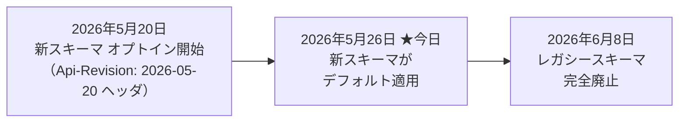
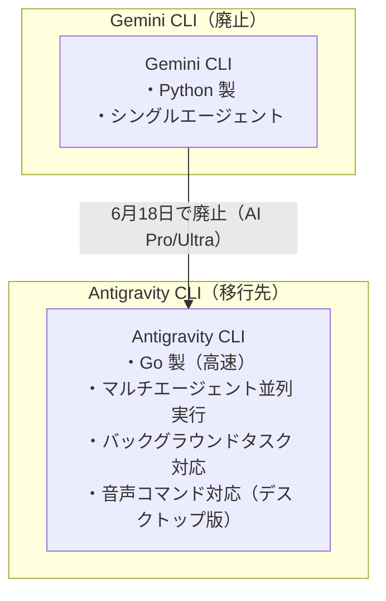
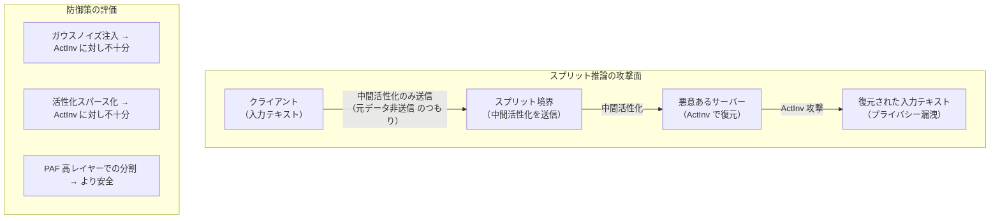
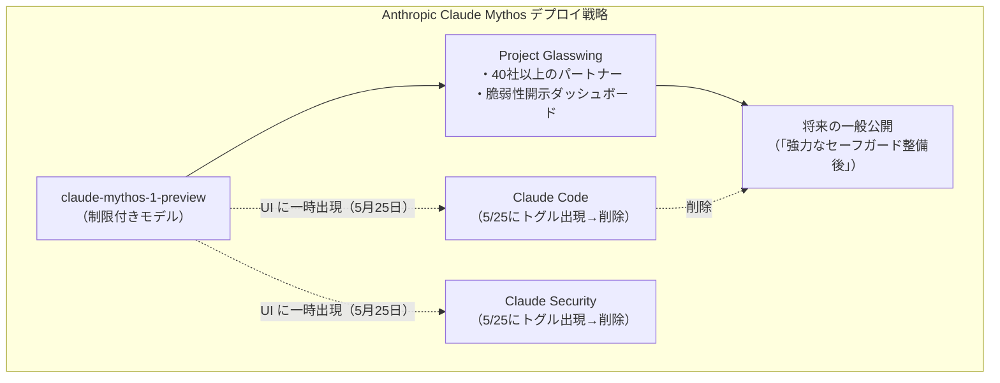
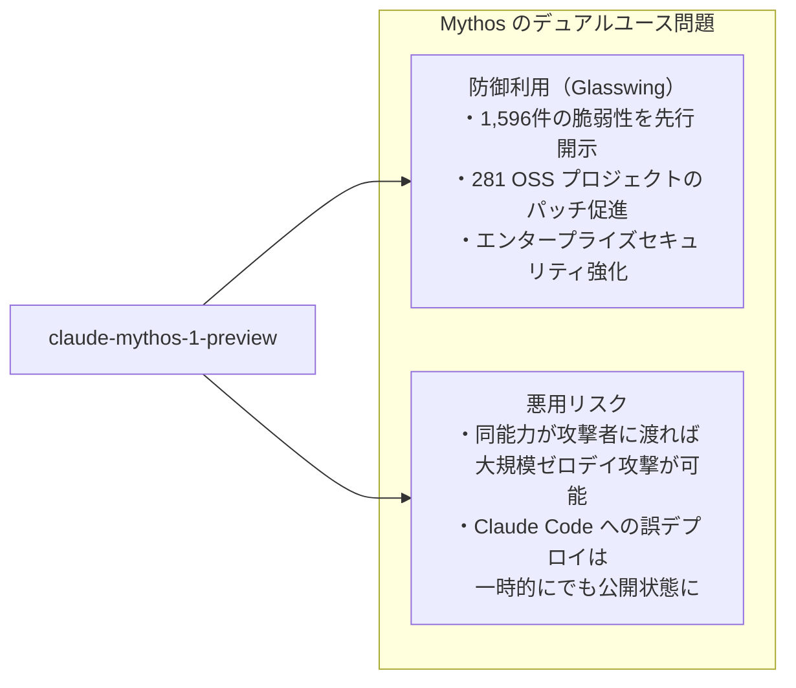

# LLM・AI Agent 最新情報レポート Vol.30

**作成日**: 2026年5月26日  
**対象期間**: 2026年5月25日〜2026年5月26日（Vol.29との差分）

---

## 目次

1. [Google Cloudアップデート](#1-google-cloudアップデート)
2. [Microsoft Azure AIアップデート](#2-microsoft-azure-aiアップデート)
3. [LLM Model / AI Agentアーキテクチャ・研究](#3-llm-model--ai-agentアーキテクチャ研究)
4. [公式ブログ・論文のリサーチ・要約](#4-公式ブログ論文のリサーチ要約)
   - [Google](#41-google)
   - [OpenAI](#42-openai)
   - [Anthropic](#43-anthropic)
5. [AI Agent搭載SaaS製品情報](#5-ai-agent搭載saas製品情報)
6. [LLM/AI Agentセキュリティインシデント](#6-llmai-agentセキュリティインシデント)
7. [その他特筆すべき情報](#7-その他特筆すべき情報)
8. [参考リンク](#8-参考リンク)

---

## 1. Google Cloudアップデート

### 1.1 Gemini API Interactions API v1beta：Breaking Change が本日（5月26日）デフォルト適用

Gemini API の **Interactions API v1beta に対する破壊的変更（Breaking Change）が2026年5月26日にデフォルト適用**となった。レスポンス構造の刷新を伴う移行であり、統合済みの開発者はコードの更新が必要。[[1]](#ref-1)[[2]](#ref-2)

#### 主な変更内容

| 変更箇所 | 旧スキーマ | 新スキーマ |
|---|---|---|
| **レスポンス配列** | `outputs` 配列 | `steps` 配列（タイムライン構造） |
| **ステップ種別** | 単一形式 | `user_input` / `model_output` / `function_call` 等の多型構造 |
| **出力フォーマット制御** | `response_mime_type` （個別フィールド） | `response_format` （統合ポリモーフィック型） |
| **履歴渡し** | `outputs` 配列を次リクエストに渡す | `steps` 配列を次リクエストに渡す |

#### 移行タイムライン

5月26日〜6月8日の間は、`Api-Revision: 2026-05-07` ヘッダを付与することで旧スキーマに一時的にオプトアウト可能だが、6月8日に完全廃止となるため早期移行が強く推奨される。

**変更の背景：** 新 `steps` 配列は、インタラクションの実行タイムラインを構造化して記録することで、将来的な「mid-flight ステアリング（実行中の介入制御）」や「非同期ツールコール」を実現するための基盤整備である。

---

### 1.2 Gemini CLI → Antigravity CLI 移行：6月18日デッドライン接近

Google が I/O 2026（5月19日）に発表した **Gemini CLI の Antigravity CLI への移行**について、**Google AI Pro / Ultra ユーザー向けの移行デッドラインが 2026年6月18日**であることを Google Developers Blog が詳細を公開した。[[3]](#ref-3)[[4]](#ref-4)

| 対象 | 詳細 |
|---|---|
| **廃止されるもの** | Gemini CLI、Gemini Code Assist IDE 拡張（AI Pro / Ultra 向け） |
| **廃止日（AI Pro/Ultra）** | **2026年6月18日** |
| **継続サービス対象** | Gemini Code Assist Standard / Enterprise ライセンス（引き続きサポート） |
| **移行先** | Antigravity CLI（Go 製、Agent Skills・Hooks・Subagents・プラグイン継承） |

#### Antigravity CLI の主な機能強化点

Antigravity CLI は Antigravity 2.0 デスクトップアプリと同一のエージェントハーネスを共有しており、複数サブエージェントを並列実行して大規模なリファクタリングや調査タスクをターミナルセッションをブロックせずに実行できる。Google は 6,000 件を超えるコミュニティコントリビューションを受け入れた後に Gemini CLI を事実上 Antigravity へ移行した形となる。[[5]](#ref-5)

---

## 2. Microsoft Azure AIアップデート

新情報なし

---

## 3. LLM Model / AI Agentアーキテクチャ・研究

### 3.1 「What Does the Server See?」：スプリット推論デプロイの中間活性化からの入力復元攻撃（arxiv: 2605.23158）

arXiv に公開された **「What Does the Server See? Understanding Privacy Leakage from Large Language Models in Split Inference」（arxiv: 2605.23158）** が、エッジ・クラウド分割推論（Split Inference）のプライバシー上の脆弱性を体系的に実証した。[[6]](#ref-6)

#### スプリット推論とプライバシーリスク

スプリット推論（Split Inference）は、大規模モデルをクライアント側とサーバー側に分割配置することで、エッジデバイス（スマートフォン・IoTデバイス等）でのLLM推論を実現するアーキテクチャである。**クライアントは生データを送信せず、中間活性化（Intermediate Activations）のみをサーバーに送る**ことでプライバシーを守る設計だが、今回の研究はこの前提を覆した。

#### 提案手法：ActInv（Activation Inversion）

研究チームが提案した **ActInv** は、サーバーが受け取った中間活性化からクライアントの**元入力テキストを高精度で復元する攻撃手法**である。

| 項目 | 内容 |
|---|---|
| **攻撃名** | ActInv（Activation Inversion） |
| **攻撃対象** | スプリット推論時にサーバーが受け取る中間活性化 |
| **攻撃形式** | 中間活性化のマッチング問題として定式化 |
| **耐性評価** | ガウスノイズ注入・活性化スパース化などの既存防御を突破 |
| **成果** | 高精度でのオリジナル入力テキストの再構築 |

#### PAF（Perturbation Amplification Factor）

論文は、各レイヤーが復元攻撃に対してどれほど耐性を持つかを定量化する新指標 **PAF（Perturbation Amplification Factor）** も提案している。PAF が高いレイヤーほど外部から加えたノイズを増幅して伝播させるため、活性化の逆変換が困難になり、スプリットポイントとして適切である。

**実用的含意：** 医療診断・個人財務・法律相談など機密性の高いデータをエッジデバイスで処理する際に、スプリット推論を「安全なプライバシー保護手段」として採用していた設計は見直しが必要になる可能性がある。

---

## 4. 公式ブログ・論文のリサーチ・要約

### 4.1 Google

新情報なし

---

### 4.2 OpenAI

新情報なし

---

### 4.3 Anthropic

#### Claude Mythos（claude-mythos-1-preview）が Claude Code の UI に出現・消失（5月25日）

**2026年5月25日**、Anthropic の公開版 **Claude Code** と **Claude Security** の UI に、制限付きモデル **`claude-mythos-1-preview`** の識別子と切り替えトグルが一時的に出現し、その後削除された。複数のユーザーがトグルを確認し、スクリーンショットが拡散した。[[7]](#ref-7)[[8]](#ref-8)[[9]](#ref-9)

#### Claude Mythos とは

Anthropic は 2026年4月7日、**Project Glasswing**（制限付きサイバーセキュリティイニシアティブ）の一環として Claude Mythos Preview を発表した。公式発表時の説明：

> 「これまで開発したモデルの中で断然最も強力なAIモデル」（内部ドラフト文書より）

| 項目 | 内容 |
|---|---|
| **特化領域** | サイバーセキュリティ・コーディング・学術的推論 |
| **コーディング/推論** | Opus 4.7 比で大幅向上 |
| **セキュリティ特化能力** | ゼロデイ脆弱性の特定・概念実証エクスプロイト生成 |
| **PoC 生成成功率** | 初回試行で **83%以上**（pre-release テスト） |
| **利用制限** | Project Glasswing 参加パートナー40社以上に制限（AWS・Microsoft・Google・CrowdStrike 等） |
| **一般公開方針** | 「強力なセーフガードが整い次第」公開予定 |

#### Project Glasswing の現状（5月26日時点）

Anthropic の Coordinated Vulnerability Disclosure ダッシュボード（5月22日更新）が示す成果：

| 指標 | 値 |
|---|---|
| **開示済み脆弱性** | **1,596件** |
| **対象オープンソースプロジェクト** | **281プロジェクト** |
| **パッチ適用済み** | 97件 |
| **Glasswing 参加パートナー** | 40社以上 |

**業界的示唆：** Mythos クラスモデルのサイバーセキュリティ能力（全主要OS・主要ブラウザのゼロデイを発見・エクスプロイト可能）は、既存のAI安全評価フレームワーク（ASL-3 以上）を大きく上回る。今回の「一時出現」が意図的なトライアルバルーンなのか、単なる誤デプロイなのかは不明だが、Anthropic が一般公開に向けた最終段階の検討に入っていることを示唆する。

---

## 5. AI Agent搭載SaaS製品情報

新情報なし

---

## 6. LLM/AI Agentセキュリティインシデント

### 6.1 Mythos級モデルのサイバーセキュリティ能力：業界初のASL-4相当が示す含意

Anthropic が Mythos について公開している技術的情報と、セキュリティ研究コミュニティの分析から、**Mythos のサイバーセキュリティ能力が既存の AIセキュリティ評価基準（ASL-3）を超える「ASL-4 相当」に達している**可能性が指摘されている。[[10]](#ref-10)[[11]](#ref-11)

#### 能力評価の詳細

| 評価軸 | 内容 |
|---|---|
| **ゼロデイ発見** | 全主要OS・全主要ブラウザの既知ゼロデイを発見（人間の数十年分の審査を突破） |
| **エクスプロイト生成** | 83%以上の確率で初回試行で機能する PoC を生成 |
| **コード推論** | コードを読んで仮説→実行して検証→バグレポート + PoC 生成の一連フローを自律実行 |
| **比較対象** | OpenAI Codex は Pwn2Own Berlin 2026 で2チームにより攻略（Vol.29 既報）、Mythos はその数段上 |

#### 「デュアルユース」の問題

Anthropic は「防御優位（defense advantage）」の原則のもと Glasswing を設計しており、Mythos で発見された脆弱性をパッチが当たる前に悪意ある第三者が入手しないよう調整開示（Coordinated Disclosure）モデルを採用している。しかし、今回の Claude Code UI への一時露出は、高度なセキュリティ能力を持つモデルの**デプロイ管理の難しさ**を改めて示した。

---

### 6.2 スプリット推論のプライバシー漏洩リスク（arxiv: 2605.23158）

セクション 3.1 で詳述した ActInv 攻撃は、セキュリティの観点でも重要な脅威モデルを提示している。[[6]](#ref-6)

#### 影響を受けるユースケース

| ユースケース | リスク |
|---|---|
| **医療診断 on エッジデバイス** | 患者の症状・個人情報が復元される可能性 |
| **金融アドバイス on スマートフォン** | 資産情報・取引履歴が復元される可能性 |
| **企業内秘密 on IoT エンドポイント** | 社外秘データがサーバー側で復元される可能性 |

#### 防御策の現状と推奨

既存の防御手法（ガウスノイズ注入・活性化スパース化）は ActInv に対して不十分であることが示されており、現時点での推奨対策は以下の通り：

1. **PAF 指標を用いたスプリットポイントの最適化**：PAF が高いレイヤーで分割することで攻撃難易度を上げる
2. **スプリット推論の採用判断の見直し**：機密データを扱うユースケースでは、スプリット推論のみでのプライバシー保護を前提とした設計を再評価する
3. **ホモモルフィック暗号・Secure Enclave との組み合わせ**：より強固な保護が必要なケースでは計算コストを許容した上での代替手法を検討する

---

## 7. その他特筆すべき情報

新情報なし

---

## 8. 参考リンク

**[1]** [Interactions API: Breaking changes migration guide (May 2026) | Gemini API | Google AI for Developers](https://ai.google.dev/gemini-api/docs/interactions-breaking-changes-may-2026)

**[2]** [Release notes | Gemini API | Google AI for Developers](https://ai.google.dev/gemini-api/docs/changelog)

**[3]** [An important update: Transitioning Gemini CLI to Antigravity CLI | Google Developers Blog](https://developers.googleblog.com/an-important-update-transitioning-gemini-cli-to-antigravity-cli/)

**[4]** [Gemini CLI → Antigravity CLI Migration Guide (June 18, 2026 Deadline) | Agentpedia](https://agentpedia.codes/blog/gemini-cli-to-antigravity-cli-migration)

**[5]** [Google Accepted 6,000 Gemini CLI Contributions, Then Closed Tool for Enterprise Only | TechTimes](https://www.techtimes.com/articles/317056/20260523/google-accepted-6000-gemini-cli-contributions-then-closed-tool-enterprise-only.htm)

**[6]** [What Does the Server See? Understanding Privacy Leakage from Large Language Models in Split Inference | arXiv: 2605.23158](https://arxiv.org/abs/2605.23158)

**[7]** [Anthropic's secretive Mythos AI appears inside Claude code, then vanishes | Techlusive](https://www.techlusive.in/artificial-intelligence/anthropics-secretive-mythos-ai-appears-inside-claude-code-then-vanishes-1663641/)

**[8]** [Anthropic's Mythos Moves Closer to Claude Code | Winbuzzer](https://winbuzzer.com/2026/05/26/anthropics-mythos-moves-closer-to-claude-code-xcxwbn/)

**[9]** [Anthropic's Restricted Claude Mythos Moves Toward Public Release via Claude Code and Security | Cyber Security News](https://cybersecuritynews.com/claude-mythos-moves-toward-public/)

**[10]** [Claude Mythos Preview | red.anthropic.com](https://red.anthropic.com/2026/mythos-preview/)

**[11]** [Anthropic's Claude Mythos and What it Means for Security | ArmorCode](https://www.armorcode.com/blog/anthropics-claude-mythos-and-what-it-means-for-security)
