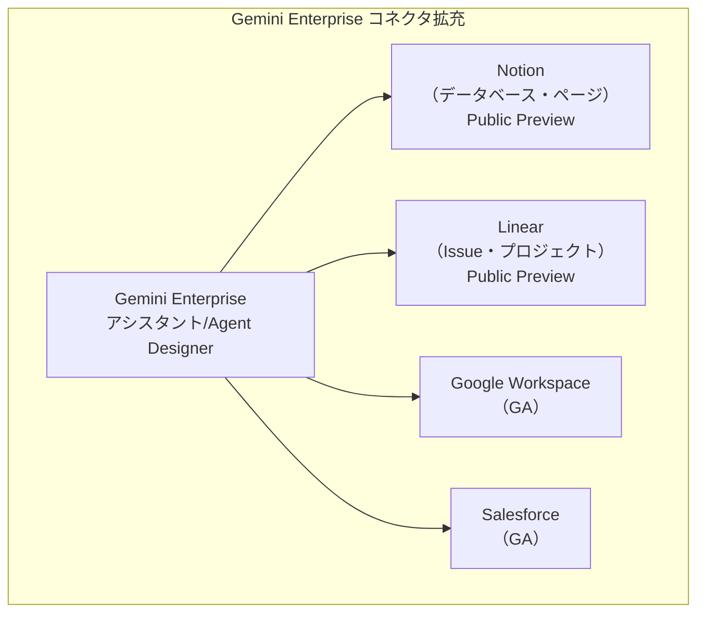
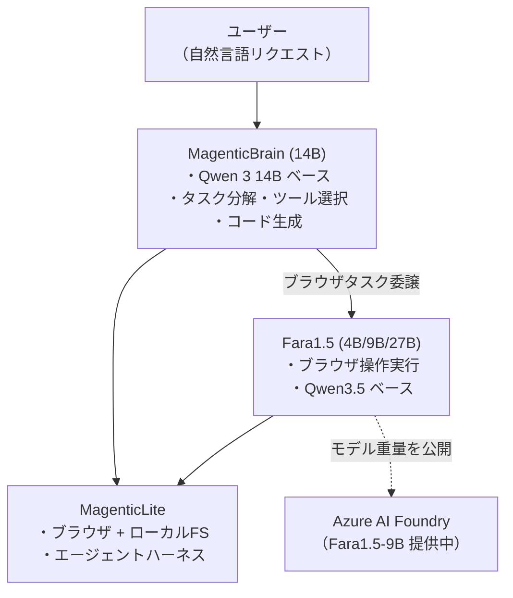
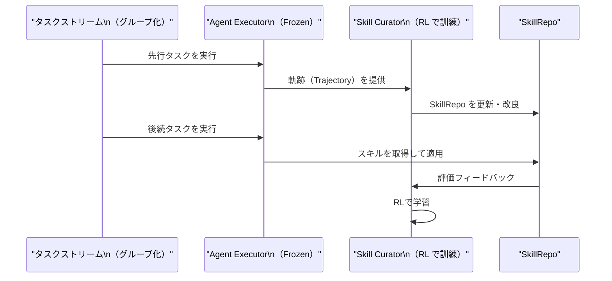
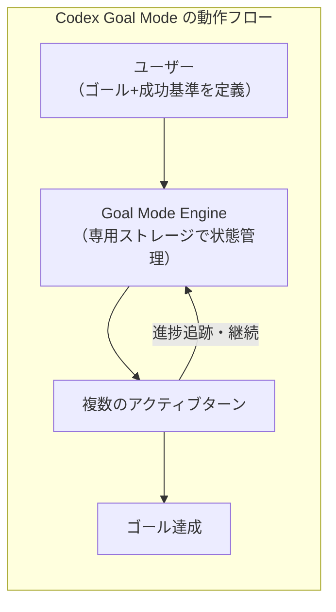
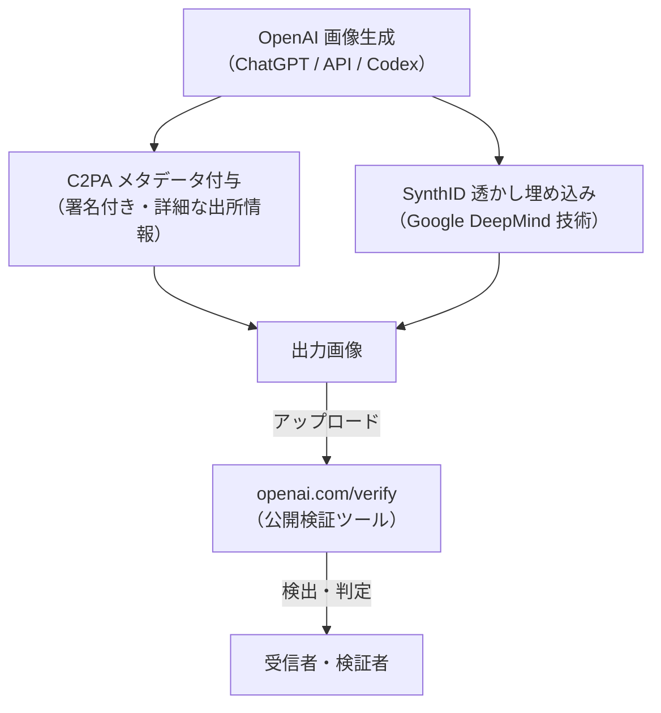
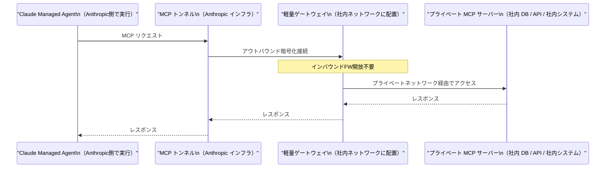
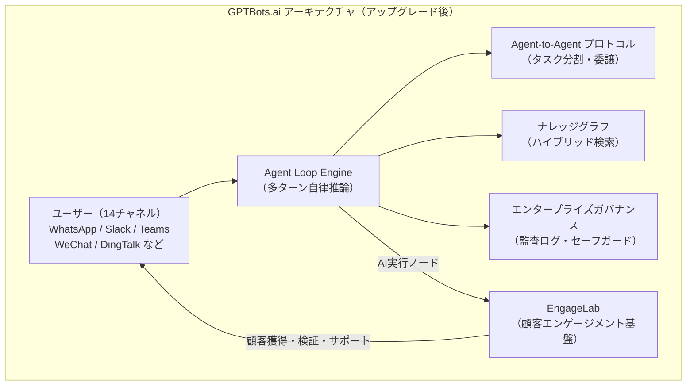

# LLM・AI Agent 最新情報レポート Vol.31

**作成日**: 2026年5月27日  
**対象期間**: 2026年5月26日〜2026年5月27日（Vol.30との差分）

---

## 目次

1. [Google Cloudアップデート](#1-google-cloudアップデート)
2. [Microsoft Azure AIアップデート](#2-microsoft-azure-aiアップデート)
3. [LLM Model / AI Agentアーキテクチャ・研究](#3-llm-model--ai-agentアーキテクチャ研究)
4. [公式ブログ・論文のリサーチ・要約](#4-公式ブログ論文のリサーチ要約)
   - [Google](#41-google)
   - [OpenAI](#42-openai)
   - [Anthropic](#43-anthropic)
5. [AI Agent搭載SaaS製品情報](#5-ai-agent搭載saas製品情報)
6. [LLM/AI Agentセキュリティインシデント](#6-llmai-agentセキュリティインシデント)
7. [その他特筆すべき情報](#7-その他特筆すべき情報)
8. [参考リンク](#8-参考リンク)

---

## 1. Google Cloudアップデート

### 1.1 Gemini Enterprise：Notion・Linear データソースをパブリックプレビューで追加

Gemini Enterprise の公式リリースノートに、**Notion および Linear のデータソースコネクタがパブリックプレビューで追加**されたことが記載された。[[1]](#ref-1)[[2]](#ref-2)

| データソース | 状態 | 主な用途 |
|---|---|---|
| **Notion** | パブリックプレビュー | データベース・ページの検索・要約・更新 |
| **Linear** | パブリックプレビュー | Issue・プロジェクトの検索・作成・更新 |

#### 機能概要

Gemini Enterprise では、Google Workspace や Salesforce などの既存コネクタに加え、今回の追加により**プロダクト管理ツール（Linear）**とドキュメント管理ツール（Notion）への直接アクセスが可能になった。

**実用的な使用例：**
- 「先週の Notion の議事録を要約して」→ Gemini が Notion を検索し自動要約
- 「バグ修正の Linear Issue を P1 に変更して」→ Gemini が Linear API を呼び出して更新

今後、正式 GA に向けてコネクタが段階的に拡充される見通しで、社内ツール統合を前提としたエンタープライズ向けAIアシスタントの基盤強化が続いている。

---

## 2. Microsoft Azure AIアップデート

### 2.1 Fara1.5 + MagenticLite + MagenticBrain：小型モデル特化のフルスタック・エージェントスタックをリリース（5月22日）

Microsoft Research が **Fara1.5**、**MagenticLite**、**MagenticBrain** の三つを組み合わせた「小型モデル最適化のフルスタック・エージェント体験」を一挙公開した。[[3]](#ref-3)[[4]](#ref-4)[[5]](#ref-5)

#### Fara1.5：ブラウザコンピュータ使用エージェントモデル群

Fara1.5 は、Microsoft のコンピュータ使用エージェント（CUA）モデルファミリーの次世代版で、**ブラウザ操作に特化した小型モデル**。Qwen3.5 ベースの 3 サイズを提供する。

| モデル | パラメータ数 | 備考 |
|---|---|---|
| Fara1.5-4B | 4B | 軽量・エッジ向け |
| Fara1.5-9B | 9B | **推奨フラッグシップ** |
| Fara1.5-27B | 27B | 最高精度 |

**Online-Mind2Web ベンチマーク比較（300タスク・136サイト）：**

| モデル | 成功率 |
|---|---|
| **Fara1.5-27B** | **72.0%** |
| OpenAI Operator | 58.3% |
| Gemini 2.5 Computer Use | 57.3% |
| 旧 Fara-7B | 34.1% |

前世代 Fara-7B 比で **2倍以上の精度向上**を達成し、主要競合を大幅に上回った。

**重要な安全設計：** Fara1.5-9B は「クリティカルポイント」（購入完了・メッセージ送信など不可逆操作の直前）を認識してユーザーに確認を求める機能を搭載しており、完全自動実行と安全性のバランスを取っている。

#### MagenticLite：次世代 Magentic-UI

**MagenticLite** は Magentic-UI の後継で、ブラウザとローカルファイルシステムを横断するエージェントアプリケーション。小型モデル向けに最適化されたハーネスを採用している。

#### MagenticBrain：オーケストレーション特化の 14B 小型モデル

**MagenticBrain** は Qwen 3 14B をファインチューン した 14B オーケストレーションモデル。自然言語リクエストをステップに分解し、適切なツールを選択し、必要に応じてコードを生成し、ブラウザタスクを Fara1.5 に委譲する。

モデルウェイトとコードはすべてオープンソースで公開されており、自社インフラでの運用も可能。Azure AI Foundry では Fara1.5-9B がカタログ登録済み。

---

## 3. LLM Model / AI Agentアーキテクチャ・研究

### 3.1 SkillOS：自己進化エージェントのためのスキルキュレーション学習（arXiv: 2605.06614）

**「SkillOS: Learning Skill Curation for Self-Evolving Agents」**（arXiv: 2605.06614）が公開された。Google・イリノイ大学の研究チームによる論文で、LLMエージェントが経験からスキルを蓄積・改良する**自己進化機構**を提案している。[[6]](#ref-6)[[7]](#ref-7)

#### 解決する課題

既存の LLM ベースエージェントはタスクを「一回限りの問題解決」として扱い、過去の経験から学習・再利用できない。経験から蒸留した**再利用可能なスキル**の品質管理（キュレーション）こそが、自己進化の最大のボトルネックである。

#### SkillOS のアーキテクチャ

SkillOS は、**凍結された（frozen）エージェント Executor** と、**訓練可能なスキルキュレーター**の二要素で構成される。

| コンポーネント | 役割 |
|---|---|
| **Agent Executor（Frozen）** | SkillRepo からスキルを取得し実行 |
| **Skill Curator（Trainable）** | 経験から SkillRepo を更新・改良 |
| **SkillRepo** | スキルを格納する外部リポジトリ |

#### 学習方法：グループ化タスクストリーム上の RL

スキル関連性を持つタスク依存関係に基づいてグループ化されたタスクストリームで訓練。**先行タスクの軌跡が SkillRepo を更新し、後続の関連タスクがその更新を評価する**という構造で、スキルキュレーターを強化学習でトレーニングする。

#### 実験結果

- メモリなしベースライン・強力なメモリベースラインの両方を**有効性・効率性で上回る**
- 学習済みキュレーターは**異なる Executor バックボーンとタスクドメインに汎化**
- SkillRepo 内のスキルが時間とともに**高レベルのメタスキルを含む構造化Markdownファイルに進化**

**業界的含意：** 現在のエージェントは実行するたびにゼロから始めるが、SkillOS 的なアプローチが普及すれば、エージェントが業務を重ねるほど高速・高精度になる「熟練化」が実現できる。

---

## 4. 公式ブログ・論文のリサーチ・要約

### 4.1 Google

新情報なし

---

### 4.2 OpenAI

#### 4.2.1 Codex 大型アップデート（5月26日）：Goal Mode GA・プラグインワークスペース共有・MCP強化

OpenAI が Codex の**幅広いアップデート**をリリースした。[[8]](#ref-8)[[9]](#ref-9)

**Goal Mode 一般提供（GA）：** これまでプレビューだった「Goal（ゴール）モード」が、Codex アプリ・IDE 拡張・CLI 全てで正式 GA となった。

> ユーザーが「達成したいアウトカム」と「成功基準」を定義すると、Codex がアクティブな作業ターン全体にわたって目標に向けて継続的に取り組む

| 更新項目 | 詳細 |
|---|---|
| **Goal Mode GA** | Codex App・IDE Extension・CLIで一般提供。専用ストレージでゴールを保存し、ターン間で進捗を追跡 |
| **プラグインワークスペース共有** | プラグインをワークスペース全体で共有可能に。共有アクセス制御・ソースフィルタリング・リモートバンドル同期をサポート |
| **MCP の改善** | サーバーごとの環境ターゲティング設定、Streamable HTTP サーバー向け OAuth オプションを追加 |
| **Codex モバイルプレビュー** | ChatGPT モバイルアプリで Codex が利用可能に。スレッドの開始・継続、承認・調整が可能 |
| **TUI 改善** | Vim モーダル編集、再開・diff ワークフロー改善、ステータスラインの強化 |

#### 4.2.2 OpenAI が C2PA + SynthID による AI 生成画像のプロベナンス（出所証明）を導入（5月19日〜）

OpenAI が Google DeepMind との提携のもと、ChatGPT・Codex・OpenAI API で生成した画像に**C2PA メタデータと SynthID 不可視透かし**を組み込むことを発表した。公開検証ツール「Verify」も提供開始。[[10]](#ref-10)[[11]](#ref-11)[[12]](#ref-12)

| 技術 | 概要 | 耐性 |
|---|---|---|
| **C2PA メタデータ** | 生成元の詳細情報を署名付きで格納 | 再アップロード・フォーマット変換で失われる場合あり |
| **SynthID 不可視透かし** | ピクセルレベルに透かしを埋め込み | クロップ・フィルタ・圧縮後も残存 |

二層アプローチにより、C2PA が失われてもSynthIDによる検出が可能という相互補完構造を実現している。

**業界的意義：** ディープフェイクや AI 生成のフェイク画像が社会問題化する中、大手 AI プロバイダーが出所証明の標準化を推進することで、コンテンツ認証エコシステムの形成が加速する。

---

### 4.3 Anthropic

#### Claude Managed Agents：セルフホステッドサンドボックスと MCP トンネルを追加（5月19日・Code w/ Claude London）

Anthropic が **Code with Claude London** イベント（5月19〜20日）で、**Claude Managed Agents** に二つの新機能を追加したことを発表した。[[13]](#ref-13)[[14]](#ref-14)[[15]](#ref-15)

| 機能 | 状態 | 概要 |
|---|---|---|
| **セルフホステッドサンドボックス** | パブリックベータ | ツール実行を顧客のインフラへ移行 |
| **MCP トンネル** | リサーチプレビュー | プライベート MCP サーバーへの安全な接続 |

#### セルフホステッドサンドボックス

従来はツール実行も Anthropic のインフラ上で行われていたが、今回の機能により**ツール実行環境を顧客が管理するインフラに移行**できる。Anthropic 側はオーケストレーション・コンテキスト管理・エラーリカバリを担当し続ける。

**サポートされるプロバイダー：** Cloudflare・Daytona・Modal・Vercel、または自前インフラ

**メリット：**
- 既存のネットワークポリシー・監査ログ・セキュリティツールが維持される
- ファイル・リポジトリが外部に出ない
- 重いビルドや画像生成など compute-heavy タスクに必要な CPU/メモリを自在に設定可能

#### MCP トンネル

プライベート MCP サーバーを **パブリックインターネットに公開せずに** Managed Agents から接続できる機能。インバウンドファイアウォールルールを開けず、軽量なゲートウェイが Anthropic インフラへのアウトバウンド暗号化接続を確立する。

**対象ユースケース：** 社内データベース・社内 API・チケットシステム・社内ナレッジベースなど、外部公開できないリソースへのエージェントアクセス。

---

## 5. AI Agent搭載SaaS製品情報

### 5.1 GPTBots.ai 大規模アップグレード：「チャットから実行へ」のトランジション（5月27日）

Aurora Mobile Limited が運営する**エンタープライズ AI エージェント・ワークフロープラットフォーム GPTBots.ai** が、大規模アップグレードを発表した。[[16]](#ref-16)[[17]](#ref-17)

「エージェントは会話はできるが、業務システムに接続できない；デモは動くが、本番稼働できない」という**エンタープライズ導入の根本的ボトルネック**への解答を示すアップデートとして位置付けられる。

#### 3つのコアアップグレード

**① ナレッジベースの再構築**

| 改善点 | 内容 |
|---|---|
| **ナレッジグラフ導入** | ベクトル+グラフのハイブリッド検索 |
| **文脈理解** | キーワード検索からビジネスコンテキスト理解へ |

**② 高度なワークフロー実行**

| 機能 | 内容 |
|---|---|
| **Agent Loop Engine** | 多ターン自律推論（複雑なタスクを継続遂行） |
| **Agent-to-Agent プロトコル** | 複雑なタスクを専門サブエージェントに分割委譲 |
| **エージェント主導フォーム収集** | 14チャネル（WhatsApp・Slack・Teams・WeChat・DingTalk等）でのデータ収集 |

**③ エンタープライズガバナンス強化**

ランタイムセキュリティ・監査ログ・セーフガードを本番環境向けに整備。

**戦略的位置づけ：** 親会社 Aurora Mobile の EngageLab（顧客エンゲージメント基盤）と GPTBots.ai を組み合わせ、「顧客獲得から保持・成長までの全プロセスを AI が実行する」エンタープライズループを形成することを目指している。

---

## 6. LLM/AI Agentセキュリティインシデント

新情報なし

---

## 7. その他特筆すべき情報

新情報なし

---

## 8. 参考リンク

**[1]** [Gemini Enterprise release notes | Google Cloud Documentation](https://docs.cloud.google.com/gemini/enterprise/docs/release-notes)

**[2]** [Notion configuration | Gemini Enterprise | Google Cloud Documentation](https://docs.cloud.google.com/gemini/enterprise/docs/connectors/notion/config)

**[3]** [MagenticLite, MagenticBrain, Fara1.5: An agentic experience optimized for small models | Microsoft Research Blog](https://www.microsoft.com/en-us/research/blog/magenticlite-magenticbrain-fara1-5-an-agentic-experience-optimized-for-small-models/)

**[4]** [Fara1.5 - A family of frontier computer use agent models | Microsoft Research](https://www.microsoft.com/en-us/research/articles/fara1-5-computer-use-agent/)

**[5]** [Microsoft Releases Fara1.5: A Family of Browser Computer-Use Agents (4B/9B/27B) That Outperform OpenAI Operator and Gemini 2.5 Computer Use on Online-Mind2Web | MarkTechPost](https://www.marktechpost.com/2026/05/22/microsoft-releases-fara1-5-a-family-of-browser-computer-use-agents-4b-9b-27b-that-outperform-openai-operator-and-gemini-2-5-computer-use-on-online-mind2web/)

**[6]** [SkillOS: Learning Skill Curation for Self-Evolving Agents | arXiv: 2605.06614](https://arxiv.org/abs/2605.06614)

**[7]** [Paper page - SkillOS: Learning Skill Curation for Self-Evolving Agents | Hugging Face](https://huggingface.co/papers/2605.06614)

**[8]** [Changelog – Codex | OpenAI Developers](https://developers.openai.com/codex/changelog)

**[9]** [OpenAI Codex Is Now on Mobile: What Developers Need to Know | Build Fast with AI](https://www.buildfastwithai.com/blogs/openai-codex-mobile-chatgpt-app-2026)

**[10]** [Advancing content provenance for a safer, more transparent AI ecosystem | OpenAI](https://openai.com/index/advancing-content-provenance/)

**[11]** [OpenAI Adopts C2PA and SynthID for Image Verification | Let's Data Science](https://letsdatascience.com/news/openai-adopts-c2pa-and-synthid-for-image-verification-ed2f7b5f)

**[12]** [OpenAI joins C2PA and adds Google SynthID watermarks to provenance stack | Result Sense](https://www.resultsense.com/news/2026-05-20-openai-c2pa-synthid-content-provenance/)

**[13]** [New in Claude Managed Agents: self-hosted sandboxes and MCP tunnels | Claude Blog](https://claude.com/blog/claude-managed-agents-updates)

**[14]** [Anthropic Introduces MCP Tunnels for Private Agent Access to Internal Systems | InfoQ](https://www.infoq.com/news/2026/05/claude-mcp-tunnels/)

**[15]** [Anthropic adds self-hosted sandboxes and MCP tunnels to Claude Managed Agents | The Decoder](https://the-decoder.com/anthropic-adds-self-hosted-sandboxes-and-mcp-tunnels-to-claude-managed-agents/)

**[16]** [Aurora Mobile's GPTBots.ai Upgrades AI Agents from Chat to Execution | GlobeNewswire](https://www.globenewswire.com/news-release/2026/05/27/3301765/0/en/aurora-mobile-s-gptbots-ai-upgrades-ai-agents-from-chat-to-execution.html)

**[17]** [Aurora Mobile upgrades GPTBots.ai with workflow execution capabilities | StreetInsider](https://www.streetinsider.com/Corporate+News/Aurora+Mobile+upgrades+GPTBots.ai+with+workflow+execution+capabilities/26553372.html)
