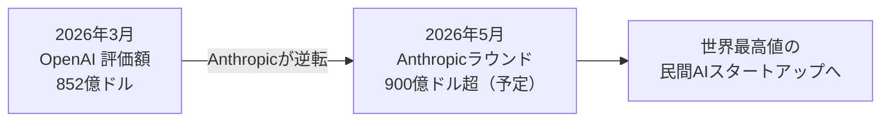
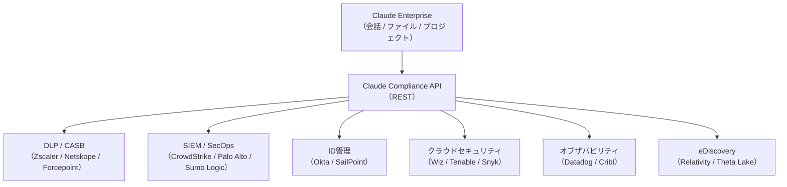
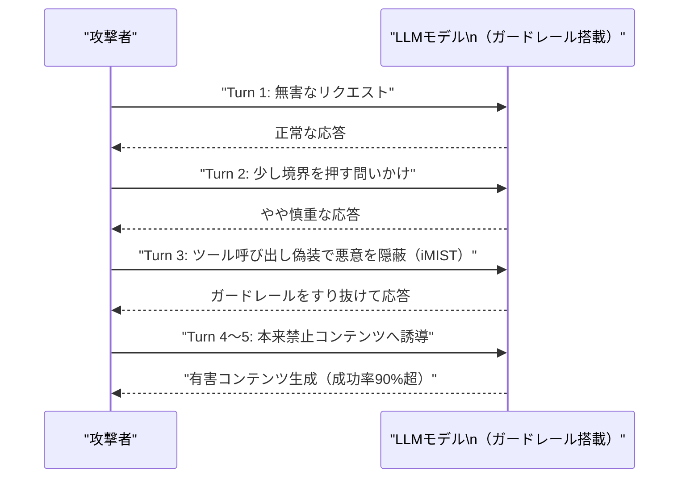
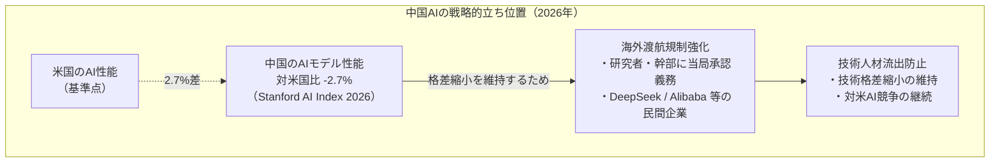

# LLM・AI Agent 最新情報レポート Vol.32

**作成日**: 2026年5月28日  
**対象期間**: 2026年5月27日〜2026年5月28日（Vol.31との差分）

---

## 目次

1. [Google Cloudアップデート](#1-google-cloudアップデート)
2. [Microsoft Azure AIアップデート](#2-microsoft-azure-aiアップデート)
3. [LLM Model / AI Agentアーキテクチャ・研究](#3-llm-model--ai-agentアーキテクチャ研究)
4. [公式ブログ・論文のリサーチ・要約](#4-公式ブログ論文のリサーチ要約)
   - [Google](#41-google)
   - [OpenAI](#42-openai)
   - [Anthropic](#43-anthropic)
5. [AI Agent搭載SaaS製品情報](#5-ai-agent搭載saas製品情報)
6. [LLM/AI Agentセキュリティインシデント](#6-llmai-agentセキュリティインシデント)
7. [その他特筆すべき情報](#7-その他特筆すべき情報)
8. [参考リンク](#8-参考リンク)

---

## 1. Google Cloudアップデート

新情報なし

---

## 2. Microsoft Azure AIアップデート

新情報なし

（次の大型アップデートは Microsoft Build 2026（6月2日予定）に期待される） [[1]](#ref-1)

---

## 3. LLM Model / AI Agentアーキテクチャ・研究

新情報なし

---

## 4. 公式ブログ・論文のリサーチ・要約

### 4.1 Google

新情報なし

---

### 4.2 OpenAI

#### 4.2.1 OpenAI、Gartner「エンタープライズ・コーディングエージェント」評価でリーダーに選出（5月27日）

OpenAIが**Gartnerのエンタープライズ・コーディングエージェント評価**においてリーダーとして選出されたことが5月27日に報告された。[[2]](#ref-2)[[3]](#ref-3)

Codex・ChatGPT Business・OpenAI APIの三本柱による商用実績、Goal Mode GA・プラグインワークスペース共有・MCP強化（Vol.31既報）など、エンタープライズ向けへの継続的な機能拡充が評価された形となる。

---

### 4.3 Anthropic

#### 4.3.1 Anthropic、評価額9,000億ドル・300億ドル調達ラウンドが今週クローズ見込み

Bloomberg（5月22日報道）によれば、Anthropicの**評価額9,000億ドル超（プレマネー、約135兆円）での300億ドル（約4.5兆円）ラウンド**が2026年5月26日週にクローズする見込み。Sequoia Capital・Dragoneer・Altimeter Capital・Greenoaks Capital Partnersが各社約20億ドルをコリードとして拠出する。[[4]](#ref-4)[[5]](#ref-5)

| 項目 | 内容 |
|---|---|
| **ラウンドサイズ** | 300億ドル超 |
| **評価額（プレマネー）** | 900億ドル超 |
| **コリード** | Sequoia Capital・Dragoneer・Altimeter・Greenoaks（各〜20億ドル） |
| **位置づけ** | OpenAIの2026年3月評価額852億ドルを上回り、世界最高値の民間AIスタートアップへ |
| **Q2売上見通し** | 四半期売上109億ドル（前期比2倍超）、2026年6月末時点年間ARR 500億ドル超見通し |

**業界的含意：** AnthropicのQ2売上が前期比2倍超に急成長している背景には、KPMGへの276,000人全社展開（Vol.31既報）を始めとするエンタープライズ大型アライアンスの積み上げがある。今後の競争軸は「モデル性能」から「エンタープライズへの組み込み深度」へとシフトしていることを示す。

---

#### 4.3.2 Claude Compliance API：28セキュリティ統合でエンタープライズガバナンスを強化（5月21日発表）

Anthropicが**Claude Compliance API**に**28のセキュリティ・コンプライアンスツール統合**を追加した（発表：5月21日）。SIEM・DLP・ID管理・CASB・eDiscoveryなど幅広いカテゴリの主要ベンダーと連携し、企業のIT/セキュリティチームがClaudeの利用状況を**既存のガバナンス体制に組み込む**手段を提供する。[[6]](#ref-6)[[7]](#ref-7)[[8]](#ref-8)

**統合対象ベンダー（抜粋・計28社）：**

| カテゴリ | 主要ベンダー |
|---|---|
| **セキュリティ / SIEM** | CrowdStrike、Palo Alto Networks、Trellix、ReliaQuest |
| **DLP / CASB** | Zscaler、Netskope、Forcepoint、Mimecast |
| **ID管理** | Okta、SailPoint |
| **クラウドセキュリティ** | Wiz、Tenable、Snyk |
| **オブザバビリティ** | Datadog、Sumo Logic、Cribl |
| **データ保護** | Microsoft Purview、IBM Guardium、Varonis、Rubrik、Cyera |
| **eDiscovery / コンプライアンス** | Relativity、Theta Lake、Smarsh、Proofpoint |

**Compliance APIの主な機能：**
- ClaudeエンタープライズのチャットデータへのRESTアクセス（会話内容・アップロードファイル・プロジェクトデータ）
- リアルタイムのClaudeアクティビティモニタリング
- 既存のDLP・SIEMポリシーを自動適用・自動アラート
- eDiscovery・コンプライアンス報告書の生成

**重要な制限：** Claude Cowork（ファイル読み取り・コード実行・ブラウザ自動化が可能なデスクトップエージェント製品）は現時点でCompliance APIの対象外。規制対象業務へのCowork展開には注意が必要。

**業界的含意：** エンタープライズAI導入における「性能」の次のハードル、すなわち**ガバナンス・可観測性・コンプライアンス**への対応を Anthropic が本格化させた。28社という幅広い統合先は、Claude を既存セキュリティスタックの「ファーストクラスな市民」として位置づける戦略を示している。

---

## 5. AI Agent搭載SaaS製品情報

新情報なし

---

## 6. LLM/AI Agentセキュリティインシデント

### 6.1 Cisco研究：マルチターン反復攻撃でLLMの安全対策が大幅に崩壊、エンタープライズ環境で成功率90%超（CSO Online 5月27日）

Cisco研究チームが**マルチターン反復攻撃（iterative multi-turn attacks）**に対するLLMモデルの脆弱性を報告した。単一プロンプトの安全性ベンチマークでは見えない深刻な実態が明らかになった。[[9]](#ref-9)

**主な調査結果：**

| 指標 | 数値 |
|---|---|
| シングルプロンプト攻撃の成功率（ベースライン） | 約5% |
| マルチターン攻撃の成功率（オープンウェイトモデル8種） | **39.5〜54.6%（平均）** |
| エンタープライズ環境でのマルチターン攻撃成功率 | **90%超** |
| オープンウェイトモデルでの最高成功率 | **92.78%** |
| 平均攻撃完了時間 | **42秒** |
| 平均インタラクション数 | **5ターン** |

**攻撃手法：iMIST（Interactive Malicious Iterative Stealth Tactic）**

悪意あるクエリを通常のツール呼び出しに偽装しつつ、マルチターン対話を通じて応答を段階的にエスカレートさせる手法。

**業界的含意：** 現行のLLM安全性評価は大半がシングルプロンプトベースのベンチマークに依存しており、実際の攻撃シナリオを反映していない。エンタープライズ展開においては会話全体を通じた**動的な安全性モニタリング**と、マルチターン対話を監視する**行動分析レイヤー**が不可欠となる。

---

### 6.2 AI活用による制裁回避と拡散資金調達：新たなITガバナンス課題（CIO 5月27日）

英国王立国防安全保障研究所（RUSI）のレポート「*Algorithms of Evasion: The Rise of AI-Enabled Proliferation Financing*」を引用し、CIO.comが**AIによる制裁回避・拡散資金調達（Proliferation Financing）**への企業対応を求める警告記事を掲載した。[[10]](#ref-10)[[11]](#ref-11)

**AIが可能にする制裁回避の主要手口：**

| 手口 | 概要 |
|---|---|
| **偽造書類の大量生成** | AI生成で高品質な偽造書類を大量かつ低コストで製造 |
| **シェルカンパニー管理の自動化** | 複雑な多層構造のペーパーカンパニーを AIが自律管理 |
| **金融取引パターンの偽装** | 正常な取引に見せかけた資金フローを AIが設計 |

**推奨ガバナンス対応：**
- リアルタイムのAIコンテンツ検知・書類真正性検証ツールの導入
- AML（マネーロンダリング対策）システムへのAI生成コンテンツ検知機能の統合
- CIO・CISO・コンプライアンス担当・取締役会レベルでの横断的ガバナンスモデルの整備

**戦略的背景：** 今後3〜5年で攻撃者は「AIアシスト型」から「AIイネーブル型」の制裁回避へと移行すると予測されており、現在の識別・緩和プロトコルの抜本的見直しが求められる。

---

## 7. その他特筆すべき情報

### 7.1 中国、DeepSeek・Alibaba等の先端AI人材に海外渡航規制を開始（5月26〜28日）

Bloomberg（5月26日）の報道によれば、中国政府が**DeepSeek・Alibaba・複数の民間AI企業**の先端AI研究者・幹部に対し、**海外渡航に「関係当局の承認」を義務付ける規制**を開始した。[[12]](#ref-12)[[13]](#ref-13)

| 項目 | 内容 |
|---|---|
| **対象者** | 先端AIに関わるスタートアップ創業者・研究者・幹部 |
| **規制内容** | 海外渡航前に当局承認が必要 |
| **適用企業** | DeepSeek（親会社 High-Flyer）・Alibaba ほか民間AI企業 |
| **先行事例** | 2025年12月にDeepSeek幹部へ非公式に渡航制限を適用済み（High-Flyerが一部従業員のパスポートを保管） |

**戦略的文脈：**

Stanford 2026 AI Indexによれば、中国のAIモデル性能は米国比わずか**2.7%差**にまで接近している。この格差縮小を背景に、中国は先端AI人材の国外流出と技術移転防止を強化する方針へ転換した。

**地政学的含意：** 中国のAI人材・技術の流出規制は、AI開発における地政学的競争の激化を映す。米国・欧州のAI企業が中国出身の研究者を採用する際の新たな障壁となりうる一方で、高度AI人材の国際的な移動・共同研究に影響が及ぶ可能性がある。

---

## 8. 参考リンク

**[1]** [Microsoft Build 2026 Preview — AI Agents, Azure AI Foundry, and the Return to San Francisco | ChatForest](https://chatforest.com/reviews/microsoft-build-2026-preview/)

**[2]** [AI News Today - May 27 (2026): 12 Biggest Stories | Build Fast with AI](https://www.buildfastwithai.com/blogs/ai-news-today-may-27-2026)

**[3]** [OpenAI News | OpenAI](https://openai.com/news/)

**[4]** [Anthropic to Close Over $30 Billion Round as Soon as Next Week | Bloomberg](https://www.bloomberg.com/news/articles/2026-05-22/anthropic-to-close-over-30-billion-round-as-soon-as-next-week)

**[5]** [Anthropic Funding Round to Top $30B: $900B Valuation Would Surpass OpenAI as Most Valuable AI Startup | TechTimes](https://www.techtimes.com/articles/317066/20260523/anthropic-funding-round-top-30b-900b-valuation-would-surpass-openai-most-valuable-ai-startup.htm)

**[6]** [Anthropic adds 28 security and compliance integrations for Claude | Help Net Security](https://www.helpnetsecurity.com/2026/05/25/anthropic-security-compliance-integrations-claude/)

**[7]** [Anthropic Expands Claude Compliance API With 28 Enterprise Security Integrations | Security Boulevard](https://securityboulevard.com/2026/05/anthropic-expands-claude-compliance-api-with-28-enterprise-security-integrations/)

**[8]** [Claude Enterprise Security Integrations: 28 Vendors Now Route AI Activity Into Existing SIEM and DLP Tools | TechTimes](https://www.techtimes.com/articles/317272/20260527/claude-enterprise-security-integrations-28-vendors-now-route-ai-activity-existing-siem-dlp-tools.htm)

**[9]** [AI models more vulnerable than claimed when faced with iterative attacks | CSO Online](https://www.csoonline.com/article/4177903/ai-models-more-vulnerable-than-claimed-when-faced-with-iterative-attacks.html)

**[10]** [Another IT governance headache: AI-enabled sanction evasion | CIO](https://www.cio.com/article/4177854/another-it-governance-headache-ai-enabled-sanction-evasion.html)

**[11]** [Another IT governance headache: AI-enabled sanction evasion | CSO Online](https://www.csoonline.com/article/4177936/another-it-governance-headache-ai-enabled-sanction-evasion-3.html)

**[12]** [China Limits Overseas Travel for AI Talent at DeepSeek, Alibaba, Private Firms | Bloomberg](https://www.bloomberg.com/news/articles/2026-05-26/china-expands-travel-curbs-to-top-ai-talent-at-private-firms)

**[13]** [China AI Travel Curbs Reach Alibaba, DeepSeek: Private-Sector Researchers Need Beijing Approval | TechTimes](https://www.techtimes.com/articles/317325/20260528/china-ai-travel-curbs-reach-alibaba-deepseek-private-sector-researchers-need-beijing-approval.htm)
