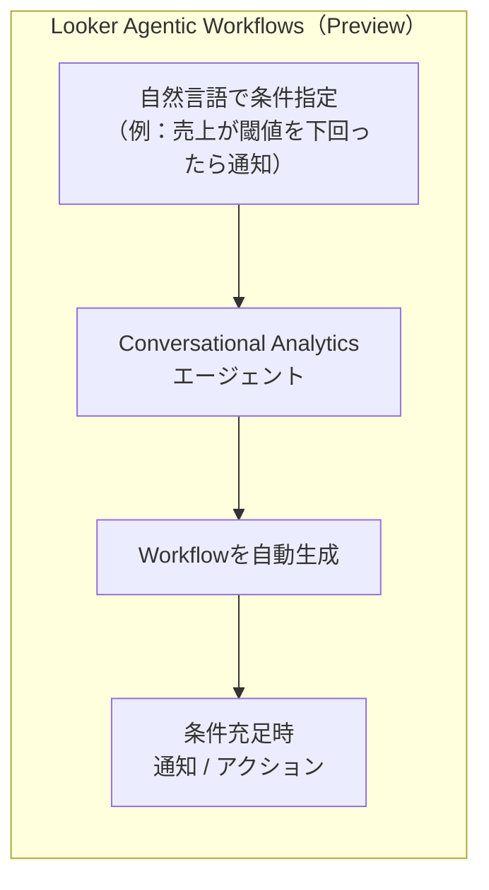
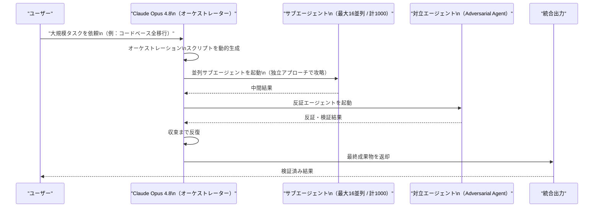
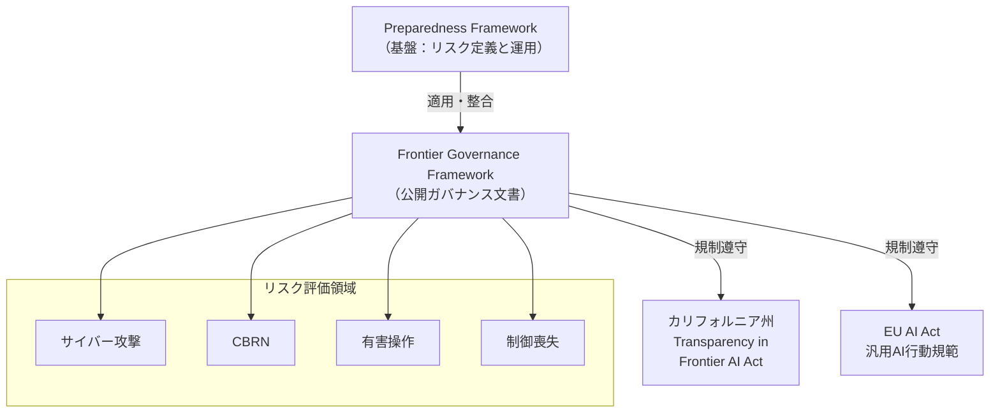
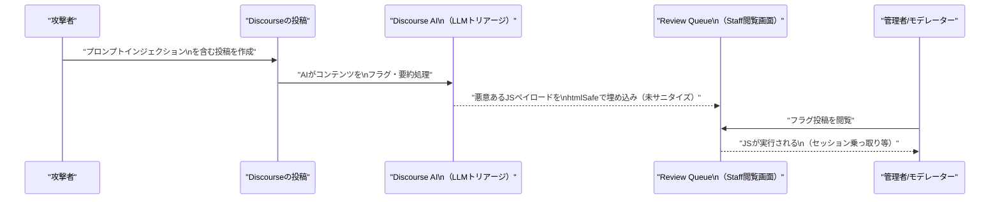

# LLM・AI Agent 最新情報レポート Vol.33

**作成日**: 2026年5月29日  
**対象期間**: 2026年5月28日〜2026年5月29日（Vol.32との差分）

---

## 目次

1. [Google Cloudアップデート](#1-google-cloudアップデート)
2. [Microsoft Azure AIアップデート](#2-microsoft-azure-aiアップデート)
3. [LLM Model / AI Agentアーキテクチャ・研究](#3-llm-model--ai-agentアーキテクチャ研究)
4. [公式ブログ・論文のリサーチ・要約](#4-公式ブログ論文のリサーチ要約)
   - [Google](#41-google)
   - [OpenAI](#42-openai)
   - [Anthropic](#43-anthropic)
5. [AI Agent搭載SaaS製品情報](#5-ai-agent搭載saas製品情報)
6. [LLM/AI Agentセキュリティインシデント](#6-llmai-agentセキュリティインシデント)
7. [その他特筆すべき情報](#7-その他特筆すべき情報)
8. [参考リンク](#8-参考リンク)

---

## 1. Google Cloudアップデート

### 1.1 Gemini Enterprise・Looker：Agentic Workflowsプレビュー開始（5月29日リリースノート）

Google Cloudの5月29日付リリースノートにて、**LookerのConversational Analytics**と**Gemini Enterprise**に複数のアップデートが適用された。[[1]](#ref-1)[[2]](#ref-2)

| 機能 | 状態 | 概要 |
|---|---|---|
| **Looker Agentic Workflows** | Preview | 自然言語でデータ条件を指定し、条件を満たした際に通知するワークフローをエージェントが自動生成 |
| **Conversational Analytics エージェント → Gemini Enterprise 公開** | Preview | Lookerで作成したデータエージェントをGemini Enterpriseユーザーに公開可能に |
| **Gemini Enterprise Assist** | **廃止** | 本機能はDeprecatedとなり、サービス終了 |
| **Gemini 3.1 Flash Image / Gemini 3 Pro Image** | Preview → **Deprecated** | 2026年7月19日までに新モデルエンドポイントへ移行が必要。4K画像出力サポートのGAモデルが提供済み |
| **Gemini 3.1 Flash Image 動画入力** | Preview | 動画からのサムネイル生成・代表フレーム画像生成に対応 |

**業界的含意：** LookerのConversational Analyticsエージェントが「チャット回答」から「プロアクティブな監視・アクション実行」へと進化。データドリブンな自律エージェントの実用化が加速する。

---

## 2. Microsoft Azure AIアップデート

### 2.1 Azure OpenAI Service グローバル障害（5月29日）

2026年5月29日、**Azure OpenAI Service（グローバル）**で障害が発生し、約3時間にわたってサービスに影響が生じた。[[3]](#ref-3)

| 項目 | 詳細 |
|---|---|
| **発生時刻** | 09:39 UTC（2026年5月29日） |
| **解決時刻** | 12:46 UTC（同日） |
| **影響範囲** | Azure OpenAI Service グローバルエンドポイント |
| **継続時間** | 約3時間7分 |

---

## 3. LLM Model / AI Agentアーキテクチャ・研究

### 3.1 Claude Opus 4.8 Dynamic Workflows：最大1,000サブエージェントの並列オーケストレーション

Anthropicが5月28日にリリースした**Claude Opus 4.8**とともに公開された**Dynamic Workflows（リサーチプレビュー）**は、LLMエージェントアーキテクチャにおける新しいオーケストレーション設計を示している。[[4]](#ref-4)[[5]](#ref-5)[[6]](#ref-6)

**アーキテクチャの特徴：**

| パラメータ | 仕様 |
|---|---|
| **最大サブエージェント数** | 1,000（1セッション内） |
| **同時実行上限** | 16サブエージェント（並列） |
| **オーケストレーション手法** | Claudeが動的にオーケストレーションスクリプトを自動生成 |
| **結果の収束戦略** | 複数エージェントが独立アプローチ → 対立エージェントが反証 → 答えが収束するまで反復 |
| **中断・再開** | セッション内で進行状況が保存され、中断したジョブは同セッションで再開可能 |
| **完了エージェント** | キャッシュされた結果を再開時に返却（再実行不要） |

**Claude Opus 4.8 主要ベンチマーク（Opus 4.7比）：**

| ベンチマーク | Opus 4.7 | Opus 4.8 | 変化 |
|---|---|---|---|
| **アジェンティックコーディング** | 64.3% | 69.2% | +4.9pt |
| **ツール使用・多分野推論** | 54.7% | 57.9% | +3.2pt |
| **コンピュータ使用** | 82.8% | 83.4% | +0.6pt |
| **知識業務スコア** | 1753 | 1890 | +137 |
| **重要事項の未報告率** | — | 3.7% | 初報告 |
| **欠陥結果の無批判受け入れ率** | 非公開 | **0%** | 初の達成 |

**Anthropic Super-Agent ベンチマーク：** Opus 4.8は全ケースをエンドツーエンドで完了した唯一のモデルであり、GPT-5.5と同等コストで旧Opusモデルを上回った。

**利用可能プラン：** Enterprise / Team / Max（Dynamic Workflowsはリサーチプレビュー）

---

## 4. 公式ブログ・論文のリサーチ・要約

### 4.1 Google

#### 4.1.1 Gemini 3.1 Flash Image モデルの移行アナウンス（5月29日）

Google Cloud公式リリースノートにて、**Gemini 3.1 Flash Image Preview**と**Gemini 3 Pro Image Preview**の非推奨化が発表された。移行期限は**2026年7月19日**。4K画像出力をサポートするGAモデルへの切り替えを推奨。[[1]](#ref-1)

---

### 4.2 OpenAI

#### 4.2.1 Frontier Governance Framework 公開（5月29日）

OpenAIが**Frontier Governance Framework**を公開した。本フレームワークはカリフォルニア州**Transparency in Frontier AI Act**およびEUの**AI Act（汎用AI行動規範）**に対するOpenAIの規制遵守アプローチを体系的に説明したもの。[[7]](#ref-7)[[8]](#ref-8)[[9]](#ref-9)

**フレームワークの主要構成要素：**

| 領域 | 概要 |
|---|---|
| **リスク評価・緩和** | サイバー攻撃・CBRN（化学/生物/放射線/核）・有害操作・制御喪失の4カテゴリ |
| **モデル報告** | 開発・リリース前の評価結果の公開方針 |
| **セキュリティリスク管理** | 不正アクセス・モデル盗用・悪用シナリオへの対処 |
| **インシデントレスポンス** | 重大インシデント発生時の対応プロセス |
| **外部専門家の関与** | 独立した第三者評価者・Safety Advisory Groupへの意見提供 |

**リスクティア定義（例）：**
- **サイバー Tier 3**: ツール拡張モデルが人間の介入なしで多数の強化システムにゼロデイエクスプロイトを開発可能
- **CBRN Tier 3**: 専門家がCDC Class A生物剤相当の脅威を開発可能にする支援、または規制対象生物脅威の合成サイクルを自律完了

**位置づけ：** OpenAIは既存のPreparedness Frameworkを基盤として維持しつつ、本フレームワークを規制要件に特化した公開文書として整備。AI安全性への規制圧力が高まる中、主要AI企業による**セルフガバナンスの制度化**が進む。

---

### 4.3 Anthropic

#### 4.3.1 Claude Opus 4.8 リリース（5月28日）

Anthropicが**Claude Opus 4.8**を5月28日（UTC）にリリース。前バージョンOpus 4.7からわずか41日という異例のスピードでのアップデートとなった。[[4]](#ref-4)[[5]](#ref-5)[[10]](#ref-10)

**主な新機能・改善：**

| 機能 | 詳細 |
|---|---|
| **Dynamic Workflows** | リサーチプレビュー。最大1,000サブエージェントを並列実行（§3.1参照） |
| **Effort Control** | ユーザーがタスクへの投入リソースを選択可能（High effortがデフォルト） |
| **Fast Modeの高速化・低コスト化** | 速度は約2.5倍。Opus 4.7比で3分の1のコスト |
| **Honesty強化** | 不確実性をより率直に表明、過信率がOpus 4.7比10倍以上削減 |

**Fast Mode 価格：**
- 標準: 入力 $5/百万トークン、出力 $25/百万トークン
- Fast Mode: 入力 $10/百万トークン、出力 $50/百万トークン
- プロンプトキャッシュで最大90%削減、バッチ処理で50%削減

**対応プラットフォーム：** claude.ai、Claude API、AWS、Google Cloud、Microsoft Foundry

---

#### 4.3.2 Anthropic、Series H クローズ：評価額$965B・$65B調達を確認（5月28日）

Vol.32で「今週クローズ見込み」と報じていたAnthropicの大型資金調達が、5月28日に正式にクローズした。**最終評価額・調達額ともに当初予想を大幅に上回る**結果となった。[[11]](#ref-11)[[12]](#ref-12)[[13]](#ref-13)

| 項目 | Vol.32時点の予測（5月22日報道） | 確定値（5月28日） |
|---|---|---|
| **調達額** | $30B超 | **$65B** |
| **評価額（ポストマネー）** | $900B超（プレマネー予測） | **$965B** |
| **リード投資家** | Sequoia / Dragoneer / Altimeter / Greenoaks | 変更なし |
| **ランレート収益** | — | **$47B/年**（5月時点） |

**注目点：**
- OpenAIの直近評価額$852B（2026年3月）を大幅に上回り、**世界最高値の民間AIスタートアップ**に
- IPOについてはForge Global報道で「**2026年10月**を最短ターゲット」と言及
- AnthropicのARRは前回調達（2026年2月）から5ヶ月で急成長

---

#### 4.3.3 Mythos-classモデルの一般公開を予告（5月28〜29日）

Anthropicは今回の発表に合わせて、現在12のFoundingパートナー（約40の重要インフラ組織を含む）限定の**「Project Glasswing」**でのみ提供中の**Claude Mythos-class（プレビュー）**を**「今後数週間以内に全顧客へ提供開始」**すると予告した。[[14]](#ref-14)[[15]](#ref-15)

| 指標 | Claude Mythos Preview |
|---|---|
| **SWE-bench Verified** | 93.9% |
| **SWE-bench Pro** | 77.8% |
| **Terminal-Bench 2.0** | 82.0% |
| **USAMO 2026** | 97.6% |
| **現在のアクセス** | Project Glasswing 限定（パブリックAPIなし） |
| **一般提供予測** | 2026年9月以降（Zvi氏推定、確約なし） |

**Mythosの注目事績：** 自律的なゼロデイ脆弱性発見でOpenBSDの27年前のTCP SACK RCE（CVE-2026-4747）などを発見。セキュリティ用途での圧倒的な性能が報告されている。

---

## 5. AI Agent搭載SaaS製品情報

### 5.1 Claude Dynamic Workflows：Enterprise/Team/Maxプランで利用開始

Anthropicが5月28日に発表した**Dynamic Workflows（リサーチプレビュー）**は、**Enterprise・Team・Maxプラン**向けにClaude Codeで利用可能。1セッションあたり最大1,000エージェントを起動できるため、コストに注意が必要とされている。[[4]](#ref-4)[[5]](#ref-5)

主なユースケース：
- コードベース全体のスケールマイグレーション（数十万行規模）
- 大規模なテストスイートを基準とした自律的なリファクタリング
- 並列並行で複数のアプローチを試みる研究・分析タスク

---

## 6. LLM/AI Agentセキュリティインシデント

### 6.1 Azure OpenAI Serviceグローバル障害（5月29日 09:39〜12:46 UTC）

前述（§2.1）の通り、Azure OpenAI Serviceがグローバル障害を起こし、約3時間7分にわたって利用できない状態が継続した。[[3]](#ref-3)

Azure OpenAI Serviceへの依存度が高いエンタープライズ顧客にとって、グローバルエンドポイントの単一障害点リスクが改めて浮き彫りになった。

---

### 6.2 CVE-2026-27740：Discourse AI LLM プロンプトインジェクション → XSS

Discourseの**AIによるコンテンツトリアージ機能**に、LLMアウトプットの不適切なサニタイズによる**クロスサイトスクリプティング（XSS）脆弱性**が発見された。[[16]](#ref-16)

| 項目 | 詳細 |
|---|---|
| **CVE番号** | CVE-2026-27740 |
| **攻撃ベクター** | プロンプトインジェクション → LLMに悪意あるJSペイロードを生成させる |
| **影響を受けるコンポーネント** | Review Queue（モデレーションインターフェース）でのhtmlSafe使用箇所 |
| **影響を受ける権限** | Staff（管理者・モデレーター）がフラグ投稿を閲覧した際に実行 |
| **パッチバージョン** | 2026.3.0-latest.1 / 2026.2.1 / 2026.1.2 |

**対策：** 最新パッチへの即時アップデートと、LLMアウトプットをWebインターフェースに表示する際の出力サニタイズ設計の見直しが推奨される。

---

### 6.3 Discourse AI 共有会話 Onebox の保存型XSS（CVE-2026-32243）

同じくDiscourseで、**AI共有会話のOnebox機能**に保存型XSS脆弱性（CVE-2026-32243）も確認されている。AI生成コンテンツが関与する攻撃面が複数存在することが明らかになった。[[17]](#ref-17)

---

## 7. その他特筆すべき情報

### 7.1 カリフォルニア州AI法案：30本中ほぼ全てが本会議を通過（5月29日）

5月29日のクロスオーバー締め切りを前に、カリフォルニア州の**30本のAI関連法案がほぼ全て**それぞれの発議院（上院・下院）を通過した。今後4週間で交差審議が進み、2026年7月2日の夏期閉会前の成立を目指す。[[18]](#ref-18)

**主な審議中の法案：**

| 法案 | 概要 |
|---|---|
| **SB 574** | 弁護士のAI使用に関する倫理基準・保護規定 |
| **SB 719** | 州機関が使用する高リスク自動意思決定システムの年次報告要件の改正 |
| **SB 813** | カリフォルニア州AI標準・安全委員会の設置 |
| **SB 867** | おもちゃへのコンパニオンチャットボット搭載禁止 |

既成法として、知事が署名済みの**Transparency in Frontier AI Act (SB 53)**は、フロンティアAIモデルの公開前評価義務化に関する米国初の州法として既に施行されている（§4.2.1参照）。

---

### 7.2 Google コア検索エンジン、Gemini 3.5 Flashへ全面切り替え（5月26日）

Googleが2026年5月26日に**コア検索エンジン全体をGemini 3.5 Flashへ切り替えた**。従来のテキストボックス検索UIは事実上廃止され、デフォルトが会話型インターフェースに移行した。[[19]](#ref-19)

この切り替えはGoogle I/O 2026（5月19日）で発表された「AI Mode」戦略の実行フェーズに当たり、世界中のユーザーの検索体験が根本的に変わるマイルストーンとなる。

---

## 8. 参考リンク

**[1]** [Gemini for Google Cloud release notes | Google Cloud Documentation](https://docs.cloud.google.com/gemini/docs/release-notes)

**[2]** [Gemini Enterprise Agent Platform release notes | Google Cloud Documentation](https://docs.cloud.google.com/gemini-enterprise-agent-platform/release-notes)

**[3]** [Microsoft Foundry Status — Incident History | Microsoft](https://status.ai.azure.com/history)

**[4]** [Anthropic releases Opus 4.8 with new 'dynamic workflow' tool | TechCrunch](https://techcrunch.com/2026/05/28/anthropic-releases-opus-4-8-with-new-dynamic-workflow-tool/)

**[5]** [Anthropic Ships Claude Opus 4.8 Alongside Dynamic Workflows and Cheaper Fast Mode, With Workflows Capped at 1,000 Subagents | MarkTechPost](https://www.marktechpost.com/2026/05/28/anthropic-ships-claude-opus-4-8-alongside-dynamic-workflows-and-cheaper-fast-mode-with-workflows-capped-at-1000-subagents/)

**[6]** [Claude Opus 4.8 is here: effort controls, dynamic workflows, cheaper fast mode, better honesty, less deception | The New Stack](https://thenewstack.io/claude-opus-48-release/)

**[7]** [OpenAI's Frontier Governance Framework | OpenAI](https://openai.com/index/openai-frontier-governance-framework/)

**[8]** [OpenAI Rolls Out Frontier Governance Framework | StartupHub.ai](https://www.startuphub.ai/ai-news/artificial-intelligence/2026/openai-rolls-out-frontier-governance-framework)

**[9]** [OpenAI's Frontier Signals a Shift in Enterprise AI Governance | Techerati](https://www.techerati.com/news-hub/openais-frontier-signals-a-shift-in-enterprise-ai-governance/)

**[10]** [Anthropic upgrades Claude with new Opus 4.8 model, details here | 9to5Mac](https://9to5mac.com/2026/05/28/anthropic-upgrades-claude-with-new-opus-4-8-model-heres-whats-new/)

**[11]** [Anthropic Eclipses OpenAI With Valuation of $965 Billion | Bloomberg](https://www.bloomberg.com/news/articles/2026-05-28/anthropic-raises-at-965-billion-valuation-eclipsing-openai)

**[12]** [Anthropic raises $65 billion, nears $1T valuation ahead of IPO | TechCrunch](https://techcrunch.com/2026/05/28/anthropic-raises-65-billion-nears-1t-valuation-ahead-of-ipo/)

**[13]** [Anthropic tops OpenAI as most valuable AI startup, with $965B valuation | Axios](https://www.axios.com/2026/05/28/anthropic-ai-fundraising-openai)

**[14]** [Anthropic confirms Claude Mythos-class models will roll out to the public | BleepingComputer](https://www.bleepingcomputer.com/news/artificial-intelligence/anthropic-confirms-claude-mythos-class-models-will-roll-out-to-the-public/)

**[15]** [Anthropic leapfrogs OpenAI with a record $965 billion valuation and says its 'Mythos' AI model is coming soon | Fortune](https://fortune.com/2026/05/29/anthropic-raises-65-billion-at-record-965-billion-valuation-promises-mythos-ai-model-in-wide-release-in-coming-weeks-releases-claude-opus-4-8/)

**[16]** [CVE-2026-27740: Discourse AI LLM XSS Vulnerability | SentinelOne](https://www.sentinelone.com/vulnerability-database/cve-2026-27740/)

**[17]** [CVE-2026-32243: Discourse Stored XSS Vulnerability in AI Shared Conversations Onebox | Vulert](https://vulert.com/vuln-db/CVE-2026-32243)

**[18]** [AI Legislative Update: May 29, 2026 | Transparency Coalition](https://www.transparencycoalition.ai/news/ai-legislative-update-may29-2026)

**[19]** [AI News Recap: May 29, 2026 | NeuralBuddies](https://www.neuralbuddies.com/p/ai-news-recap-may-29-2026)
