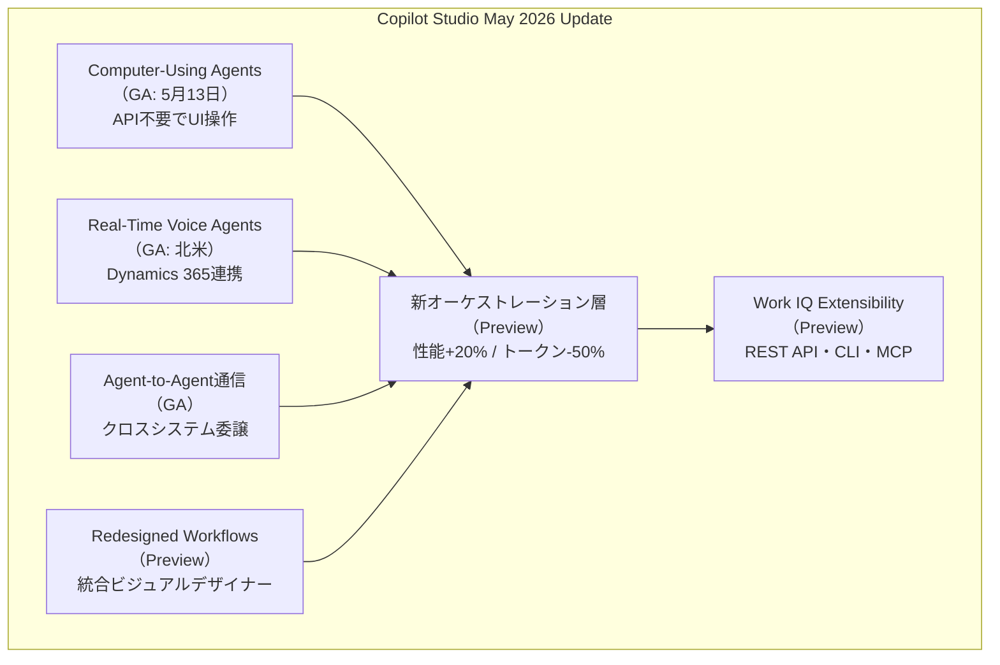
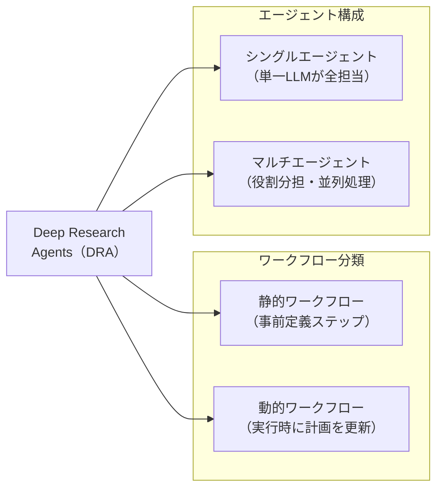
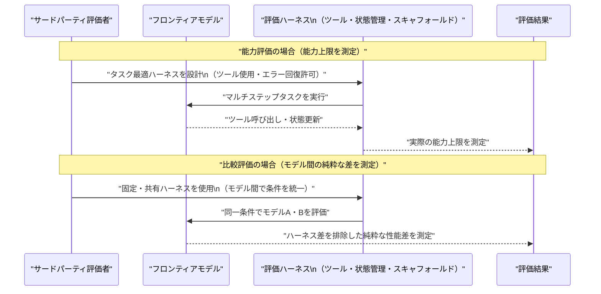
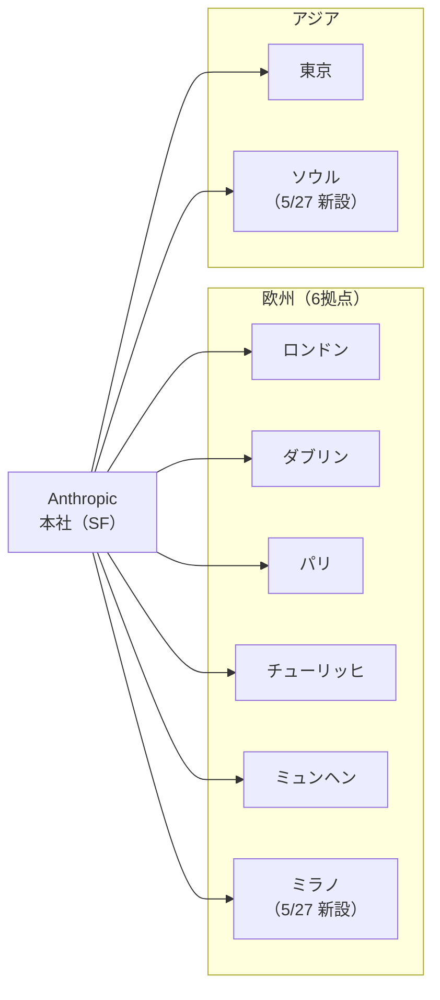
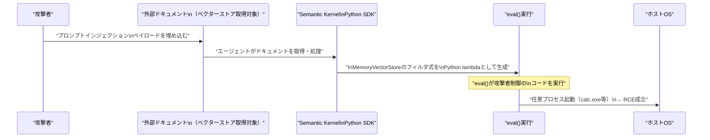

# LLM・AI Agent 最新情報レポート Vol.34

**作成日**: 2026年5月30日  
**対象期間**: 2026年5月29日〜2026年5月30日（Vol.33との差分）

---

## 目次

1. [Google Cloudアップデート](#1-google-cloudアップデート)
2. [Microsoft Azure AIアップデート](#2-microsoft-azure-aiアップデート)
3. [LLM Model / AI Agentアーキテクチャ・研究](#3-llm-model--ai-agentアーキテクチャ研究)
4. [公式ブログ・論文のリサーチ・要約](#4-公式ブログ論文のリサーチ要約)
   - [Google](#41-google)
   - [OpenAI](#42-openai)
   - [Anthropic](#43-anthropic)
5. [AI Agent搭載SaaS製品情報](#5-ai-agent搭載saas製品情報)
6. [LLM/AI Agentセキュリティインシデント](#6-llmai-agentセキュリティインシデント)
7. [その他特筆すべき情報](#7-その他特筆すべき情報)
8. [参考リンク](#8-参考リンク)

---

## 1. Google Cloudアップデート

### 1.1 Vertex AI Agent Builder → Gemini Enterprise Agent Platform：コンソール名称移行が完了

Google CloudはVertex AI Agent Builderを**Gemini Enterprise Agent Platform**（GEAP）に正式改名し、2026年5月末時点でコンソールUI上の名称移行が完了した。[[1]](#ref-1)[[2]](#ref-2)

当初の発表は2026年4月23日のGoogle Cloud Next 2026（ラスベガス）でなされていたが、コンソール上の反映は5月末に完了。これによりGeminiエコシステムとの統一ブランドが確立された。

**GA済み主要機能（5月時点）：**

| 機能 | 状態 |
|---|---|
| Agent Engine Sessions / Memory Bank | **GA** |
| Express Mode（Agent Engine Runtime） | **GA** |
| フリーティア | **GA** |
| Layout Parser（ドキュメント構造化） | **GA** |
| Cloud API Registry統合（ツールガバナンス） | **GA** |

---

### 1.2 Lyria 3 Pro：Vertex AI上で音楽生成モデルがPublic Previewに

GoogleのAI音楽生成モデル**Lyria 3 Pro**がVertex AI上でPublic Previewとして提供開始された。[[3]](#ref-3)

| モデル | 生成可能時間 |
|---|---|
| **lyria-3-pro-preview** | 最大184秒の音声 |
| **lyria-3-clip-preview** | 最大30秒のクリップ |

Veo動画生成モデルとの連携により、音声・映像を一括生成できるパイプラインの構築が可能になる。映像コンテンツ制作やゲーム音楽生成などの高度なマルチモーダル用途が想定されている。

---

## 2. Microsoft Azure AIアップデート

### 2.1 Copilot Studio May 2026 大規模アップデート：CUA一般公開・A2A・新オーケストレーション層

MicrosoftはCopilot Studio 2026年5月アップデートを公開し、**Computer-Using Agents（CUA）のGA**を中心に複数の重要機能を追加した。[[4]](#ref-4)[[5]](#ref-5)[[6]](#ref-6)

#### GA（一般提供開始）機能

| 機能 | 詳細 |
|---|---|
| **Computer-Using Agents** | 2026年5月13日GA。APIなしで任意のWebサイト・デスクトップアプリをUI操作 |
| **Real-Time Voice Agents** | 北米向けにGA。Dynamics 365 Contact Centerと統合 |
| **Agent-to-Agent（A2A）通信** | エージェント間での情報交換・タスク委譲・クロスシステム連携 |

#### Preview機能

| 機能 | 詳細 |
|---|---|
| **Redesigned Workflows** | 統合ビジュアルデザイナーで自動化の全工程を1キャンバス上に構築 |
| **新オーケストレーション層** | 性能**約20%向上**、トークン消費量**約50%削減** |
| **Work IQ Extensibility** | REST API、CLI、リモートMCPサーバーサポートを追加 |

**Computer-Using Agents（CUA）の搭載モデル：**
- **OpenAI CUA**（Computer-Using Agent）
- **Claude Sonnet 4.5**（Anthropic）

認証情報はAzure Key Vault、監査ログはMicrosoft Purviewで管理。ヒューマン・イン・ザ・ループ（人間介入）レビューも設定可能。

**業界的含意：** MicrosoftはCopilot StudioでCUAをGAに引き上げた主要ハイパースケーラー第1号となった。「APIなし」で任意のUIを操作できるエージェントの実用化は、従来のRPAからAI Agentへの大規模移行を加速させる。

---

### 2.2 Microsoft 365 Copilot 新デザイン：タスク対応ワークスペースとロード時間50%削減

Microsoftは2026年5月28日、**Microsoft 365 Copilotの新UIデザイン**を発表した。プロンプト入力欄を「静的なテキストボックス」から「タスク対応ワークスペース」へと刷新した。[[7]](#ref-7)

| 改善項目 | 詳細 |
|---|---|
| **ロード時間** | 50%以上削減、2倍以上高速化 |
| **複雑チャット応答時間** | 約10%改善 |
| **Word使用率** | +27% |
| **Excel使用率** | +33% |
| **PowerPoint使用率** | +43% |
| **Outlook使用率** | +30% |

従来の単一入力欄が、「Designer」「Researcher」「Word」「Excel」「PowerPoint」など機能別エージェントへの統一エントリーポイントとなり、左ナビゲーションペインでエージェント・会話・履歴を一元管理できる。

---

## 3. LLM Model / AI Agentアーキテクチャ・研究

### 3.1 Deep Research Agentsの系統的分類：静的/動的ワークフローとシングル/マルチエージェント構成

**"Deep Research Agents: A Systematic Examination And Roadmap"**（arXiv:2506.18096）は、複雑な多ターン情報リサーチを自律的に実行するDR（Deep Research）エージェントを体系的に分析したサーベイ論文。[[8]](#ref-8)

**提案される分類軸：**

**情報取得戦略の比較：**

| 手法 | 特徴 | 適用場面 |
|---|---|---|
| **API型取得** | 高速・構造化・低コスト | データベースアクセス、既知データソース |
| **ブラウザ型探索** | 柔軟・最新情報対応 | 最新情報収集、ロングテール調査 |

**主要な批判的知見：**
- 現行ベンチマークは**外部知識へのアクセス制限**により実際の能力を過小評価している
- **逐次実行**の非効率性がボトルネックになりやすく、並列化設計が重要
- 評価指標と「研究タスクの実用目標」の乖離が大きい

---

### 3.2 Multi-Agentによるハルシネーション抑制アーキテクチャ（arXiv:2603.07728）

**"A Novel Multi-Agent Architecture to Reduce Hallucinations of Large Language Models in Multi-Step Structural Modeling"**（arXiv:2603.07728, 2026年3月）は、多段階構造モデリングにおけるLLMのハルシネーション問題をマルチエージェント設計で低減する手法を提案した。[[9]](#ref-9)

**アーキテクチャの特徴：**
- 複数エージェントが独立に推論し、出力を相互に検証する
- 専門エージェント間で「提案→批評→改訂」サイクルを繰り返す
- 特に構造化アウトプット（スキーマ準拠・コード生成等）での効果を示す

---

## 4. 公式ブログ・論文のリサーチ・要約

### 4.1 Google

新情報なし

---

### 4.2 OpenAI

#### 4.2.1 「信頼できるサードパーティ評価のための共通プレイブック」を公開（5月29日）

OpenAIは2026年5月29日、**"A Shared Playbook for Trustworthy Third-Party Evaluations"**（信頼できるサードパーティ評価のための共通プレイブック）を公開した。Vol.33で報告したFrontier Governance Frameworkとは独立した、AI評価方法論に特化した技術的ガイドラインである。[[10]](#ref-10)[[11]](#ref-11)[[12]](#ref-12)

**背景：**
フロンティアモデルの評価設計は「単純なプロンプト→回答」形式から脱却し、ツール使用・多ステップ推論・ワークフロー内での動作を前提とする必要がある。しかし、評価環境（ハーネス）の設計次第でモデルの見かけ上の性能が大きく変わる問題が顕在化している。

**プレイブックの主要提言：**

| 評価目的 | 推奨ハーネス設計 |
|---|---|
| **能力の最大化評価**（「このモデルはXができるか？」） | タスクに最適化したハーネスを選択。スキャフォールディング・ツール使用・エラー回復を許可 |
| **比較評価**（「モデルAとBどちらが優秀か？」） | 固定・共有ハーネスを使用。ハーネス差がモデル差として現れないよう統制 |

**位置づけ：** 既存のPreparedness Frameworkやガバナンスフレームワークが「何をリスクとするか」を定義するのに対し、本プレイブックは「どうやって正確に評価するか」という実装レベルの標準化を目的としている。EU AI ActやカリフォルニアSB 53など、外部評価義務化に向けた評価エコシステム整備の布石と見られる。

---

### 4.3 Anthropic

#### 4.3.1 ミラノ・ソウルへ同時進出：欧州6拠点・アジア2拠点体制へ（5月27日）

Anthropicは2026年5月27日、**イタリア・ミラノ**と**韓国・ソウル**への同時進出を発表した。[[13]](#ref-13)[[14]](#ref-14)[[15]](#ref-15)

**ミラノオフィス：**
- ロンドン・ダブリン・パリ・チューリッヒ・ミュンヘンに続く**欧州第6拠点目**（1年未満で6拠点）
- 顧客としてGenerali（保険）、Pirelli（タイヤ）、Enel（エネルギー）など大手イタリア企業を獲得済み
- AnthropicのEMEAランレート収益は前年同期比**9倍超**に成長

**ソウルオフィス：**
- **KiYoung Choi（チェ・キヨン）氏**を代表取締役に任命
- Choi氏はGoogle Cloud Korea・Adobe・Autodesk・Microsoft・Snowflake Koreaで経営幹部を歴任した30年超のキャリアの持ち主
- 韓国でのClaudeトラフィックは人口比で予測値の**3.5倍**超に達しており、東アジア第2位（日本に次ぐ）

---

## 5. AI Agent搭載SaaS製品情報

### 5.1 Copilot Studio Computer-Using Agents GA：エンタープライズUIオートメーション実用化

§2.1で詳述したCopilot StudioのComputer-Using AgentsがGA（一般提供）となり、ローコードでUI操作エージェントを構築可能に。[[4]](#ref-4)[[5]](#ref-5)

**主なユースケース：**
- 基幹システム（ERP・CRM）へのAPIなし自動入力
- WebアプリのレガシーフォームへのRPA代替データ転記
- 複数SaaSをまたいだ申請承認ワークフローの自律化

**エンタープライズガバナンス：**

| 項目 | 対応ソリューション |
|---|---|
| 認証情報管理 | Azure Key Vault |
| 監査ログ | Microsoft Purview |
| 人間介入設定 | Human-in-the-loop標準装備 |

---

## 6. LLM/AI Agentセキュリティインシデント

### 6.1 CVE-2026-26030 + CVE-2026-25592：Microsoft Semantic KernelへのPrompt Injection→RCE攻撃チェーン（CVSS 9.8）

Microsoftは2026年5月7日、**Semantic Kernel Python/NETのPrompt Injection→RCEを可能にする脆弱性2件**を公開した。AIエージェントフレームワーク自体がRCEの入口となる事例として業界に広く警戒されている。[[16]](#ref-16)[[17]](#ref-17)[[18]](#ref-18)

| CVE番号 | 影響コンポーネント | 攻撃ベクター | CVSS |
|---|---|---|---|
| **CVE-2026-26030** | Semantic Kernel Python SDK（<1.39.4）InMemoryVectorStore | ベクターストアのフィルタ式をeval()で実行。プロンプトインジェクションでPythonコードを実行 | **9.8（Critical）** |
| **CVE-2026-25592** | Semantic Kernel Python/NET DownloadFileAsync | `[KernelFunction]`属性でAIモデルに公開された関数がパスバリデーションなしでファイルを書き込み | **高（詳細非公開）** |

**悪用条件（CVE-2026-26030）：**
1. エージェントへのPrompt Injection経路が存在すること
2. InMemoryVectorStoreバックエンドのSearch Pluginを使用していること（デフォルト設定で該当）

**修正バージョン：**
- Python SDK: **1.39.4以降**（AST Nodeホワイトリスト・関数呼び出し制限・危険属性ブロックリスト・名前ノード制限の4層防御）
- .NET SDK: **1.71.0以降**

**影響：** ブラウザエクスプロイトも悪意あるファイルも不要。**外部ドキュメント1件を取得させるだけでRCEが成立**する。AIエージェントが「プロンプト→ツール呼び出し→システム操作」のパイプラインを持つ構造上、未検証の外部コンテンツはそのままシェルへの入口になりうることを示した。

---

## 7. その他特筆すべき情報

### 7.1 Microsoft Build 2026：6月2〜3日（サンフランシスコ）でAI Agent総力発表へ

**Microsoft Build 2026**が2026年6月2〜3日にサンフランシスコで開催予定。AI Agent関連のプレビュー情報として以下の発表が注目されている。[[19]](#ref-19)

| 予想発表テーマ | 概要 |
|---|---|
| **Windows Agent Framework** | 自律AIエージェント向け新Windows API群 |
| **Copilot Agent Mode（VS Code）** | GitHub Copilotのマルチエージェントコーディングワークフロー |
| **Windows Agent Store** | キュレーション済みAIエージェントの配布ストア |
| **Azure AI Foundry** | AnthropicのClaudeとOpenAIを並列提供、エンタープライズSLA付き |

各発表の詳細はVol.35（6月3日以降）での報告を予定。

---

## 8. 参考リンク

**[1]** [Google Retired Vertex AI for Agent Platform in May 2026 | RoboRhythms](https://www.roborhythms.com/gemini-enterprise-agent-platform-launch/)

**[2]** [Vertex AI Agent Builder 2026 guide | UI Bakery Blog](https://uibakery.io/blog/vertex-ai-agent-builder)

**[3]** [Vertex AI Release Notes | Google Cloud Documentation](https://docs.cloud.google.com/vertex-ai/generative-ai/docs/release-notes)

**[4]** [What's new in Copilot Studio: May 2026 updates | Microsoft Copilot Blog](https://www.microsoft.com/en-us/microsoft-copilot/blog/copilot-studio/new-and-improved-computer-using-agents-a-new-workflows-experience-and-real-time-voice-experiences/)

**[5]** [Computer-using agents in Microsoft Copilot Studio are now generally available | Microsoft Community Hub](https://techcommunity.microsoft.com/blog/copilot-studio-blog/computer-using-agents-in-microsoft-copilot-studio-are-now-generally-available/4519427)

**[6]** [Copilot Studio Gets Smarter Agents, Voice, and Workflow Overhaul | Windows News](https://windowsnews.ai/article/copilot-studio-gets-smarter-agents-voice-and-workflow-overhaul-whats-new-in-may-2026.419696)

**[7]** [Introducing a new design for Microsoft 365 Copilot | Microsoft 365 Blog](https://www.microsoft.com/en-us/microsoft-365/blog/2026/05/28/introducing-a-new-design-for-microsoft-365-copilot/)

**[8]** [Deep Research Agents: A Systematic Examination And Roadmap | arXiv:2506.18096](https://arxiv.org/html/2506.18096v2)

**[9]** [A Novel Multi-Agent Architecture to Reduce Hallucinations | arXiv:2603.07728](https://arxiv.org/pdf/2603.07728)

**[10]** [A shared playbook for trustworthy third party evaluations | OpenAI](https://openai.com/index/trustworthy-third-party-evaluations-foundations/)

**[11]** [OpenAI's Playbook for AI Evaluation | StartupHub.ai](https://www.startuphub.ai/ai-news/artificial-intelligence/2026/openai-s-playbook-for-ai-evaluation)

**[12]** [A shared playbook for trustworthy third party evaluations | .NET Ramblings](https://www.dotnetramblings.com/post/29_05_2026/29_05_2026_12/)

**[13]** [Anthropic's Milan office lands with Generali, Pirelli and Enel as named Italian customers | The Next Web](https://thenextweb.com/news/anthropic-milan-office-italy-enterprise-customers)

**[14]** [Anthropic appoints KiYoung Choi as Representative Director of Korea | Anthropic](https://www.anthropic.com/news/kiyoung-choi-representative-director-anthropic-korea)

**[15]** [Anthropic Opens Seoul Office, Appoints Choi Ki Young as Korea Head | Asiae](https://www.asiae.co.kr/en/article/science/2026052709020555911)

**[16]** [When prompts become shells: RCE vulnerabilities in AI agent frameworks | Microsoft Security Blog](https://www.microsoft.com/en-us/security/blog/2026/05/07/prompts-become-shells-rce-vulnerabilities-ai-agent-frameworks/)

**[17]** [Microsoft Semantic Kernel RCE via Prompt Injection (CVE-2026-25592, CVE-2026-26030) | PointGuard AI](https://www.pointguardai.com/ai-security-incidents/semantic-kernel-lets-a-prompt-open-a-shell-cve-2026-25592-cve-2026-26030)

**[18]** [CVE-2026-26030: Critical RCE in Microsoft Semantic Kernel Python SDK | Windows News](https://windowsnews.ai/article/cve-2026-26030-critical-rce-in-microsoft-semantic-kernel-python-sdk-exposes-ai-applications.404644)

**[19]** [Microsoft Build 2026: AI Agents, Copilot, Azure AI Foundry, and Windows Local AI | Windows News](https://windowsnews.ai/article/microsoft-build-2026-ai-agents-copilot-azure-ai-foundry-and-windows-local-ai.420861)
