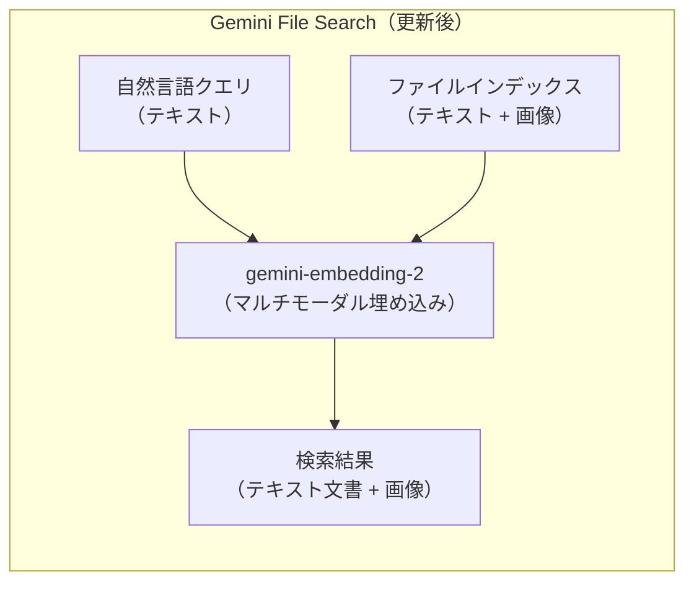
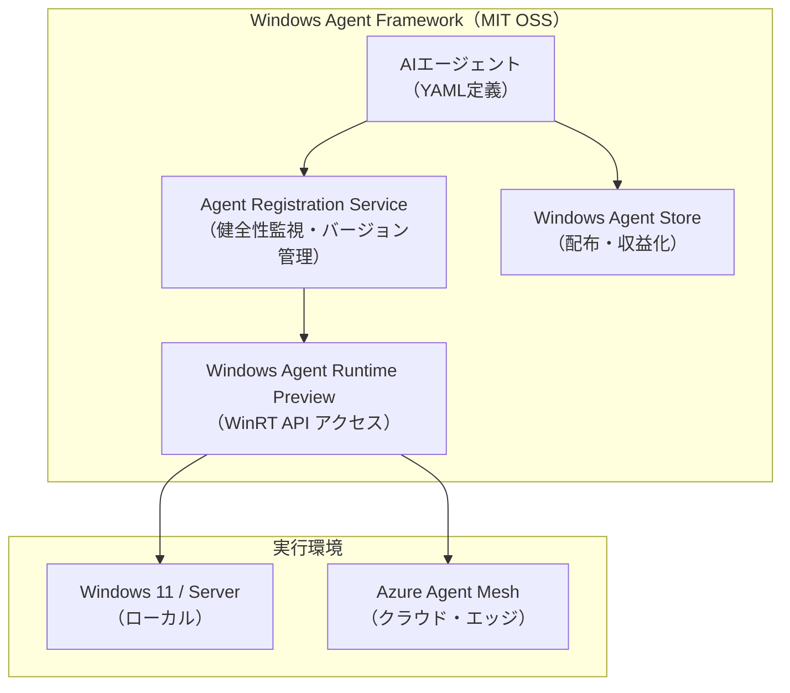
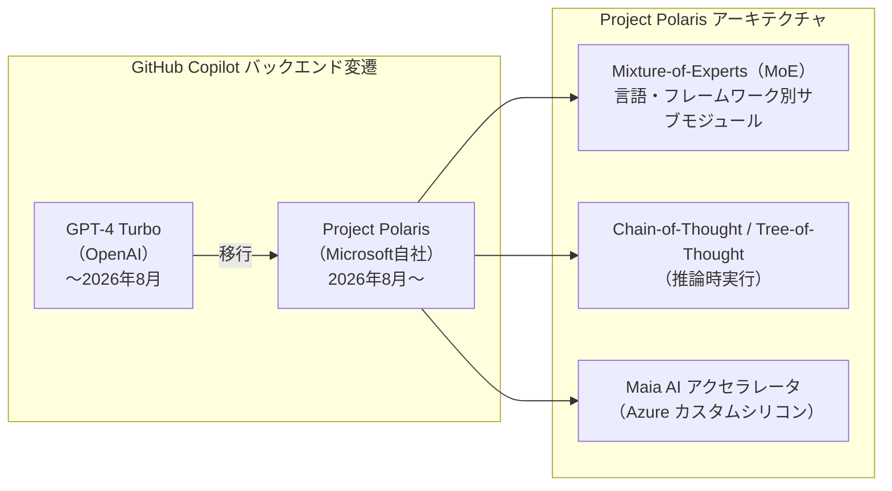
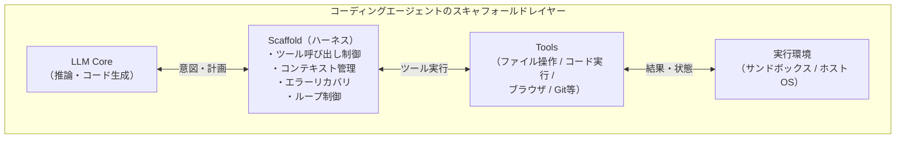
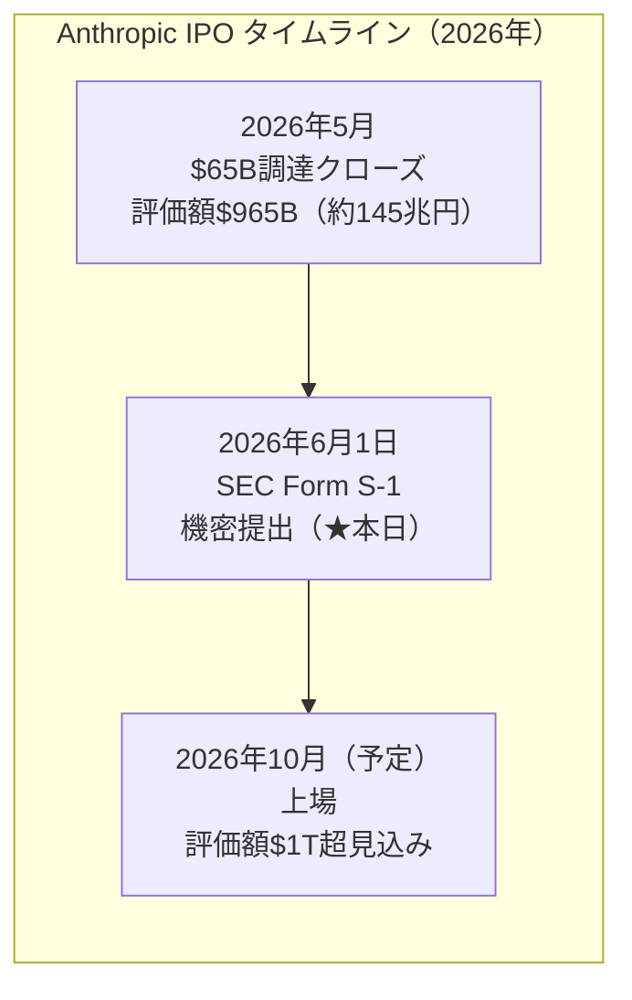
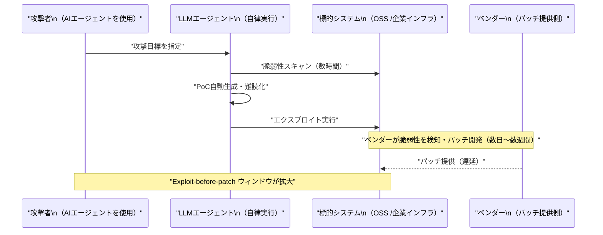

# LLM・AI Agent 最新情報レポート Vol.36

**作成日**: 2026年6月1日  
**対象期間**: 2026年5月31日〜2026年6月1日（Vol.35との差分）

---

## 目次

1. [Google Cloudアップデート](#1-google-cloudアップデート)
2. [Microsoft Azure AI / Build 2026 最新情報](#2-microsoft-azure-ai--build-2026-最新情報)
3. [LLM Model / AI Agentアーキテクチャ・研究](#3-llm-model--ai-agentアーキテクチャ研究)
4. [公式ブログ・論文のリサーチ・要約](#4-公式ブログ論文のリサーチ要約)
   - [Google](#41-google)
   - [OpenAI](#42-openai)
   - [Anthropic](#43-anthropic)
5. [AI Agent搭載SaaS製品情報](#5-ai-agent搭載saas製品情報)
6. [LLM/AI Agentセキュリティインシデント](#6-llmai-agentセキュリティインシデント)
7. [その他特筆すべき情報](#7-その他特筆すべき情報)
8. [参考リンク](#8-参考リンク)

---

## 1. Google Cloudアップデート

### 1.1 Gemini API：Event-driven Webhooks・File Search マルチモーダル対応を追加

GoogleはGemini API changelog（5月末〜6月1日更新分）において、以下の2つの新機能をリリースした。[[1]](#ref-1)

**Event-driven Webhooks（イベント駆動Webhook）：**  
Gemini APIのバッチAPI（Batch API）および長時間実行オペレーション（Long-Running Operations）に対して、ポーリング方式のステータス確認をWebhook通知に置き換えるサポートを追加。従来はジョブ完了を確認するためにクライアントが定期的にAPIをポーリングする必要があり、リソース非効率・遅延の課題があった。

| 比較項目 | ポーリング（旧方式） | Event-driven Webhooks（新方式） |
|---|---|---|
| **確認コスト** | 継続的なAPIリクエストが必要 | ジョブ完了時にサーバーが自動通知 |
| **レイテンシ** | ポーリング間隔に依存 | イベント発生直後に通知 |
| **スケーラビリティ** | 多数のジョブ並列実行時に大量リクエスト | 通知ベースで効率的 |

**File Search マルチモーダル対応：**  
File Search機能が`gemini-embedding-2`モデルを使用して**画像の埋め込みとインデックス化をネイティブにサポート**。テキストだけでなく画像コンテンツを自然言語で検索・照合できるようになった。

### 1.2 Gemini 3.5 Flash：6月8日よりGemini Enterpriseのデフォルトモデルに

Googleは**2026年6月8日をもって、Gemini 3.5 Flash をGemini Enterpriseのデフォルトモデルに設定**し、無効化不可とすることを発表した。[[1]](#ref-1)[[2]](#ref-2)

| 項目 | 詳細 |
|---|---|
| **対象** | Gemini Enterpriseユーザー |
| **変更日** | 2026年6月8日 |
| **内容** | Gemini 3.5 Flashがデフォルトになり、無効化不可 |
| **対応エリア** | Global・US・EU リージョン |
| **次期モデル** | Gemini 3.5 Pro：現在テスト中、7月提供予定 |

なお、Gemini API Interactions API の旧スキーマ（Vol.30既報）は**6月8日に完全廃止**となるため、未移行の開発者は早急な対応が必要。

---

## 2. Microsoft Azure AI / Build 2026 最新情報

**Microsoft Build 2026**（6月2〜3日、サンフランシスコ Fort Mason Center）の開幕前日となる6月1日、複数メディアが事前ブリーフィング・エンバーゴ解禁コンテンツを公開した。Satya Nadella 基調講演（6月2日 9:30 PT）のキーテーマは**「WindowsをAIエージェントプラットフォームへ」**と**「OpenAIから自社モデルへの移行（Project Polaris）」**の2点。[[3]](#ref-3)

### 2.1 Windows Agent Framework（WAF）：MITライセンスでオープンソース化

Microsoftは**Windows Agent Framework（WAF）をMITライセンスのもとオープンソース化**した。[[3]](#ref-3)[[4]](#ref-4)

**主な構成要素：**

| コンポーネント | 機能 |
|---|---|
| **Agent Registration Service** | 自律AIエージェントをWindowsサービスとして登録・管理。健全性監視・バージョン管理 |
| **Windows Agent Runtime（Preview）** | エージェントが操作可能なWindows APIレイヤー。6月よりInsiderプログラムで提供開始 |
| **YAML定義** | エージェントの能力・権限・トリガーを宣言的に記述するポータブル設定フォーマット |

**制限（初期リリース）：** Windows Agent RuntimeはInsider向けプレビューで、**テキストベース（JSON/XML/PDFを操作するもの）のみ**対応。GUI操作はロードマップに記載だが今回は未対応。

### 2.2 Azure Agent Mesh：クロス環境エージェント実行の制御プレーン

**Azure Agent Mesh**は、オンプレミスWindowsサーバー・Windows 365 Cloud PC・Azure Arc対応エッジデバイスを横断してエージェント実行を連携させる新しい**制御プレーン（Control Plane）**。[[3]](#ref-3)[[4]](#ref-4)

| 項目 | 内容 |
|---|---|
| **動作原理** | レイテンシとGPU可用性に基づき最近傍ノードへタスクを自動ルーティング |
| **開発者体験** | ローカルと同じAPIをターゲット。Meshが環境差異を吸収 |
| **課金モデル** | 消費ベース（Consumption-based）、エージェントコンピュート専用SKU |
| **GA予定** | **2026年第4四半期** |

### 2.3 Project Polaris：MoEアーキテクチャの自社コーディングモデルでOpenAI依存を脱却

**Project Polaris**は、GitHubにおけるCopilotのバックエンドを**GPT-4 TurboからMicrosoftの自社開発モデルに切り替える**プロジェクト。[[5]](#ref-5)[[3]](#ref-3)

**性能・展開計画：**

| 項目 | 詳細 |
|---|---|
| **ベンチマーク** | HumanEval・MBPP でGPT-4 Turboを上回る。特にRust・Haskellなど低資源言語で顕著 |
| **推論インフラ** | Azure専用Maia AIアクセラレータで低レイテンシ・低コストを実現 |
| **展開スケジュール** | **2026年8月**よりCopilotサブスクライバーのデフォルトモデルに。3ヶ月間GPT-4フォールバック選択可能 |
| **戦略的意義** | OpenAIへのモデル依存から脱却し、Copilotの長期的収益性とAzure内製AI能力強化を両立 |

### 2.4 WSL 3 と Copilot Workspace GA

**WSL 3（Windows Subsystem for Linux 3）：**  
LinuxカーネルをフルVMではなく**軽量VMに収め**、Windows GPU・NPUへの準仮想化（Paravirtualized）アクセスを提供。[[4]](#ref-4)

| 項目 | WSL 2 | WSL 3 |
|---|---|---|
| **カーネル** | Hyper-V上のLinuxカーネル | 軽量VM（準仮想化） |
| **GPU/NPU** | 間接アクセス | **ネイティブ近似アクセス** |
| **対応プラットフォーム** | 広範 | Qualcomm Snapdragon X Elite・Intel Meteor Lake/Lunar Lake（AMD対応は後続） |

新しい**WSL-AIエクステンション**により、Python/Node.jsで記述したAIエージェントをLinux環境内でWindows Agent Runtimeに対してテスト可能になった。

**Copilot Workspace GA：**  
バグや機能要望を自然言語で記述すると、Copilotが**プラン生成→複数ファイル修正→PR作成まで自律的に実行**する機能が正式GA（ベータ終了）。

### 2.5 Microsoft Agent 365：AWS Bedrock・Google Cloud との Registry Sync が6月 Preview

Microsoft Agent 365が、6月のアップデートとして**AWS Bedrock および Google Gemini Enterprise Agent Platform との Registry Sync をパブリックプレビューで追加**。[[6]](#ref-6)[[7]](#ref-7)

| 機能 | 概要 |
|---|---|
| **Registry Sync** | AWS Bedrock・Google Cloud上に展開されたエージェントを自動検出・インベントリ化 |
| **ライフサイクル管理** | 他社クラウドのエージェントをAgent 365から停止・削除等の基本操作が可能 |
| **Defender 統合** | 各エージェントが動作するデバイス・MCPサーバー・関連IDの資産コンテキストマッピング（6月〜） |

---

## 3. LLM Model / AI Agentアーキテクチャ・研究

### 3.1 「Inside the Scaffold」：コーディングエージェントのスキャフォールドアーキテクチャをソースコードレベルで分類（arXiv:2604.03515）

**"Inside the Scaffold: A Source-Code Taxonomy of Coding Agent Architectures"**（arXiv:2604.03515）は、Claude Code・Devin・SWE-agentなど本番稼働中のコーディングエージェントの**スキャフォールド（エージェントハーネス）をソースコードレベルで解析・分類**した系統的研究。[[8]](#ref-8)

**スキャフォールドの役割：**  
LLMはタスクを推論するが、「どのツールをいつ呼ぶか」「エラー時にどう回復するか」「コンテキストをどう管理するか」などの**実行制御ロジック**はスキャフォールドが担う。モデル性能と同程度にスキャフォールド設計がエージェントの品質を左右するにもかかわらず、アーキテクチャ比較研究は存在しなかった。

**分類フレームワーク：**

| 設計次元 | パターン例 |
|---|---|
| **ツール実行制御** | ReAct（思考→行動→観察のループ）・CodeAct（コード実行中心）・Plans-then-Acts（計画→実行分離） |
| **コンテキスト管理** | ローリングウィンドウ・要約圧縮・ファイルキャッシュ |
| **エラーリカバリ** | リトライ・フォールバックツール・自己デバッグループ |
| **マルチエージェント調整** | オーケストレーター・サブエージェント委譲 |

**主要知見：**
- 最も広く採用されているのは**ReActパターン**だが、Devinのような高性能エージェントはReActを基礎としつつ**自己デバッグループ**と**コンテキスト圧縮**を独自に組み合わせている
- マルチエージェント構成を採用しているエージェントは少ないが、採用したエージェントはシングルエージェントを性能・信頼性の両面で上回る傾向
- 本論文が提案する分類スキームは今後の**エージェント設計ベストプラクティス標準化**の出発点として期待される

---

## 4. 公式ブログ・論文のリサーチ・要約

### 4.1 Google

新情報なし（§1 参照）

---

### 4.2 OpenAI

#### 4.2.1 GPT-4.5 と OpenAI o3 の ChatGPT からの退役スケジュール発表

OpenAIは5月末〜6月1日にかけて、ChatGPTにおける**モデル退役（Retirement）スケジュール**を発表した。[[9]](#ref-9)[[10]](#ref-10)

| モデル | ChatGPT退役日 | サンセット期間 |
|---|---|---|
| **GPT-4.5** | **2026年6月27日** | 30日間 |
| **OpenAI o3** | **2026年8月26日** | 90日間 |

**背景：**  
GPT-4.5はOpenAIにとって最後のGPT-4系モデルであり、その退役はGPT-5系（Instant/Thinking等）への全面移行を象徴する歴史的な転換点となる。2026年3月に公開されたモデル体系整理の一環として、レガシーモデルの段階的廃止が進んでいる。

**影響範囲：** 今回の変更はChatGPT専用。API側でのGPT-4.5・o3の提供は別スケジュール。

---

### 4.3 Anthropic

#### 4.3.1 AnthropicがSECへIPO目論見書を機密提出（6月1日）

2026年6月1日、**Anthropic（Claudeの開発元）が米国証券取引委員会（SEC）にForm S-1の機密提出（Confidential Filing）を行い、上場（IPO）に向けた第一歩を踏み出した**。[[11]](#ref-11)[[12]](#ref-12)[[13]](#ref-13)

**主要財務指標：**

| 指標 | 値 |
|---|---|
| **直近評価額（プレマネー）** | **$965億ドル（約145兆円）** |
| **最終調達額** | $65億ドル（2026年5月クローズ） |
| **Q2売上見通し** | **$109億ドル**（Q1比 2倍超） |
| **年間ARR見通し** | 2026年6月末時点で**$500億ドル超**のペース |
| **収益性** | **初の黒字化四半期**（2026年Q2）が射程に |
| **競合比較** | OpenAI直近評価額（$852億ドル）を上回り、世界最高値の民間AIスタートアップへ |

**機密提出の意義：**  
Form S-1の機密提出は、最終的な公開前にSECとの審査・交渉を非公開で行える制度。IPO価格・株数は未定。上場時期は2026年10月が見込まれている。

**業界的含意：** AnthropicのIPOは単なる資金調達イベントを超え、AIスタートアップが「成熟した公開企業」として市場に受け入れられるかどうかの試金石となる。OpenAI・xAI・Cohereなど競合AIスタートアップへの影響も大きく、AI業界全体のIPOラッシュの先鞭をつける可能性が高い。

---

## 5. AI Agent搭載SaaS製品情報

### 5.1 Microsoft Agent 365：マルチクラウドエージェント管理の標準プラットフォームへ

6月の追加機能として**マルチクラウド対応**が強化された（§2.5参照）。[[6]](#ref-6)[[7]](#ref-7)

特筆すべきはDefender統合による**「シャドーAI（Shadow AI）管理」**：企業内で個人が導入した未承認AIエージェントを自動検出し、ガバナンス対象とする仕組みが整備された。

| 機能 | 内容 |
|---|---|
| **マルチクラウドRegistry Sync** | Azure・AWS Bedrock・Google Cloudのエージェントを単一インベントリに統合 |
| **Shadow AI 検出** | DefenderがホストデバイスからAIエージェントプロセスを検出・分類 |
| **資産コンテキストマッピング** | エージェント↔デバイス↔ID↔クラウドリソースの関係グラフを自動構築 |
| **ポリシーベース制御** | 未承認エージェントへのリアルタイムブロック・アラート |

---

## 6. LLM/AI Agentセキュリティインシデント

### 6.1 AIエージェントによるサイバー攻撃の産業化：論文が「Linux Kernel Copy Fail事件」を事例に警告（arXiv:2605.06713）

**"Agentic AI and the Industrialization of Cyber Offense: Forecast, Consequences, and Defensive Priorities for Enterprises and the Mittelstand"**（arXiv:2605.06713）は、**フロンティアLLMエージェントがサイバー攻撃を産業化・自動化する脅威**を体系的に分析したレポート型論文。[[14]](#ref-14)

**ケーススタディ：2026年「Linux Kernel Copy Fail事件」**  
論文はLinuxカーネルへのエージェント主導型サプライチェーン攻撃事例を分析。人間が数週間かけて行う脆弱性探索・エクスプロイト開発・難読化のサイクルを、エージェントが数時間で自動化できることを実証した。

**脅威予測（主要発見）：**

| 脅威領域 | 予測 |
|---|---|
| **脆弱性スキャン** | 高優先ターゲットのスキャン速度が **10〜100倍** に高速化 |
| **フィッシング・ソーシャルエンジニアリング** | 超個人化された攻撃の自動量産が可能に |
| **ゼロデイ発見** | Exploit-before-patch（パッチ前の悪用）が常態化するリスク |
| **防御コスト** | 攻撃コスト低下に対し防御コストは比例低下しない→**非対称性の拡大** |

**防御優先事項（論文推奨）：**
1. **AIアクセス制御の強化**（エンタープライズ内のAIエージェントへの過剰権限付与を制限）
2. **AIエージェントの行動監査**（Microsoft Agent 365等のガバナンスプラットフォームの活用）
3. **パッチ管理の高速化**（エージェント援用での脆弱性修正を防御側も活用）

---

## 7. その他特筆すべき情報

新情報なし（Anthropic IPOは §4.3 を参照）

---

## 8. 参考リンク

**[1]** [Release notes | Gemini API | Google AI for Developers](https://ai.google.dev/gemini-api/docs/changelog)

**[2]** [Gemini Enterprise release notes | Google Cloud Documentation](https://docs.cloud.google.com/gemini/enterprise/docs/release-notes)

**[3]** [Build 2026: Microsoft's Platform Shift to AI Agents, Copilot, and Azure AI Foundry Takes Center Stage in San Francisco | Windows News](https://windowsnews.ai/article/build-2026-microsofts-platform-shift-to-ai-agents-copilot-and-azure-ai-foundry-takes-center-stage-in.420960)

**[4]** [Microsoft Build 2026: Windows Agent Framework, WSL 3, Azure Agent Mesh, and Windows Agent Store Explained | AI Tools Recap](https://aitoolsrecap.com/Blog/microsoft-build-2026-windows-agent-framework-wsl3-azure-mesh)

**[5]** [Microsoft Build 2026: Homegrown AI Models to Power GitHub Copilot | Windows News](https://windowsnews.ai/article/microsoft-build-2026-homegrown-ai-models-to-power-github-copilot.420887)

**[6]** [Registry sync in the Microsoft 365 agent registry (preview) | Microsoft Learn](https://learn.microsoft.com/en-us/microsoft-agent-365/admin/agent-registry)

**[7]** [What's New in Agent 365: May 2026 | Microsoft Community Hub](https://techcommunity.microsoft.com/blog/agent-365-blog/what%E2%80%99s-new-in-agent-365-may-2026/4516340)

**[8]** [Inside the Scaffold: A Source-Code Taxonomy of Coding Agent Architectures | arXiv:2604.03515](https://arxiv.org/abs/2604.03515)

**[9]** [ChatGPT — Release Notes | OpenAI Help Center](https://help.openai.com/en/articles/6825453-chatgpt-release-notes)

**[10]** [Model Release Notes | OpenAI Help Center](https://help.openai.com/en/articles/9624314-model-release-notes)

**[11]** [Anthropic confidentially files for IPO after raising $65 billion at a $965 billion valuation | Fortune](https://fortune.com/2026/06/01/anthropic-confidentially-files-ipo-965-billion-valuation/)

**[12]** [Anthropic confidentially files IPO prospectus with SEC | CNBC](https://www.cnbc.com/2026/06/01/anthropic-ipo-s1-prospectus.html)

**[13]** [Anthropic, maker of Claude, files with the SEC to go public in an IPO | Washington Post](https://www.washingtonpost.com/technology/2026/06/01/anthropic-maker-claude-files-with-sec-go-public-an-ipo/)

**[14]** [Agentic AI and the Industrialization of Cyber Offense | arXiv:2605.06713](https://arxiv.org/html/2605.06713v1)
