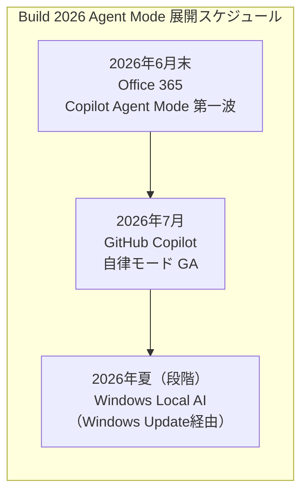
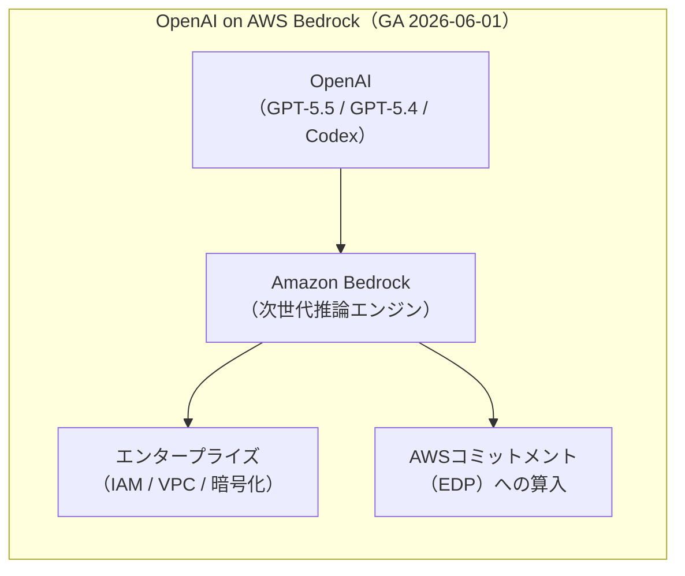
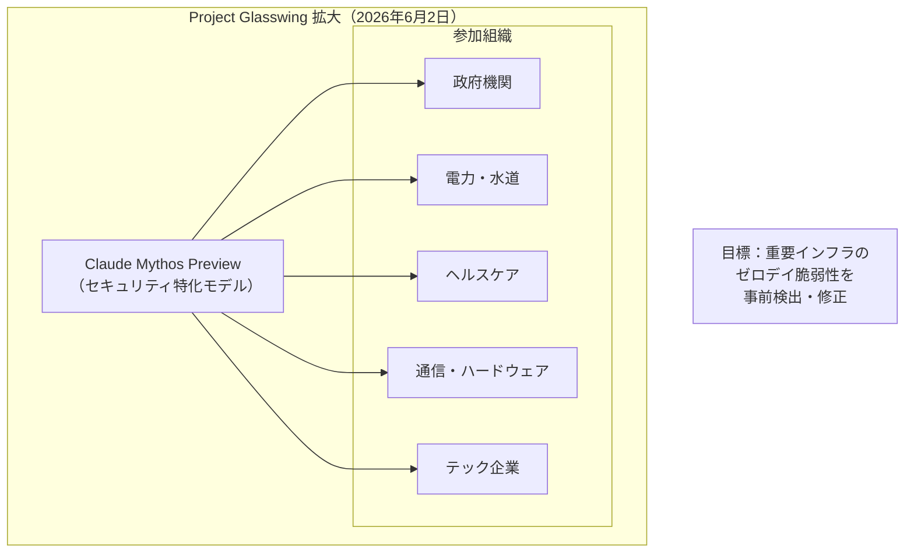
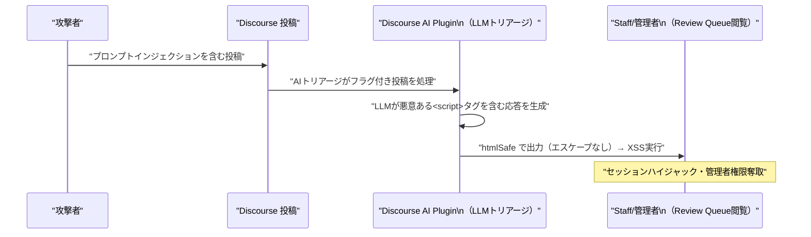

# LLM・AI Agent 最新情報レポート Vol.37

**作成日**: 2026年6月2日  
**対象期間**: 2026年6月1日〜2026年6月2日（Vol.36との差分）

---

## 目次

1. [Google Cloudアップデート](#1-google-cloudアップデート)
2. [Microsoft Azure AI / Build 2026 基調講演レポート](#2-microsoft-azure-ai--build-2026-基調講演レポート)
3. [LLM Model / AI Agentアーキテクチャ・研究](#3-llm-model--ai-agentアーキテクチャ研究)
4. [公式ブログ・論文のリサーチ・要約](#4-公式ブログ論文のリサーチ要約)
   - [Google](#41-google)
   - [OpenAI](#42-openai)
   - [Anthropic](#43-anthropic)
5. [AI Agent搭載SaaS製品情報](#5-ai-agent搭載saas製品情報)
6. [LLM/AI Agentセキュリティインシデント](#6-llmai-agentセキュリティインシデント)
7. [その他特筆すべき情報](#7-その他特筆すべき情報)
8. [参考リンク](#8-参考リンク)

---

## 1. Google Cloudアップデート

新情報なし（本日のGemini API changelogに6月2日付け固有の新規更新は確認されず。Managed AgentsはGoogle I/O 2026時点で既報済み）

---

## 2. Microsoft Azure AI / Build 2026 基調講演レポート

6月2日（日本時間6月3日早朝）、Satya Nadella CEOがサンフランシスコ Fort Mason Centerでの **Microsoft Build 2026** 基調講演を行った。Vol.36では事前リーク・エンバーゴ解禁情報を報じたが、本号では**本番keynoteで公式に発表・確定した内容**を中心にまとめる。[[1]](#ref-1)[[2]](#ref-2)

### 2.1 「Agents are the new OS for work」：基調講演の核心メッセージ

Nadellaは冒頭で「**エージェントは機能の一つではなく、仕事における新しいオペレーティングシステムだ（Agents are not just a feature; they are the new operating system for work）**」と宣言し、Office 365・GitHub・Azure・Windowsのすべてをエージェントファーストプラットフォームへ転換する方針を示した。[[1]](#ref-1)

Microsoft社内データとして「**Fortune 500 の 67% が既に何らかの Copilot 機能を利用**しており、エージェント機能は18ヶ月連続でエンタープライズのトップ要望」という数字も公開された。

### 2.2 Office 365 Copilot Agent Mode：6月末から第一波展開

**Office 365 Copilot Agent Mode** の第一波機能が**2026年6月末**に展開開始されることが正式確認された。[[1]](#ref-1)

| 機能 | 展開時期 | 概要 |
|---|---|---|
| **Office 365 Copilot Agent Mode（第一波）** | 2026年6月末 | ドキュメント横断でのマルチステップタスク自律実行 |
| **GitHub Copilot 自律モード** | 2026年7月 | issueから実装・PRまでを自律実行 |
| **Windows Local AI** | 2026年夏（段階展開） | Windows Update経由でオンデバイスエージェント機能を順次提供 |

### 2.3 Azure AI Foundry：エンタープライズエージェントの統合制御プレーンとして正式定位

Microsoftは **Azure AI Foundry** をエンタープライズエージェントオーケストレーションの**中央制御プレーン（Central Control Plane）**として正式に定位した。[[2]](#ref-2)

- **チップレベル最適化（Windows Local AI）からガバナンスレイヤー（Azure AI Foundry）まで**の垂直統合を強調
- 開発者はFoundryの統一APIから各エージェントを定義・デプロイ・監視可能
- Microsoft Agent 365・Defender・Intuneとの連携により、エンタープライズガバナンスを一元化

---

## 3. LLM Model / AI Agentアーキテクチャ・研究

新情報なし

---

## 4. 公式ブログ・論文のリサーチ・要約

### 4.1 Google

新情報なし

---

### 4.2 OpenAI

#### 4.2.1 GPT-5.5・GPT-5.4・Codex が Amazon Bedrock で GA（6月1日）

OpenAIとAWSは**6月1日**、拡大パートナーシップの下で **GPT-5.5・GPT-5.4・Codex が Amazon Bedrock 上で一般提供（GA）開始**されたことを発表した。[[3]](#ref-3)[[4]](#ref-4)[[5]](#ref-5)

**概要：**

| モデル / ツール | リージョン | 特記事項 |
|---|---|---|
| **GPT-5.5** | US East (Ohio) | Bedrockの次世代推論エンジン上で高スループット |
| **GPT-5.4** | US East (Ohio) / US West (Oregon) | 両リージョンで並列対応 |
| **Codex** | Bedrock全対応リージョン | App・CLI・IDE連携。トークン従量課金（per-seat廃止） |

**課金・統合の変更点：**
- 価格はOpenAIファーストパーティレートと同一（追加費用なし）
- 利用量は **AWS コミットメント（EDP）にカウント**される
- IAM・VPCアイソレーション・暗号化など既存AWSセキュリティ制御がそのまま適用可能
- Codexは従来のper-seat課金を廃止し、**トークン消費量ベースの従量課金**に移行

**戦略的意義：**  
これにより、AWS上でOpenAI・Anthropic（Claude）・Metaオープンモデル（Llama）の主要フロンティアモデルが一本化されたインフラで利用可能となった。エンタープライズはAWSのセキュリティ・コンプライアンス・ガバナンスを維持しながらOpenAIの最新モデルへアクセスできる。

---

### 4.3 Anthropic

#### 4.3.1 Claude Mythos：Project Glasswing を150組織・15カ国以上に拡大（6月2日）

Anthropicは**6月2日**、セキュリティ特化AI「**Claude Mythos**」のプレビューアクセスを通じた **Project Glasswing** を、**新たに150組織・15カ国以上に拡大**したと発表した。[[6]](#ref-6)[[7]](#ref-7)[[8]](#ref-8)

**Project Glasswing とは：**  
電力・水道・ヘルスケア・通信・ハードウェアなど世界の重要インフラを管理する組織と連携し、Claude Mythos Previewを用いてゼロデイ脆弱性を事前に検出・修正するAnthropicの取り組み。2026年4月に米政府を含む初期50組織でスタートした。

**今回の拡大内容：**

| 項目 | 初期（4月） | 今回（6月2日） |
|---|---|---|
| **参加組織数** | 50組織 | +150組織 |
| **対象国** | 主に米国・欧州 | **15カ国以上**（新興国含む） |
| **対象セクター** | 政府・テック系 | **電力・水道・医療・通信・ハードウェア**を追加 |

**Claude Mythos の特性：**
- 汎用性能で優れながら、**コンピュータセキュリティタスクで際立つ能力**を発揮
- 数週間で**数千件のゼロデイ脆弱性**を特定できると公式にアナウンス
- 悪用リスクを理由に「**高度な安全策を実装するまで一般公開しない**」方針を維持

#### 4.3.2 Anthropic 課金変更：Agent SDK の利用が6月15日から別建てに

6月15日から、**Claude Agent SDK および `claude -p` コマンドの利用が、Claudeプランの月間利用量に含まれなくなり、新設された Agent SDK 月間クレジット（ドル建て、標準 API レートで課金）から差し引かれる**仕組みに変更される。[[9]](#ref-9)

| 項目 | 変更前 | 変更後（6月15日〜） |
|---|---|---|
| **Agent SDK / `claude -p` の課金先** | Claudeプランの利用量に含まれる | **Agent SDK 月間クレジット**（別建て） |
| **課金レート** | プランの従量内 | **標準 Anthropic API レート** |
| **対象** | Claude Agent SDK・`claude -p` ユーザー |

---

## 5. AI Agent搭載SaaS製品情報

### 5.1 Salesforce Summer '26：Agentforce Multi-Agent Orchestration が6月15日リリース

Salesforceは **Summer '26 リリース（本番展開：6月5日・6月12日週末）** において、Agentforceのマルチエージェントオーケストレーションを中心とした大型アップデートを行う。[[10]](#ref-10)[[11]](#ref-11)

**主要新機能：**

| 機能 | 概要 |
|---|---|
| **Agentforce Multi-Agent Orchestration** | 複数エージェントをチームとして協調させ、複雑なエンドツーエンドワークフローを処理。全チャネルで共有コンテキストを持つ単一窓口を実現 |
| **Customer Engagement Agent** | 24/7でウェブ・メール上の訪問者と自然言語会話し、リード獲得後に営業担当へウォームハンドオフ |
| **IT Service Domain Pack 強化** | 50種類の即時利用可能なAIエージェントを同梱。IT部門がチケット解決を自動化 |
| **Tableau MCP 統合** | AIエージェントがTableauの分析エンジンを直接クエリ。Agentforce Trust Layerによりデータ保護を維持しながらBI連携 |
| **Agentforce Vibe IDE** | 自然言語でReactアプリ・Apex/Lightningコード・カスタムメタデータを生成するAI開発環境 |
| **Help Agent（セルフサービス）** | 6クリック以下でセットアップ完了。会話型UIの新ポータル体験を提供 |

### 5.2 GitHub Copilot：全プランが「GitHub AI Credits」従量課金へ移行（6月1日）

**6月1日**をもって、**すべての GitHub Copilot プランが GitHub AI Credits（トークン消費量ベースの従量課金）に完全移行**した。[[12]](#ref-12)[[13]](#ref-13)

| プラン | 月額 | 月間 AI Credits 付与 |
|---|---|---|
| **Copilot Pro+** | $39/月 | $39相当 |
| **Copilot Business** | $19/ユーザー/月 | $19相当 |
| **Copilot Enterprise** | $39/ユーザー/月 | $39相当 |

**変更の要点：**
- コードコンプリーション・Next Edit Suggestionsは引き続き**無制限**
- それ以外の機能（チャット・PR Review・Agentモードなど）はトークン消費量に応じてクレジットを消費
- PR Review は Actions マイナットと同レートで課金
- **ユーザーレベルの予算上限設定**機能を新たに追加
- 開発者コミュニティでは「メーターショック（meter shock）」への懸念が拡大

---

## 6. LLM/AI Agentセキュリティインシデント

### 6.1 CVE-2026-27740：Discourse AI プラグインの LLM 出力が Stored XSS を引き起こす脆弱性

**CVE-2026-27740** は、オープンソースフォーラムプラットフォーム **Discourse** の AI プラグインに存在する Stored XSS 脆弱性。AI コンテンツトリアージ機能において、**LLM の生テキスト出力が HTMLエスケープなしに Review Queue インターフェースへ挿入されてしまう**ことが根本原因。[[14]](#ref-14)[[15]](#ref-15)

**攻撃の仕組み：**

**技術的詳細：**

| 項目 | 内容 |
|---|---|
| **CVE ID** | CVE-2026-27740 |
| **脆弱性種別** | Stored XSS（LLM出力の信頼境界違反） |
| **影響対象** | Discourse AI Plugin 利用インスタンス |
| **攻撃前提条件** | 攻撃者が投稿できる一般ユーザー権限があれば十分 |
| **影響範囲** | Staff ユーザー（管理者・モデレーター）のセッション奪取・設定改ざん |
| **根本原因** | LLM 生成コンテンツを `htmlSafe` で信頼し、`ERB::Util.html_escape` を未適用 |
| **修正箇所** | `plugins/discourse-ai/lib/automation/llm_triage.rb` 他 複数ファイル |
| **修正内容** | LLM 出力を I18n テンプレートに埋め込む前に必ず `html_escape` を適用 |

**教訓：**  
本脆弱性は「**LLM 出力はユーザー入力と同様に untrusted データとして扱わなければならない**」という原則の欠如から生じた典型的なパターン。OWASP LLM Top 10 の **LLM02: Insecure Output Handling**（LLM 出力の安全でない処理）そのものに該当する。AI 搭載 Web アプリを実装する際の重要な教訓として業界で注目されている。

---

## 7. その他特筆すべき情報

新情報なし

---

## 8. 参考リンク

**[1]** [Build 2026: Microsoft Unleashes AI Agents Across Office 365, Windows, and Azure at San Francisco Keynote | Windows News](https://windowsnews.ai/article/build-2026-microsoft-unleashes-ai-agents-across-office-365-windows-and-azure-at-san-francisco-keynot.421349)

**[2]** [Microsoft Build 2026: Agentic AI Makes Windows the Next Developer Platform | Windows News](https://windowsnews.ai/article/build-2026-microsoft-makes-windows-the-next-developer-platform.421349)

**[3]** [OpenAI models, Codex, and Managed Agents come to AWS | OpenAI](https://openai.com/index/openai-on-aws/)

**[4]** [Get started with OpenAI GPT-5.5, GPT-5.4 models, and Codex on Amazon Bedrock | AWS News Blog](https://aws.amazon.com/blogs/aws/get-started-with-openai-gpt-5-5-gpt-5-4-models-and-codex-on-amazon-bedrock/)

**[5]** [OpenAI models GPT-5.5 and GPT-5.4—and Codex—now available on AWS Bedrock | About Amazon](https://www.aboutamazon.com/news/aws/bedrock-openai-models)

**[6]** [Anthropic scales Claude Mythos to critical infrastructure in 15+ countries | TechCrunch](https://techcrunch.com/2026/06/02/anthropic-scales-claude-mythos-to-critical-infrastructure-in-15-countries/)

**[7]** [Anthropic Expanding Mythos Access to 150 New Organizations | SecurityWeek](https://www.securityweek.com/anthropic-expanding-mythos-access-to-150-new-organizations/)

**[8]** [Claude Mythos Preview | red.anthropic.com](https://red.anthropic.com/2026/mythos-preview/)

**[9]** [Anthropic's June 15 Billing Change: What Every Claude Code & Agent SDK User Must Do | Codersera](https://codersera.com/blog/anthropic-june-2026-billing-change-claude-code/)

**[10]** [Salesforce Summer 2026 Product Release Announcement | Salesforce](https://www.salesforce.com/news/stories/summer-2026-product-release-announcement/)

**[11]** [Salesforce Summer '26 Release: Top Features, Agentforce Updates & More | HIC Global Solutions](https://hicglobalsolutions.com/blog/salesforce-summer-release-26-top-features-agentforce-updates-more/)

**[12]** [GitHub Copilot is moving to usage-based billing | The GitHub Blog](https://github.blog/news-insights/company-news/github-copilot-is-moving-to-usage-based-billing/)

**[13]** [Updates to GitHub Copilot billing and plans | GitHub Changelog](https://github.blog/changelog/2026-06-01-updates-to-github-copilot-billing-and-plans/)

**[14]** [CVE-2026-27740 LLM Output Causes Stored XSS | PointGuard AI](https://www.pointguardai.com/ai-security-incidents/llm-output-triggers-stored-xss-in-discourse-cve-2026-27740)

**[15]** [CVE-2026-27740: Discourse AI LLM XSS Vulnerability | SentinelOne](https://www.sentinelone.com/vulnerability-database/cve-2026-27740/)
