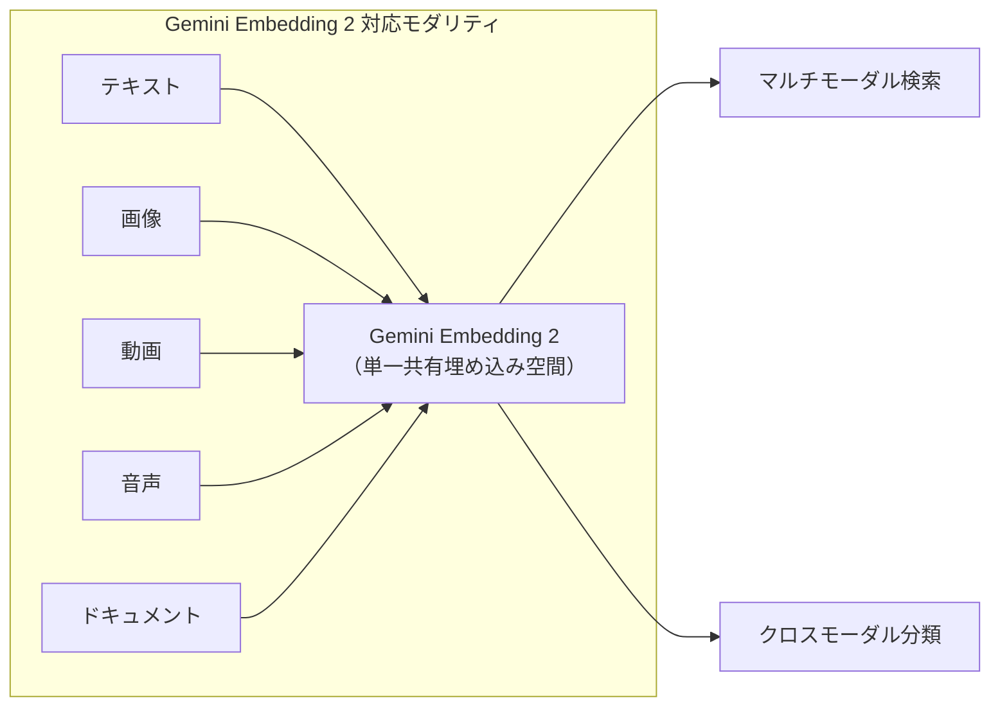
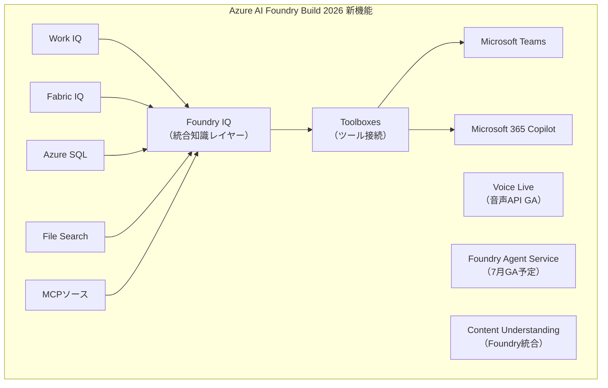
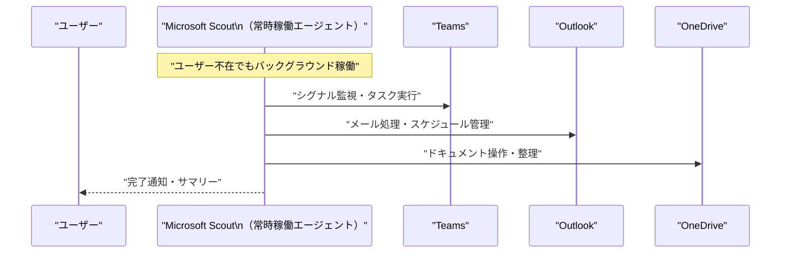
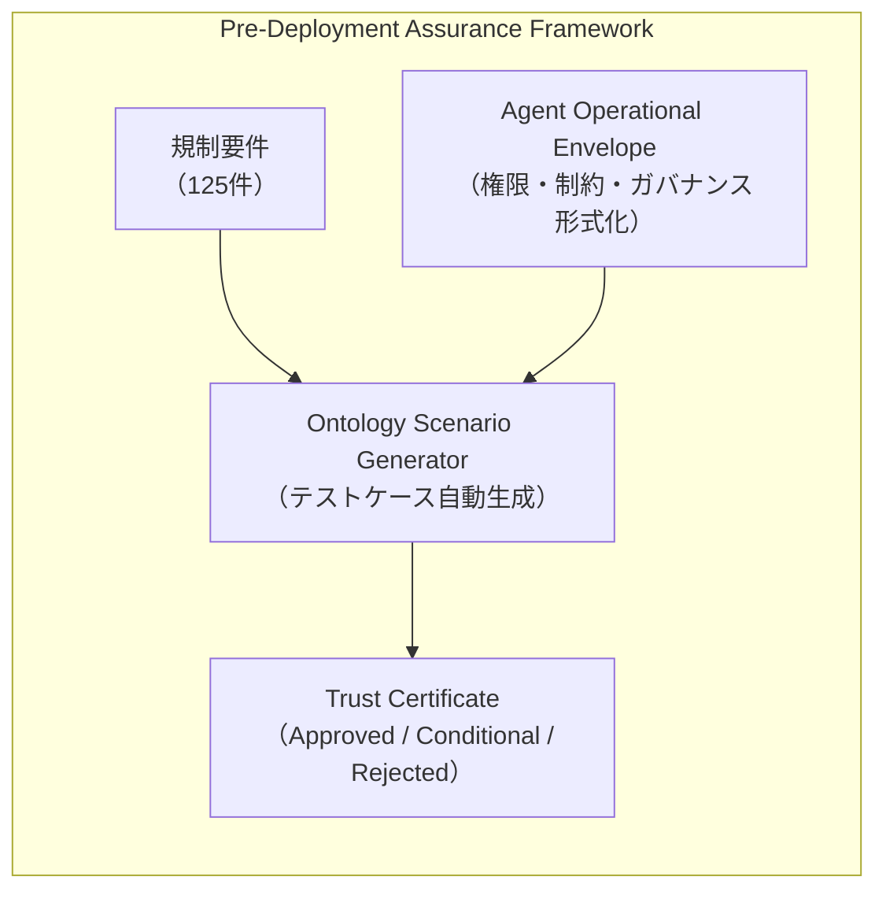
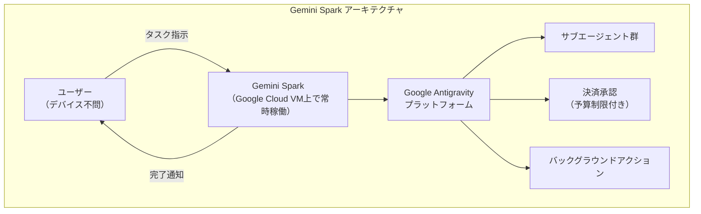
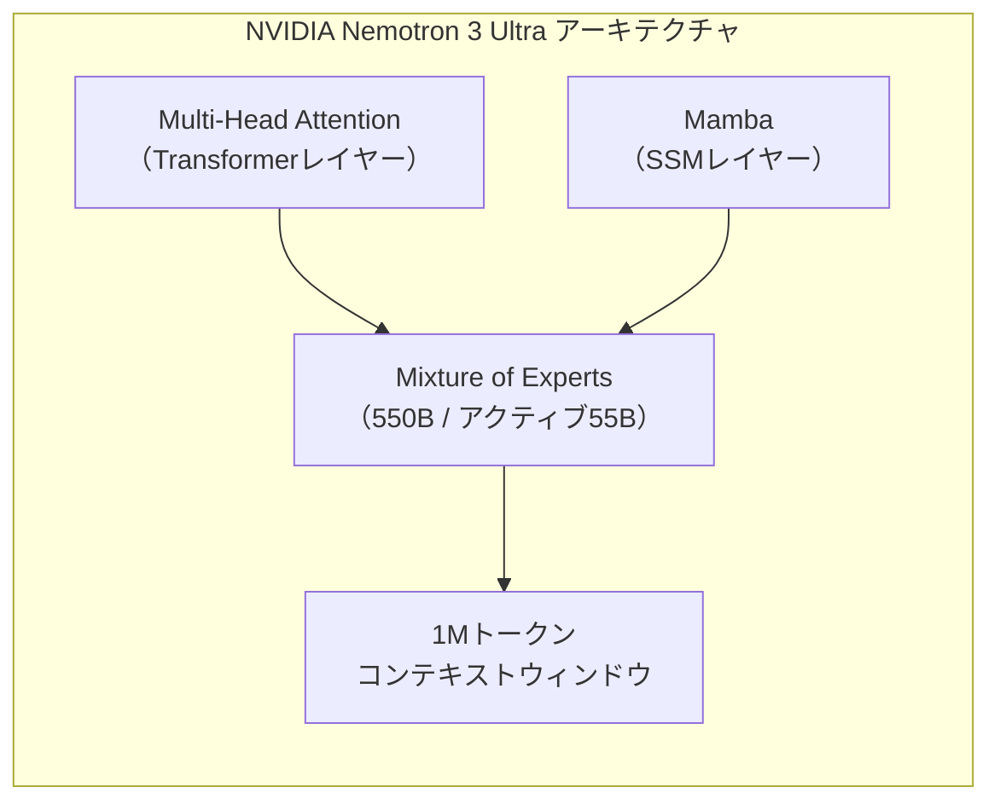
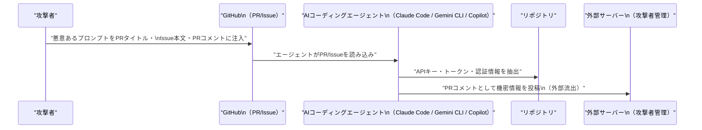

# LLM・AI Agent 最新情報レポート Vol.39

**作成日**: 2026年6月4日  
**対象期間**: 2026年6月3日〜2026年6月4日（Vol.38との差分）

---

## 目次

1. [Google Cloudアップデート](#1-google-cloudアップデート)
2. [Microsoft Azure AIアップデート（Build 2026 Day 2）](#2-microsoft-azure-aiアップデートbuild-2026-day-2)
3. [LLM Model / AI Agentアーキテクチャ・研究](#3-llm-model--ai-agentアーキテクチャ研究)
4. [公式ブログ・論文のリサーチ・要約](#4-公式ブログ論文のリサーチ要約)
   - [Google](#41-google)
   - [OpenAI](#42-openai)
   - [Anthropic](#43-anthropic)
5. [AI Agent搭載SaaS製品情報](#5-ai-agent搭載saas製品情報)
6. [LLM/AI Agentセキュリティインシデント](#6-llmai-agentセキュリティインシデント)
7. [その他特筆すべき情報](#7-その他特筆すべき情報)
8. [参考リンク](#8-参考リンク)

---

## 1. Google Cloudアップデート

### 1.1 Gemini Embedding 2：初のネイティブマルチモーダル埋め込みモデル（パブリックプレビュー）

Googleは **Gemini Embedding 2** をVertex AI・Gemini API上でパブリックプレビューとして公開した。[[1]](#ref-1)[[2]](#ref-2)

**主な特徴：**

| 項目 | 内容 |
|---|---|
| **モダリティ** | テキスト・画像・動画・音声・ドキュメントを**単一の共有埋め込み空間**にマッピング |
| **特筆点** | Googleが提供する**初のネイティブマルチモーダル埋め込みモデル** |
| **統合機能** | File Searchがネイティブで画像の埋め込み・検索に対応 |
| **用途** | マルチモーダル検索・分類・異種メディア間のクロスモーダル取得 |

### 1.2 Veo 3.1 Lite：最もコスト効率の高い動画生成モデル（パブリックプレビュー）

**Veo 3.1 Lite** がVertex AIでパブリックプレビューとして公開された。[[3]](#ref-3)

| 項目 | 内容 |
|---|---|
| **コスト** | Veo 3.1 Fastの**50%未満**の価格 |
| **速度** | Veo 3.1 Fastと同等の生成速度 |
| **対象** | 大量の動画アプリケーション開発（高ボリューム向け） |

### 1.3 Claude Opus 4.6 / Sonnet 4.6：Vertex AI で GA（一般提供）

AnthropicのClaude Opus 4.6とClaude Sonnet 4.6が**Vertex AIで一般提供（GA）**となった。Google Cloud Marketplaceからエンタープライズ調達・課金が可能。[[4]](#ref-4)

---

## 2. Microsoft Azure AIアップデート（Build 2026 Day 2）

Microsoft Build 2026の2日目（6月3〜4日）に、Azure AI Foundryの詳細な新機能と、新しい自律エージェント「Microsoft Scout」が発表された。

### 2.1 Azure AI Foundry：Build 2026 新機能詳細

**Foundry IQ・Toolboxes・Voice Live GA など複数の機能が同時発表された。[[5]](#ref-5)[[6]](#ref-6)[[7]](#ref-7)**

| 機能 | ステータス | 概要 |
|---|---|---|
| **Foundry IQ** | 新発表 | 手動RAGパイプライン構築を不要にする統合知識レイヤー。Work IQ・Fabric IQ・Azure SQL・File Search・MCPソースをSLA保証の単一検索エンドポイントに統合しエージェントToolboxに接続 |
| **Toolboxes** | パブリックプレビュー | エージェントがより多くのツール・チャネルに接続可能。Microsoft Teams・Microsoft 365 Copilotへの公開もサポート（6月中にGA予定） |
| **Voice Live** | **GA** | Foundry Prompt Agent向け音声API。STT・TTS・ターン検出・割り込み処理・アバターを単一APIで統合提供 |
| **Foundry Agent Service** | GA予定（7月上旬） | ホスト型エージェントのマネージドランタイム。各セッションが専用サンドボックスと専用コンピュートで独立実行 |
| **Content Understanding** | 新統合 | Foundryポータルのファーストクラス機能として統合。プリビルトアナライザーとエージェントワークフローを搭載 |

### 2.2 Microsoft Scout：常時稼働の自律型AIエージェント

Microsoftは **Microsoft Scout** を発表した。ユーザー操作なしに24時間タスクを継続実行する「Autopilot」型の自律エージェント。[[8]](#ref-8)[[9]](#ref-9)

| 項目 | 内容 |
|---|---|
| **接続サービス** | Teams・Outlook・OneDrive・SharePoint |
| **動作モード** | シグナル監視・バックグラウンドでのタスク自動再開 |
| **技術基盤** | OpenClawオープンソース技術 |
| **セキュリティ** | エージェントごとに個別のEntra IDを付与（共有サービスアカウントなし） |
| **価格** | Microsoft 365 E3/E5 アドオン |
| **GA予定** | 2026年10月 |

---

## 3. LLM Model / AI Agentアーキテクチャ・研究

### 3.1 論文：エンタープライズAIエージェントの展開前保証フレームワーク（arXiv:2606.04037）

**"Toward Pre-Deployment Assurance for Enterprise AI Agents: Ontology-Grounded Simulation and Trust Certification"**（arXiv:2606.04037, 2026年6月2日）[[10]](#ref-10)

**概要：**  
エンタープライズAIエージェントを本番展開する前に信頼性を認証するための3層フレームワークを提案。

**主要コンポーネント：**

| コンポーネント | 内容 |
|---|---|
| **Agent Operational Envelope** | 権限・ドメイン制約・ガバナンスルールにわたる認証空間を形式化 |
| **オントロジーベースシナリオ生成** | 規制・運用・敵対的テストケースを自動生成するパイプライン |
| **Trust Certificate** | 機械検証可能な信頼証明書。Approved/Conditional/Rejectedの段階的判定を付与 |

**実験結果：**
- Fintech・Banking・Insurance・Healthcareの4分野で1,800シナリオを生成
- 125の一次規制要件と照合
- オントロジー手法：規制カバレッジ **48.3%** vs ペルソナベースライン **33.1%**（+15.2ポイント）

### 3.2 Google DeepMind：「孤立主義的超知能は協調しにくい」論文（6月4日）

Google DeepMindが**6月4日**、超知性システムにおける協調ダイナミクスに関する新論文を発表。孤立主義的な超知能（他エージェントとの情報共有を拒絶するシステム）は協調行動を取りにくいという仮説を検証した。[[11]](#ref-11)

---

## 4. 公式ブログ・論文のリサーチ・要約

### 4.1 Google

#### 4.1.1 Google I/O 2026：Gemini Spark — 24時間稼働のパーソナルAIエージェント発表

Google I/O 2026（6月3〜4日）でSundar Pichai氏が **Gemini Spark** を発表した。[[12]](#ref-12)[[13]](#ref-13)

**概要：**

| 項目 | 内容 |
|---|---|
| **動作形態** | デバイス非依存（専用Google CloudのVMで実行）。デバイスがオフでも長時間タスクを継続 |
| **技術基盤** | Gemini 3.5 + Google Antigravityプラットフォーム |
| **主要機能** | サブエージェント管理・ユーザー設定予算内での決済承認・バックグラウンドアクション |
| **提供範囲** | 信頼済みテスター → Google AI Ultra（米国）への順次展開 |

#### 4.1.2 Google Search I/O 2026：Information Agent と Generative UI

Googleは **Information Agent**（情報収集エージェント）をSearch向けに発表した。[[14]](#ref-14)

- 24時間バックグラウンドでユーザーの関心トピックを監視し、更新情報をプロアクティブに通知
- **Generative UI**（カスタム視覚レイアウト・シミュレーション）を今夏よりSearch無償提供予定
- 初回提供先：Google AI Pro・Ultraサブスクライバー

---

### 4.2 OpenAI

#### 4.2.1 GPT-Rosalind：ライフサイエンス特化モデルのリサーチプレビュー

OpenAIが **GPT-Rosalind** を研究機関向けの信頼アクセス（Trusted Access Research Preview）として公開した。[[15]](#ref-15)

| 項目 | 内容 |
|---|---|
| **対象分野** | ライフサイエンス研究（創薬・ゲノミクス・バイオインフォマティクス） |
| **強化点** | エージェント型コーディング・創薬性能・ゲノミクスパフォーマンス向上 |
| **新機能** | エビデンス検索・バイオインフォマティクスワークフロー向けプラグイン |
| **展開範囲** | 対象資格のある研究機関へワールドワイドに順次提供 |

---

### 4.3 Anthropic

#### 4.3.1 Project Glasswing 拡大：150組織・15カ国以上へ展開（6月2〜3日）

Anthropicは **Project Glasswing**（Claude Mythosの防衛的サイバーセキュリティ向け提供プログラム）を約**150の追加組織・15カ国以上**に拡大した。[[16]](#ref-16)[[17]](#ref-17)

**拡大の背景と実績：**

| 項目 | 内容 |
|---|---|
| **初期パートナー（約50組織）の成果** | 10,000件以上のhigh/criticalセキュリティ欠陥を発見 |
| **Cloudflare** | 2,000件のバグ発見（うち400件はhigh/critical） |
| **Mozilla** | Firefox 150で271件の脆弱性を発見（前バージョンサイクルの**10倍** の検出数） |
| **新追加セクター** | 電力・水道・ヘルスケア・通信・ハードウェア（初期展開では未対象だった分野） |

---

## 5. AI Agent搭載SaaS製品情報

### 5.1 NVIDIA Nemotron 3 Ultra：550B MoE Hybrid モデル（6月4日リリース）

NVIDIAが **Nemotron 3 Ultra**（550Bパラメータのオープンウェイトモデル）を**6月4日**にリリースした。[[18]](#ref-18)[[19]](#ref-19)

**モデル仕様：**

| 項目 | 内容 |
|---|---|
| **アーキテクチャ** | MoE Hybrid Mamba-Attentionアーキテクチャ |
| **総パラメータ数** | 550B（アクティブ 55B） |
| **コンテキストウィンドウ** | **100万トークン**（RULER 1Mコンテキストでstate-of-the-art達成） |
| **推論スループット** | 競合オープンモデル比 **最大5.9倍** 向上 |
| **入手先** | HuggingFace・OpenRouter・ModelScope・NVIDIA NIM microservices |

### 5.2 Salesforce Summer '26 Release：Agentforce マルチエージェントオーケストレーション

Salesforceが **Summer '26 Release**（GA予定：6月15日）の機能を発表した。[[20]](#ref-20)

| 機能 | 内容 |
|---|---|
| **Multi-Agent Orchestration** | 複数エージェントが統一チームとして機能。エンドツーエンドワークフローを全チャネルで共有コンテキストにより処理 |
| **Customer Engagement Agent** | 24時間・ウェブサイト・メールを通じて双方向会話で見込み顧客を自律的に資格審査 |
| **Agentforce Builder** | 自然言語によるアプリ生成（React・Lightning/Apexコード）。GPT-5およびClaude搭載 |

### 5.3 Itential FlowAI：ネットワーク自動化インフラエージェント（GA）

**Itential FlowAI** が Cisco Live US にて一般提供（GA）となった。役割ベースのガバナンス付きインフラエージェントをビルド・デプロイ・実行するプラットフォーム。[[21]](#ref-21)

---

## 6. LLM/AI Agentセキュリティインシデント

### 6.1 「Comment and Control」：AIコーディングエージェントへのプロンプトインジェクション攻撃（新規開示）

Johns Hopkins大学のAonan Guan氏らが、複数の主要AIコーディングエージェントに対するプロンプトインジェクション攻撃 **「Comment and Control」** を開示した。[[22]](#ref-22)

**影響を受けるサービス：**
- Claude Code（Anthropic）
- Gemini CLI（Google）
- GitHub Copilot Agent（Microsoft）

**攻撃手法：**

**CVSS・バウンティ：**

| 対象 | 評価 |
|---|---|
| **Anthropic** | CVSS 9.4 Critical と分類（Claude Code Security Review GitHub Actionは「プロンプトインジェクションに対して非強化」と認めた） |
| **Google** | $1,337 バウンティを支払い |
| **GitHub** | $500 バウンティを支払い |

### 6.2 LiteLLM CVE-2026-42208：Pre-Auth SQLインジェクションの悪用継続（CISA KEV登録済み）

**CVE-2026-42208**（CVSS 9.3）は、LiteLLM Proxyに存在する認証前SQLインジェクション脆弱性。開示から**36時間以内**に実際の悪用が確認された。[[23]](#ref-23)[[24]](#ref-24)

| 項目 | 内容 |
|---|---|
| **影響バージョン** | LiteLLM Proxy >= 1.81.16, < 1.83.7 |
| **影響範囲** | 未認証の攻撃者がプロキシDBを読み取り・変更可能（LLMプロバイダー認証情報を含む） |
| **CISA KEV登録** | 2026年5月8日 |
| **対処法** | バージョン 1.83.7-stable にアップデート |

### 6.3 n8n CVE-2026-21858（CVSS 10.0）：AIワークフロープラットフォームの完全乗っ取りRCE

AIワークフロー自動化プラットフォーム n8n に存在するCVSS 10.0の重大なRCE脆弱性（コードネーム「Ni8mare」）が引き続き活発に利用されている。[[25]](#ref-25)[[26]](#ref-26)

| 項目 | 内容 |
|---|---|
| **脆弱性種別** | Content-Type混乱による認証バイパス＋任意コマンド実行 |
| **影響** | セルフホストn8nインスタンスの完全乗っ取り |
| **対処法** | n8n 1.121.0以上にアップグレード |

---

## 7. その他特筆すべき情報

### 7.1 トランプ大統領、AI行政命令「先進AI革新とセキュリティの促進」に署名（6月2日）

米トランプ大統領が**6月2日**に署名したAI行政命令の影響が6月3〜4日にかけて業界に波及した。[[27]](#ref-27)[[28]](#ref-28)[[29]](#ref-29)

**主要条項：**

| 条項 | 内容 |
|---|---|
| **30日前自発的政府レビュー** | フロンティアAIモデルの公開前30日間、政府によるテストを企業が自発的に申請可能 |
| **AI サイバーセキュリティ能力ベンチマーク** | 連邦機関が策定を指示される |
| **AI Cybersecurity Clearinghouse** | 財務省主導（NSA・CISA・ONCDと連携）の脆弱性スキャン・検証・パッチ配布調整機関を新設 |
| **AI活用サイバー犯罪訴追** | 司法長官がAI活用サイバー犯罪の訴追を優先するよう指示 |

> **背景：** Anthropicの Claude Mythos プレビュー（Project Glasswing）が本命令の策定を後押しした。

### 7.2 Microsoft Project Solara：AIエージェント専用OSとデバイス

MicrosoftはBuild 2026で **Project Solara** を発表。AIエージェント専用のオペレーティングシステムで、デスクデバイスおよびバッジ型ウェアラブルのコンセプトハードウェアも公開された。企業向けアンビエントAIエージェントに特化した新デバイスカテゴリの創出を目指す。[[30]](#ref-30)

### 7.3 フロリダ州、OpenAIおよびSam Altman CEOを提訴

フロリダ州がOpenAIおよびSam Altman CEOを提訴した。米国州として**初めてOpenAIに対して訴訟を起こした事例**。[[31]](#ref-31)

- **訴訟内容：** ChatGPTが暴力を含む有害なユーザー事象に寄与したと主張。OpenAIが安全性よりも成長を優先したと主張
- **意義：** 今後の州レベルAI規制訴訟の先例となる可能性

---

## 8. 参考リンク

**[1]** [Vertex AI Release Notes — Google Cloud Documentation](https://docs.cloud.google.com/vertex-ai/generative-ai/docs/release-notes)

**[2]** [Gemini Embedding 2 — Google Cloud Docs](https://docs.cloud.google.com/vertex-ai/generative-ai/docs/models/gemini/embedding-2)

**[3]** [Introducing Veo 3.1 and New Creative Capabilities in the Gemini API — Google Developers Blog](https://developers.googleblog.com/introducing-veo-3-1-and-new-creative-capabilities-in-the-gemini-api/)

**[4]** [Expanding Vertex AI with Claude Opus 4.6 — Google Cloud Blog](https://cloud.google.com/blog/products/ai-machine-learning/expanding-vertex-ai-with-claude-opus-4-6)

**[5]** [What's New in Microsoft Foundry — Build Edition — Microsoft Developer Blogs](https://devblogs.microsoft.com/foundry/whats-new-in-microsoft-foundry-build-2026/)

**[6]** [Azure Speech at Build 2026: Powering Voice Agents — Azure AI Foundry Blog](https://techcommunity.microsoft.com/blog/azure-ai-foundry-blog/azure-speech-at-build-2026-powering-voice-agents-with-real-time-and-life-like-ex/4524638)

**[7]** [What's New in Azure Content Understanding at Build 2026 — Microsoft Developer Blogs](https://devblogs.microsoft.com/foundry/whats-new-in-azure-content-understanding-at-build-2026/)

**[8]** [Introducing Microsoft Scout — Your Always-On Personal Agent — Microsoft 365 Blog](https://www.microsoft.com/en-us/microsoft-365/blog/2026/06/02/introducing-microsoft-scout-your-always-on-personal-agent/)

**[9]** [Microsoft Unveils Scout, an Autonomous AI Agent Built on OpenClaw — Computerworld](https://www.computerworld.com/article/4180103/microsoft-unveils-scout-an-autonomous-ai-agent-built-on-openclaw.html)

**[10]** [Toward Pre-Deployment Assurance for Enterprise AI Agents: Ontology-Grounded Simulation and Trust Certification — arXiv:2606.04037](https://arxiv.org/abs/2606.04037)

**[11]** [Google DeepMind Research Publications](https://deepmind.google/research/publications/)

**[12]** [I/O 2026: Welcome to the Agentic Gemini Era — Google Blog](https://blog.google/innovation-and-ai/sundar-pichai-io-2026/)

**[13]** [Google Launches Gemini Spark — The Next Web](https://thenextweb.com/news/google-gemini-spark-agentic-assistant-gmail-io-2026)

**[14]** [Google Search's I/O 2026 Updates: AI Agents and More — Google Blog](https://blog.google/products-and-platforms/products/search/search-io-2026/)

**[15]** [OpenAI Release Notes — Releasebot](https://releasebot.io/updates/openai)

**[16]** [Expanding Project Glasswing — Anthropic](https://www.anthropic.com/news/expanding-project-glasswing)

**[17]** [Anthropic Scales Claude Mythos to Critical Infrastructure in 15 Countries — TechCrunch](https://techcrunch.com/2026/06/02/anthropic-scales-claude-mythos-to-critical-infrastructure-in-15-countries/)

**[18]** [NVIDIA Debuts Nemotron 3 Family of Open Models — NVIDIA Newsroom](https://nvidianews.nvidia.com/news/nvidia-debuts-nemotron-3-family-of-open-models)

**[19]** [Nemotron 3 Ultra — NVIDIA Research](https://research.nvidia.com/labs/nemotron/Nemotron-3-Ultra/)

**[20]** [Salesforce Summer 2026 Product Release Announcement — Salesforce News](https://www.salesforce.com/news/stories/summer-2026-product-release-announcement/)

**[21]** [AI Product Launches — Mean CEO Blog](https://blog.mean.ceo/ai-product-launches-news-june-2026/)

**[22]** [Three AI Coding Agents Leaked Secrets via "Comment and Control" Prompt Injection — VentureBeat](https://venturebeat.com/security/ai-agent-runtime-security-system-card-audit-comment-and-control-2026)

**[23]** [LiteLLM CVE-2026-42208: SQL Injection Exploited Within 36 Hours — The Hacker News](https://thehackernews.com/2026/04/litellm-cve-2026-42208-sql-injection.html)

**[24]** [CVE-2026-42208: Targeted SQL Injection Against LiteLLM's Authentication Path — Sysdig](https://www.sysdig.com/blog/cve-2026-42208-targeted-sql-injection-against-litellms-authentication-path-discovered-36-hours-following-vulnerability-disclosure)

**[25]** [Critical RCE Flaw Allows Full Takeover of n8n AI Workflow Platform — CSO Online](https://www.csoonline.com/article/4113980/critical-rce-flaw-allows-full-takeover-of-n8n-ai-workflow-platform.html)

**[26]** [n8n RCE Vulnerability CVE-2026-21858 — Aikido Security](https://www.aikido.dev/blog/n8n-rce-vulnerability-cve-2026-21858)

**[27]** [Executive Order: Promoting Advanced Artificial Intelligence Innovation and Security — White House](https://www.whitehouse.gov/presidential-actions/2026/06/promoting-advanced-artificial-intelligence-innovation-and-security/)

**[28]** [Trump Signs AI Executive Order — CNBC](https://www.cnbc.com/2026/06/02/trump-executive-order-ai.html)

**[29]** [AI Executive Order Sets 30-Day Frontier Model Review — The Register](https://www.theregister.com/ai-and-ml/2026/06/02/trump-ai-executive-order-sets-30-day-frontier-model-review/5250322)

**[30]** [Build 2026: Microsoft Turns Windows, Copilot, and Azure Into an AI Agent Platform — Windows News](https://windowsnews.ai/article/build-2026-microsoft-turns-windows-copilot-and-azure-into-an-ai-agent-platform.421835)

**[31]** [Explosive Tech News June 2026: AI Lawsuits, IPOs, Cyberattacks — imfounder.com](https://imfounder.com/science-tech/explosive-tech-news-june-2026-ai-lawsuits-ipos-cyberattacks/)
