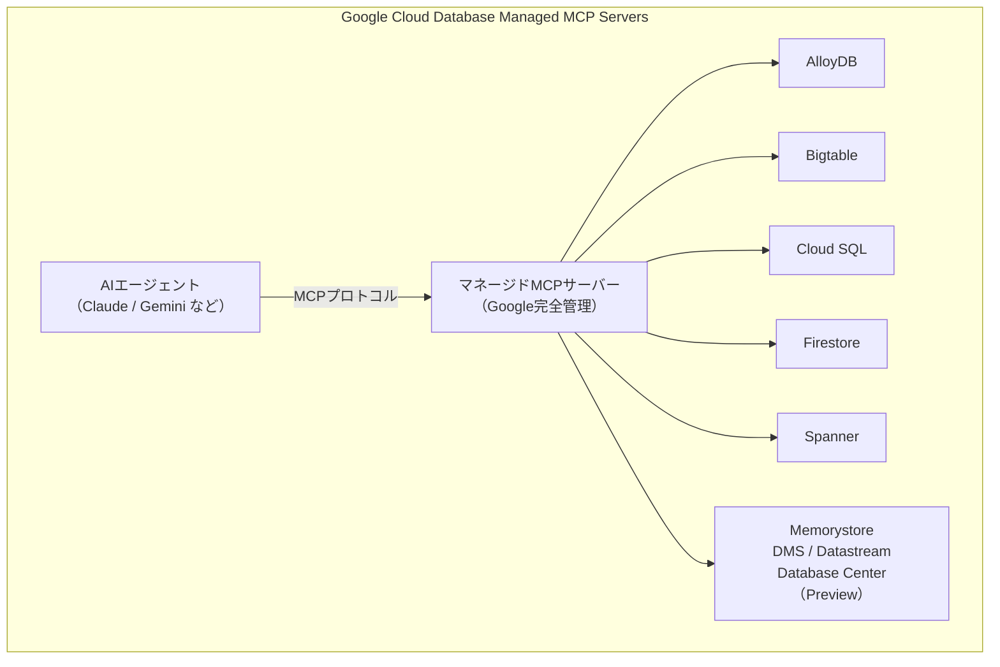
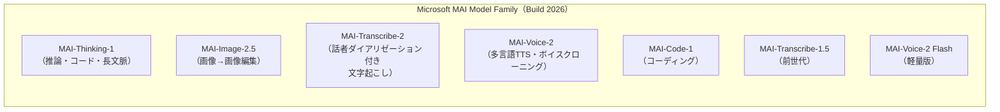
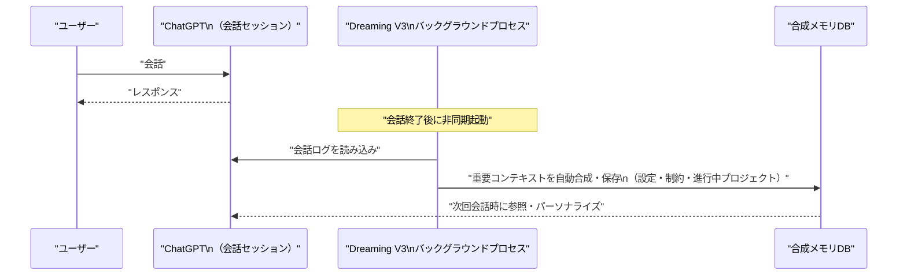
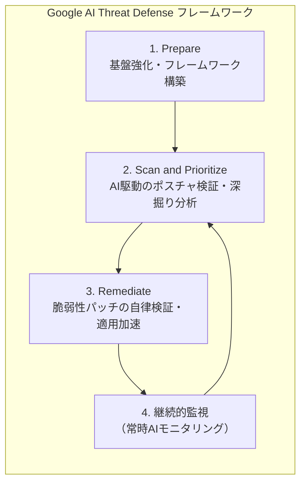
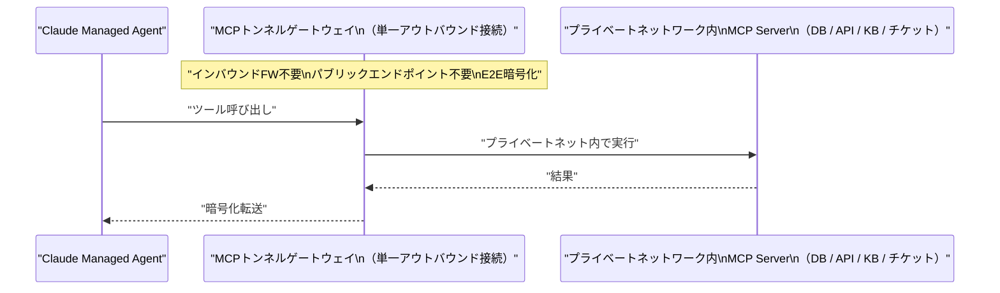
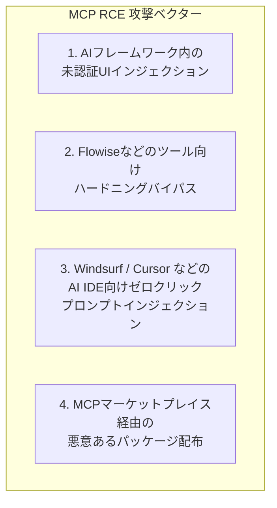

# LLM・AI Agent 最新情報レポート Vol.40

**作成日**: 2026年6月5日  
**対象期間**: 2026年6月4日〜2026年6月5日（Vol.39との差分）

---

## 目次

1. [Google Cloudアップデート](#1-google-cloudアップデート)
2. [Microsoft Azure AIアップデート](#2-microsoft-azure-aiアップデート)
3. [LLM Model / AI Agentアーキテクチャ・研究](#3-llm-model--ai-agentアーキテクチャ研究)
4. [公式ブログ・論文のリサーチ・要約](#4-公式ブログ論文のリサーチ要約)
   - [Google](#41-google)
   - [OpenAI](#42-openai)
   - [Anthropic](#43-anthropic)
5. [AI Agent搭載SaaS製品情報](#5-ai-agent搭載saas製品情報)
6. [LLM/AI Agentセキュリティインシデント](#6-llmai-agentセキュリティインシデント)
7. [その他特筆すべき情報](#7-その他特筆すべき情報)
8. [参考リンク](#8-参考リンク)

---

## 1. Google Cloudアップデート

### 1.1 Google Cloud データベース群：AI Agent向けマネージドMCPサーバー

Google CloudはAlloyDB・Bigtable・Cloud SQL・Firestore・Spannerに対するマネージドMCPサーバーを正式に提供開始し、Memorystore・Database Migration Service・Datastream・Database Centerについてもプレビューとして追加した。[[1]](#ref-1)[[2]](#ref-2)

Googleが完全にインフラを管理するため、AIモデルがエンタープライズデータへproduction-gradeの信頼性でアクセスできるようになる。

| サービス | 新機能・用途 |
|---|---|
| **Firestore** | 自然言語プロンプトからフルスタックアプリ生成、Claude Code / Cursor / Codexとの連携（Firestore Skills） |
| **Bigtable** | MCP経由のオペレーショナルワークフロー自動化、アジェンティックCRM・サプライチェーンアプリ構築 |
| **Memorystore** | Valkey 9.0 GA（Redisからのマネージドマイグレーションパス提供） |

### 1.2 Gemini Cloud Assist：Cloud Composer 3でのAirflow障害自動調査

Gemini Cloud AssistがCloud Composer 3にネイティブ統合され、失敗したAirflowタスクに対して「Investigate」をクリックするだけでGeminiがログ・タスクメタデータを分析し、障害パターンと改善策を提示する機能が利用可能になった。[[3]](#ref-3)

### 1.3 Claude Opus 4.8：Gemini Enterprise Agent Platformで提供開始

AnthropicのClaude Opus 4.8がGemini Enterprise Agent Platformで利用可能となった。[[4]](#ref-4) 前回報告（Vol.39）のClaude Opus 4.6・Sonnet 4.6（Vertex AI GA）に続く追加展開で、アジェンティックコーディングと大規模リファクタリングに対応する。

---

## 2. Microsoft Azure AIアップデート

### 2.1 Microsoft MAI Model Family：7モデルを一挙公開（Build 2026）

MicrosoftはBuild 2026（6月2日）で、OpenAIへの依存を減らす独自AIモデルファミリー「MAI」7モデルを公開した。OpenAIのGPTシリーズを含む第三者モデルへの蒸留なし、商用ライセンス取得のエンタープライズデータのみで訓練されたモデル群。[[5]](#ref-5)[[6]](#ref-6)[[7]](#ref-7)

#### MAI-Thinking-1（フラッグシップ推論モデル）

| 項目 | 内容 |
|---|---|
| **アーキテクチャ** | Sparse MoE（アクティブ35B・総1Tパラメータ） |
| **コンテキストウィンドウ** | 256,000トークン |
| **AIME 2025** | 97.0%（数学・科学的推論ベンチマーク） |
| **AIME 2026** | 94.5% |
| **SWE-Bench Pro** | Claude Opus 4.6同等（コーディング）。ブラインド評価ではClaude Sonnet 4.6より優位 |
| **可用性** | Microsoft Foundryプライベートプレビュー |

**MAIモデルファミリー全体像：**

### 2.2 Foundry Agent Service：3種メモリタイプがパブリックプレビューに移行

Foundry Agent Serviceのメモリ機能がパブリックプレビューへ昇格。セッション間の文脈維持・ユーザー設定記憶・手続き的ワークフロー学習が可能になった。[[8]](#ref-8)

| メモリタイプ | 内容 |
|---|---|
| **Procedural Memory** | 過去の実行から学習したワークフローステップ・手順 |
| **User Memory** | ユーザーごとの設定・コンテキスト（セッション間で永続化） |
| **Session Memory** | 単一セッション内のコンテキスト保持 |

### 2.3 Fireworks AI on Microsoft Foundry：GA（一般提供）

オープンモデル推論プラットフォーム **Fireworks AI** が Microsoft Foundryで一般提供（GA）となった。単一AzureエンドポイントからエンタープライズSLA付きでオープンウェイトモデルを推論可能。Baseten・OpenRouterでもMAIモデルが利用可能。[[9]](#ref-9)

---

## 3. LLM Model / AI Agentアーキテクチャ・研究

### 3.1 ChatGPT Dreaming V3：非同期バックグラウンド合成メモリアーキテクチャ

OpenAIが6月4日にロールアウトを開始した **Dreaming V3** は、従来の「saved-memoriesリスト」を主記憶から廃止し、会話終了後に非同期バックグラウンドプロセスがコンテキストを自動合成する新しいメモリアーキテクチャ。[[10]](#ref-10)[[11]](#ref-11)[[12]](#ref-12)

**アーキテクチャの変化：**

| 項目 | 旧システム | Dreaming V3 |
|---|---|---|
| **記憶トリガー** | ユーザーが「覚えておいて」と明示指示 | 会話後にバックグラウンドで自動合成 |
| **記憶単位** | 個別エントリのリスト | 多数会話を統合した連続コンテキスト |
| **鮮度管理** | 手動更新 | 継続的に自動更新・補正 |
| **容量** | 標準 | 有料ユーザーは2倍の容量 |

**ロールアウトスケジュール：**
- 6月4日〜：米国のPlus・Proユーザー
- 数週間以内：Free・Goユーザー、他国展開
- 今後：Enterprise・APIアクセス

---

## 4. 公式ブログ・論文のリサーチ・要約

### 4.1 Google

#### 4.1.1 Google AI Threat Defense：Gemini + Wiz統合の自律サイバー防御プラットフォーム

Google Cloudは **Google AI Threat Defense** を発表した。Gemini・Wiz・CodeMender・Mandiantを統合し、AIを使ったサイバー攻撃に対して自律的に対応するプラットフォーム。[[13]](#ref-13)[[14]](#ref-14)

| コンポーネント | 役割 |
|---|---|
| **Gemini（フロンティアモデル）** | 脅威の推論・コンテキスト分析 |
| **Wiz** | リスクのコンテキスト優先順位付け |
| **CodeMender** | コード修正の自動化・加速 |
| **Mandiant** | フロントライン脅威インテリジェンス |

**4ステッププロセス：**

---

### 4.2 OpenAI

#### 4.2.1 ChatGPT Dreaming V3メモリアップグレード詳細（6月4日ロールアウト開始）

→ アーキテクチャ詳細は [Section 3.1](#31-chatgpt-dreaming-v3非同期バックグラウンド合成メモリアーキテクチャ) 参照

**ユーザー向けの新コントロール：**
- 合成された記憶内容を閲覧できる「Memory Summary Page」
- 記憶の手動追加・更新コントロール
- ChatGPTが何をいつ提示するかの設定機能
- Berkman Klein Center・EFF（電子フロンティア財団）による第三者プライバシー保証レビュー実施

#### 4.2.2 モデル廃止スケジュール発表

OpenAIが以下のモデル廃止スケジュールを公式発表した。[[15]](#ref-15)

| モデル | 廃止日 | サンセット期間 |
|---|---|---|
| **GPT-4.5** | 2026年6月27日 | 30日間 |
| **o3** | 2026年8月26日 | 90日間 |

---

### 4.3 Anthropic

#### 4.3.1 Anthropic、SEC へ S-1 草稿を秘密裏に提出（IPO申請・6月1日）

Anthropicは2026年6月1日、米SECに対してIPO（新規株式公開）のためのForm S-1登録届出書草稿を秘密裏に提出した。AI企業として前例のない規模のIPOとなる見通し。[[16]](#ref-16)[[17]](#ref-17)[[18]](#ref-18)

**財務・企業概況：**

| 項目 | 数値 |
|---|---|
| **直近評価額** | 約$965B（Series H / $65B調達後） |
| **売上高ランレート（2026年5月）** | 約$47B（前年比約5倍） |
| **前年の年間売上高** | 約$10B |
| **株式数・価格** | 未設定（SEC審査後に公開目論見書を開示予定） |

> **Daniela Amodei CEO コメント（TechCrunch, 6月4日）:** AIの投資対効果への市場の懐疑論を否定。「顧客は実際の生産性向上を経験しており、その結果が売上高に表れている」と述べた。

#### 4.3.2 Claude サブスクリプション請求の分割（6月15日適用）

Anthropicは6月15日より、**プログラマティック利用（Agent SDK・`claude -p`・Claude Code GitHub Actions・Agent SDK認証のサードパーティアプリ）** をサブスクリプションの通常利用枠から分離し、別クレジットプールに移行することを発表した。[[19]](#ref-19)[[20]](#ref-20)

**新請求構造：**

| プラン | Agentクレジット（月） | 超過後の動作 |
|---|---|---|
| **Pro** | $20相当 | 自動停止（手動オーバーフロービリング有効化が必要） |
| **Max 5x** | $100相当 | 同上 |
| **Max 20x** | $200相当 | 同上 |

**注意事項：**
- インタラクティブ利用（Claude.ai chat・ターミナルでのClaude Code・Claude Cowork）は変更なし
- クレジットは月次でリセット（ロールオーバーなし）
- Team/Enterpriseでは複数ユーザー間のクレジット共有プール不可
- 本番CI/CD等の共有自動化にはClaudeプラットフォームの従量課金APIの利用を推奨

#### 4.3.3 Claude Managed Agents：セルフホストサンドボックス＋MCPトンネル

Anthropicは **Claude Managed Agents** に対し、セルフホストサンドボックス（パブリックベータ）とMCPトンネル（リサーチプレビュー）を追加した。[[21]](#ref-21)[[22]](#ref-22)

| 機能 | ステータス | 概要 |
|---|---|---|
| **セルフホストサンドボックス** | パブリックベータ | Cloudflare・Daytona・Modal・Vercelで実行。エンタープライズのセキュリティ・ランタイム制御下で動作 |
| **MCPトンネル** | リサーチプレビュー | プライベートネットワーク内のMCPサーバーをパブリックエンドポイントなしで接続 |

---

## 5. AI Agent搭載SaaS製品情報

### 5.1 Microsoft Agent 365：Intune / Defender統合とクロスクラウドレジストリ（パブリックプレビュー）

Microsoft Agent 365に新機能がパブリックプレビューとして追加された。[[23]](#ref-23)

| 新機能 | 内容 |
|---|---|
| **コンテキストマッピング** | エージェントのコンテキストを組織データにマッピング |
| **ポリシーベースコントロール** | エージェント動作の組織ポリシー準拠管理（Intune / Defender連携） |
| **ランタイムブロック・アラート** | リアルタイムでのエージェント動作検出・ブロック・通知 |
| **AWS Bedrock / GCP レジストリ同期** | 異なるクラウド上のAIエージェントを自動発見・インベントリ・基本ライフサイクル管理 |

### 5.2 Merge：Agent Handler for Employees（エージェントID管理プラットフォーム）

MergeがAIエージェントの従業員ID管理・ポリシー適用プラットフォーム **Agent Handler for Employees** を発表した。[[24]](#ref-24)

**主要機能：**
- IDプロバイダーとの統合により従業員・グループをインポート
- 複数AIベンダーにわたるIDと承認済みツール・アクションをマッピング
- 全従業員セッションにDLP（データ損失防止）とロギングを適用

### 5.3 NVIDIA RTX Spark：AIエージェント時代のWindows PC再設計

NVIDIAとMicrosoftが、Windows PCをAIエージェント時代に対応させる **NVIDIA RTX Spark** スーパーチップを発表した。[[25]](#ref-25)[[26]](#ref-26)

| 項目 | 内容 |
|---|---|
| **チップ共同開発** | NVIDIA × MediaTek |
| **統合技術** | CUDA・RTX・DLSS・FP4・TensorRT・OptiX・Reflex・G-SYNC |
| **対象デバイス** | 薄型Windowsラップトップ・超小型デスクトップPC |
| **対応メーカー** | Dell・HP・Lenovo・ASUS・Microsoft Surface・MSI（Acer・GIGABYTEが追随予定） |
| **提供時期** | 2026年秋 |

Jensen Huang CEOは「PCが再発明されている。RTX SparkとWindows Microsoftにより、ユーザーが要求すれば、PCが仕事をこなす」とコメント。

---

## 6. LLM/AI Agentセキュリティインシデント

### 6.1 MCP SDK全体に重大なRCE脆弱性：最大20万サーバーが危険にさらされる（OX Security研究）

OX Securityの研究者が、Anthropicの **Model Context Protocol（MCP）SDK** 全体に存在する組織的・重大な脆弱性を発見した。影響は公式SDKすべて（Python・TypeScript・Java・Rust）に及ぶ。[[27]](#ref-27)[[28]](#ref-28)

| 項目 | 内容 |
|---|---|
| **脆弱性の深刻度** | 重大（任意コマンド実行：RCE） |
| **影響SDK** | Python・TypeScript・Java・Rust（全公式SDK） |
| **累計ダウンロード数** | 1.5億件以上 |
| **危険にさらされるサーバー数** | 最大20万インスタンス |
| **発見CVE数** | 高以上の評価で10件以上 |

**根本原因：** STDIO（標準入出力）通信実装において、安全でないデフォルト設定値が設定パラメータからOSコマンド実行への直接パスを形成。

**攻撃手法の4ファミリー：**

**OX Securityによる実証結果：**
- 11個のMCPレジストリのうち9個へテストペイロード注入に成功
- 6つの本番プラットフォーム（有料顧客が利用中）でコマンド実行を確認

### 6.2 CVE-2026-27825：Atlassian MCP Server の未認証RCE

AtlassianのオープンソースアプリへのMCPサーバー実装に重大なRCE脆弱性（CVE-2026-27825）が発見された。[[29]](#ref-29)

- 未認証のリモート攻撃者が任意コマンドを実行可能
- MCP連携を通じてクラウドアカウントの完全乗っ取りリスク
- MicrosoftおよびAnthropicのMCPサーバーも影響を受けることがDark Readingにより報告

---

## 7. その他特筆すべき情報

### 7.1 Great American AI Act：二党派AI法案（269ページ）が議会ドラフト公開（6月4日）

米議会の超党派議員（Jay Obernolte・Lori Trahan両氏ほか6名）が6月4日、**The Great American Artificial Intelligence Act**（269ページの議論ドラフト）を公開した。[[30]](#ref-30)[[31]](#ref-31)

**主要条項：**

| 条項 | 内容 |
|---|---|
| **州法の先制（プリエンプション）** | AI「モデルの開発を具体的に規制する」州法を**3年間**先制（使用・展開に関する法律は対象外） |
| **フロンティアAIフレームワーク公開義務** | 前年度売上$500M超の開発者が対象 |
| **カタストロフィックリスク定義** | 50人以上の死傷または$10億超の物的損害リスク |

> **先制対象となる主な州法例：** カリフォルニア州 AB 2013（訓練データ公開義務）、SB 942（コンテンツウォーターマーキング関連部分）

> **批判の声:** 消費者・労働者保護団体が「世代的な誤り」と強く反発。公開討議ドラフト段階であり、正式法案提出には至っていない。

---

## 8. 参考リンク

**[1]** [Managed MCP servers for Google Cloud databases — Google Cloud Blog](https://cloud.google.com/blog/products/databases/managed-mcp-servers-for-google-cloud-databases)

**[2]** [What's new for Google Cloud databases at Next'26 — Google Cloud Blog](https://cloud.google.com/blog/products/databases/whats-new-for-google-cloud-databases-at-next26)

**[3]** [What Google Cloud announced in AI this month — Google Cloud Blog](https://cloud.google.com/blog/products/ai-machine-learning/what-google-cloud-announced-in-ai-this-month)

**[4]** [Innovations from Google I/O 26 on Google Cloud — Google Cloud Blog](https://cloud.google.com/blog/products/ai-machine-learning/innovations-from-google-io-26-on-google-cloud)

**[5]** [Introducing MAI-Thinking-1 — Microsoft AI](https://microsoft.ai/news/introducing-mai-thinking-1/)

**[6]** [Microsoft unveils new AI models to lessen reliance on OpenAI and lower costs for developers — CNBC](https://www.cnbc.com/2026/06/02/microsoft-unveils-new-ai-models-lessen-reliance-on-openai-lower-costs.html)

**[7]** [Microsoft Build 2026: MAI-Thinking-1 Is First In-House Reasoning Model — TechTimes](http://www.techtimes.com/articles/317631/20260602/microsoft-build-2026-mai-thinking-1-first-house-reasoning-model-trained-without-openai-data.htm)

**[8]** [What's new in Microsoft Foundry | May 2026 — Microsoft Foundry Blog](https://devblogs.microsoft.com/foundry/whats-new-in-microsoft-foundry-may-2026/)

**[9]** [Build 2026: Microsoft MAI Models, Foundry Control Plane, and the Push for AI Optionality Beyond OpenAI — Windows News](https://windowsnews.ai/article/build-2026-microsoft-mai-models-foundry-control-plane-and-the-push-for-ai-optionality-beyond-openai.421932)

**[10]** [OpenAI upgrades ChatGPT memory with new Dreaming architecture for Plus and Pro users — gHacks Tech News](https://www.ghacks.net/2026/06/05/openai-upgrades-chatgpt-memory-with-new-dreaming-architecture-for-plus-and-pro-users/)

**[11]** [ChatGPT Dreaming V3: New memory architecture for smarter, persistent AI — Windows News](https://windowsnews.ai/article/chatgpt-dreaming-v3-new-memory-architecture-for-smarter-persistent-ai.422983)

**[12]** [ChatGPT Memory Dreaming Update: OpenAI Rewrites Personalization Engine — TechTimes](https://www.techtimes.com/articles/317840/20260605/chatgpt-memory-dreaming-update-openai-rewrites-personalization-engine-limits-audit-trail.htm)

**[13]** [Introducing Google AI Threat Defense to help you outpace the adversary — Google Cloud Blog](https://cloud.google.com/blog/products/identity-security/introducing-google-ai-threat-defense)

**[14]** [Google Unveils AI Threat Defense Platform to Fight AI-Powered Cyberattacks — SecurityWeek](https://www.securityweek.com/google-unveils-ai-threat-defense-platform-to-fight-ai-powered-cyberattacks/)

**[15]** [ChatGPT Release Notes — OpenAI Help Center](https://help.openai.com/en/articles/6825453-chatgpt-release-notes)

**[16]** [Anthropic confidentially submits draft S-1 to the SEC — Anthropic](https://www.anthropic.com/news/confidential-draft-s1-sec)

**[17]** [Anthropic confidentially files IPO prospectus with SEC — CNBC](https://www.cnbc.com/2026/06/01/anthropic-ipo-s1-prospectus.html)

**[18]** [Ahead of its IPO, Anthropic's Daniela Amodei shrugs off doubts about AI's returns — TechCrunch](https://techcrunch.com/2026/06/04/ahead-of-its-ipo-anthropics-daniela-amodei-shrugs-off-doubts-about-ais-returns/)

**[19]** [Anthropic Ends Subscription Subsidy for Agents June 15: Credit Pool Replaces Flat-Rate Access — TechTimes](https://www.techtimes.com/articles/317625/20260602/anthropic-ends-subscription-subsidy-agents-june-15-credit-pool-replaces-flat-rate-access.htm)

**[20]** [Anthropic Splits Claude Subscriptions: What Changes for Indie Hackers on June 15 — DevToolPicks](https://devtoolpicks.com/blog/anthropic-splits-claude-subscriptions-agent-sdk-credit-june-2026)

**[21]** [New in Claude Managed Agents: self-hosted sandboxes and MCP tunnels — Claude Blog](https://claude.com/blog/claude-managed-agents-updates)

**[22]** [Scaling Managed Agents: Decoupling the brain from the hands — Anthropic Engineering](https://www.anthropic.com/engineering/managed-agents)

**[23]** [Microsoft Agent 365, now generally available, expands capabilities and integrations — Microsoft Security Blog](https://www.microsoft.com/en-us/security/blog/2026/05/01/microsoft-agent-365-now-generally-available-expands-capabilities-and-integrations/)

**[24]** [Merge launches Agent Handler for Employees product — Let's Data Science](https://letsdatascience.com/news/merge-launches-agent-handler-for-employees-product-7163a524)

**[25]** [NVIDIA and Microsoft Reinvent Windows PCs for the Age of Personal AI — NVIDIA Newsroom](https://nvidianews.nvidia.com/news/nvidia-microsoft-windows-pcs-agents-rtx-spark)

**[26]** [NVIDIA and Microsoft Reinvent Windows PCs for the Age of Personal AI — NVIDIA Investor Relations](https://investor.nvidia.com/news/press-release-details/2026/NVIDIA-and-Microsoft-Reinvent-Windows-PCs-for-the-Age-of-Personal-AI/default.aspx)

**[27]** [Anthropic's Model Context Protocol has critical security flaw exposed, 200,000 AI servers at risk — Tom's Hardware](https://www.tomshardware.com/tech-industry/artificial-intelligence/anthropics-model-context-protocol-has-critical-security-flaw-exposed)

**[28]** [The Mother of All AI Supply Chains: Critical, Systemic Vulnerability at the Core of Anthropic's MCP — OX Security](https://www.ox.security/blog/the-mother-of-all-ai-supply-chains-critical-systemic-vulnerability-at-the-core-of-the-mcp/)

**[29]** [CVE-2026-27825 Explained: Unauthenticated RCE in Atlassian MCP Servers — jsmon.sh](https://blogs.jsmon.sh/cve-2026-27825-explained-unauthenticated-rce-in-atlassian-mcp-servers/)

**[30]** [Bipartisan AI draft proposes three-year preemption of state laws — Roll Call](https://rollcall.com/2026/06/04/bipartisan-ai-draft-proposes-three-year-preemption-of-state-laws/)

**[31]** [Bipartisan 'Great American AI Act' draft proposes new federal AI governance framework — FedScoop](https://fedscoop.com/bipartisan-great-american-ai-act-draft-proposes-new-federal-ai-governance-framework/)
