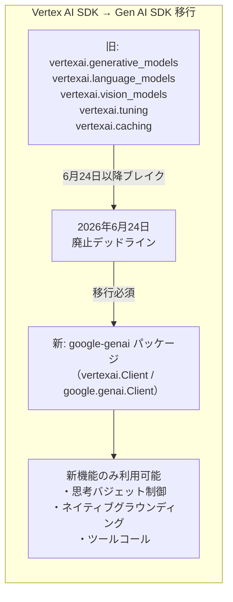
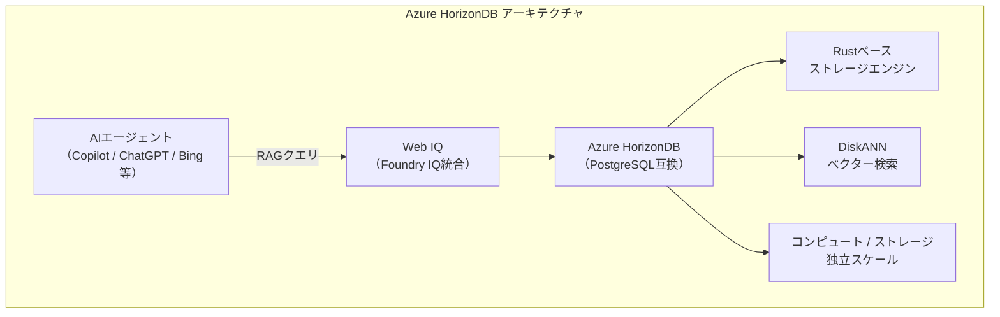
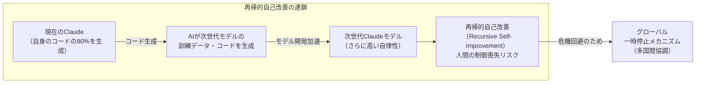
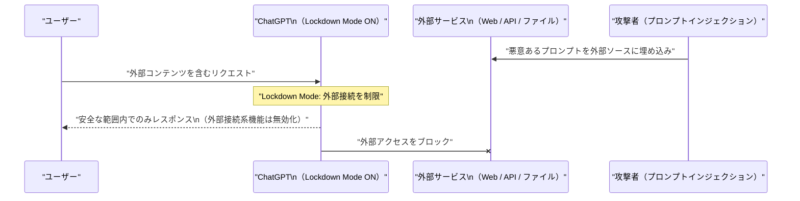
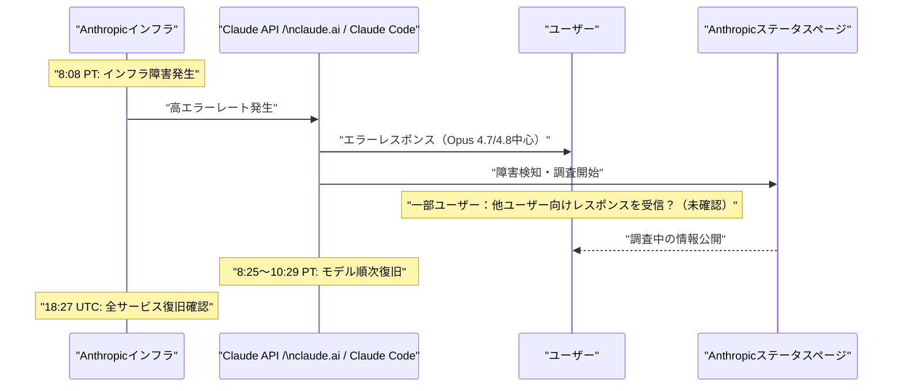

# LLM・AI Agent 最新情報レポート Vol.41

**作成日**: 2026年6月6日  
**対象期間**: 2026年6月5日〜2026年6月6日（Vol.40との差分）

---

## 目次

1. [Google Cloudアップデート](#1-google-cloudアップデート)
2. [Microsoft Azure AIアップデート](#2-microsoft-azure-aiアップデート)
3. [LLM Model / AI Agentアーキテクチャ・研究](#3-llm-model--ai-agentアーキテクチャ研究)
4. [公式ブログ・論文のリサーチ・要約](#4-公式ブログ論文のリサーチ要約)
   - [Google](#41-google)
   - [OpenAI](#42-openai)
   - [Anthropic](#43-anthropic)
5. [AI Agent搭載SaaS製品情報](#5-ai-agent搭載saas製品情報)
6. [LLM/AI Agentセキュリティインシデント](#6-llmai-agentセキュリティインシデント)
7. [その他特筆すべき情報](#7-その他特筆すべき情報)
8. [参考リンク](#8-参考リンク)

---

## 1. Google Cloudアップデート

### 1.1 Vertex AI SDK廃止：6月24日が移行デッドライン

Googleは **Vertex AI生成AIモジュール群を6月24日に削除** し、新しい **Google Gen AI SDK**（`google-genai`パッケージ）への完全移行を求めた。[[1]](#ref-1)[[2]](#ref-2)

**廃止対象のインポートパス：**

| 廃止モジュール | 代替 |
|---|---|
| `vertexai.generative_models` | `google.genai.Client` |
| `vertexai.language_models` | `google.genai.Client` |
| `vertexai.vision_models` | `google.genai.Client` |
| `vertexai.tuning` | Gen AI SDK チューニングAPI |
| `vertexai.caching` | Gen AI SDK コンテキストキャッシュAPI |

**移行の背景：**  
- Googleは2026年5月21日にVertex AIコンソールをGemini Enterprise Agent Platformコンソールに統合済み
- June 2026以降のVertex AI SDK新リリースではGeminiをサポートしない
- 新しいGen AI SDKは思考バジェット制御・ネイティブグラウンディング・ツールコールなどGemini固有機能に対応

> **影響範囲：** Python・Java・JavaScript・Go の各言語向けに公式移行ガイドが提供されている。

---

## 2. Microsoft Azure AIアップデート

### 2.1 Azure HorizonDB：AIエージェント向けPostgreSQL互換マネージドDB（パブリックプレビュー）

MicrosoftはBuild 2026（6月2日）で、**Azure HorizonDB** を発表し、パブリックプレビューの受付を開始した。PostgreSQL互換でありながら、AIエージェントのワークロードを想定してゼロから再設計された完全マネージドデータベース。[[3]](#ref-3)[[4]](#ref-4)[[5]](#ref-5)

**主な特徴：**

| 項目 | 内容 |
|---|---|
| **ストレージエンジン** | Rustベースの新設計ストレージエンジン |
| **アーキテクチャ** | 「database-as-logs」設計：コンピュートとストレージを独立スケール |
| **コミットレイテンシ** | サブミリ秒のマルチゾーンコミット |
| **ベクター検索** | DiskANN統合（エージェントのRAGワークロードに最適化） |
| **互換性** | PostgreSQL互換（既存ツール・ドライバーがそのまま動作） |
| **初期利用可能リージョン** | Australia East / Central US / Sweden Central / West US 2 / West US 3 |

**注目点 - Web IQとの統合：**  
HorizonDBは **Web IQ**（Microsoft Foundry IQの一部）のバックエンドとして稼働しており、Copilot・ChatGPT・Bing等のAIサービスがリアルタイムWebコンテンツを参照する際に使用されている。

---

## 3. LLM Model / AI Agentアーキテクチャ・研究

### 3.1 Anthropic「When AI Builds Itself」：再帰的自己改善への警戒とグローバル一時停止提案

Anthropicは6月4日、**「When AI Builds Itself（AIが自分自身を構築するとき）」** と題した研究報告を公開した。Claude AIが自社コードベースの80%以上を自律的に生成していることを開示し、AI開発の加速に対する深刻な懸念と、グローバルな一時停止メカニズムの必要性を訴えた。[[6]](#ref-6)[[7]](#ref-7)[[8]](#ref-8)

**主要なデータポイント（2026年5月時点）：**

| 指標 | 数値 | 比較 |
|---|---|---|
| **Claude自律生成コードの割合** | **80%以上**（本番マージ済み） | 2025年2月は低一桁%台 |
| **最難度タスクの成功率** | **76%** | 2025年11月比 +50ポイント |
| **エンジニア1人あたりコード出力** | **8倍/四半期** | 2021〜2025年平均比 |

**再帰的自己改善（Recursive Self-Improvement）のリスク：**

**グローバル一時停止提案の条件：**
- Anthropic単独での一時停止は競合優位を失うだけと認識
- **複数フロンティア企業・複数国が検証可能なルールの下で同時停止**する場合のみ有効
- Anthropic Instituteが検証システムの研究を担当（Marina Favaro所長・Jack Clark共著）

---

## 4. 公式ブログ・論文のリサーチ・要約

### 4.1 Google

新情報なし

---

### 4.2 OpenAI

#### 4.2.1 ChatGPT Lockdown Mode + Elevated Risk Labels：プロンプトインジェクション対策の強化（6月4〜5日）

OpenAIは **ChatGPT Lockdown Mode** と **Elevated Risk Labels** を発表し、6月4日よりパーソナルアカウント（Free・Go・Plus・Pro）およびセルフサービスChatGPT Businessアカウントへのロールアウトを開始した。[[9]](#ref-9)[[10]](#ref-10)[[11]](#ref-11)

**Lockdown Modeの概要：**

| 機能 | 内容 |
|---|---|
| **目的** | プロンプトインジェクション攻撃・データ外部流出のリスク軽減 |
| **対象** | 機密情報を扱うユーザー・高いセキュリティ要件を持つチーム |
| **設定方法** | Settings → Security → Lockdown Mode（個人） / Workspace設定（管理者） |
| **制限される機能** | ライブWeb閲覧・Deep Research・Agent Mode・Canvas networking・ライブコネクター・ファイルダウンロード・外部リンク経由の画像 |
| **提供対象** | 全ログインユーザー（Free〜Pro・Business） |

**Elevated Risk Labelsの概要：**
- ChatGPT・ChatGPT Atlas・Codex全体で既存機能に対して統一した「Elevated Risk」ラベルを表示
- 外部リンクのクリックや外部サービスへの接続など、潜在的にリスクのある操作前に警告を表示
- OpenAI独自のリスク区分の標準化が目的

#### 4.2.2 GPT-5.5-Cyber：EU展開（6月5日）

OpenAIは**6月5日**、サイバーセキュリティ特化モデル **GPT-5.5-Cyber** を欧州連合（EU）に展開した。EUサイバー行動計画の一環として、EU AI Office・ENISA（欧州ネットワーク情報セキュリティ機関）を含むEU機関・政府・認定セキュリティチームへのリミテッドプレビューアクセスを開始。[[12]](#ref-12)[[13]](#ref-13)

| 項目 | 内容 |
|---|---|
| **モデル** | GPT-5.5-Cyber（脆弱性検出・マルウェア解析・リバースエンジニアリング向けにチューニング） |
| **対象** | 重要インフラを担う認定セキュリティチーム・EU機関・政府 |
| **セキュリティ要件** | 2026年6月1日より上級アカウントセキュリティの有効化が必須 |
| **Anthropicとの競合** | 同日前後、AnthropicもClaude MythosのENISAアクセスを付与（Project Glasswing） |

#### 4.2.3 ChatGPT Ads Manager：英国展開とコンバージョン最適化（6月5〜6日）

OpenAIは**6月6日**、ChatGPT広告プラットフォームを**英国に展開**した。北米・オーストラリア・ニュージーランド以外への初の地理的拡張。[[14]](#ref-14)[[15]](#ref-15)

**直近のAds Manager動向：**

| 日付 | 内容 |
|---|---|
| **6月5日** | コンバージョン最適化キャンペーンのロールアウト開始（Pixel/Conversions API設定済み広告主が対象） |
| **6月6日** | 英国でChatGPT広告サービス開始（初の北米外展開） |
| **数週間以内** | 日本・韓国・ブラジル・メキシコへの展開予定 |

**プラットフォーム状況：**  
自社開設から6週間で広告収益$1億を達成。CPC/CPMビディング・最低出稿額なし・サードパーティ計測対応。

#### 4.2.4 OpenAI Codex：エンタープライズ向け拡張（ロール別プラグイン6種 + Sites）

OpenAIはCodexを純粋なコーディングツールからエンタープライズ向け業務プラットフォームへ拡張した。[[16]](#ref-16)[[17]](#ref-17)

**6つのロール別プラグイン：**

| プラグイン名 | 対象部門 | 連携ツール例 |
|---|---|---|
| **Data Analytics** | データ分析・BI | Snowflake / Databricks Genie / Hex / Tableau |
| **Creative Production** | マーケティング・クリエイティブ | Figma / Canva / Shutterstock / Fal |
| **Sales** | 営業 | CRM・セールスインテリジェンス系 |
| **Product Design** | プロダクト | - |
| **Public Equity Investing** | 投資（株式） | - |
| **Investment Banking** | 投資銀行業務 | - |

**Codex Sites（プレビュー）：**  
ビジネス/エンタープライズ顧客向けに、ダッシュボード・プランナー・プロジェクトボード・ギャラリー等のインタラクティブなWebアプリをURLで共有できる機能。

**ユーザー動向：**  
週次アクティブユーザーは500万人。このうち非開発者（金融アナリスト・マーケター・オペレーション担当等）が20%を占め、従来の開発者に比べて3倍速いペースで採用が拡大中。

---

### 4.3 Anthropic

#### 4.3.1 「When AI Builds Itself」詳細

→ アーキテクチャ・研究詳細は [Section 3.1](#31-anthropicwhen-ai-builds-itself再帰的自己改善への警戒とグローバル一時停止提案) 参照

**追加コンテキスト：**  
本報告はAnthropicのIPO S-1秘密提出（6月1日、Vol.40参照）の1週間後に公開されており、上場を控えたリスク開示の側面も有る。また、Claude Code が研究プレビューを開始した2025年2月時点から比較すると、自律コード生成比率は低一桁%台から80%超へ急伸した。

**Anthropic Instituteのスタンス：**
- AI開発加速はすでに始まっており、自己改善の閾値に急速に近づいている
- 「一時停止は全員でやらない限り意味がない」— 単独行動否定、多国間協調を要求
- 検証可能な多国間一時停止ルールの研究を自ら実施予定

#### 4.3.2 Claude Opus 4.8：自己疑念フラグ機能

早期テスターの報告によると、Opus 4.8はVol.40で報告した価格（Opus 4.7と同額）に加え、**モデルが自分自身の確信度に疑問を持った場合に能動的にフラグを立てる**動作が確認された。[[18]](#ref-18) 「確信のないまま断言する」ブラフを抑制する設計変更で、信頼性向上を狙う。

---

## 5. AI Agent搭載SaaS製品情報

### 5.1 Microsoft Surface Laptop Ultra：NVIDIA RTX Spark搭載第1号機

MicrosoftはComputex 2026（6月1日）で、**NVIDIA RTX Sparkスーパーチップを搭載した初のWindows PC** である **Surface Laptop Ultra** を発表した。Vol.40でチップ発表は既報だが、具体的な製品スペックが初めて公開された。[[19]](#ref-19)[[20]](#ref-20)

| 仕様 | 内容 |
|---|---|
| **チップ** | NVIDIA RTX Spark（NVIDIA × MediaTek共同開発） |
| **GPUコア数** | 6,144（Blackwell世代） |
| **CPUコア数** | 20（Arm） |
| **RAM** | 128GB |
| **ディスプレイ** | 15インチ MiniLED Ultra（最大2,000 nits HDR） |
| **AI性能** | 1 PFLOPS（1ペタフロップス） |
| **出荷時期** | 2026年秋予定 |

---

## 6. LLM/AI Agentセキュリティインシデント

### 6.1 Anthropic Claudeサービス障害：全プラットフォームで大規模停止、データリーク疑惑を調査中（6月5日）

**2026年6月5日（日本時間6日未明）**、AnthropicのAIプラットフォーム全体に大規模なサービス障害が発生した。複数モデルで高率のエラーが発生し、claude.ai・API（api.anthropic.com）・Claude Code・Claude Coworkのすべてのサービスが影響を受けた。[[21]](#ref-21)[[22]](#ref-22)[[23]](#ref-23)

**障害タイムライン（PT / UTC）：**

| 時刻（PT / UTC） | 出来事 |
|---|---|
| **8:08 PT / 15:08 UTC** | Anthropicステータスページが複数モデルのエラー急増を検出、調査開始 |
| **8:25 PT / 15:25 UTC** | Opus 4.6 復旧 |
| **9:23 PT / 16:23 UTC** | Sonnet 4.6 復旧 |
| **9:59 PT / 16:59 UTC** | Opus 4.8 復旧 |
| **10:12 PT / 17:12 UTC** | Opus 4.7 復旧 |
| **10:29 PT / 17:29 UTC** | Opus 4.5 復旧 |
| **18:27 UTC** | 全サービスの復旧を確認 |

**データリーク疑惑：**  
障害中にSNSで「Claudeが他ユーザー向けのレスポンスを返した」とのユーザー報告が拡散。Anthropicはインフラ起因の障害と説明しつつ、クロスユーザーデータ露出の可能性については「報告を深刻に受け止め、調査中」と発表した（調査時点では他の証拠・報告は確認されていないとコメント）。

---

## 7. その他特筆すべき情報

新情報なし

---

## 8. 参考リンク

**[1]** [Vertex AI SDK migration guide | Google Cloud Documentation](https://docs.cloud.google.com/vertex-ai/generative-ai/docs/deprecations/genai-vertexai-sdk)

**[2]** [Vertex AI SDK Removal Deadline Is 28 Days Away: What It Means for Teams Routing to Google — TheRouter.ai](https://therouter.ai/news/vertex-ai-sdk-migration-gemini-enterprise-agent-platform/)

**[3]** [Azure HorizonDB: Enterprise-Ready Postgres, Engineered for the AI Era | Microsoft Community Hub](https://techcommunity.microsoft.com/blog/adforpostgresql/azure-horizondb-enterprise-ready-postgres-engineered-for-the-ai-era/4524094)

**[4]** [Azure HorizonDB Enters Public Preview: Web IQ Already Powers Copilot and ChatGPT — TechTimes](https://www.techtimes.com/articles/317698/20260603/azure-horizondb-enters-public-preview-web-iq-already-powers-copilot-chatgpt.htm)

**[5]** [Microsoft Build 2026: Building agentic apps with Microsoft Fabric and Microsoft Databases | Microsoft Azure Blog](https://azure.microsoft.com/en-us/blog/microsoft-build-2026-building-agentic-apps-with-microsoft-fabric-and-microsoft-databases/)

**[6]** [When AI builds itself | Anthropic Institute](https://www.anthropic.com/institute/recursive-self-improvement)

**[7]** [Anthropic warns Claude AI is building itself faster than expected — Tom's Hardware](https://www.tomshardware.com/tech-industry/artificial-intelligence/anthropic-says-claude-now-writes-more-than-80-percent-of-its-merged-code)

**[8]** [Anthropic says 80% of its new production code is now authored by Claude — VentureBeat](https://venturebeat.com/technology/anthropic-says-80-of-its-new-production-code-is-now-authored-by-claude-how-your-enterprise-can-keep-up)

**[9]** [Introducing Lockdown Mode and Elevated Risk labels in ChatGPT | OpenAI](https://openai.com/index/introducing-lockdown-mode-and-elevated-risk-labels-in-chatgpt/)

**[10]** [OpenAI rolls out a Lockdown Mode for extra protection against prompt injection attacks — Engadget](https://www.engadget.com/2188537/openai-rolls-out-a-lockdown-mode-for-extra-protection-against-prompt-injection-attacks/)

**[11]** [OpenAI Adds 'Lockdown Mode' to ChatGPT — TechTimes](https://www.techtimes.com/articles/317885/20260606/openai-adds-lockdown-mode-chatgpt-bring-more-protection-against-prompt-injections-attacks.htm)

**[12]** [Scaling Trusted Access for Cyber with GPT-5.5 and GPT-5.5-Cyber | OpenAI](https://openai.com/index/gpt-5-5-with-trusted-access-for-cyber/)

**[13]** [OpenAI GPT-5.5-Cyber Reaches EU: Anthropic Mythos Opens to ENISA Days Later — TechTimes](https://www.techtimes.com/articles/317891/20260605/openai-gpt-55-cyber-reaches-eu-anthropic-mythos-opens-enisa-days-later.htm)

**[14]** [ChatGPT ads go live in the UK as OpenAI expands pilot beyond US — ppc.land](https://ppc.land/chatgpt-ads-go-live-in-the-uk-as-openai-expands-pilot-beyond-us/)

**[15]** [OpenAI's ChatGPT ads are getting conversion optimization — ppc.land](https://ppc.land/openais-chatgpt-ads-are-getting-conversion-optimization-heres-what-changes/)

**[16]** [Codex for every role, tool, and workflow | OpenAI](https://openai.com/index/codex-for-every-role-tool-workflow/)

**[17]** [OpenAI's Codex update lets agents build interactive enterprise workspaces via Sites and role-specific plugins — VentureBeat](https://venturebeat.com/orchestration/openais-codex-update-lets-agents-build-interactive-enterprise-workspaces-via-sites-and-role-specific-plugins)

**[18]** [AI News Today – June 5, 2026: 9 Biggest Stories — BuildFastWithAI](https://www.buildfastwithai.com/blogs/ai-news-today-june-5-2026)

**[19]** [Surface Laptop Ultra: Microsoft and NVIDIA reveal the 128GB RAM, mini-LED, RTX Spark powerhouse — Windows Central](https://www.windowscentral.com/hardware/surface/microsoft-surface-laptop-ultra-announced-computex-2026)

**[20]** [Microsoft Surface Laptop Ultra wields Nvidia's RTX Spark superchip with 128GB of RAM — Tom's Hardware](https://www.tomshardware.com/laptops/microsoft-surface-laptop-ultra-weilds-nvidias-rtx-spark-superchip-with-128gb-of-ram-20-arm-cpu-cores-and-a-blackwell-gpu-15-inch-mini-led-pixelsense-ultra-display-rounds-out-the-powerful-package)

**[21]** [Anthropic's Claude Services Down — claude.ai, Claude Code, and Cowork Affected — CyberSecurityNews](https://cybersecuritynews.com/anthropics-claude-services-down/)

**[22]** [Anthropic probes customer data leak claims after Friday Claude outage — CyberNews](https://cybernews.com/ai-news/claude-outage-resolved-anthropic-opus-model-errors/)

**[23]** [Claude is down for many — here's what we know about the outage — TechRadar](https://www.techradar.com/news/live/claude-outage-june-2026)
