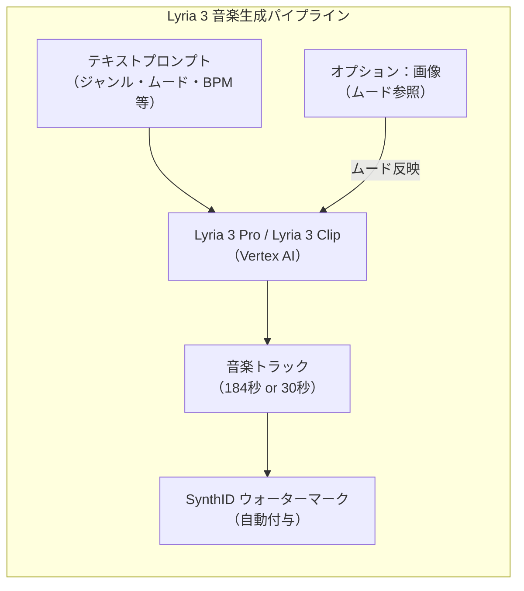
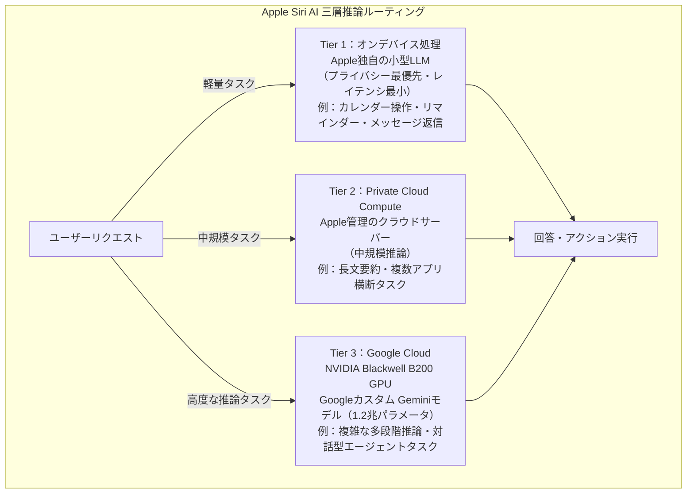
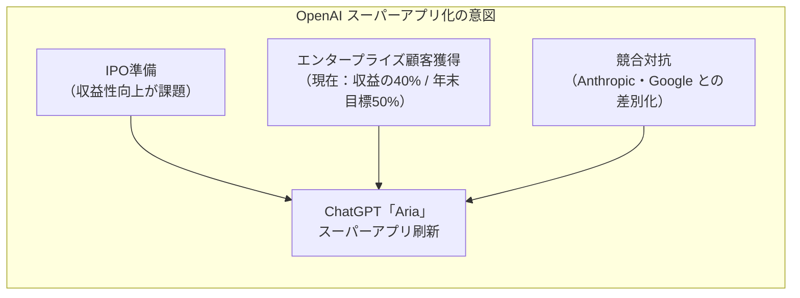
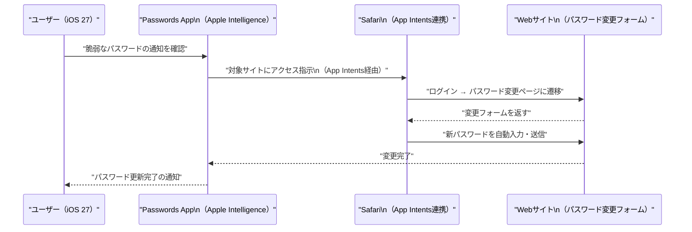
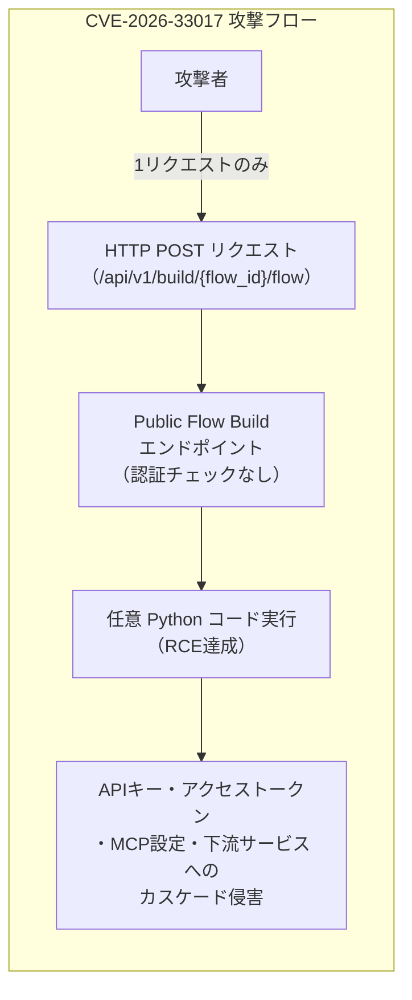
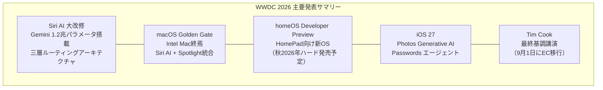

# LLM・AI Agent 最新情報レポート Vol.43

**作成日**: 2026年6月8日  
**対象期間**: 2026年6月7日〜2026年6月8日（Vol.42との差分）

---

## 目次

1. [Google Cloudアップデート](#1-google-cloudアップデート)
2. [Microsoft Azure AIアップデート](#2-microsoft-azure-aiアップデート)
3. [LLM Model / AI Agentアーキテクチャ・研究](#3-llm-model--ai-agentアーキテクチャ研究)
4. [公式ブログ・論文のリサーチ・要約](#4-公式ブログ論文のリサーチ要約)
   - [Google](#41-google)
   - [OpenAI](#42-openai)
   - [Anthropic](#43-anthropic)
5. [AI Agent搭載SaaS製品情報](#5-ai-agent搭載saas製品情報)
6. [LLM/AI Agentセキュリティインシデント](#6-llmai-agentセキュリティインシデント)
7. [その他特筆すべき情報](#7-その他特筆すべき情報)
8. [参考リンク](#8-参考リンク)

---

## 1. Google Cloudアップデート

### 1.1 Gemini Enterprise App：Gemini 3.5 Flash が6月8日より強制適用・トグル廃止

6月8日付けで、**Gemini Enterprise App** における Gemini 3.5 Flash のフィーチャー管理トグルが廃止された。Gemini 3.5 Flash はデフォルト有効化となり、管理者であっても無効化できなくなった。[[1]](#ref-1)

| 項目 | 内容 |
|---|---|
| **対象サービス** | Gemini Enterprise App |
| **変更内容** | Gemini 3.5 Flash のオン/オフ管理トグルを廃止 |
| **適用地域** | Global / US / EU マルチリージョン |
| **影響範囲** | Gemini Enterprise ライセンスを保有する全組織 |

> **背景：** これまで管理者はオプトイン/オプトアウトで Gemini 3.5 Flash を制御できたが、6月8日以降は常時有効の標準モデルとして運用される。エンタープライズ環境でのモデルバージョン固定ポリシーを採用していた組織には影響が出る可能性がある。

### 1.2 Google Lyria 3 / Lyria 3 Pro：Vertex AI でパブリックプレビュー

Googleの音楽生成AI **Lyria 3** および **Lyria 3 Pro** が Vertex AI でパブリックプレビューとして提供開始された。[[2]](#ref-2)[[3]](#ref-3)

**モデル仕様：**

| モデル | 生成長 | 特徴 |
|---|---|---|
| **Lyria 3 Pro** | 最大 **184秒**（約3分） | スタジオクオリティ。ボーカル・バース・コーラス構造を保持 |
| **Lyria 3 Clip** | **30秒** | 高速生成。高ボリュームリクエスト向けに最適化 |

**主要機能：**
- テキストプロンプトからの音楽生成（ジャンル・ムード・スタイル指定）
- **マルチモーダル入力**：画像を与えることでムード・雰囲気を音楽に反映
- **SynthID ウォーターマーク**：全生成トラックに不可視の透かしを自動付与

**利用可能サービス：**
Vertex AI / Google AI Studio / Gemini API / Google Vids / Gemini App / ProducerAI

---

## 2. Microsoft Azure AIアップデート

新情報なし（Microsoft Build 2026 関連の情報は Vol.37〜42 にてカバー済み）

---

## 3. LLM Model / AI Agentアーキテクチャ・研究

### 3.1 Apple Siri AI の三層推論ルーティングアーキテクチャ（WWDC 2026 公開）

WWDC 2026 基調講演（6月8日）において、**Gemini搭載の新Siri AI** の推論アーキテクチャが詳細に公開された。処理の複雑度に応じて3段階のルーティングを行うハイブリッド構成を採用している。[[4]](#ref-4)[[5]](#ref-5)

| ティア | 処理場所 | 対象タスク | プライバシーレベル |
|---|---|---|---|
| **Tier 1** | オンデバイス（Apple独自モデル） | 簡易コマンド・ローカルアプリ操作 | 最高（データ外部送信なし） |
| **Tier 2** | Private Cloud Compute | 中規模推論・複数アプリ連携 | 高（Apple管理サーバー） |
| **Tier 3** | Google Cloud（Blackwell B200） | 複雑な多段階推論・長文 | 標準（Google Cloud利用） |

> **アーキテクチャ的示唆：** エッジ〜クラウドの複数推論層をプライバシー要件・レイテンシ要件・タスク複雑度で動的ルーティングするデザインパターンは、今後のオンデバイスLLM統合の参考アーキテクチャとなりうる。

---

## 4. 公式ブログ・論文のリサーチ・要約

### 4.1 Google

新情報なし

---

### 4.2 OpenAI

#### 4.2.1 ChatGPT「スーパーアプリ」大規模刷新（Aria）：6月9日 GA 予定

6月7日、Financial Timesが **OpenAI による ChatGPT の過去最大の刷新計画** を報道した。内部コードネーム **「Aria」** として開発されており、ChatGPT を単一会話インターフェースから総合型「スーパーアプリ」へと進化させる。[[6]](#ref-6)[[7]](#ref-7)[[8]](#ref-8)

**主な変更内容：**

| 機能 | 内容 |
|---|---|
| **AIエージェント統合** | 質問に答えるだけでなく、ユーザーに代わってアクションを実行するエージェントを内蔵 |
| **Codex 統合** | コーディングツール Codex を ChatGPT UI に直接統合。開発者以外（PM・法務・データ分析担当等）も利用可能に |
| **画像生成統合** | 会話内でインラインに画像生成が可能 |
| **サードパーティ連携** | Canva・Booking.com・Expedia・Figma・Spotify・Coursera・Zillow 等がローンチパートナー |
| **対象ユーザー** | 週間アクティブユーザー **9億人** に影響 |

**戦略的背景：**

> **注意事項：** Reuters は FT 報道の即時確認ができないとした。なお開発者ドキュメントが誤って公開リポジトリに push されており、**6月9日 GA** が示唆されている。

---

### 4.3 Anthropic

新情報なし（Vol.42 にてカバー済み）

---

## 5. AI Agent搭載SaaS製品情報

### 5.1 iOS 27 Passwords App：Apple Intelligence によるエージェント動作でパスワード自動更新

WWDC 2026（6月8日）にて、iOS 27 に搭載される **Passwords アプリ** が Apple Intelligence を用いて**エージェント的に動作する**ことが発表された。[[4]](#ref-4)[[9]](#ref-9)

**主な機能：**

| 機能 | 内容 |
|---|---|
| **自動パスワード変更** | 脆弱・漏洩パスワードを検知し、Safari と Apple Intelligence を連携して各サイトで**自動更新** |
| **クロスサイト実行** | 複数 Web サイトにまたがってログイン・パスワード変更フォームに自律的にアクセス |
| **エージェント実行** | ユーザーの代理でサイトに接続し、パスワード変更フローを自動実行 |

> これは Apple が「エージェント的AI」を一般ユーザー向けのセキュリティ用途で採用した最初の公式実装例となる。

---

## 6. LLM/AI Agentセキュリティインシデント

### 6.1 Langflow CVE-2026-33017：公開20時間以内に野生でRCE悪用

AI ワークフロープラットフォーム **Langflow** に発見された **CVE-2026-33017**（CVSS: 9.3）が、脆弱性情報の公開から**わずか20時間以内**に野生で悪用されたことが判明した。[[10]](#ref-10)[[11]](#ref-11)

| 項目 | 内容 |
|---|---|
| **CVE番号** | CVE-2026-33017 |
| **脆弱性種別** | 認証不要のリモートコード実行（RCE） |
| **攻撃手法** | Public Flow Build エンドポイントへの単一 HTTP リクエストで任意 Python コード実行 |
| **公開から悪用まで** | **20時間** |
| **影響範囲** | 認証なしで公開されている全 Langflow インスタンス |
| **必要な認証** | **不要**（無認証攻撃） |

### 6.2 Langflow CVE-2026-21445：CISA KEVに追加・イランAPT MuddyWater が悪用

**CVE-2026-21445**（認証バイパス・CVSS: Critical）が CISA の **Known Exploited Vulnerabilities (KEV) カタログ** に追加された。さらに、イランの国家支援型 APT グループ **MuddyWater** による初期アクセス手段として積極的に悪用されていることが確認された。[[12]](#ref-12)[[13]](#ref-13)[[14]](#ref-14)

| 項目 | 内容 |
|---|---|
| **CVE番号** | CVE-2026-21445 |
| **脆弱性種別** | 認証バイパス（Missing Authentication） |
| **影響バージョン** | Langflow 1.7.0.dev45 未満の全バージョン |
| **悪用確認** | CISA KEV カタログ掲載（連邦機関向け修正期限：6月4日） |
| **攻撃者** | **MuddyWater**（イラン国家支援 APT） |
| **攻撃の狙い** | Langflow ワークスペース内の APIキー・クレデンシャルの窃取 |

> **影響の連鎖：** Langflow に統合された外部サービス（OpenAI API・Slack・Salesforce 等）のクレデンシャルが一括で盗まれ、下流サービスへのカスケード侵害が発生しうる。AI ワークフロープラットフォームが攻撃インフラへの入口となる新たなリスクモデルを示している。

---

## 7. その他特筆すべき情報

### 7.1 Apple WWDC 2026 基調講演（6月8日）：Siri の Gemini 刷新・macOS Golden Gate・homeOS・Tim Cook 最終基調講演

**6月8日（月）** に開幕した **Apple WWDC 2026** の基調講演で、以下の主要事項が発表された。[[4]](#ref-4)[[5]](#ref-5)[[15]](#ref-15)[[16]](#ref-16)

#### OS アップデート

| OS | バージョン | 主な変更 |
|---|---|---|
| **iOS 27** | iOS 27 | Siri AI 大改修、Photos にGenerative AI（Extend・Enhance・Reframe）、Passwords エージェント化 |
| **macOS** | **Golden Gate** | Intel Mac サポート終了、Siri AI の Spotlight 統合、スクリーン認識タスク実行 |
| **iPadOS 27** | iPadOS 27 | iOS 27 に準拠 |
| **homeOS** | Developer Preview | HomePad 用の新OS（初のvisionOS以来の新カテゴリOS） |
| **watchOS / tvOS / visionOS** | 各27系 | Apple Intelligence 機能の各デバイスへの拡張 |

#### homeOS と HomePad（秋2026年発売予定）

Apple は **homeOS** の開発者プレビューを公開した。homeOS は HomePad（スマートホームハブ）向けの新 OS で、2023年の visionOS 以来初の新 OS カテゴリとなる。

| 項目 | 内容 |
|---|---|
| **ハードウェア** | HomePad（7インチディスプレイ・A18チップ・8GB以上RAM・Face ID・超広角カメラ） |
| **発売時期** | 秋2026年（ハードウェア未発売、今回はソフトウェアDeveloper Preview） |
| **デザイン** | Apple Watch + iPhone StandBy モードを融合したUI |
| **接近検知** | 近接センサーで人の接近を検知、表示内容を自動調整 |
| **FaceTime** | iPhone なしで独立して FaceTime 通話が可能 |
| **Face ID** | プロファイル切替に利用、家族・複数ユーザー対応 |

#### 特記事項：Tim Cook の最終基調講演

Tim Cook CEO が **9月1日付けで Executive Chairman（代表取締役会長）に移行**することを発表。本 WWDC 2026 が Tim Cook 最後の CEO 基調講演となった。後継 CEO については未発表。

> **EU 向け注記：** Siri AI は iOS 27 / iPadOS 27 のリリース時点では EU では利用不可（規制上の理由による）。

---

## 8. 参考リンク

**[1]** [Gemini Enterprise Agent Platform release notes | Google Cloud Documentation](https://docs.cloud.google.com/gemini-enterprise-agent-platform/release-notes)

**[2]** [Lyria 3 and Lyria 3 Pro on Vertex AI | Google Cloud Blog](https://cloud.google.com/blog/products/ai-machine-learning/lyria-3-and-lyria-3-pro-on-vertex-ai)

**[3]** [Build with Lyria 3, our newest music generation model | Google Blog](https://blog.google/innovation-and-ai/technology/developers-tools/lyria-3-developers/)

**[4]** [Apple WWDC 2026: Siri Rebuilt on Gemini, homeOS Previewed in Cook Farewell Keynote | TechTimes](https://www.techtimes.com/articles/317985/20260608/apple-wwdc-2026-siri-rebuilt-gemini-homeos-previewed-cook-farewell-keynote.htm)

**[5]** [Apple WWDC 2026 as it happened: Siri AI, iOS 27, macOS Golden Gate, and everything announced at Apple Park | TechRadar](https://www.techradar.com/news/live/apple-wwdc-2026-live)

**[6]** [OpenAI plans biggest ChatGPT overhaul into an AI 'superapp' | ResultSense](https://www.resultsense.com/news/2026-06-08-openai-chatgpt-superapp-overhaul/)

**[7]** [ChatGPT Superapp Redesign: Agents, Coding, Images, and Automation Coming in June 2026 | Windows News](https://windowsnews.ai/article/chatgpt-superapp-redesign-agents-coding-images-and-automation-coming-in-june-2026.423520)

**[8]** [OpenAI plans largest ChatGPT revamp since launch, aiming for 'superapp' status | CryptoBriefing](https://cryptobriefing.com/openai-chatgpt-superapp-revamp/)

**[9]** [WWDC 2026: Everything announced on Siri AI, iOS 27, Apple Intelligence and more | TechCrunch](https://techcrunch.com/2026/06/08/wwdc-2026-everything-announced-on-siri-ai-os-27-apple-intelligence-and-more/)

**[10]** [CVE-2026-33017: How attackers compromised Langflow AI pipelines in 20 hours | Sysdig](https://www.sysdig.com/blog/cve-2026-33017-how-attackers-compromised-langflow-ai-pipelines-in-20-hours)

**[11]** [Critical Langflow Vulnerability Exploited Hours After Public Disclosure | SecurityWeek](https://www.securityweek.com/critical-langflow-vulnerability-exploited-hours-after-public-disclosure/)

**[12]** [CVE-2026-21445: Langflow Authentication Bypass Under Active Exploitation | CrowdSec](https://www.crowdsec.net/vulntracking-report/cve-2026-21445-langflow-authentication-bypass-exploitation)

**[13]** [CISA Adds Exploited Langflow and Trend Micro Apex One Vulnerabilities to KEV | The Hacker News](https://thehackernews.com/2026/05/cisa-adds-exploited-langflow-and-trend.html)

**[14]** [CISA Warns Langflow AI Agent Platform Actively Exploited — Hackers Built Exploits in 20 Hours | OpenClawAI](https://openclawai.io/blog/langflow-cve-2026-33017-cisa-ai-agent-pipeline-exploit)

**[15]** [Apple homeOS Developer Preview: Build for HomePad Before It Ships | byteiota](https://byteiota.com/apple-homeos-developer-preview-build-for-homepad-before-it-ships/)

**[16]** [WWDC 2026: Apple makes its big Siri AI reveal, changes Liquid Glass and more | CNBC](https://www.cnbc.com/2026/06/08/apple-wwdc-2026-live-updates.html)
