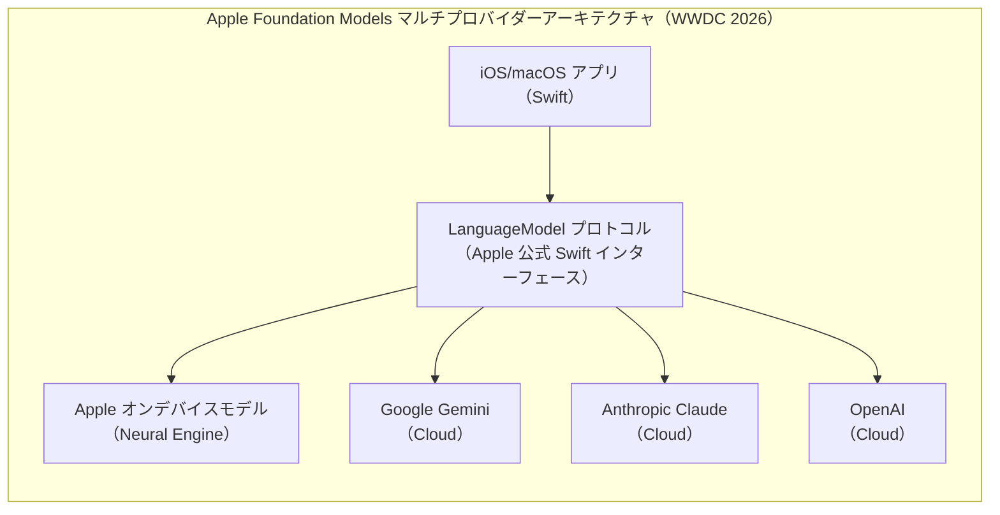
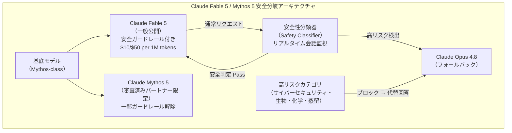
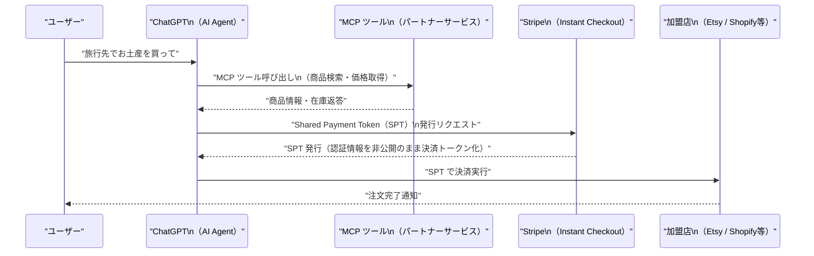
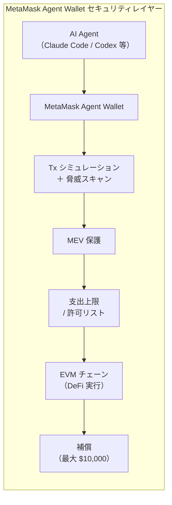
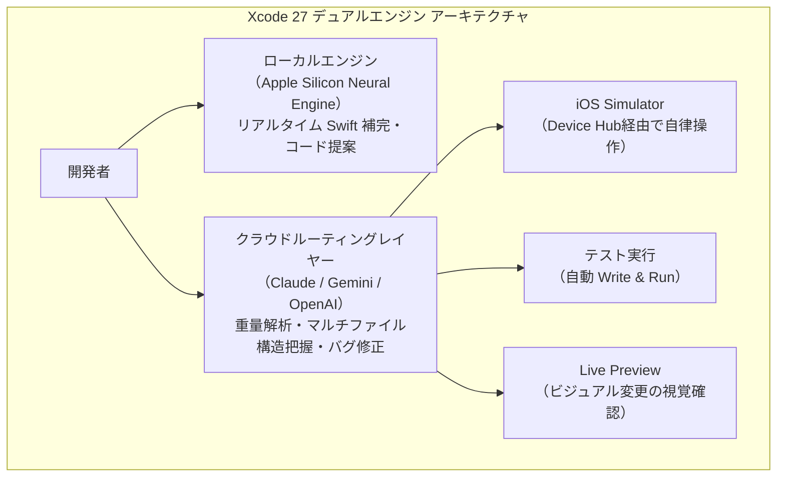
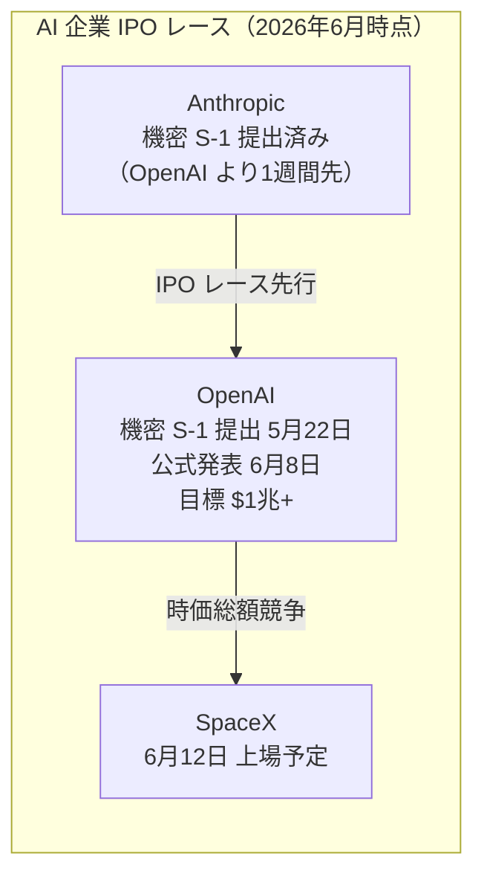

# LLM・AI Agent 最新情報レポート Vol.44

**作成日**: 2026年6月9日  
**対象期間**: 2026年6月8日〜2026年6月9日（Vol.43との差分）

---

## 目次

1. [Google Cloudアップデート](#1-google-cloudアップデート)
2. [Microsoft Azure AIアップデート](#2-microsoft-azure-aiアップデート)
3. [LLM Model / AI Agentアーキテクチャ・研究](#3-llm-model--ai-agentアーキテクチャ研究)
4. [公式ブログ・論文のリサーチ・要約](#4-公式ブログ論文のリサーチ要約)
   - [Google](#41-google)
   - [OpenAI](#42-openai)
   - [Anthropic](#43-anthropic)
5. [AI Agent搭載SaaS製品情報](#5-ai-agent搭載saas製品情報)
6. [LLM/AI Agentセキュリティインシデント](#6-llmai-agentセキュリティインシデント)
7. [その他特筆すべき情報](#7-その他特筆すべき情報)
8. [参考リンク](#8-参考リンク)

---

## 1. Google Cloudアップデート

### 1.1 Gemini 3.1 Flash-Lite・Gemini 3.1 Flash Image：Vertex AI でパブリックプレビュー開始

Vertex AI の最新リリースノートとして、新たに2モデルがパブリックプレビューに追加された。[[1]](#ref-1)

| モデル | ステータス | 特徴 |
|---|---|---|
| **Gemini 3.1 Flash-Lite** | Public Preview | Gemini 3.1系で最もコスト効率に優れた低レイテンシモデル。高ボリューム・コスト重視のLLMトラフィックに最適化 |
| **Gemini 3.1 Flash Image** | Public Preview | 高品質な画像生成が可能。改善された価格・レイテンシを提供 |

> **位置づけ：** Gemini 3.1 Pro（Preview）と合わせ、Gemini 3.1ファミリーがVertex AIで揃いつつある。Gemini 3.5 Flash（GA）より下のティアを担うコスト最適化モデルとして、エッジ・組み込み用途での活用が期待される。

### 1.2 Google、Apple WWDC 2026 でXcode 27へ Gemini を統合

WWDC 2026 の Platforms State of the Union（6月9日）において、Googleは **Apple の Foundation Models フレームワーク** に Gemini モデルを統合することを発表した。[[2]](#ref-2)[[3]](#ref-3)

**主な仕組み：**

- Apple の `LanguageModel` プロトコルを Google・Anthropic・OpenAI が実装し、同一の Swift API 経由で複数プロバイダーに切り替え可能
- Xcode 27 には Gemini への Cloud ルーティングが標準搭載
- **Swift Package Manager** の依存を更新するだけでプロバイダーを切り替え可能（アプリロジックの変更不要）

---

## 2. Microsoft Azure AIアップデート

新情報なし（Microsoft Build 2026 関連の情報は Vol.37〜42 にてカバー済み。6月8〜9日付けの固有の新機能発表なし）

---

## 3. LLM Model / AI Agentアーキテクチャ・研究

### 3.1 Claude Fable 5 / Mythos 5：「安全分岐モデル」アーキテクチャ

6月9日にAnthropicが発表した **Claude Fable 5** と **Claude Mythos 5** は、1つのモデルから **安全性要件に応じて2つの製品を分岐させる新アーキテクチャ** を採用している。[[4]](#ref-4)[[5]](#ref-5)[[6]](#ref-6)

**モデルスペック：**

| 項目 | Claude Fable 5 | Claude Mythos 5 |
|---|---|---|
| **コンテキストウィンドウ** | 1M トークン | 1M トークン |
| **最大出力** | 128k トークン/リクエスト | 128k トークン/リクエスト |
| **API 価格** | $10 / 1M input・$50 / 1M output | $10 / 1M input・$50 / 1M output |
| **バッチ価格** | $5 / 1M input・$25 / 1M output | $5 / 1M input・$25 / 1M output |
| **対象ユーザー** | 一般公開 | 審査済みパートナーのみ |
| **無料提供期間** | 〜6月22日（Pro/Max/Team/Enterprise含む） | - |

**主要ベンチマーク（Fable 5）：**

| ベンチマーク | スコア | 比較 |
|---|---|---|
| **SWE-bench Verified** | **95.0%** | 業界最高水準 |
| **SWE-bench Pro**（E2E GitHub Issue解決） | **80.3%** | GPT-5.5 の 58.6% を大幅上回る |
| **CursorBench**（max effort） | **72.9%** | — |
| **FrontierCode** | **#1**（Diamond・Main 両部門） | — |

> **アーキテクチャ的示唆：** 「1モデル・2製品」の安全分岐アプローチは、フロンティアモデルのリスク管理における新設計パターンを示す。高リスク判定時にフォールバックモデルが透過的に応答するため、ユーザー体験を損なわずにリスク低減を実現している。

### 3.2 Apple Foundation Models：マルチプロバイダーオープンプロトコルアーキテクチャ

WWDC 2026 にて Apple が発表した **Foundation Models フレームワーク（v2）** は、オンデバイスとクラウド LLM をプロトコルレベルで統一する設計を採用している。[[3]](#ref-3)[[7]](#ref-7)

**新機能：**

| 機能 | 内容 |
|---|---|
| **マルチモーダル入力** | 画像 + テキストの同時プロンプト。OCR・バーコード読取を Vision framework からモデルが直接呼び出し可能 |
| **Python SDK** | Foundation Models をデータサイエンス・ML研究者向けに Python から利用可能。Linux サーバーでも動作 |
| **Private Cloud Compute 無料枠** | 年間アプリストアDL 200万未満の開発者に無料で提供 |
| **オープンソース化** | Framework utilities パッケージを OSS として公開 |

---

## 4. 公式ブログ・論文のリサーチ・要約

### 4.1 Google

#### 4.1.1 Google、Apple 開発者向け Gemini 統合ブログを公開

Googleは「Bringing the latest Gemini models to Apple developers」と題したブログ記事を公開し、Xcode 27・Foundation Models フレームワーク経由での Gemini 統合について詳細を説明した。[[2]](#ref-2)

- `gemini-3.5-flash` をデフォルトのクラウドルーティング先として設定
- **Deep Think** モード（多段階推論）をXcode 27 の重量解析タスクで利用可能

---

### 4.2 OpenAI

#### 4.2.1 OpenAI、Stripe と共同で「Agentic Commerce Protocol（ACP）」を発表

OpenAI は「Buy it in ChatGPT」と題した公式ブログを6月8日に公開し、**Stripe と共同開発したオープンスタンダード「Agentic Commerce Protocol（ACP）」** と、ChatGPT への **Instant Checkout** 機能統合を発表した。[[8]](#ref-8)[[9]](#ref-9)[[10]](#ref-10)

**ACPの仕組み：**

| 要素 | 内容 |
|---|---|
| **ACP** | MCP をベースとしたオープン決済インタラクションスタンダード。OpenAI と Stripe が共同仕様策定、Apache 2.0 |
| **Shared Payment Token（SPT）** | ユーザーの決済認証情報を露出せずに AI エージェントが決済を実行するための新トークンプリミティブ |
| **対応加盟店（ローンチ時）** | Etsy（即時）、Shopify（近日対応） |
| **対象ユーザー** | 米国内 ChatGPT ユーザー |

> **戦略的意義：** AI エージェントが人間に代わって購買決定・決済を完結する「エージェント型コマース」の技術標準を OpenAI が先行して押さえる動き。

---

### 4.3 Anthropic

#### 4.3.1 Claude Fable 5・Mythos 5 リリースブログ

Anthropic は「Claude Fable 5 and Claude Mythos 5」と題した公式ブログを6月9日に公開した。[[4]](#ref-4)

主要な公式コメント：
- *「Fable 5 の能力は、これまで一般公開してきたどのモデルをも超えている」*（Anthropic 公式）
- 外部バグバウンティ（1,000時間超のテスト）でユニバーサルジェイルブレイクは発見されなかった
- 外部レッドチーム組織もユニバーサルジェイルブレイクを確認できなかった

#### 4.3.2 Claude、Apple Foundation Models フレームワークに対応

Anthropicは「Claude support for Apple's Foundation Models framework」ブログを公開し、iOS 27・iPadOS 27・macOS 27・visionOS 27・watchOS 27 向けの **Swift パッケージ**（`claude-foundation-models`）をリリースした。[[11]](#ref-11)[[12]](#ref-12)

**主な機能：**

| 機能 | 内容 |
|---|---|
| **@Generable 型安全引き渡し** | Apple オンデバイスモデルの `@Generable` 型出力をそのまま Claude API に渡せる |
| **マルチステップ推論** | Apple オンデバイスモデルが複雑リクエストを検知 → Claude に自動ルーティング |
| **コード生成・Web検索** | Claude による Web 検索とコード実行が Foundation Models フレームワーク内から利用可能 |
| **ストリーミング対応** | SwiftUI ビューへのストリーミングレスポンス対応 |

---

## 5. AI Agent搭載SaaS製品情報

### 5.1 MetaMask Agent Wallet：AI エージェントによる DeFi 取引を解放

Consensysが提供するウォレット **MetaMask** が、AI エージェント専用ウォレット **MetaMask Agent Wallet** の早期アクセスプログラムを6月8日に開始した。[[13]](#ref-13)[[14]](#ref-14)

**概要：**

| 項目 | 内容 |
|---|---|
| **提供開始** | 2026年6月8日（Early Access：200名のトレーダー・開発者を対象） |
| **一般公開** | 2026年夏（予定） |
| **対応チェーン** | 全 EVM チェーン（Ethereum・L2等） |
| **対応 DeFi** | 主要 DeFi プリミティブ（DEX・レンディング・流動性プールなど） |

**セキュリティ機能：**

- **トランザクションシミュレーション**：実行前に全取引を仮実行してリスクを確認
- **脅威スキャン**：悪意あるコントラクトを自動検出
- **MEV 保護**：フロントランニング・サンドイッチ攻撃を防御
- **支出上限 / プロトコル許可リスト**：エージェントが実行できる取引の範囲をユーザーが制限
- **リスク取引の 2FA**：高リスク取引はユーザー確認を必須化
- **MetaMask 取引保護**：安全と判定された取引は最大 **$10,000** の補償

**対応エージェント環境：**

OpenClaw・OpenAI Codex・Claude Code・Nous Research Hermes Agent・Cursor 等

### 5.2 Xcode 27：デュアルエンジン型エージェントコーディングシステム

WWDC 2026 で発表された **Xcode 27** は、AI コーディング支援を大幅に強化した。[[3]](#ref-3)[[7]](#ref-7)

| 機能 | 内容 |
|---|---|
| **ローカルエンジン** | Apple Silicon Neural Engine でリアルタイム Swift 提案。オフライン動作 |
| **クラウドルーティング** | Claude / Gemini / OpenAI を選択可能。複雑な構造解析・マルチファイル修正に使用 |
| **エージェントコーディング** | アプリ全体のシミュレート・テスト記述・実行・Live Preview での視覚確認を自律実行 |
| **Device Hub** | iOS Simulator を外部から自律操作するための新 API |

---

## 6. LLM/AI Agentセキュリティインシデント

新情報なし（6月8〜9日付けで新規公開された固有のインシデント・CVEは確認されず）

---

## 7. その他特筆すべき情報

### 7.1 OpenAI、IPO に向けた S-1 機密提出を公式発表

OpenAI は6月8日、**SEC（米証券取引委員会）への機密 S-1 提出**を公式ブログで発表した。IPO に向けた最初の公式ステップとなる。[[15]](#ref-15)[[16]](#ref-16)[[17]](#ref-17)

| 項目 | 内容 |
|---|---|
| **S-1 機密提出日** | 2026年5月22日（SEC へ機密提出） |
| **公式発表日** | **2026年6月8日**（「情報漏洩が見込まれるため先に発表する」とコメント） |
| **最新バリュエーション** | **852億ドル**（2026年3月の資金調達ラウンド、シリーズ過去最大の $1,220億調達） |
| **IPO 目標バリュエーション** | アナリスト推計 **$1兆超え**（テック IPO 史上最大規模の可能性） |
| **目標上場時期** | 2026年9月（未確定）|
| **主幹事** | Goldman Sachs・Morgan Stanley（Citigroup・JPMorgan との協議中） |
| **月次売上** | 約 $20億（ただし $1 売上につき $1.22 の損失） |

**CEO Sam Altman の発言：**
> *「IPO の申請は上場準備が整ったこととは異なる。まだ非公開のほうがやりやすいことがある。」*

**競合との比較：**

> **注目点：** Anthropic が先週 S-1 を提出したことを受け、OpenAI も追随する形で発表。AI 主要企業の上場ラッシュが同時進行しており、資本市場における AI セクターの重要性を改めて示している。

---

## 8. 参考リンク

**[1]** [Vertex AI release notes | Generative AI on Vertex AI | Google Cloud Documentation](https://docs.cloud.google.com/vertex-ai/generative-ai/docs/release-notes)

**[2]** [Bringing the latest Gemini models to Apple developers | Google Blog](https://blog.google/innovation-and-ai/technology/developers-tools/bringing-gemini-models-to-apple-developers/)

**[3]** [WWDC 2026 Developer Tools: Foundation Models Now Swaps AI Providers Without Code Changes | TechTimes](https://www.techtimes.com/articles/318039/20260609/wwdc-2026-developer-tools-foundation-models-now-swaps-ai-providers-without-code-changes.htm)

**[4]** [Claude Fable 5 and Claude Mythos 5 | Anthropic](https://www.anthropic.com/news/claude-fable-5-mythos-5)

**[5]** [Anthropic's Claude Fable 5 is a version of Mythos the public can access today | TechCrunch](https://techcrunch.com/2026/06/09/anthropic-released-claude-fable-5-its-most-powerful-model-publicly-days-after-warning-ai-is-getting-too-dangerous/)

**[6]** [Anthropic releases Mythos-like AI model to the public, Claude Fable 5 | CNBC](https://www.cnbc.com/2026/06/09/anthropic-mythos-claude-fable-5.html)

**[7]** [Apple Foundation Models WWDC 2026: Multimodal + Python SDK | byteiota](https://byteiota.com/apple-foundation-models-wwdc-2026-multimodal-python-sdk/)

**[8]** [Buy it in ChatGPT: Instant Checkout and the Agentic Commerce Protocol | OpenAI](https://openai.com/index/buy-it-in-chatgpt/)

**[9]** [Stripe powers Instant Checkout in ChatGPT and releases Agentic Commerce Protocol codeveloped with OpenAI | Stripe Newsroom](https://stripe.com/newsroom/news/stripe-openai-instant-checkout)

**[10]** [OpenAI's ChatGPT Superapp Is a Bid to Own Agentic Commerce: Apps Run on MCP, Checkout on Stripe | TechTimes](https://www.techtimes.com/articles/318025/20260608/openais-chatgpt-superapp-bid-own-agentic-commerce-apps-run-mcp-checkout-stripe.htm)

**[11]** [Claude support for Apple's Foundation Models framework | Claude Blog](https://claude.com/blog/claude-for-foundation-models)

**[12]** [Apple's Xcode now supports the Claude Agent SDK | Anthropic](https://www.anthropic.com/news/apple-xcode-claude-agent-sdk)

**[13]** [MetaMask launches Agent Wallet, giving AI agents full DeFi access with default security on every transaction | MetaMask Newsroom](https://metamask.io/news/metamask-launches-agent-wallet-giving-ai-agents-full-defi-access-with-default-security-on-every-transaction)

**[14]** [MetaMask launches AI agent wallet with built-in security for every crypto trade | CoinDesk](https://www.coindesk.com/tech/2026/06/08/metamask-launches-ai-agent-wallet-with-built-in-security-for-crypto-trades)

**[15]** [Confidential submission of draft S-1 to the SEC | OpenAI](https://openai.com/index/openai-submits-confidential-s-1/)

**[16]** [OpenAI Confirms Confidential IPO Filing, Keeps Timing Open | Decrypt](https://decrypt.co/370468/openai-confidential-ipo-filing-keeps-timing-open)

**[17]** [OpenAI Files Confidential S-1, Signaling Path to Public Markets | BeinCrypto](https://beincrypto.com/openai-confidential-s1-ipo-filing/)
