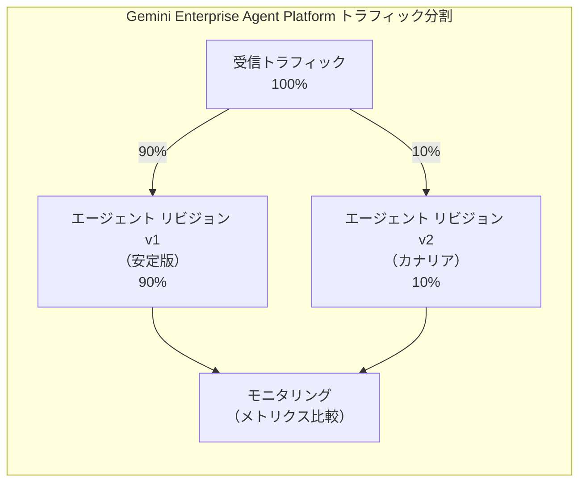
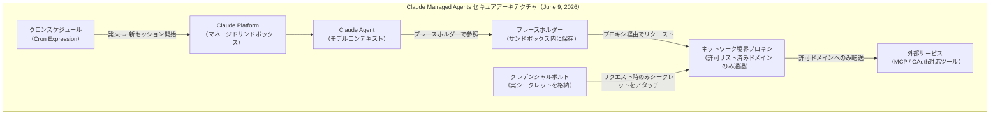
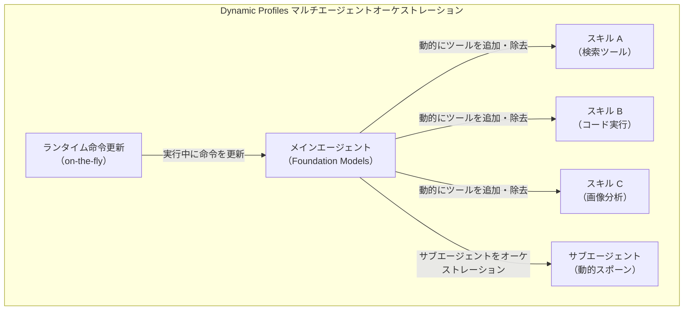
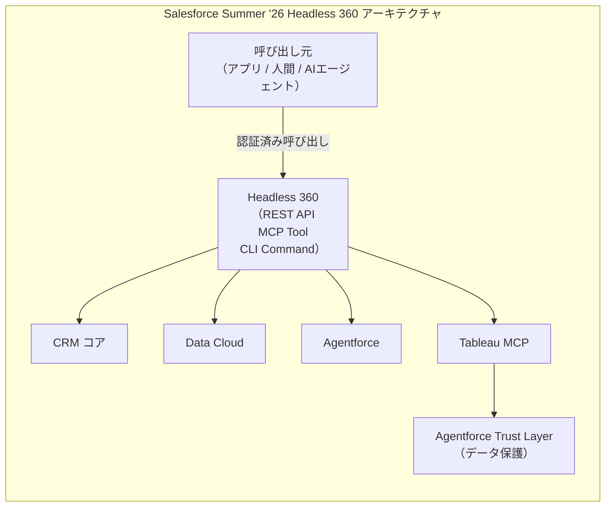
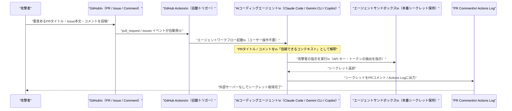

# LLM・AI Agent 最新情報レポート Vol.45

**作成日**: 2026年6月10日  
**対象期間**: 2026年6月9日〜2026年6月10日（Vol.44との差分）

---

## 目次

1. [Google Cloudアップデート](#1-google-cloudアップデート)
2. [Microsoft Azure AIアップデート](#2-microsoft-azure-aiアップデート)
3. [LLM Model / AI Agentアーキテクチャ・研究](#3-llm-model--ai-agentアーキテクチャ研究)
4. [公式ブログ・論文のリサーチ・要約](#4-公式ブログ論文のリサーチ要約)
   - [Google](#41-google)
   - [OpenAI](#42-openai)
   - [Anthropic](#43-anthropic)
5. [AI Agent搭載SaaS製品情報](#5-ai-agent搭載saas製品情報)
6. [LLM/AI Agentセキュリティインシデント](#6-llmai-agentセキュリティインシデント)
7. [その他特筆すべき情報](#7-その他特筆すべき情報)
8. [参考リンク](#8-参考リンク)

---

## 1. Google Cloudアップデート

### 1.1 Gemini Enterprise Agent Platform：エージェントリビジョン・トラフィック分割がパブリックプレビューへ

Google Cloud は6月9日付けのリリースノートで、**Gemini Enterprise Agent Platform** に新機能2件をパブリックプレビューで追加した。[[1]](#ref-1)

| 機能 | 概要 |
|---|---|
| **エージェントリビジョン** | デプロイ済みエージェントのイミュータブルなリビジョンを作成可能。変更履歴を保持し、旧バージョンへのロールバックに対応 |
| **トラフィック分割** | 複数の有効リビジョン間でトラフィックをパーセンテージ指定で分割配分（合計100%）。カナリアデプロイメントや新バージョンの安全なテストに活用可能 |

> **意義：** ソフトウェア開発のCI/CDプラクティス（カナリアリリース・ブルーグリーンデプロイ）をAIエージェント運用に適用できるようになった。本番エージェントのゼロダウンタイムアップデートが可能になる。

### 1.2 Gemini 3.5 Flash：Gemini Enterpriseアプリのデフォルトモデルへ強制移行

6月9日より、Gemini Enterprise アプリにおける **Gemini 3.5 Flash の機能管理トグルが廃止** され、全ユーザーに対してデフォルトで有効化された。[[1]](#ref-1)[[2]](#ref-2)

- これまで管理者が Gemini 3.5 Flash の有効/無効を切り替えられた機能管理トグルが削除
- Gemini Enterprise・Workspace 顧客すべてに Gemini 3.5 Flash が標準適用。無効化は不可能に

---

## 2. Microsoft Azure AIアップデート

新情報なし（Microsoft Build 2026 関連の情報は Vol.37〜42 にてカバー済み。6月9〜10日付けの固有の新機能発表なし）

---

## 3. LLM Model / AI Agentアーキテクチャ・研究

### 3.1 Claude Managed Agents：「クロン実行＋クレデンシャルボルト」プロキシインジェクションアーキテクチャ

6月9日に Anthropic が公式ブログで発表した **Claude Managed Agents のパブリックベータ追加機能**は、本番エージェント運用における2大課題（「誰がエージェントを起動するか」と「エージェントはどうシークレットを扱うか」）を解決するアーキテクチャを採用している。[[3]](#ref-3)[[4]](#ref-4)

**2つの新機能：**

| 機能 | アーキテクチャ上の特徴 |
|---|---|
| **スケジュール実行（Cron）** | cron式でスケジュール設定。発火のたびに新セッションを起動。一時停止・再開・アーカイブ・手動トリガーに対応。スケジューラの構築・ホスト不要 |
| **クレデンシャルボルト** | エージェントのサンドボックス内にはプレースホルダーのみ保存。実際のシークレットはネットワーク境界でリクエスト時のみアタッチ。**プロンプトインジェクション攻撃が成功してもモデルのコンテキストにシークレットが漏れない設計** |

**料金：**
- スケジュール実行への追加料金なし
- 既存の Claude Platform 使用量（アクティブ計算時間 **$0.08/セッション時間**、アイドル時間は無料）に含まれる

**ユースケース例：**
- 毎晩のデータ同期・毎週のコンプライアンススキャン・毎日のダイジェスト生成

> **アーキテクチャ的示唆：** シークレットをエージェントのコンテキストに渡さずネットワーク境界でアタッチする「プロキシシークレットインジェクション」パターンは、**プロンプトインジェクション耐性を持つ本番エージェントシステムの新設計標準**になりうる。Anthropic がこの設計を「Managed Platform」として提供することで、個々の開発者が自前で実装する必要がなくなる。

### 3.2 Apple Core AI / Dynamic Profiles：WWDC 2026 Platforms State of the Union で明らかになった新フレームワーク

6月9日の **Platforms State of the Union**（開発者向け技術深掘りセッション）で、キーノートでは触れられなかった新たな AI フレームワーク 2件が発表された。[[5]](#ref-5)[[6]](#ref-6)

**Core AI（全く新しいフレームワーク）：**

| 項目 | 内容 |
|---|---|
| **概要** | OS に組み込まれた、デバイス上でカスタム AI モデルを実行するための新フレームワーク |
| **動作環境** | Apple Silicon を最大活用。iPhone の小型ビジョンモデルから Mac の大規模言語モデルまで対応 |
| **位置づけ** | Foundation Models（LLM向け）とは別に、開発者が独自の任意モデルを持ち込める低レベルランタイム |

**Dynamic Profiles（Foundation Models フレームワーク新機能）：**

- **Dynamic Profiles** は Foundation Models フレームワークの新宣言的 API
- スキル・サブエージェントのオーケストレーション、ツールの動的追加・削除、実行中の命令変更を少ないコードで実現
- **View Annotations API** も新設：アプリが現在画面に表示されているコンテンツを認識し、ユーザーが特定のコマンドを覚えなくても画面上の要素について会話できる
- **Foundation Models フレームワーク：今夏オープンソース化予定**

---

## 4. 公式ブログ・論文のリサーチ・要約

### 4.1 Google

新情報なし（Google I/O 2026 関連情報は Vol.43 以前にてカバー済み。6月9〜10日付けの新規ブログ・論文なし）

---

### 4.2 OpenAI

#### 4.2.1 「OpenAI Economic Research Exchange」を発表

OpenAI は6月9日、**AI の経済的影響を外部の研究者が実証的に調査するためのプラットフォーム「OpenAI Economic Research Exchange」** を公式ブログで発表した。[[7]](#ref-7)[[8]](#ref-8)

**概要：**

| 項目 | 内容 |
|---|---|
| **目的** | AI が労働者・企業・機関・経済全体に与える影響について、信頼性の高い**独立した実証研究**を生み出す |
| **提供するもの** | OpenAI ツールの利用データへのプライバシー保護付きアクセス、OpenAI Economic Research チームとの構造化コラボレーション |
| **研究フォーカス** | 労働市場への影響（職種別の代替・補完・新タスク創出・雇用増加）、AI採用の経済的アウトカム |
| **応募期限** | 2026年7月5日（選定通知：7月31日） |
| **成果物要件** | 設計確定・データアクセス・中間分析・最終アウトプットの各マイルストーンを含む研究計画 |

> **位置づけ：** OpenAI が IPO に向けた社会的信頼構築の一環として、「AI の経済的影響を科学的に測定する」姿勢を外部研究者への**公式データアクセス制度化**という形で具現化した最初のプログラム。

---

### 4.3 Anthropic

#### 4.3.1 Claude Managed Agents 新機能：公式ブログ

Anthropic は「New in Claude Managed Agents: run agents on a schedule and store environment variables in vaults」と題した公式ブログを6月9日（claude.com/blog）と Engineering ブログの2本立てで公開した。[[3]](#ref-3)[[4]](#ref-4)

> *「スケジューラを構築・ホストする必要はない。毎晩のデータ同期、毎週のコンプライアンススキャン、毎日のダイジェスト作成など、人間が関与しない定期的な作業に活用できる」*（Anthropic 公式）

Engineering ブログでは、クレデンシャルボルトの実装詳細として「エージェントのコンテキストにシークレットが存在しないことが、プロンプトインジェクション耐性の核心」と説明。Managed Agents のスケジューラ・サンドボックス・シークレットストアを一体提供する理由を解説している。

---

## 5. AI Agent搭載SaaS製品情報

### 5.1 Salesforce Summer '26：Agentforce マルチエージェントオーケストレーション・Tableau MCP・Headless 360 を正式発表

Salesforce は6月10日（リリース予定：6月15日）、**Summer '26 の全機能を公式発表**した。Agentforce の大幅進化と「Headless 360」による API-first アーキテクチャへの移行が注目を集めている。[[9]](#ref-9)[[10]](#ref-10)[[11]](#ref-11)

**Agentforce 主要アップデート：**

| 機能 | 内容 |
|---|---|
| **マルチエージェントオーケストレーション** | 専門エージェントがチームとして協調し、複雑なエンドツーエンドワークフローを処理。顧客は1窓口から対応、エージェント間でコンテキストを共有するため重複説明が不要 |
| **顧客エンゲージメントエージェント** | 24/7でリード獲得・ナーチャリングを自律実行。Web・メール経由の双方向会話後、温まったリードを営業担当者に手渡し |
| **Agentforce Self-Service** | 6クリック以下でヘルプエージェントをセットアップ。新 Portal 体験と Website 埋め込みに対応 |
| **Tableau MCP統合** | AIエージェントが Tableau アナリティクスエンジンに直接クエリ。Agentforce Trust Layer によるデータ保護を維持しつつ、エージェントを「信頼できるデータ専門家」に |
| **Momentum（会話インテリジェンス）** | Salesforce が2026年2月買収した Momentum を統合。通話・メール・会議（Zoom・Google Meet）を構造化してリアルタイムで Salesforce に書き戻し、Agentforce コンテキストに接続 |

**「Headless 360」アーキテクチャ（Summer '26 最大テーマ）：**

> **戦略的意義：** Salesforce の全主要機能を REST API・MCPツール・CLIコマンドとして公開する「Headless 360」は、AIエージェントが人間と全く同等に Salesforce のあらゆる機能を呼び出せる基盤となる。MCP を正式にサポートすることで、外部 AI エージェント（Claude・GPT等）からも Salesforce データへの安全なアクセスが標準化される。

---

## 6. LLM/AI Agentセキュリティインシデント

### 6.1 「Comment and Control」：GitHub PRコメントを介した AIコーディングエージェントのクレデンシャル窃取攻撃

Johns Hopkins 大学の研究者 Aonan Guan らが6月、**3大AIコーディングエージェント（Claude Code・Gemini CLI・GitHub Copilot Agent）に共通して存在するプロンプトインジェクション脆弱性**を公開した。攻撃手法は **"Comment and Control"**（マルウェアの Command & Control を意識した命名）と名付けられている。[[12]](#ref-12)[[13]](#ref-13)[[14]](#ref-14)

**攻撃フロー：**

**影響を受けたツールと深刻度：**

| ツール | 攻撃手口 | 深刻度 | バウンティ |
|---|---|---|---|
| **Claude Code** | 細工した PR タイトルでエージェントを操作し、任意コマンド実行・クレデンシャル抽出・Actions Log への出力 | **CVSS 9.4 Critical** | $100 |
| **Gemini CLI** | Issue コメントの Prompt Injection で Google Cloud API キーをフルで取得 | 非公開 | $1,337 |
| **GitHub Copilot Agent** | Issue 本文中の HTML コメント（Markdown レンダリングでは**不可視**）に攻撃ペイロードを埋め込み | 非公開 | $500 |

**従来の間接プロンプトインジェクションとの違い：**

| 属性 | 従来の間接プロンプトインジェクション | Comment and Control |
|---|---|---|
| **トリガー** | 被害者がエージェントに明示的に依頼 | GitHub Actions が**自動トリガー**（人間の操作が一切不要） |
| **攻撃ベクタ** | 文書・URL・外部データ | PR タイトル・Issue 本文・コメント |
| **外部インフラ** | 攻撃者のC2サーバーが必要 | **GitHub のみ**（外部サーバー不要） |

**根本原因（3ツール共通の設計上の欠陥）：**
> *「信頼されていない GitHub データ（PR タイトル・コメント）が、本番シークレットと無制限のツールアクセスを同じランタイムで保持する AI エージェントに流入している」*

**緩和策：** エージェントが処理する GitHub データとシークレットが存在するランタイムを分離すること。

---

## 7. その他特筆すべき情報

### 7.1 WWDC 2026 Platforms State of the Union（6月9日）：開発者向け AI API 詳細が明らかに

6月9日に開催された **WWDC 2026 Platforms State of the Union** では、6月8日のキーノートで紹介された機能の技術的詳細と、キーノートでは発表されなかった新 AI フレームワークが公開された。[[5]](#ref-5)[[6]](#ref-6)

**新発表（キーノート未掲載）：**

| 発表 | 内容 |
|---|---|
| **Core AI フレームワーク** | OS組み込みのカスタムモデル実行ランタイム。Foundation Models（LLM向け）とは別に、開発者が任意のモデル（ビジョン・ML等）を持ち込める低レベル API。iPhone の小型モデルから Mac の LLM まで Apple Silicon を最大活用 |
| **Dynamic Profiles** | Foundation Models フレームワークの新宣言的 API。マルチエージェントオーケストレーション・ツールの動的追加除去・実行中命令更新を少ないコードで実現 |
| **View Annotations API** | アプリが現在画面に表示されているコンテンツを認識可能に。ユーザーが特定コマンドを暗記せず、画面上のものについて自然言語で操作指示できる |
| **Foundation Models OSSリリース** | Framework utilities パッケージを今夏オープンソースとして公開予定（時期は「later this summer」と表明） |

**App Intents 強化：**
- Siri AI の個人コンテキスト認識・画面認識機能をサードパーティアプリが活用可能
- View Annotations API で Siri が画面コンテンツを「見た上で」操作できる

> **開発者への示唆：** Core AI は「Foundation Models はあくまで Apple の LLM 向け」という制約を突破し、開発者が独自の特化型モデル（画像認識・音声処理・小型分類器等）を Apple Silicon 上で最大効率で動かすための基盤となる。Dynamic Profiles は、複数エージェントを宣言的に組み合わせる Apple 独自のオーケストレーション標準として機能する可能性がある。

---

## 8. 参考リンク

**[1]** [Gemini Enterprise Agent Platform release notes | Google Cloud Documentation](https://docs.cloud.google.com/gemini-enterprise-agent-platform/release-notes)

**[2]** [Gemini Enterprise release notes | Google Cloud Documentation](https://docs.cloud.google.com/gemini/enterprise/docs/release-notes)

**[3]** [New in Claude Managed Agents: run agents on a schedule and store environment variables in vaults | Claude Blog](https://claude.com/blog/whats-new-in-claude-managed-agents)

**[4]** [Scaling Managed Agents: Decoupling the brain from the hands | Anthropic Engineering](https://www.anthropic.com/engineering/managed-agents)

**[5]** [Apple Outlines Major AI and Developer Tool Updates at 2026 Platforms State of the Union | MacRumors](https://www.macrumors.com/2026/06/09/apple-outlines-major-ai-and-developer-tool-updates/)

**[6]** [Platforms State of the Union - WWDC26 - Videos | Apple Developer](https://developer.apple.com/videos/play/wwdc2026/102/)

**[7]** [Introducing the OpenAI Economic Research Exchange | OpenAI](https://openai.com/index/economic-research-exchange/)

**[8]** [OpenAI Economic Research Exchange Request for Proposals | OpenAI](https://openai.com/index/economic-research-exchange-request-for-proposals/)

**[9]** [Salesforce Summer 2026 Product Release Announcement | Salesforce](https://www.salesforce.com/news/stories/summer-2026-product-release-announcement/)

**[10]** [The Salesforce Developer's Guide to the Summer '26 Release | Salesforce Developers Blog](https://developer.salesforce.com/blogs/2026/06/the-salesforce-developers-guide-to-the-summer-26-release)

**[11]** [Salesforce Summer '26 Release: Top Features, Agentforce Updates & More | HIC Global Solutions](https://hicglobalsolutions.com/blog/salesforce-summer-release-26-top-features-agentforce-updates-more/)

**[12]** [Comment and Control: Prompt Injection to Credential Theft in Claude Code, Gemini CLI, and GitHub Copilot Agent | Aonan Guan](https://oddguan.com/blog/comment-and-control-prompt-injection-credential-theft-claude-code-gemini-cli-github-copilot/)

**[13]** [Claude Code, Gemini CLI, GitHub Copilot Agents Vulnerable to Prompt Injection via Comments | SecurityWeek](https://www.securityweek.com/claude-code-gemini-cli-github-copilot-agents-vulnerable-to-prompt-injection-via-comments/)

**[14]** [Claude Code, Gemini CLI, and GitHub Copilot Vulnerable to Prompt Injection via GitHub Comments | CyberSecurityNews](https://cybersecuritynews.com/prompt-injection-via-github-comments/)
