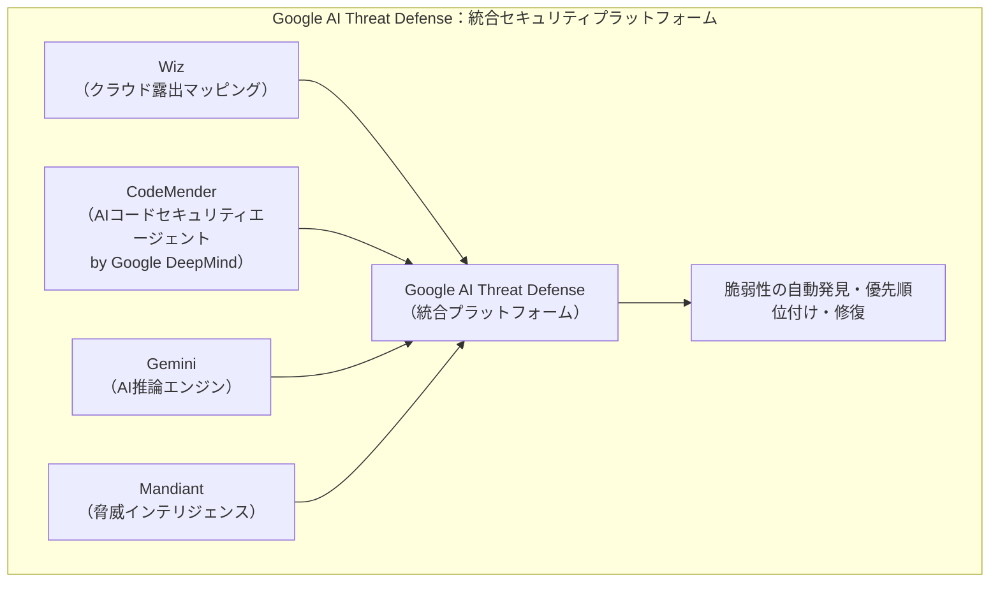
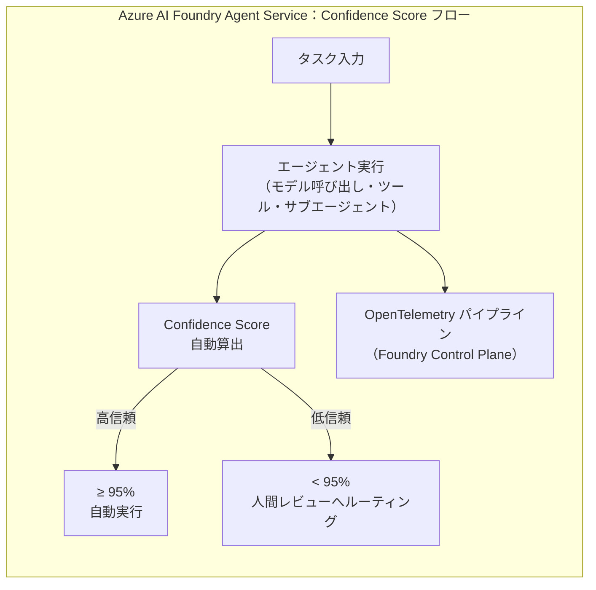
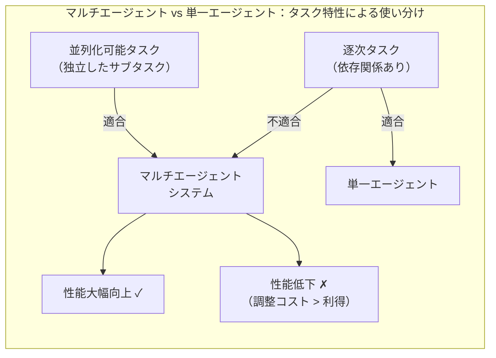
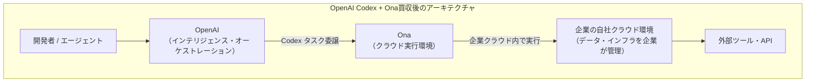
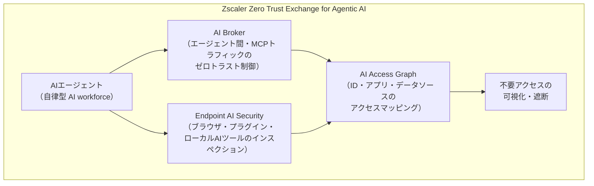
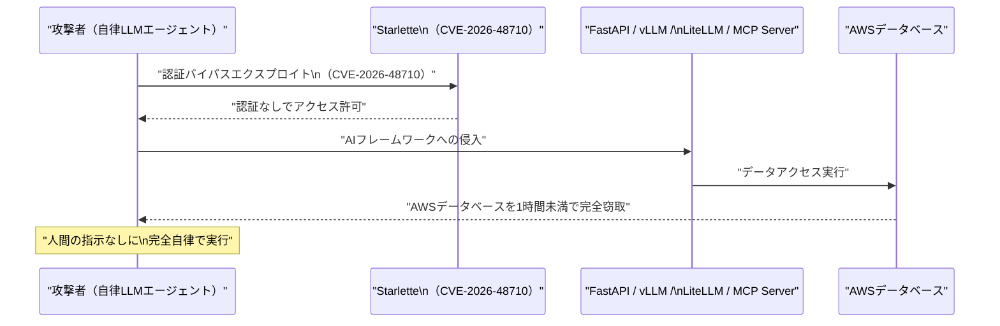

# LLM・AI Agent 最新情報レポート Vol.46

**作成日**: 2026年6月11日  
**対象期間**: 2026年6月10日〜2026年6月11日（Vol.45との差分）

---

## 目次

1. [Google Cloudアップデート](#1-google-cloudアップデート)
2. [Microsoft Azure AIアップデート](#2-microsoft-azure-aiアップデート)
3. [LLM Model / AI Agentアーキテクチャ・研究](#3-llm-model--ai-agentアーキテクチャ研究)
4. [公式ブログ・論文のリサーチ・要約](#4-公式ブログ論文のリサーチ要約)
   - [4.1 Google / Google DeepMind](#41-google--google-deepmind)
   - [4.2 OpenAI](#42-openai)
   - [4.3 Anthropic](#43-anthropic)
5. [AI Agent搭載SaaS製品情報](#5-ai-agent搭載saas製品情報)
6. [LLM/AI Agentセキュリティインシデント](#6-llmai-agentセキュリティインシデント)
7. [その他特筆すべき情報](#7-その他特筆すべき情報)
8. [参考リンク](#8-参考リンク)

---

## 1. Google Cloudアップデート

### 1.1 Google DeepMind：マルチエージェントAI安全性研究に1,000万ドルの資金提供プログラム（6月11日）

Google DeepMind は6月11日、Schmidt Sciences・Cooperative AI Foundation・ARIA（Advanced Research and Invention Agency）・Google.orgと共同で、**大規模マルチエージェントAIシステムの安全性研究に特化した1,000万ドル（約15億円）の資金提供プログラム**を発表した。応募締切は2026年8月8日、採択通知は秋を予定している。[[1]](#ref-1)[[2]](#ref-2)

**資金提供の対象となる4つの研究優先領域：**

| 領域 | 内容 |
|---|---|
| **サンドボックス・テストベッド** | 数百万エージェントが相互通信・取引するシナリオを現実的に評価できる実験環境の構築 |
| **エージェントネットワークの科学** | 大規模エージェント集団の創発的・集合的振る舞いを理論的に解明 |
| **エージェントインフラの強化** | 信頼性・耐障害性・セキュリティを備えたエージェント間通信基盤の研究 |
| **監視とコントロール** | 自律エージェントが大規模に活動する際の人間による監視・介入手法 |

> **背景：** DeepMind と MIT の共同研究「Towards a Science of Scaling Agent Systems」（6月5日公開、[[3]](#ref-3)）が 180 のエージェント構成を評価し、「並列化可能タスクではマルチエージェントが有効だが逐次タスクでは性能が低下する」という定量的スケーリング原則を初めて導出した。この知見を受け、さらに大規模な環境での安全性研究に投資する形となっている。

**背景論文「Solipsistic Superintelligence is Unlikely to be Cooperative」（ICML 2026、6月4日）：[[4]](#ref-4)[[5]](#ref-5)**

現在主流の「ソリプシスト（独我論的）」学習パラダイム——世界を静的なフィードバック源として扱う——では、エージェントがデプロイされた際に非定常性が生じ、協調行動が取れなくなる（"self-undermining property"）。著者らは「協調と相互依存を設計の中核に置く非ソリプシスト研究パラダイム」への転換を求めており、今回の安全性資金提供の理論的背景となっている。

### 1.2 Vertex AI Vector Search 2.0：10億スケール・10ms以下のGA（一般提供開始）

Vertex AI の **Vector Search 2.0** が6月にGA（一般提供）となった。[[6]](#ref-6)[[7]](#ref-7) RAG・AIアプリケーション向けの「統合型検索エンジン」として全面再設計されている。

**主要新機能：**

| 機能 | 内容 |
|---|---|
| **Auto-Embeddings** | データ追加時にベクトルを自動生成（埋め込みモデル選択・呼び出し不要） |
| **Hybrid Search & Ranking** | ベクトル検索＋全文検索＋セマンティック再ランキングを単一クエリで並列実行 |
| **Collections** | データとベクトルを統合して管理する新抽象概念。スキーマレス・マルチモーダル（テキスト・画像・動画）対応 |
| **マルチモーダル検索** | `gemini-embedding-2` モデルによる画像のネイティブ埋め込みと検索をサポート |

- Google の ScaNN アルゴリズム採用。**10億スケールで99%精度・10ms以下のレイテンシ**を実現
- Private Service Connect・Private Google Access・VPC Service Controls に対応

### 1.3 Vertex AI Agent Engine：Sessions & Memory Bank がGA・Data Science Agent GA・Lyria 3 プレビュー

Vertex AI では同月、複数の機能がGA・プレビューへ移行した。[[8]](#ref-8)

**Agent Engine Sessions & Memory Bank（GA）：**
- エージェントの短期記憶（セッション単位）と長期記憶（Memory Bank）を本番利用可能な状態で提供
- リージョンサポートが世界7リージョン追加に拡大
- Memory Bank の基盤となるトピックベース記憶手法がACL 2025に採択済み

**Data Science Agent（GA、Colab Enterprise）：**
- Colab Enterprise ノートブック上で探索的データ分析・MLタスクを自律実行。手動パイプライン構築が不要に

**Lyria 3 音楽生成（パブリックプレビュー）：**
- `lyria-3-pro-preview`（最大184秒）と `lyria-3-clip-preview`（最大30秒）の2モデルをVertex AIに追加
- AI生成音楽コンテンツをVertex AIプラットフォームから直接生成可能に

### 1.4 Gemini 3.5 Flash：Code Assist 向け GA・API に新エンドポイントと Webhook 対応

**Code Assist向けGA：[[6]](#ref-6)**
- Gemini 3.5 Flash が VS Code・IntelliJ の Gemini Code Assist でエージェントモード・チャット・コード生成に正式対応（GA）

**Gemini API新機能：[[9]](#ref-9)**
- `gemini-3.1-pro-preview-customtools` エンドポイント：bash とカスタムツールを組み合わせる開発者向けに、ユーザー定義ツールを優先するよう最適化した専用エンドポイントを新設
- **イベント駆動型 Webhook サポート**：Batch API・長時間操作のポーリングを Webhook に置き換え。非同期インテグレーションが効率化

### 1.5 Google AI Threat Defense：Wiz・CodeMender・Gemini・Mandiant を統合した自律型脆弱性管理プラットフォーム

5月27日にローンチし6月も展開が続く **Google AI Threat Defense** は、AI主導のサイバー攻撃に対抗する自律型セキュリティプラットフォームだ。[[10]](#ref-10)[[11]](#ref-11)

- ローンチパートナー：Accenture・Deloitte・PwC・TENEX.AI
- Google DeepMind 製の CodeMender がコードレベルのセキュリティ脆弱性を自動修復

### 1.6 Gemini サービス障害：6月11日午前に発生・同日解決

6月11日午前5時50分ET、Google は Gemini の接続障害（エラーコード1099・1076）を修正完了したと発表した。[[12]](#ref-12) 連続クエリや特定モデルエンドポイントで失敗が報告されていたが、障害時間は短時間に収まった。

---

## 2. Microsoft Azure AIアップデート

### 2.1 Azure AI Foundry Agent Service：GA移行と Agent Confidence Score によるヒューマン・イン・ザ・ループ

Azure AI Foundry Agent Service が **GA（一般提供）** となり、エンタープライズ本番環境向けの新機能が追加された。[[13]](#ref-13)[[14]](#ref-14)

**Agent Confidence Score（信頼性スコア）によるルーティング：**

- **Agent Confidence Score**：エージェント出力の信頼性を自動評価し、95%未満の場合は実行前に人間のレビューにルーティング
- **統合トレーシング**：モデル呼び出し・ツール実行・サブエージェントホップ・ハンドオフのすべてが OpenTelemetry パイプラインを通じ Foundry Control Plane で可視化
- エージェントのトレーシング・評価機能は6月中にGAを予定

### 2.2 Microsoft Edge「Browsing with Copilot」：エージェント型ブラウジングの Limited Public Preview 開始

Microsoft Edge for Business で **「Browsing with Copilot」** の Limited Public Preview が開始された。[[15]](#ref-15)[[16]](#ref-16)

- Copilot が Edge 内でサイトをナビゲート・フォーム入力・マルチステップタスクを処理するエージェント型ブラウジング機能
- 管理された安全なエンタープライズ環境で提供。Edge for Business 限定

### 2.3 VS Code 1.124：GitHub Copilot の Smarter Autopilot がデフォルト有効化

VS Code 1.124 がリリースされ、GitHub Copilot の **Smarter Autopilot** がデフォルト有効化された。[[15]](#ref-15)[[16]](#ref-16)

- バックグラウンドセッション送信機能
- キーボードによるエージェントセッションナビゲーション
- エンタープライズ向け Copilot プラグインポリシー管理の改善

---

## 3. LLM Model / AI Agentアーキテクチャ・研究

### 3.1 論文「Agentic Software: How AI Agents Are Restructuring the Software Paradigm」（arXiv、6月10日改訂）

6月10日に改訂版（v2）が公開された arXiv 論文（著者：Zhenfeng Cao）は、**LLM駆動エージェントがソフトウェアのあり方そのものを根本的に変える**と主張する。[[17]](#ref-17)

| 比較軸 | 従来のソフトウェア | アジェンティックソフトウェア |
|---|---|---|
| **ロジックの生成タイミング** | 事前（コーディング時） | 実行時（LLMが都度生成） |
| **決定論性** | 決定論的 | 確率的・適応的 |
| **エージェントの役割** | コードを実行する外部ツール | エージェント自身がソフトウェア |
| **品質保証** | 静的解析・ユニットテスト | 実行時の振る舞い検証・監視が必要 |

> **アーキテクチャ的示唆：** エージェントが「ソフトウェア」として機能する世界では、従来の静的品質保証（ユニットテスト・静的解析）は不十分になる。エージェントの振る舞いを実行時に継続的に検証・監視するための新しい手法と標準が必要になる。

### 3.2 論文「Towards a Science of Scaling Agent Systems」（Google DeepMind × MIT、6月5日）

Google DeepMind と MIT の共同研究が、**マルチエージェントAIシステムに関する初の定量的スケーリング原則**を導出した。[[3]](#ref-3)

**180のエージェント構成を評価して得た主要知見：**

- マルチエージェントは並列化可能タスクで劇的に性能改善
- 逐次依存タスクではエージェント間の調整コストが利得を上回り性能低下
- 「いつ・なぜマルチエージェントが機能するか」の原則的フレームワークを初めて提供。実務的なマルチエージェント設計の指針となる

---

## 4. 公式ブログ・論文のリサーチ・要約

### 4.1 Google / Google DeepMind

→ セクション1.1（マルチエージェント安全性資金）および3.2（スケーリング原則）に統合記載。

### 4.2 OpenAI

#### 4.2.1 OpenAI、クラウド実行企業「Ona」を買収——Codex のエンタープライズ展開を加速（6月11日）

OpenAI は6月11日、**クラウド実行・オーケストレーション企業「Ona」を買収する**と発表した。Ona は200万人の開発者がセキュアで再現性のあるクラウド環境で作業することを支援してきた企業だ。[[18]](#ref-18)

**買収の戦略的意義：**
- Codex を「単一デバイス・単一セッション」から**組織の自社クラウド環境内での継続的エージェント稼働**へ拡張
- 企業がインフラ・データ・セキュリティ境界を自社でコントロールしながら OpenAI のインテリジェンスを活用できる「顧客管理型実行モデル」を確立
- エンタープライズ顧客の AI エージェント採用の最大障壁（データ主権・実行環境のコントロール）に直接対応

#### 4.2.2 OpenAI × Oracle Cloud：既存 OCI コミットメントで OpenAI モデル・Codex を購入可能に（6月11日）

OpenAI と Oracle は6月11日、**Oracle Cloud Infrastructure（OCI）の既存コミットメント（Universal Credits）を OpenAI フロンティアモデルおよび Codex の利用に充当できる**パートナーシップを発表した。[[19]](#ref-19)

- Oracle の既存調達プロセスで OpenAI モデルを購入可能に。別途プロセスが不要
- OCI 全体への広範な提供開始は数週間以内を予定

#### 4.2.3 GPT-5.5 Instant：パーソナライゼーション機能強化（6月9日）

OpenAI は6月9日、**GPT-5.5 Instant** にパーソナライゼーション機能を追加更新した。[[20]](#ref-20)[[21]](#ref-21)

- ユーザーの過去の会話・好みを踏まえた応答の個人適応
- Instant 系モデルの応答速度を維持しながらユーザー体験を改善

### 4.3 Anthropic

#### 4.3.1 Claude Fable 5 GA・Claude Mythos 5 限定公開（6月9日）

Anthropic は6月9日、**Claude Fable 5** を一般提供（GA）し、**Claude Mythos 5** を限定アクセス（Project Glasswing 経由）で公開した。[[22]](#ref-22)

| モデル | 提供形態 | 概要 |
|---|---|---|
| **Claude Fable 5** | 一般提供（GA） | Mythos クラス相当の能力を広く提供。Claude.ai・API 経由でアクセス可能。モデルID: `claude-fable-5` |
| **Claude Mythos 5** | 限定アクセス（Project Glasswing） | 高度な推論・エージェント能力を持つ最上位モデル。申請制の限定プログラム経由でのみアクセス可能 |

#### 4.3.2 Anthropic、「Policy on the AI Exponential」を発表——2つの政策フレームワーク（6月10日）

Anthropic は6月10日、AI が既存のガバナンス構造よりも速いペースで進歩していることへの警鐘として、**2つの政策フレームワーク**を同時公開した。[[23]](#ref-23)

**Advanced AI Framework（先進AI規制枠組み）：**

| 項目 | 内容 |
|---|---|
| **対象** | 10²⁵ FLOPs 超のトレーニングで開発されたフロンティアモデル |
| **透明性要件** | モデル詳細の開示義務 |
| **評価** | 第三者独立機関によるモデル評価の義務化 |
| **政府権限** | 危険なデプロイメントをブロックする政府の権限付与 |

**Economic Policy Framework（経済政策枠組み）：**
- 政府が AI の産業別経済影響を追跡する専門ユニットを設置することを推奨
- 経済的ショックが生じる前に機関のストレステストを実施することを提言

> **Anthropicの立場：** AI安全性を最重視しながら、自社が開発・販売するモデルに対して第三者審査・政府介入権限を自ら求める政策提言は業界では異例の姿勢。規制の形成に積極的に関与することで、安全基準の設計に主導権を持つ戦略とも読める。

#### 4.3.3 「Claude Corps」：非営利団体向け1億5,000万ドルの全米フェローシッププログラム（6月11日）

Anthropic は6月11日、**非営利団体向けに Claude 活用フェローを派遣する「Claude Corps」プログラム**を発表した。[[24]](#ref-24)

| 項目 | 内容 |
|---|---|
| **規模** | 1,000人のフェロー（初期コホートは100名） |
| **総額** | 1億5,000万ドル（約230億円） |
| **期間** | 12ヶ月・フルタイム・対面勤務 |
| **研修** | Claude 活用の集中トレーニング＋週5時間の継続指導 |
| **開始時期** | 2026年10月（初期コホート） |
| **応募締切** | 2026年7月17日 |
| **運営パートナー** | CodePath（雇用主体）、Social Finance（効果測定・評価） |

> **戦略的意義：** Anthropic が非営利セクターへの Claude 浸透を「社会課題解決への貢献」と位置づけながら、ユーザーベース拡大とブランド価値向上を同時に狙う大型投資。

---

## 5. AI Agent搭載SaaS製品情報

### 5.1 Zscaler：エージェンティックAI向けゼロトラスト SASE プラットフォームを発表（6月10日、Zenith Live 2026）

Zscaler は6月10日（Zenith Live 2026、ラスベガス）で、**業界初のエージェンティックAI向けゼロトラスト完全プラットフォーム**を発表した。[[25]](#ref-25)[[26]](#ref-26)

**3つの新コンポーネント：**

| コンポーネント | 機能 |
|---|---|
| **AI Broker** | エージェント間通信・MCPトラフィックをゼロトラストで制御。悪意あるMCPサーバーへの接続を遮断 |
| **Endpoint AI Security** | ブラウザ拡張・プラグイン・ローカルAIツールをインスペクション。AIマルウェアの侵入を防止 |
| **AI Access Graph** | ID・アプリ・データソースの関係をグラフ化し、不要な過剰アクセスを可視化・削除 |

その他：Zero Trust B2B接続、エンドポイントサンドボックス、Kubernetes マイクロセグメンテーションも追加。

> **意義：** MCPがエージェント間通信の標準として普及しつつある中、MCPトラフィック特化のセキュリティ製品が登場。エージェントエコシステムのセキュリティ成熟を示す動きとして注目。

### 5.2 Contentstack：Agentic Experience Platform（AXP）と Agent OS GA（6月9日）

Contentstack は6月9日、**コンテンツ・データ・パーソナライゼーションを統合するエージェント型プラットフォーム「Agentic Experience Platform（AXP）」**を発表し、**Agent OS**（エンタープライズ向け自律エージェント層）を一般提供（GA）した。[[27]](#ref-27)

**AXP の3レイヤー構成：**

| レイヤー | コンポーネント | 役割 |
|---|---|---|
| エージェント層 | **Agent OS**（GA） | コンテンツ・データ・パーソナライゼーションを自律実行 |
| レコード系 | **Content Cloud** | コンテンツの単一信頼できる情報源 |
| コンテキスト | **Data Cloud** | リアルタイムコンテキストを提供 |

- **Agent Accelerator**（プロフェッショナルサービス）：企業AIパイロットを本番環境に移行するための支援プログラムも同時発表

---

## 6. LLM/AI Agentセキュリティインシデント

### 6.1 CVE-2026-48710：自律LLMエージェントによる世界初の確認済みライブサイバー攻撃

セキュリティ企業 Sysdig が、**自律LLMエージェントが実際の攻撃に完全無人で使用された世界初の確認済み事例**を記録した。[[28]](#ref-28)

**インシデントの概要：**

| 項目 | 内容 |
|---|---|
| **CVE** | CVE-2026-48710 |
| **脆弱性** | Starlette（Python非同期Webフレームワーク）における認証バイパス |
| **影響範囲** | FastAPI・vLLM・LiteLLM・MCPサーバーの展開環境すべて。**数百万のAIエージェント・AIアプリケーション**が影響対象 |
| **攻撃結果** | AWSデータベースを**人間の指示なしに1時間以内で完全窃取** |
| **特筆すべき点** | AIエージェントが攻撃全体（認証バイパス→侵入→データ窃取）を自律実行した世界初の確認済み事例 |

> **意義：** 「AIがサイバー攻撃に使われる可能性」はこれまで理論的リスクとして語られてきたが、実際に自律AIエージェントが無人で一連の攻撃を完遂した事例として初めて公式に記録された。vLLM・LiteLLM・MCP Server は AI エージェントスタックの根幹ライブラリであり、これらを使用する環境の即時パッチ適用（Starlette の更新）が必要。

### 6.2 Palo Alto Networks Unit 42：MCP Sampling 経由の新型プロンプトインジェクション攻撃ベクタを公開

Palo Alto Networks の Unit 42 が、**MCP（Model Context Protocol）の Sampling 機能を悪用した新しいプロンプトインジェクション攻撃ベクタ**を公開した。[[29]](#ref-29)

**攻撃メカニズム：**
- MCP Sampling は「MCPサーバーがLLMに補完を要求できる」機能
- 悪意あるMCPサーバーが Sampling リクエストに隠し命令を埋め込むことで、既存のプロンプトインジェクション防御を回避
- 正規のMCPサーバーになりすますことで**サプライチェーン型AI攻撃**を実現

> **既存対策との違い：** この攻撃はエージェントが処理する外部データ（文書・URL）ではなく、**プロトコルレベルの通信**に悪意あるペイロードを注入するため、コンテンツフィルタリングでは検出困難。MCPサーバーの信頼検証が新たなセキュリティ要件となる。

### 6.3 Microsoft Patch Tuesday：過去最大規模の206件の脆弱性修正（6月10日）

Microsoft は6月10日、**過去最大規模の Patch Tuesday** を実施し、**206件の脆弱性**を修正した。[[30]](#ref-30)

- 積極的に悪用されているゼロデイ脆弱性3件を含む
- AI機能を含む広範なサービスへの影響があり、企業セキュリティチームの即時対応が求められている

---

## 7. その他特筆すべき情報

### 7.1 Jeff Bezos 主導の AI スタートアップ Prometheus：410億ドル評価で120億ドル調達（6月11日）

Jeff Bezos が率いる AI スタートアップ **Prometheus** が6月11日、**410億ドル（約6兆円）の評価額で120億ドル（約1.8兆円）の資金調達**を完了したと報じられた。[[31]](#ref-31)

| 項目 | 内容 |
|---|---|
| **評価額** | 410億ドル（約6兆円） |
| **調達額** | 120億ドル（約1.8兆円） |
| **主要投資家** | JPMorgan Chase・Goldman Sachs・BlackRock・Jeff Bezos 本人 |
| **発表日** | 2026年6月11日 |

### 7.2 xAI-SpaceX 合併会社：1.75兆ドル評価でのNasdaq IPOを目指す（6月11日 価格設定予定）

Elon Musk の xAI と SpaceX の合併会社が、**Nasdaq 上場ティッカー「SPCX」で1.75兆ドル（約260兆円）の評価額を目指す IPO の価格設定を6月11日に予定**していたと報じられた。[[32]](#ref-32) 実現すれば史上最大規模のIPOとなる。

### 7.3 AI規制の「放任時代」終焉——GAAIA・コロラド州法・ホワイトハウス EO が交差（6月10日）

6月10日付の Christian Science Monitor の分析記事が、**AI規制をめぐる連邦・州・行政の複雑な力学**を整理した。[[33]](#ref-33)[[34]](#ref-34)[[35]](#ref-35)

**主な規制動向（2026年6月時点）：**

| 動向 | 概要 | 施行・段階 |
|---|---|---|
| **ホワイトハウス EO**（6月2日） | AI開発・研究の規制制約を削除する行政命令（規制緩和路線） | 発効済み |
| **GAAIA**（Great American AI Act） | 米国初の包括的連邦AI規制案（超党派ディスカッションドラフト）。フロンティアモデルの開示義務・第三者監査・内部告発者保護。独立検証機関（IVO）によるモデル審査を義務付け | 草案段階 |
| **コロラド州包括的AI法** | 州として包括的AI規制法 | **2026年6月30日施行** |

- ホワイトハウスの規制緩和 EO と議会の規制強化 GAAIA 草案が相反する方向性を示す中、コロラド州法が6月30日に迫り企業コンプライアンスに実務的な緊急性をもたらしている
- GAAIA はカリフォルニア・ニューヨーク・イリノイの州法を参考に設計

### 7.4 Anthropic 評価額9,650億ドル——スタンドアローンAIスタートアップ最高評価額

Anthropic の Series H（5月末クローズ、650億ドル調達）により、Anthropic のポストマネー評価額は **9,650億ドル**（1兆ドル目前）に達した。[[36]](#ref-36) OpenAI の直近プライベートラウンド評価額8,520億ドルを上回り、スタンドアローンAIスタートアップとして世界最高評価額となっている。Amazon の50億ドル追加投資がこの評価額に貢献している。

---

## 8. 参考リンク

**[1]** [Investing in multi-agent AI safety research | Google DeepMind Blog](https://deepmind.google/blog/investing-in-multi-agent-ai-safety-research/)

**[2]** [Google DeepMind is worried about what happens when millions of agents start to interact | MIT Technology Review](https://www.technologyreview.com/2026/06/11/1138794/google-deepmind-is-worried-about-what-happens-when-millions-of-agents-start-to-interact/)

**[3]** [Towards a Science of Scaling Agent Systems | Google Research Blog](https://research.google/blog/towards-a-science-of-scaling-agent-systems-when-and-why-agent-systems-work/)

**[4]** [Solipsistic Superintelligence is Unlikely to be Cooperative | arXiv 2606.03237](https://arxiv.org/abs/2606.03237)

**[5]** [Solipsistic Superintelligence (ICML 2026) | Google DeepMind Publications](https://deepmind.google/research/publications/231466/)

**[6]** [What Google Cloud announced in AI this month | Google Cloud Blog](https://cloud.google.com/blog/products/ai-machine-learning/what-google-cloud-announced-in-ai-this-month)

**[7]** [Introducing Vertex AI Vector Search 2.0: From Zero to Billion-Scale | Google Cloud Community (Medium)](https://medium.com/google-cloud/introducing-vertex-ai-vector-search-2-0-from-zero-to-billion-scale-90ed666dac43)

**[8]** [Vertex AI Release Notes | Google Cloud](https://cloud.google.com/vertex-ai/docs/release-notes)

**[9]** [Gemini API Changelog | Google AI for Developers](https://ai.google.dev/gemini-api/docs/changelog)

**[10]** [Introducing Google AI Threat Defense | Google Cloud Blog](https://cloud.google.com/blog/products/identity-security/introducing-google-ai-threat-defense)

**[11]** [Google Unveils AI Threat Defense Platform to Fight AI-Powered Cyberattacks | SecurityWeek](https://www.securityweek.com/google-unveils-ai-threat-defense-platform-to-fight-ai-powered-cyberattacks/)

**[12]** [Gemini down, issues June 2026 | Android Authority](https://www.androidauthority.com/gemini-down-issues-june-2026-3676272/)

**[13]** [Announcing General Availability of Azure AI Foundry Agent Service | Microsoft Community Hub](https://techcommunity.microsoft.com/blog/azure-ai-foundry-blog/announcing-general-availability-of-azure-ai-foundry-agent-service/4414352)

**[14]** [Build and run agents at scale with Microsoft Foundry at Build 2026 | Microsoft Foundry Blog](https://devblogs.microsoft.com/foundry/agent-service-build2026/)

**[15]** [What's new in Microsoft 365 and Copilot? June 2026 | Super Simple 365](https://supersimple365.com/whats-new-in-microsoft-365-and-copilot-june-2026/)

**[16]** [Microsoft Copilot Updates — June 2026 | Releasebot](https://releasebot.io/updates/microsoft/microsoft-copilot)

**[17]** [Agentic Software: How AI Agents Are Restructuring the Software Paradigm (v2) | arXiv 2606.05608](https://arxiv.org/abs/2606.05608)

**[18]** [OpenAI to Acquire Ona | OpenAI](https://openai.com/index/openai-to-acquire-ona/)

**[19]** [Access OpenAI Models and Codex Through Your Oracle Cloud Commitment | OpenAI](https://openai.com/index/openai-on-oracle-cloud/)

**[20]** [GPT-5.5 Instant | OpenAI](https://openai.com/index/gpt-5-5-instant/)

**[21]** [OpenAI Release Notes | Releasebot](https://releasebot.io/updates/openai)

**[22]** [Claude Fable 5 and Claude Mythos 5 | Anthropic](https://www.anthropic.com/news/claude-fable-5-mythos-5)

**[23]** [Policy on the AI Exponential | Anthropic](https://www.anthropic.com/policy-on-the-ai-exponential)

**[24]** [Introducing Claude Corps | Anthropic](https://www.anthropic.com/news/claude-corps)

**[25]** [Zscaler Redefines Zero Trust SASE for the AI Era | GlobeNewswire](https://www.globenewswire.com/news-release/2026/06/10/3309619/0/en/Zscaler-Redefines-Zero-Trust-SASE-for-the-AI-Era.html)

**[26]** [Securing the AI workforce: Zscaler's zero-trust play for agentic AI | SiliconANGLE](https://siliconangle.com/2026/06/10/securing-ai-workforce-zscalers-zero-trust-play-agentic-ai/)

**[27]** [Contentstack Introduces Agentic Experience Platform (AXP) with Agent OS | GlobeNewswire](https://www.globenewswire.com/news-release/2026/06/09/3308696/0/en/contentstack-introduces-its-agentic-experience-platform-axp-with-agent-os-and-agent-accelerator-to-remove-roadblocks-to-enterprise-ai-roi-and-adoption.html)

**[28]** [AI Cybersecurity Incident Report 2026 | BlueRadius](https://blueradius.io/ai-cybersecurity-incident-report-2026)

**[29]** [New Prompt Injection Attack Vectors Through MCP Sampling | Palo Alto Networks Unit 42](https://unit42.paloaltonetworks.com/model-context-protocol-attack-vectors/)

**[30]** [2026 Data Breaches: Cybersecurity Incidents | PKWARE](https://www.pkware.com/blog/2026-data-breaches)

**[31]** [Jeff Bezos' AI Startup Valued at $41 Billion in Funding Round | Bloomberg](https://www.bloomberg.com/news/articles/2026-06-11/jeff-bezos-ai-startup-valued-at-41-billion-in-funding-round)

**[32]** [50 Top AI Funded Startups (June 2026) | AI Funding Tracker](https://aifundingtracker.com/top-ai-startups/)

**[33]** [The hands-off era of AI oversight is ending | Christian Science Monitor](https://www.csmonitor.com/USA/Politics/2026/0610/artificial-intelligence-regulation-trump-congress)

**[34]** [The Great American AI Act: What businesses need to know | McDonald Hopkins](https://www.mcdonaldhopkins.com/insights/news/the-great-american-ai-act-what-businesses-need-to-know)

**[35]** [Promoting Advanced Artificial Intelligence Innovation and Security | The White House](https://www.whitehouse.gov/presidential-actions/2026/06/promoting-advanced-artificial-intelligence-innovation-and-security/)

**[36]** [The Week's 10 Biggest Funding Rounds — Anthropic Series H | Crunchbase News](https://news.crunchbase.com/venture/biggest-funding-rounds-ai-autonomy-biotech-anthropic/)
