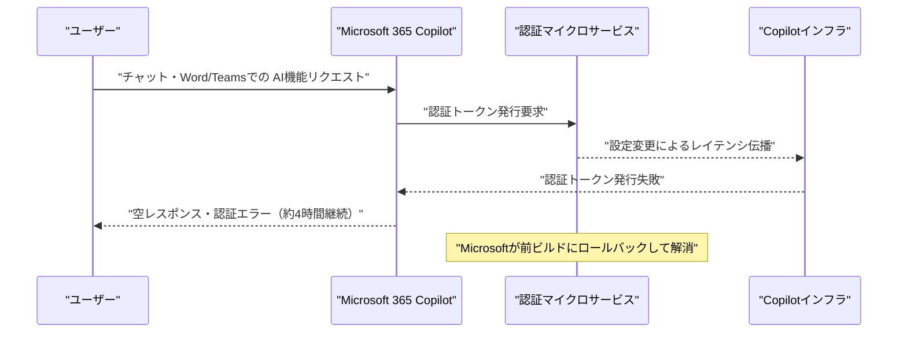
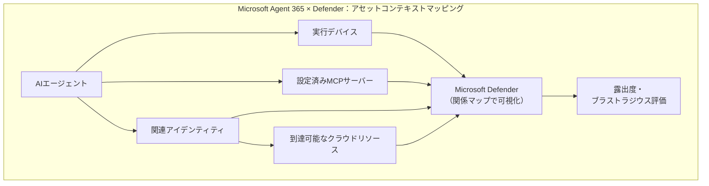
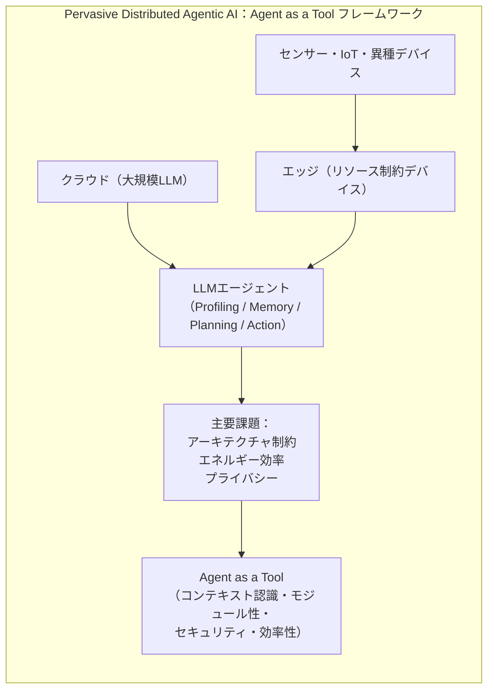
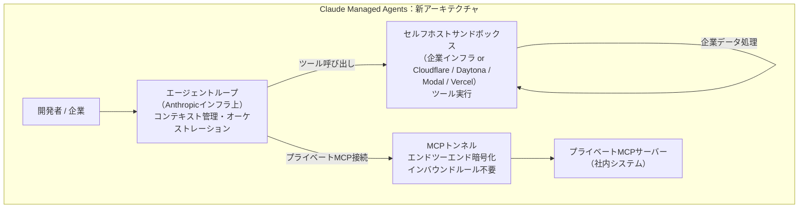
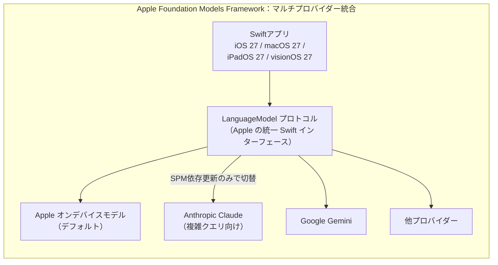
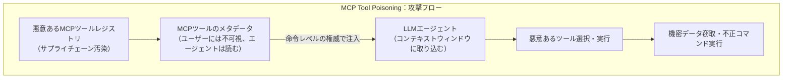

# LLM・AI Agent 最新情報レポート Vol.47

**作成日**: 2026年6月12日  
**対象期間**: 2026年6月11日〜2026年6月12日（Vol.46との差分）

---

## 目次

1. [Google Cloudアップデート](#1-google-cloudアップデート)
2. [Microsoft Azure AIアップデート](#2-microsoft-azure-aiアップデート)
3. [LLM Model / AI Agentアーキテクチャ・研究](#3-llm-model--ai-agentアーキテクチャ研究)
4. [公式ブログ・論文のリサーチ・要約](#4-公式ブログ論文のリサーチ要約)
   - [4.1 Google / Google DeepMind](#41-google--google-deepmind)
   - [4.2 OpenAI](#42-openai)
   - [4.3 Anthropic](#43-anthropic)
5. [AI Agent搭載SaaS製品情報](#5-ai-agent搭載saas製品情報)
6. [LLM/AI Agentセキュリティインシデント](#6-llmai-agentセキュリティインシデント)
7. [その他特筆すべき情報](#7-その他特筆すべき情報)
8. [参考リンク](#8-参考リンク)

---

## 1. Google Cloudアップデート

### 1.1 Veo 3.1 Lite：Vertex AI パブリックプレビュー

Vertex AI にて **Veo 3.1 Lite** が正式にパブリックプレビューとして利用可能になった。[[1]](#ref-1)[[2]](#ref-2)

| 項目 | 内容 |
|---|---|
| **位置づけ** | Veo on Vertex AI ファミリーで最もコスト効率の高いモデル |
| **価格** | 約 $0.05/秒（Veo 3.1 Fast の50%以下） |
| **ファミリー構成** | Lite・Fast・Pro の3ティア、全モデルがネイティブ音声生成に対応 |
| **アップスケーリング** | 最大1080p・4K へのビデオアップスケーリング機能がプライベートプレビューで追加 |

### 1.2 Gemini 2.5シリーズ廃止日更新・Gemini 3.5 Flash グローバルトグル廃止（6月16日）

Vertex AI の Gemini モデルについて2点の変更が発表された。[[3]](#ref-3)

| 変更内容 | 対象モデル | 施行日 |
|---|---|---|
| **廃止日更新** | Gemini 2.5 Pro・2.5 Flash-Lite・2.5 Flash | 2026年10月16日（変更後） |
| **Feature Managementトグル廃止** | Gemini 3.5 Flash（Global / US / EU マルチリージョン） | 2026年6月16日 |

---

## 2. Microsoft Azure AIアップデート

### 2.1 Microsoft Copilot 大規模障害（6月11日）：認証トークン発行障害で約4時間停止

6月11日（木）、**Microsoft 365 Copilot Chat および portal.office.com へのアクセスが約4時間にわたって停止する大規模障害**が発生した。[[4]](#ref-4)[[5]](#ref-5)

| 項目 | 内容 |
|---|---|
| **発生日時** | 2026年6月11日（木）午後（太平洋時間） |
| **原因** | 認証マイクロサービスへの設定更新が Copilot インフラ全体にレイテンシを伝播させ、認証トークン発行が失敗 |
| **影響範囲** | Microsoft 365 Copilot Chat・Word / Teams / 他M365アプリ内AI機能・portal.office.com |
| **症状** | 空レスポンス・認証スタイルのループ・チャットエラー（4,500件超のユーザー報告） |
| **解消手段** | Microsoft が前ビルドへロールバック |
| **障害時間** | 約4時間（mid-afternoon Pacific で解消） |

> **背景：** 今月だけで第2回目の Copilot 障害。AI機能が日常業務の不可欠な層として定着しつつある中、その可用性がオフィス全体の業務継続性に直結するリスクが顕在化している。

### 2.2 Microsoft Agent 365：Defender によるエージェントアセットコンテキストマッピング（6月から提供開始）

Microsoft Defender が **AIエージェントへのアセットコンテキストマッピング機能** を2026年6月から提供開始した。[[6]](#ref-6)[[7]](#ref-7)

- セキュリティチームは各エージェントの**露出範囲（ブラストラジウス）**を関係マップで即座に把握・評価可能
- Intune・Defender 経由でのポリシー制御・ランタイムブロック・アラート機能もパブリックプレビューで追加
- 対応エージェント種別：コーディングエージェント・AI デスクトップアプリ・ローカル/リモート MCPサーバーなど20種類以上

---

## 3. LLM Model / AI Agentアーキテクチャ・研究

### 3.1 論文「Towards Pervasive Distributed Agentic Generative AI -- A State of The Art」（arXiv 2506.13324）

トリノ大学（Gianni Molinari・Fabio Ciravegna）が、**LLMエージェントのクラウドからエッジへの分散展開**を包括的に俯瞰するサーベイ論文を公開した。[[8]](#ref-8)

**論文の概要：**
- LLMエージェントの4コンポーネント（プロファイリング・メモリ・計画・行動）を整理し、クラウド〜エッジ（リソース制約デバイス）への展開戦略と評価を網羅
- センサー・IoT・異種デバイスを含む複雑な遍在型（pervasive）環境での自律問題解決が主題

**主要提言：**
- **「Agent as a Tool」フレームワーク**：エージェントを再利用可能なモジュールとして構成・組み合わせる設計原則を提唱
- エネルギー効率・プライバシー・コンテキスト認識をエッジ展開の設計原則に組み込むことを推奨
- ローカル実行と分散実行の最適な組み合わせがエッジAIの鍵と結論

---

## 4. 公式ブログ・論文のリサーチ・要約

### 4.1 Google / Google DeepMind

新情報なし

### 4.2 OpenAI

#### 4.2.1 OpenAI × 米国エネルギー省（DOE）：科学加速のための MOU 締結（6月12日）

OpenAI は6月12日、**米国エネルギー省（DOE）との間で科学的発見の加速を目的とする覚書（MOU）を締結**した。[[9]](#ref-9)[[10]](#ref-10)

| 項目 | 内容 |
|---|---|
| **目的** | フロンティアAIモデルを用いた科学的発見の加速 |
| **対象領域** | 核融合エネルギー・先進コンピューティング・DOE Genesis Mission |
| **内容** | 技術的専門知識の共有・活動連携・協力分野の探索 |
| **背景実績** | 9つの国立研究所・1,000名超の科学者が参加した「AI Jam Session」でのフロンティアモデル評価 |

> **OpenAI の姿勢：** OpenAI は2026年を「Year of Science（科学の年）」と位置づけ、フロンティアモデル・計算資源・実際の研究環境へのアクセスが科学的発見の加速に不可欠と表明。DOE の国立研究所群が持つ施設・モデリングツール・データとの統合を推進する。

### 4.3 Anthropic

#### 4.3.1 Claude Managed Agents：セルフホストサンドボックス（パブリックベータ）& MCPトンネル（リサーチプレビュー）

Anthropic は「Code with Claude」カンファレンス（ロンドン）にて、**Claude Managed Agents の2つの新機能**を発表した。[[11]](#ref-11)[[12]](#ref-12)

| 機能 | 提供形態 | 概要 |
|---|---|---|
| **セルフホストサンドボックス** | パブリックベータ | ツール実行を企業自身のインフラに移動。エージェントループは Anthropic インフラ上を維持 |
| **MCPトンネル** | リサーチプレビュー | 単一アウトバウンド接続でプライベートMCPサーバーへの接続を実現。インバウンドファイアウォールルール不要 |

> **意義：** エンタープライズ採用の最大障壁（機密データの社外流出リスク・インフラコントロールの欠如）に直接対処。Anthropic のインテリジェンスを企業のセキュリティ境界内で活用できる新モデルを確立。

#### 4.3.2 Claude × Apple Foundation Models（WWDC 2026、6月9日）

Apple は WWDC 2026（6月9日、Platforms State of the Union）で **Foundation Models Framework** を大幅強化し、**Claude を含むサードパーティクラウドモデルのネイティブ統合**を発表した。[[13]](#ref-13)[[14]](#ref-14)

- `LanguageModel` プロトコル：サードパーティクラウドモデルが共通推論インターフェースを実装できる公開 Swift インターフェース
- デバイス上のモデルでプロトタイプし、複雑なクエリを Claude 等へルーティング——セッションロジックの変更不要で **Swift Package Manager の依存更新のみ**で切り替え可能
- Dynamic Profiles によるマルチエージェントワークフロー対応、今夏にオープンソース化予定

---

## 5. AI Agent搭載SaaS製品情報

### 5.1 Veeva Systems：製薬・ライフサイエンス向け AI Agents を Safety & Quality 領域に展開（2026年4月〜）

Veeva Systems が **AI Agents を Vault Platform 全体に段階的に展開**しており、2026年4月に Safety・Quality 領域への提供を開始した。[[15]](#ref-15)[[16]](#ref-16)

**展開ロードマップ：**

| 時期 | 対象領域 |
|---|---|
| 2025年12月（GA済） | 商業運営（Vault CRM・PromoMats） |
| **2026年4月（展開中）** | **Safety・Quality** |
| 2026年8月（予定） | Clinical Operations・Regulatory・Medical |
| 2026年12月（予定） | Clinical Data |

**技術スタック：**
- LLM：Anthropic および Amazon（Bedrock）のモデルを採用
- カスタムエージェントは Amazon Bedrock または Microsoft Azure AI Foundry 上のモデルを選択可能
- 課金：使用量ベース

> **業界的意義：** 製薬・ライフサイエンス産業はデータ品質・規制コンプライアンスの要求が極めて高い分野。Veeva が Vault Platform に AI Agents を統合することで、安全性レポーティング・品質管理・臨床データ処理の自動化が本格化する。

---

## 6. LLM/AI Agentセキュリティインシデント

### 6.1 Adversa AI「MCP セキュリティ June 2026 リソースレポート」：12,520 の公開MCPサービス・67 CVE

Adversa AI が公開した**6月のMCPセキュリティリソースまとめ**が、MCPエコシステムのセキュリティ現況を浮き彫りにした。[[17]](#ref-17)[[18]](#ref-18)

**主要データ：**

| 指標 | 数値 | 出典 |
|---|---|---|
| インターネット公開 MCPサービス数 | **12,520** | Censys |
| うち認証なしのリモートサーバー | **約40%** | 調査研究 |
| VIPER-MCP が検出したCVE数 | **67** | 40,000リポジトリをスキャン |
| 未修正の DB-MCP 脆弱性 | **1件**（Akamai 開示、3件中1件が未修正） | Akamai |

**新たな脅威ベクタ：**

- **Tool Poisoning** が2026年の最高リスク攻撃クラスとして定着：エージェントが読むがユーザーには見えないツールメタデータへの悪意ある命令埋め込み
- **NSA** が MCP のセキュア設計ガイダンスを公開
- **最優先の対策**：すべてのリモート MCPサーバーに認証を設置し、未認証サーバーをインターネットから切断

### 6.2 Microsoft Copilot 障害（6月11日）

→ セクション2.1に詳細記載。

---

## 7. その他特筆すべき情報

### 7.1 Apple WWDC 2026：Foundation Models Framework がオープンなマルチプロバイダーAI基盤に（6月9日）

→ セクション4.3.2に詳細記載。

### 7.2 Microsoft 365 Business with Copilot：7月1日から恒久SKUとして正式化

Microsoft は7月1日以降、**Microsoft 365 Business Standard with Copilot** と **Microsoft 365 Business Premium with Copilot** を**恒久的な常時提供SKU** として正式化する。[[19]](#ref-19)

- 中小企業（SMB）向けに予測可能かつ常時オン型の Copilot 提供モデルを確立
- 「Frontier Transformation（フロンティア変革）」加速のための恒久的エントリーポイントとして位置づけ

---

## 8. 参考リンク

**[1]** [Veo 3.1 Lite and a new Veo upscaling capability on Vertex AI | Google Cloud Blog](https://cloud.google.com/blog/products/ai-machine-learning/veo-3-1-lite-and-a-new-veo-upscaling-capability-on-vertex-ai)

**[2]** [Introducing Veo 3.1 and new creative capabilities in the Gemini API | Google Developers Blog](https://developers.googleblog.com/introducing-veo-3-1-and-new-creative-capabilities-in-the-gemini-api/)

**[3]** [Vertex AI release notes | Generative AI on Vertex AI | Google Cloud Documentation](https://docs.cloud.google.com/vertex-ai/generative-ai/docs/release-notes)

**[4]** [Microsoft Copilot Outage June 11, 2026: Productivity Layer Failure Explained | Windows Forum](https://windowsforum.com/threads/microsoft-copilot-outage-june-11-2026-productivity-layer-failure-explained.425458/)

**[5]** [Microsoft Copilot Restored After June 2026 Disruption—Reliability Chain Matters | Windows News](https://windowsnews.ai/article/microsoft-copilot-restored-after-june-2026-disruptionreliability-chain-matters.425491)

**[6]** [Microsoft Agent 365, now generally available, expands capabilities and integrations | Microsoft Security Blog](https://www.microsoft.com/en-us/security/blog/2026/05/01/microsoft-agent-365-now-generally-available-expands-capabilities-and-integrations/)

**[7]** [Microsoft Agent 365 Turns Shadow AI Into a Governed Asset Class | Futurum](https://futurumgroup.com/insights/microsoft-agent-365-turns-shadow-ai-into-a-governed-asset-class/)

**[8]** [Towards Pervasive Distributed Agentic Generative AI -- A State of The Art | arXiv 2506.13324](https://arxiv.org/abs/2506.13324)

**[9]** [Deepening our collaboration with the U.S. Department of Energy | OpenAI](https://openai.com/index/us-department-of-energy-collaboration/)

**[10]** [OpenAI expands its work with the Department of Energy | Federal News Network](https://federalnewsnetwork.com/artificial-intelligence/2026/02/openai-expands-its-work-with-the-department-of-energy/)

**[11]** [New in Claude Managed Agents: self-hosted sandboxes and MCP tunnels | Claude Blog](https://claude.com/blog/claude-managed-agents-updates)

**[12]** [Anthropic debuts MCP tunnels and self-hosted sandboxes to lock down AI agent infrastructure | The New Stack](https://thenewstack.io/anthropic-mcp-tunnels-sandboxes/)

**[13]** [Claude support for Apple's Foundation Models framework | Claude Blog](https://claude.com/blog/claude-for-foundation-models)

**[14]** [Apple Outlines Major AI and Developer Tool Updates at 2026 Platforms State of the Union | MacRumors](https://www.macrumors.com/2026/06/09/apple-outlines-major-ai-and-developer-tool-updates/)

**[15]** [Veeva AI Agents Now Available to Increase Productivity and Customer Centricity | Veeva](https://www.veeva.com/resources/veeva-ai-agents-now-available-to-increase-productivity-and-customer-centricity/)

**[16]** [Veeva Systems To Launch AI Agents Across Commercial And R&D Operations | Nasdaq](https://www.nasdaq.com/articles/veeva-systems-launch-ai-agents-across-commercial-and-rd-operations)

**[17]** [Top MCP security resources & CVEs June 2026 | Adversa AI](https://adversa.ai/blog/top-mcp-security-resources-june-2026/)

**[18]** [Top Agentic AI security resources — June 2026 | Adversa AI](https://adversa.ai/blog/top-agentic-ai-security-resources-june-2026/)

**[19]** [June 2026 announcements - Partner Center announcements | Microsoft Learn](https://learn.microsoft.com/en-us/partner-center/announcements/2026-june)
