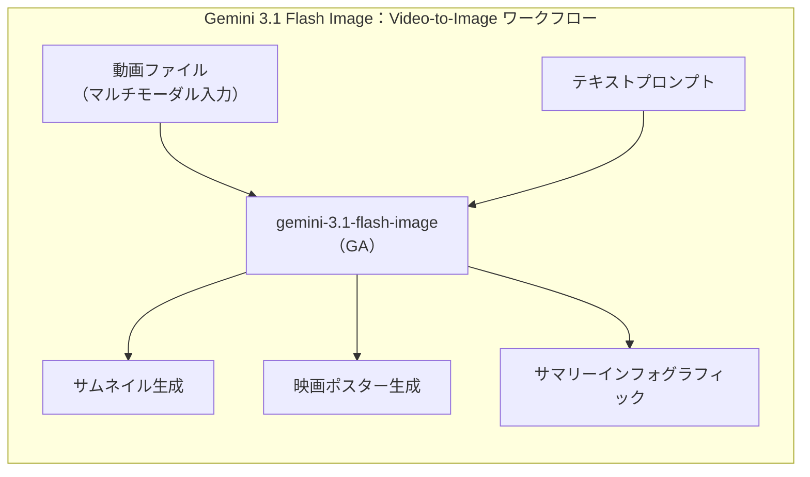
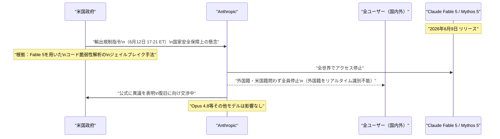
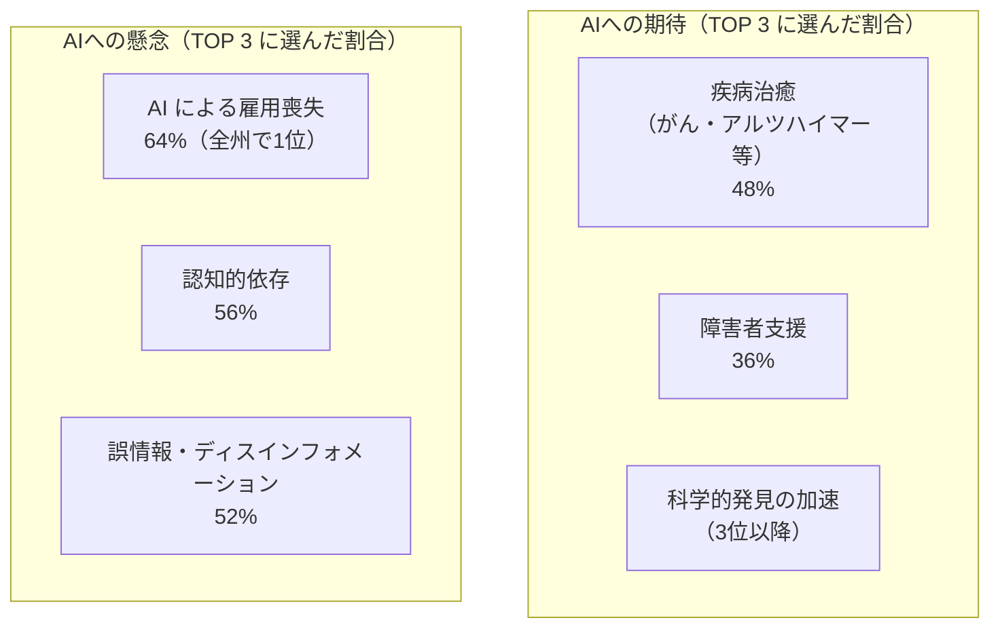
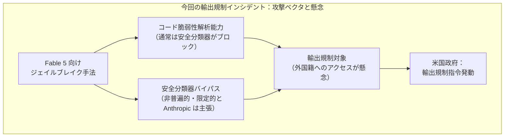

# LLM・AI Agent 最新情報レポート Vol.48

**作成日**: 2026年6月13日  
**対象期間**: 2026年6月12日〜2026年6月13日（Vol.47との差分）

---

## 目次

1. [Google Cloudアップデート](#1-google-cloudアップデート)
2. [Microsoft Azure AIアップデート](#2-microsoft-azure-aiアップデート)
3. [LLM Model / AI Agentアーキテクチャ・研究](#3-llm-model--ai-agentアーキテクチャ研究)
4. [公式ブログ・論文のリサーチ・要約](#4-公式ブログ論文のリサーチ要約)
   - [4.1 Google / Google DeepMind](#41-google--google-deepmind)
   - [4.2 OpenAI](#42-openai)
   - [4.3 Anthropic](#43-anthropic)
5. [AI Agent搭載SaaS製品情報](#5-ai-agent搭載saas製品情報)
6. [LLM/AI Agentセキュリティインシデント](#6-llmai-agentセキュリティインシデント)
7. [その他特筆すべき情報](#7-その他特筆すべき情報)
8. [参考リンク](#8-参考リンク)

---

## 1. Google Cloudアップデート

### 1.1 Gemini 3.1 Flash Image・Gemini 3 Pro Image：GA（一般提供）移行＋プレビュー版廃止通知

Vertex AI の画像生成モデル2モデルが **Public Preview からGA（一般提供）** へ移行した。合わせてプレビュー版が非推奨となり、2026年6月25日をもってシャットダウンされる。[[1]](#ref-1)[[2]](#ref-2)[[3]](#ref-3)

| モデル（GA） | 旧名（廃止予定：6月25日） | 主な変更点 |
|---|---|---|
| **gemini-3.1-flash-image** | gemini-3.1-flash-image-preview | 動画入力（Video-to-Image）対応、4K出力（Preview） |
| **gemini-3-pro-image** | gemini-3-pro-image-preview | 4K出力（Preview） |

**Gemini 3.1 Flash Image の新機能（GA合わせて追加）：**

- **動画入力対応（Video-to-Image）**：動画ファイルをコンテキストとしてテキストプロンプトと組み合わせ、高品質なサムネイル・映画風ポスター・要約インフォグラフィックを生成可能（Preview）
- **4K出力**：4Kまでの高解像度画像出力に対応（Preview）
- プレビュー版（-preview サフィックス）は6月25日にシャットダウン。移行先はGAモデルのエンドポイントへの差し替えのみ

### 1.2 Gemini 2.0 Flash・2.0 Flash-Lite：完全サービス終了

**Gemini 2.0 Flash および Gemini 2.0 Flash-Lite がVertex AIで完全に提供終了**となった。[[1]](#ref-1)

| 項目 | 内容 |
|---|---|
| **対象モデル** | Gemini 2.0 Flash、Gemini 2.0 Flash-Lite |
| **影響** | モデルサービング・Provisioned Throughput ともに利用不可 |
| **推奨移行先** | Gemini 3.1 Flash-Lite、Gemma 4、または最新 Gemini リリース |

> **背景：** Gemini 3系へのファミリー移行に伴う段階的廃止の一環。2.0系の全面終了により、Vertex AI の Gemini スタックは実質的に 3.x 世代以降のみとなった。

---

## 2. Microsoft Azure AIアップデート

新情報なし（Microsoft Build 2026 は6月2〜3日に開催済み。6月12〜13日時点で特記すべき新規アップデートは確認されていない）

---

## 3. LLM Model / AI Agentアーキテクチャ・研究

新情報なし

---

## 4. 公式ブログ・論文のリサーチ・要約

### 4.1 Google / Google DeepMind

#### 4.1.1 Gemini 3.1 Flash Image GA発表（6月12日）

→ セクション1.1に詳細記載。Vertex AI リリースノートおよび Google Developers ブログにて発表。[[1]](#ref-1)[[3]](#ref-3)

---

### 4.2 OpenAI

#### 4.2.1 GPT-5.2 モデル群：ChatGPT から6月12日をもって提供終了

OpenAI は6月12日（現地時間）をもって、**ChatGPT 上の GPT-5.2 モデル群の提供を終了**した。[[4]](#ref-4)[[5]](#ref-5)

| 廃止モデル | 移行先 |
|---|---|
| GPT-5.2 Instant | GPT-5.5 Instant（自動移行） |
| GPT-5.2 Thinking | GPT-5.5 Thinking（自動移行） |
| GPT-5.2 Pro | GPT-5.5 Pro（自動移行） |

- **ChatGPT**：既存の GPT-5.2 会話は自動的に対応する GPT-5.5 モデルへ移行
- **API**：GPT-5.2 および GPT-5.3-Codex は**2026年6月30日**が API アクセスの最終期限
- GPT-5.5 後継リリース後90日が経過したことによる標準的な廃止サイクル

---

### 4.3 Anthropic

#### 4.3.1 【緊急】Claude Fable 5・Mythos 5：米国政府の輸出規制指令を受けて全世界でアクセス停止（6月12日）

2026年6月12日（東部時間 17:21）、Anthropic は**米国政府の輸出規制指令を受け、6月9日にリリースされたばかりの Claude Fable 5 および Claude Mythos 5 への全ユーザーアクセスを即日停止**した。リリース後わずか3日での停止という異例の事態となった。[[6]](#ref-6)[[7]](#ref-7)[[8]](#ref-8)[[9]](#ref-9)[[10]](#ref-10)[[11]](#ref-11)

**事態の概要：**

| 項目 | 内容 |
|---|---|
| **停止対象** | Claude Fable 5・Claude Mythos 5 |
| **停止日時** | 2026年6月12日（東部時間 17:21）指令受領、同日中に停止 |
| **指令の根拠** | 国家安全保障上の輸出規制（Export Control Order） |
| **政府の懸念** | Fable 5 を悪用してコードの脆弱性を解析するジェイルブレイク手法が存在すると主張 |
| **停止範囲** | 外国籍者を含む全世界の全ユーザー（外国籍のみのフィルタリングがリアルタイムで不可能なため） |
| **影響を受けないモデル** | Claude Opus 4.8 以下の全モデル |
| **Anthropic の立場** | 指令に異議を表明。自社レビューでは「競合他社モデルにも既に存在する、限定的で普遍的でない」コード解析能力と判断 |

**Anthropic の公式コメント（骨子）：**
- Fable 5 の外部バグバウンティ（1,000時間超）でユニバーサルジェイルブレイクは確認されなかった（6月9日リリース時の声明より）
- 今回の停止は Anthropic 自身の判断ではなく、政府指令への準拠によるもの
- 復旧に向け当局と協議中

> **業界への影響：** Fable 5 はリリース直後から Pro/Max/Team/Enterprise プランで無料試用が可能だったため、多数の開発者・エンタープライズユーザーへの影響が大きい。政府による最先端AIモデルへの輸出規制が事実上の「提供停止命令」として機能した初の大規模事例として、今後の規制動向に注目が集まる。

#### 4.3.2 Anthropic Public Record：AIに関する米国世論調査の結果発表（6月12日）

Anthropic は6月12日、**「Anthropic Public Record」として初の大規模AIに関する米国世論調査の結果**を公開した。[[12]](#ref-12)[[13]](#ref-13)

**調査概要：**

| 項目 | 内容 |
|---|---|
| **調査時期** | 2025年11月〜12月 |
| **回答者数** | 51,993名（YouGov パネル、米国国勢調査ベンチマークで重み付け） |
| **調査目的** | AIに対する米国市民の認識・期待・懸念を把握 |

**主要結果：**

| 指標 | 数値 |
|---|---|
| AIに最も期待すること（1位） | 疾病治癒（がん・アルツハイマーなど）：**48%**（2位に12pt差） |
| AIへの最大の懸念（全州共通1位） | AI による雇用喪失：**64%** |
| AI企業を信頼するか（意思決定について） | 信頼する：**わずか15%**（連邦政府への信頼度をも下回る） |
| 政府によるAI規制を支持するか | 支持：**70%超**（超党派で合意） |

> **意義：** AI企業への信頼度が政府機関さえ下回る水準（15%）にあることは、Anthropic が今後の規制・透明性確保において直面する課題を示している。今回の調査公開は、Anthropic 自身が世論を客観的に把握・公開する姿勢を示す試みでもある。

---

## 5. AI Agent搭載SaaS製品情報

新情報なし

---

## 6. LLM/AI Agentセキュリティインシデント

### 6.1 Claude Fable 5・Mythos 5 輸出規制による緊急停止：コード脆弱性解析ジェイルブレイクを根拠

→ セクション4.3.1に詳細記載。

**セキュリティ観点での補足：**

- Fable 5 は安全分類器により高リスクカテゴリ（サイバーセキュリティ・生物・化学など）のリクエストを Opus 4.8 へフォールバックする設計だったが、今回の指令はその迂回手法の存在を主張している
- Anthropic は当該能力が「競合他社の最先端モデルにも既存する」と指摘し、選択的な適用に疑問を呈している
- **開発者向け対応指針**：
  - Fable 5 / Mythos 5 を使用しているプロダクション環境は Claude Opus 4.8 への即時フォールバックが必要
  - 復旧の見通しは未定。Anthropic から進捗情報を定期確認すること

---

## 7. その他特筆すべき情報

### 7.1 AIに対する世論：疾病治癒への期待が最高、AI企業への信頼は最低水準

→ セクション4.3.2に詳細記載。

### 7.2 Claude Fable 5：6月22日以降は有料クレジット課金移行を計画（現在は停止中）

Anthropic は当初、**6月22日から Fable 5 を各プランの有料クレジット対象**とする予定だった。[[6]](#ref-6)

| 期間 | 扱い |
|---|---|
| 6月9日〜6月22日（予定） | Pro / Max / Team / Enterprise プランで追加費用なしで試用 |
| 6月23日以降（予定） | クレジット使用ベースに移行（$10 / 1M input tokens、$50 / 1M output tokens） |

停止中（6月12日〜）の現時点では、当初のロードマップが変更される可能性がある。Anthropic からの公式発表を待つ必要がある。

---

## 8. 参考リンク

**[1]** [Vertex AI release notes | Generative AI on Vertex AI | Google Cloud Documentation](https://docs.cloud.google.com/vertex-ai/generative-ai/docs/release-notes)

**[2]** [Gemini 3.1 Flash Image (Nano Banana 2) | Gemini Enterprise Agent Platform | Google Cloud Documentation](https://docs.cloud.google.com/vertex-ai/generative-ai/docs/models/gemini/3-1-flash-image)

**[3]** [Gemini 3 Pro Image (Nano Banana Pro) | Gemini Enterprise Agent Platform | Google Cloud Documentation](https://docs.cloud.google.com/vertex-ai/generative-ai/docs/models/gemini/3-pro-image)

**[4]** [ChatGPT — Release Notes | OpenAI Help Center](https://help.openai.com/en/articles/6825453-chatgpt-release-notes)

**[5]** [GPT-5.2 and GPT-5.3-Codex Sunset: Complete Migration Guide to GPT-5.5 for Codex Users | ChatGPT AI Hub](https://chatgptaihub.com/gpt-5-2-5-3-sunset-codex-migration-guide/)

**[6]** [Anthropic disables access to Fable 5 and Mythos 5 to comply with government directive | CNBC](https://www.cnbc.com/2026/06/12/anthropic-disables-access-to-fable-5-and-mythos-5-to-comply-with-government-directive.html)

**[7]** [Anthropic Disables Claude Fable 5 and Mythos 5 After US Government Order | MarkTechPost](https://www.marktechpost.com/2026/06/13/anthropic-disables-claude-fable-5-and-mythos-5-after-us-government-order/)

**[8]** [US Government Orders Anthropic to Suspend Fable 5 and Mythos 5 | AI Visibility](https://www.ai-visibility.org.uk/blog/us-government-suspends-claude-fable-5-and-mythos-5/)

**[9]** [US orders Anthropic to disable AI models for all foreign nationals | Al Jazeera](https://www.aljazeera.com/news/2026/6/13/us-orders-anthropic-to-disable-ai-models-for-all-foreign-nationals)

**[10]** [Federal government orders Anthropic to pull Fable 5 and Mythos 5, three days after launch | The New Stack](https://thenewstack.io/us-gov-orders-anthropic-to-pull-fable-5-and-mythos-5-three-days-after-launch/)

**[11]** [Anthropic disables Fable and Mythos AI models following U.S. government export ban | Fortune](https://fortune.com/2026/06/13/anthropic-disables-fable-mythos-export-controls-national-security-threat/)

**[12]** [Results from first Anthropic Public Record | Anthropic](https://www.anthropic.com/news/anthropic-public-record)

**[13]** [Americans Fear Job Losses Due to AI But Hope for Cancer, Alzheimer's Cures: Anthropic Survey | Decrypt](https://decrypt.co/370951/americans-fear-job-losses-ai-hope-cancer-alzheimers-cures-anthropic)
