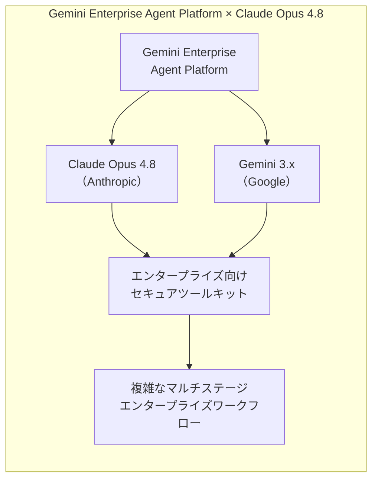
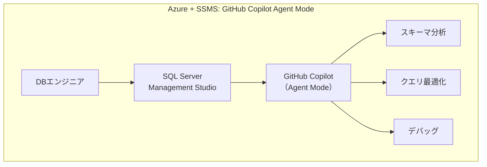
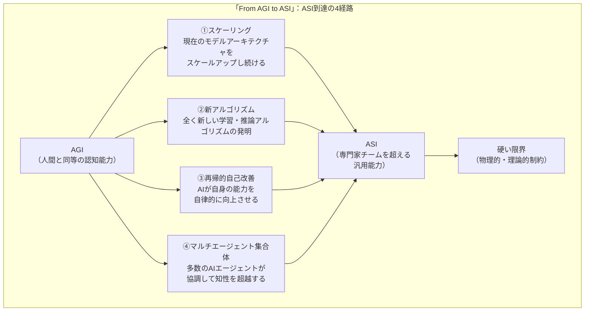
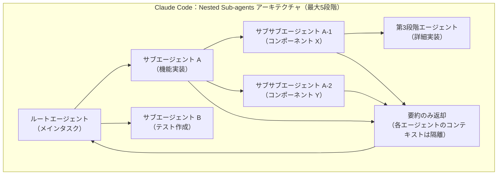
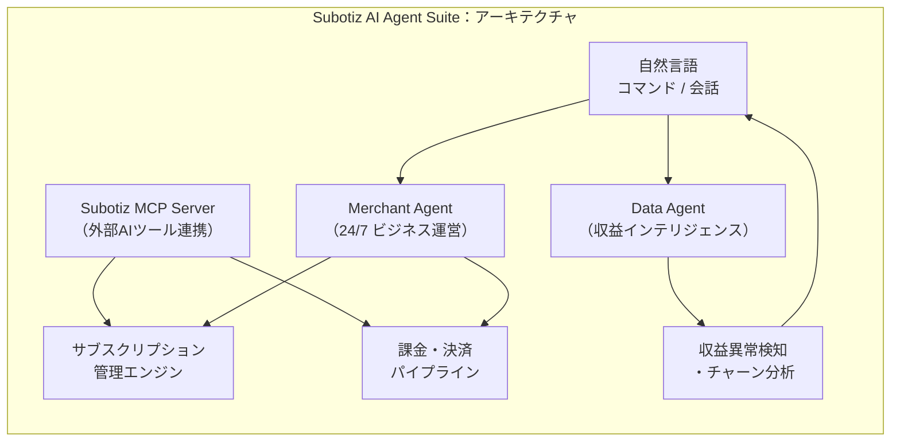
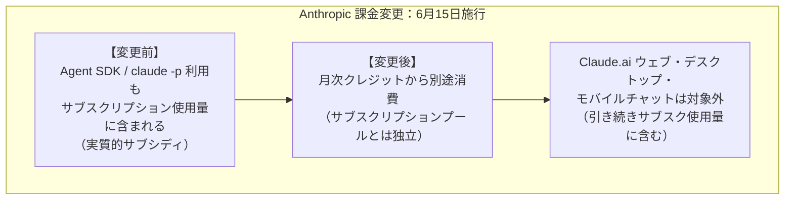

# LLM・AI Agent 最新情報レポート Vol.49

**作成日**: 2026年6月14日  
**対象期間**: 2026年6月13日〜2026年6月14日（Vol.48との差分）

---

## 目次

1. [Google Cloudアップデート](#1-google-cloudアップデート)
2. [Microsoft Azure AIアップデート](#2-microsoft-azure-aiアップデート)
3. [LLM Model / AI Agentアーキテクチャ・研究](#3-llm-model--ai-agentアーキテクチャ研究)
4. [公式ブログ・論文のリサーチ・要約](#4-公式ブログ論文のリサーチ要約)
   - [4.1 Google / Google DeepMind](#41-google--google-deepmind)
   - [4.2 OpenAI](#42-openai)
   - [4.3 Anthropic](#43-anthropic)
5. [AI Agent搭載SaaS製品情報](#5-ai-agent搭載saas製品情報)
6. [LLM/AI Agentセキュリティインシデント](#6-llmai-agentセキュリティインシデント)
7. [その他特筆すべき情報](#7-その他特筆すべき情報)
8. [参考リンク](#8-参考リンク)

---

## 1. Google Cloudアップデート

### 1.1 Gemini Enterprise Agent Platform：Claude Opus 4.8 が正式提供開始

Gemini Enterprise Agent Platform の **Model Garden** に、Anthropic の **Claude Opus 4.8 が正式追加**された。[[1]](#ref-1)[[2]](#ref-2)

| 項目 | 内容 |
|---|---|
| **モデル名** | Claude Opus 4.8（`claude-opus-4-8`） |
| **提供プラットフォーム** | Gemini Enterprise Agent Platform（Model Garden） |
| **廃止予定日** | 2027年5月28日以降（余裕あり） |
| **主な用途** | 高度なコーディングエージェント・システムエンジニアリング・マルチステップデバッグ |

**企業が得られるメリット：**

- Google Cloud のセキュリティ・コンプライアンス基盤上で Claude Opus 4.8 を利用可能
- フルコンテキスト維持機能を持つ高度エージェントの構築・デプロイに対応
- Google と Anthropic の両フロンティアモデルを単一プラットフォーム上で選択可能になった

### 1.2 Document AI：Layout Parser v1.6（Gemini 3 Flash LLM搭載）がパブリックプレビュー

Document AI に **Layout Parser v1.6（`pretrained-layout-parser-v1.6-2026-01-13`）** が追加され、パブリックプレビューで利用可能となった。[[3]](#ref-3)

| 項目 | 内容 |
|---|---|
| **モデル** | `pretrained-layout-parser-v1.6-2026-01-13` |
| **搭載LLM** | Gemini 3 Flash（MLプロセシング能力） |
| **ステータス** | パブリックプレビュー |
| **提供リージョン** | US・EU |

- レイアウト解析にGemini 3 Flash を活用し、従来より高精度なドキュメント構造認識を実現

### 1.3 【注意喚起】6月30日廃止デッドライン：Document AI レガシープロセッサ・Veo 3.0系モデル

2026年6月30日に複数の廃止がまとめて適用される。該当製品を利用中の開発者は**残り2週間**で移行が必要。[[3]](#ref-3)[[4]](#ref-4)

| 廃止対象 | 廃止日 | 推奨移行先 |
|---|---|---|
| **Document AI レガシープロセッサ** | 2026年6月30日 | 最新安定版プロセッサへ移行 |
| **veo-3.0-generate-001** | 2026年6月30日 | `veo-3.1-generate-001` |
| **veo-3.0-fast-generate-001** | 2026年6月30日 | `veo-3.1-generate-001` |
| **veo-2.0-generate-001** | 2026年6月30日 | `veo-3.1-generate-001` |

> **注意:** Document AI レガシープロセッサの移行を行わない場合、6月30日以降はサービス障害が発生する可能性がある。Veo については `veo-3.1-generate-001`（公式GA版）または `veo-3.1-lite`（Lite版、コスト効率重視）への移行が推奨される。

---

## 2. Microsoft Azure AIアップデート

### 2.1 Azure Update（6月12日）：SSMS に GitHub Copilot Agent Mode がプレビューで追加

**SQL Server Management Studio（SSMS）が GitHub Copilot Agent Mode をパブリックプレビューで取得**した。6月12日付けの Azure 一括アップデートの一部として発表。[[5]](#ref-5)

| 機能 | 内容 |
|---|---|
| **GitHub Copilot Agent Mode（SSMS）** | SSMS から GitHub Copilot のエージェントモードを直接利用可能に。DBスキーマ分析・クエリ最適化・デバッグを自律エージェントとして実行 |
| **ステータス** | パブリックプレビュー |

> **背景:** Microsoft Build 2026（6月2〜3日）での GitHub Copilot Agent Mode 強化発表を受け、SSMS という SQL DBA の主力ツールにもエージェント機能が拡張された。データベース関連業務のAI自動化がエンタープライズ環境に浸透し始めている。

### 2.2 Azure AI Foundry Hosted Agents：7月上旬 GA 予定

**Azure AI Foundry の Hosted Agents が7月上旬の GA（一般提供）に向けて準備中**であることが確認された。[[6]](#ref-6)

| 項目 | 内容 |
|---|---|
| **機能** | 各セッションが専用コンピュート・メモリ・ファイルシステムを持つサンドボックスで動作 |
| **特徴** | フレームワーク非依存（Microsoft Agent Framework・LangGraph・GitHub Copilot SDK 等）|
| **GA予定** | 2026年7月上旬 |
| **現状** | パブリックプレビュー |

- トレーシング・評価機能は**6月中にGA予定**（Hosted Agents より先行）
- セキュアなサンドボックス環境で長時間・複数ステップのエージェントタスクを本番運用可能にする

---

## 3. LLM Model / AI Agentアーキテクチャ・研究

### 3.1 Google DeepMind 論文「From AGI to ASI」（arXiv 2606.12683）：AGIからASIへの4つの経路

Google DeepMind が6月、**AGI（汎用人工知能）から ASI（超知性）への移行経路を体系的に分析した60ページの研究論文「From AGI to ASI」** を arXiv に公開した。著者には Marcus Hutter（AIXI モデルの創案者）と Shane Legg（DeepMind共同創設者・AGIという概念の普及に貢献）が含まれる。[[7]](#ref-7)[[8]](#ref-8)[[9]](#ref-9)

**主要な定義と知見：**

| 概念 | 定義 |
|---|---|
| **AGI** | 大多数の認知タスクにおいて「中央値の人間」とほぼ同等の能力を持つシステム |
| **ASI** | ほぼすべてのタスクにおいて「大規模な専門家チーム」を超える能力を持つシステム |
| **4つの経路** | 相互排他的ではなく、実際の ASI 到達は複数経路の組み合わせによる可能性が高い |
| **「硬い限界」** | 物理法則・計算理論的制約が ASI の限界を規定するという洞察（「何が ASI に許されないか」も論考） |

> **業界的意義：** Fable 5 / Mythos 5 への政府介入が起きた直後のタイミングで、DeepMind が「ASI への道筋」を公に論じた点は注目に値する。マルチエージェント集合体（経路④）は Vol.46 で報告した DeepMind の $10M 安全性研究投資と直結する研究方向である。

---

## 4. 公式ブログ・論文のリサーチ・要約

### 4.1 Google / Google DeepMind

#### 4.1.1 「From AGI to ASI」論文公開（6月公開、6月13日に広範に報道）

→ セクション3.1に詳細記載。[[7]](#ref-7)[[8]](#ref-8)[[9]](#ref-9)

---

### 4.2 OpenAI

新情報なし（6月13〜14日時点で特記すべき新規発表なし）

---

### 4.3 Anthropic

#### 4.3.1 Claude Code：Nested Sub-agents（ネスト型サブエージェント）最大5段階深度に対応

Claude Code のリード Boris Cherny が、**Nested Sub-agents（ネスト型サブエージェント）機能** を Claude Code に追加した。[[10]](#ref-10)[[11]](#ref-11)[[12]](#ref-12)

**機能詳細：**

| 項目 | 内容 |
|---|---|
| **最大深度** | 5段階（depth=5、フィードバック収集後に拡張予定） |
| **コンテキスト隔離** | 各サブエージェントは独自のウィンドウで動作し、**要約のみ**を親エージェントへ返却 |
| **解決する課題** | 大規模コードベースや複雑なデバッグセッションで、これまでフラットにせざるを得なかった委譲を階層化できる |
| **バグ修正** | 停止済みのネストエージェントがエージェントパネルで「アクティブ」のまま残るバグを修正 |

**その他の同時更新内容：**
- スマートなモデル・リージョン自動選択ハンドリング
- 新プラグイン検索機能
- Chrome・VS Code・ターミナルワークフローの改善
- セッション・モデルピッカー・メモリ・パーミッション・UI の各種バグ修正

> **アーキテクチャ的示唆：** ネスト型サブエージェントは、大規模コードベースをオーケストレーターが細分化し、リーフエージェントが担当部分を集中的に処理するパターンを可能にする。エージェント間のコンテキスト伝播を「要約のみ」に絞ることで、コンテキストウィンドウの爆発的拡大を抑制しつつ、複雑タスクの自律実行を実現する設計思想が読み取れる。

---

## 5. AI Agent搭載SaaS製品情報

### 5.1 Subotiz：AI Agent Suite と MCP Server をローンチ（6月12日）——サブスクリプションコマースの自然言語自動化

AI 駆動のサブスクリプションコマース基盤プロバイダー **Subotiz** が、6月12日に **AI Agent Suite** および **Subotiz MCP Server** を正式リリースした。[[13]](#ref-13)[[14]](#ref-14)

**2つの中核エージェント：**

| エージェント | 機能 |
|---|---|
| **Merchant Agent** | 自然言語によるマルチターン会話でサブスクリプション製品の新規作成・価格プラン変更・ビジネス設定の更新を実行。メニュー操作不要 |
| **Data Agent** | 収益の異常検知・チャーンや取引減少の根本原因分析・サブスクリプションパターンの深掘り・視覚的な改善戦略の提示を自律実行（静的レポートを超えた能動的分析） |

**Subotiz MCP Server：**
- エンジニアが外部AIツールから Subotiz の課金・開発パイプラインに**自然言語コマンドで接続**可能
- 顧客プロファイル照会・価格プラン調整・Webhookイベントログ監査・返金履歴確認・ドキュメント検索を自然言語で実行

> **市場的意義：** GenAI時代に「製品の構築は高速化・低コスト化されたが、商業化フェーズ（サブスクリプション設定・決済ゲートウェイ・データ監査・APIデバッグ）は依然として複雑」という課題に直接対応。AIエージェントがEコマースのバックオフィス全体を自然言語で操作できる「エージェント型コマース」の具体的実装例として注目される。

---

## 6. LLM/AI Agentセキュリティインシデント

新情報なし（6月13〜14日時点で特記すべき新規インシデントは確認されていない）

---

## 7. その他特筆すべき情報

### 7.1 【明日施行】Anthropic 課金変更（6月15日）：Agent SDK がサブスクリプションから分離

**明日（2026年6月15日）より、Claude Agent SDK / `claude -p` の利用がサブスクリプションの使用量プールから分離**される。[[15]](#ref-15)[[16]](#ref-16)

**変更の詳細：**

| 項目 | 内容 |
|---|---|
| **対象** | Claude Agent SDK・`claude -p` CLI・Claude Code GitHub Actions・Agent SDK上のサードパーティアプリ |
| **対象外** | Claude.ai ウェブ・デスクトップ・モバイルでのチャット・ターミナル/IDEからのClaude Code |
| **月次クレジット額** | Pro: $20 / Max 5x: $100 / Max 20x: $200 |
| **クレジット枯渇後** | 「usage credits」有効化時 → API通常料金で継続 / 無効化時 → クレジット更新まで停止 |
| **クレジット特性** | ユーザー単位（チーム間プール不可）・翌月繰越なし・初回1度のみ手動クレーム必要 |

**開発者向けアクション（明日までに要対応）：**
1. Claude アカウントからクレジットを「クレーム」（初回1回のみ必要）
2. クレジット枯渇後も継続利用したい場合は「usage credits」を有効化
3. チームプランは**ユーザー個別クレジット**であることを確認（管理者が一括設定不可）

### 7.2 Claude Fable 5 / Mythos 5 復旧交渉：継続中

6月12日の輸出規制停止措置（Vol.48で詳報）以降、Anthropic と米国政府との協議が継続中。[[17]](#ref-17)

- Anthropic の現在の立場：輸出規制指令に異議を表明しつつ、当局と「修正セーフガード下での復旧」に向けて協議中
- 復旧時期は未定。Anthropic の公式チャンネルをモニタリングすることを推奨
- 現時点では Claude Opus 4.8 以下のモデルは影響なし（API・全プランで引き続き利用可能）

---

## 8. 参考リンク

**[1]** [Claude Opus 4.8 | Gemini Enterprise Agent Platform | Google Cloud Documentation](https://docs.cloud.google.com/gemini-enterprise-agent-platform/models/partner-models/claude/opus-4-8)

**[2]** [Google Cloud Partners：Claude Opus 4.8 is now live on the Gemini Enterprise Agent Platform | X（旧Twitter）](https://x.com/gcloudpartners/status/2060058527939342711)

**[3]** [Document AI release notes | Google Cloud Documentation](https://docs.cloud.google.com/document-ai/docs/release-notes)

**[4]** [Gemini Enterprise Agent Platform release notes | Google Cloud Documentation](https://docs.cloud.google.com/gemini-enterprise-agent-platform/release-notes)

**[5]** [Azure Update 12th June 2026 | Hubsite365](https://www.hubsite365.com/en-ww/crm-pages/azure-update-12th-june-2026-847f9715-8334-49da-bde4-a5a317fff3d2.htm)

**[6]** [Hosted agents in Foundry Agent Service (preview) - Microsoft Foundry | Microsoft Learn](https://learn.microsoft.com/en-us/azure/foundry/agents/concepts/hosted-agents)

**[7]** [[2606.12683] From AGI to ASI | arXiv](https://arxiv.org/abs/2606.12683)

**[8]** [Google DeepMind Maps the Road From AGI to Superintelligence: Four Paths and Hard Limits | TechTimes](https://www.techtimes.com/articles/318343/20260613/google-deepmind-maps-road-agi-superintelligence-four-paths-hard-limits.htm)

**[9]** [Google DeepMind Maps Four Routes From Human-Level AI to Superintelligence | The AI Insider](https://theaiinsider.tech/2026/06/13/google-deepmind-maps-four-routes-from-human-level-ai-to-superintelligence/)

**[10]** [Boris Cherny, Claude Code lead at Anthropic, releases nested subagent support | Digg](https://digg.com/ai/megudrsi)

**[11]** [Claude Code Nested Subagents: 5 Levels Deep | claudefa.st](https://claudefa.st/blog/guide/agents/nested-subagents)

**[12]** [Claude Code Updates by Anthropic - June 2026 | Releasebot](https://releasebot.io/updates/anthropic/claude-code)

**[13]** [Subotiz Launches AI Agent Suite and MCP Server to Democratize Subscription Commerce for the GenAI and SaaS Era | PR Newswire](https://www.prnewswire.com/news-releases/subotiz-launches-ai-agent-suite-and-mcp-server-to-democratize-subscription-commerce-for-the-genai-and-saas-era-302798991.html)

**[14]** [Subotiz Launches AI Agent Suite and MCP Server to Democratize Subscription Commerce for the GenAI and SaaS Era | The AI Journal](https://aijourn.com/subotiz-launches-ai-agent-suite-and-mcp-server-to-democratize-subscription-commerce-for-the-genai-and-saas-era/)

**[15]** [Anthropic Ends Subscription Subsidy for Agents June 15: Credit Pool Replaces Flat-Rate Access | TechTimes](https://www.techtimes.com/articles/317625/20260602/anthropic-ends-subscription-subsidy-agents-june-15-credit-pool-replaces-flat-rate-access.htm)

**[16]** [Anthropic splits billing again: Agent SDK gets separate credit pools | The New Stack](https://thenewstack.io/anthropic-agent-sdk-credits/)

**[17]** [Why US has restricted foreign access to Anthropic's Claude Fable 5, Mythos | Business Standard](https://www.business-standard.com/technology/tech-news/us-anthropic-claude-fable-5-mythos-access-restricted-ai-export-controls-126061400194_1.html)
