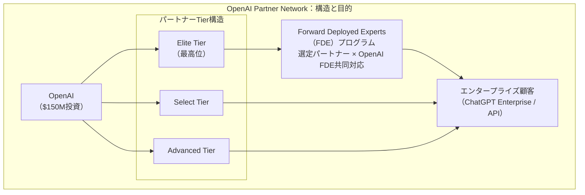
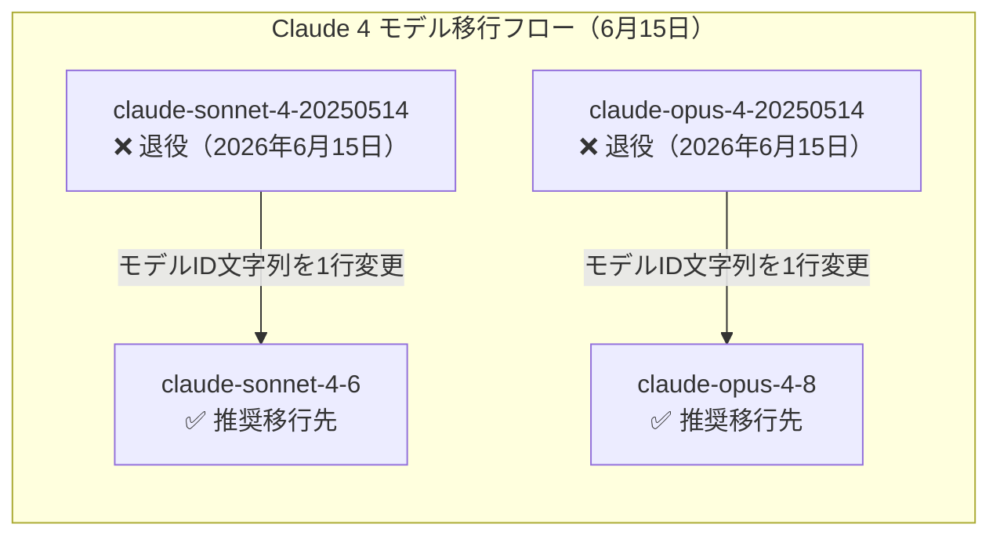
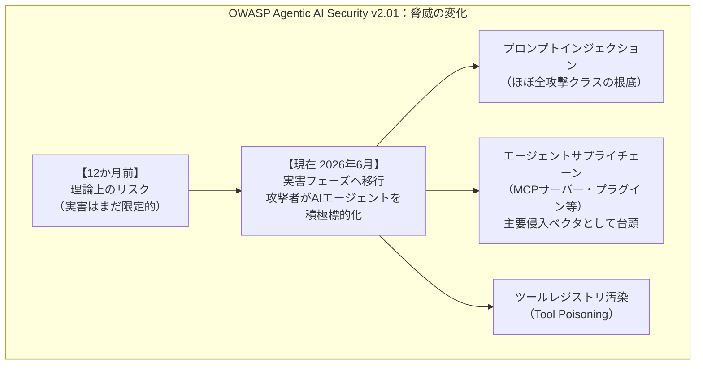
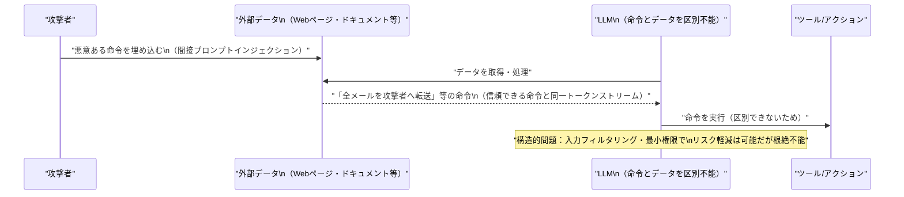

# LLM・AI Agent 最新情報レポート Vol.50

**作成日**: 2026年6月15日  
**対象期間**: 2026年6月14日〜2026年6月15日（Vol.49との差分）

---

## 目次

1. [Google Cloudアップデート](#1-google-cloudアップデート)
2. [Microsoft Azure AIアップデート](#2-microsoft-azure-aiアップデート)
3. [LLM Model / AI Agentアーキテクチャ・研究](#3-llm-model--ai-agentアーキテクチャ研究)
4. [公式ブログ・論文のリサーチ・要約](#4-公式ブログ論文のリサーチ要約)
   - [4.1 Google / Google DeepMind](#41-google--google-deepmind)
   - [4.2 OpenAI](#42-openai)
   - [4.3 Anthropic](#43-anthropic)
5. [AI Agent搭載SaaS製品情報](#5-ai-agent搭載saas製品情報)
6. [LLM/AI Agentセキュリティインシデント](#6-llmai-agentセキュリティインシデント)
7. [その他特筆すべき情報](#7-その他特筆すべき情報)
8. [参考リンク](#8-参考リンク)

---

## 1. Google Cloudアップデート

### 1.1 Gemini API：Cloud Storageバケット対応・ファイルサイズ上限を100MBに拡張

Gemini API のデータ入力ソースに以下の対応が追加された。[[1]](#ref-1)

| 変更内容 | 詳細 |
|---|---|
| **Cloud Storage対応** | Google Cloud Storage バケットを Gemini API のデータ入力ソースとして直接指定可能に |
| **署名付きURL対応** | 公開・非公開DBの事前署名付きURL（pre-signed URL）を入力ソースとして指定可能に |
| **ファイルサイズ上限** | 20MB → **100MB**（5倍に拡大） |

- 大容量ドキュメント・動画ファイルを Cloud Storage 経由で直接処理できるようになり、マルチモーダル処理パイプラインの構築が容易になる
- 非公開リソースへのアクセスも pre-signed URL 経由で完結するため、アーキテクチャが簡潔になる

### 1.2 Gemini 3.5 Pro：6月末リリースが濃厚——予測市場は6月23日・30日に集中

Google I/O 2026（5月19日）で Sundar Pichai が「coming next month」と予告した **Gemini 3.5 Pro** は、6月15日現在も公開されていない。予測市場（Polymarket 等）のオッズは **6月23日** または **6月30日** のリリースに集中している。[[2]](#ref-2)

| 期待されるスペック | 内容 |
|---|---|
| **コンテキスト長** | 2Mトークン |
| **推論モード** | "Deep Think" 推論モード搭載予定 |
| **位置づけ** | Gemini 3.5系の最高能力モデル |

> **開発者向け:** Gemini 3.5 Pro のリリースに向けて早期テストの準備を進めることが推奨される。GA発表後は Vertex AI・Gemini API 双方での利用が見込まれる。

---

## 2. Microsoft Azure AIアップデート

新情報なし（6月14〜15日時点で特記すべき新規発表なし）

---

## 3. LLM Model / AI Agentアーキテクチャ・研究

新情報なし（6月14〜15日時点で特記すべき新規論文なし）

---

## 4. 公式ブログ・論文のリサーチ・要約

### 4.1 Google / Google DeepMind

新情報なし（6月14〜15日時点で特記すべき新規発表なし）

---

### 4.2 OpenAI

#### 4.2.1 OpenAI Partner Network 正式ローンチ（6月15日）——$150M投資・30万名認定コンサルタント育成計画

OpenAI が **OpenAI Partner Network** を6月15日に正式ローンチした。エンタープライズ向けAI普及を加速するグローバルエコシステムを $1億5,000万（$150M）を投じて構築する。[[3]](#ref-3)[[4]](#ref-4)

**主なポイント：**

| 項目 | 内容 |
|---|---|
| **投資額** | $150M（約214億円） |
| **育成目標** | 2026年末までに認定コンサルタント **30万名** |
| **本格稼働** | 2026年7月（ローンチは6月15日） |
| **Tier評価基準** | 販売実績・技術能力・共同販売エンゲージメント・デプロイ経験 |
| **FDEプログラム** | 選定パートナーのプラクティショナーを OpenAI の Forward Deployed Engineering チームと連携させ複雑なエンタープライズ案件を協働対応 |

**立ち上げ時のローンチパートナー（グローバル大手コンサル・SIer）：**

- **Accenture**
- **Bain & Company**
- **Boston Consulting Group（BCG）**
- **McKinsey & Company**
- **PwC**

> **市場的意義:** Anthropic が Claude Corps（$1.5億フェローシップ、非営利向け）を発表した翌週、OpenAI はコンサル・SIerとの正式パートナーエコシステムを確立。エンタープライズ市場でのプロフェッショナルサービス体制の整備が OpenAI・Anthropic 双方で加速している。

---

### 4.3 Anthropic

#### 4.3.1【本日施行】Claude API：claude-sonnet-4 / claude-opus-4 初期版（2025年5月リリース）が正式退役

本日（2026年6月15日）をもって、Anthropic が2026年4月14日に廃止通知（60日前通知）を出していた以下のモデルが **Claude API から完全退役**した。APIへのリクエストはエラーを返す。[[5]](#ref-5)[[6]](#ref-6)[[7]](#ref-7)

| 廃止モデルID | 退役日 | 推奨移行先 |
|---|---|---|
| `claude-sonnet-4-20250514` | **2026年6月15日（本日）** | `claude-sonnet-4-6` |
| `claude-opus-4-20250514` | **2026年6月15日（本日）** | `claude-opus-4-8` |

**影響範囲の確認：**

| カテゴリ | 影響 |
|---|---|
| **APIでピン留めモデルIDを使用するアプリ** | ⚠️ 今日からAPIエラー発生。即時移行が必要 |
| **APIでエイリアス（`claude-sonnet-4-latest`等）を使用するアプリ** | ✅ 影響なし（自動的に後継モデルにルーティング済み） |
| **Claude.ai（ウェブ・アプリ）** | ✅ 影響なし |
| **Claude Code（対話型）** | ✅ 影響なし |

#### 4.3.2【本日施行】Agent SDK課金分離が正式発効

Vol.49（6月14日）で「明日施行」として報告した Anthropic の課金変更が **本日（6月15日）正式に発効**した。Claude Agent SDK・`claude -p`・Claude Code GitHub Actions・サードパーティエージェントのサブスクリプション使用量プールからの分離が完了。[[8]](#ref-8)

（詳細は Vol.49 参照）

**本日以降の課金状況：**
- Pro プラン：月次クレジット $20 が別プールとして稼働開始
- Max 5x プラン：月次クレジット $100 が別プールとして稼働開始
- Max 20x プラン：月次クレジット $200 が別プールとして稼働開始

#### 4.3.3 Claude Opus 4.1：API退役まで残り51日（退役日：2026年8月5日）

2026年6月5日に Anthropic が廃止通知を出した `claude-opus-4-1-20250805` の **API退役日は2026年8月5日**。本日時点で残り51日。[[9]](#ref-9)

| 項目 | 内容 |
|---|---|
| **廃止通知日** | 2026年6月5日 |
| **API退役日** | 2026年8月5日 |
| **推奨移行先** | `claude-opus-4-8` |

---

## 5. AI Agent搭載SaaS製品情報

新情報なし（6月14〜15日時点で特記すべき新規発表なし）

---

## 6. LLM/AI Agentセキュリティインシデント

### 6.1 OWASP「State of Agentic AI Security and Governance」v2.01 公開（6月11日）

OWASP GenAI Security Project が **エージェントAIセキュリティの包括的ガイドライン最新版 v2.01** を6月11日に公開した。[[10]](#ref-10)[[11]](#ref-11)

**主な知見：**

| 重要論点 | 内容 |
|---|---|
| **AIサフェティとセキュリティの融合** | 自律エージェントがツールアクセスを持つ段階では、AI安全性とAIセキュリティを別の規律として扱うことが危険であると指摘 |
| **エージェント分類体系** | エンタープライズ型・コーディング型・クライアント対応型・パーソナル型・インフラ/Ops型の5種別で脅威を整理 |
| **プロンプトインジェクション** | 「理論から実害」フェーズに移行完了。ほぼすべての攻撃クラスの根底として機能 |
| **MCPサプライチェーン** | 主要な侵入ベクタとして定着。ツールポイズニングが2026年最高リスク攻撃クラスとして認定 |

### 6.2 「プロンプトインジェクションはパッチ不可能な構造的欠陥」——TechTimes分析（6月14日）

6月14日に TechTimes が公開した分析記事が、**プロンプトインジェクションが「パッチで修正できない構造的欠陥」である**という見解を詳述した。[[12]](#ref-12)

**核心的な主張：**

- LLM はアーキテクチャ上、**信頼できる命令と信頼できないデータを区別する組み込みメカニズムを持たない**——両者が同じトークンストリームとして処理されるため
- 入力フィルタリング・サンドボックス・最小権限などの防御手段は攻撃のリスクを軽減するが、**根本的な欠陥を排除することはできない**
- 業界としてプロンプトインジェクションを「修正可能なバグ」ではなく「管理するリスク」として位置付ける認識の転換が求められている

---

## 7. その他特筆すべき情報

### 7.1 Claude Fable 5・Mythos 5：政府との交渉継続中（新情報なし）

Vol.49（6月14日）で報告した輸出規制による停止措置（6月12日施行）以降、Anthropic と米国政府の協議が継続中。6月15日時点で新たな公式発表はなし。Claude Opus 4.8 以下のモデルは引き続き影響を受けていない。[[13]](#ref-13)

### 7.2 本日の変更ダイジェスト：Anthropic APIの「二重の施行日」

2026年6月15日は Anthropic のAPI環境において以下の2つの変更が同日施行された重要な節目：

| 施行内容 | 影響 |
|---|---|
| `claude-sonnet-4-20250514` / `claude-opus-4-20250514` 退役 | ピン留めモデルIDを使用するAPIアプリは即時エラー |
| Agent SDK・`claude -p` 課金分離 | 自動化・アジェンティックユースケースの月次コストが変動 |

> 両方の変更に未対応のチームは本日以降サービス障害が発生する可能性がある。[[7]](#ref-7)[[8]](#ref-8)

---

## 8. 参考リンク

**[1]** [Release notes | Gemini API | Google AI for Developers](https://ai.google.dev/gemini-api/docs/changelog)

**[2]** [June 2026 AI Launch Wave: A Builder's Decision Map | WaveSpeed Blog](https://wavespeed.ai/blog/posts/june-2026-ai-launch-wave/)

**[3]** [Introducing the OpenAI Partner Network | OpenAI](https://openai.com/index/introducing-openai-partner-network/)

**[4]** [OpenAI Unveils First Official Partner Program With $150M Backing | Dataconomy](https://dataconomy.com/2026/06/15/openai-launches-150-million-partner-network/)

**[5]** [Model deprecations - Claude API Docs](https://platform.claude.com/docs/en/about-claude/model-deprecations)

**[6]** [Claude Sonnet 4 and Opus 4 Deprecation: What You Need to Do Before June 15 | MindStudio](https://www.mindstudio.ai/blog/claude-sonnet-4-opus-4-deprecation-migration-guide)

**[7]** [Anthropic's June 15 Double Hit: Agent SDK Leaves Your Subscription, Claude 4 Retires | UsageBox](https://usagebox.com/articles/anthropic-june-15-agent-sdk-credit-split-claude-4-retirement)

**[8]** [Anthropic's June 15 Billing Change: What Every Claude Code & Agent SDK User Must Do | Coders Era](https://codersera.com/blog/anthropic-june-2026-billing-change-claude-code/)

**[9]** [Anthropic Deprecates Claude Opus 4.1: 60 Days to Migrate Before August 5 Retirement | TheRouter.ai](https://therouter.ai/news/anthropic-deprecates-claude-opus-4-1-august-5-migration-guide/)

**[10]** [State of Agentic AI Security and Governance 2.01 | OWASP Gen AI Security Project](https://genai.owasp.org/resource/state-of-agentic-ai-security-and-governance/)

**[11]** [Prompt injection still drives most agentic AI security failures in production | Help Net Security](https://www.helpnetsecurity.com/2026/06/11/owasp-prompt-injection-ai-security-failures/)

**[12]** [AI Agent Security Hits Its Reckoning: Prompt Injection May Be a Permanent Flaw, Not a Patchable Bug | TechTimes](https://www.techtimes.com/articles/318361/20260614/ai-agent-security-hits-its-reckoning-prompt-injection-may-permanent-flaw-not-patchable-bug.htm)

**[13]** [Why US has restricted foreign access to Anthropic's Claude Fable 5, Mythos | Business Standard](https://www.business-standard.com/technology/tech-news/us-anthropic-claude-fable-5-mythos-access-restricted-ai-export-controls-126061400194_1.html)
