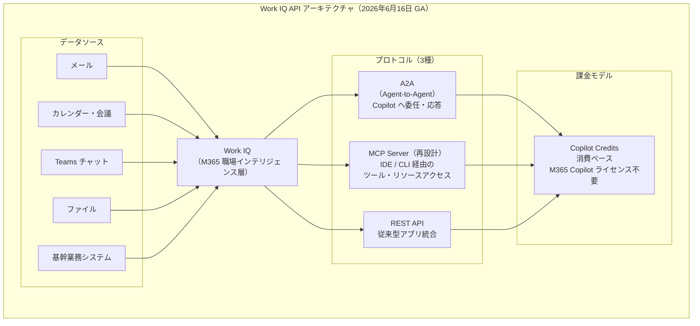
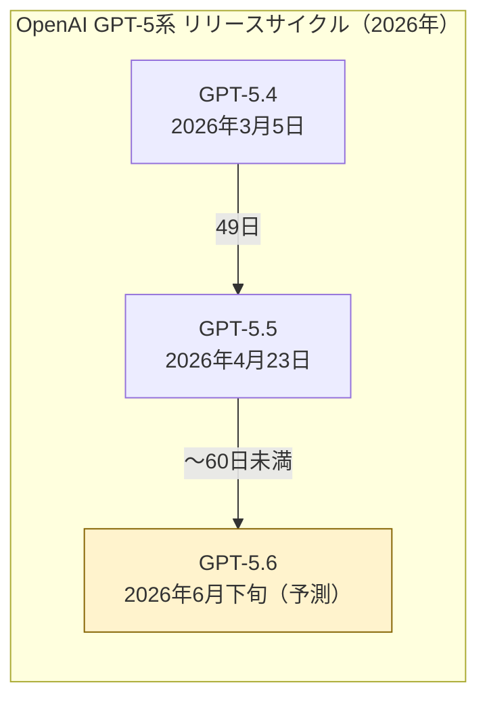
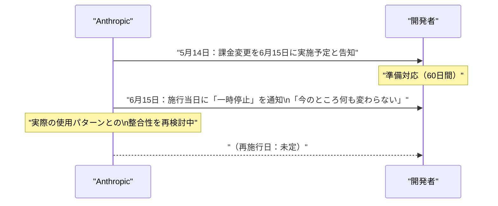
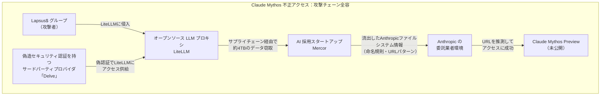
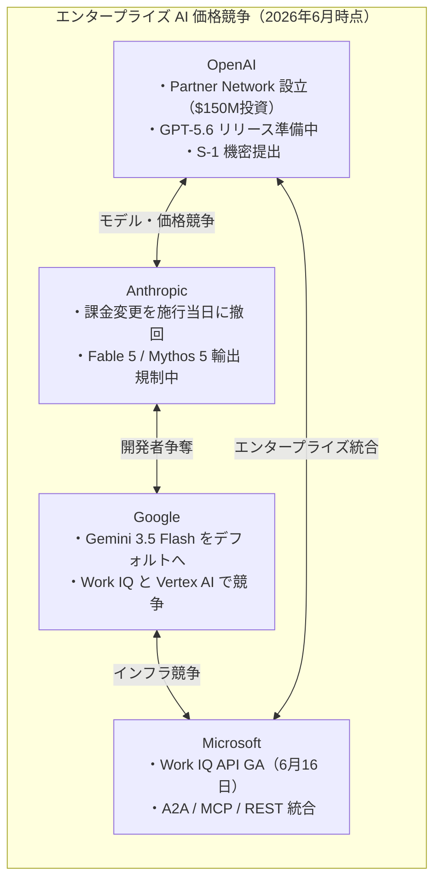

# LLM・AI Agent 最新情報レポート Vol.51

**作成日**: 2026年6月16日  
**対象期間**: 2026年6月15日〜2026年6月16日（Vol.50との差分）

---

## 目次

1. [Google Cloudアップデート](#1-google-cloudアップデート)
2. [Microsoft Azure AIアップデート](#2-microsoft-azure-aiアップデート)
3. [LLM Model / AI Agentアーキテクチャ・研究](#3-llm-model--ai-agentアーキテクチャ研究)
4. [公式ブログ・論文のリサーチ・要約](#4-公式ブログ論文のリサーチ要約)
   - [4.1 Google / Google DeepMind](#41-google--google-deepmind)
   - [4.2 OpenAI](#42-openai)
   - [4.3 Anthropic](#43-anthropic)
5. [AI Agent搭載SaaS製品情報](#5-ai-agent搭載saas製品情報)
6. [LLM/AI Agentセキュリティインシデント](#6-llmai-agentセキュリティインシデント)
7. [その他特筆すべき情報](#7-その他特筆すべき情報)
8. [参考リンク](#8-参考リンク)

---

## 1. Google Cloudアップデート

### 1.1 Gemini Enterprise：Gemini 3.5 Flash が全ユーザーへ強制デフォルト化（6月16日）

本日（6月16日）より、Gemini Enterprise において **Gemini 3.5 Flash の機能管理トグルが廃止**された。[[1]](#ref-1)

| 変更内容 | 詳細 |
|---|---|
| **適用地域** | Global・US・EU マルチリージョン |
| **変更内容** | Gemini 3.5 Flash の有効/無効を切り替えるトグルを管理者が操作できなくなった |
| **影響** | 全ユーザーに Gemini 3.5 Flash が常時有効・無効化不可 |
| **同時変更** | Gemini アプリ・検索の AI Mode のグローバルデフォルトモデルも Gemini 3.5 Flash に |

> **開発者向け:** 管理コンソールでモデル切り替えを制御していた組織は、本日以降その設定が機能しない点に注意が必要。モデル固定が必要なエンタープライズ要件は Vertex AI 経由の API 呼び出しで実現することが推奨される。

### 1.2 Gemini 2.5 系モデル：退役日が10月16日に延期更新

Vertex AI 上の以下モデルの退役日が **10月16日（2026年）** に更新された。[[2]](#ref-2)

| モデル | 旧退役予定 | 更新後退役日 |
|---|---|---|
| Gemini 2.5 Pro | 2026年6月（未確定） | **2026年10月16日** |
| Gemini 2.5 Flash | 2026年6月（未確定） | **2026年10月16日** |
| Gemini 2.5 Flash-Lite | 2026年6月（未確定） | **2026年10月16日** |

- Gemini 3.x 系が GA になり次第、少なくとも6ヶ月前に最終確定退役日を通知するとされている
- 移行先は Gemini 3.1 Pro（プレビュー中）または Gemini 3.5 系が推奨

### 1.3 画像生成・動画生成エンドポイント廃止：6月30日が期限

Vertex AI の旧世代画像・動画生成エンドポイントが **2026年6月30日** に廃止される。[[3]](#ref-3)

| 廃止対象 | 推奨移行先 |
|---|---|
| 旧 Image Generation API エンドポイント | Imagen 4 エンドポイント |
| 旧 Video Generation API エンドポイント | Veo 3 エンドポイント |

> 期限まで **残り14日**。対応が未完了のチームは今週中に移行を優先すること。

---

## 2. Microsoft Azure AIアップデート

### 2.1 Work IQ API が GA（6月16日）：A2A・MCP・REST トリプルプロトコル対応

**本日（6月16日）、Microsoft Work IQ API が一般提供（GA）** を開始した。エージェントがメール・カレンダー・会議・チャット・ファイル・人物・コラボレーションパターン・基幹業務システムから職場インテリジェンスを取得できる API スイートとして正式公開された。[[4]](#ref-4)[[5]](#ref-5)

**主なポイント：**

| 項目 | 内容 |
|---|---|
| **GA 日** | 2026年6月16日（本日） |
| **対応プロトコル** | A2A・MCP・REST（3種類から選択可能） |
| **A2A の特徴** | カスタムエージェントが Copilot のインテリジェンスに直接委任、コンテキストを横断して応答を受け取る |
| **MCP の特徴** | IDE や CLI から M365 の組織コンテキストにツール・リソースとしてアクセス |
| **課金** | Copilot Credits による消費ベース。M365 Copilot ライセンスは不要 |
| **アクセス可能データ** | Chat・Context・Tools・Workspaces の4ドメイン |

> **市場的意義:** Work IQ GA により、任意のエージェント（自社製・サードパーティ製）が M365 の企業コンテキストを API 経由で活用できるようになった。Copilot エコシステム外のエージェントにも解放されたことで、エンタープライズ向けエージェント開発の幅が大きく広がる。

---

## 3. LLM Model / AI Agentアーキテクチャ・研究

新情報なし（6月15〜16日時点で特記すべき新規論文なし）

---

## 4. 公式ブログ・論文のリサーチ・要約

### 4.1 Google / Google DeepMind

新情報なし（上記 1.1〜1.3 の Vertex AI・Gemini Enterprise 変更は Google Cloud セクション参照）

---

### 4.2 OpenAI

#### 4.2.1 GPT-5.6：チーフサイエンティストが「Meaningful Leap」と明言（6月16日）

OpenAI のチーフサイエンティスト **Jakub Pachocki** が社内 Slack メッセージで GPT-5.6 を「GPT-5.5 に対する意味のある改善（meaningful improvement）」と表現したことが The Information の取材で明らかになった（報道: 6月10日）。6月16日時点では未リリースだが、予測市場は **6月22〜28日のリリース**に83%のオッズを集めている。[[6]](#ref-6)[[7]](#ref-7)

**期待される主要スペック：**

| 項目 | 内容 |
|---|---|
| **コンテキスト長** | 最大 **1.5M トークン**（GPT-5.5 比で拡大） |
| **強化領域** | 推論・コーディング・エージェントワークフロー・ビジョン・フロントエンド生成 |
| **トークン効率** | 改善により運用コスト低減が期待される |
| **コードネーム** | 「Kindle」が Design Arena に一時表示→削除（最終テスト段階を示唆） |
| **位置づけ** | Claude Fable 5・Google Gemini に対抗する次世代フラッグシップ |

> **OpenAI のリリース戦略：** GPT-5.4（3月5日）→ GPT-5.5（4月23日）→ GPT-5.6（予測）という60日未満の連続リリースサイクルが確認されており、OpenAI が「コンピュート駆動型・継続的モデルアップデート」戦略に本格移行していることがわかる。

---

### 4.3 Anthropic

#### 4.3.1【訂正・続報】Agent SDK課金変更を「施行当日に一時停止」——Vol.50 記載内容の重要訂正

**Vol.50（6月15日付レポート）では「Agent SDK 課金分離が正式発効」と報告したが、Anthropic は施行予定日当日（6月15日）に当該変更を急遽一時停止した。**[[8]](#ref-8)[[9]](#ref-9)

「今のところ何も変わらない」と Anthropic はユーザーへのメールで通知。Agent SDK・`claude -p`・サードパーティアプリは引き続き既存のサブスクリプション利用量プールから消費される。

**一時停止の背景：**

| 観点 | 内容 |
|---|---|
| **公式理由** | 「実際の使用パターンとの整合性をより高めるために計画を再検討中」 |
| **市場背景** | OpenAI との価格競争が激化する中で、コスト増となる変更を維持することへの判断見直し |
| **現状** | Agent SDK / `claude -p` / サードパーティアプリは既存プールから消費（変更なし） |
| **再施行時期** | 未定 |

> **開発者向け:** 6月15日に課金変更に向けた対応を完了した場合でも、現時点では元の動作に戻っている。再施行の告知は Anthropic の公式ヘルプセンターを確認すること。なお、`claude-sonnet-4-20250514` / `claude-opus-4-20250514` の退役（Vol.50 4.3.1 参照）は予定通り施行済み。

---

## 5. AI Agent搭載SaaS製品情報

新情報なし（6月15〜16日時点で特記すべき新規発表なし）

---

## 6. LLM/AI Agentセキュリティインシデント

### 6.1 Claude Mythos不正アクセスの全容判明：LiteLLM → Mercor → Anthropic サプライチェーン攻撃

Vol.50（6月15日レポート）で「政府との交渉継続中」として扱った Anthropic の Claude Mythos 不正アクセス事件について、調査報道により **攻撃チェーンの全容** が判明した。[[10]](#ref-10)[[11]](#ref-11)

**攻撃の段階的経緯：**

| 段階 | 内容 |
|---|---|
| **Step 1** | Lapsus$ が偽造セキュリティ認証を持つ「Delve」経由で LiteLLM（OSSのLLMプロキシ）に侵入 |
| **Step 2** | LiteLLM サプライチェーン経由で AI 採用スタートアップ Mercor を攻撃。約 **4TB のデータ** を窃取 |
| **Step 3** | 流出した Mercor データに含まれていた Anthropic のファイルシステム情報・モデル命名規則・URL パターンを解析 |
| **Step 4** | Anthropic の旧モデルの命名フォーマットから Claude Mythos Preview の URL を **推測**して不正アクセスに成功 |

**Claude Mythos が危険視された理由：**

- Mythos は主要 OS・Web ブラウザにまたがるゼロデイ脆弱性を **自律的に発見する能力** を持つモデルとして設計されており、その能力が Lapsus$ に悪用されることへの懸念が米国政府の輸出規制発動（6月12日）につながった

> **セキュリティ教訓:** 今回の攻撃は単一の直接侵害ではなく、**OSSツール → 委託先企業 → 命名規則推測** という多段サプライチェーン攻撃であった点が特徴。未リリースモデルのエンドポイント命名規則を既存モデルから類推可能な状態にしていたことが最終的なアクセスを許した根本原因とされる。

---

## 7. その他特筆すべき情報

### 7.1 OpenAI：IPO に向けた S-1 を SEC へ機密提出（6月8日）

OpenAI が **証券取引委員会（SEC）に S-1 を機密提出**したことを6月8日に公式発表した。[[12]](#ref-12)

| 項目 | 内容 |
|---|---|
| **提出日** | 2026年6月8日 |
| **提出種別** | 機密（Confidential）S-1 |
| **IPO 時期** | 未決定。Sam Altman 曰く「プライベートカンパニーの方が容易にできることがまだある」 |
| **背景** | GPT-5.6 リリース・パートナーネットワーク整備・収益化加速を踏まえた段階的 IPO 準備 |

> GPT-5.5 の個人化アップデート（6月9日）・Partner Network ローンチ（6月15日）・S-1 提出（6月8日）が相次ぐ中、OpenAI は収益性の証明と企業価値最大化を同時に進めているとみられる。

### 7.2 Anthropic 課金変更一時停止の市場的意味

Anthropic が施行当日に課金変更を撤回した今週の出来事は、以下の市場動向を示す：

---

## 8. 参考リンク

**[1]** [Gemini Enterprise release notes | Google Cloud Documentation](https://docs.cloud.google.com/gemini/enterprise/docs/release-notes)

**[2]** [Google Is Retiring Gemini 2.5 on Vertex AI: What You Need to Know | GCPStudyHub](https://gcpstudyhub.com/blog/google-is-retiring-gemini-2-5-on-vertex-ai-what-you-need-to-know-and-do-before-october-2026)

**[3]** [Vertex AI release notes | Generative AI on Vertex AI | Google Cloud Documentation](https://docs.cloud.google.com/vertex-ai/generative-ai/docs/release-notes)

**[4]** [Work IQ: Production‑ready intelligence for every agent | Microsoft 365 Developer Blog](https://devblogs.microsoft.com/microsoft365dev/work-iq-production-ready-intelligence-for-every-agent/)

**[5]** [Microsoft Work IQ APIs go GA on June 16: what agent builders get | LinkLoot](https://linkloot.io/blog/microsoft-work-iq-apis-ga-june-2026)

**[6]** [GPT-5.6: OpenAI Chief Scientist Calls It a Meaningful Leap, June Launch Nears | TechTimes](https://www.techtimes.com/articles/318492/20260616/gpt-56-openai-chief-scientist-calls-it-meaningful-leap-june-launch-nears.htm)

**[7]** [OpenAI Could Launch GPT-5.6 This Month with Major Improvements | Android Headlines](https://www.androidheadlines.com/2026/06/openai-gpt-5-6-release-date-chatgpt-overhaul-ipo-plans.html)

**[8]** [Anthropic backs off unpopular billing overhaul as price war with OpenAI looms | The Decoder](https://the-decoder.com/anthropic-backs-off-unpopular-billing-overhaul-as-price-war-with-openai-looms/)

**[9]** [Anthropic pauses Claude Agent SDK subscription change on day it was due to take effect | The New Stack](https://thenewstack.io/anthropic-pauses-claude-agent-sdk-subscription-change/)

**[10]** [How a cavalcade of blunders gave unauthorized users access to Claude Mythos | Tom's Hardware](https://www.tomshardware.com/tech-industry/cyber-security/how-a-cavalcade-of-blunders-gave-unauthorized-users-access-to-claude-mythos-restricted-model-accessed-by-third-parties-thanks-to-knowledge-from-data-breach)

**[11]** [Mercor Breach Linked to LiteLLM Supply-Chain Attack | Bank Info Security](https://www.bankinfosecurity.com/mercor-breach-linked-to-litellm-supply-chain-attack-a-31340)

**[12]** [Confidential submission of draft S-1 to the SEC | OpenAI](https://openai.com/index/openai-submits-confidential-s-1/)
