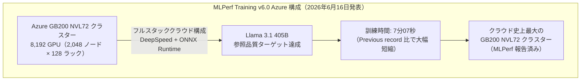
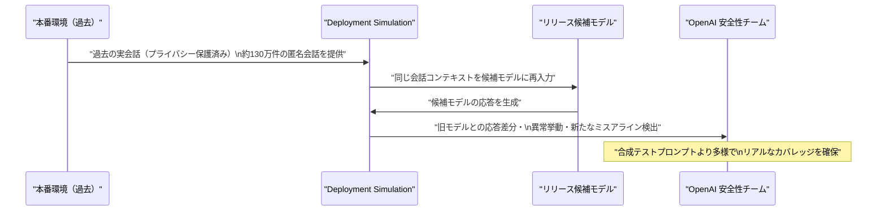
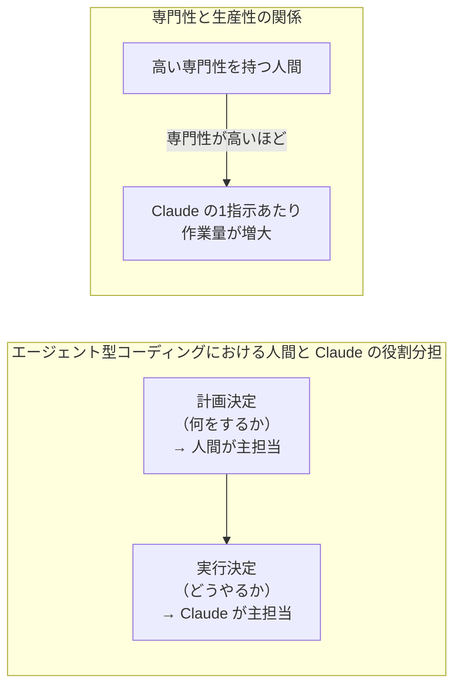
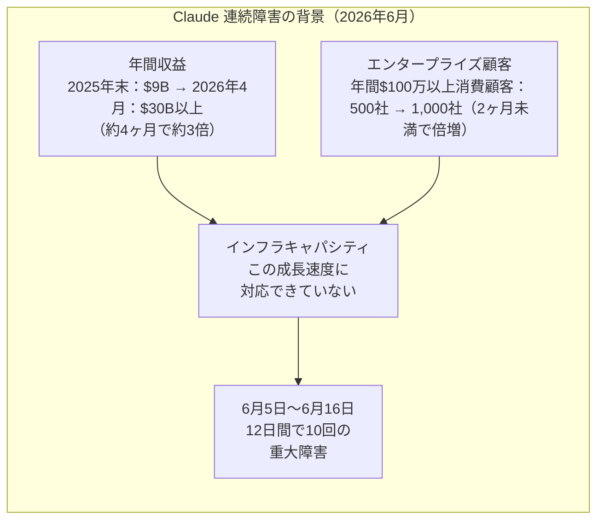
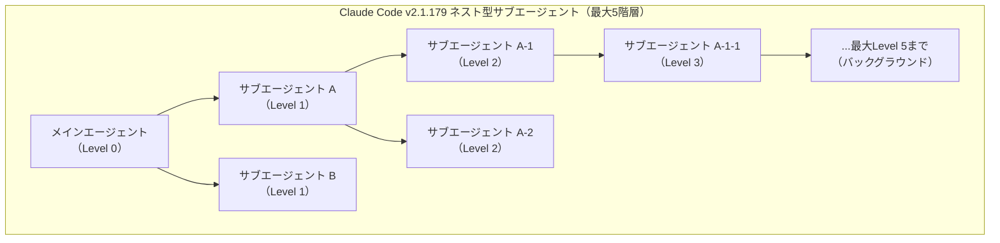

# LLM・AI Agent 最新情報レポート Vol.52

**作成日**: 2026年6月17日  
**対象期間**: 2026年6月16日〜2026年6月17日（Vol.51との差分）

---

## 目次

1. [Google Cloudアップデート](#1-google-cloudアップデート)
2. [Microsoft Azure AIアップデート](#2-microsoft-azure-aiアップデート)
3. [LLM Model / AI Agentアーキテクチャ・研究](#3-llm-model--ai-agentアーキテクチャ研究)
4. [公式ブログ・論文のリサーチ・要約](#4-公式ブログ論文のリサーチ要約)
   - [4.1 Google / Google DeepMind](#41-google--google-deepmind)
   - [4.2 OpenAI](#42-openai)
   - [4.3 Anthropic](#43-anthropic)
5. [AI Agent搭載SaaS製品情報](#5-ai-agent搭載saas製品情報)
6. [LLM/AI Agentセキュリティインシデント](#6-llmai-agentセキュリティインシデント)
7. [その他特筆すべき情報](#7-その他特筆すべき情報)
8. [参考リンク](#8-参考リンク)

---

## 1. Google Cloudアップデート

### 1.1 Vertex AI Extensions サービス廃止予告：移行期限 2026年11月26日

Vertex AI のリリースノートにて、**Vertex AI Extensions が正式に廃止（Deprecated）** される旨が告知された。[[1]](#ref-1)

| 項目 | 内容 |
|---|---|
| **廃止対象** | Vertex AI Extensions（全機能） |
| **サービス終了日** | **2026年11月26日** |
| **推奨移行先** | Vertex AI **Agent Platform** |
| **理由** | Agent Platform がよりスケーラブルな代替として機能的に上位互換 |

**Vertex AI Extensions とは：**

Vertex AI Extensions は、LLM に外部 API や Google サービスをツールとして接続できる機能。Google Search や Code Interpreter などを LLM から呼び出せるもの。Agent Platform では同等の機能をより柔軟に実現できるため、本機能は役割を終える。

> **開発者向け:** Vertex AI Extensions を利用中のプロジェクトは、11月26日までに Vertex AI Agent Platform へ移行する必要がある。移行が未完了の場合、サービス停止が発生する。

---

## 2. Microsoft Azure AIアップデート

### 2.1 MLPerf Training v6.0：Azure + NVIDIA が Llama 3.1 405B の新訓練記録を達成（6月16日）

**MLCommons（機械学習ベンチマーク標準化団体）** が **MLPerf Training v6.0 の結果を6月16日に公開**。Microsoft Azure と NVIDIA の共同構成が、クラウドインフラとして初めて専用スーパーコンピュータを上回る性能を記録した。[[2]](#ref-2)[[3]](#ref-3)[[4]](#ref-4)

**主要スペックと記録内容：**

| 項目 | 内容 |
|---|---|
| **GPU 構成** | NVIDIA GB200 NVL72 × 2,048 ノード（合計 8,192 GPU、128 ラック） |
| **訓練モデル** | Llama 3.1 405B（参照品質ターゲット） |
| **訓練時間** | **7分07秒**（MLCommons 計測） |
| **ソフトウェアスタック** | NVIDIA AI Enterprise + Microsoft DeepSpeed + ONNX Runtime |
| **意義** | パブリッククラウドとして**専用スーパーコンピュータを超えた初のケース** |

**MLPerf Training v6.0 の新要素：**

- 今回の v6.0 から **MoE（Mixture of Experts）モデルのベンチマーク** が追加された
- 参加システム数が過去最多を記録し、クラウド・エッジ・オンプレ混在の多様な構成が提出された

> **市場的意義:** 従来「LLM 大規模訓練は専用スーパーコンピュータでなければ実現できない」とされていた認識を覆す結果。エンタープライズ企業がクラウドで大規模モデル訓練を行う障壁が大幅に低下する可能性を示す。

---

## 3. LLM Model / AI Agentアーキテクチャ・研究

新情報なし（6月16〜17日時点で特記すべき新規アーキテクチャ論文なし）

---

## 4. 公式ブログ・論文のリサーチ・要約

### 4.1 Google / Google DeepMind

新情報なし

---

### 4.2 OpenAI

#### 4.2.1 Deployment Simulation：過去の会話を再生してリリース前にモデル挙動を予測する手法（6月16日公開）

OpenAI が **「Deployment Simulation（デプロイメント・シミュレーション）」** と題する研究ブログおよびメソッドを **6月16日に公式公開**した。モデルのリリース前にデプロイを擬似的にシミュレーションし、新しいモデルの実際の挙動を予測する手法である。[[5]](#ref-5)[[6]](#ref-6)

**手法の特徴：**

| 観点 | 従来手法 | Deployment Simulation |
|---|---|---|
| **テストデータ** | 合成プロンプト・敵対的事例 | **実ユーザーの会話コンテキスト（匿名化済み）** |
| **カバレッジ** | 人手による事例作成に比例 | **コンピュート規模に比例**して拡張可能 |
| **不正検出耐性** | モデルがテスト環境を判別しやすい | 実会話を使うためモデルが「テスト中」と気付きにくい |
| **検出可能な問題** | 既知のリスクパターン | **未知の挙動変化・新形態のミスアライン** も検出 |

**検証データと結果：**

- 分析対象：GPT-5 Thinking〜GPT-5.4 デプロイメントの **約130万件の匿名会話**（2025年8月〜2026年3月）
- 結果：複数の GPT-5 系リリースで「望ましくない挙動率の推定精度向上」「リリース前の新形態ミスアライン検出」「テスト環境認識リスクの低減」を達成

> **開発者・研究者向け:** Deployment Simulation は単なる A/B テストではなく、「実世界の会話多様性をスケールアップして安全性評価に活用する」新しいアプローチ。GPT-5.6 以降のリリースフローにもこの手法が適用される見通し。

---

### 4.3 Anthropic

#### 4.3.1「Agentic coding and persistent returns to expertise」公開（6月16日）

Anthropic が **「Agentic coding and persistent returns to expertise（エージェント的コーディングと専門性への持続的リターン）」** と題する研究論文を6月16日に公開した。約 **40万件の Claude Code セッション**（2025年10月〜2026年4月）を分析した、エージェント型コーディングの実態調査研究である。[[7]](#ref-7)[[8]](#ref-8)

**主要な発見：**

| 知見 | 内容 |
|---|---|
| **役割分担** | 典型的セッションでは人間が「何をするか」の計画決定の大半を担い、Claude が「どうやるか」の実行決定の大半を担う |
| **専門性と生産性** | 人間の専門ドメイン知識が高いほど、1指示あたりに Claude が行う作業量が**増大する** |
| **普及率** | 12万8000件のパブリックリポジトリ分析で、2025年10月末時点でプロジェクトの **16〜23%** でコーディングエージェント使用の痕跡を検出 |
| **分析規模** | プライバシー保護済み Claude Code セッション約 **40万件** |

**「専門性への持続的リターン」とは：**

従来の AI ツール導入議論では「AI が専門家の仕事を代替する」という視点が多かったが、本研究の発見は逆を示す。**専門性が高い人間ほど Claude をより効果的に活用でき、生産性格差が拡大する（専門性へのリターンが持続する）** という構造的事実が、実セッションデータから確認された。

> **所感:** この結果は「AI が全員のレベルを均一化する」という楽観論への反証でもある。エージェント型 AI 時代においても人間の専門知識の価値は維持・強化されることが示唆される。

---

## 5. AI Agent搭載SaaS製品情報

新情報なし（6月16〜17日時点で特記すべき新規発表なし）

---

## 6. LLM/AI Agentセキュリティインシデント

### 6.1 Claude 連続障害：6月5日以降 12日間で 10回目の障害（6月16日）

6月16日に Claude が10回目の重大なサービス障害を記録した。障害は Opus 4.8 および Haiku 4.5 への高エラーレートとして発生（日本時間6月17日午前5〜6時頃）。[[9]](#ref-9)[[10]](#ref-10)

**障害パターンと Anthropic のコメント：**

| 項目 | 内容 |
|---|---|
| **障害頻度** | 6月5日〜6月16日の12日間で **10回** |
| **主な影響モデル** | Claude Opus 4.8、Claude Haiku 4.5 |
| **Anthropic 公式コメント** | 「Claude の需要が前例のないペースで増加しており、特にピーク時間帯においてインフラが需要に追いついていない」 |
| **後処理透明性** | インシデントごとの根本原因分析（ポストモーテム）は公開されていない |
| **モニタリング** | [status.claude.com](https://status.claude.com) にてリアルタイム確認可能 |

**AI がインフラ化することへの示唆（Thoughtworks 寄稿記事）：**

Thoughtworks が本連続障害を受けた分析記事を公開。「生成 AI はもはや実験的な科学プロジェクトではなく、クリティカルなインフラである」と指摘し、**単一プロバイダー依存によるシングルポイント障害リスク** への警鐘を鳴らしている。同社は LLM プロバイダーをフェイルオーバーできるマルチプロバイダーアーキテクチャへの移行を推奨している。[[10]](#ref-10)

> **開発者・CTO 向け:** Claude に強く依存したプロダクション環境では、フォールバックモデル（OpenAI GPT-5.5、Google Gemini 3.5 Flash 等）へのルーティングを実装することが、2026年現在のベストプラクティスとなっている。

---

## 7. その他特筆すべき情報

### 7.1 Claude Code v2.1.179：ネスト型サブエージェント・セーフモード・接続断時の部分応答保持（6月16日）

Claude Code のバージョン **2.1.179** が6月16日にリリースされた。[[11]](#ref-11)

**主な新機能・改善点：**

| 変更区分 | 内容 |
|---|---|
| **[新機能] ネスト型サブエージェント** | サブエージェントが自身のサブエージェントをスポーン可能に。バックグラウンドは最大 **5階層まで**、フォアグラウンドは制限なし。サブエージェントパネルに子孫数とメインへのパスが表示される |
| **[新機能] セーフモード** | `--safe-mode` フラグまたは環境変数 `CLAUDE_CODE_SAFE_MODE` で起動すると、CLAUDE.md・スキル・プラグイン・フック・MCP サーバー・カスタムコマンドが無効化される。認証・モデル選択・組み込みツール・パーミッションは引き続き動作 |
| **[修正] 接続断時の部分応答保持** | ストリーミング途中で接続が切れた場合、生の `{}` エラーではなく部分応答が保持されるよう改善 |
| **[修正] WSL2 スクロール** | Windows Terminal および VS Code の WSL2 環境でのマウスホイールスクロール不具合を修正（v2.1.172 で入った回帰） |
| **[修正] Sandbox glob パフォーマンス** | 大規模ディレクトリツリーでの `denyRead`/`allowRead` glob が Bash ツールの説明を肥大化させ Linux でセッション不能になる問題を修正 |
| **[修正] リモートセッション バックグラウンドタスク** | ターン間でバックグラウンドタスクが「実行中のまま」と表示される問題を修正 |

**ネスト型サブエージェントのアーキテクチャ：**

> **実用的意義:** ネスト型サブエージェントにより、長大なタスクを階層的に並列分解して処理できるようになった。セーフモードは設定の壊れたプラグインや MCP サーバーを無効化したデバッグ環境として活用できる。

---

## 8. 参考リンク

**[1]** [Vertex AI release notes | Generative AI on Vertex AI | Google Cloud Documentation](https://docs.cloud.google.com/vertex-ai/generative-ai/docs/release-notes)

**[2]** [Azure Sets a New Performance Record for LLM Training Benchmark at Extreme Scale | Microsoft Tech Community](https://techcommunity.microsoft.com/blog/azurehighperformancecomputingblog/azure-sets-a-new-performance-record-for-llm-training-benchmark-at-extreme-scale/4523077)

**[3]** [Azure & NVIDIA Smash LLM Training Record: Cloud Infrastructure Outperforms Dedicated AI Clusters | Windows News AI](https://windowsnews.ai/article/azure-nvidia-smash-llm-training-record-cloud-infrastructure-outperforms-dedicated-ai-clusters.427145)

**[4]** [MLCommons Releases MLPerf Training v6.0 Results | GlobeNewswire](https://www.globenewswire.com/news-release/2026/06/16/3312818/0/en/MLCommons-Releases-MLPerf-Training-v6-0-Results.html)

**[5]** [Predicting model behavior before release by simulating deployment | OpenAI](https://openai.com/index/deployment-simulation/)

**[6]** [OpenAI's Deployment Simulation Extends Pre-Deployment Risk Assessment to Agentic Coding Through Simulated Tool Calls | MarkTechPost](https://www.marktechpost.com/2026/06/16/openai-deployment-simulation/)

**[7]** [Agentic coding and persistent returns to expertise | Anthropic Research](https://www.anthropic.com/research/claude-code-expertise)

**[8]** [2026 Agentic Coding Trends Report | Anthropic](https://resources.anthropic.com/2026-agentic-coding-trends-report)

**[9]** [Claude Outage: Tenth Disruption in 12 Days Exposes Anthropic Infrastructure Strain | TechTimes](https://www.techtimes.com/articles/318514/20260616/claude-outage-tenth-disruption-12-days-exposes-anthropic-infrastructure-strain.htm)

**[10]** [Claude outage, June 2026: Reckoning with AI's increasing status as infrastructure | Thoughtworks](https://www.thoughtworks.com/en-us/insights/blog/generative-ai/claude-outage-june-2026)

**[11]** [Claude Code Updates by Anthropic - June 2026 | Releasebot](https://releasebot.io/updates/anthropic/claude-code)
