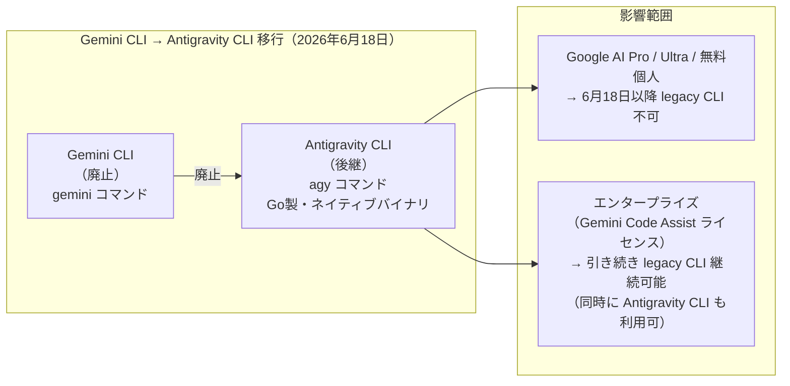
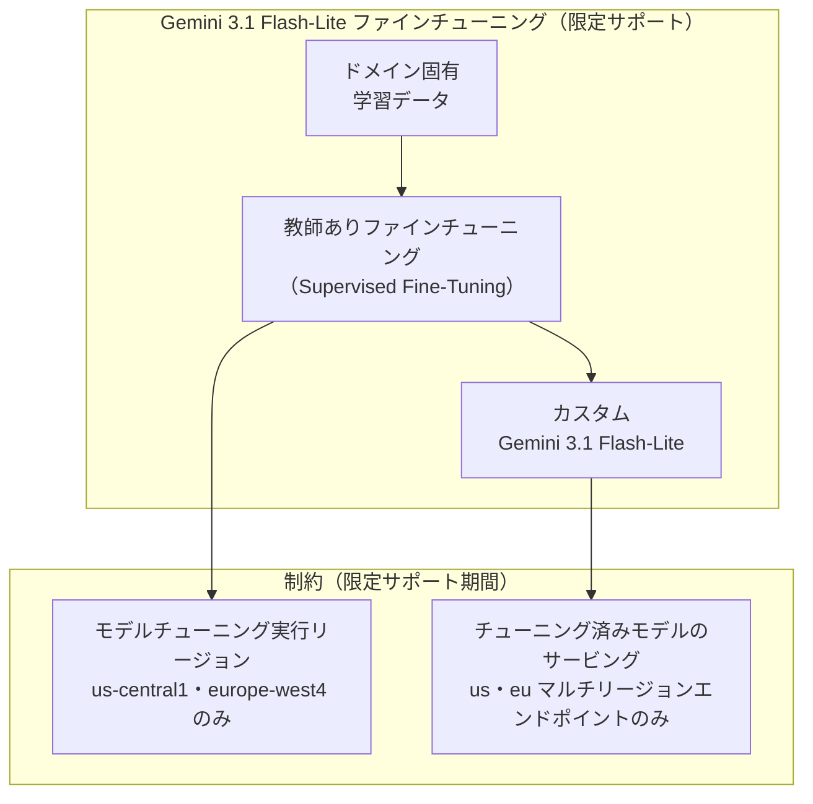
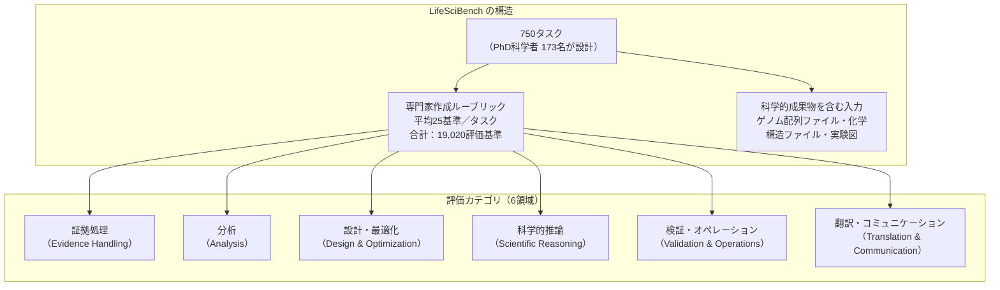
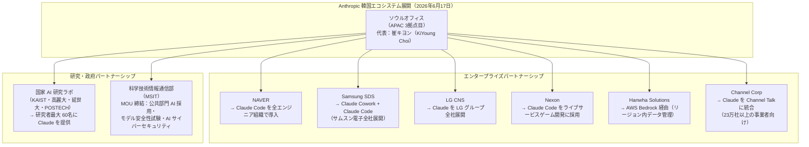
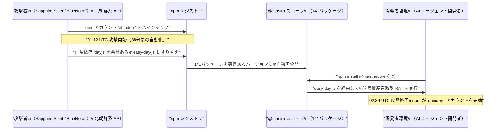

# LLM・AI Agent 最新情報レポート Vol.53

**作成日**: 2026年6月18日  
**対象期間**: 2026年6月17日〜2026年6月18日（Vol.52との差分）

---

## 目次

1. [Google Cloudアップデート](#1-google-cloudアップデート)
2. [Microsoft Azure AIアップデート](#2-microsoft-azure-aiアップデート)
3. [LLM Model / AI Agentアーキテクチャ・研究](#3-llm-model--ai-agentアーキテクチャ研究)
4. [公式ブログ・論文のリサーチ・要約](#4-公式ブログ論文のリサーチ要約)
   - [4.1 Google / Google DeepMind](#41-google--google-deepmind)
   - [4.2 OpenAI](#42-openai)
   - [4.3 Anthropic](#43-anthropic)
5. [AI Agent搭載SaaS製品情報](#5-ai-agent搭載saas製品情報)
6. [LLM/AI Agentセキュリティインシデント](#6-llmai-agentセキュリティインシデント)
7. [その他特筆すべき情報](#7-その他特筆すべき情報)
8. [参考リンク](#8-参考リンク)

---

## 1. Google Cloudアップデート

### 1.1 Gemini CLI 廃止（6月18日）：Antigravity CLI への完全移行

**6月18日**をもって、Gemini CLI および Gemini Code Assist IDE 拡張機能のコンシューマー向け提供が正式に終了した。後継は **Antigravity CLI**（コマンド名: `agy`）であり、Google I/O 2026 で発表・同梱されたエージェント開発プラットフォームへの統合が完了する。[[1]](#ref-1)[[2]](#ref-2)

**移行の主要ポイント：**

| 項目 | 内容 |
|---|---|
| **廃止対象** | Gemini CLI、Gemini Code Assist IDE 拡張（コンシューマー向け） |
| **後継** | Antigravity CLI（`agy` コマンド、Go製シングルバイナリ） |
| **設計思想** | マルチエージェントオーケストレーション向け。Gemini 3.5 アジェンティックモデルファミリーと統合 |
| **互換性注意** | **1:1 のフィーチャーパリティなし**。既存の Gemini CLI スクリプト・自動化は移行が必要 |
| **エンタープライズ例外** | Gemini Code Assist ライセンス購入済み組織は当面 legacy CLI を継続利用可 |

> **開発者向け:** 既存の CI/CD パイプラインや自動化スクリプトで Gemini CLI を使用している場合、Antigravity CLI の新しいコマンド体系への書き換えが必要。公式移行ガイドを確認のこと。

---

### 1.2 Memory Bank・Sessions：マルチリージョン＆グローバルエンドポイント対応が GA

Gemini Enterprise Agent Platform（旧 Vertex AI）にて、**Memory Bank** および **Sessions** のマルチリージョン・グローバルエンドポイントへの対応が **GA（一般提供）** となった。[[3]](#ref-3)

| 項目 | 内容 |
|---|---|
| **GA となった機能** | Memory Bank・Sessions の `us`・`eu` マルチリージョンおよびグローバルエンドポイント |
| **制約** | CMEK（顧客管理暗号鍵）は global エンドポイントでは非対応 |
| **課金開始日** | Memory Bank 利用分の課金は **2026年9月1日**より開始 |
| **背景** | 従来は限定リージョンのみ対応。グローバル展開を目指すエンタープライズ向けに対応範囲を拡大 |

---

### 1.3 Gemini 3.1 Flash-Lite：教師ありファインチューニング（限定サポート）開始

Gemini Enterprise Agent Platform にて、**Gemini 3.1 Flash-Lite** の**教師ありファインチューニング（Supervised Fine-Tuning）** が限定サポートで提供開始となった。[[3]](#ref-3)

> **活用場面:** Gemini 3.1 Flash-Lite は Google のコスト効率最優先モデル。低レイテンシ・大量推論向けにファインチューニングを施すことで、特定ドメインに最適化した高速・低コストモデルを構築可能になる。

---

## 2. Microsoft Azure AIアップデート

新情報なし（6月17〜18日時点で特記すべき新規発表なし）

---

## 3. LLM Model / AI Agentアーキテクチャ・研究

新情報なし（6月17〜18日時点で特記すべき新規アーキテクチャ論文なし）

---

## 4. 公式ブログ・論文のリサーチ・要約

### 4.1 Google / Google DeepMind

新情報なし

---

### 4.2 OpenAI

#### 4.2.1 LifeSciBench：750タスクの生命科学専門ベンチマーク公開（6月17日）

OpenAI が **「LifeSciBench」** と題する生命科学特化の AI 評価ベンチマークを **6月17日に公式公開**した。GPT-Rosalind の新機能発表と同時に、**173名の PhD レベル科学者**（バイオテクノロジー・製薬業界）が開発した実践的な評価基準として公開されている。[[4]](#ref-4)[[5]](#ref-5)[[6]](#ref-6)

**評価結果（主要モデル比較）：**

| モデル | LifeSciBench スコア |
|---|---|
| **GPT-Rosalind**（OpenAI）| **36.1%**（最高スコア） |
| GPT-5.5 | 35.2% |
| Grok 4.3 | 33.7% |
| Gemini 3.1 Pro | 31.8% |

**従来ベンチマークとの差別化：**

| 観点 | 従来 AI 生物学ベンチマーク | LifeSciBench |
|---|---|---|
| **問題形式** | 多肢選択式（クリーンな参照回答あり） | **自由記述式**（専門家ルーブリックで採点） |
| **入力形式** | テキストのみ | **ゲノム配列・化学構造・実験図など科学的成果物** |
| **採点粒度** | 正誤 | **25基準平均の詳細ルーブリック** |

**GPT-Rosalind 新機能（同時発表）：**

| 機能 | 内容 |
|---|---|
| **GPT-5.5 統合** | GPT-5.5 のコーディング・ツール使用能力を薬剤発見・ゲノミクス分野に統合 |
| **Codex プラグイン追加** | "Life Sciences Research" と "Life Sciences NGS Analysis" の 2 プラグインを追加 |
| **トークン効率** | GPT-5.5 比で **31% 少ないトークン**で同等タスクを実行 |
| **アクセス拡大** | 適格組織向けの全世界リサーチプレビュー提供を開始 |

> **研究者・製薬業界向け:** LifeSciBench は「実際の研究ワークフローに基づいた AI 評価」として、これまでの合成ベンチマークが見逃してきた実用的な能力差を可視化する。GPT-Rosalind ですら最高評価モデルが36%しか正解できないという結果は、生命科学 AI の現在地を示している。

---

### 4.3 Anthropic

#### 4.3.1 ソウルオフィス開設と韓国 AI エコシステムへの参入（6月17日）

Anthropic が **6月17日**、ソウルオフィスの正式開設と韓国 AI エコシステムにおける複数パートナーシップを同時発表した。アジアパシフィック地域では東京・ベンガルール（インド）に続く**3拠点目**となる。[[7]](#ref-7)[[8]](#ref-8)

**戦略的背景：**

| 項目 | 内容 |
|---|---|
| **市場規模** | 韓国は Claude のグローバル最活発市場の一つ。利用はテクニカル・クリエイティブ分野に集中 |
| **IPO 準備との関係** | Anthropic の IPO 準備中における国際展開加速の一環 |
| **代表者** | KiYoung Choi（旧 Snowflake Korea General Manager） |
| **政府連携** | 科技部と MOU：公共部門 AI 採用・モデル安全性試験・AI サイバー脅威対策を協働 |

> **市場観点:** 韓国の大手テック・製造・ゲーム各社が横断的に Claude を採用した点が注目に値する。NAVER・Samsung・LG・Nexon はそれぞれ異なるユースケース（コーディング・全社 AI・ゲーム開発）を示しており、Claude の汎用性が評価されている。

---

## 5. AI Agent搭載SaaS製品情報

新情報なし（6月17〜18日時点で特記すべき新規発表なし）

---

## 6. LLM/AI Agentセキュリティインシデント

### 6.1 Mastra npm サプライチェーン攻撃：AI エージェントフレームワーク 141パッケージが侵害（6月17日）

**6月17日 01:12〜02:39 UTC**、AI エージェントフレームワーク **Mastra**（TypeScript 製、RAG パイプライン構築用）の npm パッケージ群が**サプライチェーン攻撃**を受けた。攻撃者は88分間の自動化キャンペーンで **141パッケージ**を侵害し、月間 **2,900万ダウンロード**以上に影響が及んだ。[[9]](#ref-9)[[10]](#ref-10)[[11]](#ref-11)

**攻撃の詳細：**

| 項目 | 内容 |
|---|---|
| **攻撃手法** | 依存パッケージのすり替え（`dayjs` → 攻撃者制御の `easy-day-js`） |
| **ペイロード** | 暗号資産窃取型 RAT（Remote Access Trojan）をインストールして実行 |
| **侵害規模** | @mastra スコープ 141パッケージ（最大影響: `@mastra/core` 週間 918K DL） |
| **総ダウンロード数** | 推定週間 800万+ / 月間 2,900万+ |
| **攻撃時間** | 88分間（01:12〜02:39 UTC） |
| **帰属** | Snyk・Orca が **Sapphire Sleet（BlueNoroff）**（北朝鮮系 APT）と特定 |
| **対応** | npm が数時間以内に 'ehindero' アカウントを失効させ悪意あるバージョンを unpublish 開始 |

**Mastra とは：**

Mastra は TypeScript 製のオープンソース AI エージェントフレームワーク。LLM 統合・RAG パイプライン・ツール呼び出し・マルチエージェントワークフローを構築する開発者に広く使用されており、AI エージェント開発コミュニティにおいて主要なエコシステムの一つ。

**開発者向け対応チェックリスト：**

1. `@mastra/*` パッケージの `package-lock.json` で `easy-day-js` 依存が混入していないか確認
2. 6月17日 01:12〜02:39 UTC 前後にインストールした場合、環境全体をスキャン
3. 暗号資産ウォレット・API キー・クレデンシャルの漏洩を確認
4. 最新の clean バージョンへのアップデートを実施

> **AI エコシステムのサプライチェーンリスク:** AI エージェントフレームワークは依存関係が多く、インストール時に任意コードを実行するパッケージが多い。LLM アプリケーションの開発環境は特に攻撃者にとって魅力的なターゲットとなっており、`npm audit` および SBOM（ソフトウェア部品表）管理の重要性が改めて示された。

---

## 7. その他特筆すべき情報

新情報なし

---

## 8. 参考リンク

**[1]** [Google is Replacing Gemini CLI with Its New Antigravity Platform | OSTechNix](https://ostechnix.com/google-is-replacing-gemini-cli-with-google-antigravity/)

**[2]** [Gemini CLI Is Being Retired on June 18 — Meet Antigravity CLI | Inventive HQ](https://inventivehq.com/blog/gemini-cli-deprecated-antigravity-cli-migration)

**[3]** [Gemini Enterprise Agent Platform release notes | Google Cloud Documentation](https://docs.cloud.google.com/gemini-enterprise-agent-platform/release-notes)

**[4]** [Introducing LifeSciBench | OpenAI](https://openai.com/index/introducing-life-sci-bench/)

**[5]** [OpenAI Releases LifeSciBench, a 750-Task Benchmark Grading AI Models on Real Life-Science Research With Expert-Written Rubric | MarkTechPost](https://www.marktechpost.com/2026/06/17/openai-releases-lifescibench-a-750-task-benchmark-grading-ai-models-on-real-life-science-research-with-expert-written-rubric/)

**[6]** [OpenAI Life Science Benchmark Reveals AI Passes Only 1 in 3 Scientific Research Tasks | TechTimes](https://www.techtimes.com/articles/318638/20260618/openai-life-science-benchmark-reveals-ai-passes-only-1-3-scientific-research-tasks.htm)

**[7]** [Anthropic opens Seoul office and announces new partnerships across the Korean AI ecosystem | Anthropic](https://www.anthropic.com/news/seoul-office-partnerships-korean-ai-ecosystem)

**[8]** [Anthropic Eyes South Korea Growth Ahead Of IPO With Seoul Office, New Partnerships | Benzinga](https://www.benzinga.com/markets/tech/26/06/53267847/anthropic-eyes-south-korea-expansion-ahead-of-ipo-with-seoul-office-and-partnerships)

**[9]** [easy-day-js Supply Chain Attack Hits Mastra AI in npm | OX Security](https://www.ox.security/blog/easy-day-js-supply-chain-attack-hits-mastra-ai-in-npm/)

**[10]** [Mastra npm Supply Chain Attack Backdoors 144 Packages | AI Weekly](https://aiweekly.co/alerts/mastra-npm-supply-chain-attack-backdoors-144-packages)

**[11]** [Mastra npm packages compromised in 'easy-day-js' supply chain attack | SC Media](https://www.scworld.com/brief/mastra-npm-packages-compromised-in-easy-day-js-supply-chain-attack)
