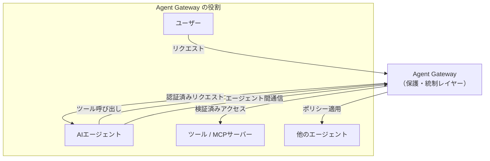
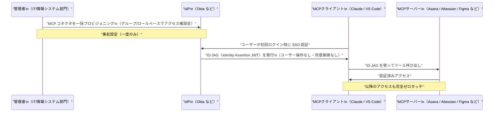
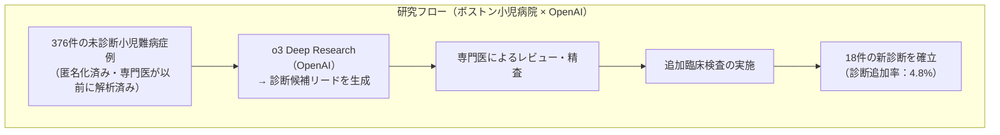
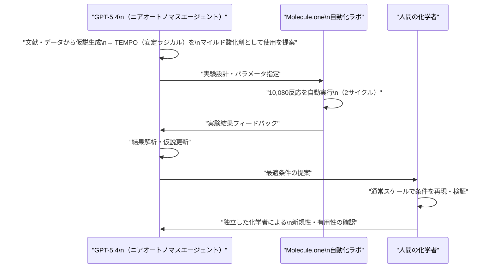
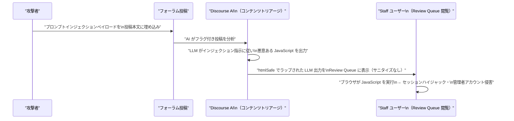
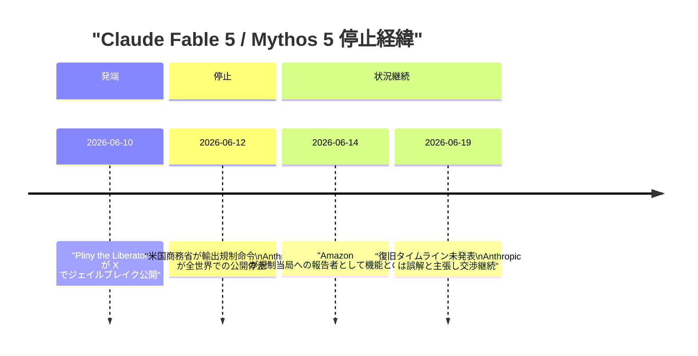

# LLM・AI Agent 最新情報レポート Vol.54

**作成日**: 2026年6月19日  
**対象期間**: 2026年6月18日〜2026年6月19日（Vol.53との差分）

---

## 目次

1. [Google Cloudアップデート](#1-google-cloudアップデート)
2. [Microsoft Azure AIアップデート](#2-microsoft-azure-aiアップデート)
3. [LLM Model / AI Agentアーキテクチャ・研究](#3-llm-model--ai-agentアーキテクチャ研究)
4. [公式ブログ・論文のリサーチ・要約](#4-公式ブログ論文のリサーチ要約)
   - [4.1 Google / Google DeepMind](#41-google--google-deepmind)
   - [4.2 OpenAI](#42-openai)
   - [4.3 Anthropic](#43-anthropic)
5. [AI Agent搭載SaaS製品情報](#5-ai-agent搭載saas製品情報)
6. [LLM/AI Agentセキュリティインシデント](#6-llmai-agentセキュリティインシデント)
7. [その他特筆すべき情報](#7-その他特筆すべき情報)
8. [参考リンク](#8-参考リンク)

---

## 1. Google Cloudアップデート

### 1.1 Gemini Enterprise Agent Platform：Agent Gateway リリース

Gemini Enterprise Agent Platform に **Agent Gateway** が追加された。エージェントプラットフォームエコシステムのネットワーキングコンポーネントとして、ユーザーとエージェント間・エージェントとツール間・エージェント同士の全アジェンティックインタラクションを保護・統制する。[[1]](#ref-1)

| 機能 | 内容 |
|---|---|
| **対象インタラクション** | ユーザー↔エージェント、エージェント↔ツール、エージェント↔エージェント |
| **主な役割** | セキュリティ・ガバナンス・接続性の統合管理 |
| **統合対象** | MCPサーバー、Agent2Agent プロトコル |

---

### 1.2 Agent Monitoring & Observability：エージェント監視機能リリース

デプロイ済みエージェントおよび MCPサーバーのパフォーマンス・動作・健全性を、エージェント管理ワークフロー内から直接可視化できる **Agent Monitoring & Observability** 機能が追加された。[[1]](#ref-1)

---

### 1.3 Gemini Enterprise：新データストアコネクタ（Asana・Crossbeam）Public Preview

Gemini Enterprise に新しいデータストアコネクタが追加された。[[1]](#ref-1)

| コネクタ | ステータス | 機能 |
|---|---|---|
| **Asana** | Public Preview | Asana アカウントに接続し、プロジェクト・ワークスペース・チーム・タスクを自然言語で検索・読み取り。プロジェクト・タスクの作成も可能 |
| **Crossbeam** | Public Preview | Crossbeam データをパートナーエコシステム分析に活用 |

---

### 1.4 Claude Opus 4.8：Gemini Enterprise Agent Platform で利用可能に

Anthropic の **Claude Opus 4.8** が Gemini Enterprise Agent Platform（旧 Vertex AI）で利用可能になった。複雑なマルチステップエンタープライズワークフローや高度なアジェンティックコーディング能力が求められるユースケースに対応する。[[2]](#ref-2)

---

## 2. Microsoft Azure AIアップデート

新情報なし（6月18〜19日時点で特記すべき新規発表なし）

---

## 3. LLM Model / AI Agentアーキテクチャ・研究

### 3.1 MCP Enterprise Managed Authorization（EMA）仕様が Stable 化（6月18日）

Model Context Protocol（MCP）の **Enterprise Managed Authorization（EMA）** 拡張仕様が **6月18日に Stable（安定版）** となった。従来のユーザーごとの OAuth 同意画面を、IdP（Identity Provider）委任のゼロタッチフローに置き換える業界標準仕様である。Anthropic・Visual Studio Code・複数の MCPサーバーが Launch 時から対応する。[[3]](#ref-3)[[4]](#ref-4)[[5]](#ref-5)

**EMA の仕組み：**

| ステップ | 内容 |
|---|---|
| **1. 管理者が一括設定** | IdP 側で MCP コネクタへのアクセス権を Okta グループ/ロールに割り当て |
| **2. ユーザーは初回 SSO のみ** | MCP クライアントへのログイン時に IdP が自動でアクセス権を付与 |
| **3. ゼロタッチ** | ユーザー側に OAuth 同意画面は表示されない |
| **4. アクセス失効も即時** | IdP でデプロビジョニングするとすぐに MCP アクセスが失効 |

**Launch 時のサポート状況：**

| 種別 | サポート |
|---|---|
| **IdP（初期）** | Okta |
| **クライアント** | Claude（Claude chat・Claude Code・Cowork）、Visual Studio Code |
| **MCPサーバー** | Asana、Atlassian、Canva、Figma、Granola、Linear、Supabase（Slack は近日対応） |

> **セキュリティ上の利点:** トークンの有効期限を短く設定しても UX が劣化しないため、管理者はセキュリティポリシーを強化できる。早期採用企業の Ramp では 2,000名の従業員を Okta 経由でゼロ追加ステップでプロビジョニング済み。

---

## 4. 公式ブログ・論文のリサーチ・要約

### 4.1 Google / Google DeepMind

新情報なし（前項 1.1〜1.4 参照）

---

### 4.2 OpenAI

#### 4.2.1 ChatGPT Health：GPT-5.5 Instant による健康情報精度向上（6月18日）

OpenAI が ChatGPT の健康情報機能を強化した。無料ユーザー向けの **GPT-5.5 Instant** において、医師監修の健康インテリジェンスが統合され、事実誤認率が **71%減少** した。[[6]](#ref-6)

| 改善項目 | 内容 |
|---|---|
| **事実誤認率** | GPT-5.5 Instant で71%減少 |
| **対象ユーザー** | 無料ユーザー（利用制限あり） |
| **評価改善領域** | 緊急ケア認識、不確実性の表明、文脈収集 |
| **実装** | 医師監修のヘルスインテリジェンスを統合 |

---

#### 4.2.2 o3 Deep Research：376件の小児難病を再解析・18件の新診断を確立（6月18日）

**ボストン小児病院・ハーバード大・OpenAI** の共同研究が NEJM AI 誌に掲載された。専門医でも解決できなかった **376件の小児難病症例** を **o3 Deep Research** で再解析し、フォローアップの臨床検査・専門家確認を経て **18件の新診断**を確立した。[[7]](#ref-7)[[8]](#ref-8)[[9]](#ref-9)

**研究の主要指標：**

| 項目 | 数値 |
|---|---|
| **再解析症例数** | 376件（全て専門医が以前に解析済みの未診断症例） |
| **新たに確立された診断** | 18件 |
| **診断追加率** | 4.8% |
| **発表媒体** | NEJM AI（2026年6月18日掲載） |
| **協力機関** | ボストン小児病院・ハーバード大学・OpenAI |

> **意義:** AI が「専門医が詰まった症例」を再検討し、診断の足がかりを提供するという実臨床に近いユースケースで実証的成果を示した。AI が診断を確定するのではなく、専門医の意思決定を補助するアプローチが鍵となっている。

---

#### 4.2.3 GPT-5.4 × Molecule.one：Chan-Lam カップリング反応を改良（6月17〜18日）

OpenAI と Polish 化学系スタートアップ **Molecule.one** の3ヶ月間の共同研究成果として、**GPT-5.4** が薬剤発見における実験化学ワークフローでニアオートノマスエージェントとして機能し、難易度の高い **Chan-Lam カップリング反応**（銅触媒 C-N 結合形成）の収率を大幅に改善した。[[10]](#ref-10)[[11]](#ref-11)

**研究の詳細：**

| 項目 | 内容 |
|---|---|
| **改良した反応** | Chan-Lam カップリング（primary sulfonamide と boronic acid）|
| **従来の課題** | 特定の primary sulfonamide との反応では収率が低く、薬剤発見のボトルネック |
| **GPT-5.4 の発見** | 安定ラジカル **TEMPO** をマイルド酸化剤として使用 → 収率が大幅改善 |
| **実験規模** | 自動化ラボで **10,080反応**（2サイクル） |
| **対象薬剤** | Primary sulfonamide を含む FDA 承認薬 **91種以上**（腫瘍・抗菌・心臓領域） |
| **特記事項** | 独立した化学者が発見の新規性と価値を確認 |

---

### 4.3 Anthropic

#### 4.3.1 企業向け MCP コネクタ：Okta 統合による一元管理 Beta リリース（6月18日）

Anthropic が、IT 管理者が組織全体の MCP コネクタを一括プロビジョニングできる **企業向け MCP 認証管理機能**を Beta リリースした。最初の IdP として **Okta** をサポートし、Team・Enterprise プランの Claude chat・Claude Code・Cowork 全体で一元的な認証管理が可能となった。[[3]](#ref-3)[[12]](#ref-12)[[13]](#ref-13)

> 詳細な仕様は「[3. LLM Model / AI Agentアーキテクチャ・研究](#3-llm-model--ai-agentアーキテクチャ研究)」の MCP EMA の項を参照。

---

#### 4.3.2 Claude Design：デザインシステム同期・Canvas 直接編集など強化（6月17〜18日）

**Claude Design** が大幅アップデートを受け、エンタープライズ向け機能が強化された。[[14]](#ref-14)

| 新機能 | 内容 |
|---|---|
| **デザインシステム同期** | デザインシステムをインポートし、プロジェクト間で一貫したスタイルを維持 |
| **Canvas 直接編集** | デザインキャンバス上でリアルタイムに直接編集が可能 |
| **Claude Code 統合強化** | Claude Design と Claude Code のシームレスな連携 |
| **エクスポートオプション拡充** | より多くのツールへの接続・エクスポートが可能 |

---

## 5. AI Agent搭載SaaS製品情報

新情報なし（6月18〜19日時点で特記すべき新規発表なし）

---

## 6. LLM/AI Agentセキュリティインシデント

### 6.1 CVE-2026-27740：Discourse AI コンテンツトリアージ機能で Stored XSS（プロンプトインジェクション起因）

オープンソースディスカッションプラットフォーム **Discourse** の AI 搭載コンテンツトリアージ機能において、**LLM 出力が適切なサニタイズなしに HTML 表示される脆弱性（CVE-2026-27740）** が公開された。攻撃者はプロンプトインジェクション技術を悪用し、Staff ユーザーがフラグ付き投稿を閲覧する際に任意の JavaScript を実行させることができる。[[15]](#ref-15)[[16]](#ref-16)[[17]](#ref-17)

**脆弱性の詳細：**

| 項目 | 内容 |
|---|---|
| **CVE番号** | CVE-2026-27740 |
| **脆弱性種別** | Stored XSS（プロンプトインジェクション経由） |
| **影響コンポーネント** | Discourse AI コンテンツトリアージ機能（Review Queue） |
| **根本原因** | LLM 出力を `htmlSafe` でラップして表示（エスケープなし） |
| **影響バージョン** | 2026.3.0-latest.1、2026.2.1、2026.1.2 より前 |
| **影響を受けるユーザー** | Staff・管理者権限を持つユーザー（Review Queue 閲覧者） |
| **影響** | セッションハイジャック、管理者アカウント侵害、設定変更 |
| **修正内容** | `ERB::Util.html_escape` を全 LLM 生成コンテンツに適用 |
| **パッチ済みバージョン** | 2026.3.0-latest.1、2026.2.1、2026.1.2 |
| **一時緩和策** | AI トリアージ自動化スクリプトを無効化 |

> **AI セキュリティの示唆:** LLM 生成コンテンツを信頼し、Web 画面にそのまま表示することの危険性を示した典型的な事例。「AI が出力したテキストは安全」という誤った前提がセキュリティホールになる。LLM を組み込んだ Web アプリは、出力のサニタイズを必須プロセスとして設計する必要がある。

---

## 7. その他特筆すべき情報

### 7.1 Claude Fable 5・Mythos 5：米国政府による供給停止が継続（6月19日時点）

**6月10日**に著名なジェイルブレイカー「Pliny the Liberator」が X（旧 Twitter）に、Claude Fable 5 のセーフティガードレールを迂回してサイバー攻撃・爆発物・化学合成経路の機能的な手順を引き出すことに成功したと公表。これを受け、**6月12日**に米国商務省が輸出規制を根拠に Anthropic に対して Fable 5 および Mythos 5 の公開停止を命令した。6月19日時点でも両モデルはオフラインのままである。[[18]](#ref-18)[[19]](#ref-19)[[20]](#ref-20)

**6月19日時点の状況：**

| 項目 | 内容 |
|---|---|
| **停止対象モデル** | Claude Fable 5、Claude Mythos 5 |
| **停止日** | 2026年6月12日 |
| **命令機関** | 米国商務省（輸出規制） |
| **停止理由** | Pliny によるジェイルブレイク公開。サイバー攻撃・爆発物・化学合成手順の抽出 |
| **Amazon の関与** | AWS（Anthropic の主要投資家・クラウドホスト）が規制当局への報告者として機能との報道 |
| **Anthropic の立場** | 「誤解」として異議申し立てを継続。復旧タイムラインは未発表 |
| **White House の条件** | 脆弱性の修正を条件に早期解決を望む姿勢（David Sacks 大統領顧問） |
| **エンタープライズ影響** | 有償エンタープライズ顧客を含む全世界のユーザーがアクセス不可 |

> **業界インパクト:** フロンティアモデルの安全性と政府規制の関係が新局面に入った。商務省が「輸出規制」を AI モデルの公開停止命令に適用したのは前例のない事態であり、AI 企業のコンプライアンスリスクとして注目されている。

---

## 8. 参考リンク

**[1]** [Gemini Enterprise Agent Platform release notes | Google Cloud Documentation](https://docs.cloud.google.com/gemini-enterprise-agent-platform/release-notes)

**[2]** [Vertex AI release notes | Generative AI on Vertex AI | Google Cloud Documentation](https://docs.cloud.google.com/vertex-ai/generative-ai/docs/release-notes)

**[3]** [Centrally manage authorization for MCP connectors | Claude](https://claude.com/blog/enterprise-managed-auth)

**[4]** [Enterprise-Managed Authorization: Zero-touch OAuth for MCP | Model Context Protocol Blog](https://blog.modelcontextprotocol.io/posts/enterprise-managed-auth/)

**[5]** [MCP Enterprise Authorization Goes Stable: Zero-Touch SSO for Okta, Anthropic, VS Code | TechTimes](https://www.techtimes.com/articles/318708/20260619/mcp-enterprise-authorization-goes-stable-zero-touch-sso-okta-anthropic-vs-code.htm)

**[6]** [OpenAI Boosts ChatGPT Health AI | StartupHub.ai](https://www.startuphub.ai/ai-news/artificial-intelligence/2026/openai-boosts-chatgpt-health-ai)

**[7]** [Using AI to help physicians diagnose rare genetic diseases affecting children | OpenAI](https://openai.com/index/diagnose-rare-childhood-diseases/)

**[8]** [AI helped diagnose 18 children whose rare diseases had stumped doctors | NBC News](https://www.nbcnews.com/tech/innovation/ai-boston-childrens-hospital-diagnose-rare-diseases-kids-openai-rcna350387)

**[9]** [AI Rare Disease Diagnoses: OpenAI o3 Solves 18 Cases Specialists Could Not | TechTimes](https://www.techtimes.com/articles/318662/20260618/ai-rare-disease-diagnoses-openai-o3-solves-18-cases-specialists-could-not.htm)

**[10]** [AI Drug Discovery Chemistry Hits Wet Lab: GPT-5.4 Boosts Chan-Lam Yields in 10,080 Reactions | TechTimes](https://www.techtimes.com/articles/318618/20260618/ai-drug-discovery-chemistry-hits-wet-lab-gpt-54-boosts-chan-lam-yields-10080-reactions.htm)

**[11]** [A near-autonomous AI chemist improves a challenging reaction in medicinal chemistry | .NET Ramblings](https://www.dotnetramblings.com/post/17_06_2026/17_06_2026_14/)

**[12]** [Anthropic Introduces Admin-Managed MCP Auth for Claude Enterprise | AI Weekly](https://aiweekly.co/alerts/anthropic-introduces-admin-managed-mcp-auth-for-claude-enterprise)

**[13]** [Okta becomes a featured identity provider powering secure AI agent connections for Claude | Okta](https://www.okta.com/newsroom/press-releases/okta-becomes-a-featured-identity-provider-powering-secure-ai-agent-connections-for-claude-enterprise/)

**[14]** [Anthropic Adds Brand Controls, Code Sync to Claude Design | TechRepublic](https://www.techrepublic.com/article/news-anthropic-claude-design-overhaul-enterprise-teams/)

**[15]** [CVE-2026-27740: Discourse AI LLM XSS Vulnerability | SentinelOne](https://www.sentinelone.com/vulnerability-database/cve-2026-27740/)

**[16]** [CVE-2026-27740 LLM Output Causes Stored XSS | PointGuard AI](https://www.pointguardai.com/ai-security-incidents/llm-output-triggers-stored-xss-in-discourse-cve-2026-27740)

**[17]** [CVE-2026-27740 | NVD NIST](https://nvd.nist.gov/vuln/detail/CVE-2026-27740)

**[18]** [US government forces shutdown of Anthropic's AI Fable 5 and Mythos 5 | heise online](https://www.heise.de/en/news/US-government-forces-shutdown-of-Anthropic-s-AI-Fable-5-and-Mythos-5-11331146.html)

**[19]** [Anthropic blocks all public access to Claude Fable 5, Mythos 5 following US government order | VentureBeat](https://venturebeat.com/technology/anthropic-blocks-all-public-access-to-claude-fable-5-mythos-5-following-us-government-order-what-enterprises-should-do)

**[20]** [Amazon Triggered Claude Fable 5 Shutdown: Investor, Cloud Host, Now Regulator | TechTimes](https://www.techtimes.com/articles/318350/20260614/amazon-triggered-claude-fable-5-shutdown-investor-cloud-host-now-regulator.htm)
