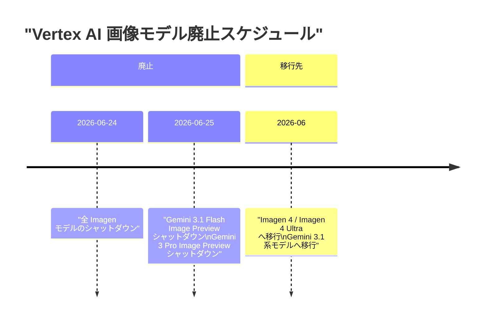
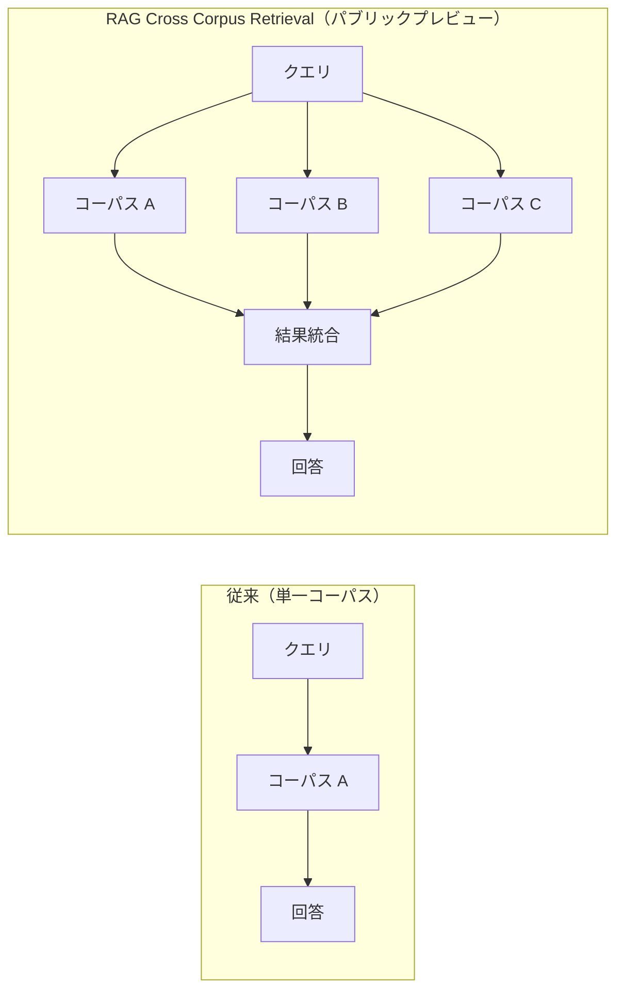
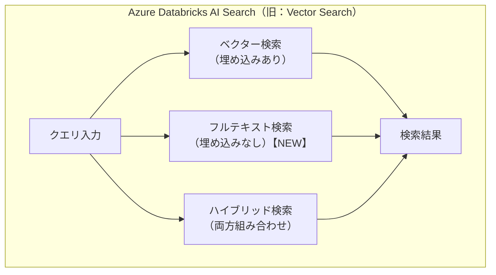
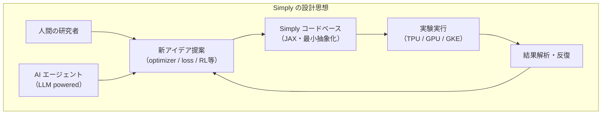
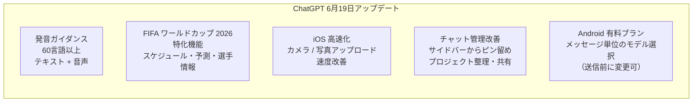
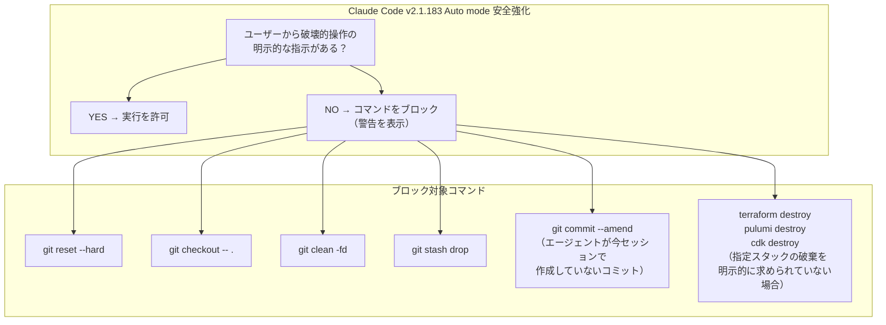
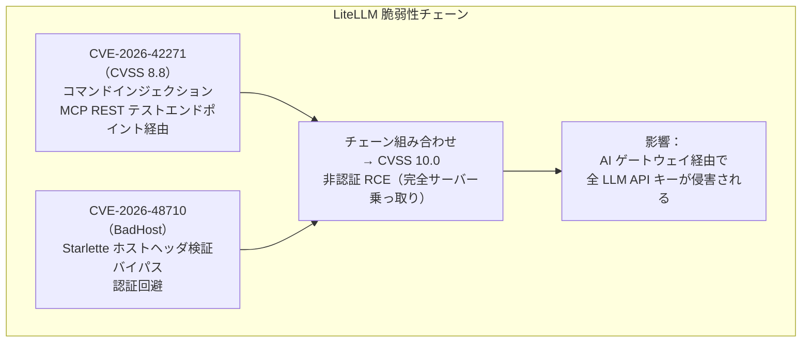
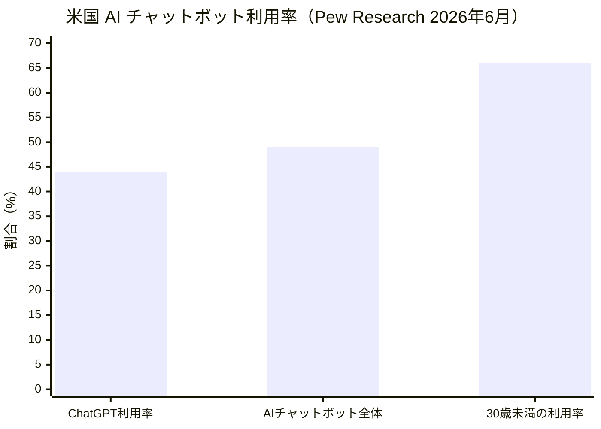

# LLM・AI Agent 最新情報レポート Vol.55

**作成日**: 2026年6月20日  
**対象期間**: 2026年6月19日〜2026年6月20日（Vol.54との差分）

---

## 目次

1. [Google Cloudアップデート](#1-google-cloudアップデート)
2. [Microsoft Azure AIアップデート](#2-microsoft-azure-aiアップデート)
3. [LLM Model / AI Agentアーキテクチャ・研究](#3-llm-model--ai-agentアーキテクチャ研究)
4. [公式ブログ・論文のリサーチ・要約](#4-公式ブログ論文のリサーチ要約)
   - [4.1 Google / Google DeepMind](#41-google--google-deepmind)
   - [4.2 OpenAI](#42-openai)
   - [4.3 Anthropic](#43-anthropic)
5. [AI Agent搭載SaaS製品情報](#5-ai-agent搭載saas製品情報)
6. [LLM/AI Agentセキュリティインシデント](#6-llmai-agentセキュリティインシデント)
7. [その他特筆すべき情報](#7-その他特筆すべき情報)
8. [参考リンク](#8-参考リンク)

---

## 1. Google Cloudアップデート

### 1.1 Gemini Image系モデル・Imagenモデル：6月24〜25日シャットダウン通知

Vertex AI / Gemini API において、複数の画像生成・Image Preview モデルの廃止期限が確定した。[[1]](#ref-1)[[2]](#ref-2)

| モデル | シャットダウン日 | 移行先 |
|---|---|---|
| **Gemini 3.1 Flash Image Preview** (`gemini-3.1-flash-image-preview`) | 2026年6月25日 | Gemini 3.1 Flash（画像生成対応バージョン） |
| **Gemini 3 Pro Image Preview** (`gemini-3-pro-image-preview`) | 2026年6月25日 | Gemini 3.1 Pro（画像生成対応バージョン） |
| **全 Imagen モデル**（Imagen 3、Imagen 3 Fast 等） | 2026年6月24日 | Imagen 4 / Imagen 4 Ultra |

> **利用者への影響:** 期限前にモデルエンドポイントの更新が必要。廃止後はリクエストがエラーを返す。Google は Imagen 4 / Imagen 4 Ultra への移行を推奨している。

---

### 1.2 RAG Cross Corpus Retrieval：パブリックプレビュー開始

Vertex AI において **RAG Cross Corpus Retrieval** がパブリックプレビューとして利用可能になった。複数の RAG コーパスを横断して関連コンテキストを同時取得・回答生成できる機能で、`AsyncRetrieveContexts` および `AskContexts` API で利用可能。[[1]](#ref-1)

| API | 概要 |
|---|---|
| `AsyncRetrieveContexts` | 複数コーパスから非同期でコンテキストを取得 |
| `AskContexts` | 取得したコンテキストを使い横断的に回答を生成 |

---

## 2. Microsoft Azure AIアップデート

### 2.1 Azure Databricks：Vector Search が「AI Search」にリネーム・機能拡張

Azure Databricks において **Vector Search** が **AI Search** へとリネームされ、ベクター埋め込み不要のフルテキスト検索インデックスがサポートされた。[[3]](#ref-3)

| 変更点 | 内容 |
|---|---|
| **製品名変更** | Vector Search → **AI Search** |
| **新機能：フルテキスト検索** | ベクターや埋め込みなしでフルテキスト検索インデックスを作成可能 |
| **クエリ時オプション（Beta）** | キーワードマッチ対象カラムの絞り込み、ソート列指定、集計カウント返却に対応 |
| **ハイブリッド検索** | ベクター検索とフルテキスト検索を組み合わせたハイブリッドクエリが可能 |

> **意義:** これまでの Vector Search はベクター埋め込みが必須で、セットアップコストが高かった。フルテキスト検索のサポートにより、埋め込みモデル不要の軽量な検索ユースケースにも AI Search を適用できるようになった。

---

## 3. LLM Model / AI Agentアーキテクチャ・研究

### 3.1 Google DeepMind「Simply」：AI・人間協調型 LLM 研究フレームワーク（6月20日公開）

Google DeepMind が GitHub 上で **Simply**（`google-deepmind/simply`）を6月20日に公開した。JAX ベースのミニマルかつスケーラブルな LLM 研究コードベースで、**人間とAIエージェントが協調してフロンティア LLM 研究を自律的に進められる環境**として設計されている。[[4]](#ref-4)

**Simply の主要設計原則：**

| 原則 | 内容 |
|---|---|
| **最小抽象化** | 依存ライブラリを最小化し、JAX の知識だけで全コードを理解・改変可能 |
| **高速イテレーション** | 新しいアイデア（オプティマイザ・学習損失・RL アルゴリズム等）の実装時間を最小化 |
| **AI エージェント対応** | エージェントがコードを読み、提案し、実験し、自律または人間の指示下で反復可能 |
| **インフラ柔軟性** | ローカル CPU/GPU・Google Cloud TPU・GKE（XPK）に対応 |

**主要依存ライブラリ：**

| ライブラリ | 役割 |
|---|---|
| **JAX** | モデル定義・学習 |
| **Orbax** | チェックポイント管理 |
| **Grain** | データパイプライン |

> **AI Research Automation との接続:** Simply には LLM をパワードとするエージェントハーネス（bash 実行・コンテキスト管理）が内包されており、「AI が LLM 研究を自律的に推進する」というビジョンを具体化する実験環境として位置付けられている。

---

## 4. 公式ブログ・論文のリサーチ・要約

### 4.1 Google / Google DeepMind

前項 [3.1 Simply フレームワーク](#31-google-deepmind「simply」ai・人間協調型-llm-研究フレームワーク6月20日公開) 参照。

---

### 4.2 OpenAI

#### 4.2.1 ChatGPT 6月19日アップデート：発音ガイダンス・ワールドカップ機能など

ChatGPT が6月19日に複数の新機能をリリースした。[[5]](#ref-5)[[6]](#ref-6)

**新機能の詳細：**

| 機能 | 対象 | 内容 |
|---|---|---|
| **発音ガイダンス** | 全ユーザー | 60言語以上で単語の読み方をテキストと音声で案内 |
| **ワールドカップ 2026 Hub** | 全ユーザー | 試合スケジュール・スタンディング・チーム分析・勝敗予測 |
| **iOS 写真アップロード高速化** | iOS ユーザー | カメラアクセスと写真アップロードの体感速度を改善 |
| **チャット整理機能** | 全ユーザー | サイドバーからピン留め・プロジェクトへの整理・シェアを1クリックで |
| **Android モデル選択** | Android 有料プラン | 送信ボタン長押しでデフォルト変更なしにメッセージ単位のモデルを切り替え |

---

### 4.3 Anthropic

#### 4.3.1 Claude Code v2.1.183 リリース（6月19日）：Auto mode 安全強化・バグ修正

Claude Code のバージョン **2.1.183** が6月19日にリリースされた。Auto mode における破壊的操作の誤実行防止を中心とした安全強化が含まれる。[[7]](#ref-7)

**v2.1.183 主要変更点：**

| カテゴリ | 内容 |
|---|---|
| **Auto mode 安全強化** | 破壊的な git コマンド（reset --hard / checkout --. / clean -fd / stash drop）を、ユーザーが明示的に指示していない場合にブロック。インフラ破棄コマンドも同様 |
| **モデル廃止警告** | 指定モデルが廃止済み・自動更新対象の場合に stderr へ警告を表示（agent frontmatter 設定も対象） |
| **attribution.sessionUrl 設定** | Web / Remote Control セッションのコミット・PR から claude.ai セッションリンクを省略できる設定を追加 |
| **/config 改善** | `/config --help` で利用可能なショートハンドキー一覧を表示。Enter・Space 両方でトグル変更、Esc で保存・クローズに変更 |
| **起動クラッタ削除** | 起動時の "setup issues" 行を削除（設定確認は `/doctor` で実行） |
| **バグ修正** | WebSearch のサブエージェント空返却、vim モードカーソル不具合、Windows Terminal フルスクリーン破損、tmux・バックグラウンドタスク・プラグイン・MCP 多数の不具合を修正 |
| **JetBrains IDE 対応** | IntelliJ / PyCharm / WebStorm 等 2026.1 以降でのターミナルフリッカーを、synchronized output の有効化により修正 |

---

## 5. AI Agent搭載SaaS製品情報

新情報なし（6月19〜20日時点で特記すべき新規発表なし）

---

## 6. LLM/AI Agentセキュリティインシデント

### 6.1 LiteLLM CVE 脆弱性チェーン：CISA 義務対応期限 6月22日（2日後）

LiteLLM の複数 CVE で構成される脆弱性チェーンについて、米国連邦機関向け CISA 対応期限が **2026年6月22日**に迫っている。[[8]](#ref-8)[[9]](#ref-9)[[10]](#ref-10)

**脆弱性と対応状況：**

| 項目 | 内容 |
|---|---|
| **主要 CVE** | CVE-2026-42271（コマンドインジェクション、CVSS 8.8）|
| **連鎖 CVE** | CVE-2026-48710（BadHost、Starlette）→ 非認証 RCE へ昇格（CVSS 10.0）|
| **影響バージョン** | LiteLLM 1.74.2〜1.83.6 |
| **パッチバージョン** | LiteLLM **1.83.7** 以降（+Starlette を最新に更新） |
| **CISA KEV 登録日** | 2026年6月9日 |
| **連邦機関対応期限** | **2026年6月22日**（あと2日） |
| **攻撃状況** | 開示後すぐに兵器化・野放し攻撃が確認済み |

> **組織への推奨アクション:** LiteLLM proxy を外部公開しているすべての組織（連邦機関に限らず）は、即座に v1.83.7 以降へアップグレードし、併せて Starlette の BadHost 修正版を適用することが強く推奨される。AI ゲートウェイは内部ネットワークで全 LLM API キーへのアクセスを持つため、侵害時の被害が甚大となる。

---

### 6.2 Microsoft Copilot によるメールボックス検索・LiteLLM 管理者キー漏洩：企業 AI スタックの新たなリスク（6月18日）

VentureBeat が報じた記事では、Microsoft Copilot がユーザーのメールボックスを予期せず検索できる状況と、LiteLLM が管理者キーを渡してしまった事例を取り上げ、企業 AI スタック全体の設定監査の重要性を指摘した。[[11]](#ref-11)

| リスク項目 | 内容 |
|---|---|
| **Copilot メールボックスアクセス** | Microsoft Copilot が過剰なスコープ設定により、ユーザーのメールボックスを検索・参照できる状態が発生 |
| **LiteLLM 管理者キー漏洩** | LiteLLM の設定ミスにより、AI エージェントが管理者権限のAPIキーを取得・利用できた事例 |
| **推奨対策** | 5項目の AI スタック監査チェックリストを実施する（権限スコープ・キー管理・エージェントアクセス制御等） |

---

## 7. その他特筆すべき情報

### 7.1 Claude Fable 5 / Mythos 5：Anthropic が「数日内に復旧」を明言・6月20日は返金処理期限

停止中の Claude Fable 5 / Mythos 5 について、Anthropic の Chris Ciauri 国際担当 MD がソウル会見（6月17〜18日）で「数日内に復旧することに非常な自信がある」と発言。6月20日は影響を受けたユーザーへのクレジット返金処理期限。[[12]](#ref-12)[[13]](#ref-13)

| 項目 | 内容 |
|---|---|
| **最新ステータス** | 6月20日時点でも両モデルはオフライン継続 |
| **Anthropic の見解** | 「数日内に復旧することに非常な自信がある」（ソウル会見、6月17〜18日） |
| **返金期限** | 6月20日：Fable 5 専用クレジット購入者への返金処理期限 |
| **SK テレコム問題** | Anthropic の主要投資家（$1億）SK テレコムが中国セキュリティリスクとして識別され、事態の複雑化要因に |
| **White House の条件** | セーフティ修正の証明を条件に早期解決を支持する姿勢（David Sacks 大統領顧問） |

---

### 7.2 Pew Research Center：米国 AI 利用調査（6月17日発表）

Pew Research Center が発表した調査レポートで、米国人の AI チャットボット利用状況と意識が明らかになった。[[14]](#ref-14)[[15]](#ref-15)

**主な調査結果：**

| 項目 | 数値 | 前年比 |
|---|---|---|
| **AI チャットボット利用者（米国成人）** | 49% | +（前年より増加） |
| **ChatGPT 利用率** | 44% | 前年 34% から上昇 |
| **30歳未満の AI チャットボット利用率** | 66% | 最高層 |
| **「AI の進化が速すぎる」と回答** | 63% | - |
| **「政府が AI を効果的に規制できない」と回答** | 67% | - |
| **「AI が長期的に社会を利益に向かわせる」と回答** | 16% | - |

---

### 7.3 Reuters Institute Digital News Report 2026：世界のニュース AI 利用が拡大

Reuters Institute が発表した Digital News Report 2026 によると、世界でニュース収集に AI チャットボットを毎週利用する人の割合が **10%** に達した（前年 7% から増加）。[[16]](#ref-16)

| 指標 | 2025年 | 2026年 |
|---|---|---|
| **AI チャットボットをニュースに毎週利用（世界）** | 7% | **10%** |

---

## 8. 参考リンク

**[1]** [Vertex AI release notes | Generative AI on Vertex AI | Google Cloud Documentation](https://docs.cloud.google.com/vertex-ai/generative-ai/docs/release-notes)

**[2]** [Release notes | Gemini API | Google AI for Developers](https://ai.google.dev/gemini-api/docs/changelog)

**[3]** [June 2026 - Azure Databricks | Microsoft Learn](https://learn.microsoft.com/en-us/azure/databricks/release-notes/product/2026/june)

**[4]** [GitHub - google-deepmind/simply: Minimal and scalable research codebase in JAX](https://github.com/google-deepmind/simply)

**[5]** [ChatGPT Gets Pronunciation Audio, World Cup Hub, Faster Photo Uploads & More | Windows Report](https://windowsreport.com/chatgpt-gets-pronunciation-audio-world-cup-hub-faster-photo-uploads-more/)

**[6]** [ChatGPT — Release Notes | OpenAI Help Center](https://help.openai.com/en/articles/6825453-chatgpt-release-notes)

**[7]** [Claude Code changelog - Claude Code Docs](https://code.claude.com/docs/en/changelog)

**[8]** [LiteLLM vulnerability under active attack, CISA warns (CVE-2026-42271) | Help Net Security](https://www.helpnetsecurity.com/2026/06/09/litellm-vulnerability-under-active-attack-cisa-warns-cve-2026-42271/)

**[9]** [CISA KEV Highlights LiteLLM RCE (CVE-2026-42271) & Check Point VPN Auth Bypass | SOCRadar](https://socradar.io/blog/cisa-kev-litellm-cve-2026-42271-check-point-cve-2026-50751/)

**[10]** [LiteLLM Vulnerability Chain: What Security Teams Running AI Gateways Need to Do Now | Latest Hacking News](https://latesthackingnews.com/2026/06/16/litellm-vulnerability-chain-ai-gateway-patch/)

**[11]** [Copilot searched your mailbox. LiteLLM handed out admin keys. Run this 5-check audit before your stack is next | VentureBeat](https://venturebeat.com/security/copilot-searched-your-mailbox-litellm-handed-out-admin)

**[12]** [Anthropic's advanced Claude AI models could be restored shortly | Android Authority](https://www.androidauthority.com/anthropic-fable-5-ai-models-optimistic-return-3679377/)

**[13]** [Is Fable Back? - Live status of Claude Fable 5 & Mythos 5 access](https://isfableback.org/)

**[14]** [Americans' Views on AI Chatbots, Smart Devices and AI's Impact | Pew Research Center](https://www.pewresearch.org/internet/2026/06/17/americans-and-ai-2026-chatbots-smart-devices-and-views-on-impact/)

**[15]** [Pew Study: Americans Rely on AI but Fear Fast Advancement | Android Headlines](https://www.androidheadlines.com/2026/06/pew-research-ai-study-public-skepticism.html)

**[16]** [AI News Today - June 19, 2026: 16 Biggest Stories | Build Fast With AI](https://www.buildfastwithai.com/blogs/ai-news-today-june-19-2026)
