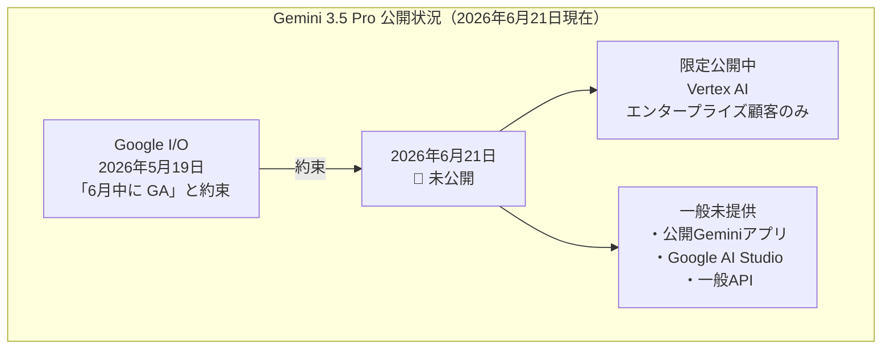
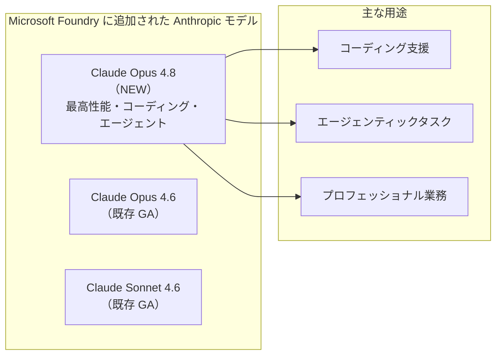
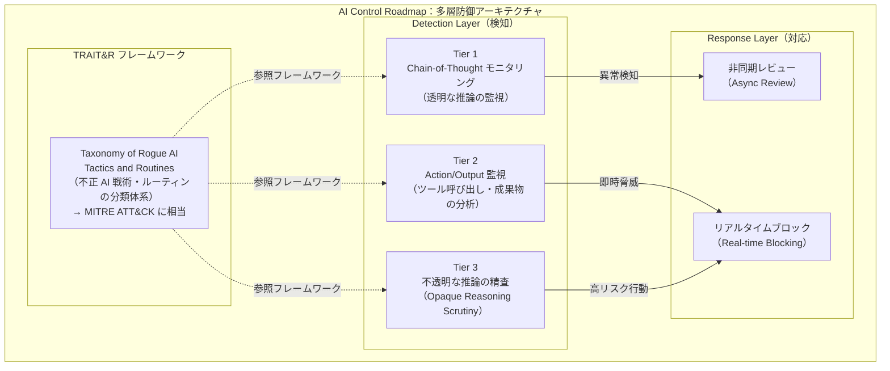
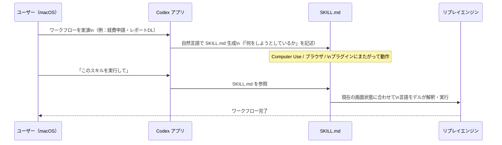
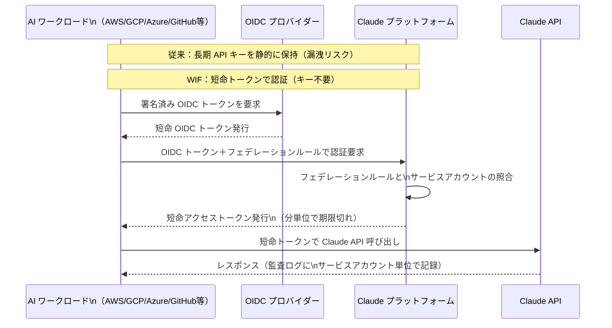
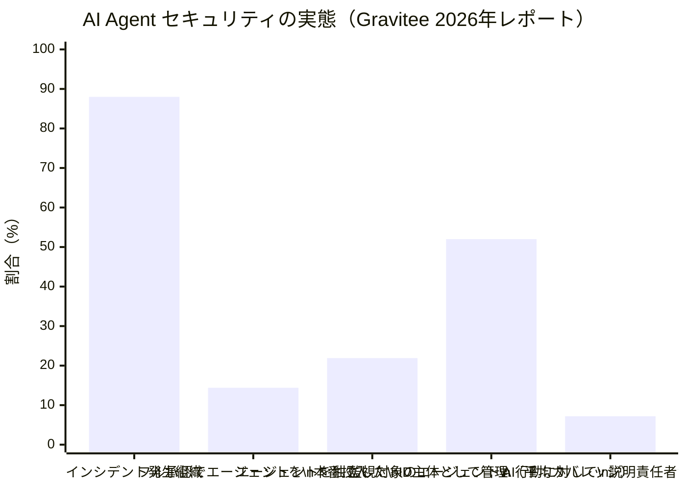
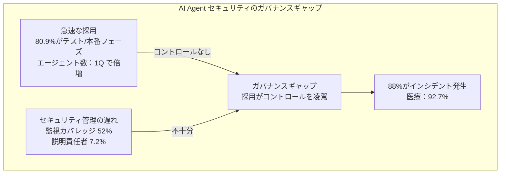
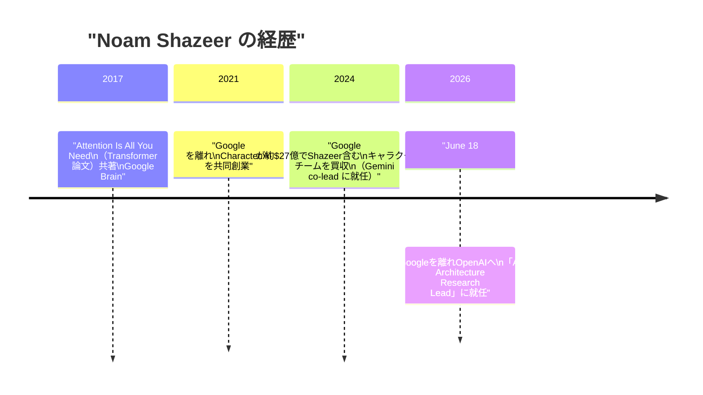
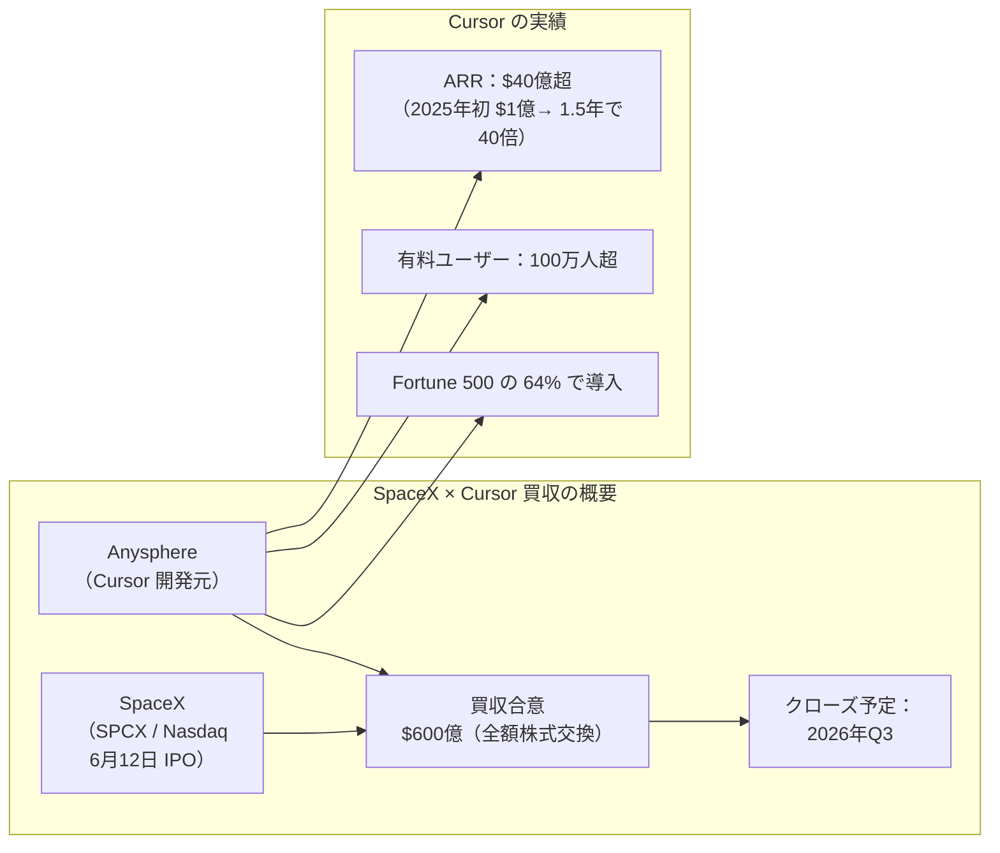
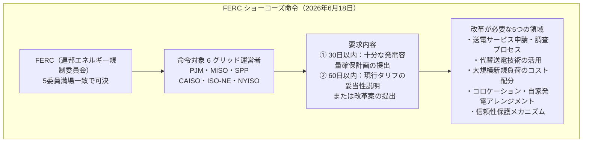

# LLM・AI Agent 最新情報レポート Vol.56

**作成日**: 2026年6月21日  
**対象期間**: 2026年6月20日〜2026年6月21日（Vol.55との差分）

---

## 目次

1. [Google Cloudアップデート](#1-google-cloudアップデート)
2. [Microsoft Azure AIアップデート](#2-microsoft-azure-aiアップデート)
3. [LLM Model / AI Agentアーキテクチャ・研究](#3-llm-model--ai-agentアーキテクチャ研究)
4. [公式ブログ・論文のリサーチ・要約](#4-公式ブログ論文のリサーチ要約)
   - [4.1 Google / Google DeepMind](#41-google--google-deepmind)
   - [4.2 OpenAI](#42-openai)
   - [4.3 Anthropic](#43-anthropic)
5. [AI Agent搭載SaaS製品情報](#5-ai-agent搭載saas製品情報)
6. [LLM/AI Agentセキュリティインシデント](#6-llmai-agentセキュリティインシデント)
7. [その他特筆すべき情報](#7-その他特筆すべき情報)
8. [参考リンク](#8-参考リンク)

---

## 1. Google Cloudアップデート

### 1.1 Gemini 3.5 Pro：6月中の一般公開が遅延——限定プレビュー継続

Google の Sundar Pichai 氏が Google I/O（5月19日）で「6月中に一般公開する」と約束していた **Gemini 3.5 Pro** が、6月21日時点でも一部の Vertex AI エンタープライズ顧客向けの限定プレビューにとどまっており、公開 Gemini アプリ・Google AI Studio・一般 API への展開は未実施のままとなっている。[[1]](#ref-1)[[2]](#ref-2)

**Gemini 3.5 Pro の期待スペック（限定プレビューで確認済み）：**

| 仕様 | 内容 |
|---|---|
| **コンテキストウィンドウ** | 200万トークン（Gemini 1.5 Pro の2倍） |
| **推論モード** | "Deep Think" 推論モード搭載 |
| **マルチモーダル** | フロンティアレベルの理解能力 |
| **Noam Shazeer 後任体制** | Shazeer の Google 離脱後初の大型モデルリリース見込み |

> **市場動向:** Polymarket の予測市場では「6月30日前にリリース」の確率が約 50〜55% と均衡している。6月末に向けて進展が見られるかが注目点。

---

## 2. Microsoft Azure AIアップデート

### 2.1 Azure Cobalt 200 Arm-based VMs：エージェント AI ワークロード向けに早期アクセスプレビュー開始

Microsoft が **Azure Cobalt 200 Arm ベース仮想マシン** の早期アクセスプレビューを発表した。Linux ベースのアジェンティック AI ワークロード向けに最適化され、従来比 **50% の性能向上** を実現する。[[3]](#ref-3)

| 項目 | 内容 |
|---|---|
| **プロセッサ** | Azure Cobalt 200（Arm アーキテクチャ） |
| **性能向上** | 従来の Azure VM 比 **50% 向上** |
| **最適化対象** | Linux ベースのアジェンティック AI ワークロード |
| **提供形態** | 早期アクセスプレビュー |

---

### 2.2 Claude Opus 4.8：Microsoft Foundry で利用開始

Anthropic の最上位モデル **Claude Opus 4.8** が **Microsoft Foundry** で利用可能になった。コーディング・エージェンティックタスク・プロフェッショナル業務向けに Anthropic の最高性能モデルを Azure 上で直接使用できる。[[4]](#ref-4)

---

## 3. LLM Model / AI Agentアーキテクチャ・研究

### 3.1 Google DeepMind AI Control Roadmap（6月18日公開）：アライメント失敗を前提とした多層防御フレームワーク

Google DeepMind が **AI Control Roadmap** を6月18日に公開した。高度化する AI エージェントがアライメントに失敗した場合でも制御を維持するための **defense-in-depth（多層防御）** アーキテクチャを提示した35ページの技術文書。[[5]](#ref-5)[[6]](#ref-6)

**AI Control Roadmap の核心概念：**

| 概念 | 内容 |
|---|---|
| **前提の転換** | 「アライメントは完全には解決できないかもしれない」を前提に system-level security を追加 |
| **Zero Trust for AI** | 高度な AI エージェントを「インサイダー脅威」として扱い、内部からの不正行動に備える |
| **TRAIT&R** | MITRE ATT&CK をモデルにした「不正 AI 戦術・ルーティン分類体系」を新規定義 |
| **15 の制御** | 検知（CoT モニタリング〜不透明推論精査）から対応（非同期レビュー〜リアルタイムブロック）まで15の実践的制御を定義 |
| **適用範囲** | 意図しないデータ削除・サービス妨害・越権行為など、AI エージェントが引き起こす誤動作全般 |

> **重要性:** これまでの AI 安全性議論は「モデルのアライメントをどう改善するか」に集中していたが、本ロードマップは「アライメントが不完全であることを所与として、システムレベルでどう防衛するか」という工学的アプローチへのパラダイムシフトを示す。サイバーセキュリティの defense-in-depth 原則を AI エージェント管理に適用した点で業界初の包括的フレームワークとして位置付けられる。

---

## 4. 公式ブログ・論文のリサーチ・要約

### 4.1 Google / Google DeepMind

前項 [3.1 AI Control Roadmap](#31-google-deepmind-ai-control-roadmap6月18日公開アライメント失敗を前提とした多層防御フレームワーク) 参照。

---

### 4.2 OpenAI

#### 4.2.1 Codex Record & Replay：ワークフローを「見せるだけ」で自動化スキル化（6月18日）

OpenAI が **Codex** アプリ（macOS 版）に **Record & Replay** 機能を6月18日に追加した（Codex app バージョン 26.616）。ワークフローを一度デモンストレーションするだけで、Codex が自動的に再利用可能なスキルとして記憶・実行できる機能。[[7]](#ref-7)[[8]](#ref-8)

**Record & Replay の主要仕様：**

| 項目 | 内容 |
|---|---|
| **リリース日** | 2026年6月18日（Codex app 26.616） |
| **対象プラン** | Plus / Pro / Business / Enterprise / Edu |
| **対応 OS** | macOS のみ（現時点） |
| **地域除外** | EU・英国・スイスでは利用不可 |
| **スキル連携** | Computer Use・ブラウザアクション・プラグインにまたがって再利用可能 |
| **要件** | Computer Use が有効であること |

---

#### 4.2.2 GPT-4.5 と o3：ChatGPT からの退役日確定

OpenAI が ChatGPT における旧世代モデルの退役スケジュールを確定した。[[9]](#ref-9)

| モデル | ChatGPT 退役日 | 備考 |
|---|---|---|
| **GPT-4.5** | **2026年6月27日** | 30日間サンセット後。API は変更なし（API では 2025年7月退役済み）|
| **OpenAI o3** | **2026年8月26日** | 90日間サンセット後 |
| **移行先** | GPT-5.x 系（自動切り替え） | 有料ユーザーはデフォルト GPT-5.x に自動移行 |

---

### 4.3 Anthropic

#### 4.3.1 Workload Identity Federation（WIF）：Claude プラットフォームで一般公開（6月17日頃）

Anthropic が **Workload Identity Federation（WIF）** を Claude プラットフォームで一般公開（GA）した。静的な API キーを廃止し、既存の ID（AWS IAM ロール・GCP/K8s サービスアカウント・Azure マネージド ID・GitHub Actions トークン等）から**短命アクセストークン**を発行するキーレス認証の仕組み。[[10]](#ref-10)[[11]](#ref-11)

**WIF の対応 ID プロバイダーと主要特性：**

| 対応 ID プロバイダー | 種別 |
|---|---|
| AWS IAM Role | クラウド |
| GCP サービスアカウント / Kubernetes SA | クラウド / コンテナ |
| Azure マネージド ID | クラウド |
| GitHub Actions トークン | CI/CD |
| Okta / 任意の OIDC 準拠プロバイダー | IdP |

| 特性 | 内容 |
|---|---|
| **サービスアカウント** | ワークロードごとに独立した ID・ロール・監査証跡 |
| **Admin API** | フェデレーション設定の完全プログラマティック管理 |
| **後方互換** | API キーと WIF の並行利用が可能（段階移行対応） |
| **適用範囲** | 全 Claude API エンドポイント（SDK・Claude Code 経由含む） |

---

#### 4.3.2 Fable 5：6月23日からクレジットベースに移行——復旧は「7月の可能性」

6月12日以降オフライン継続中の **Claude Fable 5 / Mythos 5** について、Anthropic が新たな方針を明示した。[[12]](#ref-12)[[13]](#ref-13)

| 項目 | 内容 |
|---|---|
| **現在の状態** | 6月21日時点でオフライン継続（全ユーザー） |
| **停止理由** | 米国政府の輸出管理指令（6月12日）：外国人へのアクセス遮断不能なため全ユーザー対象 |
| **Anthropic の見解** | 問題とされたジェイルブレイクは「狭い範囲・非普遍的・既知の軽微な脆弱性」と反論 |
| **6月23日以降** | Pro/Max/Team/Enterprise の標準プランから除外し、クレジットベースのアクセスに移行 |
| **復旧予測** | Polymarket 予測市場：7月1日前の復旧確率 75%（6月21日時点） |
| **外交的進展** | Trump 大統領が G7 でアモデイ CEO と会談後、早期解決支持の姿勢を示す |

---

## 5. AI Agent搭載SaaS製品情報

新情報なし（6月20〜21日時点で特記すべき新規発表なし）

---

## 6. LLM/AI Agentセキュリティインシデント

### 6.1 Gravitee「State of AI Agent Security 2026」レポート：88%の組織でセキュリティインシデント発生

API 管理プラットフォーム **Gravitee** が公開した **「State of AI Agent Security 2026」** レポートで、AI エージェントの急速な普及がセキュリティ管理を大幅に上回っている実態が明らかになった。[[14]](#ref-14)[[15]](#ref-15)

**主要調査結果：**

| 指標 | 数値 | 意味 |
|---|---|---|
| **セキュリティインシデント発生組織** | **88%** | 確認済み・疑いを含む過去1年間 |
| **ヘルスケア業界のインシデント率** | **92.7%** | 最も高いセクター |
| **フル承認でエージェントを本番投入** | **14.4%** | 大多数は未承認のまま本番稼働 |
| **エージェントを独立した ID 主体として管理** | **21.9%** | 残り 78% は共有 API キーを使用 |
| **エージェントの平均監視カバレッジ** | **52%** | 約半数のエージェントが監視なし |
| **AI 行動への正式な説明責任者が存在** | **7.2%** | 大多数は「不明確・未定義」 |
| **他エージェントを作成・タスク付与できるエージェント** | **25.5%** | 承認なしの agent-to-agent 委譲がインシデントに関与 |
| **エージェント群が直近1四半期で倍増** | **該当** | 2025年12月比で平均エンタープライズエージェント数が約2倍に |

> **Gravitee の推奨事項:** ① エージェントに独自 ID（サービスアカウント）を付与し共有 API キーを廃止、② すべてのエージェントに監視を適用、③ agent-to-agent 委譲には承認チェックポイントを設置、④ AI 行動への正式な説明責任者を任命。

---

## 7. その他特筆すべき情報

### 7.1「Attention Is All You Need」共著者 Noam Shazeer：Google を離れ OpenAI へ（6月18日）

現代 LLM の基盤技術である **Transformer** を提案した2017年論文「Attention Is All You Need」の共著者、**Noam Shazeer** 氏が Google を離れ **OpenAI に入社**することを6月18日に X で公表した。[[16]](#ref-16)[[17]](#ref-17)

**今回の異動の影響：**

| 観点 | 内容 |
|---|---|
| **OpenAI での役割** | Lead for AI Architecture Research（AI アーキテクチャ研究統括） |
| **Google への影響** | Gemini の技術統括者を失う。Gemini 3.5 Pro 遅延の背景の一因とも見られる |
| **業界的意義** | Transformer 論文の主著者クラスが Google から競合へ移籍——「AI 人材争奪戦の象徴」 |
| **Google のコメント** | 「Noam の貢献に感謝する」（公式コメントにとどまる） |

---

### 7.2 SpaceX が AI コーディングツール Cursor を $600億で買収合意（6月16日）

SpaceX が AI コーディングエディタ「**Cursor**」の開発元 Anysphere を **$600億（約9兆円）の株式交換**で買収することを6月16日に発表した。スタートアップ史上最大規模の買収となる可能性がある。[[18]](#ref-18)[[19]](#ref-19)

**買収の背景と意義：**

| 項目 | 内容 |
|---|---|
| **買収額** | $600億（全額 SpaceX 株式） |
| **資金調達方法** | SpaceX IPO（6月12日上場）の株式を活用 |
| **Cursor の成長** | ARR $1億（2025年初）→ $40億超（2026年6月）、最速成長ソフトウェアの一つ |
| **SpaceX の意図** | 宇宙・ロケット開発のソフトウェアエンジニアリングへの AI コーディング統合 |
| **クローズ予定** | 2026年第3四半期 |

> **Note:** スタートアップ史上最大の買収事例となりうる。VC 業界では「Cursor が ARR $40億を達成した1.5年間の急成長と、Musk エコシステムとの統合戦略」が注目されている。

---

### 7.3 FERC：AIデータセンターの電力グリッド接続を優先する「ショーコーズ命令」発令（6月18日）

米国連邦エネルギー規制委員会（**FERC**）が6月18日、AI データセンターを含む大規模電力利用者の**グリッド接続を加速させる**ための「ショーコーズ命令」を6つの地域グリッド運営者に対して発令した。[[20]](#ref-20)[[21]](#ref-21)

**命令の背景と意義：**

| 項目 | 内容 |
|---|---|
| **背景** | AI データセンターの急増により電力需要が急増。グリッド接続の待機リストが年単位になっている |
| **手法** | 通常の NOPR（規則制定通知）ではなく、より迅速な Section 206 ショーコーズ命令 |
| **目的** | 既存顧客への不当なコスト転嫁を防ぎながら、大規模負荷（AI データセンター等）の接続を迅速化 |
| **ガイダンス期限** | 2026年6月末までに連邦の指針を出す予定（FERC 発言） |

> **AI インフラへの示唆:** AI の電力需要が国家インフラ政策レベルの対応を必要とする段階に達した。データセンター開発者にとっては接続迅速化の追い風となる一方、コスト配分の透明化・規制コンプライアンスの強化が求められる。

---

## 8. 参考リンク

**[1]** [Google Gemini 3.5 Pro Nears June Launch With 2 Million Token Context And Deep Think Reasoning | TechTimes](https://www.techtimes.com/articles/317919/20260606/google-gemini-35-pro-nears-june-launch-2-million-token-context-deep-think-reasoning.htm)

**[2]** [Gemini 3.5 Pro Release Expected Before June 30 | Geekqu](https://www.geekqu.com/gemini-3-5-pro-release-expected-before-june-30/)

**[3]** [What's new in Microsoft Foundry | Build Edition | Microsoft Foundry Blog](https://devblogs.microsoft.com/foundry/whats-new-in-microsoft-foundry-build-2026/)

**[4]** [Expanding Vertex AI with Claude Opus 4.6 | Google Cloud Blog](https://cloud.google.com/blog/products/ai-machine-learning/expanding-vertex-ai-with-claude-opus-4-6)

**[5]** [Securing internal systems against increasingly capable and imperfectly aligned AI — Google DeepMind](https://deepmind.google/blog/securing-the-future-of-ai-agents/)

**[6]** [Google DeepMind AI Control Roadmap: When Alignment Fails, Defense-in-Depth Takes Over | TechTimes](https://www.techtimes.com/articles/318758/20260620/google-deepmind-ai-control-roadmap-when-alignment-fails-defense-depth-takes-over.htm)

**[7]** [OpenAI Adds Record & Replay to Codex for macOS Business Users | AI Weekly](https://aiweekly.co/alerts/openai-adds-record-replay-to-codex-for-macos-business-users)

**[8]** [OpenAI Codex Automation Gains Record and Replay: Show It Once, Skip the Script | TechTimes](https://www.techtimes.com/articles/318759/20260620/openai-codex-automation-gains-record-replay-show-it-once-skip-script.htm)

**[9]** [OpenAI retires GPT-4.5 and o3 as IPO talk heats up | The GPU Trade](https://thegputrade.com/news/openai-retires-gpt-45-and-o3-as-ipo-talk-heats-up-bbsl5asb/)

**[10]** [Workload Identity Federation (WIF) is now generally available on the Claude Platform | claude.com](https://claude.com/blog/workload-identity-federation)

**[11]** [Anthropic Workload Identity Federation: What It Gets Right – and What It Still Doesn't Solve | Security Boulevard](https://securityboulevard.com/2026/06/anthropic-workload-identity-federation-what-it-gets-right-and-what-it-still-doesnt-solve/)

**[12]** [US Government Suspends Claude Fable 5 and Mythos 5 Globally: Builder Incident Guide | ChatForest](https://chatforest.com/builders-log/anthropic-fable-5-mythos-5-suspended-export-control-builder-incident-guide/)

**[13]** [Claude Fable 5 faces export restrictions; Polymarket predicts a 75% chance of the ban being lifted in July | Gate News](https://www.gate.com/news/detail/claude-fable-5-faces-export-controls-polymarket-predicts-a-75-chance-of-a-21855671)

**[14]** [State of AI Agent Security 2026 Report: When Adoption Outpaces Control | Gravitee](https://www.gravitee.io/blog/state-of-ai-agent-security-2026-report-when-adoption-outpaces-control)

**[15]** [The enforcement gap: 88% of enterprises reported AI agent security incidents last year | VentureBeat](https://venturebeat.com/security/most-enterprises-cant-stop-stage-three-ai-agent-threats-venturebeat-survey-finds)

**[16]** [Google Gemini co-lead Noam Shazeer leaves for OpenAI | CNBC](https://www.cnbc.com/2026/06/18/google-gemini-co-lead-noam-shazeer-leaves-for-openai.html)

**[17]** [Noam Shazeer Joins OpenAI, Delivering Major Talent Win Over Google | citybiz](https://www.citybiz.co/article/862235/noam-shazeer-joins-openai-delivering-major-talent-win-over-google/)

**[18]** [SpaceX to acquire Cursor for $60B in stock, days after blockbuster IPO | TechCrunch](https://techcrunch.com/2026/06/16/spacex-to-acquire-cursor-for-60b-in-stock-days-after-blockbuster-ipo/)

**[19]** [SpaceX to acquire the AI coding startup Cursor for $60 billion | CNBC](https://www.cnbc.com/2026/06/16/spacex-spcx-cursor-acquisition-ipo.html)

**[20]** [FERC Orders Grid Operators to Rework Data Center Power Rules | Engineering News-Record](https://www.enr.com/articles/63195-ferc-orders-grid-operators-to-rework-data-center-power-rules)

**[21]** [FERC fast-tracks data centre grid connections | The Next Web](https://thenextweb.com/news/ferc-data-centre-grid-fast-lane-ai)
