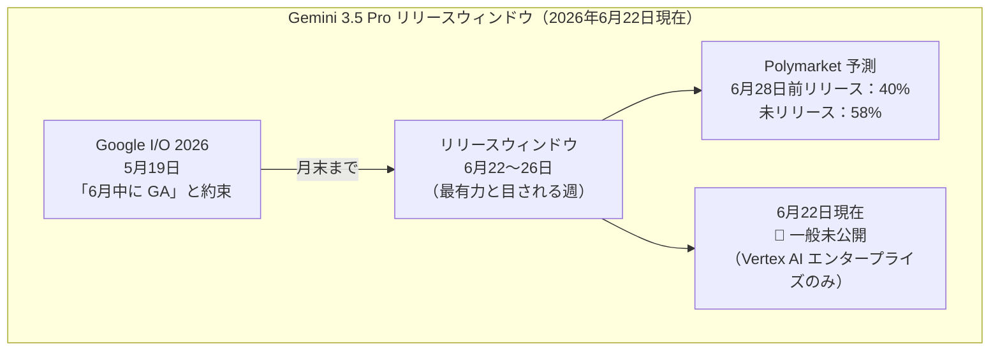
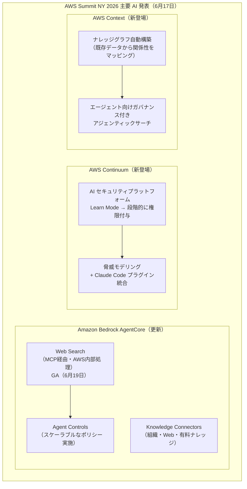
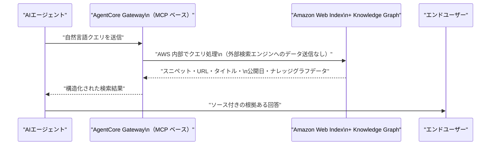
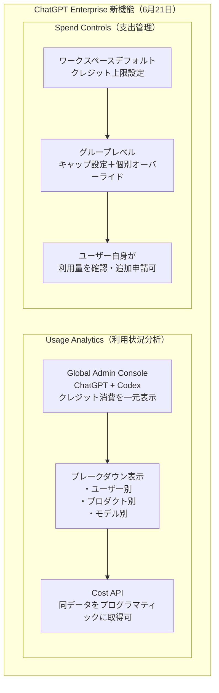
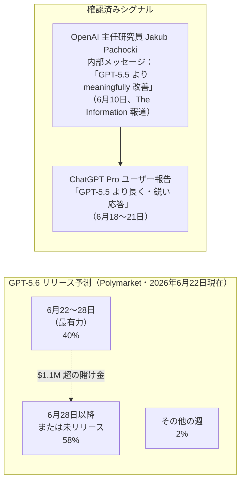
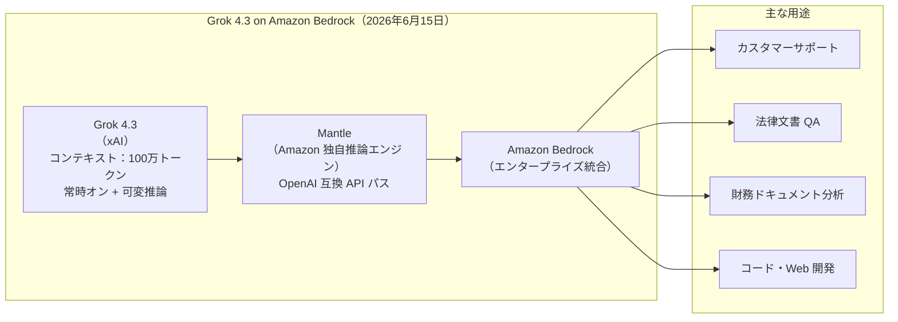
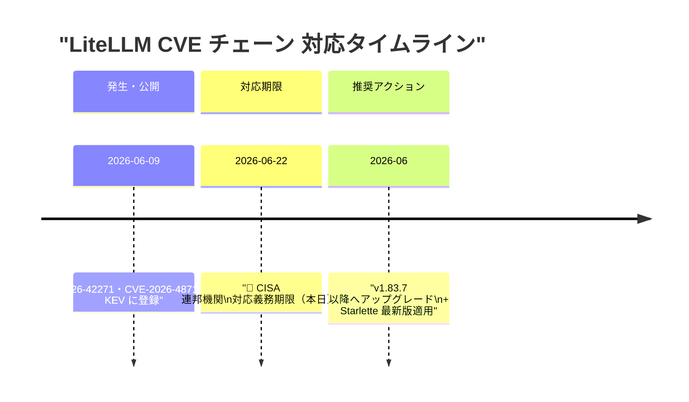

# LLM・AI Agent 最新情報レポート Vol.57

**作成日**: 2026年6月22日  
**対象期間**: 2026年6月21日〜2026年6月22日（Vol.56との差分）

---

## 目次

1. [Google Cloudアップデート](#1-google-cloudアップデート)
2. [Microsoft Azure AIアップデート](#2-microsoft-azure-aiアップデート)
3. [LLM Model / AI Agentアーキテクチャ・研究](#3-llm-model--ai-agentアーキテクチャ研究)
4. [公式ブログ・論文のリサーチ・要約](#4-公式ブログ論文のリサーチ要約)
   - [4.1 Google / Google DeepMind](#41-google--google-deepmind)
   - [4.2 OpenAI](#42-openai)
   - [4.3 Anthropic](#43-anthropic)
5. [AI Agent搭載SaaS製品情報](#5-ai-agent搭載saas製品情報)
6. [LLM/AI Agentセキュリティインシデント](#6-llmai-agentセキュリティインシデント)
7. [その他特筆すべき情報](#7-その他特筆すべき情報)
8. [参考リンク](#8-参考リンク)

---

## 1. Google Cloudアップデート

### 1.1 Gemini 3.5 Pro：6月22〜26日リリースウィンドウ突入——Polymarket で拮抗

6月22日（月）、Sundar Pichai が Google I/O（5月19日）で「6月中に一般公開する」と約束していた **Gemini 3.5 Pro** の「最もあり得る」リリースウィンドウが始まった。予測市場では依然として不確実性が高い状態が続いている。[[1]](#ref-1)[[2]](#ref-2)

**Gemini 3.5 Pro の確認済みスペック：**

| 仕様 | 内容 |
|---|---|
| **コンテキストウィンドウ** | 200万トークン（Gemini 1.5 Pro の2倍） |
| **推論モード** | "Deep Think"（拡張推論） |
| **予想価格** | 入力 $15 / 出力 $60 per 1M tokens |
| **特記事項** | Noam Shazeer 離脱後の初の大型モデルリリースと なる見込み |

> **注目ポイント:** 月末まで残り数日。モデルリリース時は Google の `blog.google` に一本のブログ記事として公開される形式（3.x 系モデル全て同様）。業界では「遅延」の認識が強まっており、月末を逃した場合の評判リスクが高まっている。

---

## 2. Microsoft Azure AIアップデート

新情報なし（6月21〜22日時点で特記すべき新規発表なし）

---

## 3. LLM Model / AI Agentアーキテクチャ・研究

### 3.1 AWS Summit NY 2026：AWS Continuum・AWS Context・AgentCore 新機能（6月17日）

6月17日に開催された **AWS Summit New York 2026**（Javits Convention Center）において、Swami Sivasubramanian（AWS VP of Agentic AI）が AI エージェントを中心とした複数の新機能を発表した。[[3]](#ref-3)[[4]](#ref-4)

**各サービスの概要：**

| サービス | 内容 | 状態 |
|---|---|---|
| **AWS Continuum** | AI ネイティブセキュリティプラットフォーム。「Learn モード」でまず環境を学習し、カテゴリ単位でユーザーが権限を付与するにつれ自律的に動作を拡大するトラストモデルを採用 | ゲーテッドプレビュー |
| **AWS Context** | 組織の既存データから関係性・ビジネスルール・ドメイン知識を自動的にナレッジグラフ化し、エージェントが実行時にガバナンス付きでアクセス可能にするサービス | 発表済み |
| **Kiro Mobile** | AI コーディングエージェント Kiro が iOS に対応。外出先からプロジェクト管理・エージェント操作が可能に | 発表済み |

> **アーキテクチャ上の意義:** AWS Continuum の「Learn → Permission」段階的トラストモデルは、前日レポートで取り上げた Google DeepMind AI Control Roadmap の「Zero Trust for AI」と同じ思想を実装面から具体化している。自律性が高まる AI エージェントに対し「事後的な監視」でなく「事前的なポリシー定義」で統制するアプローチがクラウド業界の標準になりつつある。

---

### 3.2 Amazon Bedrock AgentCore Web Search：一般公開（GA）（6月19日）

AWS が **Amazon Bedrock AgentCore Web Search** を6月19日に一般公開（GA）した。Amazon の Web インデックスとナレッジグラフを組み合わせた、AWS インフラ完結型のエージェント向けリアルタイム Web 検索機能。[[5]](#ref-5)[[6]](#ref-6)

**主要仕様：**

| 項目 | 内容 |
|---|---|
| **接続方式** | Model Context Protocol（MCP）経由で AgentCore Gateway に接続 |
| **価格** | **$7 / 1,000 クエリ**（API プロビジョニング・認証管理不要） |
| **提供リージョン** | US East（N. Virginia）（GA 初期） |
| **データプライバシー** | クエリは AWS インフラ内で完結、第三者検索エンジンへのデータ送信なし |
| **マルチソース** | Amazon Web Index + Amazon Knowledge Graph（Alexa+・Amazon Quick 実績をベース）を組み合わせ |
| **認証** | API 鍵・プロビジョニング不要。Gateway が AWS 内部でコネクタへの認証を処理 |

---

## 4. 公式ブログ・論文のリサーチ・要約

### 4.1 Google / Google DeepMind

新情報なし（6月21〜22日時点で特記すべき公式ブログ・論文なし）

---

### 4.2 OpenAI

#### 4.2.1 ChatGPT Enterprise：利用状況分析＆支出管理コントロール（6月21日）

OpenAI が **ChatGPT Enterprise** 向けに **クレジット利用分析（Usage Analytics）** と **支出管理コントロール（Spend Controls）** を6月21日に公開した。組織全体の AI 利用状況を可視化・コントロールする機能で、大規模展開における財務・ガバナンス管理を大幅に強化する。[[7]](#ref-7)[[8]](#ref-8)

**主要機能の詳細：**

| 機能 | 内容 |
|---|---|
| **利用状況ダッシュボード** | ChatGPT・Codex 横断のクレジット消費をユーザー・製品・モデル別にトレンド表示 |
| **Cost API** | 管理者が同一データを API 経由で取得し、社内システムへ統合可能 |
| **グループキャップ** | 部署・チーム単位でクレジット上限を設定しつつ、個別例外設定も可能 |
| **ユーザー自己管理** | 社員が自分の利用量を把握し、追加クレジットを申請できる UI を提供 |

> **背景:** AI コスト管理が CFO の重要課題となっている中、OpenAI はエンタープライズ顧客の「費用対効果の可視化」ニーズに応える機能を強化している。Anthropic の WIF（前号）と組み合わせると、コスト管理・セキュリティ両面での企業統制が整備されつつある。

---

#### 4.2.2 GPT-5.6：6月22日からリリースウィンドウ突入——Polymarket $110万超が賭け

6月21日付 TechTimes が報じたところによると、**GPT-5.6** は6月22日（月）からポリマーケットで最も賭けられている「6月22〜28日」ウィンドウに突入した。OpenAI の公式発表はまだないが、内部テスト段階のシグナルが複数出ている。[[9]](#ref-9)[[10]](#ref-10)

**GPT-5.6 の期待スペック（非公式情報）：**

| 項目 | 内容 |
|---|---|
| **コンテキストウィンドウ** | 150万トークン（GPT-5.5 の 100万から拡大） |
| **アライメント** | 報酬ハッキング失敗（GPT-5.5 の問題）を修正した新アライメントパイプライン |
| **知識カットオフ** | 2025年12月（更新予定） |
| **OpenAI の姿勢** | 公式発表なし。ただし Codex ログに「gpt-5.6-canary」の文字列が観測済み |

---

### 4.3 Anthropic

新情報なし（6月21〜22日時点で特記すべき公式ブログ・論文なし）

---

## 5. AI Agent搭載SaaS製品情報

### 5.1 xAI Grok 4.3：Amazon Bedrock で利用開始（6月15日）

xAI の推論特化モデル **Grok 4.3** が **Amazon Bedrock** で利用可能となった（6月15日）。xAI モデルが主要クラウドプラットフォームに登場するのは初めてで、Bedrock の独自推論エンジン「**Mantle**」上で動作する。[[11]](#ref-11)[[12]](#ref-12)

**価格と技術仕様：**

| 項目 | 内容 |
|---|---|
| **価格** | $1.25 / 100万入力トークン、$2.50 / 100万出力トークン |
| **キャッシュ入力** | $0.20 / 100万トークン |
| **比較** | 米国ラボのフロンティア推論モデルとして **Bedrock 最安値** |
| **推論エンジン** | Mantle（`bedrock-mantle` エンドポイント、`InvokeModel` / `Converse` API とは別） |
| **注意点** | 既存の Bedrock SDK コードは変更なしでは動作しない（Mantle 専用エンドポイントを使用） |
| **機能** | ツール呼び出し・構造化出力・レスポンスストリーミング対応 |

> **市場的意義:** Anthropic・OpenAI に続いて xAI が Bedrock に登場し、Amazon の「マルチプロバイダー LLM マーケットプレイス」戦略が加速。推論特化モデルとして最安値水準の価格設定は、コスト効率を重視するエンタープライズ RAG・エージェントワークロードを狙い打ちにしている。

---

## 6. LLM/AI Agentセキュリティインシデント

### 6.1 LiteLLM CVE チェーン：CISA 連邦機関対応期限（6月22日）が到来——未対応組織は即時対応を

前号（6月20日レポート）で取り上げた LiteLLM 脆弱性チェーン（CVE-2026-42271 + CVE-2026-48710）の **CISA 連邦機関向け対応義務期限が本日6月22日**に到来した。[[13]](#ref-13)[[14]](#ref-14)

| 項目 | 内容 |
|---|---|
| **期限到来** | **2026年6月22日**（本日）が CISA KEV の連邦機関対応義務期限 |
| **CVE チェーン** | CVE-2026-42271（CVSS 8.8）＋ CVE-2026-48710（BadHost）→ 組み合わせで非認証 RCE（CVSS 10.0） |
| **対象バージョン** | LiteLLM 1.74.2〜1.83.6（パッチ済み：v1.83.7 以降） |
| **影響** | LiteLLM proxy 経由で全 LLM API キーが侵害されるリスク |
| **野放し攻撃** | 開示直後から兵器化・実攻撃が確認済み |

> **非連邦組織向け:** CISA の義務対象は連邦機関だが、本脆弱性チェーンは公開直後から野放しの攻撃が確認されている。LiteLLM proxy を本番稼働中のすべての組織は、v1.83.7 以降への即時アップグレードと Starlette 更新を強く推奨する。AI ゲートウェイは社内の全 LLM API キーへのアクセスを持つため、侵害時の被害が甚大となる。

---

## 7. その他特筆すべき情報

新情報なし（6月21〜22日時点で特記すべき情報なし）

---

## 8. 参考リンク

**[1]** [Gemini 3.5 Pro Release Date June 2026: Confirmed Specs, Pricing & Launch Window | GrowwingAssistant](https://growwingassistant.com/ai-news/gemini-3-5-pro-release-date-june-2026-every-confirmed-spec-pricing-when-it-drops/)

**[2]** [Gemini 3.5 Pro Is Coming Next Month — What the Flash Release Already Tells Us | WaveSpeed Blog](https://wavespeed.ai/blog/posts/gemini-3-5-pro-coming-next-month/)

**[3]** [Top announcements of the AWS Summit in New York, 2026 | Amazon Web Services](https://aws.amazon.com/blogs/aws/top-announcements-of-the-aws-summit-in-new-york-2026/)

**[4]** [AWS Summit New York 2026: New AI agent innovations | About Amazon](https://www.aboutamazon.com/news/aws/aws-summit-nyc-2026-ai-agents)

**[5]** [Announcing Web Search on Amazon Bedrock AgentCore: Ground your AI agents in current, accurate web knowledge | Amazon Web Services](https://aws.amazon.com/blogs/aws/announcing-web-search-on-amazon-bedrock-agentcore-ground-your-ai-agents-in-current-accurate-web-knowledge/)

**[6]** [Introducing Web Search on Amazon Bedrock AgentCore | The AWS News Feed](https://aws-news.com/article/2026-06-19-introducing-web-search-on-amazon-bedrock-agentcore)

**[7]** [New usage analytics and updated spend controls for enterprises | OpenAI](https://openai.com/index/chatgpt-enterprise-spend-controls/)

**[8]** [OpenAI adds spend controls and usage analytics to ChatGPT Enterprise | Computerworld](https://www.computerworld.com/article/4187257/openai-adds-spend-controls-and-usage-analytics-to-chatgpt-enterprise-2.html)

**[9]** [GPT-5.6 Launch Window Starts Monday: Alignment Fix and 1.5M Token Context Inside | TechTimes](https://www.techtimes.com/articles/318799/20260621/gpt-56-launch-window-starts-monday-alignment-fix-15m-token-context-inside.htm)

**[10]** [When will GPT-5.6 be released? Predictions & Odds 2026 | Polymarket](https://polymarket.com/event/when-will-gpt-5pt6-be-released)

**[11]** [Grok 4.3 from xAI now available in Amazon Bedrock | AWS](https://aws.amazon.com/about-aws/whats-new/2026/06/grok-amazon-bedrock/)

**[12]** [Grok 4.3 Lands on Amazon Bedrock With 1M Token Context | Basenor](https://www.basenor.com/blogs/news/grok-4-3-lands-on-amazon-bedrock-with-1m-token-context)

**[13]** [LiteLLM CVE-2026-42271: Vulnerability Chain Details | CISA KEV](https://www.cisa.gov/known-exploited-vulnerabilities-catalog)

**[14]** [AWS Weekly Roundup: NY Summit recap, Local Zone in Hanoi, Grok 4.3 in Bedrock, price reductions, and more (June 22, 2026) | Amazon Web Services](https://aws.amazon.com/blogs/aws/aws-weekly-roundup-ny-summit-recap-local-zone-in-hanoi-grok-4-3-in-bedrock-price-reductions-and-more-june-22-2026/)
